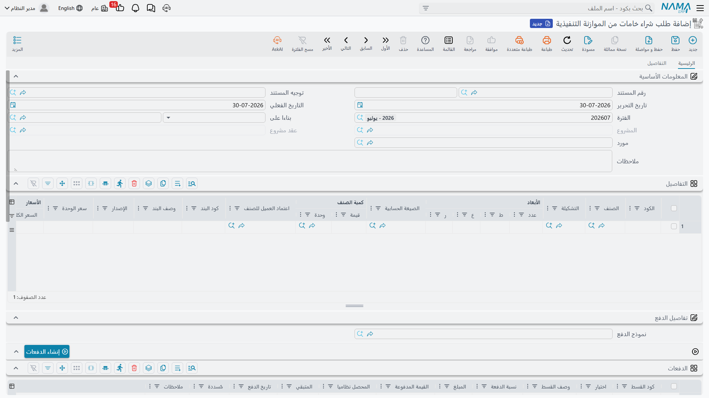

# طلب شراء خامات من الموازنة التنفيذية

[الموازنة التنفيذية](/ar/modules/contracting/budgets/contracting-executive-budget.md) المعتمدة تقول أي الخامات يحتاجها العمل، وبأي كمية، وبأي سعر اعتمده العميل. و**طلب شراء خامات من الموازنة التنفيذية** هو الطريقة التي يطلب بها الموقع تنفيذ ذلك الإنفاق: طلب شراء يُصدَر على الموازنة، وتُربَط سطوره بالاعتمادات التي وقّعها العميل.

تجده في **المقاولات > مقاولة مشروع > طلب شراء خامات من الموازنة التنفيذية**، ويحتاج ترخيص `contracting`.

## أي نوع من المستندات هذا

هو طلب شراء حقيقي، مبني على مستند الشراء القياسي في سلسلة التوريد، ويسكن في وحدة المقاولات. ولهذا فللشاشة صفحة شحن وشروط تسليم، وثماني خانات خصم، وأربع ضرائب، وأرقام تسلسلية ولوطات، وأعمدة مخزن وموقع، وجدول دفعات — كل ذلك موروث. والذي تضيفه المقاولات هو الرابط بالموازنة.

**الترويسة.** دفتر ورقم مستند، و**توجيه المستند**، وتاريخ التحرير والتاريخ الفعلي والفترة المالية، ثم:

| الحقل | ملاحظات |
|---|---|
| **بناءا على** | الموازنة التي يُصدَر عليها الطلب. ويقبل موازنة تنفيذية أو [تقديرية](/ar/modules/contracting/budgets/contracting-estimated-budget.md)، لكن التنفيذية فقط هي التي تُنتج الاعتمادات التي تُربَط بها السطور. |
| **المشروع** و**عقد مشروع** | يملؤهما النظام من الموازنة المختارة — لا تكتبهما |
| **مورد** و**الطلب** | من تنوي الشراء منه، والطلب الأصلي |
| **صالح من** / **صالح حتي** | مدة صلاحية الطلب |

وخيارات توجيه هذا المستند مشروحة في [توجيه مستندات المقاولات الأخرى](/ar/modules/contracting/document-terms/contracting-terms-other.md).

**جدول التفاصيل** سطر شراء كامل — الصنف والكمية بالوحدتين والسعر والخصومات والضرائب وصافي القيمة والمخزن والمحددات — زائد ثلاثة أعمدة من المقاولات:

| العمود | ماذا يفعل |
|---|---|
| **اعتماد العميل للصنف** | يسمّي اعتماد العميل لهذه الخامة. واختياره يملأ صنف السطر، ويفرض وحدة القياس الأساسية لذلك الصنف، وينسخ كود البند ووصفه من الاعتماد إلى السطر. |
| **كود البند** | يملؤه النظام من الاعتماد |
| **وصف البند** | يملؤه النظام من الاعتماد |

ثم كتلة الدفعات — نموذج دفع وإجراء **إنشاء الدفعات** وجدول الأقساط، ويُتحقق منها في مقابل المبلغ المتبقي — ثم كتلة الإجماليات وكتلة **المحددات**.

## هل تمنعني الموازنة من تجاوز الإنفاق؟

هذا هو السؤال الذي يسأله الجميع، والجواب الصادق يجب أن يُقال بدقة، لأن الجواب البديهي خطأ.

**لا شيء على الموازنة يمنع شيئاً.** حفظ موازنة تقديرية أو تنفيذية يُجري ثلاثة تحققات، وثلاثتها عن تطابق أكواد البنود: هل هذا الكود موجود في الموازنة المقابلة، وهل ذاك الكود موجود على العقد. ولا واحد منها يقارن كمية أو مبلغاً بحدٍّ. الموازنة خطة تقرأها، لا قفل.

**وهذا الطلب لا يتحقق من الموازنة كذلك.** إنه يسجّل نية شراء. ولا يقيّد تكلفة على بند موازنة، فليس هناك رقم متراكم يقارن به شيئاً، ولن يخرج من حفظه أي رفض متعلق بالموازنة. أصدر طلباً بعشرة أمثال الكمية المخططة وسيُحفَظ.

**وهناك سقف واحد بالضبط في الوحدة يعرف الموازنة، وهو يعمل على المستند الذي يصرف — لا على الموازنة ولا على الطلب.** وهو تحقق على **إجمالي التكلفة**، ولا يوجد إلا إذا شغّله أحد. وثلاثة أمور يجب أن تكون صحيحة:

1. **أن يكون سطر مستند الإنفاق قابلاً للنسبة إلى الموازنة.** أي أن يكون السطر على عقد مشروع مرتبطة به الموازنة، وأن يحمل السطر كود بند تلك الموازنة في عمود **كود بند الموازنة التنفيذية** أو **كود بند الموازنة التقديرية**. فالسطر الذي لا يحمل كود بند موازنة لا يساهم في التكلفة الفعلية للموازنة، ولا يوجد ما يُقارن.
2. **أن يكون المستند من المستندات التي تقيّد تكلفة على بند** — صرف خامات، أو أمر شراء، أو مستند سركى، أو مستخلص مقاول باطن، وهكذا. فسجلات التكلفة تُكتب عند معالجة المستند، وهي ما تُجمَّع منه **التكلفة الفعلية** على الموازنة.
3. **أن يكون توجيه ذلك المستند مُعلَّماً بالخيار**: **منع الحفظ اذا تعدت التكلفة الفعلية التكلفة المخططة**.

وبتحقق الثلاثة يرفض المستند الحفظ في اللحظة التي تتجاوز فيها التكلفة الفعلية المتراكمة على كود بند الموازنة إجمالي التكلفة المخططة لذلك السطر، برسالة *«التكلفة الفعلية … يجب أن تكون أقل من إجمالي التكلفة … لكود البند …»*.

::: tip ما تُعلّمه، وعلى أي المستندات
الخيار يسكن على **توجيه المستند** لكل مستند إنفاق، فيجب تعليمه مرة على كل توجيه تستخدمه — ولا يوجد مفتاح واحد عام. والمستندات التي تتيحه هي [أمر شراء المقاولات](/ar/modules/contracting/costs/contracting-purchasing.md)، و[صرف الخامات وإرجاعها](/ar/modules/contracting/costs/contracting-project-materials.md)، و[طلب وأمر وفاتورة المقاولات المتنوعة](/ar/modules/contracting/costs/contracting-misc-spend.md)، و[مستند السركى](/ar/modules/contracting/costs/contracting-daily-labour.md)، و[مستخلص مقاول الباطن](/ar/modules/contracting/contractor-contracting/contracting-contractor-extracts.md)، وغرامات المقاولات — ومن خارج الوحدة: القيد اليومي وسند الصرف والقبض وإشعارا الخصم والإضافة.

وصيغة الخيار نفسها تذكر كارت التحليل، لكن التحقق الذي يُشغّله ينطبق كذلك على بنود **الموازنة** وبنود **العقد**. فتعليمه لضبط كروت التحليل سيبدأ كذلك في رفض تجاوزات الموازنة، وهو عادةً ما كنت تريده — لكن اعلم أنه يفعل الأمرين.
:::

### أمران لا تعتمد عليهما

**خيار الكمية المرافق.** بجوار خيار التكلفة يجلس **منع الحفظ اذا تعدت الكمية الفعلية الكمية المخططة**. وهو لا يعمل على بنود الموازنة ولا بنود العقد؛ فالمقارنة على هذا النحو تجري على سطور كروت التحليل فقط. فإن احتجت حدّاً كمّياً على موازنة فلا تتوقع من هذا الخيار أن يعطيك إياه.

**لكن أمر الشراء يستطيع تحديد الكمية.** على توجيه [أمر شراء المقاولات](/ar/modules/contracting/costs/contracting-purchasing.md) خيار ثالث هو **عدم تخطي الكمية**، وهذا *يعمل* على سطر الموازنة: يقارن الكمية الموجودة على أوامر الشراء بالكمية المخططة على سطر الموازنة ويرفض الأمر إن كان سيتجاوزها. فإن كان الضبط الذي تريده هو «لا تطلب من هذه الخامة أكثر ممّا خططته الموازنة» فهذا هو الخيار، وأمر الشراء هو موضع تعليمه.

## البرج، خطوة بخطوة

تخطّط الموازنة التنفيذية `CEB-EXE-001` للبرج A (*الفنار للتطوير*، العقد `PC-2026-001` بقيمة **230,000**) البند `X-3` *مباني* بـ 2,000 م² وإجمالي تكلفة **82,000**. وبعد ثلاثة أشهر تراكمت من صرف الخامات والعمالة على `X-3` تكلفة فعلية **34,800** — فبقي من التكلفة المخططة 47,200 غير مصروفة.

**الطلب الأول — داخل الموازنة بأريحية.** الطلب `EBIR-2026-014` يطلب طوباً ومونة بـ **24,000** على الاعتماد `SUB-0031`، الذي يُنسخ كود بنده `X-3` إلى السطر. ويُحفَظ.

**الطلب الثاني — أبعد كثيراً من الخطة.** الطلب `EBIR-2026-019` يطلب **30,000** أخرى على سطر الموازنة نفسه. وسيبلغ الإنفاق الملتزم به 34,800 + 24,000 + 30,000 = **88,800** في مقابل خطة 82,000. **ويُحفَظ هو أيضاً بلا كلمة اعتراض** — لأن الطلب لا يقيّد تكلفة، ولأن لا شيء على الطلب ينظر في رصيد الموازنة المتبقي.

فحتى هذه اللحظة يتصرف الطلبان تصرفاً واحداً. والفرق يظهر بعد خطوة واحدة.

**إن لم يعلّم أحد الخيار.** يتحول الطلبان إلى صرف خامات، ويُعالَج الاثنان. فترتفع **التكلفة الفعلية** على السطر `X-3` إلى 58,800 ثم إلى 88,800، جالسةً في الجدول بجوار مخطط 82,000. ولم يُرفَض شيء قط؛ التجاوز ظاهر، وظاهر فقط.

**وإن علّمه أحد.** توجيه صرف الخامات مُعلَّم بـ *منع الحفظ اذا تعدت التكلفة الفعلية التكلفة المخططة*. فالصرف الأول يرفع التكلفة الفعلية إلى 58,800، وهي ما زالت تحت 82,000، فيُحفَظ. والصرف الثاني سيرفعها إلى 88,800 فيُرفض: *«التكلفة الفعلية 88,800 يجب أن تكون أقل من إجمالي التكلفة 82,000 … لكود البند X-3»*. وعلى المشتري أن يُجزّئ الأمر، أو يستصدر تعديل موازنة، أو يستصدر اعتماداً للتجاوز — وهذا بالضبط هو الضبط الذي كان يُفترض أن تعطيك إياه الموازنة، وبالضبط هو الضبط الذي لا تحصل عليه حتى يُعلَّم ذلك الخيار.

::: info أين يسكن الحدّ فعلاً
إن أخذت شيئاً واحداً من هذه الصفحة فليكن هذا: الموازنة هي الرقم، و**التوجيه هو الإلزام**، و**كود البند على سطر الإنفاق** هو ما يصل بينهما. اضبط الثلاثة فتصير موازنة المقاولات سقفاً صارماً. وأخطئ في واحد منها فتصير مستند اطلاع.
:::
