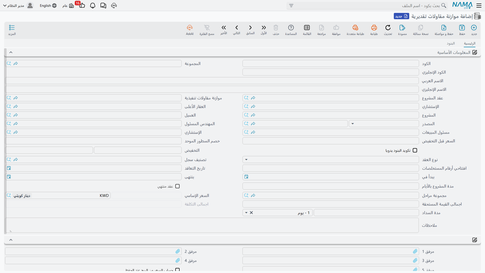
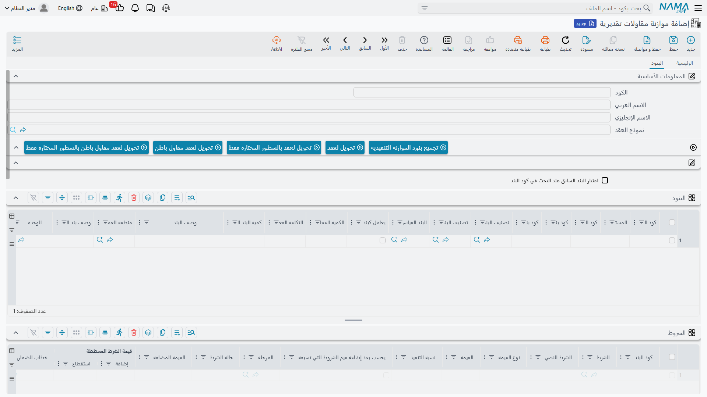

# الموازنة التقديرية

فوزك بعمل بقيمة 230,000 يخبرك بما سيدفعه العميل. ولا يخبرك بشيء عمّا إن كنت ستربح منه. والموازنة التقديرية هي الموضع الذي يسجّل فيه فريق التقدير جوابه عن السؤال الثاني: كل بند عمل في العقد، كم نتوقع فعلاً أن يكلّفنا؟

على عقد **البرج A** لصالح *الفنار للتطوير* — العقد `PC-2026-001` بقيمة **230,000** — كان جواب فريق التقدير **180,000**. هذا الرقم هو الموازنة التقديرية، وهذه الصفحة عن السجل الذي يحمله.

تجدها في **المقاولات > الملفات > موازنة مقاولات تقديرية**، وتحتاج ترخيص `contracting`.

## موازنتان، ولا واحدة منهما تُنشئ الأخرى

قبل أي شيء آخر، لنُنهِ أكبر التباس في هذا الجزء من الوحدة.

هناك ملفا موازنة — **الموازنة التقديرية** و[**الموازنة التنفيذية**](/ar/modules/contracting/budgets/contracting-executive-budget.md) — ويفترض القارئ عادةً وجود مسار متسلسل: تُعِدّ التقديرية، ثم تُعتمد، فيحوّلها النظام إلى التنفيذية. **هذا المسار غير موجود.** لا إجراء اسمه «إنشاء موازنة تنفيذية»، ولا اعتماد يرقّي إحداهما إلى الأخرى، ولا قاعدة تُلزِم بوجود إحداهما قبل الأخرى.

أما الموجود فعلاً فهو أبسط من ذلك:

- **كلتاهما ملف رئيسي**، لا مستند. لهما كود ومجموعة واسم عربي واسم إنجليزي؛ ولا دفتر مستند ولا تاريخ فعلي ولا فترة مالية، و**لا توجيه مستند** — ولهذا لا تنتج أي منهما قيداً محاسبياً ولا حركة مخزنية أبداً. وكلتاهما في مجموعة القوائم نفسها، **الملفات**، إلى جانب المشاريع والمقاولين.
- **كل منهما تُشير إلى الأخرى.** في الموازنة التقديرية حقل **الموازنة التنفيذية**، وفي التنفيذية حقل **الموازنة التقديرية**. املأ أحد الطرفين فيملأ النظام الطرف الآخر عند الحفظ. والاقتران واحد لواحد ومُلزَم: إن كانت الموازنة التي اخترتها مقترنة بموازنة أخرى من نوعك فسيفشل الحفظ برسالة *«السجل … مرتبط بالسجل … بالفعل»*.
- **كل منهما يمكن أن تُشير إلى عقد مشروع.** حقل **عقد المشروع** يربط الموازنة بالعقد الذي تخطّط له، وحفظ الموازنة يطبعها كذلك على العقد، فتظهر في ترويسة العقد الموازنات التابعة له.
- **يمكن أن يوجد العقد بلا أي منهما، ويمكن أن توجد الموازنة بلا عقد.** لا شيء في العقد يطلب موازنة. وكل تحقق في جانب الموازنة يتعلق بالعقد يتوقف ببساطة إن كان حقل عقد المشروع فارغاً. الموازنات ملفات ضبط تكلفة اختيارية: قوية إن استخدمتها، ويمكن تجاهلها تماماً إن لم تستخدمها.

::: tip الموازنة في بنيتها عقد لا يوقّعه أحد
الموازنة التقديرية مبنية على الأساس نفسه الذي بُني عليه عقد المشروع، ولهذا تبدو الشاشة مألوفة إلى هذا الحد: تاريخ التعاقد، ويبدأ في وينتهي، ومجموعة مراحل، وذمة محاسبية، وخصومات وضرائب في الترويسة، وجدول قائمة كميات كامل. اقرأها على أنها «سجل بشكل عقد يحمل نوايا تكلفة لا التزامات تجارية»، فيتوقف التصميم عن كونه مفاجئاً.
:::

## الترويسة

معظم الترويسة تعريف أو إجمالي لا تكتبه بنفسك. وهذه هي الحقول التي تعمل فعلاً:

| الحقل | لماذا يهم |
|---|---|
| **عقد المشروع** | العقد الذي تخطّط له هذه الموازنة؛ تركه فارغاً مسموح، لكنه يُعطّل تحققات كود بند المشروع الموصوفة أدناه |
| **الموازنة التنفيذية** | الموازنة المقابلة — وملؤه هنا يملأ الحقل المقابل هناك |
| **المشروع** و**العميل** | الموقع والعميل، كما على العقد |
| **الإستشاري** | [الاستشاري](/ar/modules/contracting/setup/contracting-contractors-and-consultants.md) المشرف؛ مرجع للتسمية والتقارير ولا يُحتسب منه شيء |
| **العقار الأعلى** | مشروع الوحدات العقارية الذي يتبعه هذا الإنشاء، حين يُراد [ترحيل تكلفة الإنشاء إلى الوحدات](/ar/modules/contracting/costs/contracting-realestate-cost-bridge.md) |
| **المصدر** | من أين نُسخت قائمة الكميات |
| **تكويد البنود يدويا** | يوقف التكويد الآلي للبنود لتكتب أكوادك بنفسك |
| **نوع العقد** و**العقد الرئيسي** | كما على العقد؛ والثاني هو السجل **الأصل** الذي يتفرّع منه هذا، وهو إجباري حين يكون النوع *ملحق* |
| **مجموعة مراحل** | مجموعة [المراحل](/ar/modules/contracting/setup/contracting-phases-and-work-areas.md) الافتراضية التي تُطبَّق على البنود |
| **حساب السعر من الربح عند الحفظ** | علّمه فيُحتسب سعر كل بند من تكلفته زائد هامش الربح، بدل أن يُشتق الهامش من سعر تكتبه |

وإلى جانبها أرقام المال المحتسبة — **السعر قبل التخفيض**، وزوج الخصم في الترويسة، وإجمالي السعر بعملته، و**اجمالى القيمة المستحقة** و**اجمالى التكلفة** — وفي أسفل الصفحة خمس خانات مرفقات، وكتلة **المحددات**: الشركة ومجموعة التحليل والفرع والقطاع والإدارة.

ولأن الشاشة موروثة من شاشة العقد فستقابل أيضاً حقولاً تخصّ حياة العقد لا حياة الموازنة: افتتاحي أرقام المستخلصات، وعقد منتهي، ومدة السداد، ومدة المشروع بالأيام. املأ ما يصف خطتك فعلاً واترك الباقي.

## صفحة البنود — حيث يسكن التقدير فعلاً

الصفحة الأولى لا تحمل أي جدول. وكل ما جئت من أجله يحدث في الصفحة الثانية، **البنود**.

الجدول هو جدول قائمة الكميات نفسه الذي تعرفه من العقد: سطر لكل بند عمل، كل منه يُشير إلى [بند قياسي](/ar/modules/contracting/setup/contracting-standard-terms.md)، والسطور تُشكّل شجرة بأكوادها المنقّطة، ولا تحمل المال إلا السطور الطرفية. والذي يجعل السطر سطر موازنة لا سطر عقد ثلاثة أعمدة إضافية:

| العمود | ماذا يفعل |
|---|---|
| **كود بند المشروع** | يسمّي نظير السطر في عقد المشروع المرتبط. ويُتحقق منه عند الحفظ: يجب أن يكون الكود موجوداً على ذلك العقد. |
| **كود بند الموازنة التنفيذية** | يسمّي نظير السطر في الموازنة التنفيذية المقترنة، بالكود أيضاً، ويُتحقق منه عند الحفظ كذلك. |
| **وصف بند الموازنة التنفيذية** | وصف حرّ للسطر المقابل. |

وعمودان آخران يملؤهما النظام، وهما مغزى الاحتفاظ بموازنة من أصله:

- **الكمية الفعلية** و**التكلفة الفعلية**. كل مستند يصرف مالاً على كود بند — صرف الخامات، ومستند السركى، ومستخلصات مقاولي الباطن، وأوامر الشراء، والفواتير المتنوعة — يكتب سجل تكلفة عند معالجته، ثم تُجمَّع تلك السجلات على سطر الموازنة المطابق. فـ*التكلفة الفعلية* على سطر الموازنة هي رقم «المخطط مقابل الفعلي» عندك، جالساً على بعد عمود واحد من التكلفة التي خططتها. وقائمة ما يساهم فيها كاملة في [كيف تتكوّن تكلفة المشروع](/ar/modules/contracting/costs/contracting-cost-model.md).
- **الكمية | من حصر الكميات** يكتبه [حصر كميات الموازنة](/ar/modules/contracting/budgets/contracting-budget-execution.md) — أي التقدّم المادي، في مقابل المال المصروف.

وفوق الجدول زر **تجميع بنود الموازنة التنفيذية**، وبجواره زوج **تحديث الأكواد** و**تحديث أكواد البنود الفارغة فقط** الموجود على العقد، وأزرار *التحويل لعقد* الأربعة.

::: warning «تجميع بنود الموازنة التنفيذية» يستبدل ما في الجدول
الزر ينسخ كل بنود الموازنة التنفيذية المقترنة إلى جدول هذه الموازنة — بأسعارها وتكاليفها. إنه نسخ لا دمج. استخدمه حين تريد إحضار هيكل مبنيّ بالفعل؛ ولا تضغطه على موازنة أمضيت أصيلاً في كتابتها. ونظيره على الموازنة التنفيذية هو **تجميع بنود الموازنة التقديرية**.
:::

وتحت جدول البنود تأتي جداول تحليل التكلفة الأربعة — **مواد خام** و**عمالة** و**مقاول باطن** و**مصروفات أخري** — وهي نفسها الموجودة على [عرض السعر](/ar/modules/contracting/project-contracting/contracting-offers.md) وعلى [كارت تحليل البند](/ar/modules/contracting/setup/contracting-term-analysis-cards.md). وفيها تُبنى تكلفة وحدة البند من مكوناتها بدل كتابتها رقماً واحداً. وأخيراً جدول **الشروط**، لتسجيل شروط المحتجز والاستقطاعات التي تفترضها الخطة.

## الموازنة التقديرية للبرج

يحمل العقد `PC-2026-001` أربعة بنود طرفية مسعّرة: `1.01` *حفر* (1,000 م³)، و`2.01` *خرسانة مسلحة* (60 م³)، و`3.01` *مباني* (2,000 م²)، و`3.02` *بياض* (1,000 م²). وموازنة فريق التقدير `CEB-EST-001` تحاكيها:

| كود البند | كود بند المشروع | كود بند الموازنة التنفيذية | بند العمل | الكمية | تكلفة الوحدة | اجمالى التكلفة |
|---|---|---|---|---|---|---|
| `E-1` | `1.01` | `X-1` | حفر | 1,000 م³ | 36.00 | 36,000 |
| `E-2` | `2.01` | `X-2` | خرسانة مسلحة | 60 م³ | 740.00 | 44,400 |
| `E-3` | `3.01` | `X-3` | مباني | 2,000 م² | 40.00 | 80,000 |
| `E-4` | `3.02` | `X-4` | بياض | 1,000 م² | 19.60 | 19,600 |

إجمالي التكلفة في الترويسة **180,000** في مقابل قيمة عقد 230,000، أي هامش مخطط 50,000. ولاحظ أن تكاليف الوحدة هذه أهداف المقدِّر نفسه، وهي أضيق عن قصد من أرقام التكلفة المبنية على الأسعار التي تحملها بنود العقد؛ فالموازنة هي موضع التفكير الجدي في التكلفة، والعقد ليس إلا موضع تخطيطها الأول.

## ما يتحقق منه النظام عند الحفظ

التحققات الثلاثة كلها عن **تطابق أكواد البنود**، ويجدر قول معنى ذلك صريحاً:

1. ألا تكون الموازنة التنفيذية المقابلة مقترنة بموازنة تقديرية أخرى.
2. أن يكون كل **كود بند الموازنة التنفيذية** على السطور موجوداً كود بند في الموازنة التنفيذية المقترنة — والتحقق يجري في الاتجاهين، فكل سطر في التنفيذية يسمّي كوداً تقديرياً يجب أن يجده هنا كذلك.
3. أن يكون كل **كود بند المشروع** موجوداً كود بند على عقد المشروع المرتبط.

وفوق ذلك يُتحقق من جدول الشروط كما على العقد، ومن اتساق شجرة الأكواد المنقّطة بين الأصل والفرع.

::: info هذه تحققات ارتباط لا حدود إنفاق
لا واحد منها يقارن كمية أو قيمة بأي حدّ. تُحفَظ الموازنة بلا اعتراض وسطورها بتكاليف لا صلة لها بالعقد، وحفظها لا يمنع إصدار أي مستند آخر. وإن كنت تبحث عن جواب سؤال «هل تمنع الموازنة تجاوز الإنفاق؟» فهو في [طلب شراء خامات من الموازنة التنفيذية](/ar/modules/contracting/budgets/contracting-budget-item-requests.md) — والجواب المختصر أن الموازنة نفسها لا تمنع شيئاً.
:::

## تحويل الموازنة إلى عقد

أزرار *التحويل* الأربعة فوق جدول البنود — إلى عقد مشروع، وإلى عقد مقاول باطن، ونسختا «بالسطور المختارة فقط» — هي الإجراءات نفسها التي يحملها عرض السعر أو المقايسة. وكل منها يفتح عقداً جديداً غير محفوظ مملوءاً من ترويسة هذه الموازنة وبنودها، لتراجعه وتحفظه. وهذا طريق حقيقي إلى سلسلة العقود، ينفع حين تُبنى الموازنة قبل توقيع أي شيء، ويفسّر كيف توجد موازنة بلا عقد مشروع خاص بها: فقد تكون هي ما جاء منه العقد لا ما يصفه.

## إلى أين بعد ذلك

السجل المقابل والشيء الوحيد الذي يفعله دونها — إنشاء اعتمادات العميل — في [الموازنة التنفيذية](/ar/modules/contracting/budgets/contracting-executive-budget.md). وقياس التقدّم على الموازنة في [حصر كميات الموازنة](/ar/modules/contracting/budgets/contracting-budget-execution.md). وسؤال الإلزام مُجاب كاملاً في [طلب شراء خامات من الموازنة التنفيذية](/ar/modules/contracting/budgets/contracting-budget-item-requests.md).
