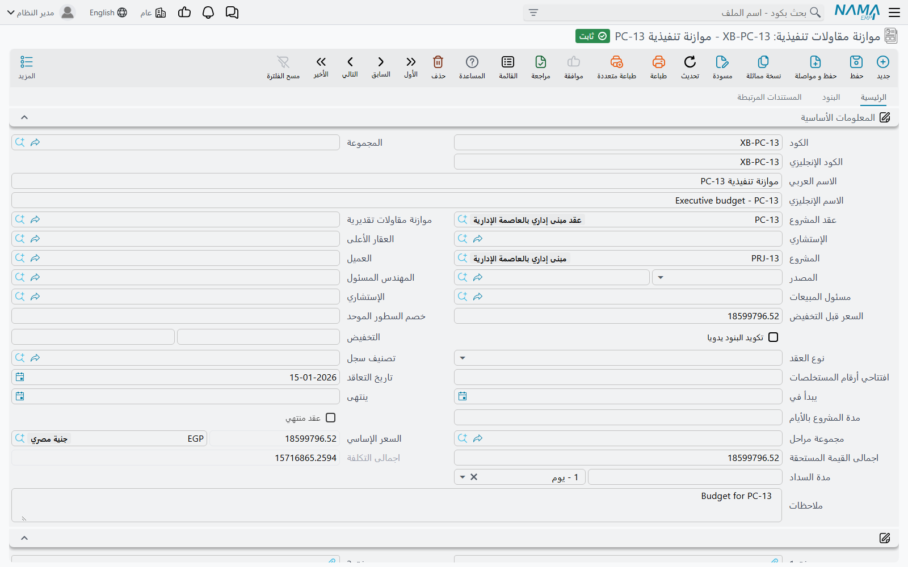
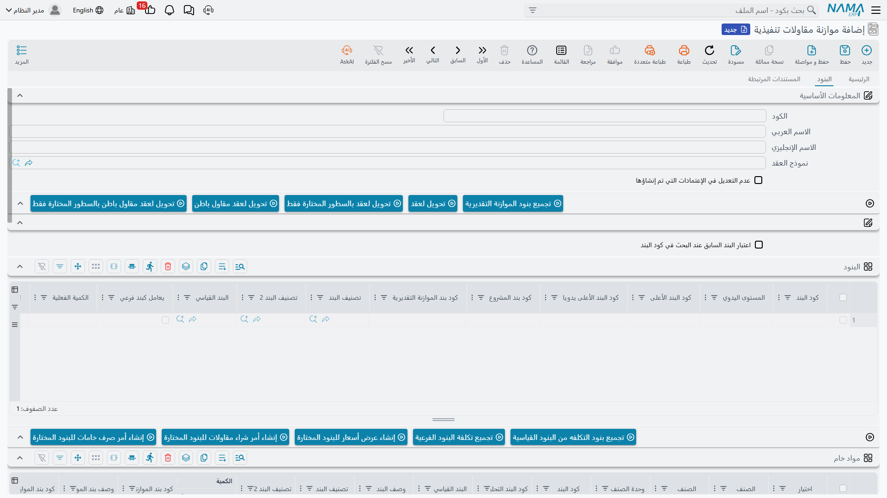

# الموازنة التنفيذية

[الموازنة التقديرية](/ar/modules/contracting/budgets/contracting-estimated-budget.md) هي ما يرى فريق التقدير أن العمل سيكلّفه. والموازنة التنفيذية هي الرقم الذي وافقت الإدارة على إنفاقه. الشكل واحد والسلطة مختلفة — وبينهما فرق وظيفي حقيقي واحد: الموازنة التنفيذية هي السجل الوحيد في الوحدة الذي يستطيع إنشاء **اعتمادات العميل للأصناف**، أي الموافقات لكل صنف التي يوقّعها العميل أو الاستشاري قبل أن يُسمح لك بالشراء.

ونواصل مع **البرج A** لصالح *الفنار للتطوير*: العقد `PC-2026-001` بقيمة **230,000**، والموازنة التقديرية `CEB-EST-001` بـ 180,000، والآن النسخة المعتمدة من الخطة نفسها، `CEB-EXE-001`، بـ **185,000**.

تجدها في **المقاولات > الملفات > موازنة مقاولات تنفيذية**، وتحتاج ترخيص `contracting`.

## ما هي، وما ليست

كل ما قيل عن *طبيعة* الموازنة التقديرية ينطبق هنا حرفاً بحرف، ويستحق التكرار لأنه الجزء الذي يُخطئ فيه الناس:

- هي **ملف رئيسي** لا مستند. لا دفتر مستند ولا تاريخ فعلي ولا فترة مالية، و**لا توجيه مستند** — وبالتالي **لا أثر محاسبي ولا حركة مخزنية، أبداً**. حفظ موازنة تنفيذية لا يحرّك مالاً.
- مكانها في مجموعة قوائم **الملفات**، لا في مجموعة مستندات، وإن كانت تتصرف كخطة تراجعها مع الوقت.
- **لا واحدة من الموازنتين تُنشئ الأخرى.** الرابط بينهما حقل مرجع متبادل وزرّا نسخ متناظران، وهذا كل شيء. ولا توجد خطوة اعتماد تُرقّي التقديرية إلى تنفيذية.
- **يمكن أن يوجد عقد المشروع بلا أي من الموازنتين**، ويمكن أن توجد الموازنة التنفيذية بلا عقد. حقل **عقد المشروع** اختياري في الطرفين.

::: tip ترتيب العمل في الواقع
سعّر العمل بـ[عرض سعر](/ar/modules/contracting/project-contracting/contracting-offers.md) أو [مقايسة](/ar/modules/contracting/project-contracting/contracting-assays.md) ← وقّع [عقد المشروع](/ar/modules/contracting/project-contracting/contracting-project-contract.md) ← أنشئ الموازنة التقديرية ووجّهها إلى العقد ← أنشئ الموازنة التنفيذية ووجّهها إلى العقد *وإلى* الموازنة التقديرية، ثم اضغط **تجميع بنود الموازنة التقديرية** لإحضار الهيكل وتنقيح الأرقام. ولا خطوة من هذه مُلزَمة؛ هذا عُرف لا مسار مفروض.
:::

## الترويسة — خيار واحد لا تحمله التقديرية

الترويسة هي ترويسة الموازنة التقديرية: عقد المشروع، ورابط الموازنة المقابلة، والمشروع، والعميل، و[الاستشاري](/ar/modules/contracting/setup/contracting-contractors-and-consultants.md)، والعقار الأعلى، والمصدر، ونوع العقد، ومجموعة المراحل، والتواريخ، وكتلة المال المحتسبة، والمرفقات، وكتلة **المحددات**.

والإضافة في الصفحة الثانية، وهي مهمة:

**عدم التعديل في الإعتمادات التي تم إنشاؤها**. علّمه فيُتخطى إنشاء الاعتمادات الموصوف أدناه تماماً من تلك اللحظة. وهو المفتاح الذي تستخدمه بعد أن يعتمد العميل مجموعة اعتمادات ولا تريد أن يمسّها تعديل لاحق على الموازنة.

## صفحة البنود

الجدول هو جدول قائمة الكميات، وأعمدة الموازنة فيه تُشير في الاتجاه المعاكس لأعمدة الموازنة التقديرية:

| العمود | ماذا يفعل |
|---|---|
| **كود بند المشروع** | كود البند المطابق على عقد المشروع المرتبط؛ يُتحقق منه عند الحفظ |
| **كود بند الموازنة التقديرية** | كود البند المطابق في الموازنة التقديرية المقترنة؛ يُتحقق منه عند الحفظ، وفي الاتجاهين |
| **الكمية الفعلية** / **التكلفة الفعلية** | يملؤهما النظام. كل مستند إنفاق يكتب سجل تكلفة على كود بند عند معالجته، ثم تُجمَّع تلك السجلات على سطر الموازنة المطابق. وهذا الزوج هو «المخطط مقابل الفعلي» عندك. |
| **الكمية \| من حصر الكميات** | يكتبه [حصر كميات الموازنة](/ar/modules/contracting/budgets/contracting-budget-execution.md) — تقدّم مادي لا مال |
| **نسبة السماحية** | مقدار التجاوز المسموح به في تنفيذ هذا البند؛ وهو ما يقيس عليه تحقق الكمية في حصر الموازنة |

وفوق الجدول: **تجميع بنود الموازنة التقديرية**، وزوج **تحديث الأكواد** و**تحديث أكواد البنود الفارغة فقط**، وأزرار *التحويل لعقد* الأربعة.

::: warning «تجميع بنود الموازنة التقديرية» يستبدل الجدول
الزر ينسخ كل بنود الموازنة التقديرية المقترنة — بأسعارها وتكاليفها — إلى هذا الجدول. إنه نسخ لا دمج. اضغطه أولاً ثم أعِد التكويد والتنقيح؛ ولا تضغطه بعد أن تنتهي من التنقيح.
:::

وتحت جدول البنود تجلس جداول تحليل التكلفة الأربعة (**مواد خام** و**عمالة** و**مقاول باطن** و**مصروفات أخري**) التي تُفكّك تكلفة وحدة البند إلى مكوناتها، وجدول **الشروط**.

### تسمية صنف على سطر موازنة

عمود واحد يحدد إن كانت هذه الموازنة تستطيع تشغيل الشراء من أصله: **الصنف**، وبجواره **اعتماد العميل للصنف**. ولا يظهر أي منهما افتراضياً؛ إنما يظهران حين يكون خيار الوحدة **إظهار الصنف و اعتماد العميل للصنف في العقد و الموازنة التقديرية و التنفيذية** مُشغَّلاً — راجع [إعدادات المقاولات](/ar/modules/contracting/contracting-configuration.md).

وهذا مهم لأن إنشاء الاعتمادات، أدناه، لا ينظر إلا في السطور التي تسمّي صنفاً. فموازنة من بنود عمل خالصة — حفر، مباني — لا تُنشئ شيئاً، وموازنة سطورها تسمّي الخامات التي تستهلكها تلك البنود تُنشئ اعتماداً لكل خامة.

## الموازنة التنفيذية للبرج

`CEB-EXE-001`، مقترنة بـ`CEB-EST-001`، ومرتبطة بالعقد `PC-2026-001`. ضغط المستخدم **تجميع بنود الموازنة التقديرية**، ثم أعاد تكويد السطور الأربعة المنسوخة ورفع الأرقام:

| كود البند | كود بند المشروع | كود بند الموازنة التقديرية | بند العمل | الكمية | تكلفة الوحدة | اجمالى التكلفة |
|---|---|---|---|---|---|---|
| `X-1` | `1.01` | `E-1` | حفر | 1,000 م³ | 37.50 | 37,500 |
| `X-2` | `2.01` | `E-2` | خرسانة مسلحة | 60 م³ | 760.00 | 45,600 |
| `X-3` | `3.01` | `E-3` | مباني | 2,000 م² | 41.00 | 82,000 |
| `X-4` | `3.02` | `E-4` | بياض | 1,000 م² | 19.90 | 19,900 |

إجمالي التكلفة في الترويسة **185,000** في مقابل عقد 230,000، أي هامش معتمد 45,000، أضيق من التقدير بـ 5,000. وعند الحفظ تنجح التحققات الثلاثة: `E-1` إلى `E-4` موجودة في الموازنة التقديرية، و`X-1` إلى `X-4` موجودة هنا، و`1.01` و`2.01` و`3.01` و`3.02` موجودة على العقد.

## اعتمادات العميل للأصناف — الشيء الوحيد الذي تفعله التنفيذية دون التقديرية

تُلزِم كثير من عقود الإنشاء المقاول بالحصول على موافقة العميل أو الاستشاري المكتوبة على كل خامة قبل شرائها: هذه الماركة من الحديد، بهذا السعر، بهذه الكمية. وفي نظام نما تلك الموافقة هي **اعتماد العميل للصنف**، والموازنة التنفيذية تستطيع إنشاءها لك بدل أن يكتب أحدهم اعتماداً لكل خامة.

وتعمل هكذا، لحظة حفظ الموازنة:

1. إن كان **عدم التعديل في الإعتمادات التي تم إنشاؤها** مُعلَّماً فلا يحدث شيء على الإطلاق.
2. وإلا فلا يجري الإنشاء إلا إذا كان خيار الوحدة **إنشاء سند اعتماد عميل للصنف لكل سطر به صنف** مُشغَّلاً. ومع إيقافه لا يحدث شيء كذلك — هذا هو المفتاح الرئيسي.
3. ولكل بند **يسمّي صنفاً** — والسطور بلا صنف تُتخطى — يجد النظام الاعتماد الذي أنشأه لذلك السطر سابقاً أو يُنشئ اعتماداً جديداً، وينسخ إليه الكمية ووحدة القياس والوصف وسعر الوحدة وتكلفة الوحدة وكود البند، مع تسجيل الموازنة مصدراً للاعتماد.
4. ويأتي دفتر الاعتماد الجديد وتوجيهه من خيارَي الوحدة **دفتر الاعتماد المنشأ** و**توجيه الاعتماد المنشأ**. اضبط هذين قبل تشغيل الإنشاء، وإلا فلا يوجد ما يُصنَّف الاعتماد تحته.
5. ويُكتب الاعتماد على سطر الموازنة في عمود **اعتماد العميل للصنف**، لترى من الموازنة أي اعتماد يتبع أي سطر.

::: warning إعادة حفظ الموازنة تحذف اعتمادات لم تَعُد تعرفها
الإنشاء مزامنة لا إضافة. فأي اعتماد أُنشئ من هذه الموازنة سابقاً ولم يَعُد مطابقاً لأحد سطورها **يُحذف** عند إعادة حفظ الموازنة — وحذف الموازنة يحذف اعتماداتها المُنشأة كذلك. فإن كانت الموافقات قد تمّت فعلاً فعلّم **عدم التعديل في الإعتمادات التي تم إنشاؤها** قبل أن تلمس البنود.
:::

وما يحدث للاعتماد بعد ذلك — من يسجّل موافقة الكمية والسعر عليه، وماذا تعني حالات الاعتماد — في [طلبات الرفع والاعتمادات والتسليم](/ar/modules/contracting/project-contracting/contracting-measurements-and-approvals.md).

## صفحة المستندات المرتبطة

للموازنة التنفيذية صفحة ثالثة، **المستندات المرتبطة**، لا تملكها التقديرية. وتحمل قائمتين مدمجتين مُرشَّحتين على هذه الموازنة: **اعتمادات العميل للأصناف** المُنشأة منها، و[**طلبات شراء الخامات من الموازنة التنفيذية**](/ar/modules/contracting/budgets/contracting-budget-item-requests.md) المُصدَرة عليها. وهي شاشة تصفّح لا شيء يُملأ فيها، لكنها أسرع طريق لرؤية ما أحدثته الموازنة.

## ما يتحقق منه النظام، وما لا يتحقق منه

التحققات الثلاثة عند الحفظ هي نفسها في الموازنة التقديرية، وكلها عن تطابق أكواد البنود: ألا تكون الموازنة المقابلة مقترنة بغيرها؛ وأن يكون كل **كود بند الموازنة التقديرية** موجوداً في الموازنة التقديرية المقترنة (في الاتجاهين)؛ وأن يكون كل **كود بند المشروع** موجوداً على عقد المشروع المرتبط. ويُتحقق كذلك من جدول الشروط ومن شجرة الأكواد بين الأصل والفرع.

::: info الموازنة التنفيذية لا تُقفل الإنفاق
اعتماد موازنة هنا لا يمنع عملية شراء أو صرف أو فاتورة واحدة. والسقف الوحيد في الوحدة الذي يعرف الموازنة يسكن على المستندات التي *تصرف*، ولا يعمل إلا إذا عُلِّم خيار على توجيهها. وهذا مشروح كاملاً، مع الخيار الذي يجب تعليمه بالتحديد، في [طلب شراء خامات من الموازنة التنفيذية](/ar/modules/contracting/budgets/contracting-budget-item-requests.md).
:::
