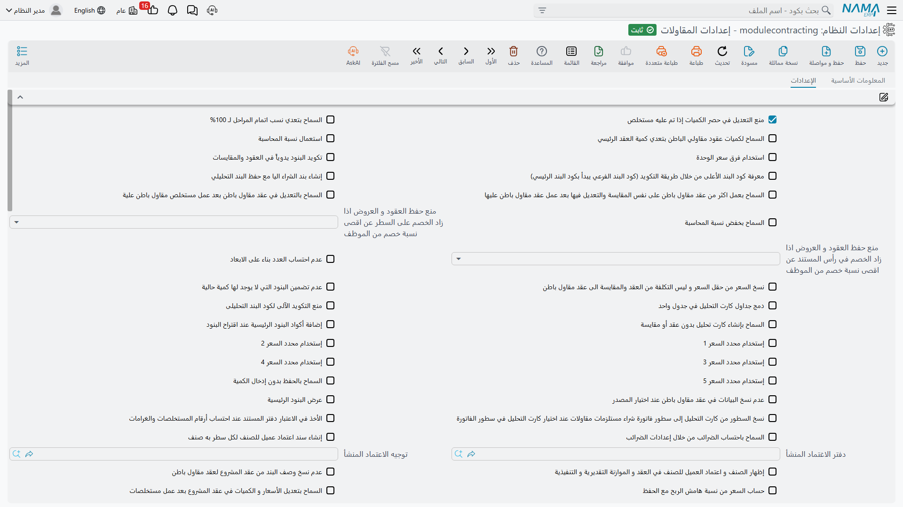

# إعدادات المقاولات

تحفظ وحدة المقاولات إعداداتها في سجل واحد، وهذا السجل يشكّل سلوك كل عقد ومستخلص ومستند تكلفة في قاعدة البيانات. وعدد من مفاتيحه يغيّر الحساب نفسه لا الشكل — هل يُسعّر المستخلص كمية هذا الشهر أم الكمية التراكمية، هل تُكتَب أكواد البنود يدوياً أم تُولَّد، وأي رقم تكلفة يرثه عقد مقاول الباطن — فيستحق قراءة متأنية قبل أول عقد حقيقي، لا قراءة متحيّرة بعده.

على الشاشة نحو تسعين خياراً، وتظهر جميعها في قائمة واحدة طويلة بترتيب التعريف: **صفحة واحدة، وكتلة واحدة، بلا تبويبات وبلا عناوين مجموعات**. لذلك تتجاهل هذه الصفحة ترتيب الشاشة تماماً وتجمع الخيارات بحسب ما تؤثر فيه. وإن كنت تبحث عن خيار بعينه فاستخدم بحث المتصفح بدلاً من التمرير في الشاشة.

## سجل واحد لقاعدة البيانات كلها

حقيقتان عن السجل نفسه أهم من أي خيار منفرد فيه.

**السجل واحد فقط.** كل موضع في النظام يقرأ هذه الإعدادات يقرأ السجل نفسه بلا تمرير شركة أو محددات. فلا يوجد **تخصيص لكل شركة**: مجموعة تُدير ثلاث شركات في قاعدة بيانات واحدة تُدير الثلاث بإعدادات مقاولات واحدة. وإذا احتاجت شركتان قواعد تكويد مختلفة أو أسلوب تسعير مستخلصات مختلفاً فهذا ما لا تستطيع هذه الشاشة أن تقدّمه.

**تُقرأ لحظياً.** لا شيء منها يُنسَخ داخل عقودك. فتغيير خيار يغيّر سلوك المستند التالي الذي تحفظه، بما في ذلك مستندات موجودة بالفعل — فالمفتاح الذي يغيّر طريقة تسعير سطور المستخلص سيغيّر إعادة حساب مستخلص قائم بمجرد إعادة فتحه وحفظه. غيّر هذه الإعدادات بقرار مدروس، ويُفضَّل ألّا يكون في منتصف دورة مطالبات.

ولا يُشحَن مفعّلاً إلا خيارَان: *منع التعديل في حصر الكميات إذا تم عليه مستخلص*، و*السماح باحتساب الضرائب من خلال إعدادات الضرائب*. وما عدا ذلك يبدأ مغلقاً، فسلوك الوحدة الافتراضي هو السلوك المحافظ الموصوف في هذه الصفحات.

## تكويد البنود وقاعدة البند الأعلى

كود البند هو الرقم الهيكلي المنقّط — `1`، `1.1`، `1.2`، `2` — الذي يعرّف سطر العمل داخل العقد ويذكره كل مستند لاحق عند المطالبة أو الحصر أو التكليف. والنظام افتراضياً يولّد هذه الأكواد من موضع السطر في الجدول. وهذه المجموعة تتحدث عن سلب ذلك منه.

| الخيار | ماذا يغيّر | متى تفعّله |
|---|---|---|
| **تكويد البنود يدوياً في العقود والمقايسات** | تُكتَب أكواد البنود على العقود والمقايسات بيد المستخدم بدلاً من توليدها من موضع السطر. | حين يكون لجدول كميات العميل ترقيم رسمي يجب إعادة إنتاجه حرفياً — جدول صادر من جهة حكومية أو من استشاري عادة. |
| **الأنواع التي يتم تكويد البنود يدوياً بها** | جدول بأنواع المستندات. كل نوع مذكور فيه يُكوَّد يدوياً، وما ليس مذكوراً يُولَّد آلياً. **وإذا كان بالجدول سطر واحد فإنه يُلغي الخيار السابق تماماً.** والأنواع المسموحة: المقايسة، والموازنتان، وعقد المشروع، وعقد مقاول الباطن. | حين تحتاج بعض المستندات فقط تكويداً يدوياً — أكواد يدوية على العقد لأن العميل يفرضها، وأكواد مولَّدة في ما عدا ذلك. |
| **معرفة كود البند الأعلى من خلال طريقة التكويد** | تُستنبَط علاقة الأب والابن في شجرة البنود من بادئة الكود، فيصبح `1.2.1` ابناً لـ`1.2`، بدلاً من استنباطها من موضع السطر. **ويشترط التكويد اليدوي** — وشاشة الإعدادات ترفض الحفظ بدونه. | كلما كانت الأكواد مكتوبة يدوياً. فمع الأكواد اليدوية وهذا الخيار مغلق قد يفترق الهيكل الذي كتبه المستخدم عن الشجرة التي يعتمدها النظام. |
| **منع التكويد الآلي لكود البند التحليلي** | يمنع توليد كود البند التحليلي آلياً على كارت التحليل. | فقط إذا كان محللو التكلفة يحافظون على نظام ترقيم تحليلي خاص بهم. |
| **إضافة أكواد البنود الرئيسية عند اقتراح البنود** | يعرض اقتراح أكواد البنود الأكواد الرئيسية (التجميعية) كما يعرض الفرعية. | حين يعتاد المستخدمون المطالبة أو التكليف على السطور الرئيسية. واتركه مغلقاً لإلزام الجميع بالبنود الفرعية. |
| **اعتبار ملاحظات المشروع في سطور البنود عند اقتراح كود البند** | يطابق الاقتراح أيضاً على ملاحظات المشروع المكتوبة على سطر البند، لا على الكود والوصف فقط. | حين تكون أوصاف البنود عامة ("مباني") ويكون المميّز الحقيقي في الملاحظات ("مباني — بيت سلم مبنى C"). |
| **عرض البنود الرئيسية** | تظهر السطور الرئيسية (التجميعية) على المستخلصات إلى جانب السطور الفرعية. مغلق افتراضياً. | فقط إذا كان المستخلص يجب أن يُطبَع بهيكل العميل كاملاً. فالسطور التجميعية تعقّد المحاسبة، فاتركه مغلقاً إلا إذا طلب العميل هذا الشكل. |
| **عرض البنود الرئيسية في حصر الكميات** | نفس الشيء لمستندات حصر الكميات. | للسبب نفسه. |

## المراحل

المرحلة نقطة إنجاز داخل البند الواحد: "أساسات 30٪، هيكل 50٪، تشطيبات 20٪". ويحمل سطر البند **خمس خانات مراحل بالضبط** — وهذا سقف ثابت في التصميم لا إعداد يمكن تغييره — والمتوقع أن تبلغ نسبها 100٪.

| الخيار | ماذا يغيّر | متى تفعّله |
|---|---|---|
| **السماح بتعدي نسب اتمام المراحل لـ 100%** | يرفع التحقق من أن نسب مراحل البند تبلغ 100٪. | للعقود التي تكون فيها نسب المراحل مؤشرات تقدّم لا تقسيماً للمطالبة. واتركه مغلقاً إذا كانت المراحل تحكم المطالبة، لأن هذا التحقق هو الشيء الوحيد الذي يكتشف نسبة أُدخِلت خطأ. |
| **إظهار جدول بنود المراحل** | يضيف جدول بنود المراحل إلى المستخلصات، والأهم أنه يجعل سطور المطالبة على المستخلص تُبنى **من سطور المراحل** بدلاً من إدخالها مباشرة. | حين يُطالَب العميل بحسب المراحل المنتهية لا بحسب الكميات المنفَّذة. وهو يغيّر طريقة تعبئة المستخلص، فاحسم أمره قبل أول مستخلص لا أثناءه. |

وملفات المراحل نفسها، وسقف الخانات الخمس، في [المراحل ومناطق العمل](/ar/modules/contracting/setup/contracting-phases-and-work-areas.md).

## ما يحسبه المستخلص

هذه هي الخيارات التي تغيّر المال. ومعظمها موجود لأن العملاء يعرّفون "قيمة هذا الشهر" تعريفات مختلفة.

| الخيار | ماذا يغيّر | متى تفعّله |
|---|---|---|
| **استعمال نسبة المحاسبة** | يفعّل آلية نسبة المحاسبة على المستخلصات ويُظهر أعمدتها. فبدلاً من المطالبة بكامل الكمية المنفَّذة، يُطالَب كل بند بنسبة متفق عليها من المستحق. | العقود المكتوبة بصيغة "نعتمد 90٪ من العمل المحصور الآن والباقي عند الإنجاز". |
| **السماح بخفض نسبة المحاسبة** | يسمح لمستخلص لاحق باستخدام نسبة محاسبة أقل من السابق. | نادراً. فالمنع الافتراضي موجود لأن النسبة الهابطة تعني خطأ إدخال في الغالب. فعّله فقط حيث يوجد تفاوض حقيقي على التخفيض. |
| **احتساب الأسعار بناءً على إجمالي الكمية** | تُحسَب أسعار السطور من الكمية التراكمية حتى تاريخه ثم تُخصَم المستخلصات السابقة، بدلاً من حسابها من كمية هذا المستخلص وحده. ولا يمكن جمعه مع الخيار التالي — فالشاشة ترفض الاثنين معاً. | عقود الشهادات التراكمية، حيث تعرض الشهادة إجمالي العمل حتى تاريخه ثم تخصم المدفوعات السابقة. وهذا هو الشكل الكلاسيكي لشهادات الإنشاءات الدولية. |
| **احتساب فرق الأسعار من المستخلص السابق فقط** | تُقاس فروق الأسعار مقابل المستخلص السابق مباشرة فقط، لا مقابل كل ما طُولِب به قبله. | حين يوافق العميل على أسعار معدّلة من شهادة معينة فصاعداً ولا يريد إعادة فتح الشهادات الأقدم. |
| **استخدام فرق سعر الوحدة** | يفعّل آلية فرق سعر الوحدة على المستخلصات، فتُحمَل تسوية السعر منفصلة عن الكمية المطالَب بها. | حين تُعدَّل الأسعار في منتصف العقد — شرط تصعيد سعري أو تعديل متفق عليه لسعر — ويجب أن تظهر التسوية رقماً مستقلاً لا مدمجاً في السعر. |
| **عدم تضمين البنود التي لا يوجد لها كمية حالية** | يتجاهل *تجميع البنود* على المستخلص كل بند لا شيء يُطالَب به هذه الفترة. | دائماً تقريباً. فعلى جدول كميات من 200 سطر هذا هو الفرق بين مستخلص يمكن قراءته ومستخلص محشوّ بسطور أصفار. |
| **نسخ الإجمالي اليدوي من السابق مع بناءً على** | عند بناء مستخلص "بناءً على" مستند سابق يُنقَل معه الإجمالي المكتوب يدوياً. | حيث يكون إجمالي المستخلص مبلغاً متفاوضاً عليه وإعادة كتابته كل فترة عرضة للخطأ. |
| **طرح المتبقي من الضريبة مع طريقة الدفع نسبة من المستحق مع كل مستخلص** | مع طريقة الدفع "نسبة من المستحق" يُطرَح المتبقي من الضريبة مع كل مستخلص بدلاً من تركه للنهاية. | حين يجب أن تُرفَع ضريبة الدفعة المقدمة أو الاستقطاع تدريجياً مع الاسترداد لا مرة واحدة. |
| **الأخذ في الاعتبار دفتر المستند عند احتساب أرقام المستخلصات والغرامات** | تُعَد أرقام تسلسل المستخلصات والغرامات لكل دفتر مستند بدلاً من عدّها عدّاً عاماً. | حين يكون لكل مشروع أو فرع دفتره الخاص ويحتاج كل منها "مستخلص رقم 1" خاصاً به. |
| **السماح بعمل مستندات لعقود لها مستخلص ختامي** | يسمح بإصدار مستندات جديدة على عقد أُغلِق بمستخلص ختامي. | لأعمال لاحقة حقيقية — مطالبة إصلاحات أو تعديل متفق عليه متأخراً — لا يريد العمل معالجتها كعقد جديد. |

### مفاتيح نسب الخصم الثمانية

على سطر المستخلص ثماني خانات خصم، ولكل منها خيار — *احتساب نسبة خصم 1 من القيمة* حتى *احتساب نسبة خصم 8 من القيمة* — يعكس اتجاه الحساب. فحين يكون مغلقاً تُدخِل النسبة ويحسب النظام القيمة، وحين يكون مفعّلاً تُدخِل القيمة التي تفاوضتَ عليها فعلاً ويستنبط النظام النسبة.

فعّل الخانات التي يتفاوض عليها عملك بمبالغ مقطوعة واترك الباقي. ويجدر أن تعرف أن هذا يُحسَم عبر ثلاث طبقات متتالية: إعداد الوحدة هو الافتراضي، والعقد يمكن أن يخالفه، وتوجيه المستخلص يمكن أن يخالف العقد. فهذه الشاشة تضع العُرف العام لا القانون.

## حصر الكميات

| الخيار | ماذا يغيّر | متى تفعّله |
|---|---|---|
| **منع التعديل في حصر الكميات إذا تم عليه مستخلص** | يمنع تعديل مستند حصر كميات استهلكه مستخلص. **مفعّل افتراضياً.** | اتركه مفعّلاً. فتعديل حصر تمت المطالبة به هو الطريق إلى افتراق صامت بين الكميات المحصورة والكميات المطالَب بها. |
| **السماح بتجاوز نسبة الكمية الحالية للنسبة المسموح بها** | يسمح لنسبة الكمية الحالية على حصر الكميات بتجاوز النسبة المسموح بها على سطر بند العقد. | حيث تكون النسبة المسموح بها توجيهاً لا سقفاً تعاقدياً. |

## متى يبقى العقد أو المقايسة قابلاً للتعديل

تُقفِل الوحدة المستندات بعد نشوء مال في مراحل تالية. وهذه الخيارات تفتحها من جديد، وكل واحد منها مبادلة مقصودة بين الأمان والمرونة.

| الخيار | ماذا يغيّر | متى تفعّله |
|---|---|---|
| **السماح بتعديل الأسعار والكميات في عقد المشروع بعد عمل مستخلصات** | يفتح الأسعار والكميات على عقد مشروع صدرت عليه مستخلصات. | فقط حيث يكون البديل — مستند تعديل العقد — غير عملي فعلاً. فمستند التعديل موجود تحديداً حتى لا يُحتاج هذا الخيار؛ راجع [تعديل عقد المشروع](/ar/modules/contracting/project-contracting/contracting-project-contract-updates.md). |
| **السماح بالتعديل في عقد مقاول باطن بعد عمل مستخلص مقاول باطن عليه** | نفس الشيء لعقد مقاول باطن صدر عليه مستخلص. | للسبب نفسه. |
| **السماح بعمل أكثر من عقد مقاول باطن على نفس المقايسة والتعديل فيها بعد ذلك** | يسمح بإنشاء عدة عقود باطن من مقايسة واحدة، وبتعديل المقايسة بعدها. | حين يُقسَّم جدول كميات مُسعَّر واحد على عدة مقاولي باطن — وهو شائع عند إسناد التخصصات منفصلة. |
| **السماح بالحفظ بدون إدخال الكمية** | يسمح بحفظ سطر بند على العقد بكمية فارغة. | للبنود الاحتمالية أو بنود الأسعار فقط التي لا تُعرَف كمياتها عند التوقيع فعلاً. |
| **يمكن ترك كود بند المشروع فارغاً في عقود مقاول باطن** | يجعل الربط من سطر عقد مقاول الباطن إلى بند عقد المشروع اختيارياً. | نادراً وبحذر: فهذا الربط هو ما يعلّق تكلفة مقاول الباطن على بند المشروع. وتركه فارغاً يعني أن التكلفة لا تهبط في أي مكان. |
| **السماح لكميات عقود مقاولي الباطن بتعدي كمية العقد الرئيسي** | يسمح بأن يتجاوز إجمالي الكمية المُسندة لمقاولي الباطن في بند ما الكمية المتعاقد عليها مع المالك. | حين يُسند لمقاولي الباطن أكثر من الكمية بقصد — بدل هالك، أو نطاقات متداخلة ستُسوّى لاحقاً. |
| **حساب السعر من نسبة هامش الربح مع الحفظ** | يعيد حساب سعر البند من التكلفة زائد هامش الربح عند كل حفظ. | حين يكون التسعير قائماً على معادلة فعلاً. واتركه مغلقاً إذا كان يجب أن تنجو الأسعار المتفاوض عليها من إعادة الحفظ. |
| **نسخ السعر من حقل السعر وليس التكلفة من العقد والمقايسة إلى عقد مقاول باطن** | عند تحويل عقد أو مقايسة إلى عقد مقاول باطن يرث العقد الجديد رقم **السعر** لا رقم **التكلفة**. | حين تُسند الأعمال بسعر البيع لا بالتكلفة الداخلية — كأن يأخذ مقاول الباطن كامل النطاق بالسعر المتعاقد عليه. وإذا كان مغلقاً فيبدأ عقد الباطن من تقديرك للتكلفة. |
| **عدم نسخ البيانات في عقد مقاول باطن عند اختيار المصدر** | اختيار مستند مصدر على عقد مقاول باطن يتوقف عن نسخ بيانات ذلك المستند. | حين تُبنى عقود الباطن يدوياً ويكون النسخ إزعاجاً أكثر منه عوناً. |
| **عدم نسخ وصف البند من عقد المشروع لعقد مقاول باطن** | يمنع نسخ ملاحظات البند إلى عقد مقاول الباطن. | حين تكون الملاحظات الموجّهة للمالك حساسة تجارياً أو غير ذات صلة بمقاول التخصص. |

### سقوف الخصم من ملف الموظف

خيارَان — **منع حفظ العقود والعروض إذا زاد الخصم على السطر عن أقصى نسبة خصم من الموظف** والخيار المقابل له **في رأس المستند** — يفرضان أقصى نسبة خصم مسجّلة على ملف الموظف نفسه على العقود والعروض. أحدهما يغطي الخصم المكتوب على السطر والآخر الخصم على رأس المستند. وكل منهما اختيار لمدى الصرامة، فاضبط ما يهمّك واترك الآخر إن لم تكن خصومات الرأس مستخدمة. فعّلهما حين يكون لمندوبي البيع صلاحيات خصم فردية يجب أن تُلزِم فعلاً.

## توزيع التكلفة وكارت التحليل

**كارت تحليل البند** يفكّك تكلفة بند واحد إلى الخامات والعمالة ومقاولي الباطن والمصروفات التي تنجزه. وهذه الخيارات تغيّر سلوك الكارت ومسار أرقامه.

| الخيار | ماذا يغيّر | متى تفعّله |
|---|---|---|
| **دمج جداول كارت التحليل في جدول واحد** | تُدمَج جداول التكلفة الأربعة — الخامات والعمالة ومقاولو الباطن والمصروفات الأخرى — في جدول واحد. | حين يفضّل المحللون قائمة واحدة يفرزونها ويرشّحونها على أربعة تبويبات. وهو يغيّر تخطيط الشاشة، فاحسمه مرة واحدة بدلاً من تبديله. |
| **السماح بإنشاء كارت تحليل بدون عقد أو مقايسة** | يسمح بحفظ كارت بلا مقايسة أو عقد مصدر. | حين يُعَد التحليل عملاً مكتبياً — وصفات معيارية تُبنى مسبقاً — بدلاً من أن يكون دائماً على عمل قائم. |
| **حقل التكلفة المنسوخ من كارت التحليل لبناءً على** | يحدّد أي حقل من حقول تكلفة الكارت هو الذي يُدفَع إلى المستند الذي بُني الكارت منه. | حيث يحسب الكارت عدة صور للتكلفة وواحدة منها فقط هي الرقم الذي يجب أن يحمله العقد. |
| **عدم نسخ البيانات في كارت التحليل إذا كان بناءً على عرض سعر مقاولات** | كارت تحليل مبنيّ على عرض سعر مقاولات لا ينسخ بيانات ذلك العرض. | حين يُقصَد أن تبدأ الكروت المبنية على العروض نظيفة لأن أرقام العرض كانت تجارية لا تحليلية. |
| **حساب تكلفة العقارات الفعلية من الكارت التحليلي** | تُؤخَذ التكلفة الفعلية المرحَّلة إلى الوحدات العقارية من كارت التحليل بدلاً من سطور بنود العقد. | للمقاول المطوّر الذي يُكلّف وحداته ويحتفظ بالوصفة التفصيلية على الكارت. راجع [ترحيل التكلفة إلى الوحدات العقارية](/ar/modules/contracting/costs/contracting-realestate-cost-bridge.md). |
| **نسخ السطور من كارت التحليل إلى سطور فاتورة شراء مستلزمات مقاولات** | اختيار كارت تحليل داخل سطر فاتورة مستلزمات المقاولات ينسخ سطور الكارت إلى الفاتورة. | حين تكون المشتريات المتنوعة مرآة لوصفة تحليلية وإعادة كتابتها عمل مهدور. |
| **إظهار بنود الكارت التحليلي التي بها صنف فقط** | على فاتورة مستلزمات المقاولات لا تُعرَض إلا بنود الكارت التي تحمل صنفاً مخزنياً. | حين تُستخدَم تلك الفواتير للإنفاق على الأصناف فقط، فلا تزدحم القائمة بسطور عمالة ومصروفات. |

والكارت نفسه، وكيف تصبح تكلفته المحلَّلة تكلفةَ وحدة ثم سعرَ بيع، في [كارت تحليل البند](/ar/modules/contracting/setup/contracting-term-analysis-cards.md).

## قواعد صرف الخامات والشراء

| الخيار | ماذا يغيّر | متى تفعّله |
|---|---|---|
| **عرض الأصناف الموجودة بالكارت التحليلي فقط** | على صرف خامات المقاولات يُقصَر البحث عن الأصناف على الأصناف الموجودة في كارت التحليل. | حين يُعَد كارت التحليل قائمة الخامات المعتمدة للبند — وهو أقرب ما تملكه الوحدة إلى موازنة خامات عند الصرف. |
| **إنشاء بند الشراء آلياً مع حفظ البند التحليلي** | حفظ بند تكلفة مقاولات يُنشئ له بند الشراء تلقائياً. | حين تُشترى بنود التكلفة عادةً، فلا يُجهَّز جانب الشراء مرتين. |
| **نسخ بيانات التسجيل الضريبي والسجل التجاري لفواتير المتنوعات في المقاولات مع الحفظ** | يُحدِّث رقم التسجيل الضريبي والسجل التجاري للمورد على فاتورة مستلزمات المقاولات عند كل حفظ. | حيث تظهر هذه الأرقام على المستندات المطبوعة أو الفاتورة الإلكترونية ويجب أن تطابق ملف المورد كما هو اليوم. |

وسلسلتا الخامات نفسهما تتصرفان تصرفاً مختلفاً تماماً — صرف المشروع لا يحمل مالاً، وصرف مقاول الباطن فاتورة — وهذا الفرق في [صرف الخامات للمشروع](/ar/modules/contracting/costs/contracting-project-materials.md) و[صرف الخامات لمقاول الباطن](/ar/modules/contracting/costs/contracting-contractor-materials.md).

## البحث عن السعر والقياس

| الخيار | ماذا يغيّر | متى تفعّله |
|---|---|---|
| **إستخدام محدد السعر 1** حتى **إستخدام محدد السعر 5** | كل مفتاح يُظهر محدد سعر إضافياً على قوائم أسعار المقاولات ويضيفه إلى معايير البحث عن السعر، فيمكن تقييد السعر بخمس سمات إضافية. | فعّل بقدر ما تُسعّر به فعلاً. فكل محدد تفتحه عمود آخر يجب أن يتطابق حتى يُوجَد سعر. |
| **عدم احتساب العدد بناء على الأبعاد** | يمنع استنباط العدد على كراسة الشروط من الطول والعرض والارتفاع المُدخَلة على السطر. | حين تُحصَر الكميات وتُدخَل مباشرة وتكون حقول المقاسات وصفية فقط. |

وكيف يُحسَم السعر عند تداخل عدة قوائم أسعار مشروح في [قوائم أسعار المقاولات](/ar/modules/contracting/setup/contracting-price-lists.md).

## إظهار القياس الذي أنتج الكمية

خيار واحد — **إضافة حقول المقاسات إلى العقود والمستخلصات وحصر الكميات** — يضيف أعمدة الطول والعرض والارتفاع إلى هذه العائلات الثلاث، فتُعرَض الكمية بالقياس الذي استُنبِطت منه بدلاً من رقم مجرّد. فعّله حين يعمل حاصرو الكميات من مقاسات مقيسة ويريدون إظهار خطوات الحساب على المستند، واتركه مغلقاً لتبقى الجداول ضيّقة.

## الموازنات واعتماد العميل للصنف

| الخيار | ماذا يغيّر | متى تفعّله |
|---|---|---|
| **إظهار الصنف واعتماد العميل للصنف في العقد والموازنة التقديرية والتنفيذية** | يضيف عمودَي الصنف المخزني واعتماد العميل إلى العقود وإلى الموازنتين. | حين يكون اعتماد الخامات مهماً تجارياً — أي حين يعتمد العميل منتجات بعينها قبل السماح بشرائها. |
| **إنشاء سند اعتماد عميل للصنف لكل سطر به صنف** | يُنشأ سند اعتماد عميل تلقائياً لكل سطر في الموازنة التنفيذية يحمل صنفاً. | حين يجب أن تُعرَض كل خامة موصّفة على العميل للاعتماد كقاعدة. وإذا كان مغلقاً فتُصدَر الاعتمادات يدوياً. |
| **توجيه الاعتماد المنشأ** | التوجيه الذي يُثبَّت على الاعتمادات المنشأة آلياً. | املأه كلما كان الخيار السابق مفعّلاً، وإلا فستُنشَأ الاعتمادات بلا توجيه. |
| **دفتر الاعتماد المنشأ** | الدفتر الذي يُثبَّت عليها، وهو أيضاً مصدر ترقيمها. | كذلك — املأه مع التوجيه. |
| **تحديث كمية البند في الموازنة من مستخلصات مقاول باطن** | تكتب مستخلصات مقاولي الباطن كمياتها المعتمدة على سطر بند الموازنة. | حين تُستخدَم الموازنة لتتبّع التقدّم كما تُستخدَم لتتبّع المال، وكان مقاولو الباطن هم مَن ينفّذ العمل المتتبَّع. |

وما تمنعه الموازنة وما لا تمنعه مُجاب عليه بصراحة في [طلب شراء خامات من الموازنة التنفيذية](/ar/modules/contracting/budgets/contracting-budget-item-requests.md).

## اختصارات تجهيز الضرائب

| الخيار | ماذا يغيّر | متى تفعّله |
|---|---|---|
| **السماح باحتساب الضرائب من خلال إعدادات الضرائب** | يمكن لسطور المستخلص وحصر الموازنة أن تأخذ ضريبتها من إعدادات الضرائب المركزية لا من البند وحده. **مفعّل افتراضياً.** | اتركه مفعّلاً إلا إذا كانت الضرائب تُمسَك على مستوى البند القياسي بقصد ولا يجوز أن تأتي من مكان آخر. |
| **التوجيه المستخدم لحساب الضرائب في عقد مشروع** | يحدّد التوجيه الذي تستعير المقايسة إعداد ضرائبه عند حساب الضريبة لـ**عقد مشروع**. | املأه إذا كانت المقايسات مستخدمة ووجب أن تطابق أرقام ضرائبها ما سيُطالَب به المستخلص. |
| **التوجيه المستخدم لحساب الضرائب في عقد مقاول باطن** | نفس الشيء لـ**عقد مقاول الباطن**. | كذلك. |

والضريبة على المستخلصات موضوع أوسع من هذه المفاتيح الثلاثة — فبنود المستخلص الضريبي واستراتيجية البند المفقود في [الضرائب على المستخلصات](/ar/modules/contracting/project-contracting/contracting-extract-taxes.md).

## توزيع التكلفة على العقارات

للمقاول المطوّر الذي يبني ما يبيع، يمكن ترحيل تكلفة الإنشاء إلى الوحدات العقارية.

| الخيار | ماذا يغيّر | متى تفعّله |
|---|---|---|
| **حساب التكلفة التقديرية مع** | يحدّد **نوع المستند الواحد** الذي يُغذّي التكلفة التقديرية على الوحدات عند حفظه: عقد المشروع، أو عقد مقاول الباطن، أو إحدى الموازنتين. | اختر المستند الذي يعتبره عملك خطة التكلفة المرجعية. وتركه فارغاً يعني ألّا تُرحَّل تكلفة تقديرية. |
| **حساب تكلفة الوحدة التقديرية بناءً على** | الأساس الذي تُوزَّع به التكلفة على الوحدات — مساحة الوحدة مثلاً. وهذا الإعداد الواحد يحكم **كلتا** الجولتين: التقديرية والفعلية. | اضبطه على عُرف توزيع التكلفة عندك. وإذا كان فارغاً فيرجع النظام إلى مساحة الوحدة. |
| **حساب تكلفة العقارات الفعلية من الكارت التحليلي** | يأخذ التكلفة الفعلية من كارت التحليل لا من بنود العقد. | كما ورد في قسم كارت التحليل أعلاه. |

والجسر نفسه موصوف في [ترحيل التكلفة إلى الوحدات العقارية](/ar/modules/contracting/costs/contracting-realestate-cost-bridge.md).

## الموظفون والمعدات وتكلفة العمالة

تسكين شخص أو آلة على مشروع مستندٌ، وتحويل ذلك التسكين إلى مال مستندُ تكلفة منفصل. وهذه الخيارات تضبط الاثنين.

| الخيار | ماذا يغيّر | متى تفعّله |
|---|---|---|
| **كود البند مطلوب في سند تسكين موظفين ومعدات لمشروع** | يجعل كود البند إجبارياً عند تسكين شخص أو آلة على مشروع. | حين يجب أن تهبط تكلفة التسكين على بند بعينه لا على المشروع عموماً. ويُنصَح به، لأن سطر تكلفة بلا كود بند لا يُسهم بشيء. |
| **السماح بتداخل الفترات في مستند تسكين موظفين ومعدات على مشروع** | يسمح بتسكين الشخص أو الأصل نفسه في فترات متداخلة. | حين يقسّم الأفراد والمعدات وقتهم فعلاً بين مشاريع في الأسبوع نفسه. وإذا كان مغلقاً فيعتبر النظام التداخل خطأ. |
| **مفردات الرواتب المساهمة في تكاليف المقاولات** | جدول يسمّي مفردات الرواتب التي تتحول إلى تكلفة عمالة في المقاولات. وكل سطر يختار مفردة، وللمفردات التي نوع تأثيرها "أخرى" يختار أيضاً التأثير الذي تُعامَل به. | املأه قبل أول توزيع تكاليف. فلا تصل إلى تكلفة المشروع إلا المفردات المذكورة — والجدول الفارغ يعني ألّا تتحول الرواتب إلى تكلفة مشروع أبداً. |
| **نسخ آخر مشروع إلى ملف الموظف / ملف الأصل / ملف السيارة في حقل** | كل خيار يسمّي حقلاً على ملف الموظف أو الأصل أو السيارة يستقبل آخر مشروع سُكِّن عليه المورد. | حين يحتاج المشرفون رؤية التوزيع الحالي على ملف المورد نفسه لا بالبحث في سندات التسكين. |
| **نسخ آخر فرع إلى ملف الموظف / ملف الأصل / ملف السيارة في حقل** | الثلاثة نفسها للفرع بدلاً من المشروع. | كذلك، حيث يهم الفرع في التقارير أو الصلاحيات. |

ويُتحقَّق من جدول مفردات الرواتب سطراً سطراً: المفردة التي نوع تأثيرها "أخرى" يجب أن تحدّد التأثير الذي تُعامَل به، والمفردة من أي نوع آخر يجب أن تترك ذلك العمود فارغاً. وإن أخطأتَ فإن شاشة الإعدادات تسمّي السطر المخالف.

والمستندات نفسها في [تسكين الموظفين والمعدات وتكاليفهم](/ar/modules/contracting/costs/contracting-equipment-and-allocations.md)، وجانب العمالة في [مستند السركى والأعمال اليومية](/ar/modules/contracting/costs/contracting-daily-labour.md).

## الأوراق المالية على جداول الدفع

جدول واحد على هذه الشاشة يحدّد أي العقود يمكن أن تُنشئ أوراقاً مالية — شيكات — من جدول الدفع الخاص بها. فإدراج عقد المشروع أو عقد مقاول الباطن أو كليهما يُظهِر أعمدة إنشاء الشيكات على جدول الدفع في ذلك العقد؛ واترك الجدول فارغاً فلا يستطيع أي عقد إنشاء شيكات. واسم الخيار على الشاشة هو *المستندات* فقط، وهو لا يُلمِّح إلى ما يفعله، فيسهل تفويته.

املأه حين يسلّم العمل شيكات آجلة مقابل جدول أقساط عند التوقيع — وهو ترتيب شائع في عقود الباطن.

## ما يمنع حفظ شاشة الإعدادات

ثلاث قواعد تُفحَص عند الحفظ، وكل منها ينتج رسالة تسمّي الحقول المعنية:

1. **معرفة كود البند الأعلى من طريقة التكويد بدون التكويد اليدوي.** فقاعدة استنباط الأب من الكود لا معنى لها إلا إذا كانت الأكواد مكتوبة، فترفض الشاشة الجمع بينهما.
2. **احتساب الأسعار بناءً على إجمالي الكمية مع احتساب فرق الأسعار من المستخلص السابق فقط.** فهذان تعريفان مختلفان للشيء نفسه ولا يصحّ أن يكونا معاً.
3. **سطر مفردات رواتب غير متسق**، كما ورد أعلاه.

وإذا رُفِض الحفظ فالرسالة تشير إلى زوج الخيارات أو إلى رقم السطر — أصلحه ثم احفظ من جديد.
