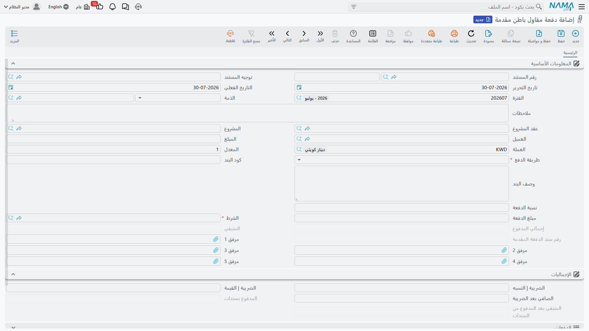

# دفعات مقاول الباطن

مقاول المباني لا يستطيع البدء قبل أن يشتري سقالات ويستقدم عمالة ويضع خلاطة في الموقع، ولن يكون قد
قبض قرشاً لأن شيئاً لم يُقس بعد. فتصرف له مقدماً — دفعة تجهيز موقع — وتستردها من مستخلصاته التالية.
هذه هي فكرة **دفعة مقاول باطن مقدمة**، وفكرة توأمها **دفعة مقاول باطن أخرى** التي تؤدي نفس المهمة
للمال المصروف له وليس دفعةً مقدمةً لتجهيز الموقع.

المستندان في **المقاولات > مقاولة مقاول باطن**.

## ما هو مطابق لجانب المشروع

المستند مرآة
[الدفعات المقدمة من العميل](/ar/modules/contracting/project-contracting/contracting-project-advances.md)
باتجاه مال معاكس: هناك يقدّم العميل المال لك وتُدخله سندات القبض، وهنا تقدّم المال لمقاول الباطن
وتُخرجه **سندات الصرف**. أما آلية الاسترداد — قاعدة استرداد على المستند، وسطر شرط على كل مستخلص تالٍ
يستهلكها — فمتطابقة.

وهناك اختلافان يهمّان:

- يوجد **مستند ثانٍ**، هو الدفعة الأخرى، لا نظير له في جانب المشروع.
- الاسترداد يتنافس مع الغرامات وخصومات الخامات التي تُستقطع أيضاً من مستخلص مقاول الباطن، وكلها
  مقيّدة بنفس السقف وبنفس قاعدة عدم السماح بمتبقٍّ سالب.

## المثال الذي تسير عليه هذه الصفحة

عقد الباطن **CC-0042**، أعمال مباني، 2,000 م² بسعر 40 → **80,000**. قبل وصول العمالة تصرف دفعة تجهيز
موقع بـ **16,000** — أي 20% من قيمة العقد — على أن تُستَرد بنسبة 20% من قيمة كل مستخلص. وسينتج العقد
ثلاثة مستخلصات بقيم 32,000 و28,000 و20,000.

## المستند

المستند قصير. اختر **العقد** فيُملأ مقاول الباطن والمشروع وعقد المشروع والعميل. اكتب **المبلغ**
والعملة، وأضف **نسبة الضريبة** إن كانت الدفعة خاضعة للضريبة فتُحسب لك قيمة الضريبة والإجمالي بعد
الضرائب. ثم الحقلان اللذان يجعلان للمستند أثراً:

**طريقة الدفع** هي قاعدة الاسترداد. خمسة اختيارات، وما يُستقطع من كل مستخلص تالٍ يعتمد كلياً على ما
تختاره:

| طريقة الدفع | ما يُستقطع من كل مستخلص |
|---|---|
| أول مستخلص تالي | كل المتبقي، في أول مستخلص يأتي |
| قيمة ثابتة مع كل مستخلص تالي | المبلغ الثابت الذي كتبته، أو المتبقي إن كان أقل |
| نسبة مع كل مستخلص | تلك النسبة من قيمة الدفعة نفسها |
| نسبة من المستحق مع كل مستخلص | تلك النسبة من قيمة **المستخلص** |
| المستخلص الختامي | لا شيء حتى المستخلص الختامي، ثم كل المتبقي |

والشاشة تتبع اختيارك: حقل **نسبة الدفعة** لا يُفتح إلا لطريقتي النسبة، وحقل **المبلغ** لا يُفتح إلا
لطريقة القيمة الثابتة. وما تحتاجه الطريقة منهما إجباري قبل أن يُحفظ المستند.

**الشرط** هو الشرط الذي سيُقيَّد الاسترداد من خلاله — من نفس نوع الشروط التي تحمل الاستقطاع، من كتالوج
[الشروط التعاقدية](/ar/modules/contracting/setup/contracting-conditions.md). وهو إجباري، وهو الذي يحدد
الحسابات التي يقع عليها قيد الاسترداد عندما يجمعه المستخلص. وقائمة الاختيار لا تعرض إلا الشروط التي لم
تُعلَّم بأنها تخص جانب المشروع.

وهناك حقلان اختياريان يستحقان المعرفة. **كود البند** يقصر الدفعة على بند واحد من عقد الباطن، وهكذا
تُبعد دفعة أعمال المباني عن مستخلصات مساح المحارة؛ وإن ملأته وجب أن يكون بنداً موجوداً في العقد.
و**الذمة** هي الحساب الذي يُصرف منه المال أو إليه، إذا كان دليل حساباتك يريده مذكوراً على المستند.

::: tip وحّد قاعدة الاسترداد على توجيه المستند
اختيار **توجيه المستند** يملأ مسبقاً طريقة الدفع والنسبة والمبلغ والشرط من إعدادات التوجيه. وهكذا
تجعل المنشأة قاعدة «كل دفعات تجهيز الموقع تُستَرد بنسبة 20% من كل مستخلص، من خلال شرط استرداد الدفعة
المقدمة» قاعدةً لا عُرفاً — يختار المساح الدفتر الصحيح فتأتي الحقول صحيحة.
:::

وهناك حقلان للقراءة يتابعان الاسترداد — **إجمالي المدفوع** و**المتبقي** — وحقلان آخران يتابعان النقد،
**المدفوع بسندات** و**المتبقي بعد المدفوع من السندات**، لأن صرف الدفعة واستردادها قصتان منفصلتان. وكل
دفعة تأخذ كذلك رقماً متسلسلاً داخل عقد الباطن، فالدفعة الثانية على CC-0042 رقمها 2 أيّاً كان دفتر
المستند.

## ما يقيّده المستند

اعتماد الدفعة يرسل **طلب أعمال** محاسبياً إلى الطابور يُعالَج في الخلفية؛ والفشل ظاهر وقابل للإعادة من
شاشة **طلبات الأعمال** عبر **المزيد > إعادة المعالجة / إعادة الاعتماد**.

والقيد بسيط بقصد — زوجان في توجيه المستند، وكل زوج لا يُقيَّد إلا إذا كان طرفاه معدّين:

- المبلغ، على زوج المدين والدائن الأساسي؛
- قيمة الضريبة، على زوج الضريبة.

والقراءة المعتادة **مدين «دفعات مقدمة لمقاولي الباطن» ودائن البنك** (أو مستحق مقاول الباطن إن كانت
الدفعة ستُسدَّد بسند لاحقاً). والذي يجعل الآلية تُغلق بشكل سليم هو ما يحدث بعدها: كل استرداد على
مستخلص **يجعل نفس حساب الدفعات المقدمة دائناً من خلال الشرط**، فيصل رصيد الحساب إلى صفر تماماً عند
استرداد الدفعة بالكامل.

## الاسترداد، مستخلصاً بمستخلص

لا شيء في الاسترداد يدوي. كل
[مستخلص مقاول باطن](/ar/modules/contracting/contractor-contracting/contracting-contractor-extracts.md)
يمسح عقد الباطن باحثاً عن الدفعات المقدمة والدفعات الأخرى والغرامات المعتمدة التي لا يزال لها متبقٍّ
وتاريخها لا يتجاوز تاريخ المستخلص، ويكتب لكل منها سطر استقطاع في جدول **الإضافات و الاستقطاعات** يحمل
هذا المستند كسند شرط. فإما أن يضغط المساح *تجميع الشروط*، أو يكون توجيه المستخلص مضبوطاً على التجميع
مع كل حفظ.

وبطريقة *نسبة من المستحق مع كل مستخلص* بنسبة 20%، تنفكّ الـ 16,000 على CC-0042 كالتالي:

| | قيمة المستخلص | المسترد | إجمالي المدفوع | المتبقي |
|---|---|---|---|---|
| المستخلص 1 | 32,000 | 6,400 | 6,400 | 9,600 |
| المستخلص 2 | 28,000 | 5,600 | 12,000 | 4,000 |
| المستخلص 3 (ختامي) | 20,000 | 4,000 | 16,000 | 0 |

ولأن الدفعة كانت 20% من العقد وتُستَرد بنسبة 20% من كل مستخلص، فهي تصل إلى صفر تماماً مع إغلاق
المستخلص الأخير. وهذا ليس تلقائياً: اضبط النسبة أقل فيبقى رصيد حتى المستخلص الختامي، وهناك تتولى قاعدة
أخرى الأمر.

**في المستخلص الختامي يُستَرد كل المتبقي** أيّاً كانت طريقة الدفع. والمستخلص الختامي **يرفض الحفظ ما
دام لأي دفعة مقدمة أو دفعة أخرى أو غرامة رصيد** — *«المتبقي في الدفعة … للعقد … لا يزال …»*. أي أن
النظام لا يسمح لك بإغلاق عقد باطن والتخلي عن مال قدّمته. والتقريب مُعالَج لك: أي متبقٍّ قدره جزء من
مئة أو أقل يُصفَّر، فلا تُبقي القروش دفعةً حيّة.

::: info أين ترى ما استُرد فعلاً
في موضعين. على الدفعة نفسها: **إجمالي المدفوع** و**المتبقي**. وعلى المستخلص: صفحة **الإحصائيات** تعرض
سطراً سطراً أي دفعة مقدمة أو دفعة أخرى تنازلت عن أي مبلغ على ذلك المستخلص، بكود البند والتاريخ الفعلي —
وهو سجل المراجعة للحوار الذي يبدأ بسؤال «لماذا صُرف له 24,800 فقط؟».
:::

## ما يمكن تعديله وما لا يمكن بعد الاعتماد

كل القيود على هذا المستند موجودة لحماية استرداد جارٍ بالفعل:

- **العقد إجباري**، وإن لم يكن معلّماً بنجمة على الشاشة.
- **لا يمكنك تخفيض المبلغ** إلى أقل مما استُرد بالفعل.
- **لا يمكنك تعديل المبلغ إطلاقاً** بعد وجود مستخلص ختامي على عقد الباطن.
- **لا يمكنك تعديل أو حذف كود بند** له بالفعل حركات استرداد.
- **لا يمكنك حذف** المستند بعد استرداد أي شيء منه.
- لا يمكنك تحرير دفعة جديدة على عقد باطن أغلقه مستخلص ختامي.
- يُفحص المبلغ إزاء قيمة البند المرتبط به، فلا تتجاوز الدفعة قيمة العمل المقدَّمة عليه.

وخيار واحد في التوجيه يخفّف الحساب: السماح بأن يكون المتبقي **سالباً**، للمنشآت التي تفضّل الاسترداد
الزائد والتسوية بعده على أن يُرفض الحفظ.

## الدفعة الأخرى، ومتى تستخدمها

**دفعة مقاول الباطن الأخرى** — من كل ناحية ميكانيكية — هي نفس المستند: نفس الشاشة، ونفس طرق الدفع
والشرط، ونفس آلية الاسترداد، ونفس الفحوص، ورقمها المتسلسل الخاص. وإن طلبت منها سلوكاً مختلفاً فلن
تجده.

ما تعطيه لك هو **الفصل**. فهي نوع مستند مختلف بدفتره وترقيمه الخاص، و — لأن الحسابات تأتي من توجيه
المستند والتوجيه لكل نوع مستند — **بزوج حسابات خاص بها**. فتقيّد دفعة تجهيز الموقع على «دفعات مقدمة
لمقاولي الباطن»، ودفعة إسكان أو سلفة وقود أو قرضاً أو تسوية لمرة واحدة على «مستحقات أخرى — مقاولو
الباطن»، فيفرّق ميزان مراجعتك بين الأمرين دون أن يقرأ أحد وصف المستند. وإن كان دليل حساباتك لا يهتم
بالتفريق فلا حاجة لك بالمستند.

والسؤال الأهم هو: لماذا يوجد أي من المستندين والمستخلص يحمل أصلاً إضافات واستقطاعات؟ والجواب أن
**المستخلص لا يستطيع تقييم إلا عمل متعاقد عليه**. فكل سطر تفاصيل على المستخلص هو بند من عقد الباطن
بكمية وسعر، واعتماده يحرّك الكمية المحاسب عليها لذلك البند. أما سلفة الوقود فلا بند لها ولا كمية ولا
سعر وحدة، ووضعها على سطر مستخلص يفسد أرقام تقدم العقد ويجعل جدول الكميات يكذب. فتُحرَّر مستنداً
مستقلاً، ويقيّد قيده الخاص، ويعود من خلال جدول الشروط — وهو الجزء من المستخلص المصمَّم لحمل المال الذي
ليس عملاً.

والمستند الثالث الذي يسير على نفس الآلية تماماً هو
[غرامة مقاول الباطن](/ar/modules/contracting/contractor-contracting/contracting-contractor-fines.md) —
مال عليه لا مال أقرضته له — والشرط الذي يُستَرد كل منها من خلاله اتُّفق عليه عند توقيع
[عقد الباطن](/ar/modules/contracting/contractor-contracting/contracting-contractor-contract.md).
