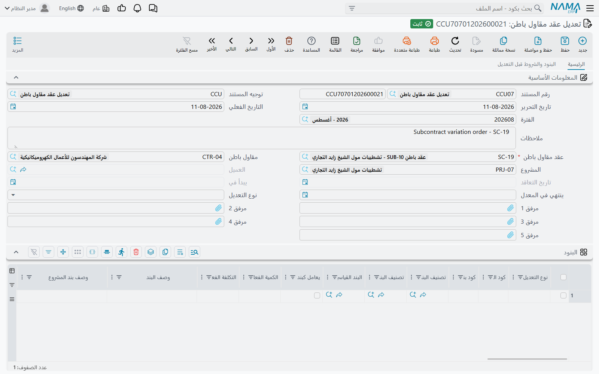
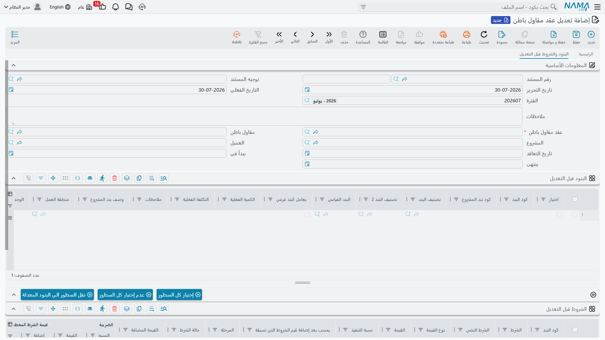

# تعديل عقد مقاول الباطن

النطاق يتغيّر. العميل يضيف 300 م² من الحوائط، أو يُعاد التفاوض على سعر بعد الشهر الأول، أو يُضاف بند لم يسعّره أحد، أو يتأخر البرنامج الزمني. وفي بداية عمر عقد الباطن تفتحه وتعدّله مباشرة — لكن [عقد مقاول الباطن](/ar/modules/contracting/contractor-contracting/contracting-contractor-contract.md) يتجمّد في أسعاره وكمياته وشروطه بمجرد اعتماد أول مستخلص عليه، ومن تلك اللحظة يكون الطريق المعتمد للتغيير هو هذا المستند.

::: tip هو المستند نفسه الموجود في جانب المالك
تعديل عقد مقاول الباطن و[تعديل عقد المشروع](/ar/modules/contracting/project-contracting/contracting-project-contract-updates.md) آلية واحدة لها بابان: السلوك نفسه، والأزرار نفسها، وجدولا «قبل التعديل» نفسهما، وقواعد الترتيب والإلغاء نفسها. **اقرأ تلك الصفحة لمعرفة كيف يعمل أمر التغيير.** وهذه الصفحة تتناول ما يختلف عندما يكون العقد المعدَّل عقد باطن — وهو ثلاثة حقول ونتيجة واحدة مهمة.
:::

وخلافاً لعرض السعر وعقد الباطن، هذا **مستند** حقيقي: له دفتر ورقم مستند وتاريخ تحرير وتاريخ فعلي وفترة مالية وسجل تدقيق كامل — وهذا هو المقصود منه، لأن تغيير اتفاق موقَّع يحتاج سجلاً مؤرَّخاً ومرقَّماً ومنسوباً إلى محرّره. وله حقل *توجيه المستند* لأن لكل مستند توجيهاً، لكن **لا توجد خيارات توجيه مقاولات لهذا النوع من المستندات**، وهو **لا يُنتج قيداً محاسبياً**. فأمر التغيير يغيّر أرقام العقد؛ وأثره المالي يظهر على [المستخلص](/ar/modules/contracting/contractor-contracting/contracting-contractor-extracts.md) التالي.

تجده في **المقاولات > مقاولة مقاول باطن > تعديل عقد مقاول باطن**، ويحتاج ترخيص `contracting`.

## السلوك الأساسي نفسه الموجود في جانب المالك

ثلاثة أمور تنتقل من صفحة جانب المالك، ويستحق ذكرها هنا بدلاً من أن تتبع رابطاً في منتصف العمل.

::: warning عقد الباطن يُعاد كتابته في موضعه. ولا توجد إصدارات.
لا يوجد جدول إصدارات للعقد ولا عقد باطن ذو تواريخ سريان. فاعتماد مستند التعديل يفتح عقد الباطن، ويعيد كتابة بنوده وشروطه، ثم يعيد اعتماده. والسجل الذي تنظر إليه غداً هو العقد المعدَّل فقط.

فالتاريخ يعيش خارج العقد: في سلسلة مستندات التعديل، وكل منها يحمل صورته المجمّدة لِما «قبل التعديل»، وفي سجل تدقيق المنصة. فللإجابة عن سؤال «كيف كان CC-0042 في أبريل؟» تقرأ مستندات التعديل بالترتيب.
:::

::: warning جدول الشروط يستبدل شروط العقد بالكامل
سطور الشروط ليس لها نوع تعديل ولا توجد مقارنة سطر بسطر. اترك جدول *الشروط* **فارغاً** فتبقى شروط عقد الباطن كما هي. واكتب فيه **أي شيء** فيصبح **القائمة الجديدة الكاملة** لشروط العقد — وكل شرط ليس في جدولك يُحذف. فإن كان CC-0042 يحمل شرط ضمان محتجز وحرّرت تعديلاً لإضافة شرط غرامة، فاذكر **الشرطين**.
:::

::: warning أعد اختيار العقد في مستند تعديل ظلّ فترة بلا اعتماد
قائمة بنود العقد بعد الاعتماد هي *الصورة المحفوظة زائد تغييراتك*، والصورة تُؤخذ لحظة اختيارك للعقد. فإن حرّرت التعديل في مايو، وأضاف أحد سطراً إلى عقد الباطن في يونيو بطريق آخر، واعتمدت في يوليو، فسطر يونيو يُحذف. وإعادة اختيار حقل **عقد مقاول الباطن** تُعيد أخذ الصورة كما هو العقد الآن. و**نسخة مماثلة** من مستند تعديل تُفرِّغ جدولَي «قبل التعديل» بقصد، للسبب نفسه.
:::

وهذان الجدولان يؤديان وظيفتين في آن واحد، ويستحق أن تراهما هكذا. فهما **قائمة الاختيار**: تؤشّر على السطور التي تنوي تعديلها فتنتقل إلى الجداول المعدَّلة، فلا تعيد كتابة بند أبداً. وهما **صورة التراجع**: منهما يُعاد بناء عقد الباطن إن أُلغي التعديل. ولهذا كانت الصورة القديمة خطراً، ولهذا كانت إعادة اختيار العقد تُحدِّثها.

وأنواع التعديل الثلاثة تعمل كما تعمل في جانب المالك: **إضافة** تُدرج سطراً جديداً بعد الكود المكتوب في *إضافة بعد* ويمكنها أن تشتق كوده لك؛ و**تعديل** يستبدل محتوى سطر العقد المطابق *دون المساس بأرقام التقدم النظامية*، فالكميات المقيسة والمعتمدة والمحمَّلة بالتكلفة تنجو من تغيير السعر؛ و**حذف** يزيله. ونوع التعديل في الترويسة مجرد قيمة افتراضية تُطبع على السطور عند وصولها إلى الجدول — والمُعتبَر هو قيمة السطر نفسه.

## ما يختلف في تعديل عقد الباطن

**حقل العقد هو عقد الباطن.** اختيار **عقد مقاول الباطن** يملأ العميل وتاريخ التعاقد وتاريخ البداية وتاريخ النهاية — وكلها تصبح للقراءة فقط — ويأخذ صورة لكل سطور البنود وسطور الشروط في جدولَي «قبل التعديل».

**حقلان إضافيان في الترويسة.** اختيار عقد الباطن يملأ كذلك **مقاول الباطن** و**المشروع**، فيقول المستند على وجهه اتفاق مَن يُعدَّل وفي أي مشروع. ولا وجود لأيٍّ من الحقلين في مستند جانب المالك.

**عمود كود بند المشروع في جدول البنود.** المرجع الذي يربط سطر عقد الباطن ببند عقد العميل الذي ينفّذه موجود هنا أيضاً، مباشرة بعد كود البند — وقائمة اختياره تقترح **من بنود عقد العميل نفسه**، فلا تربط السطر إلا ببند يحمله عقد الفنار فعلاً. وعندما يكون نوع التعديل *تعديل*، فاختيار كود البند ينقل كود بند المشروع مع بقية السطر، فلا يفقد السطر ارتباطه بعقد العميل بصمت.

وهذه النقطة الأخيرة تؤدي إلى النتيجة الأهم في هذا الجانب:

::: warning مستند التعديل ليس طريقاً للتحايل على سقف الكميات بين عقود الباطن
مستند التعديل يعيد اعتماد عقد الباطن بطريقه المعتاد، فـ**كل قاعدة في [صفحة عقد الباطن](/ar/modules/contracting/contractor-contracting/contracting-contractor-contract.md) تنطبق** — بما فيها الفحصان الموجودان في جانب التكلفة وحده. فارفع كمية إلى ما يتجاوز ما يحمله عقد العميل لذلك البند، عبر كل عقود الباطن عليه، فيفشل الاعتماد ويذكر الإجماليات. واترك كود بند المشروع فارغاً في سطر جديد فيفشل الاعتماد لذلك أيضاً. عدّل عقد العميل أولاً، ثم عقد الباطن.
:::

## المثال العملي: 300 م² إضافية من أعمال المباني

مضى على CC-0042 ثلاثة أشهر. واعتُمدت شهادة واحدة — 800 م² من الـ 2,000 — فالعقد متجمّد. وقد عدّلت الفنار عقدها إلى 2,300 م² من أعمال المباني بـ[تعديل عقد مشروع](/ar/modules/contracting/project-contracting/contracting-project-contract-updates.md)، والحوائط الإضافية ستُسند إلى المنشأة نفسها.

عقد الباطن قبل التعديل:

| الكود | البند | الكمية | سعر الوحدة | إجمالي السعر | المعتمد حتى الآن |
|---|---|---|---|---|---|
| `3.01` | مباني بلوك 20 سم | 2,000 م² | 40.00 | 80,000 | 800 م² |

وشرط الضمان المحتجز 10% ← استقطاع مخطط 8,000، واجمالى القيمة المستحقة 72,000.

مستند التعديل:

1. تعديل جديد بتاريخ فعلي 1 يونيو. **عقد مقاول الباطن** = CC-0042. فيُملأ العميل والمقاول والمشروع وتاريخ التعاقد والتواريخ تلقائياً، ويُؤخذ سطر البند الواحد وشرط الضمان المحتجز في جدولَي «قبل التعديل».
2. في جدول البنود قبل التعديل، أشّر على السطر `3.01`، واضبط **نوع التعديل** في الترويسة على *تعديل*، ثم اضغط **نقل السطور الي البنود المعدلة**. فيظهر سطر واحد قابل للتعديل، يحمل بالفعل كود بند المشروع `3.01`.
3. غيّر كميته من 2,000 إلى **2,300**. والسعر يبقى 40.
4. اترك جدول **الشروط** فارغاً — فشرط الضمان المحتجز لا يتغيّر، وأي شيء يُكتب هناك يصبح قائمة شروط العقد الجديدة الكاملة.
5. اضبط اختياراً **ينتهي في المعدل** على تاريخ الإنجاز الجديد، بعد أربعة أسابيع.
6. اعتمد.

عقد الباطن بعد التعديل:

| الكود | البند | الكمية | سعر الوحدة | إجمالي السعر | المعتمد حتى الآن |
|---|---|---|---|---|---|
| `3.01` | مباني بلوك 20 سم | **2,300 م²** | 40.00 | **92,000** | 800 م² — *محفوظ* |

الإجمالي 92,000، والضمان المحتجز المخطط أصبح **9,200**، واجمالى القيمة المستحقة **82,800**، وتحرّك تاريخ النهاية. أما الـ 800 م² المعتمدة فقد نجت كما هي، فالمستخلص التالي ما زال يُظهر 800 ككمية سابقة ويحاسب على ما يُقاس بعدها فقط.

و — وهي النقطة التي تستحق التكرار — **لم يُنتج شيء من ذلك قيداً محاسبياً**. فالـ 12,000 الإضافية من الالتزام لا تصل إلى الأستاذ إلا مع بناء الحوائط الإضافية واعتمادها.

ولو عُكس الترتيب — فرُفع عقد الباطن إلى 2,300 وعقد العميل ما زال يحمل 2,000 — لكان الاعتماد قد رُفض، لأن مجموع المُسند على ذلك البند كان سيتجاوز ما بيع.

## ما يمنع الاعتماد أو الحذف

| القاعدة | الرسالة التي تظهر |
|---|---|
| لا يوجد مستند تعديل **لاحق** على عقد الباطن نفسه. تُقارن التواريخ الفعلية، وفي مستندات اليوم نفسه ترتيب الإنشاء. | *«لا يمكن تعديل المستند … بتاريخ … بسبب مستند التعديل …»* |
| لا يُستبدل العقد بعد حفظ المستند. | *«لا يمكن تغيير العقد من … إلى … في المستند …»* |
| كود البند نفسه لا يتكرر بنوع التعديل نفسه. | *«كود البند … بنوع التعديل … مكرر في السطرين … و …»* |
| **إضافة بعد** إجباري في أي سطر نوعه *إضافة*. | العمود إجباري |
| سطر *إضافة* أو *تعديل* أو *حذف* لا بد أن يطابق كوداً موجوداً في الصورة المحفوظة. | *«لم يتم العثور على سطر بند بالكود …»* |
| حذف مستند التعديل مرفوض ما دام هناك تعديل لاحق على العقد. | *«لا يمكن حذف المستند … بسبب مستند التعديل …»* |
| أي شيء يرفضه عقد الباطن نفسه، لأنه يُعاد اعتماده نيابة عنك. | رسائل عقد الباطن نفسه |

وإلغاء مستند التعديل يُعيد عقد الباطن من الصورتين المحفوظتين — وهو ما يُعيد كذلك أرقام التقدم كما كانت **لحظة أخذ الصورة**، فبعد إلغاء تعديل قديم راجع تلك الأرقام.

## للقراءة بعد ذلك

- [عقد مقاول الباطن](/ar/modules/contracting/contractor-contracting/contracting-contractor-contract.md) — السجل الذي يعيد هذا المستند كتابته، والتجميد الذي يجعله ضرورياً.
- [تعديل عقد المشروع](/ar/modules/contracting/project-contracting/contracting-project-contract-updates.md) — المستند نفسه في جانب الإيراد، مشروحاً بالتفصيل.
- [مستخلص مقاول الباطن](/ar/modules/contracting/contractor-contracting/contracting-contractor-extracts.md) — حيث تتحول الكمية المعدَّلة إلى مال.
- [دورة مقاول الباطن](/ar/modules/contracting/contractor-contracting/contracting-contractor-cycle.md) — السلسلة التي يقع فيها هذا المستند.
