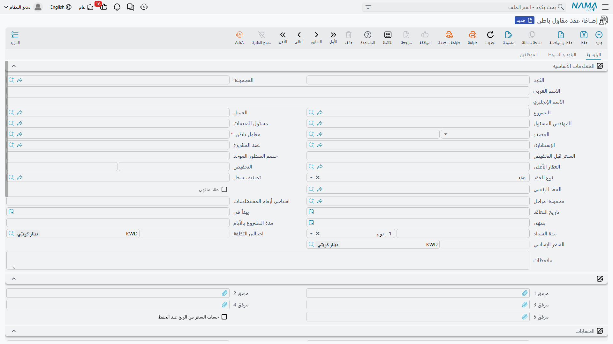
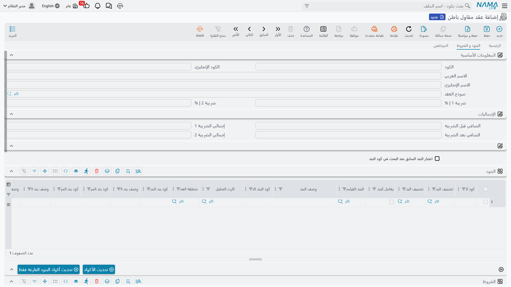

# عقد مقاول الباطن

عقد مقاول الباطن هو مركز ثقل جانب التكلفة، كما أن [عقد المشروع](/ar/modules/contracting/project-contracting/contracting-project-contract.md) مركز ثقل جانب الإيراد: الأسعار التي وافقت على دفعها لمنشأة واحدة عن حزمة واحدة، والشروط التي ستخفض كل شهادة تُصدرها له، وخطة أقساطه، وفريق موقعه — ثم السجل الذي يتراكم فيه، سطراً سطراً، كم قيس من الحزمة وكم اعتُمد وكم صُرف.

والسجلان من حيث البنية شيء واحد. فعقد الباطن مبني من سطور البنود نفسها والشروط نفسها والمراحل نفسها والفحوص نفسها التي يُبنى منها عقد المشروع، والطريقة الصحيحة لاستخدام الصفحتين أن تقرأ [صفحة عقد المشروع](/ar/modules/contracting/project-contracting/contracting-project-contract.md) لمعرفة كيف تتصرف قائمة الكميات على عقد، وأن تقرأ هذه الصفحة لمعرفة ما يتغير عندما يخرج المال بدلاً من أن يدخل.

تجده في **المقاولات > مقاولة مقاول باطن > عقد مقاول باطن**، ويحتاج ترخيص `contracting`.

::: tip ملف رئيسي، بلا توجيه، ولا يُثبت شيئاً
عقد مقاول الباطن **لا دفتر له ولا رقم مستند ولا تاريخ فعلي ولا فترة مالية ولا توجيه مستند** — بل له كود ومجموعة واسم عربي واسم إنجليزي. ولأنه لا توجيه له فلا حسابات عليه، أي أن **حفظه أو تعديله لا ينتج قيداً محاسبياً ولا حركة مخزنية**. ولا تصل التكلفة والالتزام إلى الأستاذ إلا عند إصدار [مستخلص مقاول باطن](/ar/modules/contracting/contractor-contracting/contracting-contractor-extracts.md) عليه، بالحسابات الموجودة على [البنود القياسية](/ar/modules/contracting/setup/contracting-standard-terms.md) وعلى توجيه المستخلص نفسه.
:::

هذه هي القاعدة، وهي صحيحة. لكنها ليست تماماً بمعنى «لا يحدث شيء عند الحفظ»:

::: warning اعتماد عقد الباطن يُنشئ أوراقه التجارية
كل سطر في جدول الدفعات يمكن أن يُنشئ **ورقة تجارية** — شيكاً أو سنداً إذنياً — **محرَّرة لمقاول الباطن** بحالة «محرَّرة»، إذا سمحت [إعدادات المقاولات](/ar/modules/contracting/contracting-configuration.md) لهذا النوع من المستندات بإنشائها. وهذا هو الأثر الفعلي الوحيد للتوقيع. وهو مقابل عقد المالك، حيث يُنتج الجدول نفسه أوراقاً **مقبوضة من** العميل، ويستغربه من عرف للتو أن عقد الباطن لا يُثبت شيئاً: لا قيد يُنشأ، لكن ورقاً حقيقياً يظهر في الخزينة.
:::

ومثالنا هو عقد الباطن **CC-0042** في مشروع **برج A** لحساب **الفنار للتطوير**: حزمة أعمال المباني، 2,000 م² بسعر 40 — أي **80,000** — مع **ضمان محتجز 10%** من كل شهادة، و**دفعة مقدمة 16,000** هي مستند مستقل لا سطر في هذه الشاشة.

## كيف يصل المحتوى إلى عقد الباطن

ثلاثة طرق، وليس فيها زر «نسخ البنود» — فلا وجود لهذا الزر في الوحدة كلها.

**من عرض سعر مقاول الباطن.** زر *تحويل لعقد* على [عرض السعر](/ar/modules/contracting/contractor-contracting/contracting-contractor-offers.md) يفتح عقد باطن جديداً ببنوده وأسعاره وشروطه جاهزة، وبحقل **المصدر** يشير إلى العرض.

**مما بعته.** زر *تحويل السطور المختارة لعقد مقاول باطن* على [عقد المشروع](/ar/modules/contracting/project-contracting/contracting-project-contract.md) هو الطريق الطبيعي عندما تُسند جزءاً من نطاقك: أشّر على سطور عقد العميل التي تُسندها فيُفتح عقد باطن يحملها، ويحمل هذا العقد كـ **عقد المشروع** وكمصدر له. والتحويل نفسه موجود على [مقايسة المقاولات](/ar/modules/contracting/project-contracting/contracting-assays.md) وعلى [الموازنتين](/ar/modules/contracting/budgets/contracting-executive-budget.md).

**من نموذج عقد.** اختيار [نموذج عقد](/ar/modules/contracting/setup/contracting-contract-templates.md) في حقل *نموذج العقد* في الصفحة الثانية ينسخ بنود النموذج وشروطه إلى السجل. والاختيار نفسه هو ما يُشغّل النسخ؛ ولا شيء تضغطه بعده.

وعندما يكون المصدر عقد مشروع يفعل العقد شيئاً إضافياً عند الحفظ: يملأ حقل **عقد المشروع** من المصدر، ثم يطبع عقد المشروع ذاك على كل سطر من سطور البنود.

## الترويسة — والقوائم التسع تحتها

مجموعة المعلومات الأساسية هي مجموعة عقد المشروع، مع ثلاثة حقول تخص هذا الجانب:

| الحقل | لماذا يهم |
|---|---|
| **مقاول باطن** | إجباري — المنشأة التي تدفع لها، والجهة التي سيقف الالتزام قِبلها |
| **عقد المشروع** | عقد العميل الذي تقع الحزمة داخله. يُملأ لك عندما يأتي عقد الباطن من عقد مشروع، وهو مرتكز الفحوص المذكورة أدناه |
| **الإستشاري** | الاستشاري، حيث يُشرف على الحزمة |

ثم الحقول المعروفة: **المشروع** و**العميل** — مشروع *العميل* و*العميل* نفسه، محمولان كسياق لأن عقد الباطن يعيش دائماً داخل عقد عميل — والمهندس المسئول ومسئول المبيعات، و**نوع العقد** بقيمه *عقد* و*ملحق* و*تعديل لعقد*، والحقل الذي يقرأ بالإنجليزية *Addendum contract* وهو في الحقيقة **العقد الرئيسي** الذي يتبعه هذا العقد (والعربية `العقد الرئيسي` تقولها بدقة). و**عقد منتهي** يُشغّله لك المستخلص الختامي، و**افتتاحي أرقام المستخلصات** يمهّد ترقيم المستخلصات لحزمة نُقلت إلى النظام في منتصف عمرها وقد صدرت لها شهادات في نظام آخر.

والتواريخ — تاريخ التعاقد والبداية والنهاية ومدة المشروع بالأيام — و**مدة السداد** أهم مما تبدو: فمدة السداد هي ما يحسب منه المستخلص تاريخ استحقاق شهادته.

ثم مجموعتان يسهل تجاوزهما. المرفقات الخمسة وخانة *حساب السعر من الربح عند الحفظ* تقعان معاً في مجموعة بلا عنوان. ومجموعتا **الحسابات** و**الضرائب** تجعلان *عقد الباطن نفسه* ذمّة محاسبية، فمن يريد أن يرى رصيد كل حزمة على حدة يستطيع أن يُثبت على العقد لا على المقاول.

ثم يأتي الجزء الذي لا مقابل له في جانب المالك، وهو سبب كون هذه الشاشة أول ما يفتحه محاسب الموقع: **تسع قوائم قابلة للطي**، كلها مفلترة على عقد الباطن هذا، وتقع في الصفحة الرئيسية نفسها لا في صفحة إحصائيات.

| القائمة | ما تجيب عنه |
|---|---|
| حصر كميات مقاول باطن | ما قيس |
| مستخلصات عقود المقاول الباطن | ما اعتُمد وأُثبت |
| سندات الغرامة | ما غُرِّم به |
| مستند السركى | العمالة المسجّلة على الحزمة |
| مستند بيان معدات | بيانات المعدات المحرَّرة عليها |
| دفعة مقاول باطن مقدمة | ما صُرف له مقدماً |
| دفعة مقاول باطن أخرى | الدفعات الأخرى خارج الشهادات |
| صرف خامات مقاول باطن | الخامات المبيعة له |
| مردود خامات مقاول باطن | الخامات التي أعادها |

وتحتها جدول **بيانات إضافية** حر — أرقام ونصوص وتواريخ ومراجع لا يقرأها شيء في النظام — ثم مجموعة المحددات.

## الصفحة الثانية — البنود والشروط والدفعات

### جدول البنود

هذه هي قائمة الكميات التي تشتريها، وهي تتصرف تماماً كما تتصرف على عقد المشروع: كل سطر يشير إلى **بند قياسي** إجباري يوفّر الوحدة والسعر الافتراضي والحسابات التي سيُثبت عليها المستخلص؛ وأكواد البنود المنقّطة تُشكّل شجرة لا يحمل المال فيها إلا السطور الفرعية، أما الرئيسية فتُصفَّر وتُعاد جمعها من أبنائها عند كل حفظ؛ وخانة **يعامل كبند فرعي** تجعل بنداً رئيسياً يتصرف كسطر مسعّر هنا؛ وفوق الجدول **تحديث الأكواد** و**تحديث أكواد البنود الفارغة فقط**، والثاني هو الآمن.

ويحمل CC-0042 سطراً مسعّراً واحداً:

| الكود | البند القياسي | الوحدة | الكمية | سعر الوحدة | إجمالي السعر | كود بند المشروع |
|---|---|---|---|---|---|---|
| `3.01` | مباني بلوك 20 سم | م² | 2,000 | 40.00 | **80,000** | `3.01` |

واقرأ المال في اتجاهه الصحيح. **سعر الوحدة في عقد الباطن هو ما تدفعه** لا ما تتقاضاه — والـ 40 هنا هي نفسها الـ 40 التي تظهر كـ *تكلفة الوحدة* لبند المباني في عقد الفنار، حيث تبيعه بـ 46. وهذا هو جوهر الحزمة تجارياً، وهذا الجدول هو موضع لقاء الرقمين.

وثلاث عائلات من الأعمدة تستحق الفصل بينها:

**ما تملؤه أنت.** الكمية وسعر الوحدة وحقول الخصم والضريبة و**نسبة السماحية** (الهامش فوق الكمية المتعاقد عليها الذي يُسمح للقياس أن يبلغه) والأبعاد والعدد ومجموعة الضمان ومنطقة العمل وتصنيفات البند.

**المراجع المتقابلة، وهي موجودة في هذا الجانب فقط.** **كود بند المشروع** وشقيقاه — كودا بند الموازنة التقديرية والتنفيذية، ولكل منهما عمود وصف. وكود بند المشروع ليس زخرفاً:

::: warning كل سطر مسعّر لا بد أن يسمّي بند عقد العميل الذي ينتمي إليه
ما لم تقل إعدادات المقاولات إن كود بند المشروع يمكن أن يكون فارغاً في عقود الباطن، فإن **الحفظ يفشل على أي سطر غير رئيسي كود بند المشروع فيه فارغ**. وهذا أكثر فحص يُصادَف في هذه الشاشة، ووجوده لأن كل ما يهم في جانب التكلفة تقريباً يُحسب بتجميع سطور عقود الباطن حسب بند عقد العميل الذي تنفّذه.
:::

**ما يملؤه النظام.** *الكمية | من حصر الكميات* و*الكمية | من المستخلص* و*الكمية | من حصر التكاليف* والكمية الفعلية والتكلفة الفعلية وكمية أوامر الشراء والكميات المقيسة والمعتمدة لكل مرحلة. لا تكتبها أبداً. فبعد أول شهادة على CC-0042 يبقى السطر `3.01` قارئاً 2,000 كمية متعاقد عليها، بينما تقرأ كميته *من المستخلص* 800 — ولهذا فإن هذا السجل، لا تقريراً ما، هو الموضع الذي تنظر فيه لتعرف موقف الحزمة.

### جدول الشروط

الشرط قاعدة مالية ستُطبَّق على كل مستخلص، لا ملاحظة. كل سطر يسمّي **شرطاً** من [كتالوج الشروط](/ar/modules/contracting/setup/contracting-conditions.md) ونوع قيمة وقيمة، ويمكن قصره على كود بند واحد ومرحلة واحدة. وكون المبلغ إضافة أو استقطاعاً من ملف الشرط نفسه لا من السطر.

ولـ CC-0042 شرط واحد:

| الشرط | نوع القيمة | القيمة | الاستقطاع المخطط |
|---|---|---|---|
| استقطاع ضمان | نسبة من الإجمالي | 10 | **8,000** |

ولهذا يقرأ *اجمالى القيمة المستحقة* في الترويسة 72,000 مقابل *إجمالي* 80,000. والـ 8,000 لا تُستقطع مرة واحدة — بل يُحتجز 10% من كل شهادة عند إصدارها، ويُفرَج عنها لاحقاً باتفاق منفصل. أما الأعمدة التي تُظهر ما استُقطع فعلاً حتى الآن فتحفظها المستخلصات وهي معطّلة على الشاشة.

والدفعة المقدمة 16,000 **ليست** سطر شرط. فالدفعة المقدمة [مستند مستقل](/ar/modules/contracting/contractor-contracting/contracting-contractor-advances-and-payments.md) يسمّي شرطاً من الكتالوج ثم يظهر على المستخلصات التالية كاستقطاع حتى يُسترد بالكامل؛ و[الغرامات](/ar/modules/contracting/contractor-contracting/contracting-contractor-fines.md) تعمل بالطريقة نفسها. فجدول الشروط يحمل شروط الاتفاق الثابتة، والأحداث تأتي من مستنداتها.

### جدول الدفعات

كود القسط ووصفه ونسبته وقيمته والقيمة المدفوعة والمتبقي وتاريخ الدفع والورقة التجارية التي يُسدَّد بها — وهو الجدول نفسه الموجود على عقد المالك، يُملأ بيدك أو باختيار **نموذج دفع** وترك النظام يوزّع المبلغ على عدد من الأقساط بمدة سماح وقاعدة تقريب. والفرق هو الاتجاه فقط: هذه الأوراق تُحرَّر **لمقاول الباطن**، كما ذُكر في أول الصفحة.

## صفحة الموظفين

الصفحة الثالثة تحمل فريق الموقع المسنَد إلى الحزمة، ولكل سطر تاريخ بداية وتاريخ نهاية. وعنوان عمود الجدول يقرأ *الفني* بينما الصفحة والمجموعة تسمّى *الموظفين*؛ فاقرأه بمعنى «الموظف المسنَد». وهذه السطور — كجدول البيانات الإضافية — توثيقية: لا شيء يفحصها ولا يحسب تكلفتها.

## تفكيك العمل، وسقف المراحل

المحاور الثلاثة هي محاور عقد المشروع، وهي لا تتداخل بعضها في بعض: **شجرة البنود** هي التي تحمل المال، و**مناطق العمل** شجرة وصفية منفصلة تُنقل إلى الأمام لكن لا يُفلتَر عليها ولا يُجمَّع، و**المراحل** معالم محفوظة على السطر نفسه.

::: warning المراحل خمس خانات بالضبط
لسطر البند خمس خانات مراحل ثابتة لا قائمة. ومجموعة مراحل بأكثر من خمس مراحل تملأ الخمس الأولى فقط بصمت، ثم يفشل العقد في فحص «مجموع نسب أسعار المراحل يساوي 100%» — برسالة تشير إلى العقد بينما المشكلة في المجموعة. فاجعل [مجموعات المراحل](/ar/modules/contracting/setup/contracting-phases-and-work-areas.md) خمس مراحل أو أقل.
:::

## فحصان لا يوجدان إلا في هذا الجانب

كلاهما عن العلاقة بين ما بعته وما تُسنده، وكلاهما سبب إجبارية كود بند المشروع.

**لا تُسند أكثر مما بعت.** إذا سمّى عقد الباطن عقد مشروع، فإن الحفظ يجمع كمية **كل بند من بنود عقد العميل عبر كل عقود الباطن على ذلك العقد** ويرفض إن تجاوز المجموع الكمية الموجودة في عقد العميل نفسه — *«إجمالي عقود المقاولين للبند … في عقد المشروع … هو …، بينما كمية البند …»*. فعقد الفنار يحمل 2,000 م² من أعمال المباني، و CC-0042 يأخذها كلها، فعقد باطن ثانٍ على البند نفسه سيُرفض حتى يُعدَّل عقد العميل. وهناك خيار في إعدادات المقاولات يرفع الفحص للمنشآت التي تفضّل الإسناد أولاً والتعديل لاحقاً.

**المقايسة المعتمدة لا تُستخدم مرتين.** إذا كان عقد الباطن مبنياً على [مقايسة مقاولات](/ar/modules/contracting/project-contracting/contracting-assays.md) حالتها معتمدة، فالحفظ يُرفض إلا إذا سمحت إعدادات المقاولات بالتعديل وبأكثر من عقد على المقايسة نفسها.

## ما يمنع الحفظ أيضاً

| القاعدة | ملاحظة |
|---|---|
| سطر بند واحد على الأقل | العقد الفارغ لا يُحفظ |
| أكواد البنود لا تتكرر | *"Can not insert a dublicated term"* |
| نسب الضريبة لا تتجاوز 100 | على السطور وعلى الترويسة |
| كود بند الشرط لا بد أن يكون موجوداً بين أكواد بنود العقد | ولا يتكرر الشرط نفسه لنفس البند والمرحلة |
| العقد الرئيسي إجباري عندما يكون نوع العقد *ملحق* | |
| أسعار السطور تحقّق [قائمة الأسعار](/ar/modules/contracting/setup/contracting-price-lists.md)، حيث تنطبق | |
| أكواد بنود الموازنات متسقة حيث تُملأ | |
| كل سطر غير رئيسي يحمل كود بند المشروع | إلا إذا قالت الإعدادات غير ذلك |
| مجموع المُسند لكل بند من عقد العميل لا يتجاوز ما بيع | إلا إذا قالت الإعدادات غير ذلك |

## بمجرد وجود مستخلص يتجمّد العقد

بمجرد إصدار **أي** مستخلص على عقد الباطن — وما لم تسمح إعداداتك صراحةً بتعديل الأسعار والكميات بعد المستخلصات — تصبح الحقول التجارية في الترويسة، وكل سطور الشروط، وسطور البنود التي قيست أو اعتُمدت، للقراءة فقط.

وتبقى السطور التي لم تُمَس قابلة للتعديل، ويمكنك إضافة سطور جديدة. أما ما عدا ذلك فتحرّر له [تعديل عقد مقاول باطن](/ar/modules/contracting/contractor-contracting/contracting-contractor-contract-updates.md)، وهو الطريق الموثَّق عبر التجميد. ولاحظ أن مستند التعديل يعيد اعتماد العقد بطريقه المعتاد، فكل قاعدة في هذه الصفحة — بما فيها الفحصان أعلاه — تنطبق عليه.

## للقراءة بعد ذلك

- [دورة مقاول الباطن](/ar/modules/contracting/contractor-contracting/contracting-contractor-cycle.md) — موضع هذا السجل، والقائمة الكاملة لأوجه اختلاف هذا الجانب عن جانب المالك.
- [تعديل عقد مقاول الباطن](/ar/modules/contracting/contractor-contracting/contracting-contractor-contract-updates.md) — أمر التغيير.
- [حصر كميات مقاول الباطن](/ar/modules/contracting/contractor-contracting/contracting-contractor-execution.md) و[مستخلص مقاول الباطن](/ar/modules/contracting/contractor-contracting/contracting-contractor-extracts.md) — ما يُرحَّل على سطور البنود هذه، وما يُثبت في النهاية.
- [دفعات مقاول الباطن](/ar/modules/contracting/contractor-contracting/contracting-contractor-advances-and-payments.md) و[غرامات مقاول الباطن](/ar/modules/contracting/contractor-contracting/contracting-contractor-fines.md) و[صرف الخامات لمقاول الباطن](/ar/modules/contracting/costs/contracting-contractor-materials.md) — المستندات التي تصل إلى شهاداته كاستقطاعات.
- [عقد المشروع](/ar/modules/contracting/project-contracting/contracting-project-contract.md) — السجل نفسه في جانب الإيراد، مشروحاً بالتفصيل.
- [البنود القياسية](/ar/modules/contracting/setup/contracting-standard-terms.md) و[الشروط التعاقدية](/ar/modules/contracting/setup/contracting-conditions.md) و[المراحل ومناطق العمل](/ar/modules/contracting/setup/contracting-phases-and-work-areas.md) و[نماذج العقود](/ar/modules/contracting/setup/contracting-contract-templates.md) — المفردات التي بُنيت منها هذه الشاشة.
