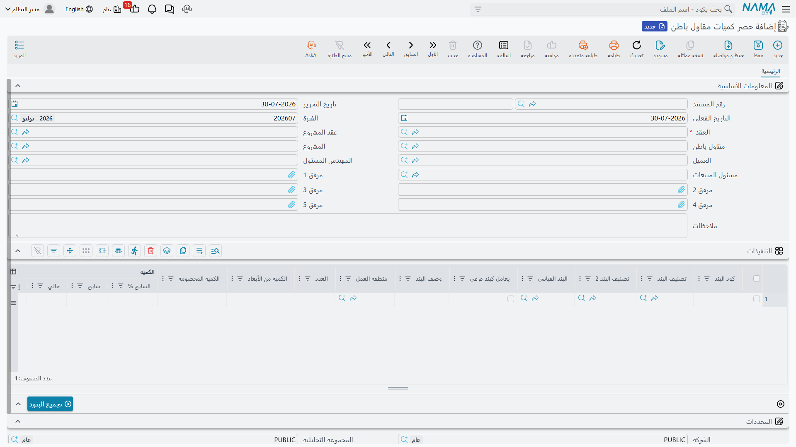

# حصر كميات مقاول الباطن

مستخلص مقاول الباطن لا يكون موثوقاً أكثر من القياس الذي بُني عليه. فقبل أن تعتمد أن عمالة المباني
تستحق قيمة 800 متر مربع من الحوائط، لا بد أن يقف أحد على البلاطة بشريط القياس ويكتب أن هذه الـ 800
متر موجودة فعلاً. هذا السجل المكتوب هو **حصر كميات مقاول باطن**، وسبب وجوده هو الفصل بين **القياس**
و**الصرف**، حتى يكون المستخلص محاسبةً على عمل مقيس لا أرقاماً يكتبها مساح الكميات من رأسه.

تجد المستند في **المقاولات > مقاولة مقاول باطن > حصر كميات مقاول باطن**.

## ما هو مطابق لجانب المشروع

هذا المستند من الناحية الميكانيكية توأم
[حصر كميات المشروع](/ar/modules/contracting/project-contracting/contracting-project-execution.md):
نفس زر **تجميع البنود**، ونفس أعمدة الكميات، ونفس قاعدة الحصر المرحلي، ونفس مختصرات النسبة والأبعاد،
ونفس الإجمالي الذي يُرحَّل إلى سطور بنود العقد. اقرأ تلك الصفحة لتفاصيل آلية القياس؛ وهذه الصفحة
تتناول فقط ما يختلف عندما يكون العمل المقيس مملوكاً لمقاول باطن لا لك.

والاختلافات قصيرة ويستحق أن تعرفها قبل فتح الشاشة:

- العقد الذي يشير إليه المستند هو **عقد مقاول باطن**، فالبنود المعروضة هي بنود عقد الباطن — الجزء
  الذي أسندته إلى الغير — لا بنود عقد العميل كلها.
- المشروع و**عقد المشروع** محمولان على الرأس كسياق، لأن عقد الباطن يعيش دائماً داخل عقد عميل.
- المستند **لا يحتاج توجيه مستند**. لا شيء تُعِدّه ولا شيء تُوجِّهه، وليس له أي تأثير محاسبي ولا
  مخزني على الإطلاق.
- المستخلص الذي يغذّيه هو مستخلص مقاول باطن، ونتيجته أن المال يخرج لا يدخل.

## القاعدة الواحدة التي يخطئ فيها الجميع: المستند فترة لا إجمالي

عمود **الكمية | حالي** هو ما تملؤه، ومعناه *ما تم قياسه هذه المرة*. ليس هو الإجمالي التراكمي؛ فالنظام
يحفظ لك الإجمالي في العمودين المجاورين للقراءة فقط: **الكمية | سابق** هي كل ما تم قياسه في حصور
سابقة على نفس عقد الباطن لنفس البند والمرحلة، و**الكمية | إجمالي** هي جمع الاثنين.

خذ مثال المباني. عقد الباطن **CC-0042** مع مقاول المباني يغطي البند **3.01** *مباني بلوك 20 سم*، بكمية
متعاقد عليها **2,000 م²** بسعر **40** للمتر — أي عقد باطن بقيمة **80,000**.

**نهاية الشهر الأول.** يقيس مهندس الموقع 800 م² من الحوائط المنجزة ويحرّر أول حصر:

| العمود | القيمة |
|---|---|
| الكمية \| متعاقد عليها | 2,000 |
| الكمية \| سابق | 0 |
| **الكمية \| حالي** | **800** |
| الكمية \| إجمالي | 800 |
| نسبة التنفيذ | 40 |

**نهاية الشهر الثاني.** تُبنى 200 م² أخرى. والحصر الثاني ليس بـ 1,000 بل بـ **200**:

| العمود | القيمة |
|---|---|
| الكمية \| سابق | 800 |
| **الكمية \| حالي** | **200** |
| الكمية \| إجمالي | 1,000 |

الآن نصف أعمال المباني مقيس ومعتمد، ويحمل سطر البند في عقد الباطن **1,000** ككمية منفذة من الحصور.
ولو كتبت 1,000 في المستند الثاني لكنت أخبرت النظام أن 1,800 م² من الحوائط موجودة.

::: tip يمكنك كتابة الإجمالي إن كان تفكيرك يسير هكذا
املأ **الكمية | الإجمالي اليدوي** والنظام يعمل بالعكس: الكمية الحالية تصير إجماليك ناقص الكمية
السابقة. فكتابة 1,000 هناك في المستند الثاني تعطيك كمية حالية 200 — الإجابة الصحيحة، من الطريق
الآخر.
:::

وهناك مدخلان آخران. اكتب **نسبة التنفيذ** فتُشتق الكمية من الكمية المتعاقد عليها. أو — إذا أضافت
إعدادات المقاولات أعمدة الأبعاد — اكتب العدد والطول والعرض والارتفاع واترك الكمية تخرج من الحساب.

## ملء الجدول

اضغط **تجميع البنود** فيحمّل المستند نفسه من عقد الباطن: سطر لكل بند، أو سطر لكل مرحلة حيث ينقسم
البند إلى مراحل، وكل سطر يأتي بوحدته وكميته المتعاقد عليها ووصفه ومنطقة عمله جاهزة، وبالكمية السابقة
محسوبة من الحصور الأقدم على نفس العقد.

وهناك أمران لا يفعلهما بقصد. يترك الكمية الحالية **فارغة** — فهذه مهمة المهندس ولا يُسمح لأي شيء آخر
في المستند بتخمينها. ويتجاوز أكواد البنود **الرئيسية**، أي العناوين في شجرة الأكواد المنقّطة، إلا إذا
ضُبطت إعدادات المقاولات على إظهار الأكواد الرئيسية في الحصور؛ فالعنوان إجمالي لا حائط تقيسه.

ويمكنك إضافة سطور بيدك. اختر كود البند (والمرحلة إن كان للبند مراحل) فتملأ الأعمدة الوصفية وسعر
الوحدة وتكلفة الوحدة والكمية المتعاقد عليها والكمية السابقة نفسها؛ وقائمة المراحل مقصورة على المراحل
التي يستخدمها ذلك البند فعلاً.

## ما يفحصه الحفظ

خمسة أمور، ولكل منها سبب عملي يستحق الفهم:

1. **الجدول لا يكون فارغاً.** حصر بلا مقيس ليس مستنداً.
2. **المشروع يطابق مشروع عقد الباطن.** الحقلان يُملآن من العقد، فلا يظهر هذا الفحص إلا إذا عدّل أحد
   أحدهما.
3. **العميل يطابق عميل عقد الباطن.** العميل على مستندات مقاول الباطن هو عميل **المشروع** منقولاً من
   عقد الباطن — والنصيحة العملية أن تترك الحقل كما ملأه العقد تماماً.
4. **لا تقيس أكثر مما يسمح به العقد.** كل بند في العقد يحمل نسبة مسموحة — هامشاً فوق الكمية المتعاقد
   عليها — والكمية التراكمية المقيسة تُفحص إزاءها. فقياس 2,150 م² على بند بـ 2,000 م² ونسبة مسموحة
   5% مقبول، أما 2,300 م² فمرفوض. وهناك خيار في إعدادات المقاولات يرفع هذا الفحص للمنشآت التي تفضّل
   تعديل العقد لاحقاً.
5. **الحصر الذي استهلكه مستخلص يمكن تجميده.** إذا شُغّلت في إعدادات المقاولات القاعدة التي تمنع تعديل
   الحصر بعد وجود مستخلص عليه، يُرفض الحفظ ويسمّي المستخلص. وهذا هو الخيار الذي تُشغّله إن أردت أن
   تصبح القياسات مستنداً ثابتاً بمجرد المحاسبة عليها.

## ما يغيّره الاعتماد

لا شيء في الدفاتر ولا شيء في المخزن — هذا المستند لا يحرّك مالاً ولا مخزوناً. ما يحرّكه هو صورة عقد
الباطن:

- تُحدَّث في كل سطر بند **الكمية المنفذة** و — حيث تُستخدم المراحل — الكمية المقيسة لكل مرحلة، ثم
  تُعاد جمع السطور الرئيسية من أبنائها.
- يُعاد حساب الكمية السابقة والنسب في أي حصر **لاحق** على نفس عقد الباطن. فإذا اكتشفت في مارس أن قياس
  يناير كان خاطئاً، فتصحيح يناير يصحح تلقائياً إجماليات فبراير.

## كيف يستهلكه المستخلص

على [مستخلص مقاول باطن](/ar/modules/contracting/contractor-contracting/contracting-contractor-extracts.md)
جديد أمامك طريقان يستبعد كل منهما الآخر، وهذا المستند هو أولهما:

- ضع الحصر في حقل **بناءا علي**. يسحب المستخلص السطور المقيسة، وتبقى الكميات المحاسب عليها كما قيست
  تماماً إلا إذا سمح توجيه المستند بغير ذلك. وقائمة الاختيار لا تعرض إلا حصور نفس العقد التي لم
  يستهلكها مستخلص بعد، ولا يمكن أن يتشارك مستخلصان حصراً واحداً.
- أو اترك **بناءا علي** فارغاً واضغط **تجميع البنود** على المستخلص نفسه، فيقرأ عقد الباطن مباشرة.
  والمستخلص يرفض تجميع البنود ما دام حقل *بناءا علي* مملوءاً — إما هذا الطريق أو ذاك، لا الاثنان.

وعند اعتماد مستخلص مبني على حصر يحدث الترحيل العكسي: يُعلَّم الحصر بأنه مستخلَص، ويسجّل كل سطر منه
الكمية التي حوسب عليها. وهذا ما يمنع صرف قيمة نفس الـ 800 متر مرتين.

وتسجيل الحصر **اختياري**. كثير من المنشآت تحرّر المستخلص من العقد مباشرة وتجعل المستخلص هو القياس
والمحاسبة في وقت واحد. وثمن ذلك هو بالضبط الرقابة التي وُجد هذا المستند من أجلها: لا سجل مستقل لما
قيس، ولا فصل بين المهندس الذي يقيس والمساح الذي يحاسب.
