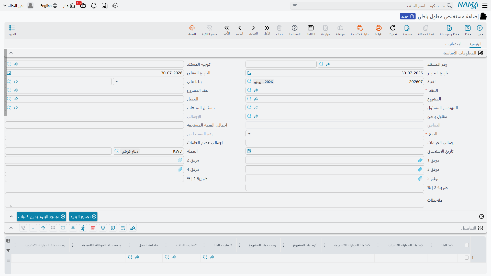
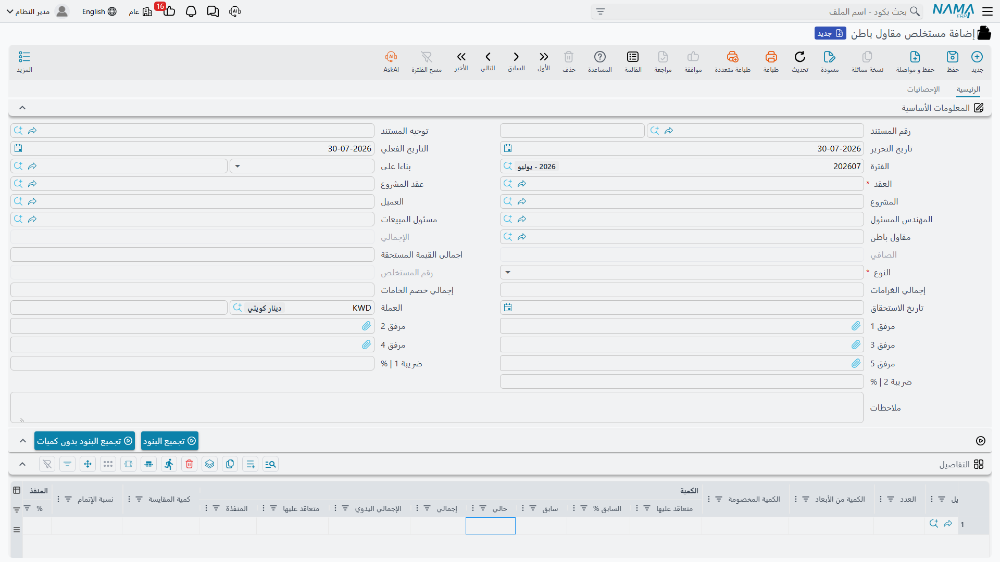
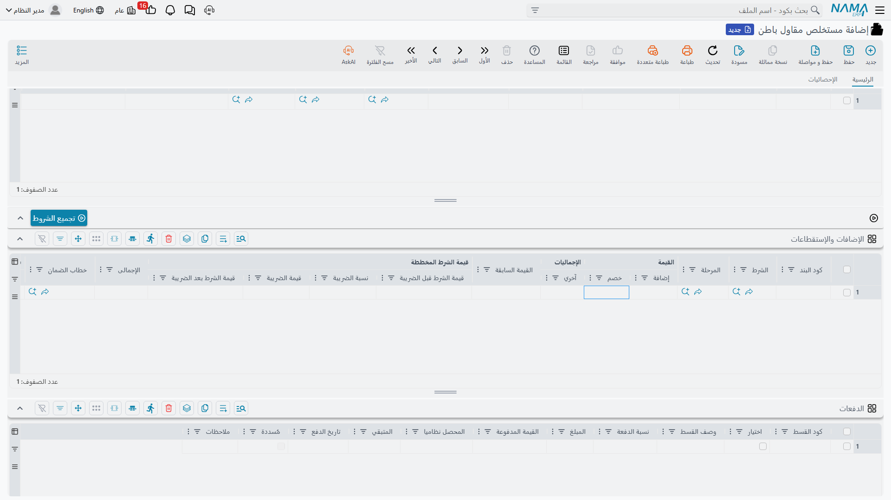

# مستخلص مقاول الباطن

كل ما سبق في جانب مقاول الباطن تحضير. عقد الباطن يسجّل ما اتفقتم عليه، والحصر يسجّل ما بُني، والدفعة
المقدمة تسجّل ما أقرضته، والغرامة تسجّل ما عليه — ولا يصل أي من هذه الأربعة إلى دفتر الأستاذ. أما
**مستخلص مقاول الباطن** فهو المستند الوحيد الذي يصل. هو طلبه للصرف: الشهادة التي تقول *هذا القدر من
العمل أُنجز هذه الفترة، وهذا القدر محتجز، وهذا القدر من دفعتك المقدمة يُستقطع، وهذا هو ما ستقبضه
فعلاً.*

تجد المستند في **المقاولات > مقاولة مقاول باطن > مستخلص مقاول باطن**.

## ما هو مطابق لمستخلص المشروع

المستند مبني على نفس الآلية التي يقوم عليها
[مستخلص المشروع](/ar/modules/contracting/project-contracting/contracting-project-extracts.md): نفس
جدول التفاصيل وأزرار **تجميع البنود**، ونفس الكمية المرحلية للمحاسبة، ونفس جدول الشروط، ونفس الترتيب
الزمني الصارم بين مستخلصات العقد الواحد، ونفس أنواع المستخلص الثلاثة. اقرأ تلك الصفحة لشكل المستند؛
وهذه الصفحة عن أوجه اختلاف جانب التكلفة، وهي في هذا المستند أكثر من أي موضع آخر في الوحدة.

أهم الاختلافات:

| | مستخلص المشروع | مستخلص مقاول الباطن |
|---|---|---|
| اتجاه المال | مستحق لك — العميل مدين | **مستحق عليك** — أنت مدين لمقاول الباطن |
| يُسدَّد بـ | سندات قبض | **سندات صرف** |
| الاستقطاعات تُجمَّع من | شروط العقد، والدفعات المقدمة، والغرامات | شروط العقد، و**دفعات مقاول الباطن المقدمة، ودفعاته الأخرى، وغراماته — والخامات التي بعتها له** |
| الضرائب | آلية بند ضريبي تشتق سطور الضريبة تلقائياً | نسب ضريبة تُكتب على المستند |
| قيود التكلفة الفعلية | نعم | لا — القيم صفر دائماً في هذا الجانب |
| إغلاق العقد | — | المستخلص **الختامي** يجعل عقد الباطن منتهياً |

## المثال الذي تسير عليه هذه الصفحة

عقد الباطن **CC-0042**، أعمال مباني، مع مقاول المباني:

| | |
|---|---|
| البند **3.01** *مباني بلوك 20 سم* | 2,000 م² متعاقد عليها بسعر **40** → **80,000** |
| شرط الاستقطاع على العقد | **10%** استقطاع ضمان |
| دفعة مقدمة مصروفة بالفعل | **16,000**، تُستقطع بنسبة 20% من قيمة كل مستخلص |
| ضريبة القيمة المضافة | **15%** |
| أسمنت مبيع له خلال الشهر الأول | 80 شكارة بسعر 30 → **2,400** |

وستحاسبه ثلاثة مستخلصات على الـ 2,000 م²: 800، ثم 700، ثم مستخلص ختامي بـ 500.

## التشريح: ثلاثة جداول، وثلاث طرق مختلفة لملئها



الرأس يعرّف المستند والمال. **العقد** هو عقد الباطن، واختياره يملأ مقاول الباطن والمشروع والمهندس
المسئول ومسئول المبيعات والعميل — و**عقد المشروع**، الذي يُقفل بعدها، لأن عقد الباطن لا يعيش إلا داخل
عقد عميل واحد. وتاريخ الاستحقاق يُحسب من مدة السداد المتفق عليها في عقد الباطن. و**النوع** إما مبدأي
أو جاري أو ختامي، و**رقم المستخلص** يُملأ عند الاعتماد: تسلسل داخل عقد الباطن، فالمستخلص الثالث على
CC-0042 رقمه 3 مهما كان عدد المستخلصات في العقود الأخرى.

وتحت ذلك يقع الجدولان المهمان.

### جدول التفاصيل — العمل



سطر لكل بند، أو لكل مرحلة من البند. الجدول عريض — ستون عموداً وأكثر — لكن المال يأتي من حفنة منها:

| العمود | ما هو |
|---|---|
| **كود البند** | أي سطر من عقد الباطن تحاسب عليه |
| الكمية \| متعاقد عليها | كمية العقد لهذا البند، للاستدلال |
| الكمية \| سابق | كل ما حوسب عليه في مستخلصات **سابقة** لنفس عقد الباطن |
| **الكمية \| حالي** | **الكمية المحاسب عليها في هذا المستخلص.** هذا هو الحقل الذي تملؤه، وكل قيمة على السطر مشتقة منه |
| الكمية \| إجمالي | السابق + الحالي |
| سعر الوحدة / السعر | السعر من عقد الباطن، والقيمة الممتدة |
| تكلفة الوحدة / إجمالي التكلفة | الرؤية التكلفوية لنفس العمل |
| الخصومات، ضريبة 1، ضريبة 2، صافي القيمة | مجموعة المال |
| الإضافات من الشروط / الاستقطاعات من الشروط | ما أضافه جدول الشروط إلى هذا السطر |
| كود بند المشروع، وكود بند الموازنة التنفيذية والتقديرية | المراجع المتقابلة التي تربط بند عقد الباطن ببند عقد العميل وبالموازنات |

الثلاثة الأخيرة تستحق وقفة، لأنها لا توجد إلا في هذا الجانب. بند عقد الباطن جزء من بند عقد العميل:
بندك 3.01 المبيع للعميل قد ينفذه ثلاثة مقاولي باطن كل ببنده 3.01 الخاص. وملء كود بند المشروع — وهو ما
يفعله **تجميع البنود** لك من عقد الباطن — هو ما يسمح للنظام بجمع نصيب أعمال المباني التي أُسندت إلى
الغير، وهو ما يجعل الترحيل العكسي الموصوف في آخر الصفحة ممكناً.

كما يملأ المستخلص **كود البند التحليلي** و**كارت التحليل** على كل سطر من بند عقد الباطن المقابل عندما
تتركهما فارغين. وهكذا يجد المال في هذا المستند طريقه لاحقاً إلى تحليل التكلفة.

### جدول الشروط — كل ما يحرّك الصافي المستحق



**الإضافات و الاستقطاعات** هو أهم جدول في جانب مقاول الباطن، لأن *كل* ما يخفض ما يُصرف له يمرّ من
هنا. الاستقطاع، واسترداد الدفعة المقدمة، واسترداد الدفعات الأخرى، والغرامات، والخامات التي بعتها له —
ليست آليات منفصلة، بل كلها سطور شروط في هذا الجدول. كل سطر يحمل **الشرط**، وكود البند الذي يسري عليه،
وقيمة إضافة، وقيمة استقطاع، وقيمة أخرى، ونسبة ضريبة، و — إن كان السطر جاء من مستند — **سند الشرط**
الذي جاء منه.

## ملء جدول التفاصيل

هناك طريقان، وكل منهما يستبعد الآخر.

**من حصر كميات.** ضع
[حصر كميات مقاول باطن](/ar/modules/contracting/contractor-contracting/contracting-contractor-execution.md)
في حقل **بناءا علي**، فتأتي السطور المقيسة، وتبقى الكميات المحاسب عليها كما قيست تماماً إلا إذا سمح
توجيه المستند بغير ذلك.

**من عقد الباطن.** اترك *بناءا علي* فارغاً واضغط **تجميع البنود**. يسأل المستخلص الخادم عمّا قيس ولم
يُحاسب عليه بعد على هذا العقد، ويبني سطراً لكل منه، ثم يضيف سطراً لكل بند متبقٍّ في العقد. وكل سطر
يأتي بكميته المتعاقد عليها وكميته السابقة وسعر الوحدة وتكلفة الوحدة من عقد الباطن، ونسب الخصم والضريبة
من البند، وكمية مقترحة للمحاسبة — عادةً *ما قيس حتى الآن ناقص ما حوسب عليه*. ثم تُعاد جمع السطور
الرئيسية من أبنائها.

والزر يرفض العمل ما دام *بناءا علي* مملوءاً، ويحتاج العقد أولاً. وهناك زر ثانٍ، **تجميع البنود بدون
كميات**، يفعل كل شيء إلا اقتراح الكميات — وهو اختيار المساح الذي يريد جدول الكميات جاهزاً لكنه يصرّ
على كتابة كل رقم بنفسه. وخيارَان في التوجيه يغيّران الاقتراح كذلك: أحدهما يجعل كل كمية مجمّعة صفراً،
والآخر يملؤها بالكمية المتبقية من المستخلص السابق.

::: tip البنود التي لم يبق فيها شيء مخفية — انظر في قائمة المزيد
**تجميع البنود** يتجاوز بقصد أي بند وصلت كميته المتبقية إلى صفر. وعندما تحتاج تلك السطور فعلاً —
مستخلص تصحيحي، أو إعادة قياس — فإن البديلين الذين يسحبان **كل** بنود العقد بغض النظر (*تجميع كل
البنود* و*تجميع كل البنود بدون كميات*) غير موجودين في شريط الأزرار فوق الجدول، بل في قائمة **المزيد**
العامة.
:::

في المستخلص الأول على CC-0042 يكون السطر:

| | |
|---|---|
| الكمية \| متعاقد عليها | 2,000 |
| الكمية \| سابق | 0 |
| **الكمية \| حالي** | **800** |
| سعر الوحدة | 40 |
| السعر | 32,000 |
| ضريبة 1 بنسبة 15% | 4,800 |
| صافي القيمة | 36,800 |

## المستخلصات السابقة، والطرق الثلاث لتسعير السطر

الأصل أن المستخلص **مرحلي**: الكمية التي تملؤها هي كمية هذه الفترة، وكل قيمة على السطر هي تلك الكمية
في السعر. وتُحمل الأرقام السابقة للاستدلال والطباعة — فكل سطر يسجّل صافي القيمة والقيمة المستحقة
التراكمية للمستخلصات الأقدم لنفس البند والمرحلة، حتى تُظهر الشهادة «سابق / حالي / إجمالي» دون أن يؤثر
شيء من ذلك على ما يُصرف.

و«السابق» يعني المستخلصات المعتمدة على نفس عقد الباطن بتاريخ فعلي أقدم. وهناك خيارَان في
[توجيه المستخلص](/ar/modules/contracting/document-terms/contracting-terms-extracts.md) يغيّران الحساب،
ولا يمكن تشغيلهما معاً:

- **احتساب الأسعار بناءً على إجمالي الكمية** يسعّر السطر على الكمية التراكمية بدلاً من المرحلية. وكن
  دقيقاً في فهم ما يعطيه: تسعير السطر يتغير في كل الحالات، لكن الجزء الذي يخصم بعد ذلك سعر المستخلص
  السابق وخصوماته لا يعمل إلا إذا كانت خاصية **سطور مراحل البنود** مشغّلة في إعدادات
  المقاولات. فتشغيله بدونها يعطيك تسعيراً تراكمياً بلا خصم تراكمي — وهو نادراً ما يكون المطلوب.
- **احتساب فرق الأسعار من المستخلص السابق فقط** يعمل في كل الأحوال. يجد آخر سطر مستخلص سابق للبند
  ويملأ مجموعة أعمدة فروق موازية — فرق السعر، وفرق صافي القيمة، وفروق الخصومات — وتصبح القيمة
  المطالب بها للسطر هي صافي هذه المرة ناقص صافي السابقة. ولأعمدة الفروق حساباتها الخاصة في توجيه
  المستند، فالمستخلص بالفرق فقط يقيّد الحركة لا الإجمالي.

وبشكل مستقل، هناك خيار على مستوى الرأس يجعل **إجمالي القيمة المستحقة** تراكمياً ناقص السابق مهما كان
تسعير السطور، للمنشآت التي يتوقع نموذج شهادتها ذلك.

## الاستقطاع واسترداد الدفعة المقدمة والغرامات: جدول الشروط في العمل

اضغط **تجميع الشروط** فوق الجدول فيجمع المستخلص الاستقطاعات من مصدرين.

**من شروط عقد الباطن نفسه.** كل شرط على العقد ليس مدفوعاً بمستند منفصل ولم يُعلَّم بعدم التجميع في
المستخلصات يُقيَّم إزاء قيمة هذا المستخلص. وهكذا يعمل **الاستقطاع**. لا يوجد حقل استقطاع في أي مكان
على المستخلص؛ يوجد شرط على العقد، وهو ينتج سطر استقطاع هنا. وقيمته تأتي من نوع قيمة الشرط — نسبة من
المستخلص، أو مبلغ ثابت، أو نسبة من صافي بند، أو معادلة مخصصة — ويمكن أن يُقال للشرط أن يُحسب *بعد*
الشروط التي تسبقه، فيُعبَّر عن قاعدة «استقطاع على الصافي بعد الخصم» تعبيراً صادقاً. راجع
[الشروط التعاقدية](/ar/modules/contracting/setup/contracting-conditions.md) لطريقة كتابة الشرط.

**من المستندات القائمة.** يمسح المستخلص عقد الباطن باحثاً عن كل ما لم يُسترد بعد، ويحوّل كل مستند إلى
سطر شرط يحمل ذلك المستند. وفي هذا الجانب يعني ذلك **دفعات مقاول الباطن المقدمة**، و**دفعاته الأخرى**،
و**غراماته**، و**الخامات المصروفة له**. والبحث عن مستندات نفس عقد الباطن، المعتمدة، التي لها قيمة
متبقية، بتاريخ لا يتجاوز تاريخ المستخلص. وكم يتنازل كل مستند تحدده طريقة الدفع المسجّلة عليه:

| طريقة الدفع | ما يُستقطع في كل مستخلص |
|---|---|
| أول مستخلص تالي | كل المتبقي، في أول مستخلص يأتي |
| قيمة ثابتة مع كل مستخلص تالي | المبلغ الثابت المسجّل، أو المتبقي إن كان أقل |
| نسبة مع كل مستخلص | تلك النسبة من قيمة المستند نفسه |
| نسبة من المستحق مع كل مستخلص | تلك النسبة من قيمة **هذا المستخلص** |
| المستخلص الختامي | لا شيء حتى المستخلص الختامي، ثم كل المتبقي |

وغرامات جانب المشروع مستبعدة من هذا المسح بقصد، فالغرامة التي أوقعتها على عقد عميلك لا يمكن أن تظهر
أبداً كاستقطاع على مقاول باطن.

في المستخلص الأول على CC-0042 ينتج **تجميع الشروط** ثلاثة سطور:

| الشرط | من | الاستقطاع |
|---|---|---|
| استقطاع ضمان 10% | شرط الاستقطاع على عقد الباطن | 3,200 |
| استرداد الدفعة المقدمة، 20% من قيمة المستخلص | دفعة مقدمة بـ 16,000 | 6,400 |
| خصم الخامات | صرف الأسمنت | 2,400 |

::: info يمكنك أن يفعل المستخلص ذلك مع الحفظ
توجيه المستخلص يحمل إعداداً للتجميع بثلاثة أوضاع: لا تجميع تلقائي، أو تجميع مع كل مستخلص، أو تجميع مع
المستخلص **الختامي** فقط. اضبطه على التجميع مع كل مستخلص فيُعاد بناء الجدول على الخادم في كل حفظ، وهذا
هو الأسلم لمكتب موقع مزدحم — ويصبح زر *تجميع الشروط* وسيلة لمعاينة الاستقطاعات قبل الاعتماد.
:::

وهناك حاجزان يحميان جدول الشروط. لا يمكن للشرط أن يسترد إجمالاً أكثر مما خطّط له عقد الباطن، إلا إذا
سُمح للشرط صراحةً بتجاوز قيمته المخططة — وهذا ما يمنعك من احتجاز 12% استقطاعاً على شرط بـ 10% بجمع كل
المستخلصات معاً. ولا يمكن دفع أي دفعة مقدمة أو دفعة أخرى أو غرامة إلى قيمة سالبة؛ يفشل الحفظ ويسمّي
المستند والبند.

كما يسجّل كل سطر شرط — لكل بند ولكل مستند مصدر — ما استقطعته المستخلصات السابقة، فيظهر في الجدول
المستَرد حتى تاريخه بجوار قيمة هذه الفترة.

## الخامات المبيعة لمقاول الباطن تعود استقطاعاً

هذه هي الآلية التي لا نظير لها في جانب المشروع، وهي أكثر ما يفاجئ الناس.

عندما تصرف خامات من مخزنك إلى مقاول باطن، فهذه ليست تكلفة مشروع بل **بيعة**.
[صرف الخامات لمقاول الباطن](/ar/modules/contracting/costs/contracting-contractor-materials.md) فاتورة
مسعّرة: يُحمَّل عليه الأسمنت بضريبته، ويُنشأ مستحق عليه. لكن لا أحد يتوقع منه أن يكتب لك شيكاً بذلك،
فالمال يعود بالطريقة الوحيدة التي يتحرك بها المال بينكما: **من مستخلصه التالي**.

والمسار يستحق الفهم لأنه يفسّر ما ترى:

1. اعتماد صرف الخامات يسجّل حِملاً على عقد الباطن، سطراً لكل بند مصروف، يحمل كود البند وصافي القيمة.
2. ولأن مستند الصرف يحمل شرطاً وطريقة دفع كما تحمل الدفعة المقدمة، يجده **تجميع الشروط** في المستخلص
   التالي ويكتب له سطر **استقطاع**.
3. اعتماد المستخلص يعلّم كل حِمل بالمستخلص الذي استوعبه، فلا يُجمَّع مرتين، وينزل المتبقي على مستند
   الصرف إلى صفر.
4. ومن تلك اللحظة يصبح مستند الصرف **مجمّداً**: عدّل أو احذف سطراً استوعب مستخلصٌ حِمله، فيُرفض الحفظ
   ويسمّي المستخلص الذي استهلكه. صحّح المستخلص أولاً، أو أصدر مردود خامات.
5. و**مردود الخامات** هو الصورة المعاكسة. يعكس البيعة، ويعيد المخزون، ويظهر في المستخلص التالي
   **إضافة** لا استقطاعاً — أي أنك تعيد له ماله.

على CC-0042 صارت الثمانون شكارة أسمنت بسعر 30 استقطاعاً بـ 2,400 في المستخلص الأول. ولو أعاد 20
شكارة لحمل المستخلص التالي إضافة بـ 600. وصفحة **الإحصائيات** على مستند صرف الخامات نفسه تجيب على
السؤال الذي يسأله مكتب الموقع فعلاً — *هل استُقطعت هذه الخامات بعد، وفي أي مستخلص؟*

## الضرائب

نسب الضريبة تُضبط على رأس المستند وتنزل إلى أعمدة الضريبة في السطور، ومنها إلى حسابات الضريبة في
توجيه المستند. ولا توجد آلية اشتقاق تلقائي لبند الضريبة في هذا الجانب؛ فتلك الآلية وجدول تفاصيل
الضريبة يخصّان
[مستخلص المشروع](/ar/modules/contracting/project-contracting/contracting-extract-taxes.md) وحده. وإذا
عدّلت الأسعار بعد حساب الضرائب، فهناك إجراء في قائمة **المزيد** يعيد حسابها.

أما ضريبة **الشرط** فتُعامل على حدة: حساباتها تأتي من سجل الشرط نفسه لا من توجيه المستند، فإن كان شرط
الاستقطاع يحمل ضريبة فهناك تُعِدّها. وهناك خيار في التوجيه يضيف ضرائب الشروط إلى قيمة ضريبة 1 على
المستند.

## ما يقيّده المستخلص

المستخلص لا يكتب سطور الدفاتر بنفسه. عند الاعتماد يبني **طلب أعمال** محاسبياً ويسلّمه للطابور
ليُعالَج في الخلفية — فالحفظ فوري، والفشل ظاهر وقابل للإعادة. وإذا لم يظهر القيد، اذهب إلى شاشة
**طلبات الأعمال** وفلترها على الفشل واستخدم **المزيد > إعادة المعالجة / إعادة الاعتماد**. وإعادة حفظ
المستخلص تحدّث نفس الطلب لا تنشئ ثانياً، وإجراء *إعادة توليد التأثير المحاسبي* يعيد إرساله.

وما يحتويه الطلب، بلغة العمل:

- **العمل.** القيمة المطالب بها لكل سطر تفاصيل على زوج المدين والدائن الأساسي في توجيه المستند —
  واسمه *مدين 2* و*دائن 2*، وليس هناك «مدين 1»؛ فهذا الزوج هو الأساسي في كل مستندات المقاولات.
  والمعتاد أن يكون مديناً لأعمال تحت التنفيذ أو تكلفة المشروع، ودائناً لمستحق مقاول الباطن. وسطور
  البنود الرئيسية (العناوين) لا تساهم أبداً؛ المال على سطور التفاصيل.
- **رؤية التكلفة.** إجمالي تكلفة السطر على زوج مدين ودائن مستقل للتكلفة، إن أعددته.
- **الضرائب**، على أزواج الضريبة.
- **كل سطر شرط**، وهو موضع الاستقطاع واسترداد الدفعة المقدمة والغرامات وخصم الخامات.
- **قيم الفروق**، عندما يكون التوجيه في وضع الفرق فقط.

::: tip الحسابات يمكن تجاوزها على مستويين
الزوج الأساسي في توجيه المستند هو الافتراضي فقط. فالبند القياسي يمكن أن يحمل مديناً ودائناً خاصين به،
وحينها يفوزان بالنسبة للسطور التي تستخدمه — فتذهب الخرسانة إلى حساب أعمال خرسانة تحت التنفيذ والحديد
إلى حساب آخر، مدفوعاً من كتالوج البنود القياسية لا من المستند. وبشكل مستقل، يمكن لكل **شرط** أن يحمل
زوج حسابات خاصاً به، وحينها تُقيَّد قيمته هناك كمبلغ موجب؛ أما الشرط الذي لا حسابات له فيُقيَّد على
الزوج الأساسي بقيمة سالبة إن كان استقطاعاً. وهذا هو الفرق بين «الاستقطاع يظهر دائناً على حساب
استقطاعات» و«الاستقطاع يظهر سطراً سالباً على المستحق».
:::

وجانب مقاول الباطن من القيد يُعبَّر عنه بطرف محاسبي ذمته من نوع مورّد: فيقع على حسابات سجل المقاول
نفسه، أو على حسابات سجل المورّد المرتبط به إن لم يكن للمقاول حسابات خاصة. وهناك خيار في التوجيه
يختصر القيد فيجمع سطوره في سطر لكل حساب حتى لا يكون القيد نسخة من جدول الكميات.

وقراءةً للقيد، بإعداد تقليدي — الزوج الأساسي مديناً لأعمال تحت التنفيذ ودائناً لمستحق مقاول الباطن،
وكل شرط يحمل زوجه — يكون المستخلص الأول على CC-0042:

```
العمل        مدين  أعمال تحت التنفيذ — مباني      32,000
                دائن  مستحق مقاول الباطن                     32,000
الضريبة      مدين  ضريبة مدخلات                    4,800
                دائن  مستحق مقاول الباطن                      4,800
الاستقطاع    مدين  مستحق مقاول الباطن              3,200
                دائن  استقطاعات ضمان                          3,200
الدفعة       مدين  مستحق مقاول الباطن              6,400
                دائن  دفعات مقدمة لمقاولي الباطن              6,400
الخامات      مدين  مستحق مقاول الباطن              2,400
                دائن  خامات مبيعة لمقاولي الباطن              2,400
```

فيتبقى في حساب المستحق 32,000 + 4,800 − 3,200 − 6,400 − 2,400 = **24,800**، وهو ما سيصرفه له سند
الصرف. ويُضاف إلى ذلك قيد تكلفة مواز إن كان زوج التكلفة معدّاً.

## المستخلصات الثلاثة من أولها إلى آخرها

| | المستخلص 1 | المستخلص 2 | المستخلص 3 (ختامي) |
|---|---|---|---|
| الكمية المحاسب عليها | 800 | 700 | 500 |
| قيمة العمل | 32,000 | 28,000 | 20,000 |
| ضريبة 15% | 4,800 | 4,200 | 3,000 |
| استقطاع ضمان 10% | −3,200 | −2,800 | −2,000 |
| المسترد من الدفعة المقدمة | −6,400 | −5,600 | −4,000 |
| خصم الخامات | −2,400 | — | — |
| غرامة | — | −1,500 | — |
| **الصافي المستحق** | **24,800** | **22,300** | **17,000** |

إجمالي الاستقطاع المحتجز 8,000 — أي 10% من الـ 80,000 تماماً كما وعد الشرط. والدفعة المقدمة تُسدَّد
6,400 + 5,600 + 4,000 = 16,000، فتصل إلى صفر مع إغلاق المستخلص الأخير. و
[الغرامة](/ar/modules/contracting/contractor-contracting/contracting-contractor-fines.md) في المستخلص
الثاني هي قيمة إعادة تنفيذ بـ 1,500. أما الاستقطاع نفسه فيُفرج عنه لاحقاً باتفاق منفصل — المستخلص
يحتجزه فقط.

## أنواع المستخلص، وقواعد الترتيب

**مبدأي** و**جاري** و**ختامي**. يُسمح بمستخلص مبدأي واحد فقط لكل عقد باطن، وبعد اعتماد مستخلص ختامي لا
يمكن تحرير أي مستخلص آخر على ذلك العقد إطلاقاً. والمستخلص الختامي يفعل ثلاثة أمور إضافية:

- يسترد **كل المتبقي** من كل دفعة مقدمة ودفعة أخرى وغرامة، بغض النظر عن طريقة الدفع المسجّلة على كل
  مستند.
- يرفض الحفظ ما دام شيء لم يُسترد بعد — *«المتبقي في الدفعة … للعقد … لا يزال …»*. فلا يمكنك إغلاق عقد
  باطن ودفعة مقدمة لم تُستَرد.
- يجعل عقد الباطن **منتهياً**، ولهذا تتوقف عقود الباطن المغلقة عن الظهور في قائمة اختيار العقد في
  المستندات الجديدة. وإلغاء المستخلص الختامي يعيد فتحه.

ومستخلصات عقد الباطن الواحد **مرتبة زمنياً ترتيباً صارماً، والقابل للتعديل هو الأخير فقط**. عدّل كمية
أو شرطاً أو التاريخ الفعلي مع وجود مستخلص لاحق فيُرفض الحفظ ويسمّي المستند اللاحق؛ ولا يمكن أن يتشارك
مستخلصان معتمدان نفس التاريخ الفعلي. والحذف يتبع المنطق نفسه — يمنعه مستخلص لاحق، ويمنعه سطر استهلكه
[حصر التكاليف](/ar/modules/contracting/costs/contracting-cost-execution.md).

ومن الفحوص الأخرى الجديرة بالمعرفة: لا يمكن المحاسبة على كود بند **رئيسي** في سطر تفاصيل؛ وكل كود بند
مستخدم يجب أن يوجد في عقد الباطن (أو في الحصر إن كان المستخلص مبنياً عليه)؛ والكمية التراكمية المحاسب
عليها مقيّدة بالنسبة المسموحة للبند إلا إذا سمح التوجيه بتجاوز كميات العقد؛ ونسبة المحاسبة لا تتجاوز
100؛ وهناك خيار في التوجيه يُلزم أسعار السطور بأسعار العقد فيرفض أي سطر أُعيد تسعيره.

::: tip النسخة المماثلة من المستخلص تعطيك جدول كميات فارغاً
استخدم **نسخة مماثلة** فتأتي كل الكميات المحاسب عليها أصفاراً. هذا هو السلوك المقصود وهو مفيد فعلاً:
تحصل على نفس السطور ونفس الأسعار ونفس التركيب، جاهزاً لقياسات هذا الشهر.
:::

## ما يغيّره الاعتماد أيضاً

إلى جانب الدفاتر ومستندات الشروط، اعتماد المستخلص يحدّث:

- **سطور بنود عقد الباطن** — الكمية المحاسب عليها حتى تاريخه لكل بند ولكل مرحلة، وآخر مرحلة منجزة.
- **إجماليات شروط عقد الباطن**، فيُظهر العقد نفسه حجم الاستقطاع المتراكم.
- **الحصر الذي جاء منه**، فيُعلَّم بأنه مستخلَص وتُسجَّل الكمية المحاسب عليها لكل سطر.
- **مجمّع تكاليف المقاولات**، وهو ما يقرأه لاحقاً
  [حصر التكاليف](/ar/modules/contracting/costs/contracting-cost-execution.md) والموازنات.
- **عقد العميل والموازنات** — لكن فقط عندما تُشغَّل في إعدادات المقاولات خاصية تحديث كميات البنود من
  مستخلصات مقاولي الباطن. وحينها يجمع النظام كل عقود الباطن على نفس عقد العميل، ويجمع كمياتها
  المستخلَصة بحسب كود بند المشروع وكود بند الموازنة التقديرية وكود بند الموازنة التنفيذية، ويكتب تلك
  الإجماليات على
  [عقد المشروع](/ar/modules/contracting/project-contracting/contracting-project-contract.md) وعلى
  [الموازنتين](/ar/modules/contracting/budgets/contracting-executive-budget.md). وهذا هو الموضع الوحيد
  الذي يمتد فيه مستند من جانب مقاول الباطن إلى أعلى نحو جانب المشروع، ولهذا تهمّ أعمدة المراجع
  المتقابلة على سطور التفاصيل.

## صرف المستخلص

المستخلص ينشئ الالتزام، و**سند الصرف** يبرئه. والسندات المرتبطة بالمستخلص تظهر في جدول سندات الدفع
عليه، ويقع إجمالي المدفوع بالسندات والمتبقي في مجموعة خاصة بجوار الإجماليات — فيجيب المستند نفسه على
سؤال «كم صُرف فعلاً من هذه الشهادة؟». وهناك خيار في التوجيه يحوّل ذلك السداد إلى جدول أقساط عقد الباطن
بدلاً من المستخلص، للمنشآت التي تتابع الصرف على العقد.

وأخيراً، صفحة **الإحصائيات** على المستخلص هي سجل المراجعة. تعرض سندات الغرامة التي استهلكها هذا
المستخلص، وسطراً سطراً أي دفعة مقدمة أو دفعة أخرى تنازلت عن أي مبلغ عليه. وعندما يسأل أحد لماذا صُرف
لمقاول الباطن 24,800 لا 36,800، فتلك الصفحة وجدول الشروط هما الجواب.
