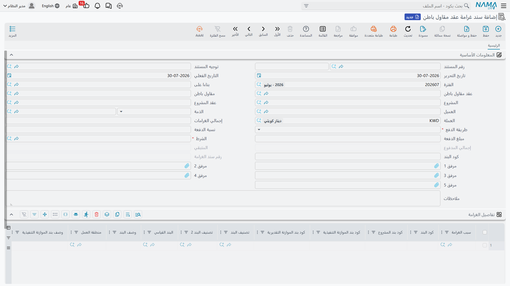

# غرامات مقاول الباطن

عمالة المباني تبني أربعين متراً مربعاً من الحوائط غير رأسية، فتُهدَم وتُبنى من جديد. أحدٌ يدفع ثمن ذلك
— السقالة بقيت أسبوعاً إضافياً، والونش عاد، والمهندس المستلم عاد — والعقد يقول إن الدافع هو مقاول
الباطن. و**سند غرامة عقد مقاول باطن** هو موضع تسجيل هذا التحميل، والمال يعود إليك بالطريقة الوحيدة
التي يتحرك بها المال بينكما: **يُستقطع من مستخلصه التالي**.

تجد المستند في **المقاولات > مقاولة مقاول باطن > سند غرامة عقد مقاول باطن**.

## ما هو مطابق لجانب المشروع

هو توأم [غرامة عقد المشروع](/ar/modules/contracting/project-contracting/contracting-project-fines.md)
باتجاه معاكس: هناك تُغرّم عقد عميلك، وهنا تُغرّم عقد مقاول باطن. وكلاهما ينشئ قيده المحاسبي الخاص
**و** يُستقطع من المستخلص التالي، وكلاهما متعدد السطور بسبب لكل سطر، وكلاهما يستخدم آلية الاسترداد
نفسها التي تستخدمها الدفعة المقدمة.

وثلاثة اختلافات تستحق المعرفة قبل البدء:

- غرامة مقاول الباطن تجمعها مستخلصات **مقاول الباطن** فقط. أما غرامات جانب المشروع فمستبعدة من ذلك
  المسح بقصد، فالغرامة على عقد عميلك لا يمكن أن تظهر أبداً كاستقطاع على مقاول باطن.
- كل سطر يحتاج **كودَي بند** — كود بند عقد الباطن وكود بند عقد العميل — لأن بند عقد الباطن جزء من بند
  عقد العميل.
- على خلاف الدفعة المقدمة، **لا يمكن للغرامة أن تُستَرد أكثر من قيمتها أبداً**. ولا يوجد أي خيار يسمح
  بأن يكون متبقيها سالباً.

## المثال الذي تسير عليه هذه الصفحة

عقد الباطن **CC-0042**، أعمال مباني، 2,000 م² بسعر 40 → 80,000، بشرط استقطاع 10% ودفعة تجهيز موقع
بـ 16,000. وخلال الشهر الثاني ترسب 40 م² من حوائط البند **3.01** في الفحص ويجب إعادة بنائها. وتُحمَّل
إعادة التنفيذ بـ **1,500** تحت سبب غرامة *إعادة تنفيذ — عدم مطابقة الجودة*، فتقع على المستخلص الثاني.

## المستند

الرأس يعرّف عقد الباطن ويحمل قاعدة الاسترداد، والجدول يحمل الغرامات.

اختر **العقد** فيُملأ مقاول الباطن والمشروع وعقد المشروع والعميل. ثم يعيد الرأس نفس مجموعة الاسترداد
التي تعرفها من
[الدفعة المقدمة](/ar/modules/contracting/contractor-contracting/contracting-contractor-advances-and-payments.md):

- **طريقة الدفع** — قاعدة الاسترداد. كل المتبقي في المستخلص التالي، أو مبلغ ثابت مع كل مستخلص، أو نسبة
  من الغرامة، أو نسبة من قيمة كل مستخلص، أو لا شيء حتى المستخلص الختامي. وكما في الدفعة المقدمة، حقل
  **نسبة الدفعة** لا يُفتح إلا لطريقتي النسبة، وحقل **المبلغ** لا يُفتح إلا لطريقة القيمة الثابتة.
- **الشرط** — إجباري. الشرط الذي يُقيَّد الاسترداد من خلاله، وهو الذي يحدد الحسابات التي يقع عليها سطر
  الاستقطاع في المستخلص.
- **إجمالي الغرامات** و**إجمالي المدفوع** و**المتبقي** — للقراءة فقط، تُحدَّث كلما استهلكت
  المستخلصات الغرامة.
- **الذمة** — الحساب الذي يقع عليه التحميل. وهذا الحقل له وزن حقيقي على الغرامة: فالطرف المحاسبي على
  هذا المستند يأخذ ذمته من هنا أو من العقد، فإن تركته فارغاً لم يجد القيد ما يتعلق به.
- **رقم سند الغرامة** — تسلسل داخل عقد الباطن، يُملأ عند الاعتماد.

واختيار **توجيه المستند** يملأ مسبقاً طريقة الدفع والنسبة والمبلغ والشرط، وهكذا تصبح سياسة الغرامات في
المنشأة إعداداً افتراضياً لا شيئاً يُكتب من الذاكرة.

::: tip إيجاد عقد باطن مغلق في قائمة الاختيار
بعد اعتماد مستخلص ختامي يصبح عقد الباطن منتهياً ويتوقف عن الظهور في قائمة اختيار العقد في المستندات
الجديدة — باستثناء واحد. فتوجيه سند الغرامة يحمل خيار *إظهار العقود المنتهية*، وعند تشغيله تعود عقود
الباطن المغلقة إلى القائمة. وهناك تحذيران: هذا الخيار موجود على توجيه الغرامة فقط، فلا يؤثر على ما
يعرضه المستخلص أو الدفعة المقدمة. وكوْنك تستطيع **اختيار** عقد باطن مغلق ليس كوْنك تستطيع الاعتماد
عليه: فذلك يحتاج إضافةً خيار إعدادات المقاولات الذي يسمح باستخدام العقود المنتهية أصلاً.
:::

### سطور الغرامة

سطر لكل غرامة، بسببها الخاص وأكواد بنودها الخاصة وقيمتها الخاصة:

| العمود | ما هو |
|---|---|
| **سبب الغرامة** | من كتالوج أسباب غرامات المقاولات — تأخير، إعادة تنفيذ، مخالفة سلامة، إضرار بالأعمال، خامات غير مطابقة |
| **كود البند** | أي بند من عقد الباطن تُحمَّل عليه الغرامة |
| **كود بند المشروع** | البند المقابل في عقد العميل |
| كود بند الموازنة التنفيذية / التقديرية | سطور الموازنة المقابلة، مقترحة من موازنات عقد العميل |
| البند القياسي، تصنيف البند، وصف البند، منطقة العمل | أعمدة وصفية، تُملأ من كود البند الذي تختاره |
| **قيمة الغرامة** | المبلغ |
| الذمة | حساب خاص بهذا السطر، إن اختلف عن حساب الرأس |

وأعمدة أكواد البنود الثلاثة تُقرأ من عقود مختلفة، والنظام يعرف الفرق: **كود البند** يُبحث في **عقد
الباطن**، أما كود بند المشروع وأكواد الموازنة فتُبحث في **عقد العميل** وموازنتيه. واختيار أي منها يملأ
الأعمدة الوصفية ووصف البند المقابل.

و**كود بند المشروع إجباري في كل سطر ولا شيء يخفّف هذا**. كما أن كود بند عقد الباطن إجباري كذلك، وإن كان
خيار في توجيه المستند يستطيع أن يجعله اختيارياً للمنشآت التي تقيّد الغرامات على مستوى المشروع. وسبب
القاعدة الصارمة هو المرجع المتقابل: الغرامة التي لا يمكن تتبعها إلى سطر في عقد العميل لا يمكن أن تنعكس
في تكلفة ذلك العقد. وأكواد البنود **الرئيسية** (العناوين) مرفوضة في سطور الغرامة كما هي مرفوضة في كل
مكان آخر.

وعلى CC-0042 يحمل المستند سطراً واحداً: السبب *إعادة تنفيذ — عدم مطابقة الجودة*، وكود البند **3.01**،
وكود بند المشروع **3.01**، وقيمة الغرامة **1,500**. فيصبح إجمالي الرأس 1,500 والمتبقي 1,500.

## ما يقيّده المستند

اعتماد الغرامة يرسل **طلب أعمال** محاسبياً إلى الطابور يُعالَج في الخلفية، وهو قابل للإعادة من شاشة
**طلبات الأعمال** عبر **المزيد > إعادة المعالجة / إعادة الاعتماد**.

والقيد زوج واحد، يُقيَّد **لكل سطر غرامة** — فغرامة بأربعة سطور تنتج أربعة قيود، كل منها يحمل مراجع
سطره. والحسابات تأتي من توجيه المستند، مع بديل واحد: خيار في التوجيه يأخذ الحسابات من **شرط** المستند
بدلاً من ذلك، ويرجع إلى زوج التوجيه إن لم يكن للشرط حسابات. وهذا مفيد إذا كانت حسابات الغرامات معرَّفة
أصلاً على الشرط الذي تسترد من خلاله وتفضّل تعريفها مرة واحدة.

والقراءة المعتادة **مدين مستحق مقاول الباطن، ودائن إيرادات غرامات** — فما عليك له صار أقل، وأنت كسبت
شيئاً. ولاحظ أن هذا القيد يُنشأ عند اعتماد الغرامة، بمعزل تام عن المستخلص؛ فاسترداد الغرامة في مستخلص
حركة ثانية منفصلة.

## كيف تصل إلى المستخلص

تماماً كالدفعة المقدمة. كل
[مستخلص مقاول باطن](/ar/modules/contracting/contractor-contracting/contracting-contractor-extracts.md)
يمسح عقد الباطن باحثاً عن الغرامات والدفعات المقدمة والدفعات الأخرى وحمولات الخامات المعتمدة التي لا
يزال لها متبقٍّ وتاريخها لا يتجاوز تاريخ المستخلص، ويكتب سطر استقطاع لكل مصدر في جدول **الإضافات و
الاستقطاعات** — يحمل الغرامة كسند شرط. فإما أن يضغط المساح *تجميع الشروط*، أو يكون توجيه المستخلص
مضبوطاً على التجميع مع كل حفظ.

وهناك تفصيل خاص بالغرامات: الاسترداد يُجمَّع **بحسب كود البند** لا بحسب السطر. فغرامة بثلاثة سطور على
البند 3.01 وسطر على البند 3.02 تُعرَض على المستخلص كمبلغين، وتُطبَّق قاعدة الاسترداد على كل منهما. فإن
أردت استرداداً منفصلاً لكل غرامة، فرّقها على مستندات أو على بنود لا على سطور.

وعلى CC-0042 يجمع المستخلص الثاني:

| الشرط | من | الاستقطاع |
|---|---|---|
| استقطاع ضمان 10% | شرط الاستقطاع على عقد الباطن | 2,800 |
| استرداد الدفعة المقدمة | الدفعة المقدمة بـ 16,000 | 5,600 |
| غرامة إعادة التنفيذ | سند الغرامة، البند 3.01 | 1,500 |

فقيمة عمل المستخلص 28,000 زائد 4,200 ضريبة، ناقص 9,900 استقطاعات، تترك **22,300** ليُصرف له. وينزل
متبقي الغرامة إلى صفر، وتعرض صفحة **الإحصائيات** على المستخلص هذه الغرامة بين المستندات التي استهلكها
— وهو الموضع الذي تنظر فيه عندما يسأل أحد عن سبب الاستقطاع.

## ما يمكن تعديله وما لا يمكن بعد الاعتماد

القواعد هنا أضيق منها على الدفعة المقدمة، لأن الغرامة اتهام معلَّق به مال:

- **بعد أن يستهلك مستخلصٌ غرامةً تُقفل الغرامة** — *«لا يمكنك تعديل أو حذف هذه الغرامة لأنها مستخدمة
  في …»*. صحّح المستخلص أولاً إن كان المبلغ خاطئاً.
- لا يمكنك تعديل أو حذف كود بند له بالفعل حركات استرداد.
- **المتبقي لا يمكن أن يكون سالباً أبداً.** للدفعة المقدمة خيار في التوجيه يسمح بالاسترداد الزائد، أما
  الغرامة فلا؛ ويفشل حفظ المستخلص بدلاً من أن يسترد أكثر من قيمة الغرامة.
- المستخلص **الختامي** يسترد كل المتبقي من كل غرامة أيّاً كانت طريقة الدفع، ويرفض الحفظ ما دام لأي
  غرامة رصيد. فلا يمكنك إغلاق عقد باطن وغرامة لم تُسوَّ.

## الأسباب التي تقف خلف الغرامات

**سبب الغرامة** ملف رئيسي صغير مستقل، وهو الموضع الوحيد الذي يُسجَّل فيه *لماذا* — فسطور الغرامة تحمل
المبلغ والبند، والسبب يحمل التصنيف. ويستحق أن تنفق عشر دقائق على القائمة قبل تحرير أول غرامة، لأنه ما
يجعل السؤال «كم استرددنا من مقاولي الباطن مقابل إخفاقات الجودة هذا العام، وفي أي مشروعات؟» سؤالاً له
جواب. ويُعَدّ مع بقية كتالوجات الوحدة الصغيرة في
[وحدات القياس والمهام والملفات المساعدة](/ar/modules/contracting/setup/contracting-lookups.md).
