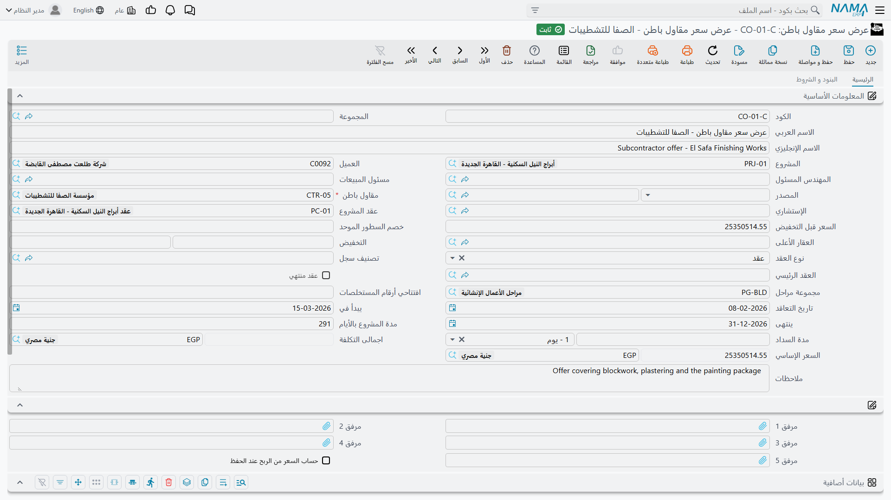

# عرض سعر مقاول الباطن

قبل أن تُسند حزمة عمل تسأل منشأتين أو ثلاثاً عن سعرها. وكل إجابة قائمة كميات مسعّرة قائمة بذاتها — أسعاره، ونسبة الضمان المحتجز التي يقبلها، والدفعة المقدمة التي يطلبها قبل وصول العمالة — وعرض سعر مقاول الباطن هو الموضع الذي تسجّل فيه ذلك، سجل لكل منشأة.

تجده في **المقاولات > مقاولة مقاول باطن > عرض سعر مقاول باطن**، ويحتاج ترخيص `contracting`.

::: tip هو ملف رئيسي، وشكله شكل العقد لا شكل عرض السعر
أمران يميّزانه عن [عرض سعر المقاولات](/ar/modules/contracting/project-contracting/contracting-offers.md) في جانب المالك، وكلاهما مهم.

**هو ملف رئيسي.** لا دفتر ولا رقم مستند ولا تاريخ فعلي ولا فترة مالية ولا توجيه مستند — بل كود ومجموعة واسم عربي واسم إنجليزي، كأي ملف رئيسي. ولا يُثبت شيء ولا يُحجز شيء عند حفظه.

**ولا يحمل تحليل تكلفة.** فعرض سعر جانب المالك هو المستند الذي تتحول فيه التكلفة إلى سعر: أربعة جداول تفكّك كل بند إلى خامات وعمالة ومقاولي باطن ومصروفات، ثم تحوّل هامش الربح الإجمالي إلى سعر. لا يوجد شيء من ذلك هنا، ولا حاجة إليه — فسعر مقاول الباطن **هو** تكلفتك. والذي يحمله هذا السجل بدلاً منه هو شكل عقد الباطن نفسه: جدول البنود نفسه، وجدول الشروط نفسه، وجدول الأقساط نفسه.
:::

وهذه النقطة الأخيرة هي مفتاح الشاشة كلها عملياً. فعرض سعر مقاول الباطن و[عقد مقاول الباطن](/ar/modules/contracting/contractor-contracting/contracting-contractor-contract.md) مبنيان من سطور متطابقة البنية، ولهذا فإن التحويل في النهاية نسخٌ مباشر لا عملية مطابقة. اقرأ صفحة عقد الباطن لتفاصيل الجداول؛ وهذه الصفحة تتناول ما يخص مرحلة عرض السعر.

## المثال الذي تتبعه هذه الصفحة

ثلاث منشآت تُسأل عن سعر أعمال المباني في **برج A** لحساب **الفنار للتطوير** — 2,000 م² مباني بلوك 20 سم، وهي البند `3.01` في عقد العميل PC-2026-001:

| العرض | المنشأة | الكمية | سعر الوحدة | الإجمالي | وما يطلبه أيضاً |
|---|---|---|---|---|---|
| `CCO-0031` | البناء للمقاولات | 2,000 م² | **40.00** | **80,000** | ضمان محتجز 10%، ودفعة مقدمة 16,000 |
| `CCO-0032` | رواسي للمقاولات | 2,000 م² | 42.00 | 84,000 | ضمان محتجز 5%، وبلا دفعة مقدمة |
| `CCO-0033` | النهضة للمقاولات | 2,000 م² | 38.50 | 77,000 | ضمان محتجز 10%، ودفعة مقدمة 24,000، ومدة أطول بأربعة أسابيع |

نُسند العمل إلى `CCO-0031`، فيصبح عقد الباطن **CC-0042**.

## الصفحة الأولى — من يسعّر، ولأي عمل

الترويسة هي ترويسة عقد الباطن حقلاً بحقل، ناقصاً شيئاً واحداً: لأن عرض السعر لا ينتج مستندات، فليس فيه أيٌّ من القوائم القابلة للطي بالحصور والمستخلصات والغرامات والدفعات التي تزحم أسفل الصفحة الرئيسية في عقد الباطن.

والحقول التي تحمل المعنى:

| الحقل | لماذا يهم |
|---|---|
| **مقاول باطن** | إجباري — صاحب هذا العرض. عرض واحد لكل منشأة لكل حزمة |
| **عقد المشروع** | عقد العميل الذي تُقتطع الحزمة منه |
| **المشروع** و**العميل** | يُحملان كسياق، لأن الحزمة تعيش داخل عقد عميل |
| **الإستشاري** | استشاري المشروع، حيث يوجد |
| **نوع العقد** | *عقد* أو *ملحق* أو *تعديل لعقد* — القيم الثلاث نفسها الموجودة على عقد الباطن |
| **السعر قبل التخفيض** وحقلا **التخفيض** و**الإجمالي** و**اجمالى التكلفة** | المال، وكله محسوب من السطور |
| **تاريخ التعاقد** و**يبدأ في** و**ينتهى** و**مدة المشروع بالأيام** | البرنامج الزمني الذي يسعّر على أساسه |
| **مدة السداد** | مدة السماح المالي التي يطلبها، كقيمة ووحدة |

وإلى جانبها مجموعتا الحسابات والضرائب — فعرض السعر يمكن أن يكون ذمّة محاسبية بنفسه كعقد الباطن — ثم المحددات، والمرفقات الخمسة (وهي الموضع الطبيعي لملف الـ PDF الذي أرسله إليك)، وجدول **بيانات إضافية** حر من أرقام ونصوص وتواريخ ومراجع لا يقرأه شيء في النظام ويمكنك استخدامه لأي غرض.

## الصفحة الثانية — قائمة الكميات المسعّرة

صفحة *البنود و الشروط* هي موضع العرض فعلاً، وهي صفحة عقد الباطن الثانية بالجداول الثلاثة نفسها وبالترتيب نفسه.

### جدول البنود

سطر لكل بند عمل، وكل سطر يشير إلى **بند قياسي** — وهو الذي يوفّر وحدة القياس والسعر الافتراضي والحسابات التي سيُثبت عليها المستخلص لاحقاً — وأكواد البنود المنقّطة تُشكّل شجرة لا يحمل المال فيها إلا السطور الفرعية، أما السطور الرئيسية فتُعاد جمعها من أبنائها.

في `CCO-0031` سطر مسعّر واحد:

| الكود | البند القياسي | الوحدة | الكمية | سعر الوحدة | إجمالي السعر | كود بند المشروع |
|---|---|---|---|---|---|---|
| `3.01` | مباني بلوك 20 سم | م² | 2,000 | 40.00 | 80,000 | `3.01` |

والعمود الأخير هو الذي لا مقابل له في جانب المالك، ويستحق أن تملأه في مرحلة عرض السعر ولو لم يُلزمك شيء بذلك بعد: **كود بند المشروع** يربط السطر بالبند الذي بعته للفنار، وينتقل إلى عقد الباطن حيث يصبح إجبارياً. وشقيقاه — كودا بند الموازنة التقديرية والتنفيذية — يفعلان الشيء نفسه إزاء [الموازنات](/ar/modules/contracting/budgets/contracting-executive-budget.md).

وفوق الجدول زرّان: **تحديث الأكواد** يعيد ترقيم الجدول كله من أوله (وسيطمس أكواداً كتبتها بيدك)، و**تحديث أكواد البنود الفارغة فقط** هو النسخة الآمنة التي تملأ الفراغات وتترك الأكواد القائمة كما هي. والكميات تُكتب، أو تُشتق من العدد والطول والعرض والارتفاع إذا أظهرت إعدادات المقاولات تلك الأعمدة.

### جدول الشروط

الشروط التجارية التي يسعّر على أساسها: الضمان المحتجز، واسترداد الدفعة المقدمة، وغرامات التأخير. كل سطر يسمّي **شرطاً** من [كتالوج الشروط](/ar/modules/contracting/setup/contracting-conditions.md) ونوع قيمة وقيمة؛ وكون الشرط إضافة أو استقطاعاً من صفة الشرط نفسه لا من السطر.

في `CCO-0031` سطر واحد — *استقطاع ضمان، نسبة من الإجمالي، 10* — وهو سبب ملء هذا الجدول في مرحلة العرض: **الشروط تُنسخ إلى عقد الباطن عند التحويل**، فلا يُعاد إدخال ما تفاوضت عليه. وعلى عرض السعر هو توثيق وناقل؛ ولا شيء في هذا السجل يحسب منه. أما على عقد الباطن فيصبح حياً، ويُنتج استقطاعه في كل [مستخلص](/ar/modules/contracting/contractor-contracting/contracting-contractor-extracts.md).

### جدول الدفعات

خطة الأقساط التي يطلبها: كود القسط ووصفه ونسبته وقيمته وتاريخه. تكتب السطور بيدك، أو تختار **نموذج دفع** وتترك النظام يوزّع المبلغ.

::: warning جدول الدفعات لا ينجو من التحويل
فلا سطور الأقساط ولا نموذج الدفع يُنسخان إلى عقد الباطن — وجدول العقد هو الذي يُنشئ شيكاته. فإن كانت خطة الأقساط جزءاً مما اتفقتم عليه فتوقّع إعادة إدخالها على العقد. وهذا أكثر ما يُفقد في هذه الخطوة.
:::

وفي الصفحة كذلك: حقل **نموذج العقد**، ونسبتا الضريبة في الترويسة ومجموعة *الإجماليات* التي تملؤها (الصافي قبل الضريبة، وإجمالي الضريبة 1، والصافي بعد الضريبة، والضريبة 2)، ومجموعة تحدد ما إذا كان كل من خانات الخصم الثماني يُدخل كنسبة أم كقيمة.

## المقارنة بين العروض

لا توجد شاشة لمقارنة العروض، ولا شيء يقيّم العروض أو يرتّبها لك. ثلاثة سجلات وثلاثة إجماليات: تقرأها متجاورة في شاشة قائمة عروض الأسعار، ثم تقرّر.

والذي تعطيه لك الوحدة فعلاً هو الثقة بأنك تقارن المتماثل بالمتماثل، بشرط أن تكون العروض الثلاثة مبنية على أكواد البنود نفسها. فلأن البنود تأتي من [كتالوج البنود القياسية](/ar/modules/contracting/setup/contracting-standard-terms.md) نفسه، فالبند `3.01` في `CCO-0031` والبند `3.01` في `CCO-0033` هما بند العمل نفسه مقيساً بالوحدة نفسها، والفرق بين 40.00 و 38.50 فرق سعر حقيقي لا فرق في المسعَّر. والطريق المعتاد إلى ذلك أن تبني العرض الأول ثم تستخدم **نسخة مماثلة** للعرضين الآخرين وتغيّر الأسعار.

وهناك أمران يوزنان مع الإجمالي، لأن كلاً منهما سيكلفك مالاً حقيقياً لاحقاً: **الدفعة المقدمة** التي يطلبها — فـ 24,000 مقابل 16,000 تعني 8,000 إضافية من نقديتك محتجزة حتى تُسترد [الدفعة](/ar/modules/contracting/contractor-contracting/contracting-contractor-advances-and-payments.md) — و**نسبة الضمان المحتجز**، التي تحدد كم تُبقي في يدك من كل شهادة حتى قبول الأعمال.

## الإسناد: تحويل عرض السعر إلى عقد

احفظ عرض السعر أولاً — فكلا زرَّي التحويل يشترط الحفظ — ثم اضغط أحد الزرّين فوق جدول البنود:

- **تحويل لعقد** يأخذ العرض كله.
- **تحويل لعقد بالسطور المختارة فقط** يأخذ سطور البنود المؤشَّرة في خانة **مختار** فقط، للحالة التي تُسند فيها جزءاً من الحزمة لمنشأة وجزءاً لأخرى.

وفي الحالتين يُفتح **عقد باطن جديد غير محفوظ** بمحتوى العرض داخله. ولم يُنشأ شيء بعد: راجع الأسعار، واملأ ما لم ينتقل، ثم احفظ. وإن أغلقت الشاشة فلا عقد — وعرض السعر كما هو، فيمكنك تحويله مرة أخرى.

وما ينتقل:

| ينتقل | لا ينتقل — أعد إدخاله على العقد |
|---|---|
| مقاول الباطن وعقد المشروع والإستشاري والمشروع والعميل | جدول الأقساط ونموذج الدفع |
| السعر قبل التخفيض وقيمة التخفيض ونسبته | تاريخ التعاقد وتاريخا البداية والنهاية |
| المهندس المسئول والملاحظات ونوع العقد | نسبتا الضريبة في الترويسة، وخصم السطور الموحد |
| **المصدر** — مرجع يعود إلى عرض السعر هذا | مجموعة المراحل والعقار الأعلى |
| كل سطور البنود بكمياتها وأسعارها ومراجعها | مجموعة الحسابات والأسماء والكود الإنجليزي |
| كل سطور الشروط | المرفقات وجدول البيانات الإضافية |

وحقل **المصدر** هو طريقة العقد في تذكّر أصله: فمن يفتح CC-0042 يمكنه أن يعود مباشرة إلى العرض الذي أنتجه، ويرى مكتب الموقع أسعار أي منشأة هي المطبَّقة.

::: info عرض السعر ليس الطريق الوحيد إلى عقد باطن
هناك ثلاثة طرق أخرى، وكلها تحويل بزر واحد كهذا: [عقد المشروع](/ar/modules/contracting/project-contracting/contracting-project-contract.md) يمكنه أن يُنشئ عقد باطن من سطوره المختارة — وهذا هو الطريق الطبيعي عندما تُسند جزءاً مما بعته — وكذلك [مقايسة المقاولات](/ar/modules/contracting/project-contracting/contracting-assays.md) و[الموازنة التقديرية](/ar/modules/contracting/budgets/contracting-estimated-budget.md) و[الموازنة التنفيذية](/ar/modules/contracting/budgets/contracting-executive-budget.md). استخدم عرض السعر عندما تكون الأرقام من مقاول الباطن، واستخدم الطرق الأخرى عندما تكون الأرقام منك.
:::

## للقراءة بعد ذلك

- [عقد مقاول الباطن](/ar/modules/contracting/contractor-contracting/contracting-contractor-contract.md) — ما يصير إليه العرض الفائز، والصفحة التي تشرح هذه الجداول بالتفصيل.
- [دورة مقاول الباطن](/ar/modules/contracting/contractor-contracting/contracting-contractor-cycle.md) — موضع هذا السجل في السلسلة.
- [عرض سعر المقاولات](/ar/modules/contracting/project-contracting/contracting-offers.md) — عرض جانب المالك، حيث التكلفة هي التي تحدد السعر.
- [البنود القياسية](/ar/modules/contracting/setup/contracting-standard-terms.md) و[الشروط التعاقدية](/ar/modules/contracting/setup/contracting-conditions.md) — المفردات التي بُني منها جدولا البنود والشروط.
- [المقاولون والاستشاريون](/ar/modules/contracting/setup/contracting-contractors-and-consultants.md) — ملف الجهة الذي يسمّيه عرض السعر.
