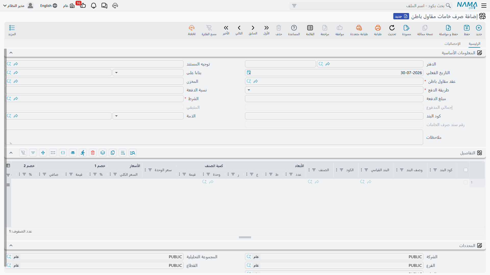
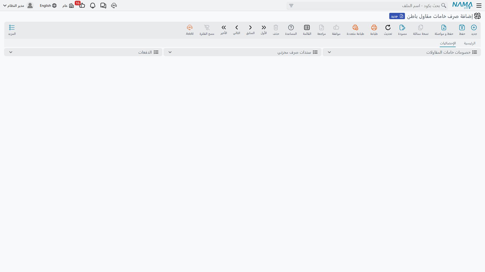
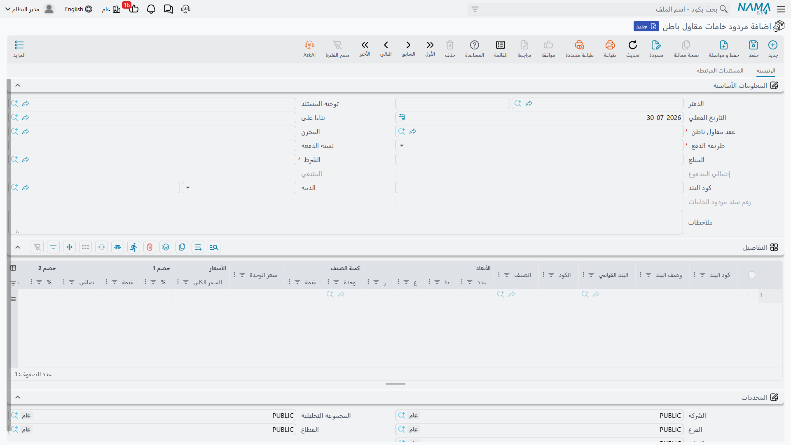

# صرف الخامات لمقاول الباطن

المقاولون يورّدون لمقاولي الباطن عندهم باستمرار. أنت تشتري الأسمنت بالنقلة وهو يشتريه بالشيكارة، فتعطيه
من عندك — لكن ليس بالمجان. الشِّكَر تخرج من مخزونك، وتُحمَّل على حسابه، وحين يأتي مستخلصه تُخصَم قيمتها
مما هو مستحق له.

وهذا بالضبط ما تفعله الوحدة، وهو سبب اختلاف مستندات *مقاول الباطن* اختلافاً كبيراً عن مستندات *المقاولات*
المجاورة لها في القائمة. **صرف خامات مقاول باطن بيع.** فهو مستند بيع بتأثير فاتورة كامل: سعر على كل سطر،
وخصومات، وضرائب، ومديونية تُرفَع على مقاول الباطن، وسجل خصم يحوّله مستخلصه القادم إلى خصم فعلي. ولا شيء
فيه يمسّ تكلفة المشروع — فالخامة كفّت عن كونها تكلفتك في اللحظة التي بعتها فيها.

والمستندات الثلاثة، كلها تحت **المقاولات > التكاليف** وكلها تحتاج ترخيص `contracting`:

| المستند | ماذا يفعل |
|---|---|
| طلب صرف خامات مقاول باطن | اعتماد مسعَّر؛ لا يسجّل شيئاً |
| صرف خامات مقاول باطن | خروج مخزون، وتسجيل فاتورة، وإنشاء سجل الخصم |
| مردود خامات مقاول باطن | رجوع المخزون، وإشعار دائن، وعكس الخصم |

وإذا كان ما تريده فعلاً خامة تُستهلك على مشروعك أنت فذلك
[صرف الخامات للمشروع](/ar/modules/contracting/costs/contracting-project-materials).

## الترويسة تحمل شروط السداد

تبدو الترويسة كمستند مخزني حتى تصل إلى منتصفها، فتبدأ في الظهور كبيع بالأجل.

| الحقل | |
|---|---|
| **العقد** | إجباري، ولا يقبل إلا **عقد مقاول باطن** — لا عقد مشروع أبداً |
| **المخزن** | مصدر الخامة؛ وقيمة الترويسة تُفرَض على كل سطر |
| **طريقة السداد** | إجبارية — كيف يُسدَّد هذا المبلغ، وهو عملياً يعني الخصم من مستخلصه |
| نسبة الدفع وقيمة الدفع | كم من المبلغ يُسدَّد بتلك الطريقة |
| **الشرط** | إجباري — [الشرط التعاقدي](/ar/modules/contracting/setup/contracting-conditions) الذي سيحمل الخصم عند وصوله إلى المستخلص |
| **كود البند** | قيمة افتراضية على الترويسة تُدفَع إلى كل سطر |
| حقلان يحسبهما النظام | كم سُدِّد من قيمة هذا المستند وكم بقي منه |
| رقم متسلسل يحسبه النظام | ترتيب هذا الصرف بين صروف نفس العقد: فالأول 1 والثاني 2 |
| الذمة والتواريخ و*بناءا على* والملاحظات | ترويسة المستند المعتادة |

وحقل **الشرط** هو الذي يتجاوزه الناس بأعينهم، وهو أهم من موضعه على الشاشة. فالخصم لا يصل إلى المستخلص من
فراغ: هو يصل **كسطر شرط**، وهذا الحقل هو الذي يسمّي الشرط. فاختر شرطاً موجوداً للغرض — شرط «خصم خامات» —
واجعله القيمة الافتراضية على توجيه المستند حتى لا يحتاج أحد إلى تذكّره.

والسطور سطور بيع عادية: كود البند والبند القياسي والصنف وكوده والأبعاد والكمية، ثم بلوك السعر الكامل —
سعر الوحدة والسعر ومستويات الخصم والضرائب و**الصافي**. والصافي هو الرقم الذي يصبح خصماً، فهو الرقم الذي
تراجعه قبل الاعتماد.

وما لم يجعله التوجيه غير إجباري، فـ**كود البند على السطر إجباري ويجب أن يكون موجوداً في قائمة بنود عقد
مقاول الباطن**. وهذا ما يربط الخصم ببند من أعماله، وهو كيف يعرف المستخلص بجوار أي سطر من سطوره يقع
الخصم.

## ماذا يفعل اعتماد الصرف

أربعة أشياء، ويستحق كل منها الفصل لأن كلاً منها ظاهر في موضع مختلف.

1. **تُسجَّل الفاتورة.** يُنشئ المستند تأثيراً محاسبياً عادياً كطلب أعمال في الخلفية، بالحسابات المضبوطة
   على توجيه المستند: جانب المديونية على مقاول الباطن مقابل خروج المخزون، مع الضريبة. وهذا بيع حقيقي في
   دفتر الأستاذ.
2. **يتحرك المخزون.** يُنشأ **سند صرف مخزني** ويُعتمد تلقائياً، حاملاً السطور والمخزن والموقع. وكما في
   كل مستند مُنشَأ في هذه العائلة، فدفتر سند الصرف المُنشَأ وتوجيهه يأتيان من **توجيه هذا المستند نفسه**
   — واترك أياً منهما فارغاً فلن يُنشأ أي مستند مخزني، فتُسجَّل الفاتورة ولا تخرج الخامة من المخزن.
   والعكس يعمل أيضاً: أفرِغ التفاصيل فيُحذف المستند المخزني المُنشَأ.
3. **يُكتب سجل خصم**، سجل لكل سطر، يحمل عقد مقاول الباطن وكود البند والصنف وصافي قيمة السطر، ولا مستخلص
   عليه بعد.
4. **يُضبط الرصيد المستحق.** فالمتبقي على الترويسة يصبح صافي قيمة المستند، ويصبح متبقي كل سطر صافي قيمة
   مجموعة بنده. وهذا المتبقي غير الصفري هو العلامة التي تجعل المبلغ ظاهراً للمستخلص القادم.

## كيف يصل المبلغ إلى مستخلصه

عند إعداد [مستخلص مقاول الباطن](/ar/modules/contracting/contractor-contracting/contracting-contractor-extracts)
لنفس العقد، يجمع المستخلص مستندات صرف الخامات المعتمدة التي ما زال لها قيمة متبقية وتاريخها في تاريخه أو
قبله، ويحوّل كلاً منها إلى **سطر شرط يحمل قيمة خصم** — الشرط المسمَّى، وكود البند، والمبلغ. ثم يدخل الخصم
في صافي المستحق للمستخلص إلى جانب المحتجز والدفعة المقدمة والغرامات، ويُعكَس إذا أُلغي المستخلص.

وعند اعتماد المستخلص يُسوَّى أمران:

- كل سجل خصم **يُوسَم بالمستخلص الذي استوعبه**، وهو ما تراه في صفحة **الإحصائيات** على الصرف — فعمود
  المستخلص في السطر يجيب على سؤال «هل خُصمت هذه الخامة بالفعل؟» بلا فتح أي شيء آخر؛
- ويرتفع المسدَّد على الصرف إلى القيمة المخصومة وتنزل قيمته المتبقية إلى صفر، **فلا تُجمَع نفس الخامة على
  مستخلص ثانٍ أبداً.**

::: warning بعد أن يستوعب مستخلص سطراً يُقفَل الصرف
من تلك اللحظة لا يمكن تعديل السطر ولا حذفه، وتفشل المحاولة برسالة تقول إنك حذفت أو عدّلت سطراً في مستند
مرتبط بمستخلص مقاول باطن. وهذا مقصود: فالخصم قد خرج من ماله بالفعل. ولتصحيحه لا بد من عكس المستخلص أولاً.
:::

## المردود يقلب الإشارة

**مردود خامات مقاول باطن** هو نفس المستند يعمل إلى الخلف. الخامة تخرج من حسابه وترجع إلى مخزنك، فبالتالي:

- يُنشأ **سند استلام مخزني** بدلاً من سند الصرف؛
- ويُسجَّل الجانب المالي في اتجاه الإشعار الدائن، فيعكس البيع؛
- وعلى المستخلص تظهر القيمة **إضافةً لا خصماً** — فالنظام لا يكفّ عن الخصم فقط، بل يعيد إليه المال.

وترويسته تحمل نفس بلوك السداد ورقماً متسلسلاً يعدّ مردودات العقد، وبناؤه من الصرف ينسخ عقد مقاول الباطن
والشرط وبلوك السداد وكود البند.

## الطلب

**طلب صرف خامات مقاول باطن** هو مرحلة الورق: قائمة مسعَّرة بما طلبه مقاول الباطن، وعلى أي بنود، وبأي
سعر، وبأي شروط سداد. وهو خالٍ من الأثر فعلاً — لا يسجّل شيئاً في دفتر الأستاذ، ولا يُنشئ مستنداً مخزنياً،
ولا يكتب سجل خصم.

وقيمته في ما يوفّره عليك عند تحويله إلى صرف. اختره في *بناءا على* على الصرف فينتقل عقد مقاول الباطن
والشرط وطريقة السداد ونسبة الدفع وقيمة الدفع وكود البند، فلا يُتَّفق على الطلب المسعَّر إلا مرة واحدة.
وكما في جانب المشروع، لا يشترط الصرف وجود طلب — يمكنك أن تبيع الخامة مباشرة.

## أن تضبطه مرة واحدة

أربعة أشياء على توجيه **صرف خامات مقاول باطن** هي الفرق بين مستند يعمل ومستند يعمل نصف عمله:

| على التوجيه | لماذا |
|---|---|
| **دفتر** المستند المُنشَأ **وتوجيهه** | بدونهما لا يُنشأ سند صرف مخزني ولا تخرج الخامة من المخزن |
| **الحسابات المدينة والدائنة** وحسابات الضرائب | هذا بيع؛ وبدونها لا يوجد قيد |
| **الشرط** و**طريقة السداد** و**نسبة الدفع** و**قيمة الدفع** الافتراضية | لتكون شروط السداد صحيحة دون إعادة كتابتها على كل صرف |
| هل **كود بند المشروع** غير إجباري | أبقِه إجبارياً ما لم يكن لديك سبب؛ فكود البند هو ما يضع الخصم أمام سطر من أعماله |

وللمردود نفس المجموعة، موجّهة إلى سند استلام مخزني وإلى حسابات الإشعار الدائن.

## مثال عملي: أسمنت لمقاول باطن المباني

في **برج A**، أعمال المباني على البند `3.01` مُسندة إلى مؤسسة الإنشاء الحديث بـ **80٬000** — 2٬000 م²
بسعر 40 — على عقد مقاول الباطن `CC-0042`، بمحتجز 10٪. وهو يبني ويورّد الطوب، أما أسمنت المونة فيشتريه
منا.

**وشرط موجود للغرض.** الشرط `MATDED` — *خصم خامات* — مُعَدّ مرة واحدة كشرط تعاقدي يخصم ما يوضع عليه.

1. **يطلب.** المستند `CIQ-000012`، طلب صرف خامات مقاول باطن: العقد `CC-0042`، الشرط `MATDED`، طريقة
   السداد *خصم من المستخلص*، البند `3.01`، سطر واحد — 80 شيكارة `CEM-42.5` بسعر **30٫00**، والصافي
   **2٬400**. ولا يحدث شيء بعد.
2. **نصرف.** المستند `CTI-000031`، صرف خامات مقاول باطن وحقل *بناءا على* = `CIQ-000012`، فينسخ العقد
   والشرط وبلوك السداد. اعتماد، فيحدث:
   - إنشاء سند الصرف المخزني `SI-001231` — فتخرج 80 شيكارة من `WH-SITE-A`؛
   - قيد يرفع 2٬400 مديونية على مؤسسة الإنشاء الحديث مقابل خروج المخزون، مع الضريبة حسب التوجيه؛
   - كتابة سجل خصم للعقد `CC-0042`، البند `3.01`، الصنف `CEM-42.5`، بصافي 2٬400 وبلا مستخلص عليه؛
   - والمتبقي على الترويسة 2٬400.
3. **مستخلصه الأول يجمعه.** مستخلص المباني يعتمد 800 م² بسعر 40، ويصل الخصم من تلقاء نفسه:

   | على أول مستخلص لمقاول الباطن | |
   |---|---|
   | العمل المعتمد هذه الفترة، 800 م² × 40 | 32,000 |
   | المحتجز، 10٪ | −3,200 |
   | خصم الخامات، الشرط `MATDED`، البند `3.01` | **−2,400** |
   | الصافي قبل استرداد الدفعة المقدمة والضريبة | **26,400** |

4. **ويُسوَّى.** عند الاعتماد يُوسَم سجل خصم `CTI-000031` بذلك المستخلص — ويظهر ذلك في صفحة الإحصائيات
   على الصرف — ويصبح المسدَّد 2٬400 والمتبقي صفراً. فلن يراه المستخلص التالي مرة أخرى. ومن الآن لا يمكن
   المساس بسطره.
5. **وعشرون شيكارة ترجع.** المستند `CTR-000004`، مردود خامات مقاول باطن: 20 شيكارة بسعر 30٫00 =
   **600**. وسند الاستلام `SR-000488` يدخلها المخزن، ويُسجَّل الجانب المالي كإشعار دائن، وعلى مستخلصه
   **القادم** تظهر الـ 600 **إضافةً** لا خصماً.

وأمران لا يفعلهما هذا المثال، وهما بيت القصيد من الصفحة. فهو لا يمسّ تكلفة البرج أبداً — فالـ 2٬400
إيراد، والطوب الذي صرفناه على بندنا `3.01` مستند منفصل تماماً. وهو لا يخفض قيمة العقد الـ 80٬000 أبداً:
فالعقد ما زال 80٬000 من العمل، والأسمنت مال يدين لنا به ويُحصَّل بالمقاصة.
