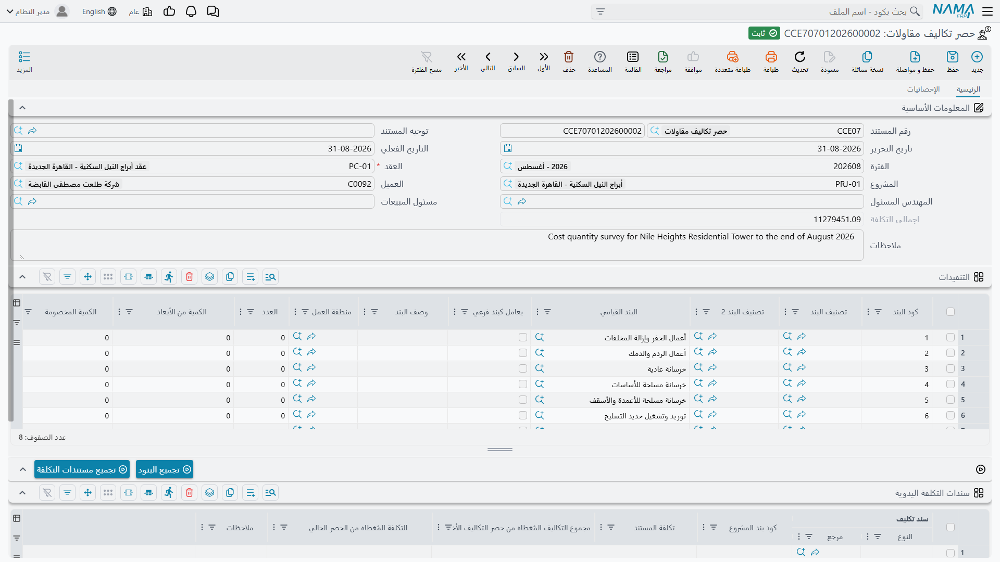
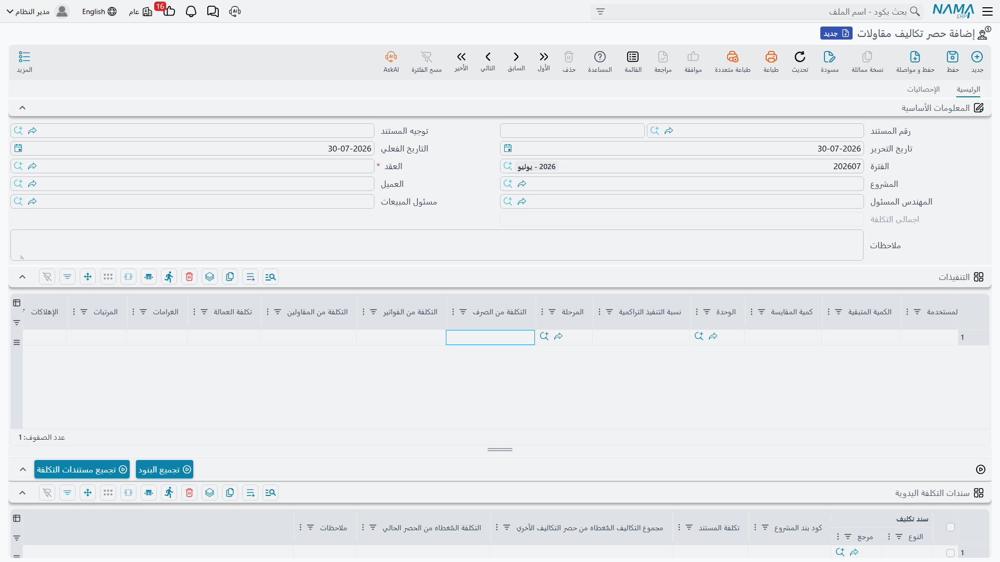

# حصر تكاليف المقاولات

سطور بنود العقد ستخبرك بأن أعمال المباني كلّفت 34٬800 حتى الآن. لكنها لن تخبرك هل هذا خبر جيد أم لا.
ولمعرفة ذلك تحتاج النصف الآخر من الجملة — *وقد بنينا بها 800 متر مربع* — لأن الرقم لا يتحول إلا حينها
إلى 43٫50 للمتر المربع، وهو ما تستطيع أن ترفعه أمام الـ 41٫00 للمتر المربع التي قُدِّرت تكلفة البند بها.

و**حصر تكاليف مقاولات** هو المستند الذي يلتقي فيه النصفان. تعلن فيه الكمية المنفَّذة في هذه الفترة،
بنداً بنداً؛ فيجمع النظام كل شريحة تكلفة أُودعت على هذه البنود ولم تُستوعب بعد، ويفصلها حسب مصدرها،
ويقسمها على كميتك فتخرج **تكلفة فعلية للوحدة**. والناتج هو المستخلص المرحلي لجانب التكلفة في المشروع،
وهو ما يعتمد عليه مستخلص العميل لاحقاً ليقول بكم كلّفتنا الكمية المفوترة.

تجده في **المقاولات > التكاليف > حصر تكاليف مقاولات**. يحتاج ترخيص `contracting`، ويحمل توجيه المستند
الخاص به خياراً واحداً بالضبط، نتناوله بعد قليل.

## الترويسة، ولماذا التاريخ الفعلي بهذه الأهمية

الترويسة قصيرة. **العقد** إجباري ولا بد أن يكون عقد مشروع، واختياره يملأ المشروع والعميل والمهندس
المسئول. و**اجمالى التكلفة** حقل يحسبه النظام — مجموع الجدول. والباقي ترويسة مستند عادية.

والحقل الذي يستحق التفكير هو **التاريخ الفعلي**، لأنه **حدّ القطع في عملية التجميع**. فعند معالجة
المستند يأخذ في اعتباره شرائح التكلفة التي تاريخها الفعلي في هذا التاريخ أو قبله، ويتجاهل ما بعده.
فحصر تكاليف بتاريخ 31 مارس يغطي تكلفة مارس، وآخر بتاريخ 30 أبريل سيأخذ كل ما في أبريل مما تركه مستند
مارس.

ولهذا أيضاً **يجب إدخال حصور التكاليف بترتيب التواريخ**. فالمستند يرفض الاعتماد إذا كان على نفس العقد
حصر تكاليف آخر — أو أي مستخلص مشروع — بتاريخ فعلي لاحق. وإذا احتجت أن تُدخِل مستند مارس المنسي بعد أن
دخل مستند أبريل، فلا بد أن يخرج مستند أبريل أولاً.

## ملء الجدول

### زر تجميع البنود يُدخل البنود

زر **تجميع البنود** يقرأ سطور بنود العقد وينشئ سطراً في جدول **التنفيذات** لكل بند. وفيه تفصيلتان
تستحقان المعرفة:

- البند الذي له مراحل مملوءة ينشئ له **سطراً لكل مرحلة** لا سطراً واحداً للبند. وهذه هي الطريقة الوحيدة
  التي توجد بها تكلفة على مستوى المرحلة في الوحدة — فالتكلفة نفسها لا تُعلَّق على مرحلة أبداً، ومن ثم
  فتكلفة المرحلة هي بالضبط تكلفة سطر الحصر الذي يسمّيها.
- البنود الأب (التجميعية) تُستبعَد، فتحصل على البنود الطرفية التي تحمل العمل فعلاً. وهناك خيار في
  إعدادات الوحدة يغيّر ذلك إذا أراد التطبيق أن تظهر أكواد الأب في الجدول أيضاً.

::: warning زر تجميع البنود يعيد بناء الجدول
لو ضغطته على مستند كتبت فيه كميات بالفعل فستفقدها. اجمع أولاً، واكتب ثانياً.
:::

### أنت تكتب رقماً واحداً في كل سطر

من بين أعمدة جدول التنفيذات الكثيرة، العمود الذي تملؤه هو **الكمية | حالي**، وهو **إجباري في كل سطر** —
فكل الغرض من المستند أن يقسم التكلفة عليه. وحوله تجد الكميات المتوقّعة: السابقة والإجمالية والمتعاقد
عليها والمخصومة، والكمية من الأبعاد، والعدد، ونسبة التنفيذ التراكمية، ومنطقة العمل، ومرحلة البند،
وتصنيفات البند ووصفه المنقولة من العقد.

وعمودان يحسبهما النظام يصبحان مهمّين بعد الاعتماد: **الكمية المستخدمة** و**الكمية المتبقية**. فمع فوترة
المستخلصات للعمل تُستهلك الكمية التي أعلنها هذا المستند، ويخبرك الباقي بكم منها ما زال متاحاً للتقييم.

وأكواد البنود يجب أن تكون **غير مكررة في الجدول** — والمستند يرفض البند المكرر.

## ماذا يحدث عند معالجة المستند

كل ما في تفصيل التكلفة يملؤه النظام عند الاعتماد؛ لا شيء منه مكتوب باليد. ولكل سطر في الجدول:

1. **يُجمَع الرصيد.** كل شريحة تكلفة لم تُستوعب على هذا العقد، تاريخها الفعلي في تاريخ المستند أو قبله،
   وكود بندها موجود في الجدول — هي مرشَّحة.
2. **يُطلب من مستندات صرف ورد الخامات تحديث تكلفتها أولاً.** فمتوسط تكلفة المخزون يتحرك، وتكلفة شيكارة
   أسمنت صُرفت في فبراير ليست بالضرورة ما كانت عليه عند اعتماد الصرف. فيُعيد النظام قراءتها قبل الجمع
   لتكون الأرقام محدَّثة.
3. **الشرائح تُسحَب منها ولا تُنسَخ.** كل شريحة تتذكر ما أخذته منها حصور التكاليف الأخرى، وهذا المستند
   لا يستطيع أن يأخذ إلا ما بقي. وإذا كانت الأرقام ستسحب أكثر من الشريحة فشل الاعتماد وأخبرك، مسمّياً
   المستند وكود البند والتكلفة الفعلية المتاحة — وهذا لا يحدث عملياً إلا في الاختيار اليدوي، أدناه.
4. **ما يُؤخذ يُجمَّع حسب المصدر** ويُكتب في أعمدة التكلفة السبعة:

| العمود | يغذّيه |
|---|---|
| التكلفة من الصرف | صرف الخامات، مطروحاً منه رد الخامات |
| التكلفة من الفواتير | فواتير المصروفات المتنوعة، وسندات دفتر الأستاذ التي تحمل كود البند |
| التكلفة من المقاولين | مستخلصات مقاولي الباطن |
| تكلفة العمالة | مستندات السركى |
| الغرامات | الغرامات على أي من جانبي العقد |
| المرتبات | تكلفة الموظفين الموزَّعة على المشروع، ومستندات الرواتب |
| الإهلاكات | تكلفة المعدات الموزَّعة على المشروع، وإهلاك الأصول |

5. **اجمالى التكلفة** هو كل ما استوعبه السطر، و**تكلفة الوحده = اجمالى التكلفة ÷ الكمية | حالي** (وتُترك
   فارغة إذا كانت الكمية صفراً). واجمالى التكلفة في الترويسة هو مجموع السطور.

والمستند **بلا أي تأثير محاسبي خاص به** — لا مدين ولا دائن. فالمال سجّلته مستندات المصدر، وهذا حصر
تحليلي محض. لكن ما **يغيّره** فعلاً هو سطور بنود العقد: يتولّى فيها أرقام الكمية من حصر التكاليف ونسب
التنفيذ، ويعكسها إذا أُلغي المستند.

وكل ذلك مخزَّن. فإذا تغيّر مستند مصدر بعد اعتماد هذا المستند، أعِد اعتماد هذا المستند.

## أن تختار الشرائح بنفسك

الاختيار التلقائي — جمع كل شيء حتى التاريخ الفعلي — هو الافتراضي والجواب الصحيح في معظم الأحيان. وحين
تحتاج تحكّماً، فعّل **تجميع مستندات التكلفة يدويا** على توجيه المستند؛ وهو الخيار الوحيد الذي يحمله هذا
التوجيه.

وبتفعيله يصبح جدول **سندات التكلفة اليدوية** هو الذي يقرر، ويملؤه زر **تجميع مستندات التكلفة**. (وبدون
تفعيل الخيار لا يفعل الزر شيئاً، وذلك مقصود.) والزر يسرد التكلفة غير المستوعبة على هذا العقد حتى
التاريخ الفعلي، ويُبقي البنود الموجودة في جدول التنفيذات فقط، ويطرح ما أخذته حصور التكاليف الأخرى، ثم
يقترح سطراً لكل شريحة باقية:

| العمود | |
|---|---|
| مستند التكلفة | للقراءة فقط — المستند المصدر الذي جاءت منه الشريحة |
| كود بند المشروع | للقراءة فقط |
| تكلفة المستند | للقراءة فقط — الشريحة كاملة |
| مجموع التكاليف المُغطاه من حصر التكاليف الأخري | للقراءة فقط — ما أخذته الحصور الأخرى بالفعل |
| **التكلفة المُغطاه من الحصر الحالي** | **الحقل الذي تعدّله** — كم يستوعب هذا المستند منها |

فمسار العمل إذن: اضغط الزر، ثم قلّل أو صفّر السطور التي لا تريدها في هذه الفترة. فلا يُستوعب إلا ما
تُبقيه في هذا الجدول، وتُبنى أعمدة التكلفة السبعة منه بدلاً من الجمع الكامل.

## صفحة الإحصائيات

الصفحة الثانية تحمل قائمتين للقراءة فقط تجيبان على السؤالين الذين يُسألان عن حصر تكاليف معتمد.

- **شرائح التكلفة التي استوعبها هذا الحصر** — سطر لكل شريحة، بالمستند المصدر ونوع التكلفة وكود البند
  وكود البند التحليلى وكارت التحليل والمبلغ والكمية. وهذا هو مسار المراجعة خلف الأعمدة السبعة: إذا قالت
  التكلفة من الصرف 900 وأردت معرفة أي مستندات صرف، فهي هنا.
- **المستخلصات التي استهلكت كميات هذا الحصر** — سطر لكل مطابقة بين سطر مستخلص وسطر من هذا المستند،
  بالكمية المستهلكة وتكلفة الوحدة المطبَّقة والتكلفة الناتجة. وبهذا ترى أي فوترة استخدمت فعلاً تكلفة
  الوحدة التي أنتجتها.

## مثال عملي: بكم كلّفنا المتر المكعب من الخرسانة حقاً؟

المستند `CCE-000004` على العقد `PC-2026-001` — برج A — بتاريخ فعلي 31 مارس 2026، على توجيه
بالتجميع التلقائي.

اضغط **تجميع البنود** فتحصل على أربعة سطور، واكتب كميات مارس. وأعمال البياض لم تبدأ فيُحذف سطرها:

| كود البند | البند | الوحدة | الكمية \| حالي |
|---|---|---|---|
| `1.01` | أعمال الحفر | م³ | 400 |
| `2.01` | الخرسانة المسلحة | م³ | 20 |
| `3.01` | أعمال المباني | م² | 800 |

اعتمد. الرصيد على هذا العقد حتى 31 مارس يحتوي على أعمال حفر مُسندة إلى الغير، وفاتورة إيجار معدات،
وإهلاك الونش، وخرسانة جاهزة وشدّة خشبية مصروفة من المخزن، وأسبوع عمالة يومية على الصبّة، وراتب مهندس
الموقع، وطوب مصروف، وأول مستخلص لمقاول باطن المباني. وكله يُسحب ويُجمَّع:

| البند | الصرف | الفواتير | المقاولون | العمالة | المرتبات | الإهلاكات | اجمالى التكلفة | الكمية \| حالي | **تكلفة الوحده** |
|---|---|---|---|---|---|---|---|---|---|
| `1.01` | – | 1,800 | 9,000 | – | – | 4,200 | 15,000 | 400 | **37.50** |
| `2.01` | 12,000 | 950 | – | 1,240 | 800 | 530 | 15,520 | 20 | **776.00** |
| `3.01` | 900 | – | 32,000 | 380 | 900 | 620 | 34,800 | 800 | **43.50** |

واجمالى التكلفة في الترويسة **65٬320**.

والآن المقارنة التي يوجد المستند من أجلها. بند الخرسانة سُعّر من
[كارت تحليل بند](/ar/modules/contracting/setup/contracting-term-analysis-cards) حلّل المتر المكعب من
خرسانة C30 إلى مواد وعمالة وأعمال مُسندة ومصروفات، ووصل إلى **740٫00 للمتر المكعب**، في مقابل سعر
البيع 900٫00 في العقد.

| الخرسانة المسلحة، للمتر المكعب | |
|---|---|
| التكلفة المحلَّلة على الكارت | 740.00 |
| التكلفة الفعلية من هذا المستند | 776.00 |
| **الفرق** | **36.00 زيادة، أي 5٪** |

وعلى 20 م³ يعني ذلك ضياع 720 من هامش الربح، والتفصيل يقول أين تنظر: 12٬000 من الـ 15٬520 خامات، أي
600 للمتر المكعب أمام مكوّن خامات محلَّل قدره 560 مثلاً — فالخرسانة الجاهزة يُطلَب منها أكثر من اللازم
أو يُهدَر منها في الصبّ. وذلك حديث مع الموقع، ومتاح في نهاية مارس لا في نهاية المشروع.

وأعمال المباني تحكي نسخة أهدأ من القصة نفسها — 43٫50 فعلية أمام 41٫00 مخططة، على بند يُباع بـ 46٫00
للمتر المربع. أما أعمال الحفر، بـ 37٫50 أمام تكلفة مخططة 42٫00 وسعر بيع 50٫00، فهي البند الذي يحقق
رقمه بأريحية.

## ماذا يحدث لهذه الأرقام بعد ذلك

الكميات التي أعلنتها صارت متاحة للفوترة. فحين يفوتر
[مستخلص المشروع](/ar/modules/contracting/project-contracting/contracting-project-extracts) عملاً على
البند `3.01` فإنه يمشي على سطور حصور التكاليف المعتمدة لذلك البند بترتيب التاريخ، ويأخذ الكمية التي
يحتاجها من أقدم سطر فيه كمية متبقية، ويقيّمها بـ **تكلفة الوحدة على ذلك السطر**. ففوترة 500 م² من
أعمال المباني تعني أن المستخلص يعترف بـ 500 × 43٫50 = **21٬750** من التكلفة الفعلية، ويترك 300 م² من
كمية هذا المستند للمستخلص التالي.

وهذا هو ما يضع رقم تكلفة حقيقياً على المستخلص، وهو — على المستخلص النهائي — ما يجعل المطابقة بين التكلفة
المعترف بها عبر الفوترة والتكلفة التي سجّلتها مستندات التكلفة ذات معنى. والسلسلة كاملة ملخّصة في
[كيف تتكوّن تكلفة المشروع](/ar/modules/contracting/costs/contracting-cost-model).
