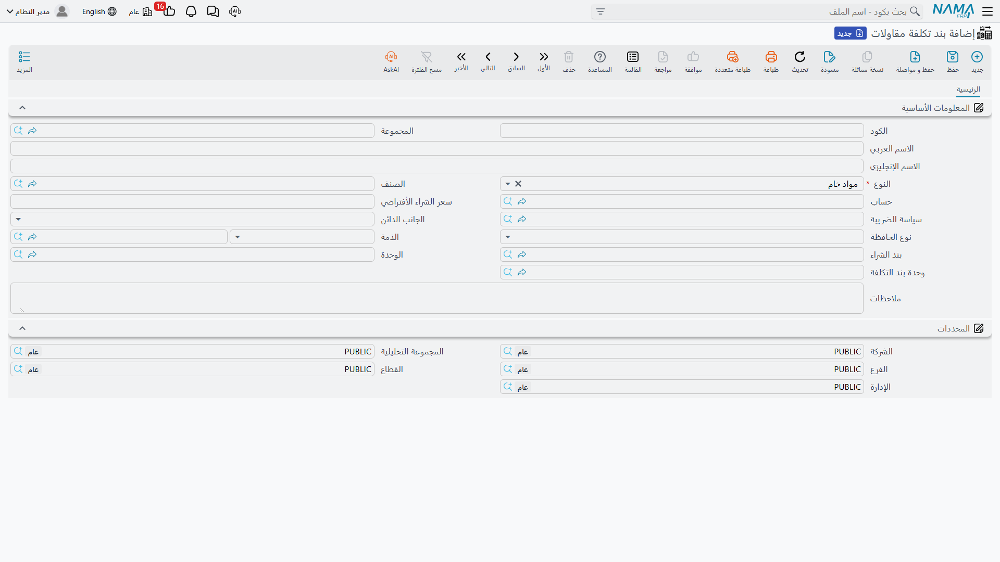

# كيف تتكوّن تكلفة المشروع

معرفة **قيمة** المشروع أمر سهل: العقد يقول 230٬000، بنداً بنداً، ولا يختلف عليها أحد. أما معرفة ما
**كلّفه** المشروع حتى اليوم فأمر أصعب بكثير، لأن التكلفة لا تأتي من مكان واحد. تأتي في صورة طوب يخرج
من مخزن الموقع، وكشف يومية يكتبه السركي، ومستخلص يعتمده مقاول الباطن، ونصيب من راتب مهندس الموقع،
وإهلاك شهري لونش البرج، وفاتورة تسوير من مورد لا يتذكر أحد كيف تم التعامل معه.

وجواب وحدة المقاولات على ذلك هو أن يُلزَم كل مستند من هذه المستندات بأن **يودع تكلفته على بند من بنود
عقد المشروع** في لحظة اعتماده. لذلك فأرقام التكلفة التي تقرأها على العقد ليست تقريراً يستعلم عن قاعدة
البيانات كلها لحظة فتحك للشاشة — بل هي مجاميع جارية كتبها كل مستند تكلفة أثناء مروره. وفهم هذه الجملة
الواحدة يفسّر تقريباً كل سؤال يُسأل عن تكاليف المقاولات.

## التكلفة تُكتب ولا تُحسب لاحقاً

عند معالجة مستند تكلفة، يكتب تكلفته في **موضعين** في نفس اللحظة، ويستحق كل موضع أن نعرف الغرض منه لأن
كل واحد يجيب على سؤال مختلف.

1. **مباشرةً على سطر البند.** تظهر التكلفة فوراً في عمودَي **التكلفة الفعلية** و**الكمية الفعلية** على
   سطر البند المطابق — في عقد المشروع، وكذلك في الموازنة التقديرية والموازنة التنفيذية وكارت تحليل
   البند إذا كان السطر يسمّيها. هذا هو رقم «كيف نحن سائرون؟» ولا يحتاج إلى أي مستند وسيط: تعتمد صرف
   خامات في الحادية عشرة، فيصبح سطر البند في العقد أعلى في الحادية عشرة ودقيقة.
2. **في رصيد من التكلفة التي لم تُستوعب بعد.** نفس التكلفة تُودع أيضاً كشريحة قابلة للاستهلاك موسومة
   ببندها ومصدرها وتاريخها الفعلي. لم يُستخدم منها شيء بعد. ولاحقاً يسحب
   [حصر تكاليف المقاولات](/ar/modules/contracting/costs/contracting-cost-execution) شرائح من هذا
   الرصيد ويوزّعها على الكميات المنفَّذة فعلاً، فتتحول إلى **تكلفة للوحدة**. وهذا هو رقم «كم كلّفنا
   المتر المكعب حقاً؟».

الموضعان كلاهما جدولان مخزَّنان، يُعاد كتابتهما كلما أُعيدت معالجة المستند المصدر. لا شيء في هذه
المنطقة يُحسب لحظياً عند العرض. والنتيجة العملية تستحق التصريح: **إذا عدّلت مستند تكلفة بعد اعتماده،
فالأرقام التالية له لا تتحرك حتى تُعاد معالجة ذلك المستند.** وبالنسبة لحصر تكاليف مُعتمَد بالفعل، يعني
ذلك إعادة اعتماد الحصر نفسه.

## أي المستندات يضع تكلفة على المشروع

هذه هي القائمة التي يخطئ فيها الناس أكثر من غيرها، وها هي كاملة. كل ما يلي يودع تكلفة على بند من عقد
مشروع، وعمود «يظهر باسم» هو اسم المصدر المستخدم في كل الوحدة، وهو نفسه العمود الذي تسقط فيه التكلفة
داخل حصر التكاليف.

| المستند | موضعه في القائمة | يظهر باسم |
|---|---|---|
| صرف خامات مقاولات، رد خامات مقاولات | المقاولات > التكاليف | التكلفة من الصرف (والرد بالسالب) |
| فاتورة مصروفات مقاولات متنوعة | المقاولات > التكاليف | التكلفة من الفواتير |
| مستخلص مقاول باطن | المقاولات > مقاولة مقاول باطن | التكلفة من المقاولين |
| مستند السركى | المقاولات > مقاولة مقاول باطن | تكلفة العمالة |
| غرامات عقد المشروع، غرامات مقاول الباطن | قائمتا المشروع ومقاول الباطن | الغرامات |
| توزيع تكاليف الموظفين والمعدات على المشاريع | المقاولات > الملفات | المرتبات للموظف، والإهلاكات للمعدة |
| طلب شراء مقاولات، أمر شراء مقاولات | المقاولات > التكاليف | **الكمية فقط** — يرفعان كمية المشتريات على سطر البند ولا يضيفان مالاً |

ومن خارج الوحدة، على نفس أكواد البنود:

| المستند | الوحدة | يظهر باسم |
|---|---|---|
| قيد اليومية، سندات القبض والدفع، الإشعارات المدينة والدائنة | الحسابات | التكلفة من الفواتير |
| إهلاك الأصول | الأصول الثابتة | الإهلاكات |
| مستند الرواتب | الموارد البشرية | المرتبات |
| تسوية المستحقات، إعادة حساب المخصصات، ومستندات تأمين السيارات | الموارد البشرية | تكلفة الموظفين — كمرتبات، أو كتكلفة تأمين تُتابَع دون عمود تفصيلي منفصل |

والسطر الأخير هو سبب ظهور قيد يومية كتبه محاسب داخل تكلفة مشروع بشكل مشروع تماماً: أي من هذه المستندات
يستطيع أن يحمل كود بند عقد مشروع على سطوره، وحين يحمله تتعامل معه آلية تكاليف المقاولات تماماً كما
تتعامل مع صرف الخامات.

### وأي المستندات لا يضع تكلفة

أربع حالات تفاجئ الناس بانتظام، وليست أي منها خطأ منك.

- **فاتورة صرف عمالة ومعدات** هي الفاتورة التي تصدرها للعمالة والمعدات المستأجرة من الخارج. هي تسجّل
  المال — التزاماً لمن وفّرها — و**لا تضيف شيئاً إلى تكلفة المشروع**. أما المستند الذي يضع تكلفة
  الموظفين والمعدات على المشروع فهو **توزيع تكاليف الموظفين والمعدات على المشاريع**، وتجده في
  [تسكين الموظفين والمعدات وتكاليفهم](/ar/modules/contracting/costs/contracting-equipment-and-allocations).
- **مستند بيان معدات** مستند محاسبي. ينتج قيد يومية بتكلفة استخدام المعدات التي تسجّلها عليه،
  و**لا يكتب أي سطور تكلفة على الإطلاق** — فلا يصل شيء إلى سطور بنود العقد، ولا يستطيع أي حصر تكاليف
  أن يراه. فتعامل معه كطريقة لتسجيل أجرة معدة في دفتر الأستاذ، لا كطريقة لتحميل تكلفة على مشروع.
- **طلب صرف الخامات** لا يحرّك شيئاً ولا يكلّف شيئاً؛ الصرف وحده هو الذي يفعل. والأمر نفسه في
  **طلب وأمر المصروفات المتنوعة** — الفاتورة وحدها في هذه الثلاثية هي التي تسجّل شيئاً.
- **توقيع العقود وتسجيل الحصر لا يسجّلان شيئاً أيضاً.** فعقد المشروع وعقد مقاول الباطن وحصر الكميات
  وحصر التكاليف كلها بلا تأثير على دفتر الأستاذ. المال يصل إلى دفتر الأستاذ في جانب العميل عن طريق
  المستخلص، وفي جانب التكلفة عن طريق المستندات المذكورة أعلاه.

## التكلفة معلّقة على كود بند

كل سطر تكلفة يحمل **كود بند** — كود سطر من جدول البنود في عقد المشروع. هذا الكود هو الخُطّاف، وهو أهم
حقل على أي مستند تكلفة.

- **سطر التكلفة الذي لا يحمل كود بند مشروع يُتجاهل بصمت.** المستند يُحفظ، ويُنتج قيد اليومية الخاص به،
  ويبدو سليماً تماماً؛ لكن تكلفته لا تصل إلى المشروع أبداً. وإذا أبلغك أحد بأن «التكلفة اختفت» فهذا هو
  السبب في الغالب. مستندات الخامات والشراء تستطيع أن تجعل كود البند إجبارياً من خلال توجيه المستند،
  وفي معظم التطبيقات ينبغي أن يكون كذلك.
- سطور التكلفة تحمل أيضاً **كود البند التحليلى** ومرجعاً إلى **كارت تحليل البند** الذي تنتسب إليه
  التكلفة. وهذا هو المحور الأدق: به تُقارَن التكلفة التي حدثت فعلاً بالتكلفة التي حُلّلت عند تسعير
  البند. راجع
  [كارت تحليل البند](/ar/modules/contracting/setup/contracting-term-analysis-cards) لمعرفة من أين يأتي
  هذا الكود وكيف تُبنى تكلفة الوحدة المحلَّلة.
- كثير من مستندات التكلفة تحمل فوق ذلك **كود بند الموازنة التنفيذية** و**كود بند الموازنة التقديرية**،
  فتسقط نفس التكلفة على سطور الموازنات أيضاً.
- التاريخ الفعلي المستخدم لشريحة التكلفة هو التاريخ الفعلي **للمستند**، لا تاريخ السطر. وهذا مهم لأن
  حصر التكاليف يجمع بالتاريخ الفعلي.
- **لا توجد تكلفة على مستوى المرحلة.** المراحل تحمل كميات لا أموالاً. وإذا احتجت تكلفة لكل مرحلة فإنك
  تحصل عليها بإنشاء سطر حصر تكاليف لكل مرحلة، وهو ما يفعله زر **تجميع البنود** تلقائياً للبنود التي
  لها مراحل.

## الكتالوج الذي تُبنى عليه التكاليف غير المخزنية: بند تكلفة مقاولات

معظم تكاليف الموقع ليست أصنافاً مخزنية. يومية بنّاء، ساعة حفار، كهرباء الموقع، نقلة خرسانة جاهزة — لكل
منها سعر وحساب ولا مخزن لها. و**بند تكلفة مقاولات** (تحت *المقاولات > الملفات*) هو الكتالوج المخصص
لهذه الأشياء بالضبط. وهو **ملف رئيسي** لا مستند: لا يسجّل شيئاً بنفسه، وإنما هو البند الذي تشير إليه
حين تصرف مالاً على شيء ليس له صنف مخزني.

سجل بند التكلفة يحمل كوداً واسماً عربياً وإنجليزياً ومجموعة وسعر شراء افتراضياً ووحدة
وسياسة ضريبة — والأهم **الجانب الدائن**، وهو الذي يقرر أين يقع النصف الآخر من القيد عند فاتورة هذا
البند: حساب المورد، أو حساب محدد، أو ذمة محددة، أو ذمة المستخدم الحالي، أو بند مشتريات متنوعة. ويمكنه
اختياراً أن يشير إلى صنف مخزني، للحالات التي يُشترى فيها الشيء أحياناً ويُصرف من المخزن أحياناً.

و**النوع** هو الحقل الذي يعطيه معناه، وله أربع قيم مألوفة من كارت التحليل:

| النوع | لماذا |
|---|---|
| مواد خام (Material) | المستهلكات والخامات الموردة |
| عمالة (Worker) | العمالة، مسعّرة باليوم أو بالساعة |
| مقاول باطن (Contractor) | العمل الذي يُشترى من الغير |
| أخري (Other) | ما بقي — إيجار المعدات، المرافق، التصاريح، النقل |

وهذه الأربع هي نفس العائلات الأربع التي يستخدمها
[كارت تحليل البند](/ar/modules/contracting/setup/contracting-term-analysis-cards) لبناء التكلفة
المخططة للبند، وهو ما يجعل الكتالوج مفيداً في الاتجاهين: تحلّل البند إلى بنود تكلفة للوصول إلى تكلفة
وحدة مخططة، ثم تصرف على نفس البنود بالضبط وتقارن.

وأين يُستهلك الكتالوج فعلاً:

- كعمود *بند تكلفة مقاولات* على
  [طلب وأمر وفاتورة المصروفات المتنوعة](/ar/modules/contracting/costs/contracting-misc-spend) وعلى
  فاتورة صرف العمالة والمعدات؛
- كبند على جداول التكلفة الأربعة في كارت تحليل البند وعرض سعر المقاولات ونموذج العقد؛
- كمصدر للتوصيل المحاسبي الافتراضي لسطر فاتورة المصروفات المتنوعة.

ثلاثة أمثلة، مسعّرة كما يفعل كتالوج حقيقي:

| الكود | الاسم العربي | الاسم الإنجليزي | النوع | الوحدة | سعر الشراء الأفتراضي |
|---|---|---|---|---|---|
| `CDC-LAB-01` | يومية عامل بناء | Mason day rate | عمالة | DAY | 120 |
| `CDC-EQP-07` | ساعة حفار | Excavator hour | أخري | HR | 300 |
| `CDC-MAT-22` | خرسانة جاهزة C30 | Ready-mix concrete C30 | مواد خام | M3 | 260 |

اختر `CDC-EQP-07` على فاتورة مصروفات متنوعة بـ 40 ساعة × 300، فتسقط 12٬000 من *التكلفة من الفواتير*
على أي بند مشروع يسمّيه السطر.

## أين تقارن التكلفة بقيمة العقد

### جدول بنود العقد — الجواب اليومي

افتح عقد المشروع، واذهب إلى صفحة البنود، واقرأ ثلاثة أعمدة من سطر واحد:

| ما تريده | العمود على سطر البند |
|---|---|
| بكم بعنا هذا البند | **اجمالى السعر** |
| بكم خطّطنا أن يكلّفنا | **اجمالى التكلفة** (المبنية على تحليل تكلفة البند) |
| بكم كلّفنا حتى الآن | **التكلفة الفعلية**، وبجوارها **الكمية الفعلية** |

ولأن التكلفة الفعلية تتولّاها كل مستندات التكلفة أثناء اعتمادها، فهذا السطر محدَّث بلا أن ينتج أحد
شيئاً. وبجواره أعمدة الكميات التي تخبرك **بمقدار** ما اعترف به كل مسار من البند — الكمية من الحصر، ومن
المستخلص، ومن حصر التكاليف، والكمية التي غطّتها أوامر الشراء بالفعل.

ونفس المقارنة الثلاثية متاحة على **الموازنة التقديرية** و**الموازنة التنفيذية** و**كارت تحليل البند**،
فتستطيع أن تقيس التكلفة الفعلية أمام التقدير، أو أمام الخطة المعتمدة، أو أمام التحليل الأصلي.

### حصر التكاليف — التكلفة حسب المصدر، وتكلفة للوحدة

[حصر تكاليف المقاولات](/ar/modules/contracting/costs/contracting-cost-execution) هو أقرب شيء إلى تقرير
تكلفة: يفصل التكلفة الفعلية لكل بند إلى صرف وفواتير ومقاولين وعمالة وغرامات ومرتبات وإهلاكات، ثم يقسم
على الكمية المنفَّذة فتخرج تكلفة للوحدة. وهو يعرض التكلفة وحدها — لا عمود إيراد فيه.

### المستخلص النهائي — الشاشة الوحيدة التي يظهر فيها الجانبان

على [مستخلص المشروع](/ar/modules/contracting/project-contracting/contracting-project-extracts) الذي
نوعه **نهائي**، يمتلئ في الترويسة بلوك صغير من مجاميع التكلفة: التكلفة الفعلية التي اعترفت بها كميات
هذا المستخلص، والتكلفة الفعلية المعترف بها في كل المستخلصات النهائية على العقد، وإجمالي التكلفة التي
سجّلتها مستندات التكلفة على الإطلاق، والفرق بين الرقمين الأخيرين — أي التكلفة التي تحمّلناها ولم تُطابَق
بعد بعمل مفوتر. وهذه الأرقام تجاور مجاميع إيراد المستخلص نفسه، فيكون المستخلص النهائي هو الموضع الوحيد
الذي تظهر فيه تكلفة المشروع وإيراده على شاشة واحدة.

::: tip لا يوجد تقرير جاهز للتكلفة أمام القيمة
الشاشات السابقة هي الجواب. وإذا احتاج عميل تقريراً مطبوعاً للتكلفة فهو يُبنى عنده من نفس الأرقام
المخزَّنة — لا تبحث عن تقرير مُسلَّم.
:::

### للمطوّر الذي يبني وحدات للبيع

إذا كان ناتج المشروع عقارات قابلة للبيع، فنفس شرائح التكلفة تُدفَع إلى أسفل على الوحدات المفردة. راجع
[ترحيل التكلفة إلى الوحدات العقارية](/ar/modules/contracting/costs/contracting-realestate-cost-bridge).

## مثال عملي: تكلفة البرج من أربعة مصادر

عقد المشروع `PC-2026-001`، **برج A** لصالح **الفنار للتطوير**، بقيمة 230٬000 على أربعة بنود
مسعَّرة:

| كود البند | البند | الوحدة | الكمية | سعر الوحدة | اجمالى السعر |
|---|---|---|---|---|---|
| `1.01` | أعمال الحفر | م³ | 1,000 | 50.00 | 50,000 |
| `2.01` | الخرسانة المسلحة | م³ | 60 | 900.00 | 54,000 |
| `3.01` | أعمال المباني | م² | 2,000 | 46.00 | 92,000 |
| `3.02` | أعمال البياض | م² | 1,000 | 34.00 | 34,000 |

أعمال المباني مُسندة إلى مقاول باطن بـ 80٬000 — 2٬000 م² × 40 — ومهندسنا وونشنا يخدمان الموقع كله.
وبنهاية مارس صار 800 م² من المباني مبنياً، ووصلت التكلفة على البند `3.01` من أربعة اتجاهات مختلفة
تماماً:

| ماذا حدث | المستند | يظهر باسم | التكلفة |
|---|---|---|---|
| طوب ورمل ومستهلكات مصروفة من مخزن الموقع خلال مارس | صرف خامات مقاولات | التكلفة من الصرف | 900 |
| عمالة يومية لأسبوع للتنظيف والرصّ | مستند السركى | تكلفة العمالة | 380 |
| أول مستخلص لمقاول الباطن باعتماد 800 م² × 40 | مستخلص مقاول باطن | التكلفة من المقاولين | 32,000 |
| نصيب مارس من راتب مهندس الموقع | توزيع تكاليف الموظفين والمعدات | المرتبات | 900 |
| نصيب مارس من إهلاك ونش البرج | توزيع تكاليف الموظفين والمعدات | الإهلاكات | 620 |
| | | **التكلفة الفعلية على `3.01`** | **34,800** |

لم يجمع أحد هذا الرقم. كل مستند من الأربعة كتب شريحته على البند `3.01` أثناء معالجته، وسطر البند في
العقد يعرض ببساطة 34٬800 في *التكلفة الفعلية* أمام *اجمالى سعر* 92٬000 و*اجمالى تكلفة* مخططة
82٬000 (41٫00 للمتر المربع).

وخُمسا أعمال المباني منجَزان، فالقراءة الصادقة هي 34٬800 صُرفت مقابل 800 م² — أي **43٫50 للمتر المربع
أمام 41٫00 مخططة**. وهذه المقارنة، والحساب الذي ينتجها، هي ما يوجد
[حصر تكاليف المقاولات](/ar/modules/contracting/costs/contracting-cost-execution) ليجعله صريحاً.

ولاحظ ما **ليس** داخل الـ 34٬800. الأسمنت الذي بعناه لمقاول باطن المباني ليس فيها، لأن
[صرف الخامات لمقاول الباطن](/ar/modules/contracting/costs/contracting-contractor-materials) بيع لا
تكلفة. وليست فيها أجرة المعدات التي سجّلناها على مستند بيان معدات، لأن ذلك المستند يصل إلى دفتر
الأستاذ فقط. ولو كان راتب مهندس الموقع في مارس قد وُزّع على سطر تُرك كود بنده فارغاً، لكانت الـ 900
ناقصة هي أيضاً — بلا أي رسالة خطأ تخبرك.
