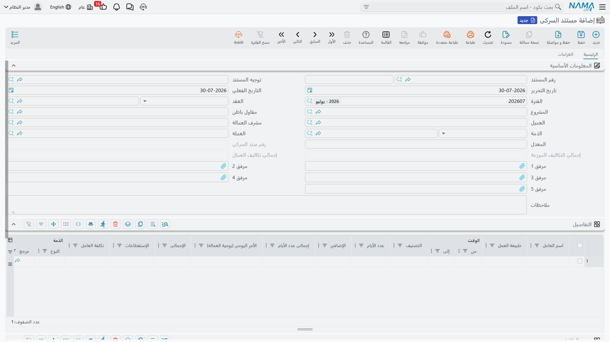
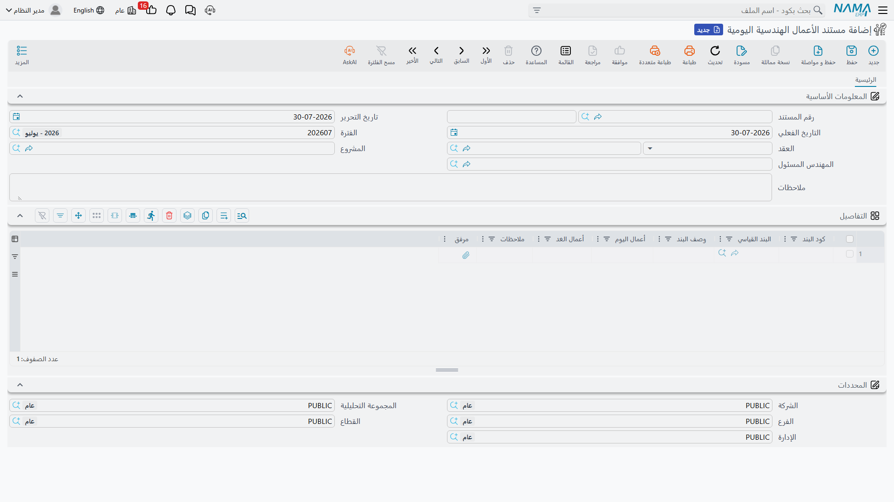

# مستند السركى والأعمال اليومية

مستندان في هذا الجزء من الوحدة يكتبهما من هم على الموقع فعلاً، في آخر النهار، بخطّ أيديهم قبل أن يدخلهما
أحد على النظام. **مستند السركى** يرصد من عمل وما له، و**مستند الأعمال الهندسية اليومية** يرصد ما بُني.
ويبدوان زوجاً، ولا يتصرفان بأي تشابه: الأول يقيّد قيد يومية ويضع تكلفة حقيقية على المشروع، والثاني سجل
مكتوب ولا شيء غير ذلك.

وكلاهما من **المقاولات > مقاولة مقاول باطن**، وكلاهما يحتاج ترخيص `contracting`. ومستند السركى يظهر كذلك
كقائمة مدرَجة على شاشة عقد مقاول الباطن، فيُرى كل ما رُصِد على عقد باطن معيّن من العقد نفسه.

## مستند السركى لا صلة له بالمرتبات — بأي حال

ابدأ من هنا، فالجميع تقريباً يفترض العكس، والافتراض يؤدي إلى ساعات من البحث بلا نتيجة.

**العامل اسم مكتوب في خانة نص.** فليس على سطر العمالة مرجع موظف، ولا منتقٍ، ولا تحقق، ولا شيء يربط
«راجيش ك.» بأي شيء آخر في النظام. واكتب الاسم غداً بشكل مختلف فلن يلاحظ النظام.

**والأجر حسابٌ يُجرى على المستند.** أيام في أجر يومي ناقص استقطاعات. ولا شيء يُقرأ من هيكل رواتب أو درجة
أو جدول بدلات أو عقد عمل.

**والقيد قيد المستند نفسه.** فمستند السركى يقيّد مباشرة على الحسابات المسمّاة على توجيهه. ولا ينتج مستند
مرتبات، ولا تستهلكه دورة رواتب ولا تستوعبه ولا تعلم بوجوده.

**وحتى وعاء التكلفة مختلف.** فتكلفة مستند السركى تسقط في عمود *تكلفة العمالة* في
[حصر التكاليف](/ar/modules/contracting/costs/contracting-cost-execution)، وتكلفة المرتبات تسقط في
*المرتبات*. وهما إجماليان منفصلان لأنهما بالضبط من عالمين منفصلين.

وهذا ليس سهواً. بل هو ما وُجِد المستند **له**: العمالة اليومية المؤقتة في الموقع — الطاقم الذي يستأجره
السركي من مورد عمالة لأسبوع من رصّ الطوب، يُدفع لهم باليوم، ولا يدخلون كشوف رواتب الشركة أبداً. فإن كانت
عمالة موقعك على كشوف الرواتب حقاً فمستند السركى هو المستند الخطأ تماماً؛ واستخدم سلسلة التسكين وتوزيع
التكاليف الموصوفة في
[تسكين الموظفين والمعدات وتكاليفهم](/ar/modules/contracting/costs/contracting-equipment-and-allocations)،
فهي التي تقرأ مستندات المرتبات الحقيقية.

## مستند السركى، صفحة صفحة

### الترويسة

توجيه المستند إجباري، لأن لهذا المستند تأثيراً محاسبياً. وفوق التواريخ والفترة المعتادة:

- **العقد** يقبل عقد مشروع أو عقد مقاول باطن. وأيّهما اخترت يملأ **المشروع** نفسه، والأهم أن سطور
  التكلفة تُنسَب دائماً إلى عقد **المشروع**: فاختر عقد باطن ويحلّه النظام إلى عقد المشروع الذي خلفه.
- **الذمة** هي الطرف المقابل في القيد: مقاول الباطن أو الطرف الآخر أو العميل أو المورد الذي سيُدفع له
  مقابل هؤلاء الرجال. وهذا هو الحقل المهم محاسبياً، ويستطيع السطر تجاوزه لعامل واحد.
- **العملة والمعدل** يأخذان قيمهما من عملة الأستاذ الرئيسية للشركة، والمعدل 1.
- **رقم سند السركي** يملؤه النظام عند الاعتماد برقم تسلسل هذا السند داخل عقده، فتصير «ورقة السركي
  الثامنة عشرة على برج A» شيئاً حقيقياً يمكن الوصول إليه.
- وهنا إجماليان للقراءة فقط — **إجمالي تكاليف العمال** (من جدول التفاصيل) و**إجمالي التكاليف الموزعة**
  (من جدول توزيع التكلفة) — وتطابقهما هو ما يُتحقَّق منه المستند.

وثلاثة حقول أخرى في الترويسة — **مقاول باطن** و**العميل** و**مشرف العمالة** — للعلم فقط. تُرصَد على
المستند ويمكن طباعتها والتقرير عنها، لكن لا قاعدة ولا حساب ولا اختيار حساب يقرؤها.

### جدول التفاصيل — من عمل

| العمود | ماذا يفعل |
|---|---|
| اسم العامل | نص حرّ؛ هو اسم العامل ولا شيء غير ذلك |
| طبيعة العمل، التصنيف | حقول وصفية |
| الوقت من، الوقت إلى | حقول وصفية |
| عدد الأيام | إدخال |
| الإضافي | الوقت الإضافي، **معبَّراً عنه بالأيام** — 0.5 تعني نصف يوم إضافي |
| إجمالى عدد الأيام | للقراءة فقط، الأيام + الإضافي |
| الأجر اليومي | يومية العامل |
| الإجمالى | للقراءة فقط، الأجر اليومي × إجمالي الأيام |
| الإستقطاعات | ما يُحتجَز على هذا الرجل |
| تكلفة العامل | الإجمالي − الاستقطاعات — **وهو الرقم الذي يصل إلى الأستاذ** |
| الذمة | تتجاوز طرف الترويسة لهذا السطر وحده |

والأجر يُحسَب من **أربعة حقول فقط**: عدد الأيام والإضافي والأجر اليومي والاستقطاعات. أما الأوقات
والتصنيف فلا دخل لها فيه — *الوقت من* 07:00 و*الوقت إلى* 17:00 لا تصير عشر ساعات ولا تصير يوماً وربعاً.
فإن عمل رجل وقتاً إضافياً فعبّر عنه في *الإضافي* كجزء من يوم. وإن تُرِكت الحقول الرقمية الأربعة فارغة
بُقِيت تكلفة العامل المكتوبة يدوياً كما كُتِبت بالضبط، وهذا هو مخرج الاتفاق بالمقطوعية بلا يومية خلفه.

### جدول توزيع التكلفة — أي بنود تتحمّل فاتورة الأجور

الجدول الثاني يجيب على السؤال الذي لا يجيبه جدول التفاصيل: الموقع مدين لهؤلاء الرجال بـ 380 بينهم، لكن
على **أي بنود من العقد**؟ كل سطر يسمّي كود بند (واختياراً كودَي الموازنتين وكود بند تحليلى وكارت تحليل)، وتكلفة،
وشرحاً.

والقاعدة المُلزَمة عند الاعتماد بسيطة وتستحق الفهم بدقة:

> **مجموع جدول توزيع التكلفة لا بد أن يساوي مجموع تكاليف العمال.** وإلا رُفض الاعتماد برسالة تسمّي
> الرقمين.

لكن لاحظ الشرط الملتصق بها: التحقق لا يعمل إلا **إذا كان في جدول توزيع التكلفة سطر واحد على الأقل**.
اتركه فارغاً تماماً فيُعتمَد المستند بارتياح، ويُنتج قيداً سليماً تماماً — ويضع **صفراً** من التكلفة على
المشروع. ونفس الشيء يصحّ على أي سطر فارغ كود البند: يُتخطّى في صمت. فإن أبلغ أحدهم عن تكلفة عمالة مفقودة
من مشروع فجدول التوزيع هو أول موضع للنظر.

## ما يحدث عند الاعتماد

ثلاثة أشياء، بهذا الترتيب.

1. **المشروع يُحمَّل.** تُكتَب سطور التكلفة على أكواد بنودها، فيتحرك سطر بند العقد فوراً في *التكلفة
   الفعلية*، وتُودَع نفس التكلفة في المخزون الذي يستهلكه لاحقاً
   [حصر التكاليف](/ar/modules/contracting/costs/contracting-cost-execution) كتكلفة *عمالة*.
2. **القيد يُنتَج.** زوج مدين/دائن **لكل عامل**، لا لكل سطر تكلفة، بقيمة تكلفة ذلك العامل. ومحددات
   المستند تسري، إلا أن يتجاوزها سطر. والتسليم طلب أعمال في الخلفية، فيظهر القيد بعد الحفظ بلحظة، وأي
   فشل يُعاد تشغيله من شاشة طلبات الأعمال.
3. **غرامات مقاولي الباطن تُنشَأ.** راجع القسم التالي.

::: tip مدين 2 ودائن 2 هما الحسابان الوحيدان
على هذا المستند، كما على كل مستند مقاولات، الجانبان المحاسبيان على التوجيه مسمّيان **مدين 2** و**دائن 2**.
ولا يوجد «مدين 1» تبحث عنه. والتوصيل المعتاد: مدين 2 = حساب تكلفة العمالة أو الأعمال تحت التنفيذ، ودائن 2
= حساب ذمة مورد العمالة. واتركهما فارغين فلا يُنتَج قيد على الإطلاق.
:::

ويقدّم التوجيه كذلك سقفَي كارت التحليل — منع الحفظ إذا تعدّت الكمية الفعلية أو التكلفة الفعلية على بند ما
خطّطه كارت تحليله.

## صفحة الغرامات — سندات غرامة حقيقية تُصنَع هنا

لمستند السركى صفحة ثانية لشيء يكتشفه السركي أيضاً خلال يومه: مقاول باطن فعل ما يكلّف مالاً لإصلاحه.
وبدلاً من إجبار السركي على فتح شاشة أخرى، تُكتَب سطور الغرامة هنا، وعند الاعتماد **يُنشئ النظام سندات
غرامة عقد مقاول باطن حقيقية** منها.

كل سطر غرامة يسمّي عقد الباطن ومقاول الباطن وقيمة الخصم وسبب الغرامة والشرط التعاقدي الذي ستُستردّ به
وطريقة الدفع بنسبتها أو قيمتها. والغرامات المولَّدة تُجمَّع: فالسطور المشتركة في نفس طريقة الدفع والنسبة
والقيمة والشرط وعقد الباطن تنتج سند غرامة **واحداً** بينها. وأزِل مجموعة وأعد الاعتماد فيُحذَف سندها؛
وألغِ مستند السركى فتُحذَف كلها.

::: warning يجب إعداد دفتر الغرامة وتوجيهها وإلا لم يُنشأ شيء
التوليد يقرأ **دفتراً** و**توجيهاً** لسند غرامة عقد مقاول الباطن من توجيه مستند السركى نفسه. فإن غاب
أحدهما بقيت سطور الغرامة محفوظة على المستند ولم يُنتَج سند غرامة أبداً — في صمت. وهذا أول ما يُراجَع حين
يقول أحدهم «أدخلت الخصم ولم يصل إلى مستخلصه».
:::

وبعد إنشائها تتصرف تلك الغرامات كأي غرامة أُدخِلت مباشرة، وتصل إلى مال مقاول الباطن من مستخلصه — راجع
[غرامات مقاول الباطن](/ar/modules/contracting/contractor-contracting/contracting-contractor-fines).

## مستند الأعمال اليومية سجل، وسجل فقط

**مستند الأعمال الهندسية اليومية** هو دفتر الموقع في أنقى صوره. فكل مساء يكتب المهندس المسئول، بنداً
بنداً، ما أُنجِز اليوم وما هو مخطَّط للغد، ويرفق صورة إن وُجدت. واختيار العقد يملأ المشروع والمهندس
المسئول؛ وعمود كود البند يعرض بنود العقد كاقتراحات، وباختياره ينتقل البند القياسي ووصف البند من العقد.

ثم يتوقف. **فليس على المستند توجيه على الإطلاق**، ولا تأثير محاسبي، ولا مدخلات تكلفة، و— وهذه هي النقطة
التي يخطئ فيها الناس — **لا يقود أي كميات**. فأعمال اليوم وأعمال الغد نصّ سردي حرّ، ولا شيء يقرؤها.
والكميات المنفَّذة لا تأتي إلا من
[حصر كميات المشروع](/ar/modules/contracting/project-contracting/contracting-project-execution) و
[حصر كميات مقاول الباطن](/ar/modules/contracting/contractor-contracting/contracting-contractor-execution)
و[حصر التكاليف](/ar/modules/contracting/costs/contracting-cost-execution).

وهذا ليس نقصاً. فسجل يومي قابل للدفاع عنه بما حدث في الموقع، بنداً بنداً، موقَّع من مهندس مسمّى، هو
بالضبط ما يكسب مطالبة تأخير بعد سنتين. وقيمته في كونه سجلاً.

## مثال عملي: أسبوع طاقم رصّ الطوب

**برج A** لـ **الفنار للتطوير**، عقد مشروع `PC-2026-001`، البند `3.01` *أعمال المباني*. والسركي يحفظ
ورقة لكل طاقم لكل أسبوع ويكتب عليها إجمالي أيام كل رجل.

`DLB-000318`، التاريخ الفعلي 13 مارس 2026، العقد `PC-2026-001`، والذمة مورد العمالة `SUP-0044`، والعملة
والمعدل كما جاءا افتراضياً.

**التفاصيل — من عمل:**

| # | اسم العامل | التصنيف | الأيام | الإضافي | إجمالي الأيام | الأجر اليومي | الإجمالي | الاستقطاعات | تكلفة العامل |
|---|---|---|---|---|---|---|---|---|---|
| 1 | راجيش ك. | بنّاء | 1 | 0.5 | 1.5 | 120 | 180 | — | **180** |
| 2 | أنور س. | بنّاء | 1 | — | 1 | 120 | 120 | 20 | **100** |
| 3 | بلال ح. | مساعد | 1 | 0.25 | 1.25 | 80 | 100 | — | **100** |
| | | | | | | | | **إجمالي تكاليف العمال** | **380** |

عمل راجيش يوماً ونصفاً — والنصف الإضافي يُدخَل 0.5 في *الإضافي*، لا أربع ساعات في عمودي الوقت. وأنور
احتُجِز عليه 20 مقابل ميزان مكسور، فتكلفته 100 لا 120.

**توزيع التكلفة — أين تسقط:**

| كود البند | بند الموازنة التنفيذية | التكلفة | الشرح |
|---|---|---|---|
| `3.01` | `EX-3.01` | 380 | طاقم المباني، الأسبوع المنتهي 13/03 |
| | | **إجمالي التكاليف الموزعة 380** | |

380 تساوي 380، فيُقبَل الاعتماد. ثم:

- **القيد** ثلاثة أزواج مدين/دائن — مدين 2 حساب تكلفة العمالة 180 و100 و100، ودائن 2 ذمة `SUP-0044`
  بمجموع 380 — يخرج كطلب أعمال في الخلفية.
- **المشروع** يأخذ 380 من التكلفة على البند `3.01`: فسطر بند العقد يعلو 380 في *التكلفة الفعلية*،
  و380 من تكلفة *العمالة* في المخزون المنتظِر.
- **رقم سند السركي** يُوضَع 18 — أي الورقة الثامنة عشرة على هذا العقد.

غيّر استقطاع أنور إلى 30 وانسَ تغيير سطر التوزيع فيُرفض الاعتماد: 370 تكلفة عمال مقابل 380 موزَّعة.
واحذف سطر التوزيع بالكلية فيُعتمَد المستند بقيد سليم وبلا أي تكلفة على المشروع.
