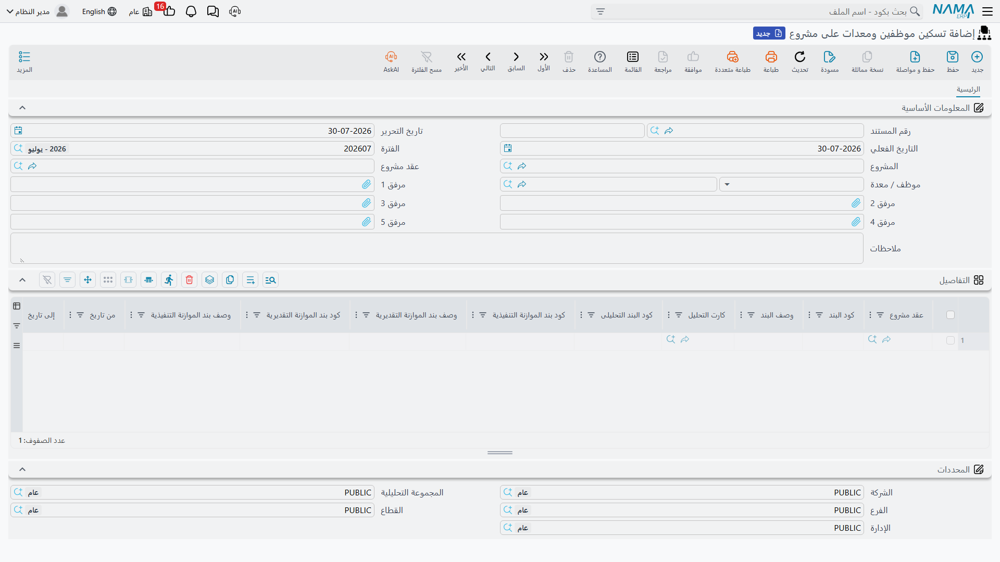
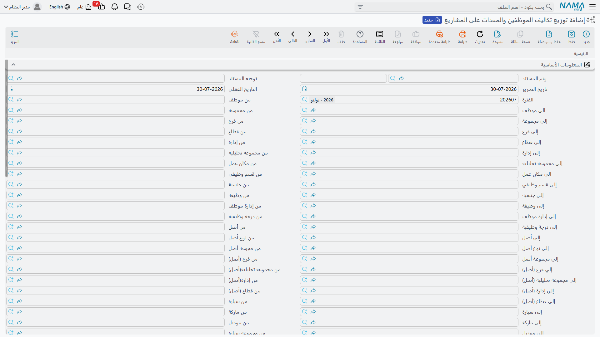
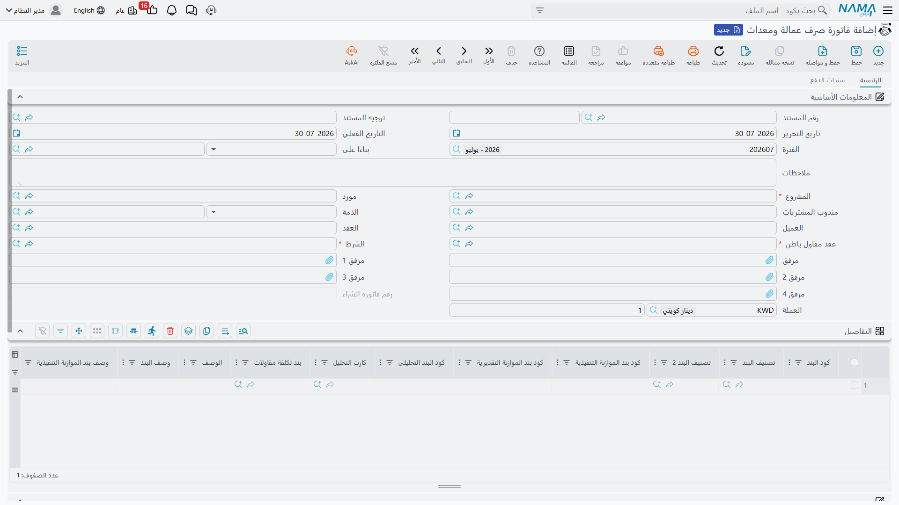
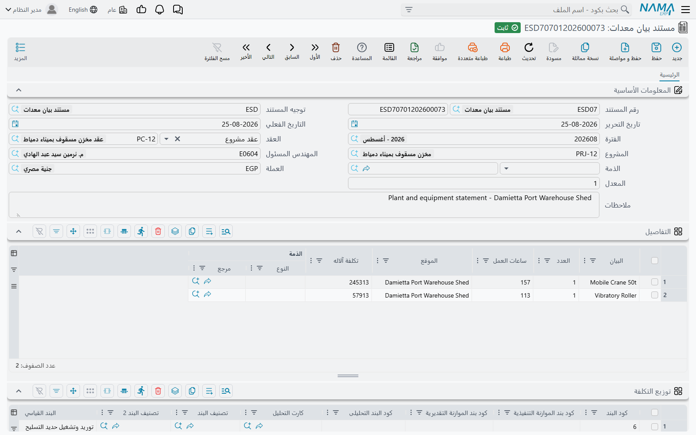
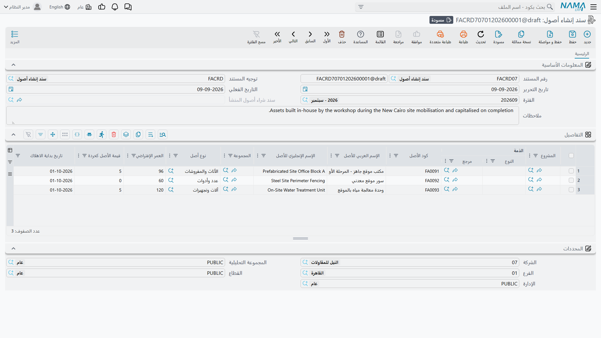

# تسكين الموظفين والمعدات وتكاليفهم

مهندس الموقع الذي يقضي مارس كله في برج A على كشوف رواتب الشركة. والونش البرجي الواقف هناك طول الشهر أصل
ثابت يُستهلَك. ولا واحد منهما يخصّ المشروع بأي معنى محاسبي: فراتبه تقيّده دورة رواتب، وإهلاك الونش تقيّده
دورة إهلاك، وكلا المستندين عن **الشركة** لا عن البرج.

ومع ذلك، إن لم تشمل تكلفة المشروع نصيباً من المهندس ونصيباً من الونش فهي وهم. وهذه هي الفجوة التي يسدّها
هذا الجزء من الوحدة، ويسدّها بثلاث خطوات متعمَّدة.

| الخطوة | المستند | ماذا يفعل | القائمة |
|---|---|---|---|
| 1 | تسكين موظفين ومعدات على مشروع | يعلن من وما المُسكَّن على أي بند من أي مشروع وبين أي تاريخين | المقاولات > الملفات |
| 2 | توزيع تكاليف الموظفين والمعدات على المشاريع | يجرّ مستندات المرتبات والإهلاك الحقيقية، ويقطّعها بأيام التسكين، ويضع القطع على بنود المشروع | المقاولات > الملفات |
| 3 | فاتورة صرف عمالة ومعدات | الفاتورة التي تستلمها إذا كان الأفراد والمعدات **مستأجرين** من مورد | المقاولات > الملفات |

وثلاثتها **مستندات** رغم إدراجها تحت *الملفات*، وثلاثتها تحتاج ترخيص `contracting`. والخطوتان 1 و2 زوج
ينتميان معاً. أما الخطوة 3 فحيوان مختلف تماماً، والقسم الخاص بها أدناه يشرح لماذا.

## الخطوة 1 — التسكين

التسكين أمر انتداب في صورة مستند: *من 1 أبريل إلى 30 أبريل، المهندس هاني والحفار FA-0112 يعملان على عقد
المشروع PC-2026-001، على هذه البنود.* وهو لا يحمل مالاً على الإطلاق، ولا تأثير محاسبياً، ولا توجيه مستند
— فليس عليه ما يُعَدّ.

كل سطر يسمّي:

- **عقد المشروع** (إجباري)، و**كود البند** إن كانت إعداداتك تُلزِم به — ولا بد أن يكون موجوداً على ذلك
  العقد؛
- **من تاريخ** و**إلى تاريخ**، وكلاهما إجباري ويُراجَع ترتيبهما؛
- **عدد الأيام**، يملؤه النظام من التاريخين؛
- **موظف / معدة** — موظف أو أصل ثابت أو سيارة (إجباري)؛
- أكواد بنود الموازنتين والبند التحليلى والتصنيفات، كما في كل مكان في الوحدة؛
- و**محددات** السطر نفسه، ولفرعها استخدام خاص موصوف أدناه.

وتحمل الترويسة عقد المشروع وحقل الموظف/المعدة كمساعدين فقط: فكتابة أي منهما تدفع القيمة إلى كل سطر،
والمشروع يُستخرَج من العقد.

### شخص واحد ومعدة واحدة في مكان واحد في الوقت الواحد

التحقق المهم هو **تحقق التقاطع**. فلا يمكن تسكين نفس الشخص أو المعدة على مدَّتين متقاطعتين — لا داخل
المستند الواحد ولا مع تسكينات معتمدة أخرى. جرّب فيسمّي الاعتماد السطرين المتقاطعين والمستندين. وثمة إعداد
في الوحدة يُطفئ التحقق للمنشآت التي تُشارك المورد بين مشاريع في الوقت نفسه فعلاً وتوزّع تكلفته بطريقة
أخرى.

### وهو يكتب على ملف الموظف أو الأصل أو السيارة

اعتماد التسكين له كذلك أثر خارج المقاولات، ويستحق المعرفة لأنه يغيّر ملفات أساسية. فإن كانت إعداداتك
تسمّي حقلاً على ملف الموظف أو الأصل الثابت أو السيارة لذلك، كتب النظام فيه **أحدث عقد مشروع ما زال
سارياً**، وفعل الشيء نفسه بـ**فرع** سطر التسكين. و«ما زال سارياً» هي الكلمة الفاصلة: فإن كان تاريخ نهاية
أحدث تسكين في الماضي **أُفرِغ** الحقل بدلاً من ذلك. وإلغاء التسكين يعيد استخراج القيمتين.

واترك حقول الإعداد تلك فارغة — وهو الافتراضي — فلا يحدث شيء من هذا.

## الخطوة 2 — تكليف التسكين

هذا هو المستند الذي ينقل المال إلى المشروع، ويُحرَّر مرة كل فترة رواتب، عادةً في آخر الشهر.

وترويستُه يهيمن عليها **مدى**: ثلاثة بلوكات طويلة من أزواج من/إلى، واحد للموظفين (بالموظف والمجموعة
والفرع والقطاع والإدارة والمجموعة التحليلية ومكان العمل والقسم الوظيفي والجنسية والوظيفة وإدارة الموظف
والدرجة الوظيفية)، وواحد للأصول الثابتة (بالأصل ونوعه ومجموعته وفرعه ومجموعته التحليلية وإدارته وقطاعه)،
وواحد للسيارات (بالسيارة والماركة والموديل والمجموعة والفرع والمجموعة التحليلية والإدارة والقطاع). وكل زوج
يُستخدَم فلتراً فعلاً، والزوج المتروك فارغاً لا يفرض أي قيد — فأنت في معظم الشهور تملأ اثنين أو ثلاثة
وتترك الباقي.

### ما يفعله زر تجميع المستندات

اضغط **تجميع المستندات** فيقوم النظام بالتالي:

1. يأخذ التاريخ الفعلي والفترة (ويحدس الفترة من التاريخ إن تركتها فارغة)؛
2. يجد كل سطر تسكين تتقاطع مدَّته مع تلك الفترة، ويمرّره على المدى؛
3. يسحب المستندات الحقيقية المطابقة من الوحدات الأخرى — **مستندات المرتبات** المعتمدة للموظفين
   المُسكَّنين، ومستندات **إهلاك الأصول** للأصول والسيارات المُسكَّنة، ومستندات **تأمين السيارات**؛
4. **ويستثني كل ما استهلكه توزيع تكاليف أسبق**، وهذا هو الحرس المانع من حساب نفس دورة الرواتب مرتين؛
5. ويكتب سطراً لكل (عقد مشروع × مستند مصدر × شخص أو معدة) في جدول **التفاصيل**، محمّلاً بالتكلفة
   المقطوعة.

والقطع نفسه حساب بسيط: **أيام التسكين ÷ أيام الفترة × قيمة مكوّن الراتب**. وأي مكوّنات تُحسَب؟ ذلك إعداد
في الوحدة — قائمة بأنواع المكوّنات التي يسمّيها التطبيق تكلفةً على المشاريع. واترك القائمة فارغة فيُستخدَم
صافي الراتب مع الأقساط المسدَّدة كمكوّن واحد بلا اسم.

وجدول التفاصيل يملؤه النظام بالكامل: **كل أعمدته للقراءة فقط**. فهو دليل ما جُمِع، لا شيء تُحرّره.

### توزيع ما جُمِع

الجدول الثاني، **توزيع التكلفة**، هو موضع تعليق المبالغ المجمَّعة على بنود المشروع، وهو **قابل** للتحرير —
بمساعدات تُبقيك أميناً. فمنتقي المستند لا يعرض إلا مستندات موجودة في جدول التفاصيل؛ ومنتقيا الشخص/المعدة
وعقد المشروع محصورَان بالمثل؛ وأعمدة أكواد البنود تقترح بنود العقد المختار.

وكم من العمل تفعله بيدك؟ ذلك يتوقف على خيار واحد على توجيه المستند:

- **يدوي** (الافتراضي). سطور التفاصيل التي تحمل كود بند بالفعل تُطابَق في جدول توزيع التكلفة عنك؛ والباقي
  توزّعه أنت.
- **تلقائي** (*توزيع التكلفة تلقائياً على البنود*). يُفرَّغ الجدول ويُبنى من جديد. فسطر تفاصيل يحمل كود
  بند ينتج سطر تكلفة واحداً بواحد. وسطر **بلا** كود بند تُوزَّع تكلفته على بنود عقد المشروع المؤهَّلة —
  للشخص: البنود المؤشَّرة بأنها تتحمّل تكلفة **المرتبات**؛ وللأصل الثابت: البنود المؤشَّرة بأنها تتحمّل
  تكلفة **الإهلاك**. والوزن يختاره خيار ثانٍ على التوجيه، *توزيع التكلفة على البنود بتناسب*، ويعرض الكمية
  (الافتراضي) أو إجمالي السعر أو إجمالي التكلفة، فيأخذ كل بند نصيبه بالتناسب.

وأمران في التوزيع التلقائي يستحقان المعرفة قبل الاعتماد عليه. **السيارة** لا تُوزَّع تلقائياً — الأشخاص
والأصول الثابتة فقط — فوزّع تكلفة السيارة بيدك. و**تصنيف البند 2** لا يُنقَل إلى سطور التكلفة المبنية
تلقائياً؛ فإن كنت تُقرِّر على ذلك التصنيف فضعه بنفسك.

### ما يرفضه، وما ينتجه

التحقق مطابقة، لكل عقد مشروع ولكل مستند مصدر: **مجموع سطور توزيع التكلفة لا بد أن يساوي التكلفة المجمَّعة
لذلك الزوج.** والرسالة تذكر الرقمين — وانتبه إلى أن الرقم المجمَّع الذي تذكره إجمالي داخلي لا يظهر على أي
جدول، فاقرأه من الرسالة بدلاً من البحث عنه على الشاشة. وكل كود بند لا بد أن يكون موجوداً في عقده، والتكلفة
التي استهلكها [حصر تكاليف](/ar/modules/contracting/costs/contracting-cost-execution) معتمد لا يمكن
تغييرها.

وعند الاعتماد تصير سطور التكلفة — **لا** سطور التفاصيل — تكلفة المشروع: **مرتبات** حيث المورد شخص،
و**إهلاكات** حيث هو معدة. والمستند نفسه **بلا تأثير محاسبي**، وهذا هو الصواب: فالقيود قيّدتها دورة
الرواتب ودورة الإهلاك بالفعل. وكل ما يفعله هذا المستند هو نسبة مال مقيَّد سابقاً إلى المشاريع التي
استهلكته.

## الخطوة 3 — الفاتورة التي لا تكلّف المشروع شيئاً

::: warning هذه الفاتورة تضيف **صفراً** إلى تكلفة المشروع
فاتورة صرف عمالة ومعدات **فاتورة شراء خارجية**. تنشئ التزاماً تجاه المورد الذي وفّر العمالة أو المعدات،
ولا تضيف **شيئاً على الإطلاق** إلى التكلفة الفعلية للمشروع: لا مدخلات تكلفة، ولا شيء على سطور بنود العقد،
ولا شيء يراه أي [حصر تكاليف](/ar/modules/contracting/costs/contracting-cost-execution). وسطورها تحمل
أكواد بنود تشبه تماماً أكواد البنود على كل مستند تكلفة آخر، لكن التكلفة التي تحملها صفر بحكم التصميم.

فإن احتجت أن تظهر العمالة أو المعدات المستأجرة في تكلفة المشروع فأدخل المبلغ
[فاتورة شراء مستلزمات مقاولات](/ar/modules/contracting/costs/contracting-misc-spend)، فهي التي تقيّد
تكلفة المشروع. واستخدم هذا المستند حين يكون المطلوب هو الالتزام وخطة السداد وتاريخ المورد.
:::

وبعد أن استقرّ ذلك، فهي فاتورة كاملة العتاد. فمكتب توريد عمالة أو شركة تأجير معدات يوفّر لك أشخاصاً
ومعدات بأسمائهم لمدة مؤرَّخة بيومية، وهذه هي الفاتورة التي تستلمها عن ذلك التوريد. وترويستها تحمل المورد
ومندوب المشتريات والذمة والعميل والمشروع (إجباري) وعقد المشروع و**عقد مقاول باطن إجباري** و**شرطاً
تعاقدياً إجبارياً**، ومعها مركّب مبالغ الفاتورة بكامله. وسطورها تحمل:

- **موظف / معدة** — شخص أو أصل ثابت أو سيارة، إجباري؛
- **من تاريخ** و**إلى تاريخ**، ومنهما تحسب **الكمية** نفسها كعدد الأيام شاملاً الطرفين؛
- بند تكلفة المقاولات وأكواد البنود والتصنيفات؛
- بلوك سعر الشراء الكامل — سعر الوحدة والإجمالي وثمانية مستويات خصم وأربع ضرائب والصافي؛
- ومنتقي **الجانب الدائن** مع حساب وذمة ونوع حساب ذمة، تماماً كما على
  [فاتورة المستلزمات](/ar/modules/contracting/costs/contracting-misc-spend)، فيستطيع السطر الواحد إرسال
  دائنه إلى غير المورد.

وصفحتها الثانية هي آلة الدفع: مستندات دفع خارجية سدّدتها من خارجها، ونموذج دفع مع إجراء **توليد الدفعات**،
وجدول الأقساط الناتج بأرقام المسدَّد والمتبقي، وجدول بنود شراء بتواريخ نهاية مخططة ومُمَدَّدة ومجموع
غرامات تمديد.

والتأثير المحاسبي هو تأثير الفاتورة العادي، من توجيه المستند: مدين مصروف أو أعمال تحت التنفيذ، وجوانب
الضرائب، والمورد دائن. وخيار واحد على التوجيه يقلب المستند كله إلى فاتورة **بيع**، للحالة التي تكون فيها
أنت من يؤجّر المعدات.

## مستند بيان المعدات مستند محاسبي

**مستند بيان معدات**، من **المقاولات > مقاولة مقاول باطن**، هو نظير ورقة العمالة للمعدات: قائمة مؤرَّخة
بما عمل من آلات على الموقع، وكم منها، وكم ساعة، وأين، وبكم. وكمستند السركى فهو مدرَج كقائمة على شاشة عقد
مقاول الباطن، فيُرى كل ما رُصِد على عقد باطن من العقد نفسه.

وكل سطر متعمَّد البساطة:

| العمود | ما هو |
|---|---|
| البيان | **نص حرّ** — وهنا تُسمّى الآلة |
| العدد | كم آلة |
| ساعات العمل | الساعات المشتغلة |
| الموقع | نص حرّ |
| تكلفة الآلة | المال، **مكتوب باليد** |
| الذمة | تتجاوز طرف الترويسة لهذا السطر |

وتوقّعان يدعو إليهما الاسم يستحقان التصحيح، لأن المستند لا يلبّيهما.

**لا توجد قراءات عدّادات.** فالآلة سطر نصّ لا مرجع إلى أصل ثابت أو سيارة، ولا يوجد عليه قراءة بداية ولا
قراءة نهاية ولا ساعات محرّك في أي مكان.

**ولا يوجد حساب سعر بالساعة.** فتكلفة الآلة لا يحسبها شيء من ساعات العمل. والساعات تُرصَد للسجل، أما
التكلفة فرقم يقرّره من يملأ الورقة ويكتبه. فإن أردت سعراً × ساعات فاضرب قبل أن تكتب.

والذي يفعله المستند عند الاعتماد هو إنتاج **قيد يومية واحد**: زوج مدين/دائن لكل سطر بيان، بقيمة تكلفة آلة
ذلك السطر، من جانبَي مدين 2 ودائن 2 على توجيهه — والمعتاد مدين تكلفة معدات أو أعمال تحت التنفيذ مقابل
حساب ذمة مورد المعدات. وذمة السطر تتجاوز ذمة الترويسة. وكالمعتاد يخرج القيد كطلب أعمال في الخلفية، وإن
تُرِك الجانبان فارغين فلا يُنتَج قيد على الإطلاق.

وهذا كل ما فيه. **فمستند بيان المعدات لا يكتب أي مدخلات تكلفة على المشروع.** ولا شيء يصل إلى سطور بنود
العقد، ولا يراه أي حصر تكاليف. فاعتبره الطريقة التي تقيّد بها أجرة معدة في الأستاذ ومعها سرد موقعي سليم —
لا طريقة لتحميل تكلفة على مشروع. وحين يجب أن تكون أجرة المعدة جزءاً من تكلفة المشروع فأصدرها
[فاتورة شراء مستلزمات مقاولات](/ar/modules/contracting/costs/contracting-misc-spend) بدلاً من ذلك.

## رسملة مشروع بنيته لنفسك

أحياناً يبقى ما يبنيه المقاول على دفاتره هو — مبنى إدارة، أو سكن عمالة، أو محطة خرسانة. والتكلفة تراكمت
على [مشروع](/ar/modules/contracting/setup/contracting-projects)؛ والمطلوب الآن أصل ثابت.

و**سند إنشاء أصول** يقوم بذلك التحويل. وهو يخصّ منطقة الأصول الثابتة ويُفتَح من **الأصول > الملفات**،
لكنه محكوم بترخيص **المقاولات**، وهذا يقول لك لمن هو بالضبط. ويمكن بدؤه من شاشة المشروع نفسها، حيث يفتح
زر سنداً جديداً بسطر يشير إلى ذلك المشروع.

كل سطر يزوّج **مشروعاً** بالأصل المطلوب إنشاؤه: كود الأصل، واسمه العربي والإنجليزي، ومجموعته ونوعه،
و**العمر الإفتراضي**، و**قيمة الأصل كخردة**، و**تاريخ بداية الاهلاك**، والتكلفة الفعلية والمعدلة. والكمية
دائماً واحد — فهذا المستند يُنشئ أصولاً لا دفعات منها.

وعند الاعتماد يُنشَأ شيئان لكل سطر: **الأصل الثابت** نفسه، ويظهر مرجعه على السطر، و**سند شراء أصول**
يحمل قيد الرسملة. والسند المُنشئ لا يقيّد شيئاً بذاته؛ بل سند الشراء المولَّد هو ما يقيّد، بتوجيهه هو.
وإن لم يسمِّ توجيه سند الإنشاء **دفتراً وتوجيهاً لسند شراء الأصول** توقّف الاعتماد وقال ذلك — فهذان
الإعدادان إجباريان عملياً.

وسلوكان يستحقان المعرفة:

- **أصل واحد لكل مشروع.** فإن كان هناك أصل ثابت موجود بالفعل لذلك المشروع رُفض الاعتماد وسمّى الأصل
  القائم.
- **والأصل يورث ضمانات العقد.** فسطور البنود المؤشَّرة بـ*الترحيل إلى الأصل* على كل عقد مشروع من مشاريع
  ذلك المشروع تُنسَخ إلى جدول بنود الأصل الجديد، بتواريخ بداية ونهاية ضماناتها. فسقفٌ عليه ضمان عشر سنوات
  يصل إلى ملف الأصل حاملاً ضمانه.

## مثال عملي: ونش لعشرين يوماً ومهندس لشهر

**برج A** لـ **الفنار للتطوير**، عقد مشروع `PC-2026-001`. والشهر أبريل 2026 — ثلاثون يوماً.

### التسكين

`CEEA-000042`، التاريخ الفعلي 1 أبريل 2026، عقد المشروع `PC-2026-001`:

| عقد المشروع | كود البند | من | إلى | الأيام | موظف / معدة |
|---|---|---|---|---|---|
| PC-2026-001 | `3.01` | 01/04/2026 | 30/04/2026 | 30 | `EMP-0210` م. هاني، مهندس الموقع |
| PC-2026-001 | `2.01` | 01/04/2026 | 20/04/2026 | 20 | `FA-0112` ونش برجي |

واعتماد هذا لا يكلّف شيئاً. بل يعلن أن راتب هاني في أبريل منسوب إلى البرج طول الشهر، وإهلاك الونش منسوب
إليه عشرين يوماً من الثلاثين. ولو كان أي منهما مُسكَّناً في مكان آخر على مدة متقاطعة لسمّى الاعتماد
التقاطع.

### التكليف

`CEEC-000009`، التاريخ الفعلي 30 أبريل 2026، على توجيه التوزيع التلقائي فيه مفعَّل والوزن بالكمية. المدى:
الموظفون من `EMP-0200` إلى `EMP-0299`، والأصول من `FA-0100` إلى `FA-0199`؛ وما عدا ذلك فارغ.

اضغط **تجميع المستندات**:

| عقد المشروع | المستند | موظف / معدة | كود البند | التكلفة |
|---|---|---|---|---|
| PC-2026-001 | `SAL-2026-04` | EMP-0210 م. هاني | *(فارغ)* | 9,000 |
| PC-2026-001 | `FADEP-2026-04` | FA-0112 ونش برجي | *(فارغ)* | 6,000 |

راتب هاني في أبريل 9,000 وكان مُسكَّناً 30 من 30 يوماً، فكلّه منسوب. وإهلاك الونش في أبريل 9,000 لكنه
كان مُسكَّناً 20 من 30 يوماً فقط، فيأتي منه **9,000 × 20 ÷ 30 = 6,000**.

ولا سطر من سطري التفاصيل يحمل كود بند، فالتوزيع التلقائي يوزّعهما. وعلى `PC-2026-001` بندان مؤشَّران
بتحمّل تكلفة المرتبات — `3.01` *أعمال المباني* (2,000 م²) و`3.02` *أعمال البياض* (1,000 م²) — وبند واحد
مؤشَّر بتحمّل تكلفة الإهلاك هو `2.01` *الخرسانة المسلحة*:

| عقد المشروع | المستند | موظف / معدة | كود البند | التكلفة |
|---|---|---|---|---|
| PC-2026-001 | SAL-2026-04 | EMP-0210 | `3.01` | 9,000 × 2,000/3,000 = **6,000** |
| PC-2026-001 | SAL-2026-04 | EMP-0210 | `3.02` | **3,000** |
| PC-2026-001 | FADEP-2026-04 | FA-0112 | `2.01` | **6,000** |

و6,000 + 3,000 = 9,000، وهي مطابقة لما جُمِع عن مستند الرواتب، و6,000 مطابقة لمستند الإهلاك، فيُقبَل
الاعتماد. وتُكتَب ثلاث قطع تكلفة — **مرتبات** 6,000 و3,000، و**إهلاكات** 6,000 — وتعلو *التكلفة الفعلية*
على سطور البنود الثلاثة بمقدارها. ولا يُنتِج هذا المستند قيداً؛ فدورة الرواتب ودورة الإهلاك فعلتا ذلك.

### والونش المستأجر، للمقارنة

في مايو يتوقف الونش البرجي ويُستأجَر ونش ثانٍ أكبر من *الخليج لتأجير المعدات* خمسة عشر يوماً بـ 900
لليوم. ويأتي ذلك فاتورة صرف عمالة ومعدات: الكمية 15 محسوبة من التاريخين، و13,500 زائداً الضريبة، والتزام
تجاه الخليج لتأجير المعدات وخطة سداد على قسطين. **وتكلفة المشروع لا تتحرك.** فإن كان يجب أن تظهر
الـ 13,500 على البند `2.01` فلا بد من إدخالها فاتورة شراء مستلزمات مقاولات بدلاً من ذلك — أو، إن كانت
أجرة المعدة تحتاج الوصول إلى الأستاذ فقط ومعها سرد موقعي، مستند بيان معدات.
