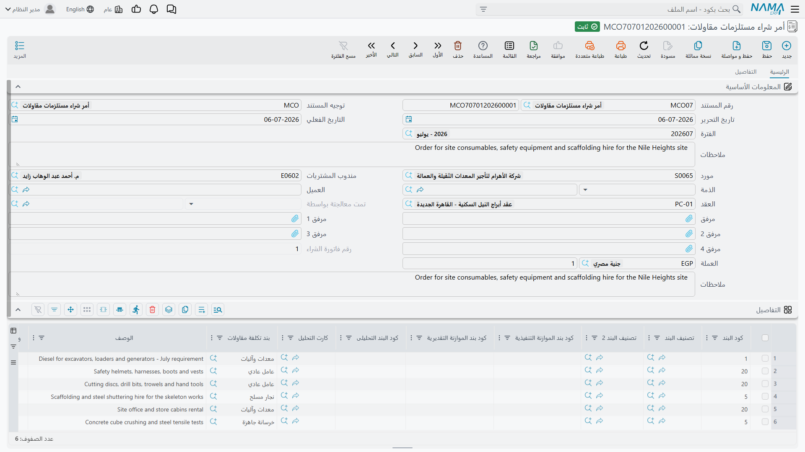
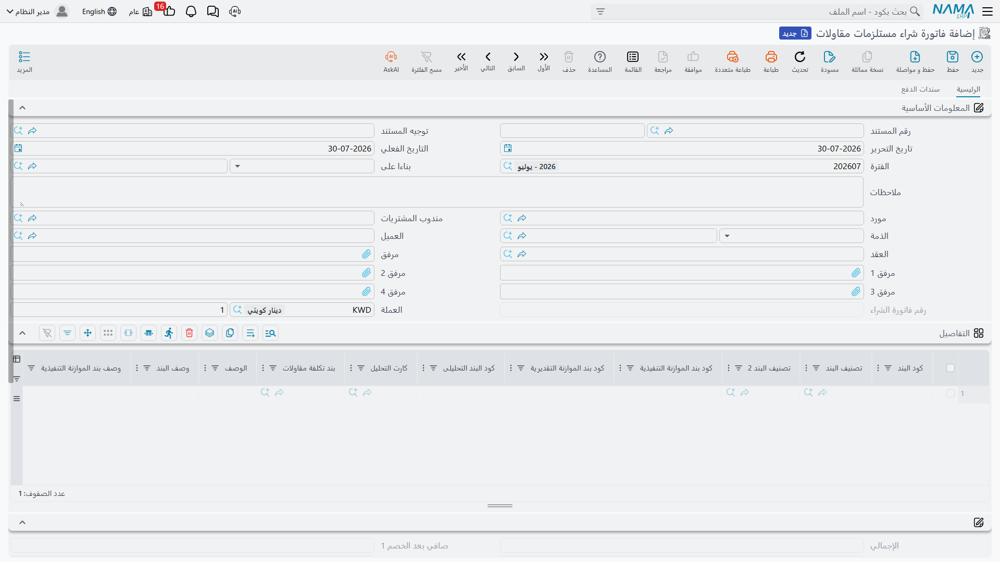

# مصروفات المقاولات المتنوعة

أكثر ما يكلّفه الموقع ليس صنفاً في مخزن. فالسياج حول الأرض، وتوصيلات المياه والكهرباء، ورخصة البلدية،
والونش المستأجر بالأسبوع، والقلابات التي تنقل المخلَّفات، ومختبر فحص التربة، والمساح الذي يوقّع
الشبكة، وإيجار السقالات، والعمل الصغير الذي أعطيته لصنايعي بدل توقيع عقد باطن كامل — لا شيء من هذا له
كود صنف ولا مخزن ولا شحنة ولا مقاس. له سعر وحساب وبند مشروع، وهذا كل ما فيه.

والاسم العربي لهذه المستندات الثلاثة هو الدليل: **مستلزمات** — ما *يحتاجه* الموقع لا ما *يخزّنه*. فحيث
تنقل [صرف الخامات](/ar/modules/contracting/costs/contracting-project-materials) مخزوناً، ويشتري
[زوج شراء المقاولات](/ar/modules/contracting/costs/contracting-purchasing) مخزوناً، يشتري هذا الثلاثي
كل ما عدا ذلك ويُصرِّفه، ويضع على كل سطر بند عقد المشروع الذي يخصّه فيسقط المال على سطر جدول الكميات
الصحيح.

## الثلاثي

| المستند | ما هو |
|---|---|
| طلب شراء مستلزمات مقاولات | الموقع يطلب خدمة أو توريداً غير مخزني |
| أمر شراء مستلزمات مقاولات | الأمر المُسعَّر الموضوع على المورد |
| فاتورة شراء مستلزمات مقاولات | الفاتورة — **وهي الوحيدة من الثلاثة التي تقيّد شيئاً** |

وثلاثتها تحت **المقاولات > التكاليف** وتحتاج ترخيص `contracting`.

## كيف يكون السطر إذا لم يكن هناك صنف

افتح جدول تفاصيل أي من الثلاثة فلن تجد الأعمدة المخزنية — لا صنف ولا مخزن ولا موقع ولا لون ولا مقاس
ولا شحنة. وبدلاً منها:

- **عنصر الشراء**، وهو الشيء غير المخزني الذي يُشترى. وهو **إجباري على كل سطر**، وهو حامل حساب
  المصروف. وهذا هو الحقل الذي يحلّ محلّ «الصنف».
- **كمية** مجرَّدة (إجبارية كذلك) وبلوك سعر كامل — سعر الوحدة والإجمالي وثمانية مستويات خصم وأربع
  ضرائب والصافي.
- والعمود الفقري المعتاد للمقاولات: **كود البند** وكود البند التحليلى وكارت التحليل والبند القياسي
  وبند تكلفة مقاولات وكودَي الموازنتين وتصنيفات البند وأوصافه، و**عقد** لكل سطر.
- و— على غير المعتاد — منتقي **الجانب الدائن** لكل سطر، وبجواره **الحساب** و**الذمة** ونوع حساب
  الذمة.

وهذه المجموعة الأخيرة هي سبب وجود المستند بهذا الشكل. ففي فاتورة الشراء العادية يذهب الدائن إلى المورد
وانتهى الأمر. أما هنا فكل سطر يستطيع إرسال دائنه إلى مكان مختلف: إلى حساب المورد، أو إلى **حساب
محدد**، أو إلى **ذمة محددة**، أو إلى **ذمة المستخدم الحالي**، أو إلى صنف شراء متنوع. ففاتورة واحدة
تستطيع أن تحمل فاتورة كهرباء الموقع (دائن حساب المرافق) ورسم رخصة دُفِع نقداً (دائن ذمة الخزينة
النقدية) وأجرة معدة (دائن المورد) على ثلاثة سطور.

ولاحظ أيضاً أن **العقد** على السطر يقبل عقد مشروع **أو** عقد مقاول باطن، فالصرف الواقع لحساب عقد باطن
معيّن يمكن وسمه بذلك — وكود البند على كل سطر يُراجَع على عقد **ذلك السطر نفسه** لا على عقد الترويسة.

## لا شيء يقيّد إلا الفاتورة

هذه أهم جملة في الصفحة، وهي صحيحة من وجهين.

**في الأستاذ.** الطلب والأمر لا ينتجان قيداً على الإطلاق. والفاتورة تنتجه كاملاً: الجانبان المدين
والدائن من توجيهها، وجانبا الخصم والنقدية، وجوانب الضرائب الأربع، ثم أي إعادة توجيه يطلبها الجانب
الدائن على كل سطر. والمعتاد أن المدين حساب المصروف أو الأعمال تحت التنفيذ والدائن المورد — لكن السطر
يستطيع تجاوز ذلك.

**وعلى المشروع.** الطلب والأمر لا يضيفان **شيئاً** إلى التكلفة الفعلية للمشروع. والفاتورة وحدها تكتب
مدخلات التكلفة على أكواد البنود التي تحملها سطورها، وهذه المدخلات هي التي تظهر في عمود *التكلفة من
الفواتير* في [حصر التكاليف](/ar/modules/contracting/costs/contracting-cost-execution) وفي عمود
*التكلفة الفعلية* على سطر بند العقد.

فإذا سأل أحدهم لماذا لا تظهر أجرة الونش التي أمرنا بها الأسبوع الماضي بمقدار 20,000 في تكلفة المشروع،
فالجواب في الغالب أن الأمر لم تُصدَر عليه فاتورة بعد.

## الطلب

الطلب هو سؤال الموقع المكتوب: هذا عنصر الشراء، وهذا القدر منه، على هذا البند. وشاشته متعمِّدة أن تكون
كميات فقط — فلا أعمدة أسعار ولا إجماليات عليها، لأن الموقع في وقت الطلب يصف حاجة لا يتفاوض على سعر.
وهو لا يتحقق من شيء تقريباً غير أن يكون هناك سطر واحد على الأقل عليه عنصر شراء، وليس له أي تأثير من
أي نوع.

## الأمر

الأمر يشترك في تصميمه مع الطلب ويضيف ما ينقص الطلب: مركّب مبالغ الفاتورة في الترويسة، وأعمدة السعر
على السطور، ومجموعة الإجماليات. وصفحته الثانية تحمل جدول مستندات الدفع الخارجية، وبلوك بيانات الشحن والتوريد،
وجدول بنود الشراء بتواريخ نهايتها المخططة والمُمَدَّدة.

وحين تُنشَأ فاتورة لاحقاً من أمر، يُوسَم الأمر بأنه **مُعالَج بواسطة** تلك الفاتورة، فيُعرَف من الأمر
نفسه هل صُدرت له فاتورة أم لا.

## الفاتورة

كل ما سبق يصبح حقيقياً هنا. وفوق التأثير المحاسبي أربعة سلوكيات تستحق المعرفة.

**أكواد البنود تُراجَع بجدية.** فالفاتورة وحدها تُلزِم بها: وهل كود بند المشروع إجباري؟ ذلك خيار على
التوجيه (وهو إجباري، إلا أن تجعله اختيارياً)، وخيارَان منفصلان يجعلان كودَي الموازنة التنفيذية
والتقديرية إجباريين كذلك. وكل كود لا بد أن يكون موجوداً في عقد سطره، وكود الموازنة التنفيذية لا بد أن
يحترم تشجير الموازنة.

**والاتجاه إعداد على التوجيه لا نوع مستند.** فنفس نوع المستند يكون فاتورة شراء أو مردود شراء أو فاتورة
بيع أو مردود بيع بحسب خيارين على توجيهه — أحدهما يقول إن هذا التوجيه بيع لا شراء، والآخر يقول إنه
مردود. ونوع مستند الفاتورة الإلكترونية يتبع ذلك، فينتج فاتورة إلكترونية أو إشعار دائن إلكتروني، ويكون
المورد هو الطرف المقابل أمام مصلحة الضرائب.

**وكارت التحليل يستطيع الكتابة عنك.** فاختيار كود بند تحليلى على السطر يملأ كود البند وكارت التحليل
وبند تكلفة المقاولات والبند القياسي والتصنيفات والأوصاف — وإن كان بند تكلفة المقاولات يسمّي عنصر شراء
فذاك أيضاً، وهو بدوره يجرّ الجانب المحاسبي. وعلى خلاف مستندات الخامات، البحث هنا يغطّي عائلات كارت
التحليل **الأربع** كلها: المواد والعمالة ومقاولو الباطن والمصروفات الأخرى. وثمة إعداد في الوحدة يجعل
اختيار كارت التحليل ينسخ كل سطوره إلى الجدول مرة واحدة.

**وهوية المورد الضريبية يمكن تثبيتها على المستند.** فبتفعيل إعداد واحد في الوحدة يأخذ حفظ الفاتورة صورة
من اسم المورد ورقمه الضريبي ورقم سجله التجاري على الترويسة وعلى كل سطر — أي القيم التي أُبلغت بها
المصلحة، محفوظة حتى لو عُدِّل ملف المورد بعد ذلك. ونسخة مماثلة من فاتورة كهذه تُفرِغ الصورة فتأخذ
النسخة قيماً جديدة.

::: warning إلغاء الفاتورة يمحو مرفقات سطورها
مرفقات السطور تُحذَف عند إلغاء الفاتورة. فإن كان على السطر إذن توريد ممسوح أو كشف ساعات موقَّع فاحفظه
في مكان آخر أيضاً قبل الإلغاء.
:::

## بعد أن يستهلكها حصر التكاليف

كأي مستند تكلفة آخر، سطر فاتورة مستلزمات استهلكه
[حصر تكاليف](/ar/modules/contracting/costs/contracting-cost-execution) معتمد لا يمكن تغييره، والفاتورة
لا يمكن حذفها: *لا يمكن حذف المستند … لأنه مرتبط بحصر التكاليف …*. ولتصحيح شيء بهذا العمق يجب إلغاء حصر
التكاليف أولاً.

ويقدّم توجيه الفاتورة كذلك سقفَي كارت التحليل — منع الحفظ إذا تعدّت الكمية الفعلية أو التكلفة الفعلية
على هذا البند الكمية أو التكلفة المخططة على كارت تحليله. وهما الطريقة لمنع الموقع من أن يصرف بهدوء
ثلاثة أضعاف الرقم المحلَّل على بند.

## مثال عملي: تسييج الموقع

**برج A** لـ **الفنار للتطوير**، عقد مشروع `PC-2026-001`. قبل أن تبدأ أعمال الحفر يجب تسييج الأرض،
والسياج يُحمَّل على البند `1.01` *أعمال الحفر*، وهو بند الأعمال التمهيدية.

1. **الموقع يطلب.** `MCR-000031`، طلب شراء مستلزمات مقاولات: العقد `PC-2026-001`، سطر واحد — عنصر
   الشراء `SRV-FENCE` *سياج موقع، توريد وتركيب*، البند `1.01`، بند الموازنة التنفيذية `EX-1.01`،
   الكمية **420 م**. ولا سعر معروض ولا حاجة إليه. ولا يحدث شيء عند الاعتماد.
2. **المشتريات تضع الأمر.** `MCO-000024`، منشأ من الطلب فتنتقل الترويسة والسطور. المورد *الأمانة لخدمات
   المواقع*، 420 م × 45 = **18,900**، وضريبة 15% = 2,835، والإجمالي **21,735**. والأمر ما زال لا يقيّد
   شيئاً، و`PC-2026-001` ما زال بلا تكلفة عنه.
3. **السياج يُركَّب وتُصدَر الفاتورة.** `MCI-000044`، منشأة من الأمر. وعلى السطر تُرِك الجانب الدائن
   على المورد، فالقيد: **مدين** حساب الأعمال التمهيدية 18,900، و**مدين** ضريبة المدخلات 2,835،
   و**دائن** *الأمانة لخدمات المواقع* 21,735 — يخرج كطلب أعمال في الخلفية، فيظهر في الأستاذ بعد الحفظ
   بلحظة.
4. **المشروع يشعر بها.** يُكتَب مدخل تكلفة بمقدار **18,900** على البند `1.01` من `PC-2026-001`. فسطر
   بند العقد يعلو 18,900 في *التكلفة الفعلية*، ويصير 18,900 من تكلفة *الفواتير* في المخزون المنتظِر
   لحصر تكاليف يستهلكه.
5. **والأمر يُغلَق.** `MCO-000024` يُظهر الآن `MCI-000044` كالفاتورة التي عالجته، فلا يصدر عليه أحد
   فاتورة ثانية.

ولاحظ ما لا يشمله الـ 18,900: الضريبة، فهي قابلة للخصم وتخصّ حسابات الضرائب لا المشروع. ولاحظ إلى أين
كان سيذهب لو تُرِك كود البند فارغاً — إلى لا مكان. فالقيد كان سيبقى سليماً تماماً والمشروع لم يكن
سيسمع عن السياج شيئاً. وهذا الفخّ موصوف بتمامه في
[كيف تتكوّن تكلفة المشروع](/ar/modules/contracting/costs/contracting-cost-model).
