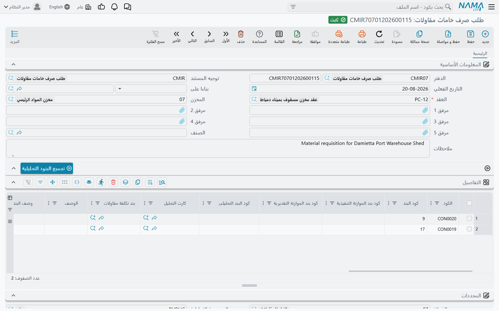
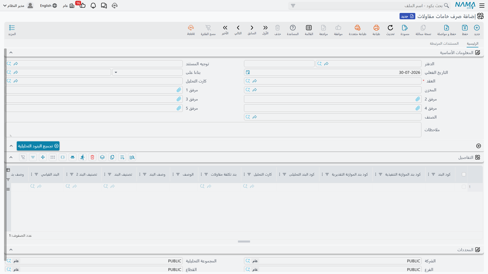
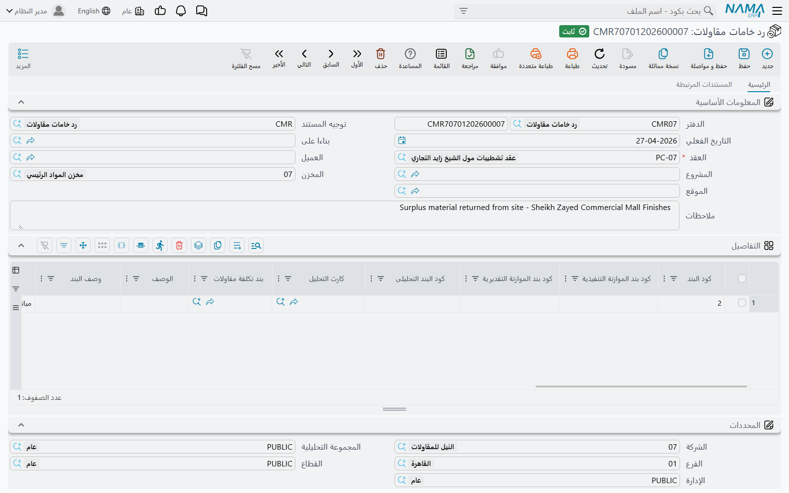

# صرف الخامات للمشروع

يوجد في قائمة **المقاولات > التكاليف** بندان متجاوران يبدوان متطابقين تقريباً ولا يتصرفان بأي تشابه.
*صرف خامات مقاولات* يأخذ مخزون الشركة ويحرقه على مشروعك أنت. أما *صرف خامات مقاول باطن* فيأخذ مخزون
الشركة و**يبيعه** لمقاول الباطن. الأول تكلفة، والثاني بيع بفاتورة كاملة خلفه. والخلط بينهما هو أغلى خطأ
في هذا الجزء من الوحدة، فقبل أي شيء: هذه الصفحة عن الأول، و
[صرف الخامات لمقاول الباطن](/ar/modules/contracting/costs/contracting-contractor-materials) عن الثاني.

ومسار المشروع ثلاثة مستندات:

| المستند | ماذا يفعل |
|---|---|
| طلب صرف خامات مقاولات | الموقع يطلب الخامة |
| صرف خامات مقاولات | الخامة تخرج من المخزن وتصبح تكلفة على المشروع |
| رد خامات مقاولات | الخامة غير المستهلكة ترجع فتنزل التكلفة |

وثلاثتها تحت **المقاولات > التكاليف** وتحتاج ترخيص `contracting`.

## لا يوجد مال على أي من هذه المستندات

انظر في جدول تفاصيل صرف الخامات فلن تجد سعر وحدة ولا خصماً ولا ضريبة — لأنه لا شيء يُسعَّر. لا أحد
تُصدَر له فاتورة. وما يتحمّله المشروع هو **تكلفة المخزون** لما خرج من المخزن، وتكلفة المخزون ليست شيئاً
يكتبه المستخدم: فعمودا المال على السطر، **تكلفة الوحده** و**اجمالى التكلفة**، للقراءة فقط ويملؤهما محرك
التكاليف.

وما **يحمله** المستند فعلاً، وهو ما يجعله مستند مقاولات لا سند صرف مخزني عادي، هو مجموعة أعمدة أكواد
البنود على كل سطر. كل سطر يقول *هذه الخامة استُهلكت على هذا البند من هذا العقد*، وهكذا تجد التكلفة
طريقها إلى العقد.

## الطلب

الطلب هو سؤال الموقع المكتوب: هذه الأصناف، على هذه البنود، من فضلكم. وله نفس شكل الصرف — عقد مشروع
إجباري، ومخزن، وسطور تفاصيل تحمل أكواد بنود وأصنافاً — وهو الورقة التي يُعتمَد بها الصرف.

وحقيقتان عنه تستحقان التصريح لأن الناس يفترضون عكسهما.

- **الطلب لا يحجز شيئاً.** فهو بحالته الافتراضية لا يكتب تكلفة ولا يُنشئ مستنداً مخزنياً ولا يغيّر
  المتاح. هو ورقة. (وخيارات الحجز وتتابع الكميات العامة الموجودة على توجيه أي مستند مخزني موجودة على
  توجيهه، فيستطيع التطبيق أن يجعله يحجز وأن يجعل الصرف يخصم من الكمية المطلوبة — لكن ذلك قرار إعداد
  متعمَّد لا سلوك افتراضي.)
- **الصرف لا يحتاج طلباً.** فلا شيء يُلزم حقل *بناءا على* على صرف الخامات. كثير من المواقع تعمل
  بالطلب أولاً لأنها تريد مسار الاعتماد، وكثير منها يصرف مباشرة. والحالتان مدعومتان.

## الصرف

### الترويسة

**العقد** إجباري ولا يقبل إلا **عقد مشروع** — فلا يمكنك توجيه صرف خامات مشروع إلى عقد مقاول باطن.
واختياره يقود اقتراحات أكواد البنود على السطور، وإذا كان المستند مبنيّاً على طلب فالعقد ينتقل تلقائياً.

و**المخزن** هو مصدر الخامة، وهو ليس مجرد قيمة افتراضية: مخزن الترويسة **يُفرَض على كل سطر** في كل مرة
يُحفظ فيها المستند. فإذا احتجت الصرف من مخزنين فأنت تحتاج مستندين.

وتحمل الترويسة كذلك مساعدين وجودهما لتوفير الكتابة، وخمسة مرفقات، ومجموعة **المحددات** المعتادة:

- **كارت التحليل** — اختره فيُملأ الجدول بسطر لكل صنف مخزني على الكارت، وكل سطر يحمل بالفعل كود بنده
  وكود بنده التحليلى وبنده القياسي وتكلفة الوحده والكمية المتاحة. ونفس الشيء ممكن على مستوى السطر من
  حقل مرجع كارت التحليل الخاص بالسطر، عند تفعيل خيار التوجيه الذي يسمح بذلك.
- **الصنف** مع زر **تجميع البنود التحليلية** — وهو السؤال المعاكس. سمِّ صنفاً وعقداً واضغط الزر، فيُملأ
  الجدول بكل بند في كروت التحليل على هذا العقد يظهر فيه ذلك الصنف. مفيد حين تُوزَّع توريدة خامة واحدة
  على عدة بنود. ويجب إدخال الصنف والعقد أولاً وإلا نبّهك الزر.

### السطور

كل سطر يزوّج **صنفاً** بـ **بند**، والنصف الخاص بالبند هو موضع مضمون المقاولات:

| العمود | لماذا |
|---|---|
| كود البند | **الحقل الحامل** — بند عقد المشروع الذي يتحمّل هذه التكلفة |
| كود بند الموازنة التنفيذية، كود بند الموازنة التقديرية | السطور المقابلة على الموازنتين، فتسقط التكلفة عليهما أيضاً |
| كود البند التحليلى، كارت التحليل | المحور التحليلي — بماذا يجب أن تُقارَن هذه التكلفة |
| البند القياسي، تصنيف البند، تصنيف البند 2، وصف البند | حقول وصفية منقولة من العقد |
| بند تكلفة مقاولات | بند كتالوج التكلفة، حين تقابل الخامة واحداً منه |
| الصنف والكود والأبعاد والكمية | ما يخرج فعلاً من المخزن |
| المخزن والموقع واللون والمقاس والشحنة والإصدار | محددات الصنف الخاصة |
| تكلفة الوحده، اجمالى التكلفة | للقراءة فقط، يملؤهما محرك التكاليف |

### ما يجب أن يستوفيه كود البند

كل كود بند غير فارغ يُراجَع على قائمة بنود العقد المختار، والكود غير الموجود فيها يُرفَض برسالة تقول إن
كود البند غير موجود في العقد. أما كون كود البند **إجبارياً** فهو قرار إعداد على توجيه المستند:

- كود بند المشروع إجباري بالوضع الافتراضي، وهناك خيار يجعله غير إجباري؛
- وخيارات منفصلة تجعل كود بند **الموازنة التنفيذية** وكود بند **الموازنة التقديرية** إجباريين أيضاً،
  للتطبيقات التي توازن على هذا المستوى.

ولترك كود بند المشروع غير إجباري نتيجة تستحق الفهم: السطر الذي لا يحمله يُتجاهل عند توزيع التكلفة، فتخرج
الخامة من المخزن ولا يسمع المشروع عنها شيئاً. فإن لم يكن تطبيقك يحتاج أكواد بنود فارغة عن قصد، فأبقِ
الكود إجبارياً.

وهناك مراجعة أخرى، غير مفعّلة افتراضياً، تربط هذا المستند بـ
[أمر شراء المقاولات](/ar/modules/contracting/costs/contracting-purchasing): فعّل خيار *منع الحفظ إذا
تعدت كمية الأصناف المصروفة كمية الأصناف في أمر الشراء* على التوجيه، فيقارن النظام — لكل صنف ولكل كود بند
— كل ما صُرف على هذا العقد بكل ما أُمر بشرائه له، ويرفض الصرف الذي يتجاوز. وهي الرابطة الصلبة الوحيدة
بين المستندين، وهي طريقة منع الموقع من استهلاك أكثر مما اشتُري له.

### ماذا يحدث عند معالجة المستند

اعتماد صرف الخامات يفعل شيئين.

**يكتب التكلفة على المشروع.** فسطور التكلفة تسقط على أكواد بنود كل سطر — وسترى سطر البند في العقد يتحرك
فوراً — وتُودَع نفس التكلفة في الرصيد الذي يسحب منه
[حصر تكاليف المقاولات](/ar/modules/contracting/costs/contracting-cost-execution) لاحقاً.

**ويُنشئ سند صرف مخزني، وهو الذي يحرّك الخامة فعلاً.** فمستند المقاولات نفسه بلا تأثير مخزني؛ وإنما
يُنشئ ويعتمد سند صرف مخزني عادي في الخلفية، يحمل سطوره ومخزنه وموقعه وتواريخه ومحدداته. والمستند
المُنشَأ يظهر في صفحة **المستندات المرتبطة** على الصرف، وإلغاء مستند المقاولات يحذفه من جديد.

::: warning المستند المُنشَأ يحتاج دفتراً وتوجيهاً وإلا لم يتحرك شيء
دفتر سند الصرف المخزني المُنشَأ وتوجيهه يُضبطان **على توجيه صرف الخامات نفسه**. وإذا كان أي منهما
فارغاً فلن يُنشأ أي مستند مخزني — يُعتمد صرف الخامات في رضا تام، ويكتب سطور تكلفته، ولا تخرج الخامة من
المخزن. وهذه أهم خطوة إعداد في هذا المستند، وأول ما تراجعه حين يبلّغك أحد بأن أرصدة المخزون لم تتغيّر.
:::

### لماذا تصل التكلفة بعد لحظة

تكلفة الخامة غير معلومة في لحظة الاعتماد، لأن متوسط التكلفة يحسبه محرك المخزون كطلب أعمال في الخلفية.
وعند انتهاء ذلك الطلب لسند الصرف المخزني المُنشَأ، ينسخ ردّ آلي إجمالي التكلفة الناتج على كل سطر من
صرف الخامات، ويستخرج منه تكلفة الوحده، ويعيد كتابة سطور التكلفة بالأرقام الحقيقية.

فالتتابع إذن: اعتماد ← إنشاء سند الصرف المخزني ← تشغيل التكليف ← يصبح رقم تكلفة المشروع نهائياً. وهذه
ثوان لا دقائق على قاعدة بيانات مشغولة، لكنها ليست لحظية، وظهور صفر في عمود التكلفة مباشرة بعد الاعتماد
ليس خطأً. ونفس الآلية يمكن إعادة تشغيلها إذا غيّر تصحيح تكلفة في مكان آخر الجواب — كما أن حصر التكاليف
يطلب من كل مستند صرف على وشك استيعابه أن يحدّث تكلفته أولاً، وذلك تحديداً لأن متوسط التكلفة يتحرك.

## الرد

الخامة التي صُرفت ولم تُستهلك ترجع بمستند **رد خامات مقاولات**، ويجب أن تنزل تكلفة المشروع بمقدار ما
عاد. وشكله يحاكي الصرف — عقد مشروع إجباري، ومخزن تُفرَض قيمته على السطور، ونفس أعمدة أكواد البنود، ونفس
أعمدة التكلفة للقراءة فقط — مع حقل **المشروع** على الترويسة لا يوجد في الاثنين الآخرين. واختيار مشروع
يُرشّح قائمة العقود إلى عقود ذلك المشروع غير المنتهية، واختيار عقد يستطيع أن يملأ الجدول مقدماً بسطر لكل
بند من بنوده.

وسلوكه المميّز هو **مراجعة كمية الرد**. فقبل الاعتماد يجمع النظام، لكل كود بند وصنف، كل ما صُرف على هذا
العقد وكل ما رُدّ منه بالفعل، ثم يرفض السطور غير المنطقية:

- أن الصنف لم يُصرف على ذلك البند أصلاً؛
- أو أن الكمية المرتجعة أكبر من الكمية المصروفة لهذا الصنف على هذا البند.

وخياران على التوجيه يعدّلان ذلك. أحدهما يسمح بأن تكون الكمية المرتجعة أكبر من المصروفة، للمواقع التي
تحتاج ذلك فعلاً. والآخر يجعل المقارنة تأخذ **كود بند الموازنة التنفيذية** في الحسبان أيضاً، فيُتابَع نفس
الصنف على نفس بند العقد منفصلاً لكل سطر موازنة.

وعند الاعتماد يكتب الرد سطور تكلفة سالبة على أكواد البنود ويُنشئ **سند استلام مخزني** — مقابل سند الصرف
في الصرف، ومتوقّف بنفس الدرجة على ضبط دفتر وتوجيه المستند المُنشَأ على توجيه الرد نفسه. والقيمة التي
تُردّ للمشروع هي تكلفة الدخول الخاصة بالاستلام، وتصل هي أيضاً عبر طلب التكليف في الخلفية.

## بعد أن يستوعبه حصر تكاليف يُقفَل

كل من الصرف والرد يرفض الحذف بعد أن يستوعب حصر تكاليف أحد سطوره، برسالة تقول إن المستند مرتبط بحصر
تكاليف. وتعديل ذلك السطر ممنوع للسبب نفسه. وهذا مقصود — فحصر التكاليف المعتمد حوّل تلك التكلفة إلى تكلفة
للوحدة بالفعل، وقد يكون مستخلص قد فوتر عليها. ولتصحيح خطأ بهذا العمق لا بد من عكس حصر التكاليف أولاً،
ومستخلص المشروع قبله إن وُجد.

## مثال عملي: 200 طوبة، وخمس منها ترجع

نُكمل مع **برج A**، عقد المشروع `PC-2026-001`، البند `3.01` أعمال المباني.

1. **الموقع يطلب.** المستند `CMQ-000042`، طلب صرف خامات مقاولات: العقد `PC-2026-001`، المخزن
   `WH-SITE-A`، سطر واحد — البند `3.01`، الصنف `BLK-20` طوب مفرّغ، **200 عدد**. لا يُحجز شيء؛ المخزن
   يعرف الآن ما هو المطلوب فقط.
2. **أمين المخزن يصرف.** المستند `CMI-000101`، صرف خامات مقاولات وحقل *بناءا على* = `CMQ-000042`، فينسخ
   العقد نفسه. نفس المخزن، نفس السطر، اعتماد.
3. **المخزون يتحرك.** توجيه المستند يسمّي دفتر المستند المُنشَأ `SI-CNTR` وتوجيهه `SI-CNTR-STD`، فيُنشأ
   سند الصرف المخزني `SI-001207` ويُعتمد تلقائياً، فتخرج 200 طوبة من `WH-SITE-A`.
4. **التكلفة تصل.** يعمل طلب التكليف؛ متوسط التكلفة 4٫00 للطوبة. فيكتب الردّ الآلي تكلفة الوحده 4٫00
   واجمالى التكلفة **800** على السطر ويعيد كتابة سطور التكلفة.
5. **المشروع يشعر بها.** البند `3.01` على `PC-2026-001` أعلى بـ 800 في *التكلفة الفعلية*، و800 من
   *التكلفة من الصرف* أصبحت في الرصيد بانتظار حصر تكاليف.
6. **خمس ترجع.** المستند `CMR-000018`، رد خامات مقاولات: العقد `PC-2026-001`، البند `3.01`، الصنف
   `BLK-20`، **5 عدد**. تنجح مراجعة الرد — فقد صُرفت 200 على ذلك البند ولم يُرد شيء بعد. وسند الاستلام
   `SR-000455` يعيدها للمخزن، وبسعر 4٫00 يُردّ للمشروع **20٫00**.

فأثر المستندين على البند `3.01` صافياً: **780** من تكلفة الخامات. وحاول أن ترد طوبة سادسة فسيُرفض
الاعتماد، لأن 200 خرجت و5 رجعت بالفعل.

وبنهاية مارس يكون هذا الصرف واحداً من قليل، وتكون خامات البند قد بلغت 900 — وهو الرقم الذي يظهر في
عمود *التكلفة من الصرف* حين يجمع
[حصر تكاليف مارس](/ar/modules/contracting/costs/contracting-cost-execution) الفترة.
