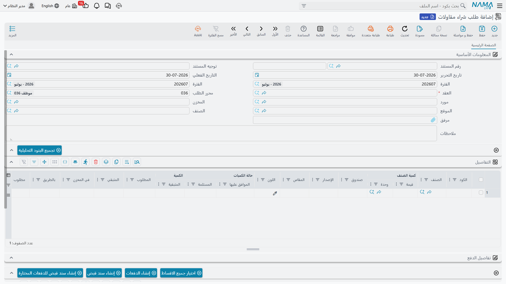
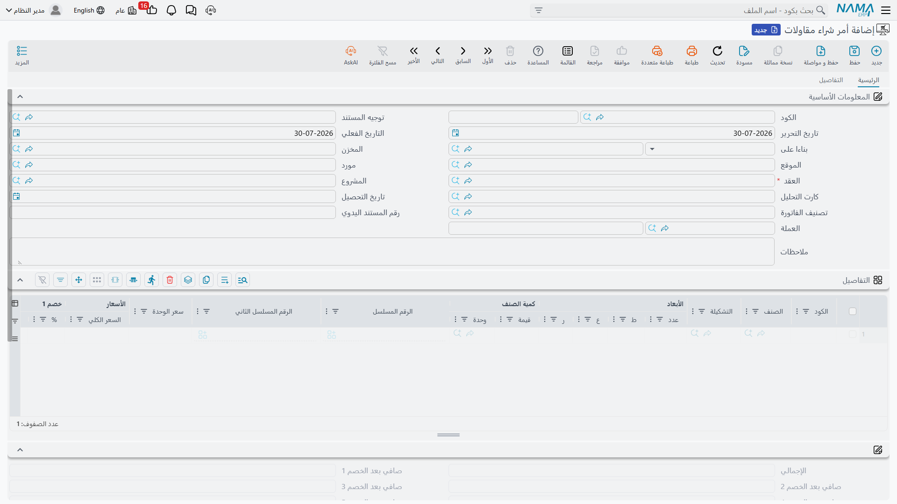

# طلبات وأوامر شراء المقاولات

في نما طلب شراء وأمر شراء في وحدة سلاسل الإمداد يعملان بكفاءة تامة. فلماذا تشحن المقاولات نسختها
الخاصة منهما؟

لأن المقاول لا يشتري حديد تسليح فحسب. هو يشتري حديد تسليح **لبند الخرسانة في عقد برج A**، من سطر
الموازنة التنفيذية المعتمد لهذا البند، مقابل كارت تحليل قال إن البند يحتاج كذا من الحديد لكل متر مكعب.
فلا بد أن يكون الشراء متتبَّعاً إلى سطر في جدول كميات من لحظة طلب الموقع له، وإلا فلن يجيب أحد على
السؤالين اللذين يسألهما مدير المشروع كل أسبوع: *هل وصل ما طلبناه لهذا البند*، و*هل نشتري منه أكثر مما
بعناه؟*

فطلب شراء المقاولات وأمر شراء المقاولات هما مستندا الشراء العاديان — نفس المورد، ونفس بلوك السعر
بمستويات خصمه الثمانية وضرائبه الأربع، ونفس جداول الأقساط، ونفس بيانات الشحن — **زائداً عمود فقري
للمقاولات على كل سطر**. وذلك العمود الفقري هو كل سبب وجودهما.

## أين يوجدان وبأي اسم

| المستند | الاسم | موضع النقر |
|---|---|---|
| طلب شراء مقاولات | Contracting Purchase Request | المقاولات > مقاولة مقاول باطن |
| أمر شراء مقاولات | Contractor Purchase Order | المقاولات > مقاولة مقاول باطن |

وكلاهما يحتاج ترخيص `contracting`. وموضعهما في القائمة مُضلِّل: فهما مستندان عن **مشروعك أنت**
مُدرَجان تحت مجموعة قائمة مقاول الباطن. واسم الأمر في القائمة الإنجليزية *Contractor Purchase Order*،
لكن حقل العقد فيه لا يقبل إلا **عقد مشروع** — فلا يمكنك توجيه أي منهما إلى عقد مقاول باطن أبداً.

## العمود الفقري الذي يجعلهما مستندي مقاولات

كل سطر في المستندين يحمل، فوق أعمدة الشراء العادية، نفس مجموعة أعمدة المقاولات التي تراها على
[صرف الخامات](/ar/modules/contracting/costs/contracting-project-materials):

| العمود | لماذا |
|---|---|
| كود البند | **الحقل الحامل** — بند عقد المشروع الذي يخصّه هذا الشراء |
| كود بند الموازنة التنفيذية، كود بند الموازنة التقديرية | السطور المقابلة على الموازنتين |
| كود البند التحليلى، كارت التحليل | المحور التحليلي، فيُقارَن الشراء بالتكلفة المحلَّلة |
| البند القياسي، تصنيف البند، تصنيف البند 2، وأعمدة الوصف الثلاثة | حقول وصفية منقولة من العقد |
| العقد | عقد المشروع الخاص بهذا السطر بعينه |

ومعها بلوك من أرقام الإتاحة يجيب على سؤال «هل نحتاج الشراء أصلاً؟» دون مغادرة الشاشة: **المطلوب**
و**بالمخزن** و**تحت التوريد** و**المتبقي** و**الموجود بأوامر الشراء**.

وأي كود بند تكتبه يُراجَع على قائمة بنود العقد المختار، والكود غير الموجود مرفوض. ويُراجَع كود بند
الموازنة التنفيذية كذلك على تشجير الموازنة نفسها — فلا تستطيع الشراء على سطر موازنة تجميعي وجوده لجمع
أبنائه فقط.

## الطلب — الموقع يطلب، ولا شيء غير ذلك

الطلب هو ما يحرّره مهندس الموقع حين لا يستطيع المخزن التوريد. وثلاثة أشياء عليه خاصة بهذه المهمة.

**الطالب يملأ نفسه.** فبفتح طلب جديد يُوضَع في حقل *الطالب* ملف الموظف الخاص بالمستخدم الحالي، فيبقى
الخط الراجع إلى من طلب دون أن يكتب أحد اسماً.

**كل سطر يتتبّع تنفيذه.** فبجوار الكمية المطلوبة **الكمية المعتمدة** و**الكمية المُورَّدة**
و**الكمية المتبقية**، ومعها **المورد المقترح** الذي يرشّحه الموقع لينظر فيه المشتري. فالطلب نافع بعد
تحريره بمدة طويلة: هو السجل الجاري لما طُلب وكم منه وصل فعلاً.

**كارت التحليل يملأ الجدول عنك.** سمِّ صنفاً في الترويسة واضغط **تجميع البنود التحليلية** فيُملأ الجدول
بكل بند في كروت التحليل على هذا العقد يظهر فيه ذلك الصنف — وهو مفيد حين تُوزَّع توريدة واحدة على عدة
بنود. والعكس يعمل أيضاً: اختر كارت تحليل فيُملأ الجدول من سطوره. ويستطيع التطبيق كذلك حصر منتقي
الأصناف في أصناف كارت التحليل، بالإعداد الموصوف في
[إعدادات المقاولات](/ar/modules/contracting/contracting-configuration).

**والطلب لا يقيّد شيئاً.** لا قيد يومية ولا حركة مخزنية. وهل يمسّ المشروع أصلاً؟ ذلك قرار إعداد على
توجيهه: فعّل *تطبيق تأثير تكاليف وكميات المقاولات* فيبدأ الطلب في إضافة **الكمية المطلوب شراؤها** إلى
سطور البنود التي يسمّيها. واتركه فلا يضيف شيئاً — فهو ورقة، وذلك عادةً ما تريده من طلب.

## الأمر — الالتزام تجاه المورد

في الأمر يظهر المال. فترويسته تحمل المورد وعقد المشروع الإجباري والمشروع وكارت التحليل وفترة التوريد
وتاريخه وتاريخ التحصيل ونموذج الدفع ومركّب مبالغ الفاتورة بكامله؛ وسطوره تحمل بلوك سعر الشراء كاملاً
فوق العمود الفقري للمقاولات. وفي صفحة ثانية ثلاثة جداول تهمّ في شراء إنشائي:

- **بنود الشراء** — جدول بنود قياسية مع تاريخ نهاية عمل البند المخططة، وتاريخ نهايته المُمَدَّد،
  وتاريخ التحقق، ومجموع غرامات التمديد. هنا تُكتَب عبارة «التوريد للموقع قبل 20 وإلا 1% أسبوعياً».
- **الدفعات** — خطة الأقساط المبنية من نموذج الدفع، ومعها إجراء *أقساط الدفع* لبيان ما سُدِّد فعلاً.
- **سندات الدفع** — سندات الدفع التي سدّدت هذا الأمر من خارجه.

### ما يفعله الأمر فعلاً عند معالجته

تأثيران، وكلاهما قابل للإعداد بطريقة تفاجئ المرة الأولى.

**لا يقيّد في الأستاذ إلا إذا أمرته.** فالأمر ينظر إلى الجانبين المدين والدائن على توجيهه. فإن لم
يكونا معدَّين فهو لا يقيّد شيئاً على الإطلاق — وهذا هو الإعداد الطبيعي، لأن أمر الشراء التزام لا
مصروف. وإن كانا معدَّين أنتج قيداً بشكل الفاتورة بضرائبه وخصوماته. وإن غيّرت رأيك وأفرغت الجانبين
أَلغت إعادة معالجة الأمر القيد الذي كان قد أنشأه.

**ويضيف الكمية المطلوب شراؤها إلى المشروع.** والقطبية هنا معاكسة للطلب: فالأمر يطبّق تأثير كميات
المقاولات **إلا إذا** فعّلت *عدم تطبيق تأثير تكاليف وكميات المقاولات*. والذي يسقط على سطر بند العقد هو
عمود **الموجود بأوامر الشراء** — لا المال. أما مال الخامة المشتراة فيصل إلى المشروع لاحقاً عند صرفها
عليه. وثمة خيار آخر يجعل هذه المدخلات تظهر **عند الحفظ، قبل اعتماد الأمر**، لمن يريد الالتزام مرئياً
خلال دورة الاعتماد لا بعدها؛ وإلغاء المسوّدة يزيلها من جديد.

### ما يرفض حفظه

المورد إجباري. وخطة الأقساط لا بد أن تتوافق مع المتبقي ومع سندات الدفع عليه. وكل كود بند لا بد أن يكون
موجوداً في العقد، وكود بند الموازنة التنفيذية لا بد أن يحترم تشجير الموازنة، والعقد لا بد أن لا يكون
منتهياً. وخيارَان آخران يحدّان الكميات نفسها: *منع تجاوز الكمية* و*منع تجاوز كمية كارت التحليل*،
يقيسان الأمر على الكمية المخططة والكمية المحلَّلة للبند على الترتيب.

## الرابط الصلب الوحيد بين الأمر واستهلاك الموقع

أمر شراء المقاولات هو كذلك السقف المسموح للموقع أن يستهلكه. فعّل *منع الحفظ إذا تعدت كمية الأصناف التي
يتم صرفها كمية الأصناف الموجودة في أمر الشراء* على توجيه
[صرف الخامات](/ar/modules/contracting/costs/contracting-project-materials) فيجمع النظام، لكل صنف ولكل
كود بند، كل ما صُرِف على هذا العقد ويقارنه بكل ما أُمِر بشرائه عليه. فإن صرفت أكثر مما اشتريت لهذا
البند رُفض الحفظ.

والتحقق يعمل في الاتجاهين. فتقليل أمر استُهلك بالفعل أكثر منه أو حذفه مرفوض للسبب نفسه وبالمقارنة
نفسها. وهذا هو الارتباط المُلزَم الوحيد بين المستندين، وهو مُطفأ افتراضياً.

## لا توجد فاتورة شراء مقاولات

هذه هي الحقيقة التي يتعثر فيها الجميع. في الوحدة طلب شراء و**أمر** شراء، ثم تتوقف السلسلة: **الأمر
تُصدَر عليه فاتورة الشراء العادية في سلاسل الإمداد.** فلا توجد فاتورة شراء مقاولات، والبحث عنها في
قائمة المقاولات مضيعة لبعد الظهر.

وعملياً تُنشئ فاتورة الشراء من الأمر بالطريقة العادية — من *بناءا على*، أو من آلية توليد المستندات
التي يشارك فيها كل أمر شراء — ومن تلك اللحظة أنت في أرض سلاسل الإمداد: استلام مخزني، ورصيد مورد،
ومدفوعات، كله قياسي.

والذي **لا** تحمله فاتورة الشراء العادية هو العمود الفقري للمقاولات. فليس بها عمود كود بند، فلا تستطيع
أن تقول إلى أي سطر في جدول الكميات ينتمي المال. وهذا ليس نقصاً تحتاج التحايل عليه، بسبب طريقة تصميم
وصول تكلفة المشروع:

- **الخامة المخزنية** تصبح تكلفة على المشروع عند **صرفها عليه**، بتكلفة المخزون — راجع
  [صرف الخامات للمشروع](/ar/modules/contracting/costs/contracting-project-materials). أما شراؤها فلا
  ينقلها إلا إلى المخزن.
- **الصرف غير المخزني** — خدمة أو إيجار أو رسم — لا يمرّ من هذا الزوج إطلاقاً. بل يمرّ من
  [ثلاثي مستلزمات المقاولات](/ar/modules/contracting/costs/contracting-misc-spend)، وفاتورته تحمل
  أكواد البنود **وتقيّد** تكلفة المشروع.

فالقاعدة العملية عند السؤال أي مستند شراء يُستخدم: إن كان الشيء سيرقد في مخزن فاستخدم هذا الزوج واترك
الصرف يحمل التكلفة. وإن كان لن يُخزَّن أبداً فاستخدم مستندات المستلزمات.

## مثال عملي: أربعة أطنان حديد لبند الخرسانة

**برج A**، البرج السكني الذي نبنيه لـ **الفنار للتطوير**، عقد مشروع `PC-2026-001`. البند `2.01`
*الخرسانة المسلحة*، 60 م³.

1. **الموقع يطلب.** `CPR-000067`، طلب شراء مقاولات: العقد `PC-2026-001`، والطالب مملوء تلقائياً بمهندس
   الموقع، سطر واحد — البند `2.01`، وبند الموازنة التنفيذية `EX-2.01`، الصنف `RBR-16` حديد مبروم 16
   مم، **4 أطنان**، والمورد المقترح *الخليج للحديد*. وأعمدة الإتاحة تُظهر 0.4 طن بالمخزن ولا شيء تحت
   التوريد، وهذا هو مبرر الشراء. والطلب لا يقيّد ولا يحجز شيئاً.
2. **المشتريات تحوّله.** `CPO-000058`، أمر شراء مقاولات منشأ من الطلب، فينتقل العقد وتنتقل السطور.
   المورد *الخليج للحديد*، 4 طن × 2,600 = **10,400**، وضريبة 15% = 1,560، والإجمالي **11,960**. وسطر
   بنود شراء يسجّل «التوريد للموقع قبل 18 أبريل ثم 1% أسبوعياً». وخطة الأقساط 50% عند التوريد و50% بعد
   30 يوماً.
3. **العقد يلاحظ.** توجيه الأمر تارك تأثير التكاليف والكميات مفعَّلاً، فالبند `2.01` من `PC-2026-001`
   يُظهر الآن **4** في عمود *الموجود بأوامر الشراء*. أما *التكلفة الفعلية* فلم تتحرك — إذ لم يصل مال
   إلى المشروع بعد.
4. **المورد تُصدَر له فاتورة.** يحرّر المشتري **فاتورة شراء** عادية من `CPO-000058`. ورصيد المورد
   وضريبة المدخلات يُعالَجان هناك. والمشروع ما زال بلا تكلفة.
5. **الحديد يصل إلى المشروع.** حين يُسحَب الحديد من مخزن الموقع للصبّ يكون `CMI-000119`، صرف خامات
   مقاولات على البند `2.01`، هو ما يضع التكلفة أخيراً على العقد — بتكلفة المخزون لما خرج من المخزن.
6. **والسقف يعمل.** توجيه صرف الخامات مفعَّل عليه تحقق المصروف مقابل المشترى. أربعة أطنان أُمِر بها
   للبند `2.01`؛ فأي صرف ثانٍ يرفع الإجمالي فوق الأربعة أطنان مرفوض حتى يحرّر أحدهم أمراً آخر.

هذه المتابعة هي النموذج كله مصغَّراً: **الأمر يلتزم بالكمية، والفاتورة العادية تسوّي مع المورد، والصرف
يحمل التكلفة.**
