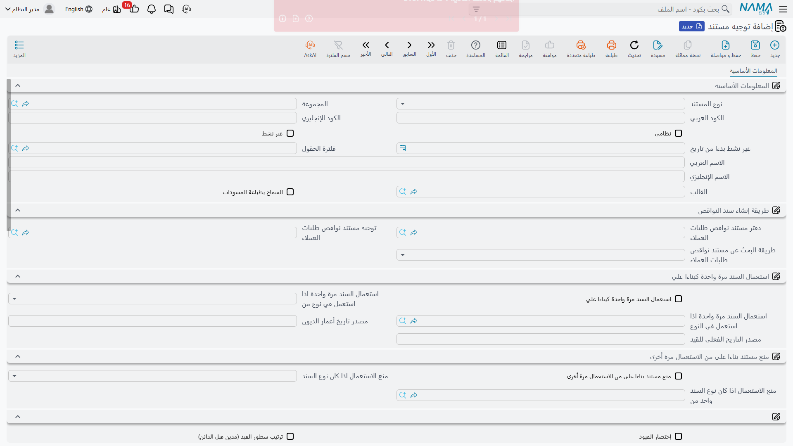

# توجيه المستخلصات

المستخلص هو المستند الوحيد في سلسلة المقاولات الذي يصل إلى الدفاتر، وهذا يجعل توجيهه أخطر إعداد في الوحدة كلها. فكل ما يسجّله المستخلص — قيمة الأعمال المعتمدة، والضرائب، والخصومات، والتكلفة المخططة، والتكلفة الفعلية، والفروق — هو زوج حسابات على هذه الشاشة الواحدة. اضبطه مرة واحدة لكل نوع من العقود فلن يعود أحد يفكر فيه، واترك زوجاً فارغاً فلن يظهر ذلك الجزء من القيد أبداً.

وهناك شاشتا توجيه للمستخلصات: واحدة [لمستخلص المشروع](/ar/modules/contracting/project-contracting/contracting-project-extracts.md) الذي تحاسب به المالك، وأخرى [لمستخلص مقاول الباطن](/ar/modules/contracting/contractor-contracting/contracting-contractor-extracts.md) الذي تعتمد به أعمال مقاول الباطن. وهما مبنيتان من مجموعة الخيارات المشتركة نفسها، فكل ما يأتي أدناه ينطبق على الاثنتين إلا ما نُصّ على اختلافه. والشاشتان كلتاهما **صفحة واحدة**: كل شيء على تبويب واحد، مرتَّب في سلسلة مجموعات صغيرة — المفاتيح السلوكية أولاً، ثم مجموعة لكل تسجيل.

وأفضل طريقة لقراءة الشاشة أن تنظر إلى مجموعاتها على أنها نوعان: **الخيارات السلوكية** تغيّر حساب المستند نفسه — ما معنى الكمية، وعلى أي أساس يُسعَّر، وما الذي يُخصم. أما **مجموعات التأثير** فلا تغيّر شيئاً من الأرقام، بل تحدد فقط أين تحطّ هذه الأرقام في الدفاتر. اضبط مجموعات التأثير أولاً لأنها التي تجعل المستند يسجّل، واعتبر المفاتيح السلوكية ضبطاً دقيقاً تشغّله عندما يطلب مالكٌ أو استشاريٌ عرضاً بعينه.

## أين تجدهما

| | |
|---|---|
| القائمة | الأساسيات > الإعدادات > توجيه مستند |
| نوع المستند المستهدف | **مستخلص مشروع** أو **مستخلص مقاول باطن** |
| الصفحات | واحدة — *التأثير* |
| اقرأ أيضاً | [أساسيات توجيه المستندات](/ar/modules/contracting/document-terms/contracting-terms-basics.md) لمعرفة ما هو الجانب المحاسبي وكيف يتجاوزه البند القياسي |

## الغرض من كل تسجيل

كل مجموعة على الشاشة هي تسجيل واحد، وكل تسجيل هو جانب مدين وجانب دائن ومبلغ ثابت يقيسه نما من المستند. أنت لا تختار المبلغ، بل تختار أين يذهب فقط. واترك جانبي المجموعة فارغين فيُلغى ذلك التسجيل كله.

| المجموعة التي تضبط فيها حسابات… | المبلغ المسجَّل | لكل سطر أم لكل مستند | على أي شاشة |
|---|---|---|---|
| **قيمة الأعمال الأساسية** — إيراد في جانب المالك، وتكلفة/مستحق في جانب مقاول الباطن | **القيمة المستحقة** للسطر، أي ما يُحاسب عليه ذلك البند هذه المرة | زوج لكل سطر تفاصيل | كلتاهما |
| **التكلفة المخططة** للعمل المعتمد | **إجمالي تكلفة** السطر | زوج لكل سطر تفاصيل | كلتاهما |
| **الضريبة 1**، ثم **الضريبة 2** و**الضريبة 3** و**الضريبة 4** كل على حدة | قيمة الضريبة 1…4 لكل سطر | مجموعةً على السطور | كلتاهما |
| **الخصومات من 1 إلى 8** | قيمة الخصم 1…8 لكل سطر | مجموعةً على السطور | كلتاهما |
| **التكلفة الفعلية** — التكلفة المستهلكة حقاً، خلافاً للتكلفة المخططة أعلاه | إجمالي التكلفة الفعلية للسطر | مجموعةً على السطور | مستخلص المشروع |
| **فرق التكلفة** — المخطط مقابل الفعلي | فرق تكلفة السطر. والجانب الدائن هو *دائن فرق التكلفة* وإن كانت ترجمته الإنجليزية على الشاشة مضطربة | مجموعةً على السطور | كلتاهما |
| **فرق إجمالي السعر**، ومعه فرق لكل خصم من الخصومات الثمانية | فرق إجمالي سعر السطر وفروق خصوماته. ولا معنى لهما إلا مع تسعير الفروق أدناه | مجموعةً على السطور | كلتاهما |
| **الفرق بين التكلفة الفعلية للمستخلصات ومستندات التكلفة** | رقم واحد على مستوى الرأس | مرة واحدة للمستند | كلتاهما |

وشيئان **ليسا** على هذه الشاشة عن قصد:

- **المحتجزات واسترداد الدفعة المقدمة والغرامات.** فهي تصل كسطور شروط وتأخذ حساباتها من [سجل الشرط](/ar/modules/contracting/setup/contracting-conditions.md)، ومنها حسابات ضريبة الشرط نفسه. راجع [كيف تسجّل الشروط](/ar/modules/contracting/document-terms/contracting-terms-basics.md).
- **حسابات بنود العمل.** فـ[البند القياسي](/ar/modules/contracting/setup/contracting-standard-terms.md) الذي يحمل مديناً أو دائناً خاصاً به يتجاوز الزوج الأساسي في سطوره وحدها.

وهناك جانب إضافي واحد يُستخدم للشروط التي تحمل قيمة **أخرى** لا إضافة ولا استقطاعاً: فتُسجَّل دائنةً على جانب تكلفة إضافية منفصل، وترجع إلى الدائن الأساسي إن تركته فارغاً.

::: tip سطور البنود الرئيسية عناوين لا أموال
سطر البند الرئيسي (المجمِّع) لا يسجّل على الزوج الأساسي ولا على زوج التكلفة أبداً؛ السطور الطرفية وحدها هي التي تسجّل. لكن السطور الرئيسية **تُدخَل** في الحساب عند تجميع مبالغ الضرائب والخصومات والتكلفة الفعلية والفروق. فأبقِ القيم على السطور الطرفية واستخدم الرئيسية عنواناً محضاً؛ فسطر رئيسي يحمل ضريبته أو خصمه المجمَّع سيُحسب إلى جانب أبنائه.
:::

## أنماط التسعير — ما تبلغه قيمة المستخلص التالي

المستخلص **تزايدي** بالافتراض: كل مستخلص يحاسب على عمل فترته وحدها، وتظهر المستخلصات السابقة ككمية *سابقة* على السطر، ولا يُعاد حساب شيء إلى الخلف. هذا هو الافتراضي، ولا يحتاج خياراً، وهو ما تشرحه [صفحة مستخلص المشروع](/ar/modules/contracting/project-contracting/contracting-project-extracts.md) بالتفصيل.

وبعض المالكين والاستشاريين يشترطون عرضاً تراكمياً بدلاً منه: "الأعمال حتى تاريخه 700 م³ بسعر 50 = 35,000، ناقصاً ما سبق اعتماده 20,000، فهذه الشهادة 15,000". وخياران يحوّلان الحساب إلى هذا الشكل:

| الخيار | ماذا يغيّر |
|---|---|
| **احتساب الأسعار بناءً على إجمالي الكمية** | يُسعَّر السطر على الكمية **التراكمية**، ثم تُخصم قيم المستخلصات السابقة للوصول إلى قيمة هذه الشهادة |
| **احتساب فرق الأسعار من المستخلص السابق فقط** | يُسعَّر على الكمية التراكمية كذلك، لكن يخصم **المستخلص السابق مباشرة** وحده، ويسجّل الفروق الناتجة في أعمدة الفروق — وهي الغاية التي وُجد من أجلها تسجيلا فرق إجمالي السعر وفروق الخصومات أعلاه |

وأمران يجب معرفتهما قبل اختيار التسعير التراكمي:

- **الخيار التراكمي لا يعمل وحده إلا نصف عمل.** فهو يغيّر تسعير السطور فعلاً، لكن إعادة حساب أسعار المستخلصات السابقة وخصوماتها وإعادة حساب الضرائب لا تحدث إلا إذا كان إعداد الوحدة الخاص بإظهار سطور بنود المراحل مشتغلاً في [إعدادات المقاولات](/ar/modules/contracting/contracting-configuration.md). فبدون ذلك الإعداد لا تُعاد حسبة الجانب "السابق" من العرض التراكمي، فتخرج أرقام ليست هي التي يُفترض أن تعرضها الشهادة التراكمية. فتعامل مع الاثنين على أنهما زوج واحد.
- **الخيارَان وصفان لحسابين مختلفين لفكرة واحدة، فاختر واحداً.** ففي توجيه مستخلص مقاول الباطن يرفض النظام حفظهما معاً، وفي توجيه مستخلص المشروع يمكن حفظهما معاً، وهو جمع لا معنى له — فاختر عن قصد.

وثلاثة خيارات أخرى تطبّق المعالجة التراكمية نفسها على مبالغ مفردة لا على السطر كله:

| الخيار | التأثير | على أي شاشة |
|---|---|---|
| **إعتبار قيم خصم 1 من المستخلصات السابقة** | يُعالَج الخصم 1 تراكمياً ويُخصم خصم 1 من المستخلصات الأقدم | كلتاهما |
| **إعتبار قيم خصم 2 من المستخلصات السابقة** | مثله للخصم 2 | كلتاهما |
| **اعتبار قيم الضرائب من المستخلصات السابقة** | تُعالَج الضرائب من 1 إلى 4 تراكمياً وتُخصم ضريبة المستخلصات الأقدم | مستخلص المشروع |

ورابع، وهو **تسوية فرق سعر الوحدة السابقة**، يعالج حالة تغيّر سعر وحدة العقد في منتصف المشروع بعد أن سُعِّرت شهادات سابقة بالسعر القديم: فيسجّل الفرق تسويةً مستقلة. وهو معلّق على تشغيل إعداد فرق سعر الوحدة على مستوى الوحدة؛ فإذا كان ذلك الإعداد مغلقاً رفض التوجيه أن يُحفظ وهذا الخيار مؤشَّر، وهذه رسالة النظام بأن تفعّل الخصيصة أولاً.

## الكمية والسعر والمستخلص السابق

| الخيار | ماذا يغيّر | على أي شاشة |
|---|---|---|
| **السماح للمستخلص بتجاوز كميات العقد** | يلغي فحص النسبة المسموح بها كلياً، فيجوز للسطر أن يحاسب على أكثر مما تسمح به كمية العقد | كلتاهما |
| **الإلتزام بأسعار العقد** | يمنع الحفظ إذا اختلف سعر وحدة أي سطر عن سعر العقد | كلتاهما |
| **السماح بتعديل تفاصيل المستخلص اذا كان بناءا على حصر كميات** | يتيح للإدارة التجارية تعديل الكميات على مستخلص بُني من [حصر كميات](/ar/modules/contracting/project-contracting/contracting-project-execution.md). وبدونه تكون تلك الكميات مقفلة على ما تم حصره | كلتاهما |
| **حساب إجمالي القيمة المستحقة من إجمالي المستخلص السابق** | يصبح إجمالي المستحق في الرأس = إجمالي هذا المستخلص ناقصاً إجمالي المستخلص السابق، بدلاً من جمعه من السطور | كلتاهما |
| **ملء الكمية الحالية بالكمية المتبقية من المستخلص السابق** | يغيّر ما يضعه زر *تجميع البنود* في كمية المحاسبة: الكمية المتبقية كلها بدلاً من لا شيء | كلتاهما |
| **جعل الكمية صفر عند تجميع البنود او اختيارها في السطور** | يجمّع *تجميع البنود* البنودَ بكمية صفر، لمن يفضّل كتابة كل كمية بيده | كلتاهما |

::: info الإلتزام بأسعار العقد منعُ حفظٍ لا تصحيحُ سعر
فهو لا يصلح سعراً خاطئاً بل يرفض المستند. وفي عقد تعيد فيه الإدارة التجارية التسعير بحق (تغيّر فئة، أو تعديل متفاوض عليه) اتركه مغلقاً واضبط الأسعار عبر [تعديلات العقد](/ar/modules/contracting/project-contracting/contracting-project-contract-updates.md).
:::

## نسبة المحاسبة

مستخلصات المقاولات تحمل **نسبة محاسبة** — أي نسبة قيمة السطر المستحقة فعلاً الآن، وتُستخدم حيث ينص العقد على اعتماد بند عملٍ بنسبة 90% مثلاً حتى يوقّع الاستشاري. وثلاثة خيارات تحدد إلى أي مدى تمتد هذه النسبة:

| الخيار | ماذا يغيّر | على أي شاشة |
|---|---|---|
| **إعتبار نسبة المحاسبة في حساب السعر الكلي للمستخلص** | تضرب النسبة الكمية المستخدمة في التسعير، فينخفض إجمالي سعر السطر نفسه | كلتاهما |
| **الأخذ في الاعتبار نسبة المحاسبة عند حساب قيمة الخصومات** | تُطبَّق النسبة قبل حساب الخصومات، فتتبع الخصومات الأساسَ المنخفض | كلتاهما |
| **ترك نسبة المحاسبة صفر وعدم تعديلها الى 100** | يبقى السطر المتروك على صفر بالمئة صفراً بدلاً من رفعه إلى 100 | مستخلص المشروع |

## الشروط والأقساط وشكل القيد

| الخيار | ماذا يغيّر |
|---|---|
| **تجميع سندات الدفع اليا مع الحفظ** | هل تُجمَّع الدفعات المقدمة والغرامات في جدول الشروط تلقائياً مع الحفظ؟ والاختيارات: لا أبداً، أو مع كل مستخلص، أو مع المستخلص الختامي وحده |
| **نسخ بيانات السطور التي بها متبقي من سند الشرط عندما يكون كود البند و الشرط فارغين** | سطر شرط لا يذكر إلا سند دفع، بلا كود بند ولا شرط، يُفرد إلى سطر لكل سطر دفعٍ متبقٍّ على ذلك السند |
| **إضافة ضريبة الشرط إلى قيمة المستخلص** | يضيف ضريبة كل سطر شرط إلى تسجيل **الضريبة 1**، فوق حسابات ضريبة الشرط نفسه. واقرأ الخيار بهذا السلوك لا بمسمّاه، فالمسمّى يوحي بأنه يغيّر قيمة المستخلص وهو لا يفعل |
| **تحديث المتبقي في العقد وليس في المستخلص عند عمل سند قبض أو صرف** | يخفض السدادُ بسند القبض أو الصرف الرصيدَ المتبقي على جدول دفعات **العقد** لا على المستخلص |
| **ربط الفاتورة فى جريد الفواتير فى سندات القبض والدفع** | تحمل سندات القبض والصرف سطور هذا المستخلص في جدول فواتيرها، فيمكن مطابقة التحصيل سطراً سطراً |
| **اختصار القيد** | يدمج سطور القيد المتعددة في سطر واحد لكل حساب. وعلى كراسة شروط من 200 بند هذا هو الفرق بين قيد يمكن قراءته وقيد لا يُستفاد منه |
| **احتساب نسبة خصم N من القيمة** (واحد لكل خصم من 1 إلى 8) | تُستنبط نسبة الخصم من المبلغ الذي كتبته لا العكس. والمفتاح نفسه موجود في إعدادات الوحدة وعلى العقد، ويكفي أن يكون أحد الثلاثة مشتغلاً |

## جانب المالك وحده — نموذج الضرائب

آلية بند الضريبة التلقائية موجودة على توجيه مستخلص **المشروع** وحده، لأن مستخلص المالك هو المستند الذي يُرسَل إلى مصلحة الضرائب.

| الخيار | ماذا يفعل |
|---|---|
| **بند مستخلص ضريبي** | المنتج الافتراضي أمام مصلحة الضرائب الذي تُنسَب إليه بنود كراسة الشروط، ويُستخدم حين لا يكون للسطر بند ضريبي خاص |
| **عند عدم وجود بند ضريبي للسطر** | ما يحدث حين لا يكون للسطر بند ضريبي: **خطأ** يرفض الحفظ ويسمّي السطر المعترض عليه، و**الافتراضي من التوجيه** يجمع السطر تحت البند الافتراضي أعلاه، و**عدم الإرسال** يحاسب على السطر ويتركه خارج ما يُرسَل |

::: warning اضبط الاستراتيجية حتى إن لم تتوقع بنداً ضريبياً ناقصاً
هذا الحقل هو المفتاح الرئيسي لتجميع الضرائب كله. **فإن تُرك فارغاً لم تُبنَ سطور تفاصيل الضريبة على المستخلص أصلاً** — يحاسب المستند صحيحاً، لكن ما يُرسَل إلى مصلحة الضرائب يخرج بلا سطور. فاختر استراتيجية على كل توجيه مستخلص مشروع؛ و*الافتراضي من التوجيه* يستلزم فوق ذلك البند الضريبي الافتراضي أعلاه، ولن يُحفظ التوجيه بدونه.
:::

والآلية كاملة، ومنها كيف يجد السطر بندَه الضريبي، في [الضرائب على المستخلصات](/ar/modules/contracting/project-contracting/contracting-extract-taxes.md).

## جانب مقاول الباطن وحده

يضيف توجيه مستخلص مقاول الباطن عائلتين من الخيارات لا نظير لهما في جانب المالك، وكلتاهما عن **التكلفة**، وهي ما ينتجه مستخلص مقاول الباطن.

**سقفا كارت التحليل.** مفتاحان يمنعان الحفظ إذا تجاوزت الأرقام الفعلية الخطة على [كارت تحليل البند](/ar/modules/contracting/setup/contracting-term-analysis-cards.md):

- **منع الحفظ اذا تعدت الكمية الفعلية الكمية المخططة**
- **منع الحفظ اذا تعدت التكلفة الفعلية التكلفة المخططة**

وهما الضبط الصارم الوحيد للإنفاق في هذا الجانب من الوحدة، فالمنشأة التي تريد إبقاء اعتماد مقاولي الباطن ملتزماً بالتحليل المخطط تؤشّر عليهما معاً.

**استبعادات التكلفة الاثنا عشر.** *استبعاد الضريبة 1 من التكلفة* حتى *استبعاد الضريبة 4 من التكلفة*، و*استبعاد الخصم 1 من التكلفة* حتى *استبعاد الخصم 8 من التكلفة*. كل واحد منها يخرج ضريبةً أو خصماً واحداً من التكلفة التي يضيفها سطر المستخلص إلى المشروع. وهذه هي المفاتيح التي تقرر هل **ترسمَل الضرائب والخصومات في التكلفة الفعلية للمشروع** أم تُبقى خارجها — وهو قرار سياسة محاسبية حقيقي، يستحق الاتفاق عليه مع الإدارة المالية قبل أول مستخلص لا بعده.

::: info الضريبة القابلة للاسترداد تُبقى خارج التكلفة
والعادة أن تُستبعد الضريبة القابلة للاسترداد من التكلفة (لأنك تستردها فليست تكلفة للعمل) وأن تُبقى غير القابلة للاسترداد داخلها. أما الخصومات التجارية المحصَّلة فتُبقى داخل التكلفة عادةً، فتنخفض التكلفة بمقدار الخصم.
:::

## مثال عملي — `EXT-STD` و`SUB-STD`

**جانب المالك.** التوجيه `EXT-STD` لمستخلص المشروع، يستخدمه عقد برج A رقم `PC-2026-001` بقيمة 230,000 (الحفر `1.01`، 1,000 م³ بسعر 50؛ والخرسانة المسلحة `2.01`، 60 م³ بسعر 900؛ وأعمال المباني `3.01`، 2,000 م² بسعر 46؛ وأعمال البياض `3.02`، 1,000 م² بسعر 34):

| المجموعة | مدين | دائن |
|---|---|---|
| قيمة الأعمال الأساسية | ذمم العملاء، والحافظة من العميل | إيراد العقود |
| التكلفة المخططة | تكلفة أعمال العقود | أعمال عقود تحت التنفيذ |
| الضريبة 1 | إيراد العقود | ضريبة مخرجات دائنة |

أما زوج التكلفة الفعلية وأزواج الفروق فمتروكة فارغة في هذا العقد، لأن التكلفة الفعلية تصل إلى الدفاتر من مستندات الخامات والعمالة والمعدات نفسها؛ فاضبطها فقط حيث تريد المنشأة أن يعيد المستخلص إثبات التكلفة المستهلكة كذلك. وترك الزوج فارغاً جوابٌ صحيح لا إهمالٌ.

وبقية `EXT-STD` سلوكية: *تجميع سندات الدفع اليا مع الحفظ* على **مع كل مستخلص**، و*عند عدم وجود بند ضريبي للسطر* على **الافتراضي من التوجيه** مع *أعمال إنشائية* بنداً ضريبياً افتراضياً، و*اختصار القيد* مشتغل.

والمستخلص الأول يعتمد 400 م³ حفراً و20 م³ خرسانة و500 م² مبانيَ — 61,000 أعمالاً، و9,150 ضريبة، و70,150 إجمالاً. ويصل احتجاز 6,100 واسترداد دفعة مقدمة 11,500 كسطري شرط من شرط الاحتجاز على العقد ومن [الدفعة المقدمة 46,000](/ar/modules/contracting/project-contracting/contracting-project-advances.md)، فينزل الصافي المستحق إلى **52,550**. والقيد:

| الحساب | مدين | دائن |
|---|---|---|
| ذمم العملاء — من مدين التوجيه الأساسي | 70,150 | |
| إيراد العقود — من دائن التوجيه الأساسي | | 70,150 |
| إيراد العقود — من مدين الضريبة 1 | 9,150 | |
| ضريبة مخرجات دائنة — من دائن الضريبة 1 | | 9,150 |
| محتجزات مدينة — من شرط الاحتجاز | 6,100 | |
| ذمم العملاء — من شرط الاحتجاز | | 6,100 |
| دفعات مقدمة من العملاء — من شرط الدفعة المقدمة | 11,500 | |
| ذمم العملاء — من شرط الدفعة المقدمة | | 11,500 |

فصافي ذمم العملاء 52,550، وهو الصافي المستحق بالضبط، وصافي إيراد العقود 61,000، وهو قيمة الأعمال قبل الضريبة بالضبط. ولم يستلزم شيء من هذا القيد قراراً على المستخلص نفسه.

والمستخلص الثاني يعتمد 300 م³ حفراً و20 م³ خرسانة و600 م² مبانيَ و200 م² بياضاً — 67,400 أعمالاً، و10,110 ضريبة، و77,510 إجمالاً — فيصل إلى **59,270** صافياً بعد 6,740 احتجازاً (10% من قيمة أعمال هذه الشهادة لا من العقد) و11,500 ثانية استرداداً للدفعة المقدمة تنزل بها من 34,500 إلى 23,000. ولأن التسعير مُترَك تزايدياً فلا يُمَس شيء من أرقام المستخلص الأول: الكمية السابقة تقرأ 400 و20 و500، وسطور العقد تقرأ الآن 700 م³ و40 م³ و1,100 م² و200 م².

**جانب مقاول الباطن.** التوجيه `SUB-STD` لمستخلص مقاول الباطن، يستخدمه عقد الباطن `CC-0042` — 2,000 م² من أعمال المباني بسعر 40، أي 80,000 — وباحتجاز 10%:

| المجموعة | مدين | دائن |
|---|---|---|
| قيمة الأعمال الأساسية | أعمال مشروع تحت التنفيذ | مستحق لمقاول الباطن، والحافظة من المقاول |
| التكلفة المخططة | تكلفة الأعمال | أعمال مستحقة |
| الضريبة 1 | ضريبة مدخلات | مستحق لمقاول الباطن |

مع تأشير *استبعاد الضريبة 1 من التكلفة*، لأن ضريبة المدخلات قابلة للاسترداد فلا يجوز رسملتها في تكلفة المشروع؛ ومع تأشير سقفَي كارت التحليل، لأن هذه المنشأة تعتمد مقاولي الباطن بصرامة مقابل التحليل المخطط.

والمستخلص الأول لمقاول الباطن يعتمد 800 م² من أعمال المباني بسعر 40 — 32,000: فتصبح الأعمال تحت التنفيذ مدينة بـ32,000، والمستحق لمقاول الباطن دائناً بـ32,000، ويحتجز شرط الاحتجاز 3,200 على حساب محتجزات دائنة. وترتفع التكلفة الفعلية للمشروع بمقدار 32,000 لا 36,800، لأن 4,800 من الضريبة استُبعدت.
