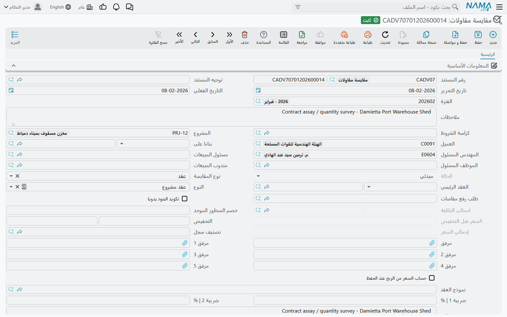

# مقايسة المقاولات

المستند الذي تتحدث عنه هذه الصفحة هو **المقايسة**: قائمة كميات مسعّرة، أي جدول أعمال محصورة بكمياتها وأسعار وحداتها — وهو المصطلح الإنشائي العربي المعروف. أما اسمه الإنجليزي في نما فهو *Contracting Assay*، وهو نقلٌ حرفي رديء لا ترجمة: لا شيء هنا يُختبر ولا تحليل مختبري. فإن قرأت الشاشات الإنجليزية فاقرأ كلمة *assay* بمعنى «قائمة كميات مسعّرة» يستقم المعنى فوراً.

تجده في **المقاولات > مقاولة مشروع > مقايسة مقاولات**، ويحتاج ترخيص `contracting`.

ومثالنا يواصل قصة مشروع **Tower A** لعميلنا **Al-Fanar Development**: قائمة كميات بإجمالي **230,000** موزعة على أربعة بنود عمل، تُحمل من مستندات العطاء حتى التوقيع في عقد `PC-2026-001`.

## لماذا تُستخدم، وبماذا تختلف عن عرض السعر

المقايسة و[عرض سعر المقاولات](/ar/modules/contracting/project-contracting/contracting-offers.md) توأمان. يقومان على الأساس نفسه، فحقول الترويسة واحدة وجدول البنود واحد، وكلاهما يتحول إلى عقد بالأزرار نفسها. وثلاثة أمور تفرّق بينهما:

| | المقايسة | عرض سعر المقاولات |
|---|---|---|
| لمن هو | داخلي — قائمة الكميات المسعّرة التي تعمل الشركة عليها | للعميل — العرض الذي تقدّمه |
| بناء التكلفة | لا جداول تحليل تكلفة | أربعة جداول: خامات، عمالة، مقاولو باطن، مصروفات |
| خطة الأقساط | لا توجد | نموذج دفع وجدول دفعات |
| المحاسبة | **يمكن أن يُثبت قيداً** إذا حمل توجيه المستند حسابات | لا يُثبت شيئاً أبداً |

وفي الواقع العملي تستخدمهما المنظمات بإحدى طريقتين: إما أن تبني إدارة التسعير المقايسة مباشرة من [كراسة الشروط](/ar/modules/contracting/setup/contracting-term-sheets.md) الخاصة بالعطاء فتصبح المقايسة سجل ما قُدّم، ويُنتج منها عرض السعر للعميل؛ أو أن يُسعَّر عرض السعر أولاً ثم يُنتج زر **تحويل لمقايسة** المقايسة بعده لتكون السجل الذي يمضي إلى العقد. والطريقتان مدعومتان ولا تفضّل الوحدة إحداهما.

## ملؤها من كراسة الشروط

الحقل الذي يقوم بأكثر العمل هو **كراسة الشروط**. اختياره ينسخ مشروع الكراسة وعميلها إلى الترويسة، ثم ينسخ **كل** سطور البنود و**كل** سطور الشروط من الكراسة إلى هذا المستند. لا شيء يُترك ولا شيء يُفلتر — تحصل على قائمة الكميات كاملة ثم تحذف منها ما لا يلزم.

في Tower A، وكراسة العطاء بين يديك، يصل جدول البنود هكذا:

| الكود | البند القياسي | النوع | الوحدة | الكمية | سعر الوحدة | إجمالي السعر |
|---|---|---|---|---|---|---|
| `1` | أعمال الحفر | رئيسي | | | | **50,000** |
| `1.01` | حفر | فرعي | م³ | 1,000 | 50.00 | 50,000 |
| `2` | الهيكل الإنشائي | رئيسي | | | | **54,000** |
| `2.01` | خرسانة مسلحة | فرعي | م³ | 60 | 900.00 | 54,000 |
| `3` | مباني وتشطيبات | رئيسي | | | | **126,000** |
| `3.01` | مباني بلوك | فرعي | م² | 2,000 | 46.00 | 92,000 |
| `3.02` | بياض | فرعي | م² | 1,000 | 34.00 | 34,000 |

وإجمالي الترويسة **230,000**. والسطور الرئيسية لا تحمل أسعاراً خاصة بها — يصفّرها النظام ويعيد جمعها من أبنائها عند كل حفظ، فيقرأ السطر `1` رقم 50,000 لأن السطر `1.01` يقرؤه، ويقرأ السطر `3` رقم 126,000 لأن ابنيه يبلغان ذلك مجتمعين، وتقرأ مجموعة *الإجماليات* 230,000 قبل الضريبة و264,500 بعدها بضريبة قيمة مضافة 15%.

وحقل **بناءا على** هو الطريق البديل للدخول: وجّهه إلى كراسة شروط أو مقايسة أخرى أو عرض سعر مقاولات، فيحدث النسخ نفسه من هناك. استخدم «بناءا على» عند إعادة تسعير شيء قائم، و«كراسة الشروط» عند تسعير عطاء للمرة الأولى.

وقائمة اختيار كراسة الشروط مفلترة بعميل المستند ومشروعه، فبعد تحديد العميل لا ترى إلا كراساته.

## جدول البنود

الأعمدة هي التي تعرفها من بقية الوحدة: كود البند، تصنيفات البند، **البند القياسي** الذي يوفّر الوحدة والسعر الافتراضي وحسابات الإثبات لاحقاً، و*يعامل كبند فرعي* لبند رئيسي تريد تسعيره كسطر عادي هنا، ومنطقة العمل كبعد تحليلي، والأبعاد الفيزيائية والكمية المشتقة منها، وتكلفة الوحدة وإجمالي التكلفة، وسعر الوحدة والخصم والضرائب والربح وإجمالي السعر.

وعمودان هنا لا يوجدان في جدول العقد:

- **المستوى اليدوي** يتيح فرض عمق السطر في الشجرة بدلاً من تركه لموضعه في الجدول.
- **حالة البند** تعلّم السطر مقبولاً أو مرفوضاً أثناء التفاوض. وهذا مهم عند التحويل: عندما يُبنى عقد من هذا المستند **لا تنتقل السطور المرفوضة**. وهي الطريقة النظيفة لإبقاء ما حذفه العميل ظاهراً على سجل العطاء دون أن يلوّث العقد الموقّع.

وأكواد البنود تتصرف كما في كل مكان: **تحديث الأكواد** يعيد ترقيم الجدول كله، و**تحديث أكواد البنود الفارغة فقط** يملأ الفراغات بأمان، و*تكويد البنود يدويا* في الترويسة يوقف الترقيم التلقائي. وصفحة [البنود القياسية](/ar/modules/contracting/setup/contracting-standard-terms.md) تشرح نموذج الرئيسي/الفرعي وعُرف الأكواد المنقّطة بالتفصيل.

وجدول **الشروط** يحمل الشروط التجارية — سطر المحتجز 10% مثلاً. وهي على هذا المستند سجلٌ وناقل: لا شيء هنا يحسب منها، وقيم أعمدة الإضافة والاستقطاع فيها لا تُحدَّث من هذه الشاشة. وتظهر قيمتها عندما يصير المستند عقداً، فالتحويل ينسخها، وعلى العقد تصبح فعّالة. وجدول **المهام** كذلك قائمة توثيقية بمن يفعل ماذا.

## زرّان اسمهما يُضلّل

كلا الزرّين يؤدي عملاً نافعاً، وكلاهما مسمّى تسميةً تدفع القارئ للبحث عن سلوك آخر.

**تجميع التحليلات** — واسمه على الشاشة الإنجليزية *Collect Terms* — **لا يجمع بنوداً**. إنما يدفع التكاليف المحلَّلة من [كروت تحليل البنود](/ar/modules/contracting/setup/contracting-term-analysis-cards.md) إلى سطور البنود الموجودة في المستند بالفعل، فيملأ تكلفة وحدتها من التحليل. استخدمه بعد استقرار البنود حين تريد أن يعبّر جانب التكلفة عن كروت التحليل لا عمّا جاء من كراسة الشروط. والتسمية العربية هي الدقيقة.

**تحديث الأرباح من كراسة الشروط** ينسخ نسبة الربح وسعر الوحدة وإجمالي السعر من سطر كراسة الشروط المطابق، والمطابقة بكود البند. وهي الطريقة التي تحكم بها الشركة هامشها مركزياً: الكراسة هي بطاقة الأسعار المعتمدة، وهذا الزر يعيد فرضها على مستند كان أحدهم يحرّره.

::: tip لا يوجد زر «نسخ البنود» على العقد
يستحق هذا التصريح هنا لأنه السؤال الذي يثيره الزرّان أعلاه. تصل البنود إلى عقد المشروع بإحدى طريقتين: بـ**تحويل** مقايسة أو عرض سعر (أو بتوجيه حقل *المصدر* في العقد إلى أحدهما)، أو باختيار **نموذج عقد** على العقد، فاختياره هو ما يُشغّل النسخ. ولا يوجد أي إجراء ينسخ البنود إلى عقد قائم عند الطلب.
:::

## الحالة

لحقل **الحالة** قيمتان: *مبدئي* و*مؤكد*، وهو حقل نظامي لا يمكنك الكتابة فيه. والمستند الجديد يقرأ *مبدئي*، ويبقى عليه في التركيب العادي؛ ولا يتحرك إلا بما رتّبته منظمتك من إجراءات اعتماد حول المستند. ولا تتوقع أن تحرّكه الوحدة نفسها أثناء العمل.

## ماذا يُثبت

هذا هو المستند الوحيد السابق للعقد في سلسلة جانب المالك الذي يمكن أن يصل إلى الأستاذ، ويسهل أن يُغفل لأنه لا يفعل ذلك **إلا إذا هيّأته أنت لذلك**. فالحسابات تأتي من [توجيه المستند](/ar/modules/contracting/document-terms/contracting-terms-other.md)، وإن لم يُملأ منها شيء لم يُثبت المستند شيئاً على الإطلاق — وهكذا تُشغّله معظم التركيبات.

وعند تهيئة الحسابات فإن اعتماد المستند يرفع طلب أعمال محاسبياً يُعالَج في الخلفية، وينتج سطر قيد واحداً لكل بند مسعّر (فرعي):

| القيمة المأخوذة من السطر | تُثبت على |
|---|---|
| إجمالي السعر | حسابي المدين والدائن الأساسيين في التوجيه |
| قيمة الضريبة 1 | حسابي مدين ودائن الضريبة 1 |
| قيمة الضريبة 2 | حسابي مدين ودائن الضريبة 2 |

ولا يُثبت أي زوج إلا إذا ضُبط طرفاه معاً. والذمة على القيد تأتي من المستند: العميل والمشروع، والعقد الرئيسي حين يكون المستند ملحقاً.

::: info «مدين 2» و«دائن 2» هما الزوج الأساسي
في كل شاشة توجيه في المقاولات يُسمّى الحسابان الرئيسيان *مدين 2* و*دائن 2*. ولا يوجد «مدين 1» تبحث عنه — الترقيم تاريخي فقط. وهذان هما الحسابان اللذان تضبطهما.
:::

وإن كان المستند يُثبت ولم تر القيد فوراً فهذا متوقع: الأثر طلب أعمال يُعالَج في الخلفية. والطلبات الفاشلة تظهر في شاشة **طلبات الأعمال**، تفلترها بحالة المعالجة وتستخدم **المزيد ← إعادة المعالجة / إعادة الاعتماد**.

## حملها إلى التوقيع

أربعة أزرار تحوّل المستند إلى عقد:

- **تحويل لعقد** — يبني [عقد مشروع](/ar/modules/contracting/project-contracting/contracting-project-contract.md) جديداً غير محفوظ ويفتحه لتراجعه وتحفظه.
- **تحويل لعقد بالسطور المختارة فقط** — الأمر نفسه للسطور المعلَّمة وحدها، وهو ما تستخدمه إذا أُسند إليك جزء من نطاق العمل.
- **تحويل لعقد مقاول باطن** وتوأمه بالسطور المختارة — التحويل نفسه، لكن ينتج [عقد مقاول باطن](/ar/modules/contracting/contractor-contracting/contracting-contractor-contract.md).

والعقد المتولّد يحمل المشروع والعميل والمهندس المسئول والسعر قبل التخفيض والخصم ونوع العقد ومرجع العقد الرئيسي والملاحظات، وكل سطور البنود بكمياتها وأسعارها، وسطور الشروط. ويشير حقل **المصدر** فيه إلى هذا المستند، فيظل العقد الموقّع يسمّي العطاء الذي جاء منه.

في Tower A تُنتج ضغطة واحدة على **تحويل لعقد** عقد المشروع `PC-2026-001` بمبلغ **230,000** بالسطور المسعّرة الأربعة نفسها وشرط المحتجز 10% جاهزاً. ومن هذه النقطة تكمل القصة في [صفحة عقد المشروع](/ar/modules/contracting/project-contracting/contracting-project-contract.md).

## إلى أين تقرأ بعد ذلك

- [عرض سعر المقاولات](/ar/modules/contracting/project-contracting/contracting-offers.md) — التوأم الموجَّه إلى العميل، وموضع تحليل التكلفة.
- [كراسة الشروط](/ar/modules/contracting/setup/contracting-term-sheets.md) — قائمة الكميات القابلة لإعادة الاستخدام التي يُملأ منها المستند.
- [كارت تحليل البند](/ar/modules/contracting/setup/contracting-term-analysis-cards.md) — التحليل الذي يقرؤه زر *تجميع التحليلات*.
- [عقد المشروع](/ar/modules/contracting/project-contracting/contracting-project-contract.md) — ما ينتجه التحويل.
- [توجيه مستندات المقاولات الأخرى](/ar/modules/contracting/document-terms/contracting-terms-other.md) — حيث تُضبط حسابات هذا المستند.
