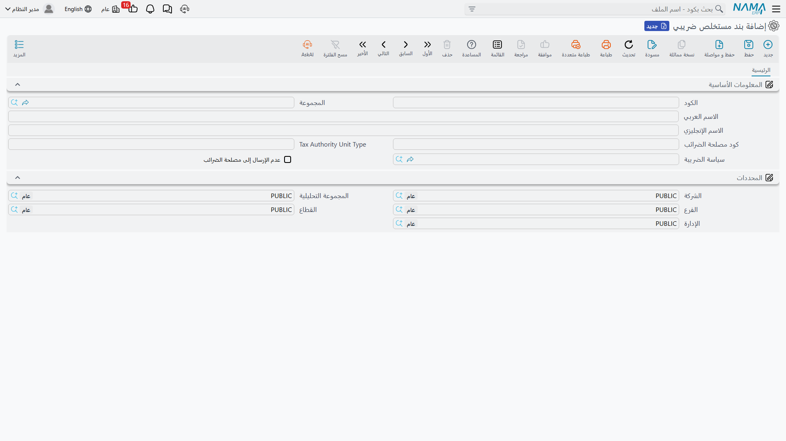

# الضرائب على المستخلصات

مصلحة الضرائب لا تقبل جدول كميات. فهي تريد قائمة صغيرة ثابتة من أصناف أو خدمات لها أكواد رسمية وكميات وأسعار — و[مستخلص](/ar/modules/contracting/project-contracting/contracting-project-extracts.md) شركة المقاولات نقيض ذلك: أربعون سطراً حرّ النص تصف حفراً في ثلاث مناطق، ومباني بسمكين، ومبلغاً مقطوعاً للأعمال المؤقتة.

وتجسر الوحدة هذه الهوّة بطبقة ربط: تبقى بنود جدول الكميات بالتفصيل الذي يحتاجه مهندسوك، ويشير كل بند منها إلى **بند مستخلص ضريبي** — وهو الصنف الموجّه لمصلحة الضرائب. فعند حفظ المستخلص تُجمَّع سطور المحاسبة ببند المستخلص الضريبي في جدول ثانٍ أقصر بكثير، و**هذا** الجدول هو ما يُرسَل.

## بند المستخلص الضريبي

بند المستخلص الضريبي ملف رئيسي صغير، ولا يوجد منه للشركة كلها عادةً إلا القليل: *أعمال إنشائية*، *أعمال استشارية*، *توريد خامات*.

| الحقل | لماذا هو |
|---|---|
| **الكود** | معرّفك الخاص |
| **المجموعة** | مجموعة رئيسية، ويمكنها أن توفّر كود الضريبة لعائلة كاملة مرة واحدة |
| **الاسم العربي** / **الاسم الإنجليزي** | الاسمان اللذان يظهران على الفاتورة المرسَلة |
| **كود مصلحة الضرائب** | الكود الرسمي الذي تنتظره المصلحة لهذا الصنف |
| حقل نوع الوحدة الذي يجاوره | وحدة القياس التي تنتظرها المصلحة بمفرداتها هي. وتسميته غير مترجمة على الشاشة، فاعرفه بموضعه |
| **سياسة الضريبة** | السياسة الضريبية المطبقة عند تسعير سطر التجميعة |
| **عدم الإرسال إلى مصلحة الضرائب** | كل ما رُبط بهذا البند يُستبعد كلياً من الفاتورة المرسَلة |

وتجده في المقاولات > الملفات > بند مستخلص ضريبي، على ترخيص `contracting`. وهو مشمول مع بقية الملفات الرئيسية الصغيرة في [صفحة الملفات المساعدة](/ar/modules/contracting/setup/contracting-lookups.md).

## كيف يجد سطر المستخلص بندَه الضريبي

يمشي البحث في أربع خطوات ويتوقف عند أول واحدة تجيب:

1. **عمود بند المستخلص الضريبي في السطر نفسه** في جدول تفاصيل المستخلص. وهذا هو التجاوز على مستوى السطر — مخرج الطوارئ للسطر الوحيد الذي لا يتبع القاعدة.
2. **البند القياسي للسطر.** فكل [بند قياسي](/ar/modules/contracting/setup/contracting-standard-terms.md) يمكن أن يسمي بند مستخلص ضريبي، وهنا تسكن عملية الربط عادةً: تربط الكتالوج مرة واحدة فيرثه كل عقد.
3. **سطر بند العقد**، الذي يمكن أن يحمل بند مستخلص ضريبي خاصاً به لعقد يُرسَل على غير طريقة بقية الأعمال.
4. **ولم يوجد شيء** — فتقرر الاستراتيجية أدناه ما يحدث.

اضبطه في المستوى الثاني وانسه. أما المستويان الأول والثالث فموجودان للاستثناءات.

## استراتيجية البند الضريبي المفقود — المفتاح الذي يشغّل الفاتورة الإلكترونية

في [توجيه](/ar/modules/contracting/document-terms/contracting-terms-extracts.md) المستخلص خيار واحد يحكم الآلية كلها: **عند عدم وجود بند ضريبي للسطر**. وله ثلاث قيم تجيب عن سؤال: "ما ينبغي أن يحدث لسطر محاسبة لا بند مستخلص ضريبي له؟"

| الضبط | ما يحدث للسطر غير المربوط |
|---|---|
| **خطأ** | يفشل الحفظ، مسمياً السطر وبندَه القياسي. فلا يُحاسب على شيء حتى يكتمل الربط — وهو الأصرم والأسلم |
| **الافتراضي من توجيه المستند** | يُجمَّع السطر تحت بند مستخلص ضريبي افتراضي مذكور في التوجيه نفسه. فيُرسَل كل شيء، وتقع الأعمال غير المربوطة في صنف جامع |
| **عدم الإرسال** | يُترك السطر غير المربوط بصمت خارج الفاتورة المرسَلة. وهو محاسَب عليه ومسجَّل في الدفاتر، لكنه غير مُرسَل فقط |

ومع *الافتراضي من توجيه المستند* لا يُحفظ التوجيه أصلاً من غير بند مستخلص ضريبي افتراضي، ويعيد المستخلص الفحص نفسه، فلا يمكن أن يوجد هذا التركيب نصف مضبوط.

::: warning ترك الاستراتيجية فارغة يوقف تجميعة الضريبة كلها
إن تُرك حقل **عند عدم وجود بند ضريبي للسطر** فارغاً في توجيه المستند فإن جدول التجميعة لا يُبنى إطلاقاً — لا للسطور غير المربوطة ولا للمربوطة. فيُحفظ المستخلص ويُسجَّل ويُطبع على أحسن وجه، وحمولة الفاتورة الإلكترونية فارغة. فهذا الحقل هو عملياً المفتاح الرئيسي للفاتورة الإلكترونية على المستخلصات، ولا بد أن يحمل قيمة في أي توجيه يعمل به. وإن أبلغ عميل أن مستخلصاته تصل مصلحة الضرائب بلا سطور فابحث هنا أولاً.
:::

## جدول التفاصيل الضريبية

جدول التجميعة يديره النظام بالكامل. فأنت لا تكتب فيه أبداً، وهو يُبنى من جديد في كل حفظ.

والقاعدة التي يتبعها بسيطة: تُجمَّع سطور المحاسبة ببند المستخلص الضريبي بترتيب أول ظهورها. وتُستبعَد سطور البنود الرئيسية (الأب)، ويُستبعَد كل ما كان بندُه الضريبي موسوماً بعدم الإرسال. وتصير كل مجموعة سطراً **واحداً** كميتُه 1 وسعر وحدته إجمالي قيمة المجموعة، مع تطبيق نسب ضريبة البيانات الأساسية. ثم يُعاد تسعير الجدول كله فتقوم مجموعة مبالغه على نفسها.

ولهذا يمكن أن تكون الفاتورة المرسَلة لشهادة بمليونين ثلاثة سطور: فالمصلحة تُعطى *أعمال إنشائية، 1، 2,000,000*، لا جدول الكميات.

وإلى جانب الجدول يحمل المستخلص إجراءات الفاتورة الإلكترونية العامة — التحقق من المستند عند المصلحة وفتحه على موقعها — لأنه لأغراض الإرسال يتصرف كأي فاتورة.

## من أين تأتي نسب الضريبة

هناك طبقتان مستقلتان، والخلط بينهما هو المصدر المعتاد للحيرة.

**ضريبة السطر نفسه** — نسبة وقيمة *ضريبة المبيعات* على كل سطر تفاصيل، وضريبة ثانية إلى جانبها. وهاتان مشتقتان من سياسة الضريبة في البند القياسي للسطر، وهما ما ينتج إجماليات المستخلص: صافي الأعمال قبل الضريبة، والضريبة، وصافي الأعمال بعد الضريبة. وهما كذلك ما يُسجَّل في الدفاتر: تُسجَّل الضريبة على زوج حسابات خاص بها في التوجيه، مخرَجةً من حساب الإيراد فيستقر الإيراد على رقم ما قبل الضريبة.

**نسب البيانات الأساسية** — *ضريبة 1 | %* و*ضريبة 2 | %* في رأس المستخلص. وهاتان تُحمَلان على سطور التجميعة حين يُبنى الجدول المرسَل.

وزر **احتساب الضرائب** فوق جدول التفاصيل يعيد قراءة نسب الضريبة من كل بند قياسي مستخدم في السطور ويعيد حساب مجموعة المبالغ. استخدمه إذا تغيّرت سياسة ضريبية في منتصف المشروع واحتاجت المستخلصات المسودة أن تلحق بها.

والشروط قد تحمل ضريبة كذلك: فالمحتجزات والمكافأة واسترداد الدفعة المقدمة — كل سطر شرط له نسبة ضريبة وقيمة ضريبة وقيمة بعد الضريبة، وهذه الأخيرة هي التي تحرّك الصافي المستحق فعلاً. وخيار في التوجيه يضيف ضرائب الشروط تلك إلى قيد الضريبة الرئيسي في المستخلص بدل تركها على حسابات الشروط نفسها.

## مثال عملي

استكمالاً لـ[صفحة المستخلصات](/ar/modules/contracting/project-contracting/contracting-project-extracts.md): العقد **PC-2026-001** لـ*Al-Fanar Development* على مشروع *Tower A*، والضريبة 15%، والمستخلص **EXT-001** لشهر فبراير بثلاثة سطور محاسبة.

| البند | الوصف | الكمية | سعر الوحدة | السعر | ضريبة 15% | الصافي |
|---|---|---|---|---|---|---|
| `1.01` | حفر | 400 م³ | 50 | 20,000 | 3,000 | 23,000 |
| `2.01` | خرسانة مسلحة | 20 م³ | 900 | 18,000 | 2,700 | 20,700 |
| `3.01` | مباني بلوك | 500 م² | 46 | 23,000 | 3,450 | 26,450 |
| | | | | **61,000** | **9,150** | **70,150** |

والبنود القياسية الثلاثة — الحفر والخرسانة المسلحة والمباني — تشير إلى بند المستخلص الضريبي نفسه، *أعمال إنشائية*، وقد ضُبط كود مصلحته ونوع وحدته مرة واحدة. فتخرج التجميعة سطراً واحداً:

| بند المستخلص الضريبي | الكمية | سعر الوحدة | ضريبة 15% | الصافي |
|---|---|---|---|---|
| أعمال إنشائية | 1 | 61,000 | 9,150 | 70,150 |

وهذه هي الفاتورة المرسَلة كلها: ترى المصلحة خدمة واحدة بقيمة 61,000 وضريبة 9,150، وما زالت شهادة العميل تُظهر سطور جدول الكميات الثلاثة التي قِيسَت عليها.

ولنفترض الآن أن الشركة مطالبة بإرسال الحفر منفصلاً عن الأعمال الإنشائية. لن يتغير في المستخلص شيء: تنشئ بند مستخلص ضريبي ثانياً، *أعمال ترابية*، وتوجّه البند القياسي للحفر إليه. فتخرج تجميعة المستخلص التالي في سطرين لا سطر:

| بند المستخلص الضريبي | الكمية | سعر الوحدة | ضريبة 15% | الصافي |
|---|---|---|---|---|
| أعمال ترابية | 1 | 20,000 | 3,000 | 23,000 |
| أعمال إنشائية | 1 | 41,000 | 6,150 | 47,150 |

فالربط هو الشيء الوحيد الذي تغيّره أبداً، وهذا هو سبب وجود هذه الطبقة.

## إلى أين بعد ذلك

- [مستخلص المشروع](/ar/modules/contracting/project-contracting/contracting-project-extracts.md) — المستند الذي يتعلق به هذا كله.
- [البنود القياسية](/ar/modules/contracting/setup/contracting-standard-terms.md) — حيث يسكن الربط عادةً.
- [توجيه المستخلصات](/ar/modules/contracting/document-terms/contracting-terms-extracts.md) — خيار الاستراتيجية وأزواج حسابات الضريبة.
