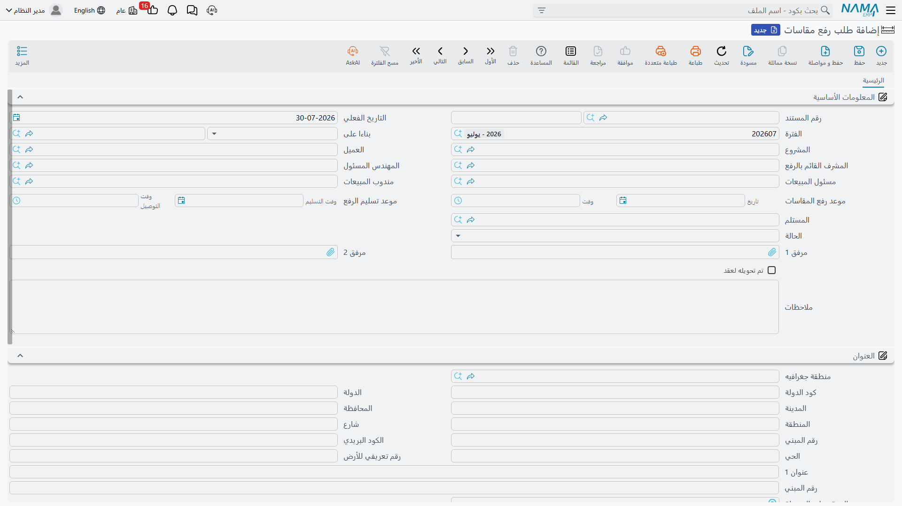
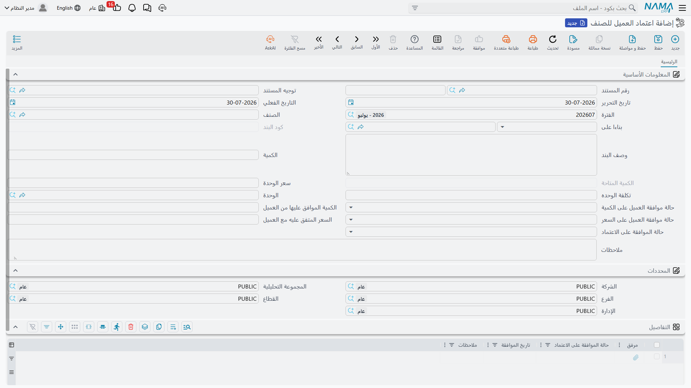

# طلبات الرفع والاعتمادات والتسليم

ثلاثة مستندات تقف على أطراف سلسلة المحاسبة: أحدها قبل أن يُسعَّر العقد أصلاً، وثانٍ يحكم ما يجوز شراؤه من خامات، وثالث يسجل يوم تسليم المفاتيح. ولا يسجل أي منها شيئاً في الدفاتر، والأهم: لا يعطّل أي منها [حصر الكميات](/ar/modules/contracting/project-contracting/contracting-project-execution.md) ولا [المستخلص](/ar/modules/contracting/project-contracting/contracting-project-extracts.md). فهي سجلات لاعتمادات تجري في الواقع، تُحفظ في النظام ليُعثر عليها ويُقرَّر عنها ويُشار إليها حين يسأل أحد: من وافق على ماذا؟

ولأن اثنين منها مصنَّفان في موضع غير متوقع من القائمة، فإن كل قسم يقول موضع النقر صراحةً.

## طلب رفع المقاسات — زيارة الموقع قبل السعر

لا يمكنك تسعير عقد تشطيبات من رسم. لا بد أن يذهب أحدهم إلى مقر العميل بشريط قياس فيثبت كم متراً مربعاً من الأرضيات هناك فعلاً، وكم فتحة، وكم متراً طولياً من الوزرات. و**طلب رفع المقاسات** هو المستند الذي يطلب هذه الزيارة ويسجل أنها حدثت.

| | |
|---|---|
| القائمة | المقاولات > **مقاولة مقاول باطن** > طلب رفع مقاسات |
| النوع | مستند — لا توجيه له، ولا شيء يُضبط في توجيه |
| الترخيص | `contracting` |

::: info موضعه في القائمة تحت مقاولة مقاول الباطن
طلب رفع المقاسات مستند موجَّه إلى العميل — وهو باب دورة المبيعات لشركات التشطيبات — لكنه مصنَّف تحت فرع مقاول الباطن في القائمة. فابحث عنه هناك.
:::

**ما فيه.** **المشروع** و**العميل**. وأربعة أشخاص: المشرف القائم بالرفع، والمهندس المسئول، ومسئول المبيعات، ومندوب المبيعات. وموعدان لكل منهما تاريخ ووقت — موعد رفع المقاسات، وموعد تسليم الرفع الموعود به. و**المستلم**، و**الحالة**، ومرفقان، وملاحظات. وتحت ذلك مجموعة عنوان كاملة فيها الموقع على الخريطة، لأن على أحدهم أن يجد المكان فعلاً.

والجدول في الأسفل عمودان فقط: مرفق وملاحظات. وهذا مقصود: **كشوف المقاسات تُرفَق كملفات لا تُكتَب كبيانات.** فيعود المشرف بصور لرسم معلَّم عليه ومخطط على ورق مربعات، فتُرفَق سطراً لكل واحد.

و**الحالة** تعرض *مبدئي* و*قيد التنفيذ* و*تم الرفع* و*مؤكد* و*إعادة رفع*، وبجانبها وسم *تم تحويله لعقد*. وكلاهما يُحدَّث بيدك — فلا شيء في الوحدة يقدّم الحالة أو يضع الوسم عنك. فاعتبرهما حقلَي المتابعة الذين يحدّثهما منسّق العمل، واستخدم قائمة عرض عليها [فلتر سريع](/ar/platform/list-views/quick-filters.md) على الحالة كقائمة أعمال اليوم.

**ما يعطّله.** شيء واحد فقط: متى بُنيت [مقايسة مقاولات](/ar/modules/contracting/project-contracting/contracting-assays.md) على الطلب لم يمكن إعادة حفظ الطلب. وهذا كل ما يفرضه.

**وإلى أين يؤدي.** طلب رفع المقاسات ← المقايسة (الرفع المسعَّر) ← [عقد المشروع](/ar/modules/contracting/project-contracting/contracting-project-contract.md). فهو *قبل* العقد لا قبل الحصر، ولا دور له في المحاسبة. ومن يتوقع وجوده في مكان من سلسلة الشهادات فهو يبحث في الموضع الخطأ.

## اعتماد العميل للصنف — الموافقة على الخامة قبل شرائها

في عمل مواصفات لا يشتري المقاول بلاطاً وحسب، بل يقدّم بلاطاً بعينه — هذا المصنع وهذا الموديل وهذا السعر — إلى العميل أو الاستشاري، فيوافق أو يرفض أو يطلب غيره، ثم — وحينئذ فقط — يجوز شراؤه وتركيبه. و**اعتماد العميل للصنف** هو هذه الرحلة الذاهبة العائدة، والكمية الموافق عليها تصير سقفاً لما يجوز طلبه من الصنف بعد ذلك.

| | |
|---|---|
| القائمة | المقاولات > مقاولة مشروع > اعتماد العميل للصنف |
| النوع | مستند، له توجيه |
| الترخيص | `contracting` |

### الموازنة التنفيذية وحدها هي التي تولّدها

هذه هي الحقيقة الجديرة بالإحكام. فالاعتمادات لا تُنشأ باليد في الاستخدام المعتاد، بل **تُولَّد من [الموازنة التنفيذية](/ar/modules/contracting/budgets/contracting-executive-budget.md)** عند اعتمادها، ومنها وحدها. أما [الموازنة التقديرية](/ar/modules/contracting/budgets/contracting-estimated-budget.md) فلا تولّد شيئاً، وإن كان طلب شراء خامات الموازنة يقبل أي منهما مصدراً له.

وللتوليد ثلاثة شروط:

1. **خيار في إعدادات الوحدة يجب أن يكون مفعّلاً** — وهو الخيار الذي ينشئ اعتمادات لسطور الموازنة التنفيذية، في [إعدادات المقاولات](/ar/modules/contracting/contracting-configuration.md). فإن كان مغلقاً لم يُولَّد شيء إطلاقاً.
2. **سطور بنود الموازنة التي تسمي صنفاً وحدها** هي التي تنتج اعتماداً. فالسطر الذي يقول "مباني" كحزمة عمالة وخامات بلا صنف بعينه يُتجاوَز — إذ لا شيء فيه ليُعتمَد.
3. **دفتر الاعتمادات المولَّدة وتوجيهها** يأتيان من ضبطين آخرين في إعدادات الوحدة، فلا بد من ملئهما قبل اعتماد أول موازنة.

والمنسوخ إلى الاعتماد هو الكمية والوحدة والوصف وسعر الوحدة وتكلفة الوحدة وكود البند، ويُربَط الاعتماد المولَّد رجوعاً بسطر الموازنة. وإعادة اعتماد الموازنة تحدّثها، ويُحذَف الاعتماد الذي لم يعد يطابق أي سطر — إلا إذا وُسِمت الموازنة بعدم تعديل الاعتمادات المحفوظة فتُجمَّد المجموعة. وحذف الموازنة يحذف اعتماداتها.

### الموافقتان، والسجل

تحمل البيانات الأساسية **قرارَي موافقة مستقلين**، لكل منهما حالته: *مقبول* أو *مرفوض* أو *مطلوب تعديل*:

- **على الكمية** — وبجانبها *الكمية الموافق عليها*؛
- **على السعر** — وبجانبه *السعر المتفق عليه*.

وسلوكهما واحد: توافق فيُنقل الرقم الموافق عليه من الرقم المقدَّم؛ وترفض أو تترك الحالة فارغة فيُصفَّر؛ وتطلب تعديلاً فيلزمك كتابة الرقم الذي تقبله. وفصل الاثنين مهم لأن الاستشاريين يوافقون على المنتج ويجادلون في سعره روتينياً، أو العكس.

وجدول **التفاصيل** أسفل ذلك هو سجل الرحلة — سطر لكل تقديم ورد، لكل منه حالة موافقته وتاريخ موافقته ومرفقه وملاحظته. والحالة العامة في البيانات الأساسية تُؤخذ من آخر سطر في السجل، فالسجل ليس زينة: بل هو ما يقرر هل يُعتبر الاعتماد موافَقاً عليه. وتتبع ذلك قاعدة واحدة: **متى حمل سطر الحالة الخاتمة لم يمكن إضافة سطر بعده.** فالاعتماد انتهى.

ورموز الحروف المستخدمة لتلك الحالة العامة هي رموز اعتمادات الاستشاريين المعروفة في الصناعة، وهي غير مترجمة على الشاشة، فاتفق مع استشاريك أيها يعني "معتمد" وسجّل الاتفاق خارج النظام.

### ما يعطّله الاعتماد فعلاً

الاعتماد يقيّد **الشراء** لا المحاسبة. فلا الحصر ولا المستخلص يقرأه.

والذي يقرأه هو [طلب شراء خامات الموازنة التنفيذية](/ar/modules/contracting/budgets/contracting-budget-item-requests.md)، حيث تصير الأرقام الموافق عليها سقوفاً حقيقية:

- **سقف السعر** — لا يتجاوز سعر وحدة السطر ما اعتمده الاعتماد، إلا إذا كان في توجيه الطلب خيار *السماح بتجاوز السعر الموافق عليه*؛
- **سقف الكمية** — لا يتجاوز إجمالي الكمية المطلوبة من الصنف في *كل* الطلبات المحرَّرة على الموازنة نفسها الكمية الموافق عليها في الاعتماد، إلا إذا كان في التوجيه خيار *السماح بتجاوز الكمية الموافق عليها*؛
- **ولا بد أن يكون الاعتماد موافَقاً عليه أصلاً** — فالطلب على اعتماد غير موافَق عليه مرفوض.

والكمية المتاحة في الاعتماد يديرها النظام مع استهلاك الطلبات لها: الكمية الموافق عليها ناقصاً كل ما طُلب.

::: warning سطر الطلب بلا اعتماد غير مقيّد
يُتجاوَز السقفان كلياً في أي سطر طلب لم يُختَر له اعتماد. فإن كان الغرض من العملية منع الشراء غير المعتمد وجب أن يكون الانتظام هو أن يسمي كل سطر طلب اعتماده — فالنظام لن يُلزمك بذلك.
:::

كما لا يمكن تعديل الاعتماد إلى ما دون ما طُلب عليه فعلاً، وهذا يمنع تحريك السقف من تحت طلب سبق تحريره.

## خطاب تسليم المشروع — التسليم

**خطاب تسليم المشروع** هو السجل الرسمي بأن المشروع المنتهي سُلِّم إلى العميل أو الاستشاري في تاريخ بعينه. وبه يُغلق ملف المشروع.

| | |
|---|---|
| القائمة | المقاولات > **مقاولة مقاول باطن** > خطاب تسليم مشروع |
| النوع | مستند، له توجيه |
| الترخيص | `contracting` |

وكطلب رفع المقاسات، هو مصنَّف تحت فرع مقاول الباطن في القائمة وإن كان مستنداً على مستوى المشروع.

وشاشته قصيرة: رقم المستند وتوجيهه، وتاريخا التحرير والتاريخ الفعلي، و**المشروع**، و**الإستشاري** الذي تسلّم، والمهندس المسئول، وتاريخ التسليم، وملاحظات، ومجموعة المحددات. ولا جدول فيه ولا شيء يُحسَب.

**ما يفعله.** اعتماد الخطاب يكتبه على المشروع كخطاب تسليم ذلك المشروع، وإلغاؤه يمحو الإشارة. وهذا كل أثره: فهو جواب سؤال "هل سُلِّم هذا المشروع، وبأي ورقة؟".

**وما لا يفعله**، وهذا هو النصف المهم:

- **لا يسجل شيئاً** — لا قيداً ولا طلب أعمال؛
- **ولا يغلق العقد.** فإنهاء العقد يفعله [مستخلص من نوع ختامي](/ar/modules/contracting/project-contracting/contracting-project-extracts.md) وهو وحده. فالخطاب يسجل التسليم المادي، والمستخلص الختامي يغلق المال. وقد يُسلَّم المشروع فعلاً وشهادةٌ لم تُصدر بعد، وقد يُغلق العقد مالياً على الورق قبل أن يُسلَّم الموقع رسمياً؛
- **ولا يتحقق من شيء تقريباً**، ولا حتى من ذكر مشروع. فالخطاب المحفوظ بلا مشروع يُعتمَد بنجاح ولا يسجل شيئاً، فاجعل ملء المشروع جزءاً من الإجراء لا معتمداً على إلزام النظام.

## إلى أين بعد ذلك

- [مقايسة المقاولات](/ar/modules/contracting/project-contracting/contracting-assays.md) — إلى أين يمضي طلب رفع المقاسات.
- [الموازنة التنفيذية](/ar/modules/contracting/budgets/contracting-executive-budget.md) — المستند الوحيد الذي يولّد الاعتمادات.
- [طلبات شراء خامات الموازنة](/ar/modules/contracting/budgets/contracting-budget-item-requests.md) — المستند الذي تعمل عليه سقوف الاعتماد.
- [مستخلص المشروع](/ar/modules/contracting/project-contracting/contracting-project-extracts.md) — ومنه ما يغلقه المستخلص الختامي.
