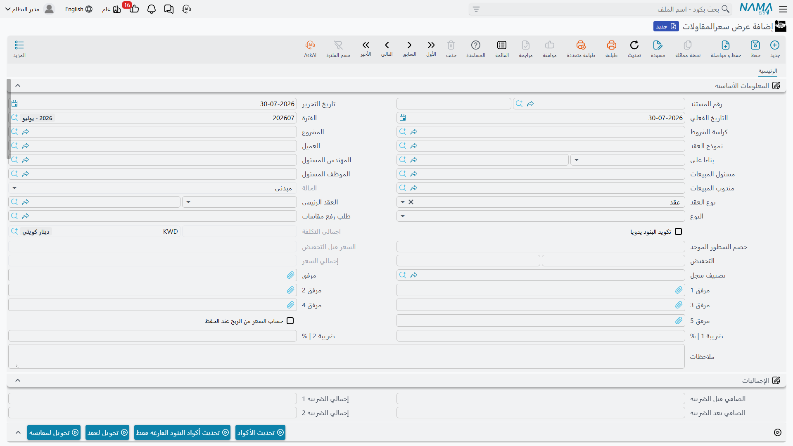

# عرض سعر المقاولات

كل عقد في هذه الوحدة يبدأ رقماً كان على أحدهم أن يبرّره. وعرض سعر المقاولات هو الموضع الذي يُبنى فيه هذا الرقم: المستند الذي يُفكَّك فيه كل بند عمل إلى ما سيُنفّذه من خامات وعمالة ومقاولي باطن ومصروفات، فتُجمع الأوعية الأربعة، وتُضاف نسبة الربح، فيخرج السعر الذي تضعه أمام العميل.

وهذا يجعل عرض السعر الموضع الوحيد في سلسلة جانب المالك الذي **تقود فيه التكلفة السعر**. أما بعده — المقايسة والعقد والمستخلص — فالسعر يُنقل فقط. اضبط عرض السعر ضبطاً صحيحاً وستكون بقية السلسلة عملية حسابية.

تجده في **المقاولات > مقاولة مشروع > عرض سعرالمقاولات**، ويحتاج ترخيص `contracting`. وهو مستند، فله دفتر وكود وتاريخ تحرير وتاريخ فعلي. وليست له **أي خيارات توجيه خاصة بالمقاولات**: حقل *توجيه المستند* موجود لأن كل مستند يحمله، لكن لا شيء يُضبط لهذا النوع ولا شيء يُثبته. عرض السعر لا ينشئ قيداً ولا يحرّك مخزناً.

مثالنا هو مشروع **Tower A** لعميلنا **Al-Fanar Development**: أربعة بنود عمل، تكلفة محلَّلة **200,000**، هامش ربح **15%** إجمالاً، فيكون العطاء **230,000** — وهو العطاء الذي يصير عقد `PC-2026-001`.

## من أين يأتي مضمون العرض

قلّ أن يُكتب عرض سعر من شاشة فارغة. أربعة حقول في أعلى مجموعة البيانات الأساسية تحدد مقدار ما يصل جاهزاً:

| الحقل | ما يجذبه |
|---|---|
| **كراسة الشروط** (Term Sheet) | قائمة كميات العطاء — بنودها كلها بكمياتها وأسعارها |
| **بناءا على** (From Document) | عرض سعر آخر أو مقايسة أو كراسة شروط، حين تعيد تسعير شيء قائم |
| **نموذج العقد** (Contract Template) | هيكل عقد محفوظ: أكواد البنود والبنود القياسية والشروط |
| **طلب رفع مقاسات** (Measurements Request) | زيارة الموقع التي سُعّر العرض على مقاساتها |

وأسفلها الأطراف والأشخاص — المشروع، العميل، المهندس المسئول، مسئول المبيعات، الموظف المسئول، مندوب المبيعات — وحقل **النوع** الذي يحدد هل يصبح هذا العرض عند فوزه عقد مشروع أم عقد مقاول باطن.

ولحقل **نوع العقد** في الترويسة ثلاث قيم: *عقد* للحالة العادية، و*ملحق* عندما يكون العمل إضافة إلى عقد قائم (وهنا يصبح مرجع العقد الرئيسي إجبارياً)، و*تعديل لعقد* عندما يكون العرض معدّلاً لبنود العقد الأعلى لا مستنداً يجاوره. والحقل المسمّى في الشاشة الإنجليزية *Addendum contract* هو ذاك العقد الرئيسي الأعلى، والتسمية العربية `العقد الرئيسي` أوضح.

## جدول البنود — ما الذي تبيعه

جدول البنود هو قائمة الكميات: سطر لكل بند عمل، يشير كل منها إلى **بند قياسي** من [كتالوج البنود القياسية](/ar/modules/contracting/setup/contracting-standard-terms.md)، وهو ما يوفّر الوحدة والسعر الافتراضي والحسابات التي سيُثبت عليها المستخلص لاحقاً. وتتشكل السطور في هيئة شجرة من خلال **أكواد البنود** المنقّطة، ولا يحمل المال إلا السطور الفرعية (Leaf)؛ أما السطور الرئيسية (Parent) فهي مجاميع بحتة، يصفّرها النظام ثم يعيد جمعها من أبنائها عند كل حفظ.

في Tower A:

| الكود | البند القياسي | النوع | الوحدة | الكمية |
|---|---|---|---|---|
| `1` | أعمال الحفر | رئيسي | | |
| `1.01` | حفر | فرعي | م³ | 1,000 |
| `2` | الهيكل الإنشائي | رئيسي | | |
| `2.01` | خرسانة مسلحة | فرعي | م³ | 60 |
| `3` | مباني وتشطيبات | رئيسي | | |
| `3.01` | مباني بلوك | فرعي | م² | 2,000 |
| `3.02` | بياض | فرعي | م² | 1,000 |

ولستَ مضطراً لكتابة الأكواد: زر **تحديث الأكواد** يعيد ترقيم الجدول كله من الصفر بالمرور عليه من أعلى إلى أسفل، وزر **تحديث أكواد البنود الفارغة فقط** هو النسخة الآمنة التي تملأ الفراغات وتترك الأكواد القائمة كما هي — أو علّم **تكويد البنود يدويا** في الترويسة واكتبها بنفسك.

والكميات أيضاً لا يلزم كتابتها. املأ **العدد** والطول والعرض والارتفاع فتُشتق الكمية: `العدد × الطول × العرض × الارتفاع`، مطروحاً منها ما تحسمه في **الكمية المخصومة** مقابل الفتحات. وأيّ الأبعاد الثلاثة يشارك فعلاً خاصيةٌ في وحدة قياس المقاولات، فحائط بالمتر المربع يتجاهل الارتفاع وبلاطة بالمتر المكعب تستخدم الأبعاد الثلاثة. وأعمدة الأبعاد لا تظهر على الشاشة إلا إذا طلبتها إعدادات الوحدة.

وعمود **منطقة العمل** بُعد تحليلي: يُنقل من العرض إلى العقد إلى المستخلص، ويفيد في التحليل، لكن لا شيء في الوحدة يفلتر أو يسعّر أو يجمع على أساسه.

## بناء التكلفة — الأوعية الأربعة

أسفل جدول البنود أربعة جداول هي قلب هذا المستند: **مواد خام** و**عمالة** و**مقاول باطن** و**مصروفات أخري**. كل سطر يسمّي عنصر تكلفة من [كتالوج بنود تكلفة المقاولات](/ar/modules/contracting/setup/contracting-lookups.md)، والكمية المستهلكة منه، وتكلفة وحدته. والجداول الأربعة مجتمعةً هي إجمالي تكلفة العرض.

في Tower A، من هنا يأتي رقم 200,000:

**البند `1.01` حفر — 1,000 م³، تكلفة 40,000**

| الوعاء | السطر | الكمية | تكلفة الوحدة | الإجمالي |
|---|---|---|---|---|
| عمالة | ونش وطقم حفر | 200 يوم عمل | 120 | 24,000 |
| مقاول باطن | معدات ونقل مخلفات | 1,000 م³ | 12 | 12,000 |
| مصروفات أخري | إيجار سنَد جوانب | | | 4,000 |

**البند `2.01` خرسانة مسلحة — 60 م³، تكلفة 48,000**

| الوعاء | السطر | الكمية | تكلفة الوحدة | الإجمالي |
|---|---|---|---|---|
| مواد خام | خرسانة جاهزة | 60 م³ | 550 | 33,000 |
| مواد خام | حديد تسليح | 4.8 طن | 1,500 | 7,200 |
| عمالة | حدّادون وصبّابون | 40 يوم عمل | 130 | 5,200 |
| مصروفات أخري | إيجار شدّة خشبية | | | 2,600 |

**البند `3.01` مباني بلوك — 2,000 م²، تكلفة 80,000**

| الوعاء | السطر | الكمية | تكلفة الوحدة | الإجمالي |
|---|---|---|---|---|
| مقاول باطن | عقد مباني بلوك | 2,000 م² | 40 | 80,000 |

**البند `3.02` بياض — 1,000 م²، تكلفة 32,000**

| الوعاء | السطر | الكمية | تكلفة الوحدة | الإجمالي |
|---|---|---|---|---|
| مواد خام | أسمنت ورمل | 1,000 م² | 9 | 9,000 |
| عمالة | مبيّضون | 160 يوم عمل | 130 | 20,800 |
| مصروفات أخري | مستهلكات | | | 2,200 |

40,000 + 48,000 + 80,000 + 32,000 = **200,000**، وهو ما يظهره حقل *اجمالى التكلفة* في الترويسة. والمباني هي البند الوحيد بسطر واحد، لأنها تُعطى كاملةً لمقاول باطن بسعر 40.00 للمتر المربع — وهو عقد الباطن 80,000 الذي تتابعه صفحات جانب التكلفة.

وهناك ما يخفّف عن هذه الجداول ثقلها الظاهر. **الإنتاجية** و**نسبة الهالك** في كل سطر تتيحان إدخال معدّل بدلاً من كمية مطلقة: الإنتاجية هي ما تستهلكه الوحدة المتعاقد عليها من العنصر، ونسبة الهالك تضخّمها مقابل الفاقد، فتخرج كمية السطر بالمعادلة `الكمية المتعاقد عليها × الإنتاجية × (1 + نسبة الهالك)`. قل إن يوم المبيّض يغطي 6.25 م² من البياض، فيحدد سطر العمالة كميته بنفسه من الـ 1,000 م² أعلاه عند 160 يوم عمل؛ وضع 4% هالكاً على سطر الأسمنت والرمل فيتضخّم هو الآخر تبعاً لذلك. وزرّان يملآن الجداول عنك: **تجميع بنود التكلفه من البنود القياسية** يقرأ وصفة التكلفة القياسية المخزّنة على كل بند قياسي، و**تجميع تكلفة البنود الفرعية** يرفع تكاليف العناصر الناتجة إلى تكلفة وحدة بند العمل.

وإن كانت منظمتك تحتفظ بـ[كروت تحليل البنود](/ar/modules/contracting/setup/contracting-term-analysis-cards.md) فنموذج التكلفة نفسه موجود هناك كملف رئيسي قابل لإعادة الاستخدام، يُحلَّل مرة واحدة لكل بند لا مرة لكل عرض سعر.

## من التكلفة إلى السعر — في أي اتجاه؟

هذا هو ما يجب فهمه عن عرض السعر، فالمستند يعمل في **الاتجاهين**، ومربع اختيار واحد هو الذي يحدد الاتجاه.

::: info حساب السعر من الربح عند الحفظ
علّم **حساب السعر من الربح عند الحفظ** فتكتب أنت نسبة الربح ويحسب النظام السعر:

`الربح = إجمالي التكلفة × نسبة الربح ÷ 100` · `إجمالي السعر = إجمالي التكلفة + الربح` · `سعر الوحدة = إجمالي السعر ÷ الكمية`

اتركه فارغاً — وهو الوضع الافتراضي — فتكتب أنت السعر ويحسب النظام الربح:

`الربح = إجمالي السعر − إجمالي التكلفة` · `نسبة الربح = الربح ÷ إجمالي التكلفة × 100`
:::

في Tower A نعلّم المربع ونكتب *نسبة هامش الربح* الخاصة بكل سطر — فأعمال الحفر تحمل أعلى هامش، والمباني المسنَدة للباطن تحمل الهامش المعتاد، والبياض مسعّر بحدّة لكسب العطاء:

| الكود | إجمالي التكلفة | نسبة الربح | الربح | إجمالي السعر | سعر الوحدة |
|---|---|---|---|---|---|
| `1.01` حفر | 40,000 | 25 | 10,000 | 50,000 | 50.00 |
| `2.01` خرسانة مسلحة | 48,000 | 12.5 | 6,000 | 54,000 | 900.00 |
| `3.01` مباني بلوك | 80,000 | 15 | 12,000 | 92,000 | 46.00 |
| `3.02` بياض | 32,000 | 6.25 | 2,000 | 34,000 | 34.00 |
| **الترويسة** | **200,000** | **15** | **30,000** | **230,000** | |

والهامش الذي يهم الإدارة التجارية هو هامش الترويسة: 30,000 ربحاً على 200,000 تكلفة، أي 15% إجمالاً.

فيقرأ حقل *السعر قبل التخفيض* وحقل إجمالي السعر في الترويسة 230,000 معاً، وتصبح أعمدة الربح على كل سطر أرقاماً مشتقة لا شيئاً كتبه أحد.

وثلاثة حقول في الترويسة تعدّل هذه النتيجة. **الخصم | النسبة / التخفيض** يحسم نسبة أو قيمة من العرض كله. و**خصم السطور الموحد** يدفع نسبة خصم واحدة إلى كل سطر فرعي دفعة واحدة، وهي الطريقة المعتادة لمنح العميل «خصم 5% على كل شيء». و**ضريبة 1 %** و**ضريبة 2 %** تُدفعان إلى كل سطر عند الحفظ فتملآن مجموعة *الإجماليات*: الصافي قبل الضريبة، إجمالي الضريبة 1، إجمالي الضريبة 2، الصافي بعد الضريبة. وبضريبة قيمة مضافة 15% على Tower A يظهر العرض 230,000 قبل الضريبة و264,500 بعدها.

وحيث تنشر منظمتك بطاقات أسعار، فإن [قائمة أسعار المقاولات](/ar/modules/contracting/setup/contracting-price-lists.md) هي التي توفّر سعر وحدة البند أصلاً، محسوماً بالتاريخ والعميل والعملة — فيبدأ العرض من السعر المعتمد لا من ذاكرة المسعّر.

## بقية الشاشة

جدول **الشروط** يتيح تسجيل الشروط التجارية — المحتجز، استرداد الدفعة المقدمة، الغرامات — التي ستحكم السداد. وهي على عرض السعر توثيقٌ وناقل: لا شيء في هذا المستند يحسب منها. وأهميتها أن التحويل إلى عقد ينسخها، وعلى العقد تصبح فعّالة. ولذلك يحمل عرض Tower A سطر شرط واحداً، *محتجز 10% مع كل مستخلص*، حتى يرثه العقد بلا إعادة إدخال.

وجدول **المهام** هو قائمة الالتزامات — من يوفّر السقالات، ومن يستخرج تصريح الحي — مقسّمة بين مهام شركتك ومهام العميل. وهو توثيقي، ولا شيء يفرضه.

ومجموعة **الدفعات** تحمل خطة الأقساط، إما بالكتابة اليدوية أو بالتوليد: اختر **نموذج الدفع** فيوزّع النظام المبلغ على عدد من الأقساط مراعياً فترة السماح وفترة السداد ويوم الأسبوع المفضّل وقاعدة التقريب.

::: info إجمالي الأقساط يُقاس بالتكلفة لا بالسعر
إن ملأت نموذج الدفع فإن العرض يتحقق من أن سطور الأقساط تساوي **إجمالي التكلفة** — 200,000 في Tower A — لا الـ 230,000 التي سيدفعها العميل. وعلى أي عرض يحمل هامش ربح لا يمكن إرضاء الشرطين معاً؛ فإن أردت خطة أقساط العميل على العرض فاترك نموذج الدفع فارغاً واكتب السطور، أو ابنِ الخطة على العقد حيث تُقاس بإجمالي السعر.
:::

## الفوز بالعمل

عند قبول العميل يتم التحويل بزر واحد. **تحويل لعقد** يفتح [عقد مشروع](/ar/modules/contracting/project-contracting/contracting-project-contract.md) جديداً غير محفوظ ومملوءاً بالبيانات؛ تراجعه ثم تحفظه. وهناك أيضاً **تحويل لعقد بالسطور المختارة فقط** إن أُسندت إليك جزءٌ من نطاق العمل، و**تحويل لعقد مقاول باطن** وتوأمه بالسطور المختارة عندما يُحوَّل العرض إلى عمل تعطيه لمقاول باطن، و**تحويل لمقايسة** عندما تريد قائمة الكميات المسعّرة الداخلية سجلاً منفصلاً.

وما ينتقل إلى العقد وما لا ينتقل يستحق المعرفة قبل ضغط الزر:

| ينتقل | لا ينتقل |
|---|---|
| المشروع والعميل والمهندس المسئول | جداول تحليل التكلفة الأربعة |
| السعر قبل التخفيض وقيمة الخصم ونسبته | المهام |
| نوع العقد ومرجع العقد الرئيسي | جدول الأقساط |
| الملاحظات | الضرائب وإجمالي التكلفة |
| **المصدر** — مرجع يعود إلى هذا العرض | المرفقات |
| كل سطور البنود بكمياتها وأسعارها | |
| سطور الشروط (أو شروط كراسة الشروط إن لم يحمل العرض شروطاً) | |

وسطران من هذه تستحقان تعليقاً. مرجع **المصدر** هو ما يجعل العقد يتذكر من أين جاء، وهو ما تعرضه شاشة العقد في حقل *المصدر* — فيستطيع المراجع دائماً أن يعود من عقد موقّع إلى العطاء الذي أنتجه. وبقاء جداول التكلفة خارج العقد مقصود: العقد يحمل *تكلفة الوحدة* على كل بند وهذا كل ما يحتاجه، ويبقى التفصيل على عرض السعر سجلاً للتسعير.

وهناك تفصيل في التحويل إلى عقد مقاول باطن: نقل سعر البيع الخاص بك إلى سطور عقد الباطن مضبوط في إعدادات الوحدة، فيمكنك ألا تكشف أسعارك في مستند قد يراه مقاول الباطن. راجع [إعدادات المقاولات](/ar/modules/contracting/contracting-configuration.md).

وإن كان حقل طلب رفع المقاسات مملوءاً على العرض فإن التحويل يستبدل أيضاً المهندس المسئول ومندوب المبيعات من ذلك الطلب — فمن قاس الموقع فعلاً أولى بمن كُتب على العرض.

## إلى أين تقرأ بعد ذلك

- [مقايسة المقاولات](/ar/modules/contracting/project-contracting/contracting-assays.md) — قائمة الكميات المسعّرة نفسها كسجل داخلي.
- [عقد المشروع](/ar/modules/contracting/project-contracting/contracting-project-contract.md) — ما يصير إليه العرض.
- [البنود القياسية](/ar/modules/contracting/setup/contracting-standard-terms.md) و[كراسة الشروط](/ar/modules/contracting/setup/contracting-term-sheets.md) — الكتالوج وقائمة الكميات القابلة لإعادة الاستخدام اللذان يُبنى العرض عليهما.
- [الموازنة التقديرية](/ar/modules/contracting/budgets/contracting-estimated-budget.md) — تقدير التكلفة الذي يصحب العطاء عادة.
- [عرض سعر مقاول الباطن](/ar/modules/contracting/contractor-contracting/contracting-contractor-offers.md) — المستند المقابل، حيث يأتي العرض إليك لا منك.
