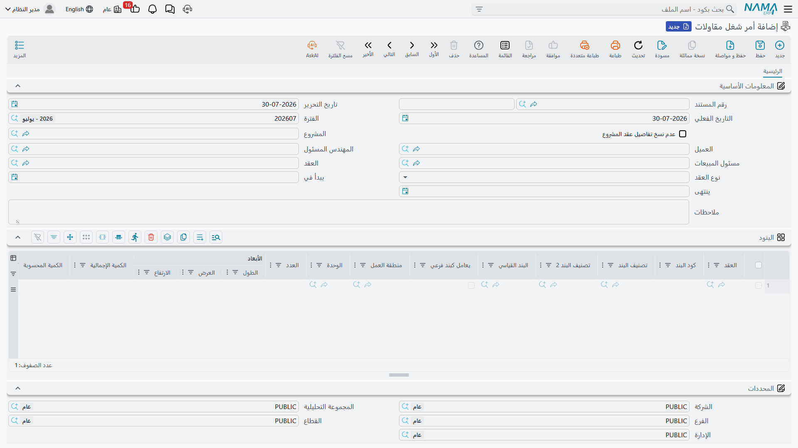

# دورة مقاولة المشروع

شركة المقاولات تدير سلسلتين متقابلتين في الوقت نفسه: سلسلة تطالب فيها مالك المشروع بقيمة ما نُفّذ له، وسلسلة تدفع فيها لمقاولي الباطن قيمة ما نفّذوه لها. هذه الصفحة تسير في السلسلة الأولى — جانب المالك، جانب الإيراد — من يوم تسعير العطاء إلى يوم وصول نقدية العميل.

وقبل أي تفصيل، هناك حقيقة واحدة تحكم السلسلة كلها وتفسّر معظم الأسئلة التي تصل عن هذه الوحدة:

::: tip القاعدة الوحيدة التي يجب ألا تُنسى
**توقيع العقد لا يُثبت شيئاً. المستخلص هو الذي يُثبت كل شيء.** عقد المشروع ملف رئيسي (Master File) — خطة مسعّرة تقيس عليها بقية الوحدة نفسها. لا قيد محاسبي ولا حركة مخزنية ولا مديونية تُنشأ عند حفظه أو تعديله. الإيراد والضريبة والمحتجز والتكلفة الفعلية تصل جميعها إلى الأستاذ عبر المستخلص، ولا تصل إلا عبره.
:::

سنسير في صفحات جانب المالك كلها على المشروع نفسه: مشروع **Tower A** لعميل واحد هو **Al-Fanar Development**، العقد **`PC-2026-001`**، متعاقد عليه بمبلغ **230,000**، مقسَّم إلى أربعة بنود عمل مسعّرة — حفر وخرسانة مسلحة ومباني وبياض — مع **محتجز 10%** يُستقطع من كل دفعة، و**دفعة مقدمة 46,000** تُقبض في البداية ثم تُسترد تدريجياً مع تقدم العمل.

## السلسلة خطوة بخطوة

```
طلب رفع مقاسات  (اختياري — أحدهم يذهب ليقيس الموقع)
        ↓
عرض سعر المقاولات  أو  مقايسة مقاولات      قائمة الكميات المسعّرة
        ↓  تحويل لعقد
عقد المشروع  (ملف رئيسي — لا يُثبت شيئاً)
        ↓
أمر شغل مقاولات  (اختياري — «اذهبوا ونفّذوا هذه البنود»)
        ↓
حصر كميات المشروع  (اختياري — ما نُفّذ فعلاً)
        ↓
مستخلص المشروع  ← مستند المال: الإيراد، الضريبة، المحتجز، استرداد الدفعة المقدمة
        ↓
سندات القبض / التحصيل
```

**1. قِس الموقع إذا احتجت.** في أعمال التشطيبات والفينيش لا يمكن تسعير قائمة الكميات قبل أن يذهب مشرف ويقيس الفتحات والحوائط والأرضيات الحقيقية. هذا هو دور [طلب رفع المقاسات](/ar/modules/contracting/project-contracting/contracting-measurements-and-approvals.md): يطلب من مشرف محدد زيارة الموقع، ويحدد موعداً لتسليم النتيجة. وهو اختياري تماماً، ولن تفتحه إن كان تسعيرك يعتمد على الرسومات. ولاحظ مسار القائمة: يضعه النظام تحت **المقاولات > مقاولة مقاول باطن** رغم أنه مستند موجَّه إلى العميل.

**2. سعّر العمل.** يقوم بذلك مستندان، والفرق بينهما مهم. [عرض سعر المقاولات](/ar/modules/contracting/project-contracting/contracting-offers.md) هو العرض الذي تسلّمه للعميل، وهو الموضع الوحيد الذي *يُبنى* فيه السعر: كل بند عمل يُفكَّك إلى خامات وعمالة ومقاولي باطن ومصروفات، ثم تحوّل نسبة الربح هذه التكلفة إلى سعر. تكلفة Tower A المحلَّلة 200,000 زائد 15% هي مصدر الرقم 230,000. أما [مقايسة المقاولات](/ar/modules/contracting/project-contracting/contracting-assays.md) فهي قائمة الكميات المسعّرة الداخلية — البنود نفسها بدون جداول تحليل التكلفة. وكلاهما يتحول إلى عقد بضغطة زر واحدة.

**3. وقّع العقد.** [عقد المشروع](/ar/modules/contracting/project-contracting/contracting-project-contract.md) هو مركز ثقل الوحدة كلها: بنود العمل المسعّرة التي ستطالب المستخلصات بقيمتها، والشروط التعاقدية التي تضيف إلى كل دفعة وتستقطع منها، والموظفون المسنَدون، وخطة أقساط العميل. وهو ملف رئيسي، أي أنه يبقى حياً: مستندات الحصر والمستخلصات ومستندات التكلفة تكتب إجمالياتها المتراكمة على بنوده كلما تقدم العمل.

**4. أصدر التصريح بالتنفيذ.** أمر الشغل (فقرة «أمر الشغل» أدناه) يخبر الموقع بأي البنود ينفّذ، وبأي كميات، وبين أي تاريخين. وليس له أي أثر محاسبي — كما هو مفصّل أدناه.

**5. سجّل ما نُفّذ.** [حصر كميات المشروع](/ar/modules/contracting/project-contracting/contracting-project-execution.md) هو مسح الكميات: حفرنا هذا الشهر 400 م³ من 1,000 م³ متعاقد عليها. وهو **اختياري** — يمكنك المطالبة من العقد مباشرة — و**تفاضلي لكل مستند**: كل حصر يذكر ما نُفّذ *بعد الحصر السابق* فقط، وبند العقد هو الذي يحمل الإجمالي المتراكم.

**6. طالِب العميل.** [مستخلص المشروع](/ar/modules/contracting/project-contracting/contracting-project-extracts.md) هو مستند المطالبة المعتمد، وهو المستند الوحيد في هذه السلسلة الذي يصل إلى الأستاذ. يسعّر الكميات المطالَب بها بأسعار العقد، ويضيف الضريبة، ثم يطبّق شروط العقد — استقطاع المحتجز 10%، واسترداد شريحة من الدفعة المقدمة 46,000، وخصم أي [غرامات](/ar/modules/contracting/project-contracting/contracting-project-fines.md) — ليصل إلى صافي المستحق. وكالحصر، يذكر المستخلص كميات *هذه* الفترة فقط، والإجمالي المتراكم يبقى على بند العقد.

**7. حصّل المال.** سندات القبض تسدد المستخلص. وشاشة العقد نفسها تستطيع إنشاء سند قبض من جدول الأقساط، لكن ذلك حركة نقدية على العميل — وليس إثباتاً للإيراد، فالإيراد قد أُثبت بالفعل على المستخلص.

## ما هو اختياري وما هو إلزامي

| الخطوة | اختيارية؟ | هل تُثبت قيوداً؟ |
|---|---|---|
| طلب رفع مقاسات | نعم | لا |
| عرض سعر المقاولات | نعم | لا |
| مقايسة مقاولات | نعم | نعم، إن كان توجيه المستند يحمل حسابات |
| **عقد المشروع** | **لا** | **لا** |
| أمر شغل مقاولات | نعم | لا |
| حصر كميات المشروع | نعم | لا |
| **مستخلص المشروع** | **لا** | **نعم — إيراد وضريبة ومديونية وتكلفة فعلية** |
| دفعة مقدمة | نعم | نعم |
| غرامة | نعم | نعم |

وخلوّ العمود الأخير إلى هذا الحد يستحق التصريح: كل ما يسبق المستخلص تخطيط وقياس. النظام مبني عن قصد على الفصل بين السجل التجاري (العقد) والسجل المحاسبي (المستخلص)، ولهذا يمكنك تعديل عقد لشهور دون أن تمسّ قيداً واحداً.

## أمر الشغل

أمر الشغل هو ورقة التصريح بالعمل في هذه الوحدة، واسمه الإنجليزي مُضلِّل: فرغم تسميته *Job Order* لا علاقة له من قريب أو بعيد بوحدة أوامر التشغيل الصناعية في نما. والتسمية العربية **أمر شغل** هي التصور الصحيح: تعليمات للموقع بتنفيذ مجموعة محددة من بنود العقد.

تجده في **المقاولات > مقاولة مشروع > أمر شغل مقاولات**، ويحتاج ترخيص `contracting`.



تحمل الترويسة المشروع والعميل والمهندس المسئول ومسئول المبيعات وتاريخي البداية والنهاية، ثم — وهو الحقل المهم — **العقد** الذي يصدر الأمر تحته. وأسفلها جدول بنود يشبه جدول بنود العقد تماماً: كود البند، البند القياسي، منطقة العمل، الوحدة، الأبعاد الفيزيائية، والكمية المطلوب تنفيذها.

وهناك سلوكان يستحقان المعرفة:

- **كود كل سطر يجب أن يكون موجوداً على العقد بالفعل.** إن كتبت كود بند لا يحمله العقد رُفض الاعتماد برسالة *"Term code is not found in project contract"*. والرسالة لا تذكر أي سطر تعنيه، فعلى أمر شغل طويل ستراجع الأكواد بنفسك مقابل العقد.
- **الكميات غير مقيّدة بالعقد.** يمكنك إصدار أوامر شغل تتجاوز كمياتها مجتمعةً الكمية المتعاقد عليها، ولا شيء يمنعك. أمر الشغل تعليمات لا أداة رقابة.

وليس له توجيه مستند، ولا ينتج قيداً محاسبياً ولا حركة مخزنية ولا تكلفة مشروع. أثره الباقي الوحيد هو الكميات المسجّلة على سطوره.

في Tower A سنُصدر أمر شغل واحداً للأساسات — البند `1.01` *حفر*، 1,000 م³، من 1 مارس إلى 30 أبريل — ونسلّمه لمهندس الموقع. وما ينجزه الموقع فعلاً يعود إلينا في صورة حصر كميات، لا في صورة تعديل على أمر الشغل.

## إلى أين تقرأ بعد ذلك

- طرف التسعير: [عروض الأسعار](/ar/modules/contracting/project-contracting/contracting-offers.md) و[المقايسات](/ar/modules/contracting/project-contracting/contracting-assays.md)، وكلاهما يقوم على [كتالوج البنود القياسية](/ar/modules/contracting/setup/contracting-standard-terms.md).
- العقد نفسه: [عقود المشروع](/ar/modules/contracting/project-contracting/contracting-project-contract.md)، و[تعديلات العقد](/ar/modules/contracting/project-contracting/contracting-project-contract-updates.md) عندما يغيّر العميل رأيه.
- المال: [الحصر](/ar/modules/contracting/project-contracting/contracting-project-execution.md) و[المستخلصات](/ar/modules/contracting/project-contracting/contracting-project-extracts.md) و[الضرائب على المستخلصات](/ar/modules/contracting/project-contracting/contracting-extract-taxes.md) و[الدفعات المقدمة](/ar/modules/contracting/project-contracting/contracting-project-advances.md) و[الغرامات](/ar/modules/contracting/project-contracting/contracting-project-fines.md).
- الصورة المقابلة لهذه الصفحة كلها في جانب التكلفة: [دورة مقاول الباطن](/ar/modules/contracting/contractor-contracting/contracting-contractor-cycle.md).
- من أين تأتي التكلفة الفعلية التي تقارنها بقيمة العقد: [كيف تتكوّن تكلفة المشروع](/ar/modules/contracting/costs/contracting-cost-model.md).
