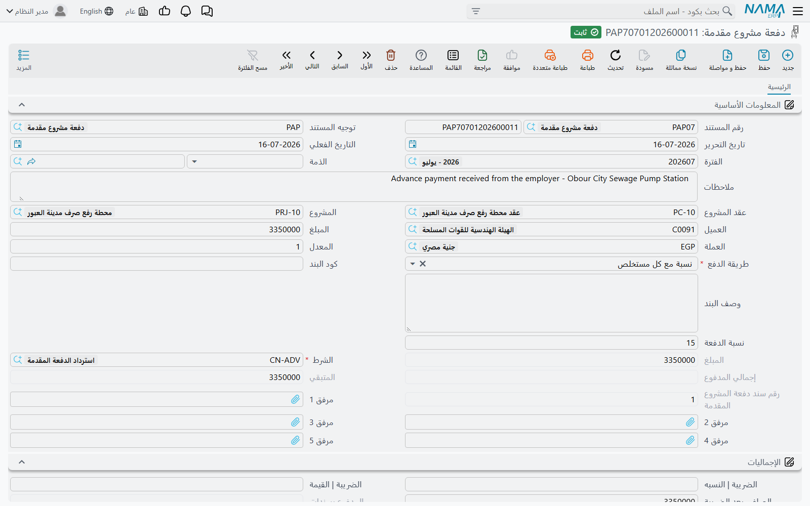

# الدفعات المقدمة من العميل

لا أحد يجلب رافعة برجية تفضّلاً. فأكثر عقود الإنشاء يدفع فيها المالك جزءاً من القيمة — 10% أو 20% — قبل أن يدخل الموقع جاروف، حتى يشتري المقاول أول الخامات ويقيم مكاتب الموقع ويستأجر المعدات. وهذا المال ليس إيراداً، بل سلفة مقابل شهادات مقبلة، وعلى كل شهادة أن تردّ جزءاً منها.

و**دفعة المشروع المقدمة** هو المستند الذي يسجل هذا المال ثم يتتبع سداده تلقائياً من بعده. تضبط القاعدة مرة واحدة، وتتولى [المستخلصات](/ar/modules/contracting/project-contracting/contracting-project-extracts.md) الباقي.

## أين تجدها

| | |
|---|---|
| القائمة | المقاولات > مقاولة مشروع > دفعة مشروع مقدمة |
| النوع | مستند |
| توجيه المستند | إجباري — وهو الذي يوفّر الحسابات وقاعدة الاسترداد الافتراضية |
| الترخيص | `contracting` |

## الشاشة

تنقسم البيانات الأساسية إلى ثلاث أفكار، ويُحسن قراءتها هكذا لا حقلاً حقلاً.

**لمن وكم.** **عقد المشروع** (إجباري — فالدفعة المقدمة تنتمي إلى عقد دائماً)، و**المشروع** و**العميل** الآتيان معه. و**الذمة** التي يقف هذا المال في مقابلها. و**المبلغ** و**العملة** و**المعدل**. وفي مجموعة الإجماليات **نسبة الضريبة** و**قيمة الضريبة** الناتجة عنها، فينتج **الصافي بعد الضريبة** — وهو الرقم الذي يعمل عليه الاسترداد فعلاً.

**كيف يعود.** **طريقة الدفع**، وبحسب ما تختار: **نسبة الدفعة** أو **مبلغ الدفعة**. ثم **الشرط** — وهو إجباري — وهو [الشرط التعاقدي](/ar/modules/contracting/setup/contracting-conditions.md) الذي سيظهر الاسترداد به على كل مستخلص، وهو الذي يحمل الحسابات التي يُسجَّل الاسترداد عليها. و**كود البند** اختياراً، إن كانت الدفعة تتعلق ببند واحد من جدول الكميات لا بالعقد كله؛ وإن ملأتَه وجب أن يكون بنداً موجوداً في العقد.

**وما جرى بعد ذلك.** وكله من صنع النظام: **إجمالي المدفوع** (كم استردّته المستخلصات حتى الآن)، و**المتبقي**، و**المدفوع بسندات** و**المتبقي بعد المدفوع من السندات** (وهو الجانب النقدي: كم من الدفعة سلّمه العميل فعلاً)، ورقم الدفعة في تسلسل دفعات العقد المقدمة. وقائمة **الدفعات** أسفل الشاشة تعرض سندات القبض التي أتت بالنقد.

ولاحظ رقمَي "كم بقي" المستقلين: فـ*المتبقي* يتعلق بـ**الاسترداد** — كم بقي على المستخلصات أن تستردّه من الدفعة. أما *المتبقي بعد المدفوع من السندات* فيتعلق بـ**التحصيل** — كم بقي على العميل أن يسلّمه نقداً من الدفعة. وهما يجيبان سؤالين مختلفين ويتحركان في وقتين مختلفين.

## قاعدة الاسترداد

**طريقة الدفع** هي الآلية كلها مكثَّفة في حقل واحد:

| طريقة الدفع | ما يستردّه كل مستخلص |
|---|---|
| **أول مستخلص تالي** | الرصيد كله في المستخلص التالي مباشرة. وتناسب دفعة تجهيز صغيرة يريد الجميع إخراجها من الدفاتر دفعة واحدة |
| **قيمة ثابتة مع كل مستخلص تالي** | **مبلغ الدفعة** الثابت — أو الرصيد إن كان أصغر. وتناسب دفعة تُسدَّد بأقساط شهرية متفق عليها |
| **نسبة مع كل مستخلص** | **نسبة الدفعة** مطبَّقة على الصافي بعد الضريبة للدفعة *نفسها*. مبلغ مستقر متوقَّع لكل شهادة |
| **نسبة من المستحق مع كل مستخلص** | **نسبة الدفعة** مطبَّقة على قيمة أعمال *ذلك المستخلص*. فيتناسب الاسترداد مع التقدم: الشهر الكبير يردّ أكثر |
| **المستخلص الختامي** | لا شيء حتى النهاية، ثم الرصيد كله على المستخلص الختامي |

والطريقتان الأخيرتان هما الجديرتان بالتفكير، لأنهما تعبّران عن اتفاقين تجاريين مختلفين: فـ*نسبة مع كل مستخلص* تقول "ستردّ 25% من الدفعة كل مرة، مهما حاسبتَ"، و*نسبة من المستحق* تقول "ستردّ 20% من كل ما تحاسب عليه". وفي شهر ضعيف ينتج ذلك شيكين مختلفين جداً.

وأي طريقة اخترت فإن كل استرداد مسقّف بما بقي: فلا تُستَرد الدفعة بأكثر من رصيدها أبداً — إذ يرفض المستخلص الاعتماد إن كان الاستقطاع سيدفع المتبقي إلى ما دون الصفر، إلا إذا كان توجيه الدفعة نفسها يسمح بالمتبقي السالب.

## كيف يستردّها المستخلص

الآلية تلقائية بالكامل، وتجري عبر جدول الشروط في المستخلص لا عبر أي حقل خاص:

1. عند تجميع الشروط — بزر *تجميع الشروط* أو تلقائياً عند الحفظ، بحسب ضبط توجيه المستخلص — يبحث المستخلص عن كل دفعة مقدمة **معتمدة** على عقده بقي لها رصيد وتاريخها **في أو قبل** التاريخ الفعلي للمستخلص. وفي المستخلص **الختامي** يُسقَط فحص التاريخ، فتُسحب حتى الدفعات اللاحقة التاريخ.
2. فتصير كل واحدة سطر **استقطاع** في *الإضافات والإستقطاعات*: الدفعة في عمود سند الشرط، وشرط الدفعة، وكود بندها، ومبلغ استقطاع محسوب من طريقة الدفع أعلاه. وإن كانت الدفعة تحمل ضريبة خُصم من المبلغ المسترد نصيبٌ نسبي من الضريبة المتبقية.
3. وعند الاعتماد يُكتب الاسترداد رجوعاً: فيرتفع **إجمالي المدفوع** في الدفعة وينخفض **المتبقي**، ويُحفظ سجل بأي مستخلص استردّ كم. وهذا السجل هو ما يجعل أرقام الدفعة موثوقة بعد اثنتي عشرة شهادة.
4. وأي باقٍ بمقدار جزء من مئة أو أقل يُصفَّر، فلا يتعطل المستخلص الختامي بذيل تدوير أبداً.

وإلغاء المستخلص يعكس ذلك كله.

## ما تسجله الدفعة نفسها

الدفعة المقدمة مستند محاسبي حقيقي بذاته، وتُعالَج كما يُعالَج كل مستند مقاولات: فعند الاعتماد ترفع **طلب أعمال**، ويظهر القيد حين تجري معالجة الطلب في الخلفية. وإن فشل — فترة مغلقة، أو حساب غير مضبوط — أُعيدت المعالجة من شاشة قائمة **طلبات الأعمال** بـ**المزيد ← إعادة معالجة** أو **إعادة اعتماد**.

والقيد قصير: المبلغ يذهب إلى زوج حسابات في توجيه المستند، وقيمة الضريبة إلى زوج ثانٍ. ولا يُسجَّل أي زوج إلا إذا كان **جانباه** مضبوطين، فالتوجيه نصف المضبوط لا يسجل شيئاً بصمت — فافحص الجانبين دائماً.

والضبط المعتاد يجعل الدائن **دفعات مقدمة من العملاء** (وهو التزام: أنت مدين بهذا العمل)، والمدين البنك أو الصندوق أو حساباً وسيطاً يسوّيه سند القبض بعد ذلك. أما الاسترداد لاحقاً فيتحرك في الاتجاه المعاكس: مديناً حساب الدفعات المقدمة ذاته ودائناً ذمة العميل، وبهذا يُستهلك الالتزام مقابل المطالبة الجديدة. وحسابات *هذا* الجانب تسكن على **الشرط** لا على توجيه الدفعة — انظر [الشروط التعاقدية](/ar/modules/contracting/setup/contracting-conditions.md).

ويمكن كذلك إرسال الدفعة المقدمة إلى مصلحة الضرائب كفاتورة قائمة بذاتها، بسطر واحد بقيمة مبلغها.

## ما يمنع الاعتماد

- **عقد المشروع إجباري.**
- **كود البند، إن ذُكر، يجب أن يوجد في العقد.**
- **مبلغ الدفعة أو نسبتها الذي تحتاجه الطريقة يجب أن يُملأ** — فطريقة القيمة الثابتة بلا قيمة، أو طريقة النسبة بلا نسبة، مرفوضة.
- **مبلغ الدفعة لا يتجاوز القيمة المستحقة لكود البند** المرتبطة به.
- **الصافي بعد الضريبة لا ينزل عن المستردّ فعلاً.** فمتى استردّت المستخلصات 23,000 لم يمكن تعديل الدفعة إلى 20,000.
- **المبلغ لا يُعدَّل إطلاقاً بعد وجود مستخلص ختامي** على العقد، لأن الشهادة الختامية سوّت معه بالفعل.
- **العقد الذي له مستخلص ختامي لا يقبل دفعة مقدمة جديدة.**

والحذف محروس بالروح نفسها: فالدفعة التي استُردّ منها شيء لا تُحذف. ألغِ المستخلصات أولاً.

## مثال عملي

عقدنا من [صفحة المستخلصات](/ar/modules/contracting/project-contracting/contracting-project-extracts.md): **PC-2026-001** لـ*Al-Fanar Development* على مشروع *Tower A*، بقيمة **230,000**.

**PAP-001** بتاريخ فعلي 1 فبراير:

| الحقل | القيمة |
|---|---|
| المبلغ | **46,000** — أي 20% من قيمة العقد |
| نسبة الضريبة | 0، فالصافي بعد الضريبة 46,000 |
| طريقة الدفع | نسبة مع كل مستخلص |
| نسبة الدفعة | **25** |
| الشرط | *ADV-REC — استرداد الدفعة المقدمة*، وحساباته مدين *دفعات مقدمة من العملاء* ودائن *عملاء* |

و25% من 46,000 قيمةِ الدفعة نفسِها = **11,500**، فيُتوقَّع من كل شهادة أن تردّ 11,500 حتى تنفد الدفعة — أي أربعة مستخلصات، إن كانت الشهادات كبيرة بما يكفي لحملها.

| | عند اعتماد الدفعة | بعد EXT-001 | بعد EXT-002 | في المستخلص الختامي |
|---|---|---|---|---|
| المستردّ هذه المرة | — | 11,500 | 11,500 | 23,000 |
| إجمالي المدفوع | 0 | 11,500 | 23,000 | 46,000 |
| **المتبقي** | **46,000** | **34,500** | **23,000** | **0** |

واقرأ السطر الأخير أفقياً فعندك الجملة التي تهم الإدارة المالية: الدفعة المقدمة 46,000 نزلت من 46,000 إلى 34,500 إلى 23,000 على الشهادتين الدوريتين، ثم يسحب المستخلص الختامي الـ 23,000 الباقية دفعة واحدة — متجاوزاً قاعدة الـ 25%، لأن المستخلص الختامي يأخذ الرصيد كله دائماً ويرفض الاعتماد إن بقي منه شيء.

وعلى الشهادات نفسها يكون الاسترداد سطراً واحداً في جدول الاستقطاعات:

| المستخلص | الأعمال بالضريبة | المحتجزات | **الدفعة المستردة** | الصافي المستحق |
|---|---|---|---|---|
| EXT-001 | 70,150 | (6,100) | **(11,500)** | 52,550 |
| EXT-002 | 77,510 | (6,740) | **(11,500)** | 59,270 |

::: tip الاختيار بين طريقتَي النسبة
لو كانت PAP-001 على *نسبة من المستحق مع كل مستخلص* بـ 25% لاستردّ EXT-001 نسبة 25% من قيمة أعماله 61,000 — أي 15,250 لا 11,500 — واستردّ EXT-002 نسبة 25% من 67,400 أي 16,850، ولانتهت الدفعة تقريباً في ثلاث شهادات لا أربع. الدفعة نفسها والنسبة نفسها، واتفاق مختلف. فاحسم ما يقوله العقد فعلاً عن الأساس قبل أن تختار الطريقة.
:::

## إلى أين بعد ذلك

- [مستخلص المشروع](/ar/modules/contracting/project-contracting/contracting-project-extracts.md) — حيث يجري الاسترداد.
- [الشروط التعاقدية](/ar/modules/contracting/setup/contracting-conditions.md) — الشرط الذي يحمل الاسترداد، وحساباته.
- [غرامات عقد المشروع](/ar/modules/contracting/project-contracting/contracting-project-fines.md) — المستند الآخر الذي يصل المستخلص استقطاعاً.
