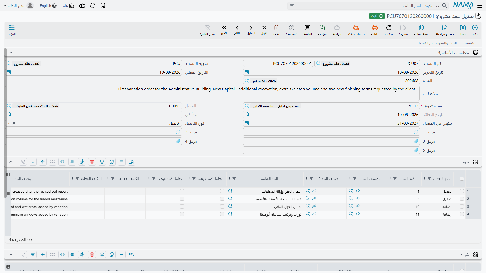
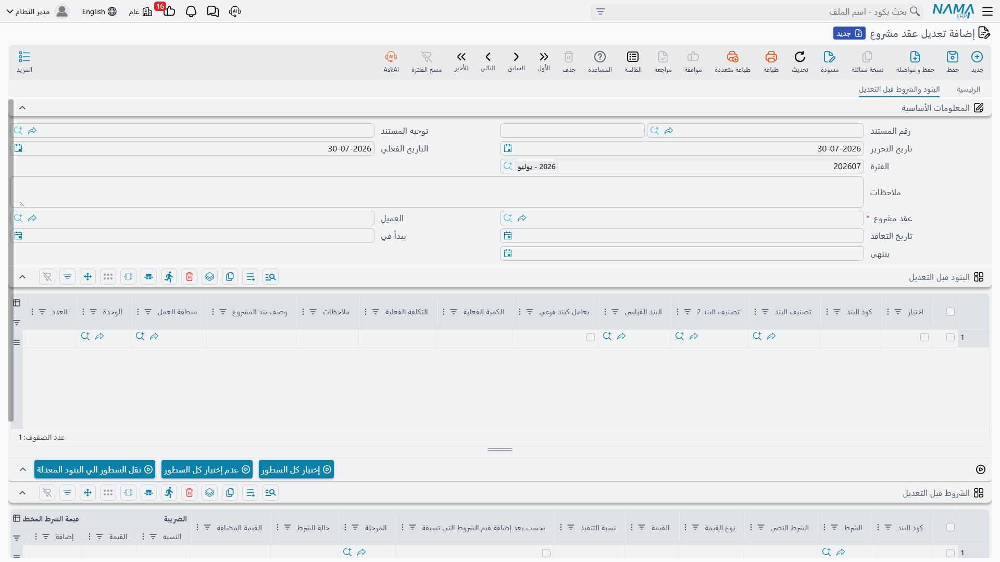

# تعديل عقد المشروع

العملاء يغيّرون رأيهم. كمية تبيّن أنها حُصرت بأقل من الواقع، وسعر يُعاد التفاوض عليه، وبند لم يفكر فيه أحد يجب إضافته، وتاريخ الانتهاء يتأخر شهراً. في عمل صغير كنت ستفتح العقد وتعدّله — وهذا فعلاً ما تفعله في أول حياة العقد. لكن [عقد المشروع](/ar/modules/contracting/project-contracting/contracting-project-contract.md) يجمّد أسعاره وكمياته وشروطه بمجرد صدور أول مستخلص عليه، ومن تلك اللحظة يصبح هذا المستند هو الطريق المعتمد الوحيد لتغييره.

مستند تعديل عقد المشروع هو **أمر التغيير**. ويستحق التوقف عند نوع هذا السجل، فهو الشاذ في هذا الجزء من الوحدة:

::: tip المستند الحقيقي الوحيد في سلسلة عقد جانب المالك
المشروع والعقد والملحق كلها ملفات رئيسية. أما مستند التعديل فهو **مستند** بحق: له دفتر ورقم مستند وتاريخ تحرير وتاريخ فعلي وفترة مالية وسجل تدقيق كامل. وهذا هو مقصوده: تغيير عقد موقّع يحتاج سجلاً مؤرّخاً ومرقّماً ومنسوباً إلى صاحبه، وذلك السجل هو هذا المستند لا تحريراً صامتاً على الملف الرئيسي.

وله حقل *توجيه المستند* لأن كل مستند يحمله، لكن **لا توجد خيارات توجيه خاصة بالمقاولات لهذا النوع** ولا شيء فيه يقرأ توجيهاً. وهو لا ينتج **أي قيد محاسبي**: أمر التغيير يغيّر أرقام العقد، وأثره المالي يظهر لاحقاً على المستخلص التالي.
:::

تجده في **المقاولات > مقاولة مشروع > تعديل عقد مشروع**، ويحتاج ترخيص `contracting`. ولجانب مقاول الباطن نظيره الذي يتصرف تصرفاً مطابقاً — راجع [تعديل عقد مقاول الباطن](/ar/modules/contracting/contractor-contracting/contracting-contractor-contract-updates.md).

ومثالنا هو العقد **`PC-2026-001`** — مشروع **Tower A** لعميلنا **Al-Fanar Development** — بعد ستة أشهر: قيمة العقد **230,000**، وصدر مستخلصان بالفعل، فالعقد مجمَّد. والعميل يريد الآن **300 م³ حفر إضافية، وإضافة عزل ودهانات، وأربعة أسابيع إضافية**.

## ماذا يفعل بالعقد — الخلاصة

::: warning العقد يُكتب فوقه في مكانه. ولا توجد نسخ محفوظة.
لا يوجد جدول نسخ للعقد، ولا عقد مؤرّخ السريان، ولا سجل «مراجعة عقد». اعتماد مستند التعديل يفتح العقد ويعيد كتابة بنوده وشروطه ويعتمده من جديد. والعقد الذي تنظر إليه غداً هو العقد المعدَّل ببساطة.

ومعنى ذلك أن *تاريخ* العقد يقيم خارج العقد: في سلسلة مستندات التعديل (وكل منها يحمل صورته المجمَّدة «قبل التعديل»)، وفي سجل تدقيق السجل على العقد نفسه، وفي قائمة التعديلات في صفحة *المستندات المرتبطة* بالعقد. فللإجابة على «كيف كان هذا العقد في مارس؟» تقرأ مستندات التعديل بالترتيب — ولا تسأل العقد.
:::

## كيف تملؤه

**1. سمِّ العقد.** حقل **عقد مشروع** إجباري، واختياره يقوم بعمل كثير: يملأ العميل وتاريخ التعاقد وتاريخ البداية — والثلاثة تصبح بعدها للقراءة فقط، لأن أمر التغيير لا يغيّر مع من تعاقدت ولا متى — و**يأخذ صورة من كل سطر بند وكل سطر شرط في العقد** إلى جدولي «قبل التعديل» في الصفحة الثانية.

**2. اضبط تاريخ الانتهاء الجديد إن كان متغيراً.** الصفحة الأولى تحمل **ينتهي في المعدل** — أي تاريخ الانتهاء *الجديد*. والصفحة الثانية تُظهر القديم. في `PC-2026-001` نضبطه على 28 يناير بعد أن كان العقد يقول 31 ديسمبر.

**3. اختر السطور التي تغيّرها.** ويحدث هذا في الصفحة الثانية، وهو الغرض الحقيقي من جدولي «قبل التعديل».

جدول *البنود قبل التعديل* هو العقد كما هو، للقراءة فقط بالكامل، مع عمود إضافي واحد: **اختيار**. علّم السطور التي تنوي تغييرها، واضبط **نوع التعديل** في الترويسة، واضغط **نقل السطور الي البنود المعدلة**. فتُحوَّل السطور المعلَّمة إلى سطور قابلة للتحرير في جدول *البنود* بالصفحة الأولى، مطبوعاً عليها ذلك النوع من التعديل، وتُلغى العلامات. وزرّا **إختيار كل السطور** و**عدم إختيار كل السطور** يوفران عليك النقر في عقد طويل.

ولستَ مضطراً للمرور بالصورة: كتابة كود بند بيدك في جدول *البنود* بالصفحة الأولى تجد سطر الصورة المطابق وتنسخه إلى سطرك، سطراً بسطر. وقوائم الاقتراح لكود البند وحقل *إضافة بعد* في الصفحة الأولى تقترح من الصورة لا من قاعدة البيانات، فلا تعرض إلا الأكواد التي يحملها هذا العقد فعلاً.

وعناوين أعمدة جدولي «قبل التعديل» لا تطابق دائماً عناوين الجدولين الحيّين حرفياً للأعمدة نفسها — فاقرأها بموضعها ومعناها لا بمطابقة الصياغة.

**4. بيّن ما هو كل تغيير.** كل سطر في جدول *البنود* يحمل **نوع التعديل** الخاص به، وقيمة السطر هي المُطاعة. أما حقل الترويسة فمجرد افتراضي مريح: تغييره يطبعه على كل سطر موجود في الجدول.

| نوع التعديل | ما يفعله بالعقد |
|---|---|
| **إضافة** | ينشئ سطر بند جديداً في العقد ويُدخله مباشرة بعد السطر الذي كتبت كوده في **إضافة بعد**. وإن أضفت عدة سطور على المرساة نفسها اصطفّت خلفها بالترتيب. |
| **تعديل** | يجد سطر العقد الذي يحمل كود البند نفسه ويكتب فوق مضمونه — **دون أن يمسّ أرقام التقدم النظامية**. فالكميات المنفذة والمستخلصة والمحمَّلة بالتكلفة، وموضع السطر في شجرة البنود، كلها تبقى. تعديل سعر لا يمحو سجل ما طُولب به. |
| **حذف** | يجد سطر العقد الذي يحمل كود البند نفسه ويرفعه من العقد. |

ولا بد في الأنواع الثلاثة أن يكون الكود قابلاً للإيجاد: فإن لم يكن في العقد سطر بذلك الكود، أو لم يوجد سطر يطابق مرساة *إضافة بعد*، فشل الاعتماد برسالة *"Could not find term line with the code …"* على الخانة المخطئة.

وحقل **إضافة بعد** إجباري كلما كان نوع التعديل *إضافة*. أما كود البند فيمكن تركه فارغاً: يشتقّه النظام من المرساة بزيادة آخر مقطع منقّط فيها حتى يجد كوداً غير مستخدم، وبعد اعتماد العقد يكتب الكود الذي استقر عليه العقد فعلاً على سطرك، فيُظهر المستند النتيجة الحقيقية.

**5. احفظ واعتمد.** عند الاعتماد يعيد المستند بناء قائمة بنود العقد: يكتب الصورة أولاً فيعيد الحالة السابقة للتعديل، ثم يطبّق سطور الإضافة والتعديل والحذف فوقها، ثم يضبط تاريخ انتهاء العقد من *ينتهي في المعدل* إن ملأته، ثم يعتمد العقد. وإن كان جدول *البنود* وجدول *الشروط* فارغين معاً لم يحدث شيء على الإطلاق — فمستند تعديل بلا سطور لا أثر له.

## أمر التغيير في Tower A من أوله إلى آخره

العقد قبل التعديل، مع الكميات التي طالب بها المستخلصان بالفعل:

| الكود | البند | الكمية | سعر الوحدة | إجمالي السعر | المطالَب به حتى الآن |
|---|---|---|---|---|---|
| `1` | أعمال الحفر | | | 50,000 | |
| `1.01` | حفر | 1,000 م³ | 50.00 | 50,000 | 700 م³ |
| `2` | الهيكل الإنشائي | | | 54,000 | |
| `2.01` | خرسانة مسلحة | 60 م³ | 900.00 | 54,000 | 40 م³ |
| `3` | مباني وتشطيبات | | | 126,000 | |
| `3.01` | مباني بلوك | 2,000 م² | 46.00 | 92,000 | 1,100 م² |
| `3.02` | بياض | 1,000 م² | 34.00 | 34,000 | 200 م² |

إجمالي السعر **230,000**، إجمالي التكلفة 200,000، المحتجز 10% = 23,000، القيمة المستحقة 207,000.

مستند التعديل:

1. مستند تعديل جديد، تاريخه الفعلي 1 يوليو، و**عقد مشروع** = `PC-2026-001`. فيملأ العميل وتاريخ التعاقد وتاريخ البداية أنفسهم؛ ويقرأ *ينتهى* في الصفحة الثانية 31 ديسمبر؛ وتُؤخذ صورة من سطور البنود السبعة.
2. **ينتهي في المعدل** = 28 يناير.
3. في الصفحة الثانية علّم `1.01`، واضبط **نوع التعديل** في الترويسة على *تعديل*، واضغط **نقل السطور الي البنود المعدلة**. فيظهر سطر واحد في *البنود*. غيّر كميته من 1,000 إلى **1,300**.
4. أضف سطراً بيدك: **نوع التعديل** = *إضافة*، البند القياسي *عزل*، **إضافة بعد** = `3.02`، 500 م² بسعر 30.00 وتكلفة وحدة 24.00. واترك كود البند فارغاً.
5. أضف سطراً ثانياً بالطريقة نفسها: **نوع التعديل** = *إضافة*، البند القياسي *دهانات*، **إضافة بعد** = `3.02`، 3,000 م² بسعر 8.00 وتكلفة وحدة 6.50. وكود البند فارغ مرة أخرى.
6. اعتمد.

العقد بعد التعديل:

| الكود | البند | الكمية | سعر الوحدة | إجمالي السعر | المطالَب به حتى الآن |
|---|---|---|---|---|---|
| `1` | أعمال الحفر | | | **65,000** | |
| `1.01` | حفر | **1,300 م³** | 50.00 | **65,000** | 700 م³ — *محفوظة* |
| `2` | الهيكل الإنشائي | | | 54,000 | |
| `2.01` | خرسانة مسلحة | 60 م³ | 900.00 | 54,000 | 40 م³ — *محفوظة* |
| `3` | مباني وتشطيبات | | | **165,000** | |
| `3.01` | مباني بلوك | 2,000 م² | 46.00 | 92,000 | 1,100 م² — *محفوظة* |
| `3.02` | بياض | 1,000 م² | 34.00 | 34,000 | 200 م² — *محفوظة* |
| `3.03` | **عزل** | 500 م² | 30.00 | **15,000** | 0 |
| `3.04` | **دهانات** | 3,000 م² | 8.00 | **24,000** | 0 |

إجمالي السعر **284,000**، إجمالي التكلفة 243,500، والمحتجز 10% صار مخططاً على **28,400**، والقيمة المستحقة **255,600**، وتاريخ انتهاء العقد 28 يناير. وقد رُقّم السطران الجديدان تلقائياً من المرساة `3.02` ودُسّا خلفها، وأعادت السطور الرئيسية جمع نفسها — السطر `1` بزيادة 15,000 من الحفر الإضافي، والسطر `3` بزيادة 39,000 من الأعمال الجديدة — ومرّت الكميات المطالَب بها على السطور الفرعية الأربعة الأصلية بلا مساس.

و — وهي النقطة الأهم — **لم ينتج شيء من هذا قيداً محاسبياً**. فالـ 54,000 الإضافية من قيمة العقد لا تصل إلى الأستاذ إلا عندما يطالب [المستخلص](/ar/modules/contracting/project-contracting/contracting-project-extracts.md) التالي بجزء منها.

## الشروط تتصرف تصرفاً مختلفاً عن البنود

هذا أهم ما يجب إتقانه في هذه الشاشة، وهو لا يعمل كما يعمل جدول البنود.

::: warning جدول الشروط يستبدل شروط العقد كلها
سطور الشروط لا تحمل نوع تعديل، ولا توجد مقارنة سطراً بسطر. والقاعدة ثنائية:

- اترك جدول **الشروط** **فارغاً** فلا تُمَس شروط العقد على الإطلاق.
- ضع **أي شيء** في جدول الشروط فيصبح هو **قائمة شروط العقد الجديدة كاملة** — وكل شرط على العقد الآن وليس في جدولك يُحذف.

فإن كان `PC-2026-001` يحمل شرط محتجز وشرط استرداد دفعة مقدمة، وأصدرت تعديلاً يضيف شرط غرامة، فعليك سرد **الثلاثة** في الجدول. فسرد الغرامة وحدها يحذف الشرطين الآخرين.

وجدول *الشروط قبل التعديل* في الصفحة الثانية هو موضع الحصول عليها: يحمل شروط العقد الحالية، وهو الموضع الموثوق لقراءة المجموعة كاملة قبل بناء قائمتك البديلة.
:::

## حدّث الصورة قبل الاعتماد

للآلية التي تجعل جدولي «قبل التعديل» يؤدّيان دورين — قائمة اختيار وصورة تراجع — نتيجةٌ واحدة تستحق الاحتراس.

::: warning مستند تعديل قديم يحذف سطوراً لم يرها قط
قائمة بنود العقد بعد الاعتماد هي **الصورة زائد تغييراتك**. وكل سطر في العقد غير موجود في *البنود قبل التعديل* يُرفع. وهذا لا يُلاحَظ عادةً لأن الصورة أُخذت من العقد كله عند اختياره. لكن إن كتبت مستند التعديل في مايو، وأضاف أحدهم سطوراً إلى العقد في يونيو بطريق آخر، واعتمدتَ في يوليو، **حُذفت سطور يونيو**.

والعلاج بسيط: على مستند تعديل مضى عليه وقت، أعد اختيار حقل **عقد مشروع** قبل الاعتماد، فتُؤخذ صورة جديدة للعقد كما هو الآن.

والمنطق نفسه ينطبق معكوساً عند الإلغاء: إلغاء المستند يعيد العقد من الصورة، ومعنى ذلك أن أرقام تقدّم العقد تعود إلى ما كانت عليه **لحظة أخذ الصورة** — فألغِ تعديلاً قديماً وتوقّع أن تراجع تلك الأرقام بعده.
:::

وعمل **نسخة مماثلة** من مستند تعديل يفرّغ جدولي «قبل التعديل» عن قصد، حتى تأخذ النسخة صورةً جديدة من حالة العقد الحالية لا أن ترث صورة قديمة.

## ما يمنع الاعتماد أو الحذف

| القاعدة | الرسالة التي ستراها |
|---|---|
| لا يجوز أن يوجد مستند تعديل **أحدث** لهذا العقد. والفحص يقارن التواريخ الفعلية، ولمستندات اليوم نفسه ترتيب إنشائها. | *"Cannot edit document … on date … because of the update document …"* |
| لا يجوز تبديل العقد بعد حفظ المستند. | *"Cannot change contract from … to … in document …"* |
| لا يتكرر كود البند نفسه بنوع التعديل نفسه. | *"The term code … with edit type … is repeated in lines … and …"* |
| **إضافة بعد** إجباري على كل سطر *إضافة*. | العمود إجباري |
| يُرفض حذف المستند إذا وُجد له مستند تعديل أحدث على العقد. | *"Cannot delete document … because of the update document …"* |

وهناك عائلتان أخريان من الأخطاء لا تظهران إلا عند الاعتماد، لأن الاعتماد هو لحظة إعادة كتابة العقد فعلاً. الأولى رسالتا *"Could not find term line with the code …"* المذكورتان أعلاه. والثانية كل ما يرفضه **العقد نفسه**: فمستند التعديل يعتمد العقد بالطريق العادي، فتنطبق كل قواعد [صفحة العقد](/ar/modules/contracting/project-contracting/contracting-project-contract.md)، ومنها تجميد ما بعد المستخلصات. فمستند التعديل طريق منضبط ومؤرَّخ *عبر* التجميد لا حوله: يستطيع تغيير حقل مجمَّد لأنه يسجّل ما كان عليه الحقل قبل التغيير، لكنه لا يستطيع كسر أي قاعدة أخرى في العقد. فإن ترك تعديلك كود بند مكرراً أو نسب مراحل لا تساوي 100 فشل الاعتماد وبقي العقد كما هو.

## إلى أين تقرأ بعد ذلك

- [عقد المشروع](/ar/modules/contracting/project-contracting/contracting-project-contract.md) — السجل الذي يعيد هذا المستند كتابته، والتجميد الذي جعله ضرورياً.
- [مستخلص المشروع](/ar/modules/contracting/project-contracting/contracting-project-extracts.md) — حيث تصبح القيمة المعدَّلة مالاً.
- [دورة مقاولة المشروع](/ar/modules/contracting/project-contracting/contracting-owner-cycle.md) — السلسلة التي يقع فيها هذا المستند.
- [تعديل عقد مقاول الباطن](/ar/modules/contracting/contractor-contracting/contracting-contractor-contract-updates.md) — المستند نفسه في جانب التكلفة، بسلوك مطابق.
