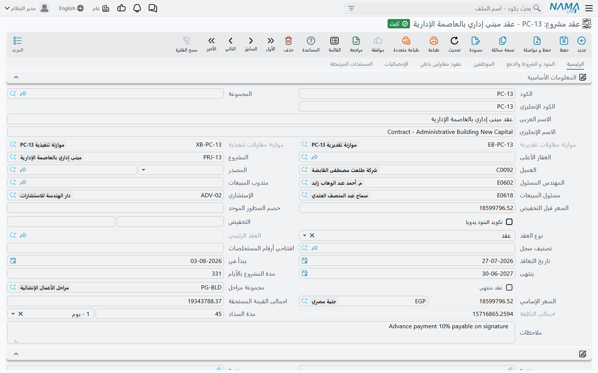
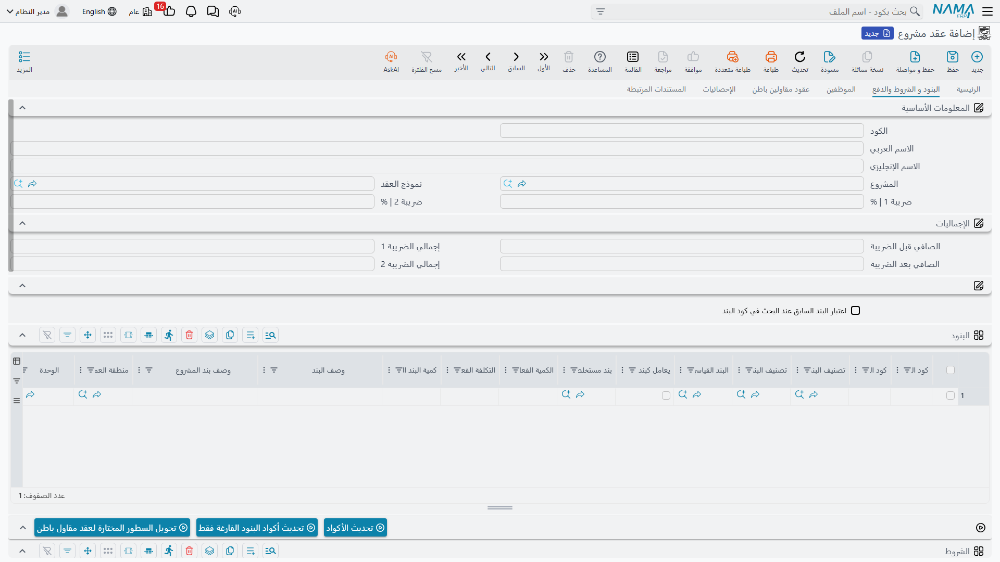

# عقد المشروع

عقد المشروع هو مركز ثقل وحدة المقاولات كلها. هو قائمة الكميات المسعّرة التي تطالب المستخلصات بقيمتها، ومجموعة الشروط التجارية التي تحدد ما يُستقطع من كل دفعة، والموضع الذي تُقتطع منه عقود مقاولي الباطن، والمقياس الذي تُبنى عليه الموازنات، والسجل الذي يتراكم فيه — بنداً بنداً، شهراً بعد شهر — كم نُفّذ من العمل وكم طُولب به وكم كلّف فعلاً.

وهو **ملف رئيسي** لا مستند. وهذه الحقيقة الواحدة تفسّر معظم ما يستغربه الناس فيه:

::: tip ماذا يعني «ملف رئيسي» هنا
عقد المشروع **لا دفتر له ولا رقم مستند ولا تاريخ فعلي ولا فترة مالية ولا توجيه مستند**. له كود ومجموعة واسم عربي واسم إنجليزي كأي ملف رئيسي. ولأنه لا توجيه له فلا حسابات عليه — أي أن **حفظ العقد أو تعديله لا ينتج قيداً محاسبياً ولا حركة مخزنية على الإطلاق**. ولا يصل المال إلى الأستاذ إلا عند إصدار [مستخلص مشروع](/ar/modules/contracting/project-contracting/contracting-project-extracts.md) على العقد، بالحسابات الموجودة على [البنود القياسية](/ar/modules/contracting/setup/contracting-standard-terms.md) وعلى توجيه المستخلص نفسه.
:::

والنتيجة الأخرى لكونه ملفاً رئيسياً أنه يبقى **حياً**. المستند بيان مجمَّد للحظة، أما هذا السجل فيُكتب عليه باستمرار: كل حصر كميات وكل مستخلص وكل مستند تكلفة يطبع إجماليه المتراكم على بنود العقد — ولهذا فإن العقد، لا تقرير ما، هو الموضع الذي تنظر فيه لتعرف كيف يسير العمل.

تجده في **المقاولات > مقاولة مشروع > عقد مشروع**، ويحتاج ترخيص `contracting`.

ومثالنا هو العقد **`PC-2026-001`** — مشروع **Tower A** لعميلنا **Al-Fanar Development**: قيمة العقد **230,000** على أربعة بنود عمل مسعّرة، و**محتجز 10%** يُستقطع من كل دفعة، و**دفعة مقدمة 46,000** قُبضت من العميل قبل بدء العمل.



## كيف تصل البنود إلى العقد

لا أحد يكتب قائمة كميات مرتين، وتوفّر الوحدة طريقين فقط لإحضار قائمة كميات إلى عقد. ويجدر الدقة فيهما، لأن الزر الذي يبحث عنه القارئ غير موجود.

**الطريق الأول — من عطاء، عبر حقل المصدر.** وجّه حقل **المصدر** في العقد إلى [مقايسة مقاولات](/ar/modules/contracting/project-contracting/contracting-assays.md) أو [عرض سعر مقاولات](/ar/modules/contracting/project-contracting/contracting-offers.md) أو [كراسة شروط](/ar/modules/contracting/setup/contracting-term-sheets.md) أو [موازنة تقديرية](/ar/modules/contracting/budgets/contracting-estimated-budget.md) أو [موازنة تنفيذية](/ar/modules/contracting/budgets/contracting-executive-budget.md)، فاختياره يجذب المشروع والعميل ومجموعتي البنود والشروط كاملتين. والسطور المعلَّمة كمرفوضة على العطاء تُترك. وهذا نفسه ما يحدث عند ضغط *تحويل لعقد* على عرض سعر أو مقايسة: يفتح التحويل عقداً جديداً والمصدر مضبوط والسطور منسوخة.

**الطريق الثاني — من نموذج عقد.** اختيار [نموذج عقد](/ar/modules/contracting/setup/contracting-contract-templates.md) في حقل **نموذج العقد** في صفحة البنود ينسخ بنود النموذج وشروطه إلى العقد. وفعل الاختيار نفسه هو ما يُشغّل النسخ؛ ولا يوجد زر منفصل تضغطه بعده. وما يفعله النموذج يتبع طريقة إعداده: نموذج معلَّم باستبدال البنود والشروط يفرّغ ما على العقد أولاً، ونموذج معلَّم بعدم نسخ البنود لا يفعل شيئاً.

::: info لا يوجد زر «نسخ البنود»، و«تجميع التحليلات» ليس هو
لا يوجد إجراء ينسخ البنود إلى عقد قائم عند الطلب. فإن كنت قد وقّعت عقداً وأردت الآن قائمة كميات مختلفة عليه فإما أن تعيد اختيار المصدر، أو تختار نموذجاً، أو تُصدر [مستند تعديل عقد](/ar/modules/contracting/project-contracting/contracting-project-contract-updates.md). أما الإجراء المسمّى *تجميع التحليلات* على شاشة المقايسة (واسمه الإنجليزي *Collect Terms*) فهو ينسخ **تكاليف** كروت التحليل إلى بنود موجودة بالفعل — ولا يُحضر بنوداً.
:::

وهناك طريق ثالث أضيق على مستوى السطر: عمود **تم النسخ من سند** على سطر البند يتيح جذب مضمون سطر واحد من عقد آخر.

## الترويسة — الصفحة الأولى

مجموعة البيانات الأساسية طويلة، ومعظمها تعريف أو رقم محسوب لا تكتبه أنت. والحقول التي تُغيّر السلوك هي هذه:

| الحقل | لماذا يهم |
|---|---|
| **المشروع** | الموقع الذي يُحفظ كل شيء تحته؛ ويمكن أن يحمل المشروع الواحد عدة عقود |
| **العميل** | الطرف الذي تطالبه المستخلصات وتقوم عليه المديونية |
| **المصدر** | من أين جاءت قائمة الكميات — كما أعلاه |
| **نوع العقد** | *عقد* أو *ملحق* أو *تعديل لعقد* — انظر أدناه |
| **العقد الرئيسي** | العقد الأعلى الذي يتبعه هذا العقد، والتسمية الإنجليزية *Addendum contract* تعكس المعنى؛ ولا يُفتح إلا لنوعي الملحق |
| **تكويد البنود يدويا** | يوقف الترقيم التلقائي للبنود لتكتب أكوادك بنفسك |
| **افتتاحي أرقام المستخلصات** | يحدد بداية ترقيم المستخلصات، لعقد نُقل إلى النظام وقد صدرت عليه مستخلصات قبله |
| **مجموعة مراحل** | مجموعة المراحل الافتراضية المطبَّقة على كل بند |
| **مدة السداد** | فترة السداد المتفق عليها، قيمةً ووحدة |
| **العقار الأعلى** | مشروع العقارات الذي يتبعه هذا الإنشاء، حين تُنسب التكلفة إلى وحدات |

وبجانبها التواريخ — **تاريخ التعاقد** و**يبدأ في** و**ينتهى**، مع **مدة المشروع بالأيام** محسوبة لك كفرق بينهما — ثم المال، وكله محسوب: **السعر قبل التخفيض**، وزوج **الخصم | النسبة / التخفيض** في الترويسة، و**إجمالي السعر** بعملته، و**اجمالى القيمة المستحقة** و**اجمالى التكلفة**. وفي `PC-2026-001` تقرأ هذه الحقول 230,000 · 0 · 230,000 · 207,000 · 200,000، وسبب انخفاض القيمة المستحقة عن الإجمالي بمقدار 23,000 هو شرط المحتجز الذي نصل إليه أدناه.

وحقلان يملؤهما غير المستخدم: **موازنة مقاولات تقديرية** و**موازنة مقاولات تنفيذية** يُكتبان عند ربط موازنة بهذا العقد، و**عقد منتهي** يُشعله المستخلص الختامي. وحقل *حساب السعر من الربح عند الحفظ* يعمل تماماً كما يعمل على عرض السعر: علّمه فتُحسَب الأسعار عكسياً من التكلفة زائد هامش كل سطر.

ثم تأتي المجموعات القياسية التي يحملها كل ملف رئيسي ذو طرف: **الحسابات**، وهي ما يجعل العقد قابلاً للاستخدام كذمة محاسبية في ذاته، و**الضرائب** بأعلام الإعفاء الأربعة، و**المحددات** — الشركة والمجموعة التحليلية والفرع والقطاع والإدارة.

## صفحة العمل — البنود والشروط والمهام والدفعات

الصفحة الثانية، *البنود و الشروط والدفع*، هي التي يُبنى فيها العقد فعلاً. تحمل حقل نموذج العقد ونسبتي الضريبة في الترويسة ومجموعة *الإجماليات*، ثم أربعة جداول بالترتيب.



### جدول البنود — قائمة الكميات المسعّرة

هذا قلب السجل. سطر لكل بند عمل، يشير كل منها إلى **بند قياسي** — وهو إجباري — وهو ما يوفّر وحدة القياس والسعر الافتراضي ونسبة السماحية ومجموعة المراحل، والأهم: **حسابي المدين والدائن** اللذين سيُثبت عليهما المستخلص. وتتشكل السطور شجرةً بأكواد البنود المنقّطة، ولا يحمل المال إلا السطور **الفرعية**؛ أما **الرئيسية** فتُصفَّر ويُعاد جمعها من أبنائها عند كل حفظ.

في `PC-2026-001`:

| الكود | البند القياسي | النوع | الوحدة | الكمية | تكلفة الوحدة | إجمالي التكلفة | سعر الوحدة | إجمالي السعر |
|---|---|---|---|---|---|---|---|---|
| `1` | أعمال الحفر | رئيسي | | | | **40,000** | | **50,000** |
| `1.01` | حفر | فرعي | م³ | 1,000 | 40.00 | 40,000 | 50.00 | 50,000 |
| `2` | الهيكل الإنشائي | رئيسي | | | | **48,000** | | **54,000** |
| `2.01` | خرسانة مسلحة | فرعي | م³ | 60 | 800.00 | 48,000 | 900.00 | 54,000 |
| `3` | مباني وتشطيبات | رئيسي | | | | **112,000** | | **126,000** |
| `3.01` | مباني بلوك | فرعي | م² | 2,000 | 40.00 | 80,000 | 46.00 | 92,000 |
| `3.02` | بياض | فرعي | م² | 1,000 | 32.00 | 32,000 | 34.00 | 34,000 |

إجمالي التكلفة في الترويسة 200,000، وإجمالي السعر **230,000**. ولاحظ أن الترويسة لا تجمع إلا السطور الفرعية التي تحمل بنداً قياسياً، وأن كمية السطر الرئيسي **لا** تُجمَّع عن قصد — فلا معنى لجمع أمتار مكعبة مع أمتار مربعة، ولذلك يُجمَّع المال وحده.

وكون السطر رئيسياً أو فرعياً ليس حقلاً تضبطه على السطر، بل يأتي من نوع البند القياسي نفسه، إلا إذا علّم السطر **يعامل كبند فرعي** فيُلزَم بالتصرف كسطر مسعّر هنا. وهذا المربع هو مخرج «هذا البند الرئيسي بند مسعّر عادي في *هذا* العقد».

وبعد أعمدة المال، هناك ثلاث مجموعات من الأعمدة تستحق المعرفة:

**أعمدة تملؤها أنت.** الكمية وسعر الوحدة وتكلفة الوحدة والتكاليف الإضافية وزوجي الخصم والضريبة، ونسبة السماحية (ما يتحمله العميل من زيادة في تنفيذ هذا البند)، ونسبة المحاسبة، والأبعاد والعدد، ومجموعة الضمان، ومنطقة العمل وتصنيفات البند.

**أعمدة يملؤها النظام.** *الكمية | من حصر الكميات* و*الكمية | من المستخلص* و*الكمية | من حصر التكاليف* و*الكمية | من المستخلصات الافتتاحية* و*كمية البند المنفذة بمستخلصات مقاول باطن* و*الكمية الفعلية* و*التكلفة الفعلية* تُكتب كلها من مستندات أخرى. لا تكتبها أنت أبداً، وهي سبب كون هذا السجل ملفاً رئيسياً: بعد مستخلصين على `PC-2026-001` يظل السطر `1.01` يقرأ 1,000 متعاقداً عليها، لكن *الكمية | من المستخلص* فيه تقرأ 700، وتقرأ **التكلفة الفعلية** ما استهلكته فعلاً صرفيات الخامات ومستندات العمالة ومستخلصات مقاولي الباطن على البند `1.01`. وجلوس قيمة العقد بجوار التكلفة الفعلية في جدول واحد هو أحد الموضعين اللذين يرى فيهما القارئ الرقمين معاً — والآخر صفحة الإحصائيات.

**أعمدة هي أبعاد تحليلية فقط.** **منطقة العمل** تُنقل من العقد إلى الحصر إلى المستخلص، وهي مفيدة فعلاً في التحليل، لكن لا شيء في الوحدة يفلتر أو يسعّر أو يجمع أو يتحقق على أساسها.

وأعلى الجدول ثلاثة أزرار. **تحديث الأكواد** يعيد ترقيم كل السطور من الصفر بالمرور على الجدول من أعلى إلى أسفل — وهو يمحو الأكواد اليدوية، فهو الزر الذي يجب الحذر معه. و**تحديث أكواد البنود الفارغة فقط** يفعل الشيء نفسه للأكواد الفارغة وحدها متجنباً التعارض مع أكواد مستخدمة، وهو الآمن. و**تحويل السطور المختارة لعقد مقاول باطن** هو الجسر إلى جانب التكلفة، وسيأتي وصفه أدناه.

### جدول الشروط — حيث يُعرَّف المحتجز والغرامات

الشرط ليس ملاحظة، بل قاعدة مالية ستُطبَّق على كل مستخلص. كل سطر يسمّي **شرطاً** من [كتالوج الشروط](/ar/modules/contracting/setup/contracting-conditions.md)، و**نوع القيمة** و**القيمة**، ويمكن تقييده بكود بند وبمرحلة.

ونوع القيمة يحدد معنى القيمة:

| نوع القيمة | القيمة المخططة هي |
|---|---|
| **قيمة** | المبلغ الثابت الذي كتبته |
| **نسبة من الإجمالي** | تلك النسبة من قيمة العقد كلها |
| **نسبة من المستحق** | تلك النسبة من قيمة الأعمال على كل مستخلص |
| **نسبة من اجمالى القيمة المستحقة** | تلك النسبة من القيمة المستحقة على المستخلص |
| **نسبة من معادلة مخصصة** | تلك النسبة من معادلة تعرّفها على ملف الشرط |

أما كون المبلغ يُضاف إلى ما على العميل أو يُستقطع منه فيأتي من **ملف الشرط** لا من السطر: كل شرط يُعرَّف مرة واحدة إضافةً أو استقطاعاً أو «أخرى»، وكل عقد يستخدمه يرث ذلك الاتجاه. ثم تُحسَب لك أعمدة *قيمة الشرط المخططة* — الإضافة والاستقطاع وضريبتهما وقيمتهما بعد الضريبة — عند كل حفظ، فترى أثر الشرط قبل وجود أي مستخلص.

وفي `PC-2026-001` سطر واحد:

| الشرط | نوع القيمة | القيمة | الاستقطاع المخطط | الاستقطاع بعد الضريبة |
|---|---|---|---|---|
| محتجز | نسبة من المستحق | 10 | **23,000** | 23,000 |

ولهذا تقرأ *اجمالى القيمة المستحقة* في الترويسة 207,000 مقابل إجمالي سعر 230,000. والـ 10% لا تُستقطع مرة واحدة، بل تُحتجز من كل مستخلص عند إصداره وتُفرج في النهاية. والـ 23,000 في عمود المخطط هي ما سيكون الشرط قد احتجزه عندما تُستخلص الـ 230,000 كاملة.

وثلاثة أعمدة في هذا الجدول هي الإجماليات *الفعلية* لا المخططة — *الإجماليات | إستقطاعات* و*الإجماليات | آخري* والقيمة المضافة — وهي معطّلة على الشاشة لأن المستخلصات تتولاها. و**حالة الشرط** نظامية كذلك وتبدأ غير مكتملة.

والدفعة المقدمة 46,000 `PAP-001` ليست سطر شرط. الدفعة المقدمة [مستند قائم بذاته](/ar/modules/contracting/project-contracting/contracting-project-advances.md) يسمّي شرطاً من الكتالوج، ثم يقدّم نفسه على المستخلصات التالية كاستقطاع حتى يُسترد بالكامل. والأمر نفسه في [الغرامات](/ar/modules/contracting/project-contracting/contracting-project-fines.md). فجدول الشروط يحمل الشروط الدائمة، أما الأحداث فتأتي من مستنداتها.

### جدول المهام

أربعة أعمدة: مهام الشركة المنفذة وملاحظاتها، ومهام العميل وملاحظاته، وكل منها يشير إلى مهمة من [كتالوج الملفات المساعدة](/ar/modules/contracting/setup/contracting-lookups.md) — وكل قائمة اختيار مفلترة فلا ترى إلا المهام المعرَّفة لذلك الطرف. وهذه قائمة الالتزامات: من يوفّر السقالات، ومن يستخرج تصريح الحي، ومن يوصّل كهرباء الموقع. وهي توثيقية: لا شيء يتحقق منها، ولا مستند يفحص إتمام مهمة، ولا مستخلص يتعطل بسبب مهمة متأخرة.

### جدول الدفعات — خطة أقساط العميل

كود القسط (إجباري) ووصفه ونسبته وقيمته والقيمة المدفوعة والمتبقي وتاريخ الدفع والورقة التجارية التي سُدد بها. يمكنك كتابة السطور، أو اختيار **نموذج الدفع** وضغط **إنشاء الدفعات** فيسأل عن عدد الأقساط والفترة وفترة السماح ويوم الأسبوع المفضّل وقاعدة التقريب وأي مبالغ صريحة للمقدم والقسط الأول والثاني والأخير، ثم يملأ الجدول.

ويتبع ملء هذا الجدول أمران. الأول أنه إذا ضُبط نموذج دفع فلن يُحفظ العقد إلا إذا ساوت سطور الأقساط إجمالي سعر العقد — 230,000 في `PC-2026-001`. والثاني أن كل سطر يمكن أن ينشئ **ورقة تجارية** (شيك أو سند إذني مقبوض من العميل) تلقائياً عند اعتماد العقد، إن كانت [إعداداتك](/ar/modules/contracting/contracting-configuration.md) تسمح لهذا النوع من المستندات بإنشائها.

وثلاثة أزرار تعمل على الجدول: **اختيار جميع الاقساط** و**إنشاء سند قبض** بكامل المبلغ المتبقي و**إنشاء سند قبض للدفعات المختارة** للسطور المعلَّمة. وزرّا السند ينشئان مستندات نقدية على العميل، ومدخل *سندات سداد الدفعات* في قائمة *المزيد* يفتح السندات التي سددتها. ولا شيء من هذا إثبات إيراد: سند القبض يحرّك نقدية، والإيراد أُثبت على المستخلص.

## بقية الصفحات

صفحة **الموظفين** تحمل من أُسند إلى هذا العقد، بتاريخ بداية وتاريخ نهاية على كل سطر. ولاحظ أن العمود مسمّى *الفني* رغم أن الصفحة والمجموعة اسمهما *الموظفين* والحقل مرجع موظف عادي — فاقرأه «الموظف المسنَد». وهذه السطور، كالمهام، توثيقية.

صفحة **عقود مقاولين باطن** تسرد عقود الباطن المقتطعة من هذا العقد، فترى صورة التعاقد الفرعي كلها من عقد المالك.

صفحة **الإحصائيات** هي لوحة «كل ما حدث على هذا العقد»، وهي الصفحة التي تفتحها إذا سئلت كيف يسير العمل. أربعة عشر جدول عرض للقراءة فقط تُظهر تنفيذات المشروع وتنفيذات مقاولي الباطن ومستخلصات المشروع ومستخلصات مقاولي الباطن والتكاليف الفعلية ومصادر التكاليف ومستندات حصر التكاليف وصرفيات ومردودات خامات المقاولات وملحقات العقد وثلاثة سجلات لجودة الموقع تظهر عناوينها بالإنجليزية في نسختي الشاشة (*Finishing Works CheckList* و*Digging And BackFiling CheckList* و*Test Report*). وبجانبها جدول بيانات إضافية — مساحة حرة من بعض الأرقام والنصوص والتواريخ والمراجع تستخدمها كما تشاء؛ ولا شيء في النظام يقرأها.

صفحة **المستندات المرتبطة** تسرد [مستندات تعديل العقد](/ar/modules/contracting/project-contracting/contracting-project-contract-updates.md) الصادرة على هذا العقد، وهي مجتمعةً تاريخ تعديلات السجل.

## المحاور الثلاثة لتفصيل العمل

يفترض القراء عادةً أن هذه المحاور يتداخل بعضها في بعض. وليست كذلك: هي ثلاث طرق مستقلة لتقطيع العقد نفسه، ويمكن لسطر البند أن يحمل الثلاثة في وقت واحد.

```
عقد المشروع
├── شجرة البنود      هيكل رئيسي/فرعي، أكواد منقّطة 1 و1.01 و1.01.01 …
│     ├── منطقة العمل   مؤشر إلى شجرة مناطق عمل مستقلة تماماً
│     └── المراحل        حتى خمس خانات مراحل مسطّحة على السطر
└── الشروط            كل شرط يمكن ربطه بكود بند واحد ومرحلة واحدة
```

**شجرة البنود** هي المحور الذي يحمل المال والذي تطالب المستخلصات على أساسه. وكيفية تحديد أب السطر خيارٌ في إعدادات الوحدة: إما أن **ترتيب السطور في الجدول هو الهيكل** — فبالنزول في الجدول ينزل السطر الفرعي بعد الرئيسي مستوى — أو أن **الكود المنقّط هو الهيكل**، فيُحفظ سطر كوده `2.3.1` تحت أقرب رئيسي سابق كوده `2.3`. اعرف أي الوضعين تعمل به تركيبتك قبل أن تعيد ترتيب السطور، فإن في الوضع الأول سحبَ السطر يغيّر الشجرة. وعمود **كود البند الأعلى يدويا** يتيح قول «احفظ هذا السطر تحت البند 2.3» بلا سحب: يُنقل السطر فعلياً ليجلس بعد آخر فروع ذلك الأب، ثم تُعاد الأكواد.

**مناطق العمل** شجرة مستقلة من المواقع الفيزيائية — مبنى، بلوك، دور — موصوفة في [صفحة المراحل ومناطق العمل](/ar/modules/contracting/setup/contracting-phases-and-work-areas.md). وسطر البند يشير إلى منطقة عمل واحدة، وهذا المؤشر وصفي فقط.

**المراحل** معالِم، وفيها يكمن الحد الصارم:

::: warning المراحل خمس خانات بالضبط
سطر البند يحمل خمس خانات مراحل ثابتة، لا قائمة. ومجموعة مراحل تحتوي أكثر من خمس مراحل ستُملأ منها الخمس الأولى فقط بصمت، ثم يفشل العقد في تحقّق «مجموع نسب أسعار المراحل يجب أن يكون 100%» — برسالة تشير إلى العقد رغم أن المشكلة في المجموعة. فصمّم مجموعات المراحل بخمس مراحل أو أقل.
:::

وتأتي المراحل من **مجموعة مراحل** تُختار على الترويسة أو على السطر نفسه، ويفوز السطر إن ضُبط الاثنان. وكل خانة تحمل مرحلة ونسبةً من سعر السطر تُطالَب عند تلك المرحلة ونسبة محاسبة وثلاثة عدّادات نظامية للكمية المنفذة والمستخلصة والمنفذة للتكاليف عند تلك المرحلة. و**المرحلة الحالية** على السطر تتقدّم بالمستخلصات كلما تجاوز العمل معلماً.

وفي `PC-2026-001` نستخدم مجموعة المراحل الأربع `PG-TOWER` — *الأساسات* 20% و*الهيكل* 40% و*المباني* 20% و*التشطيبات* 20% — فتساوي الخانات الأربع المملوءة في كل سطر فرعي 100، وتبقى الخانة الخامسة فارغة.

## عقد أم ملحق أم تعديل

لحقل **نوع العقد** ثلاث قيم تتصرف تصرفاً مختلفاً جداً:

- **عقد** — الحالة العادية، وهي الافتراضية على سجل جديد. واختيارها يفرّغ مرجع العقد الرئيسي.
- **ملحق** — هذا العقد إضافة تقف *بجوار* عقد قائم. فيصبح مرجع العقد الرئيسي إجبارياً، وتسرد صفحة إحصائيات العقد الأعلى هذا السجل بين ملحقاته. ويبقى العقدان منفصلين: لكل منهما قيمته ومستخلصاته وإجمالياته.
- **تعديل لعقد** — هذا العقد *يعدّل* العقد الأعلى. وهنا يختلف السلوك اختلافاً يستحق الفهم: عند الاعتماد تُنسَخ بنود هذا السجل وشروطه فعلياً **داخل العقد الأعلى**، معلَّمةً بأنها جاءت من هنا، وموضوعةً في مكان النسخ السابق. واحذف هذا السجل أو غيّر نوعه فتُرفع النسخ من العقد الأعلى مرة أخرى. فتعديل العقد طريقة لإعادة صياغة جزء من عقد عبر سجل ثانٍ، والعقد الأعلى هو الذي ينتهي به الأمر حاملاً قائمة الكميات المجتمعة.

## ما يمنع الحفظ

معظم هذه القواعد لن تصادفها، لكن ما يعلق فيه الناس يستحق السرد:

| القاعدة | ملاحظة |
|---|---|
| العملة إجبارية | في مجموعة الحسابات |
| سطر بند واحد على الأقل | لا يمكن حفظ عقد فارغ |
| أكواد البنود لا تتكرر | *"Can not insert a dublicated term"* |
| كمية على كل سطر فرعي | يمكن تخفيفها بالإعدادات |
| مجموع نسب أسعار المراحل 100% على السطر الذي له مراحل | يمكن تخفيفه بالإعدادات |
| نسب الضريبة لا تتجاوز 100، والكمية وتكلفة الوحدة ونسب الضريبة ليست سالبة | |
| كود بند الشرط يجب أن يكون موجوداً بين أكواد بنود العقد | *"This Code Is Not In Term Code"* |
| لا يتكرر الثلاثي (كود البند + الشرط + المرحلة) في جدول الشروط | |
| الشرط يحتاج قيمة، وشرط نسبة الإتمام يحتاج نسبته | |
| إجمالي الأقساط يساوي إجمالي السعر — لكن فقط إذا ضُبط نموذج دفع | |
| خصم السطر وخصم الترويسة لا يتجاوزان أقصى خصم للمستخدم الحالي | وأيّ حدود خصم المستخدم يُطبَّق مضبوط في الإعدادات |
| العقار الأعلى يجب أن يكون مشروع عقارات، وعقار السطر يجب أن يتبعه | |
| قيمة مدة السداد تحتاج وحدتها | |
| العقد الرئيسي إجباري عندما يكون النوع *ملحق* | |

## بعد وجود المستخلصات يتجمّد العقد

هذا هو السلوك الذي يدفع الناس للبحث عن مستند التعديل، فيستحق تصريحاً واضحاً. بمجرد صدور **أي** مستخلص على العقد — وما لم تسمح إعداداتك صراحةً بتحرير الأسعار والكميات بعد المستخلصات — تصبح ثلاث مجموعات من الحقول للقراءة فقط:

- في الترويسة: العقد الرئيسي وتصنيف السجل والمشروع والعميل وتاريخا البداية والنهاية ومجموعة المراحل وحقول الخصم الثلاثة؛
- في **سطور البنود التي صدر عليها مستخلص أو حصر**: كود البند والكمية والوحدة والأسعار والخصومات والبند القياسي والضرائب والأبعاد والعدد، ومرحلة وكمية ونسبة سعر الخانات الخمس كلها؛
- في **كل** سطور الشروط: الشرط ونوع القيمة والقيمة ونسبة التنفيذ وكود البند والمرحلة وعلم «يحسب بعد إضافة قيم الشروط التي تسبقة».

وتبقى سطور البنود التي لم تُمَس قابلة للتحرير، ويمكنك إضافة سطور جديدة. أما ما عدا ذلك فتُصدر له [مستند تعديل عقد مشروع](/ar/modules/contracting/project-contracting/contracting-project-contract-updates.md) الموجود لهذا الغرض بالتحديد، وهو الذي يعيد كتابة العقد نيابةً عنك. ولاحظ أن مستند التعديل يمرّ بتحقّقات العقد نفسها، فهو خاضع للتجميد نفسه — أي أنه طريق منضبط ومؤرَّخ عبر التجميد، لا وسيلة للتحايل عليه.

## أثران جانبيان عند الاعتماد

اعتماد العقد لا يُثبت شيئاً، لكنه قد يُشغّل أمرين.

**الأوراق التجارية.** سطور الأقساط المهيّأة لذلك تُنشئ أوراقها التجارية كما ورد أعلاه.

**ترحيل التكلفة إلى العقارات.** إن كانت إعداداتك تسمّي عقد المشروع مصدراً لتكلفة العقارات فإن اعتماده يجدول مهمة خلفية توزّع إجمالي تكلفة العقد — أو تكاليف كروت التحليل، بحسب الإعداد — على شجرة العقارات تحت العقار الأعلى، بمساحة الوحدة أو بتكلفتها التقديرية. وهذا طلب أعمال يُعالَج في الخلفية لا شيء يحدث لحظة ضغط الحفظ، وهو موصوف في [صفحة ترحيل التكلفة إلى الوحدات العقارية](/ar/modules/contracting/costs/contracting-realestate-cost-bridge.md).

## اقتطاع عقد مقاول باطن

**تحويل السطور المختارة لعقد مقاول باطن** هو الجسر الوحيد من جانب المالك إلى جانب التكلفة. علّم سطور البنود التي تعطيها — في `PC-2026-001` السطر `3.01` *مباني بلوك* بكامل الـ 2,000 م² — واضغط الزر. فيُفتح [عقد مقاول باطن](/ar/modules/contracting/contractor-contracting/contracting-contractor-contract.md) جديد غير محفوظ، مملوءاً مسبقاً بهذا العقد كعقد مشروع له، وبالمشروع والعميل نفسيهما، والسعر قبل التخفيض ورقمي الخصم، والملاحظات، ونوع العقد ومرجع العقد الرئيسي، ومرجع مصدر يعود إلى هذا العقد، وسطور البنود والشروط المحوَّلة. تراجع الأسعار التي أنت مستعد لدفعها، وتحفظ، وتتولى سلسلة مقاول الباطن الأمر من هناك.

## إلى أين تقرأ بعد ذلك

- [دورة مقاولة المشروع](/ar/modules/contracting/project-contracting/contracting-owner-cycle.md) — موضع هذا السجل في السلسلة.
- [تعديل عقد المشروع](/ar/modules/contracting/project-contracting/contracting-project-contract-updates.md) — أمر التغيير.
- [حصر كميات المشروع](/ar/modules/contracting/project-contracting/contracting-project-execution.md) و[مستخلص المشروع](/ar/modules/contracting/project-contracting/contracting-project-extracts.md) — ما يكتب على بنود العقد، وما يُثبت أخيراً.
- [البنود القياسية](/ar/modules/contracting/setup/contracting-standard-terms.md) و[الشروط التعاقدية](/ar/modules/contracting/setup/contracting-conditions.md) و[المراحل ومناطق العمل](/ar/modules/contracting/setup/contracting-phases-and-work-areas.md) و[نماذج العقود](/ar/modules/contracting/setup/contracting-contract-templates.md) — المفردات التي بُنيت منها هذه الشاشة.
- [كيف تتكوّن تكلفة المشروع](/ar/modules/contracting/costs/contracting-cost-model.md) — من أين تأتي أرقام عمود *التكلفة الفعلية*.
- [عقد مقاول الباطن](/ar/modules/contracting/contractor-contracting/contracting-contractor-contract.md) — السجل نفسه في جانب التكلفة.
