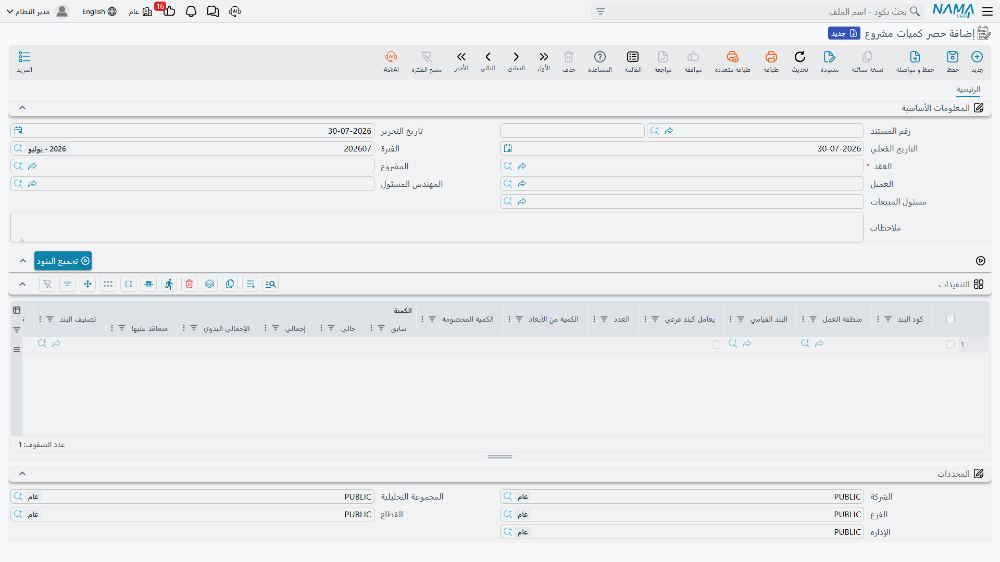

# حصر كميات المشروع

انقضى شهر من العمل في الموقع. ذهب أحدهم بشريط القياس ومجموعة الرسومات فأثبت أن 400 متر مكعب من أصل 1,000 من الحفر قد أُنجزت، وأن 20 متراً مكعباً من أصل 60 من الخرسانة المسلحة قد صُبَّت، وأن 500 متر مربع من أصل 2,000 من المباني قد أُقيمت. و**حصر كميات المشروع** هو المكان الذي يُكتب فيه هذا الحصر.

وهو بيان كميات خالص: لا يحمل أسعاراً، ولا توجيه مستند له، ولا يُسجل شيئاً على الإطلاق — لا قيداً محاسبياً، ولا حركة مخزنية، ولا طلب أعمال. مهمته كلها أن يجيب سؤالاً واحداً عن فترة واحدة: *كم من العمل أُنجز فعلاً؟* أما سؤال المال فيأتي لاحقاً على [المستخلص](/ar/modules/contracting/project-contracting/contracting-project-extracts.md).

## أول ما يجب فهمه

**مستند الحصر يسجل العمل المنجَز في هذا المستند وحده، لا العمل المنجَز حتى تاريخه.**

هذا أكثر سلوك يُفهم خطأً في وحدة المقاولات، ويستحق أن يُقال بأصرح عبارة ممكنة. في جدول *التنفيذات* يوجد عمود **الكمية | حالي** وعمود **الكمية | سابق**. أنت تكتب *الحالي* ولا شيء غيره، ومعناه "هذه الفترة". أما عمود *سابق* فيملؤه النظام من مستندات الحصر الأقدم لنفس العقد ونفس البند ونفس المرحلة، و**الكمية | إجمالي** هو مجموع الاثنين.

أما الرقم التراكمي — "نفّذنا حتى الآن 700 متر مكعب من أصل 1,000" — فلا يوجد على أي مستند حصر، بل يوجد على سطر البند في [عقد المشروع](/ar/modules/contracting/project-contracting/contracting-project-contract.md) نفسه، في حقل الكمية المنفذة الذي يحدّثه كل حصر يُعتمد.

فالخلاصة: **المستند يحمل الزيادة، والعقد يحمل الإجمالي التراكمي.** وكل ما بقي في هذه الصفحة نتيجةٌ لهذه القاعدة.

## تسجيل الحصر اختياري

لست مضطراً أبداً إلى تحرير مستند حصر. فمن العقد الموقَّع إلى المستخلص المحاسَب عليه طريقان مشروعان:

1. **طريق الحصر.** تحرّر حصر كميات للفترة، ثم تنشئ المستخلص *بناءً عليه*. فتُغذَّى سطور المستخلص بكميات الحصر، وتكون مقيدة بها افتراضياً — أي أن أرقام مهندس الحصر هي التي يُحاسَب عليها.
2. **طريق المستخلص وحده.** تترك حقل **بناءا على** في المستخلص فارغاً وتضغط *تجميع البنود* في المستخلص نفسه، فيسحب بنود العقد مباشرة وتكتب الكميات المحاسَب عليها فيه.

والطريقان متنافيان بالتصميم: فزر *تجميع البنود* في المستخلص يرفض العمل ما دام حقل **بناءا على** ممتلئاً، لأنه سيتصادم مع الكميات التي وفّرها الحصر أصلاً.

والشركات التي لديها إدارة حصر كميات تستخدم الطريق الأول دائماً تقريباً، لأنه يفصل قرارين ينبغي أن يكونا منفصلين: *ما الذي بُني فعلاً* (تقدير المهندس)، و*ما الذي نقبل اعتماده والمحاسبة عليه هذا الشهر* (قرار تجاري). أما شركات التشطيبات التي تحاسب مباشرة من جدول الكميات فتتجاوز الحصر كثيراً.

## أين تجده

| | |
|---|---|
| القائمة | المقاولات > مقاولة مشروع > حصر كميات مشروع |
| النوع | مستند — له دفتر وكود وتاريخ فعلي |
| توجيه المستند | لا يوجد. فهذا المستند ليست له خيارات توجيه في المقاولات، ولا حسابات تُضبط له، لأنه لا يسجل شيئاً |
| الترخيص | `contracting` |

## الشاشة

البيانات الأساسية قصيرة، لأن معظمها مشتق من العقد. تختار **العقد** فيأتي معه **المشروع** و**العميل** — ثم يُتحقق منهما مقابل العقد في كل حفظ، فلا يمكنك أن توجّه حصراً إلى مشروع عميل آخر من غير أن يُوقف. ثم هناك **المهندس المسئول** و**مسئول المبيعات**، و**التاريخ الفعلي** الذي يحدد الفترة التي يقع فيها العمل، و**ملاحظات**.

وفوق الجدول يوجد زر **تجميع البنود** الذي يسحب سطور بنود العقد إلى الجدول فلا يبقى عليك إلا كتابة الكميات.

### جدول التنفيذات — ما تكتبه وما يرسمه النظام

القليل من هذه الأعمدة هو من نصيبك:

| العمود | لك أم للنظام | ملاحظات |
|---|---|---|
| **كود البند** | لك | يجب أن يكون بنداً موجوداً في العقد |
| **الكمية \| حالي** | **لك** | الكمية المنفذة *في هذا المستند* |
| **نسبة التنفيذ** | لك، كبديل | تكتب نسبة بدل الكمية فتُشتق الكمية من الكمية المتعاقد عليها — والحقلان طريقتان للتعبير عن الشيء نفسه |
| **العدد** والطول والعرض والارتفاع | لك، كبديل | تتضاعف لتنتج **الكمية من الأبعاد** |
| **الكمية المخصومة** | لك | تُخصم من كمية الأبعاد، لأجل الفتحات التي لا تُحاسب عليها |
| **المرحلة** | لك | **إجبارية** حين يكون سطر بند العقد مقسّماً على [مراحل](/ar/modules/contracting/setup/contracting-phases-and-work-areas.md) |
| **الكمية \| سابق** | للنظام | مجموع الكميات *الحالية* في كل مستندات الحصر الأقدم لهذا العقد والبند والمرحلة |
| **الكمية \| إجمالي** | للنظام | السابق + الحالي |
| **الكمية \| متعاقد عليها** | للنظام | منسوخة من سطر بند العقد |
| **نسبة التنفيذ التراكمية** | للنظام | إلى أي حد وصل هذا البند تراكمياً |
| **البند القياسي** و**منطقة العمل** و**تصنيف البند** | لك أو منسوخة | وصفية، تُحمَل للتقارير |
| **كود بند الموازنة التنفيذية** و**وصفه** | لك | يربطان السطر بسطر من [الموازنة التنفيذية](/ar/modules/contracting/budgets/contracting-executive-budget.md) |
| **كمية المقايسة** و**الإجمالي اليدوي** و**ملاحظات** | لك | حقول مرجعية حرة |

والطرق الثلاث للوصول إلى الكمية تستحق المعرفة لأنها تغطي ثلاث حالات حقيقية في الموقع: كتابة **الكمية** تناسب الأعمال الكبيرة المقاسة بالمتر المكعب؛ وكتابة **النسبة** تناسب بنداً لا يمكنك الحكم عليه إلا بأنه "أُنجز نحو 60%" — سلّم أو بئر مصعد؛ وكتابة **الأبعاد** تناسب كل ما يُقاس من الرسم: العدد × الطول × العرض × الارتفاع، ناقصاً الفتحات التي استبعدتها.

## المثال العملي على مدى شهرين

تسير صفحات مقاولة المشروع كلها على عقد واحد:

**العقد PC-2026-001** — العميل *Al-Fanar Development*، المشروع *Tower A*، بقيمة إجمالية **230,000**.

| كود البند | الوصف | الكمية المتعاقد عليها | الوحدة | سعر الوحدة | قيمة العقد |
|---|---|---|---|---|---|
| `1.01` | حفر | 1,000 | م³ | 50 | 50,000 |
| `2.01` | خرسانة مسلحة | 60 | م³ | 900 | 54,000 |
| `3.01` | مباني بلوك | 2,000 | م² | 46 | 92,000 |
| `3.02` | بياض | 1,000 | م² | 34 | 34,000 |
| | **الإجمالي** | | | | **230,000** |

### فبراير — الحصر الأول

**PCE-001** بتاريخ فعلي 28 فبراير. يكتب المهندس ثلاثة أرقام في عمود **حالي** — والبياض لم يبدأ بعد فلا سطر له:

| البند | سابق *(النظام)* | **حالي** *(المكتوب)* | إجمالي *(النظام)* | نسبة التنفيذ |
|---|---|---|---|---|
| `1.01` | 0 | **400** | 400 | 40% |
| `2.01` | 0 | **20** | 20 | 33.3% |
| `3.01` | 0 | **500** | 500 | 25% |

وعند الاعتماد تُحدَّث سطور بنود العقد نفسه: البند `1.01` تصبح كميته المنفذة **400**، والبند `2.01` تصبح **20**، والبند `3.01` تصبح **500**.

### مارس — الحصر الثاني

**PCE-002** بتاريخ فعلي 31 مارس. ويبدأ البياض فيظهر له سطر رابع. ولاحظ ما يحدث لعمود *سابق* في السطور الثلاثة الأخرى من غير أن يلمسه أحد:

| البند | سابق *(النظام، من PCE-001)* | **حالي** *(المكتوب)* | إجمالي *(النظام)* |
|---|---|---|---|
| `1.01` | 400 | **300** | 700 |
| `2.01` | 20 | **20** | 40 |
| `3.01` | 500 | **600** | 1,100 |
| `3.02` | 0 | **200** | 200 |

فتقرأ سطور بنود العقد الآن **700** و**40** و**1,100** و**200** كميةً منفذة. مستندان يحمل كل منهما عمل شهر، وسطر عقد واحد يحمل الإجمالي.

::: tip اقرأ المستندين جنباً إلى جنب مرة واحدة
إن كنت تدرّب أحداً على هذه الوحدة، فاعرض PCE-001 و PCE-002 على الشاشة معاً واسأله: كم الكمية المنفذة من البند `1.01`؟ الجواب 700، وهو ليس على أي من المستندين — بل على العقد. وحين تستقر هذه الفكرة يصبح المستخلص مفهوماً أيضاً، لأنه يعمل بالطريقة نفسها تماماً.
:::

## الحصر بتاريخ سابق يعيد ترقيم البقية

هب أن حصر يناير وصل متأخراً وأُدخل بعد المستندين السابقين بتاريخ فعلي 31 يناير. لن تحتاج إلى تصحيح شيء بيدك: فعند الاعتماد يعيد النظام المرور على كل مستندات الحصر لهذا العقد بترتيب التاريخ الفعلي، ويعيد ختم أرقام السابق والإجمالي والنسبة التراكمية للمستندات التي تليه. فيتوقف عمود *سابق* في PCE-001 عن أن يكون صفراً، ويتبعه ما في PCE-002.

ولهذا كان عمودا السابق والإجمالي للقراءة فقط، ولهذا لا يجوز أن "تساعد" النظام بكتابة رقم تراكمي في **حالي**؛ فإن فعلتَ ذلك حسب كل مستند تالٍ الكمية مرتين.

## ما يمنع الحفظ

الفحوص موضوعة لتمنع الحصر من وصف عمل لا يحتويه العقد:

- **جدول التنفيذات لا يجوز أن يكون فارغاً.**
- **كود البند يجب أن يوجد في العقد.** والبنود الرئيسية (الأب) مستبعدة من قائمة الأكواد المسموحة، إلا إذا فُعِّل خيار الوحدة الذي يُظهر أكواد البنود الرئيسية في الحصر من [إعدادات المقاولات](/ar/modules/contracting/contracting-configuration.md).
- **لا يجوز تكرار زوج البند والمرحلة** في المستند الواحد. فإن احتجت إلى قياسين للبند نفسه في الفترة نفسها فاجمعهما أو افصل المستند.
- **المرحلة إجبارية** كلما كان سطر بند العقد مقسّماً على مراحل.
- **المشروع والعميل يجب أن يطابقا ما في العقد.**
- **النسبة المسموح بها سقف.** فكل سطر بند في العقد يحمل نسبة مسموحاً بها — 5% على كل بنود العقد PC-2026-001 — ولا يجوز أن يتجاوز *إجمالي* المنفَّذ الكمية المتعاقد عليها بأكثر منها. فالبند `1.01` يمكن تنفيذه حتى 1,050 م³ ولا أكثر. وهناك خيار في إعدادات الوحدة يرفع هذا الفحص كلياً للشركات التي تحصر فعلاً فوق العقد ثم تسوّي الأمر بتعديل عقد.
- **العقد الذي صار له مستخلص ختامي معتمد مغلق** أمام أي حصر جديد، إلا إذا فُعِّل خيار الوحدة الذي يسمح باستخدام العقود المنتهية.
- **العقد الذي يصنّفه نوع مقايسته كعقد تعديل** لا يصلح للحصر ولا للمستخلصات أصلاً.

وهناك قيد آخر يستحق المعرفة لأنه يغيّر طريقة عمل الفِرَق: خيار في إعدادات الوحدة يمنع تعديل الحصر إذا بُني عليه مستخلص. فإن كان مفعّلاً وجب إلغاء المستخلص أولاً لتصحيح خطأ في الحصر، وإن لم يكن مفعّلاً فإن فحوص الاتساق في المستخلص نفسه هي شبكة الأمان.

## بعد المستخلص

عند اعتماد مستخلص مبني على هذا الحصر يحدث شيئان هنا: يُوسَم الحصر بأنه استُخلص، وتُسجَّل الكمية المحاسَب عليها من كل سطر عليه. وبهذا تعرف الوحدة أي عمل محصور تحوّل إلى مال وأيّه لم يتحول، وهذا ما يقرأه زر *تجميع البنود* في المستخلص عند حساب الكمية المتبقية.

وافتراضياً لا يستطيع المستخلص تغيير الكميات التي ورثها من الحصر — وخيار في [توجيه المستخلص](/ar/modules/contracting/document-terms/contracting-terms-extracts.md) هو ما يخفف هذا القيد، لأجل الشركات التي يعتمد فيها الفريق التجاري روتينياً أقلَّ مما حصره المهندس.

## إلى أين بعد ذلك

- [مستخلص المشروع](/ar/modules/contracting/project-contracting/contracting-project-extracts.md) — تحويل الكميات المنفذة إلى مطالبة معتمدة بالدفع.
- [عقد المشروع](/ar/modules/contracting/project-contracting/contracting-project-contract.md) — حيث تسكن الكميات التراكمية المنفذة والمحاسَب عليها.
- [دورة مقاولة المشروع](/ar/modules/contracting/project-contracting/contracting-owner-cycle.md) — موضع هذه الخطوة من سلسلة جانب العميل كلها.
