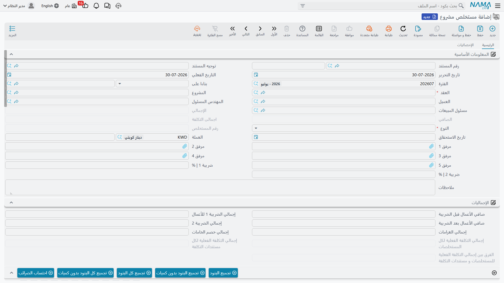
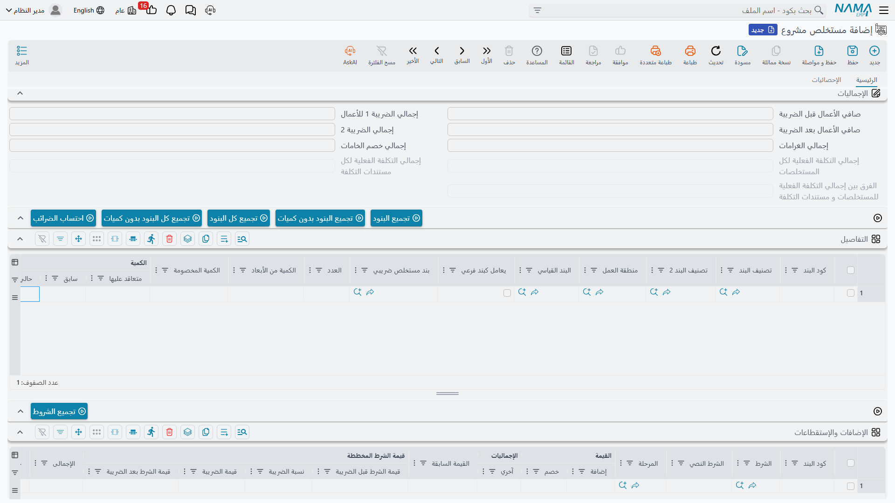
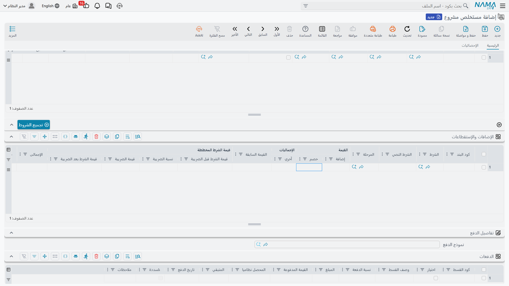
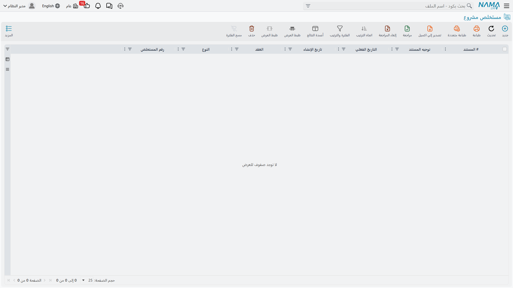

# مستخلص المشروع

توقيع العقد في نما لا يسجل شيئاً، وتسجيل الحصر لا يسجل شيئاً. و**المستخلص** هو المستند الذي تكسب فيه شركة المقاولات مالها أخيراً: فهو يبيّن، بنداً بنداً، مقدار العمل المحاسَب عليه هذه المرة، ويسعّره بأسعار العقد، ويضيف الضريبة، ثم يخصم كل ما ينص العقد على احتجازه أو استردادِه — المحتجزات، والدفعة المقدمة التي دفعها العميل سابقاً، وأي غرامات — فيصل إلى **الصافي المستحق**.

وهو المطالبة المعتمدة بالدفع التي ترسلها إلى مالك المشروع، وهو المستند الذي يُرسل إلى مصلحة الضرائب كفاتورة إلكترونية، وهو في جانب العميل من هذه الوحدة **المستند الوحيد الذي يصل إلى الدفاتر أصلاً**. وكل ما قبله تحضير.

ولهذا كانت هذه الصفحة أحق صفحات الوحدة بالقراءة المتأنية.



## أين تجده

| | |
|---|---|
| القائمة | المقاولات > مقاولة مشروع > مستخلص مشروع |
| النوع | مستند |
| توجيه المستند | **إجباري.** فكل حساب يسجل عليه هذا المستند يأتي من [توجيهه](/ar/modules/contracting/document-terms/contracting-terms-extracts.md) |
| الترخيص | `contracting` |

## المستخلص تزايدي أيضاً

كما في [حصر الكميات](/ar/modules/contracting/project-contracting/contracting-project-execution.md) تماماً: **المستخلص يحاسب على عمل فترته وحدها.** والعمود الذي تملؤه في جدول التفاصيل هو **الكمية | حالي**، ومعناه: الكمية المحاسَب عليها *الآن*.

أما **الكمية | سابق** فمشتقة: هي الكمية التي حُوسب عليها في كل مستخلص أقدم من مستخلصات هذا العقد لنفس البند. و**الكمية | إجمالي** هي السابق زائد الحالي، و**نسبة الإتمام** هي هذا الإجمالي مقابل الكمية المتعاقد عليها. وكما في الحصر، فإن الرقم التراكمي "المحاسَب عليه حتى تاريخه" يسكن على سطر البند في [العقد](/ar/modules/contracting/project-contracting/contracting-project-contract.md) لا على أي مستخلص.

فخصم المستخلصات السابقة ليس شيئاً تفعله أنت، بل هو شكل المستند نفسه: أنت تحاسب على 300 متر مكعب هذا الشهر لأن هذا ما جرى هذا الشهر، وكون 400 متر مكعب قد خرجت الشهر الماضي هو سبب أن *سابق* تقول 400 وأن سطر العقد يقرأ 700 بعد ذلك.

::: details الأنماط الثلاثة الاختيارية التي تسعّر تراكمياً
بعض المالكين والاستشاريين يشترطون أن يُعرَض المستخلص تراكمياً: "الأعمال حتى تاريخه 700 م³ بسعر 50 = 35,000، ناقصاً ما سبق اعتماده 20,000، فهذه الشهادة 15,000". وثلاثة خيارات في توجيه المستخلص تحوّل التسعير إلى هذا الشكل. وهي خيارات؛ فالافتراضي — وهو موضوع هذه الصفحة كلها — هو النمط التزايدي.

- **احتساب الأسعار بناءً على إجمالي الكمية** — يُسعَّر السطر على الكمية *الإجمالية*، ثم يُخصم مجموع قيم المستخلصات السابقة.
- **احتساب فرق الأسعار من المستخلص السابق فقط** — يُسعَّر على الإجمالي كذلك، لكن يُخصم المستخلص السابق مباشرةً وحده، وتُسجَّل الفروق الناتجة في أعمدة فروق خاصة بها، ولها أزواج حسابات خاصة في التوجيه.
- **إعتبار قيم خصم 1 وخصم 2 والضرائب من المستخلصات السابقة** — المعاملة التراكمية نفسها مطبقة على الخصومات والضرائب، فيكون المحمَّل هذه المرة هو المبلغ التراكمي ناقصاً ما أخذته المستخلصات الأقدم.

والخياران الأولان وصفان لحسابين مختلفين للفكرة نفسها، فاختر أحدهما؛ وليسا معدّين للجمع بينهما.
:::

## النوع يحدد كثيراً

**النوع** إجباري، وهو ثلاثة:

| النوع | ما يختلف فيه |
|---|---|
| **مبدأي** | الشهادة الأولى. ولا يُسمح إلا **بمستخلص مبدئي واحد** للعقد، وشروط العقد الموسومة بـ *مع المستخلص المبدئي* لا تُجمَّع إلا هنا — مقابل التجهيز، وأقساط التأمين، وكل ما يُستحق مرة واحدة في البداية |
| **جاري** | الشهادة الدورية العادية، ولا سلوك خاصاً لها، وهي أكثر المستخلصات |
| **ختامي** | الشهادة الختامية — انظر *ما يفعله المستخلص الختامي على خلاف غيره* أدناه |

وبمجرد اعتماد مستخلص ختامي على عقد لا يمكن حفظ أي مستخلص آخر عليه، ويُرفض عليه الحصر والغرامات كذلك — إلا إذا فُعِّل خيار الوحدة الذي يسمح باستخدام العقود المنتهية من [إعدادات المقاولات](/ar/modules/contracting/contracting-configuration.md).

## ملء جدول التفاصيل

هناك طريقان يستبعد كل منهما الآخر.

**من حصر كميات.** تضع [مستند الحصر](/ar/modules/contracting/project-contracting/contracting-project-execution.md) في **بناءا على** فتُغذَّى سطور المحاسبة منه، كميةً بكمية. وتكون تلك الكميات مقيدة افتراضياً — وخيار في التوجيه هو ما يسمح للفريق التجاري باعتماد أقل مما حُصر.

**من العقد، بأزرار التجميع.** تترك **بناءا على** فارغاً وتستخدم شريط الأزرار فوق الجدول. وهي أربعة أزرار لأربع حالات حقيقية:

| الزر | ما يسحبه |
|---|---|
| **تجميع البنود** | البنود التي بقيت لها كمية فقط، مع ملء الكمية |
| **تجميع البنود بدون كميات** | البنود نفسها، والكميات تُترك لك |
| **تجميع كل البنود** | *كل* بنود العقد، بقيت لها كمية أم لا، مع ملء الكمية |
| **تجميع كل البنود بدون كميات** | كل البنود، والكميات فارغة |

والزوج الخاص بـ "كل البنود" أهم مما يبدو: فهو الطريق الوحيد لإحضار بند صارت كميته المتبقية صفراً — بند تعيد اعتماده، أو بند كانت نسبة المحاسبة عليه أقل من 100% في المرة السابقة.

وهناك خياران في التوجيه يضبطان الكمية الناتجة: أحدهما يملأ السطر بالكمية المتبقية *كاملة* من المستخلص السابق، والآخر يترك الكمية صفراً عن قصد حتى لا يحاسب أحد سهواً على مستند فُتح للاطلاع فقط.

::: warning التجميع يرفض العمل ما دام "بناءا على" ممتلئاً
أزرار التجميع وطريق "بناءا على" بديلان لا يجتمعان. فإن ضغطت التجميع على مستخلص مبني على حصر رفض العمل بدل أن يطمس كميات الحصر.
:::

وزر **احتساب الضرائب** يعيد قراءة نسب الضريبة من كل [بند قياسي](/ar/modules/contracting/setup/contracting-standard-terms.md) مستخدم في السطور ويعيد حساب مجموعة المبالغ. استخدمه بعد أن يغيّر أحدهم سياسة ضريبية في منتصف المشروع.

### ما في جدول التفاصيل



| العمود | لمن | المعنى |
|---|---|---|
| **كود البند** | لك | يجب أن يوجد في العقد أو في حصر المصدر |
| **البند القياسي** | لك أو منسوخ | يوفّر سياسة الضريبة، ويمكنه تجاوز حسابات الإيراد لهذا السطر وحده |
| **الكمية \| حالي** | **لك** | الكمية المحاسَب عليها في هذا المستخلص |
| **الكمية \| سابق** و**إجمالي** و**نسبة الإتمام** | للنظام | الخصم الموصوف أعلاه |
| **الكمية \| متعاقد عليها** | للنظام | من بند العقد |
| **العدد** وأبعاده و**الكمية المخصومة** | لك | حاسبة الأبعاد نفسها التي في الحصر: الكمية المحاسَب عليها = كمية الأبعاد ناقصاً الكمية المخصومة |
| **الكمية المنفذة** و**المنفذ \| %** | للنظام | منقولة من أرقام تنفيذ بند العقد، لترى كم تحاسب فعلاً من الذي حُصر |
| **سعر الوحدة** | لك أو من العقد | وخيار في التوجيه يجبره على مساواة سعر العقد ويمنع أي قيمة غيره |
| **سعر الوحدة الأصلي** | للنظام | سعر العقد، محفوظاً للمقارنة |
| **نسبة المرحلة من السعر** | لك | تعدّل سعر الوحدة عند المحاسبة على البند بالمراحل |
| **السعر الكلي** و**الصافي** | للنظام | قيمة السطر؛ والصافي **بعد** الضريبة |
| **قيمة الأعمال** | للنظام | قيمة أعمال البند التراكمية: الكمية الإجمالية × سعر الوحدة |
| **خصم 1 \| % والقيمة** و**ضريبة مبيعات \| % والقيمة** | لك | خصم وضريبة على مستوى السطر |
| **الإضافات من الشروط** و**الاستقطاعات من الشروط** و**الصافي بعد الإضافات والاستقطاعات** | للنظام | الشروط التي تحمل كود البند نفسه، منزَّلة على السطر |
| **الصافي / القيمة المستحقة في المستخلصات السابقة** | للنظام | تُختم بعد الاعتماد: ما اعتمدته المستخلصات الأقدم لهذا البند |
| **تكلفة الوحده** و**اجمالى التكلفة** | لك أو منسوخة | التكلفة *المخططة* لهذا العمل |
| **الكمية المكلفة** و**التكلفة الفعلية** | للنظام | التكلفة *الفعلية* التي استهلكها المستخلص — انظر قسم التكلفة الفعلية أدناه |
| **المرحلة** | لك | إجبارية عند تقسيم البند على مراحل |

::: tip ضع المال على البنود الفرعية
البند الأب في شجرة البنود عنوان تجميعي. والقيد المحاسبي للإيراد يتجاوز سطور البنود الأب عن قصد، فالسطر الأب الذي يحمل كمية وسعراً يظهر في الشهادة ولا ينتج قيد الإيراد الذي تتوقعه. حاسب على البنود الفرعية واترك الآباء تجمعها.
:::

## الجداول السبعة، ومن يملأ كلاً منها

| الجدول | ما هو | من يملؤه |
|---|---|---|
| **التفاصيل** | سطور المحاسبة | أزرار التجميع، أو حصر المصدر، أو يدك |
| **بنود المراحل** | المعلومات نفسها مقلوبةً — سطر لكل بند ومجموعة أرقام لكل مرحلة من مراحل العقد. ولا يظهر إلا إذا فُعِّل خيار الوحدة الخاص ببنود المراحل | أزرار التجميع؛ ويُنسخ عند الحفظ إلى التفاصيل، وتُرفع الإجماليات إليه بعد الاعتماد |
| **الإضافات والإستقطاعات** (جدول الشروط) | المحتجزات واسترداد الدفعة المقدمة والغرامات والمكافآت — كل ما يبعد الصافي المستحق عن قيمة الأعمال | زر *تجميع الشروط*، أو تلقائياً عند الحفظ |
| **الدفعات** | خطة أقساط *هذا* المستخلص، مولَّدة من نموذج دفع. ويُتحقق من مطابقتها لإجمالي المستخلص، فلا بد أن تتوازن | أنت، عبر النموذج وزر التوليد |
| **سندات الدفع** | سندات القبض المطبقة على هذا المستخلص | النظام، مع تسجيل السندات |
| **بيانات إضافية** | عشرة أرقام وعشرة نصوص وخمسة تواريخ وثلاثة مراجع — مساحة حرة لبيانات خاصة بالعميل، لا تقرأها الوحدة | أنت |
| **التفاصيل الضريبية** | تجميعة الفاتورة الإلكترونية — سطور التفاصيل مجمّعة ببند المستخلص الضريبي. وهذه، لا التفاصيل، هي ما يُرسَل لمصلحة الضرائب | النظام، في كل حفظ. انظر [الضرائب على المستخلصات](/ar/modules/contracting/project-contracting/contracting-extract-taxes.md) |

## الشروط — حيث يتشكل الصافي المستحق فعلاً



هذا هو الجزء الذي يبحث عنه الناس فلا يجدونه، ويستحق قولاً صريحاً: **لا يوجد في المستخلص حقل للمحتجزات ولا حقل لاسترداد الدفعة المقدمة.** فكلاهما يأتي سطراً في جدول *الإضافات والإستقطاعات*، وكلاهما [شرط تعاقدي](/ar/modules/contracting/setup/contracting-conditions.md) — تعريف صغير مكتفٍ بنفسه يعرف نسبته وأساس حسابه وزوج حساباته.

وينتهي إلى ذلك الجدول مجموعتان مختلفتان.

### شروط العقد

هذه تُنسخ من جدول الشروط في العقد نفسه، ولكل شرط **نوع** يحدد *متى* يُطبَّق:

| نوع الشرط | يُجمَّع على |
|---|---|
| **مع كل مستخلص** | كل مستخلص |
| **مع المستخلص المبدئي** | المستخلص المبدئي وحده |
| **مع المستخلص الختامي** | المستخلص الختامي وحده |
| **إنتهاء عقد** | المستخلص الختامي، بعد أن ينتهي العقد |
| **مرتبط بنسبة إتمام** | المستخلص الذي تبلغ فيه نسبة إتمام البند الرقم المكتوب في سطر الشرط |
| **أخري** | كل مستخلص |
| **شرط نصي** | لا يُجمَّع أبداً — فهو نص تعاقدي لا حساب |

و**نوع قيمة** يحدد *كم*:

| نوع القيمة | المبلغ |
|---|---|
| **قيمة** | المبلغ المسطّح في سطر الشرط |
| **نسبة من المستحق** | نسبة من قيمة أعمال هذا المستخلص، قبل الخصومات والضرائب |
| **نسبة من الإجمالي** | نسبة من قيمة العقد كلها |
| **نسبة من اجمالى القيمة المستحقة** | نسبة من إجمالي القيمة المستحقة في هذا المستخلص |
| **نسبة من الإجمالي على مستوى البند** / **نسبة من المستحق على مستوى البند** | نسبة من سطر بند واحد في هذا المستخلص، مطابقاً بكود البند |
| **استعلام** | ناتج الاستعلام المحفوظ على الشرط |
| **نسبة من معادلة مخصصة** | نسبة من معادلة تكتبها، تُقيَّم على سطور المستخلص الحالي، أو السابق، أو كليهما، أو الحالي أو السابق إذا لم توجد كمية |

والشروط الموسومة بعدم التجميع في شروط المستخلص تُتجاوز، وكذلك الشروط المرتبطة بمستند خاص بها.

### سندات الدفع — الدفعات المقدمة والغرامات

المجموعة الثانية ليست على العقد أصلاً. فعند تجميع الشروط يبحث المستخلص عن كل [دفعة مقدمة](/ar/modules/contracting/project-contracting/contracting-project-advances.md) وكل [غرامة](/ar/modules/contracting/project-contracting/contracting-project-fines.md) معتمدة على هذا العقد بقي لها رصيد وتاريخها في أو قبل تاريخ المستخلص، فيحوّل كلاً منها إلى سطر **استقطاع**. والذي يُخصم تحدده **طريقة الدفع** المكتوبة على الدفعة أو الغرامة:

| طريقة الدفع | ما يُستَرد في المستخلص العادي |
|---|---|
| **أول مستخلص تالي** | الرصيد المتبقي كله، في المستخلص التالي مباشرة |
| **قيمة ثابتة مع كل مستخلص تالي** | المبلغ الثابت، أو الرصيد المتبقي إن كان أصغر |
| **نسبة مع كل مستخلص** | تلك النسبة من إجمالي المستند نفسه، بحد أعلى هو الرصيد المتبقي |
| **نسبة من المستحق مع كل مستخلص** | تلك النسبة من قيمة أعمال *هذا المستخلص*، بحد أعلى هو الرصيد المتبقي |
| **المستخلص الختامي** | لا شيء — هذه تنتظر المستخلص الختامي |

وفي المستخلص **الختامي** يُتجاوز ذلك كله: فيُسحب الرصيد المتبقي كله من كل دفعة وكل غرامة، ويُرفض الاعتماد إن بقي شيء مستحقاً بعد ذلك.

::: info وهذان هما المصدران الوحيدان
شروط العقد والدفعات المقدمة والغرامات هي *كل* ما يمكن أن يحرّك الصافي المستحق في مستخلص العميل. وعلى الخصوص: خصم الخامات — أي استقطاع تكلفة الخامات التي وردتها إلى الطرف الذي تدفع له — آلية **في جانب مقاول الباطن** وحده. فعلى [مستخلص مقاول الباطن](/ar/modules/contracting/contractor-contracting/contracting-contractor-extracts.md) تُخصم الخامات التي صرفتها له من شهادته، ولا نظير لذلك في جانب العميل، لأنك لا تصرف خامات إلى العميل.
:::

### متى تُجمَّع الشروط

إما أن تضغط **تجميع الشروط** فوق الجدول، وإما أن يفعلها المستخلص عنك عند الحفظ. وأي الاثنين ينطبق يحدده خيار في التوجيه — *تجميع سندات الدفع اليا مع الحفظ* — بثلاثة أوضاع: أبداً، أو في المستخلص الختامي وحده، أو في كل حفظ.

### كيف يصير الاستقطاع شيكاً أصغر

يحدث للبيانات الأساسية شيئان عند ملء جدول الشروط:

```
الصافي = قيمة الأعمال بالضريبة
        + مجموع شروط الإضافة
        − مجموع شروط الاستقطاع

إجمالي القيمة المستحقة = الحساب نفسه على جانب القيمة المستحقة
```

وبالتوازي تُنزَّل المبالغ على سطور التفاصيل المطابقة بكود البند، في **الإضافات من الشروط** و**الاستقطاعات من الشروط**، حتى تُظهر الشهادة المطبوعة الاستقطاع أمام العمل المرتبط به.

وهناك ضبط في الشرط يستحق المعرفة لأنه يفصل فكرتين يخلط الناس بينهما: **عدم التأثير على المتبقي**. فالشرط الموسوم بذلك يخفض قيمة الشهادة لكنه ما زال متوقعاً تحصيله نقداً، فيُعاد إضافته عند حساب متبقي التحصيل في المستخلص. والمحتجزات لا تُوسم بذلك عادةً — فأنت فعلاً لا تحصّلها بعد.

## المثال العملي — مستخلصان على عقد واحد

عقدنا، محمولاً من [صفحة الحصر](/ar/modules/contracting/project-contracting/contracting-project-execution.md):

**PC-2026-001** — العميل *Al-Fanar Development*، المشروع *Tower A*، بقيمة **230,000**، والضريبة 15%.

| البند | الوصف | المتعاقد عليه | سعر الوحدة | القيمة |
|---|---|---|---|---|
| `1.01` | حفر | 1,000 م³ | 50 | 50,000 |
| `2.01` | خرسانة مسلحة | 60 م³ | 900 | 54,000 |
| `3.01` | مباني بلوك | 2,000 م² | 46 | 92,000 |
| `3.02` | بياض | 1,000 م² | 34 | 34,000 |

وعلى العقد شرط واحد ودفعة مقدمة واحدة في الانتظار:

- **RET-10 محتجزات** — شرط عقد، نوعه *مع كل مستخلص*، وتأثيره *إستقطاع*، ونوع قيمته *نسبة من المستحق* بـ 10%. وحساباته على الشرط نفسه: مدين **محتجزات مدينة**، ودائن **عملاء**.
- **PAP-001 دفعة مقدمة** — 46,000 (أي 20% من العقد)، بلا ضريبة عليها، وطريقة دفعها *نسبة مع كل مستخلص* بـ 25%، وتشير إلى شرط حساباته مدين **دفعات مقدمة من العملاء** ودائن **عملاء**.

وتوجيهه `EXT-STD` مضبوط: العملاء مقابل إيراد المقاولات لقيمة العمل، وإيراد المقاولات مقابل ضريبة مخرجات مستحقة للضريبة، وتكلفة أعمال المقاولات مقابل أعمال تحت التنفيذ للتكلفة المخططة. والشروط تُجمَّع تلقائياً عند الحفظ، والقيد مختصر فتظهر الحسابات المتكررة مرة واحدة.

### المستخلص الأول — فبراير

مبنيّ على الحصر PCE-001، نوعه *جاري*، تاريخه الفعلي 28 فبراير. والكميات من الحصر: 400 م³ حفراً و20 م³ خرسانةً و500 م² مبانيَ.

| البند | سابق | **حالي** | إجمالي | سعر الوحدة | السعر | ضريبة 15% | الصافي |
|---|---|---|---|---|---|---|---|
| `1.01` | 0 | **400** | 400 | 50 | 20,000 | 3,000 | 23,000 |
| `2.01` | 0 | **20** | 20 | 900 | 18,000 | 2,700 | 20,700 |
| `3.01` | 0 | **500** | 500 | 46 | 23,000 | 3,450 | 26,450 |
| **الإجمالي** | | | | | **61,000** | **9,150** | **70,150** |

فتقرأ مجموعة الإجماليات: صافي الأعمال قبل الضريبة **61,000**، والضريبة **9,150**، وصافي الأعمال بعد الضريبة **70,150**.

والشروط المجمَّعة:

| الشرط | من أين | كيف يُحسب | الاستقطاع |
|---|---|---|---|
| RET-10 محتجزات | من العقد | 10% × 61,000 قيمة الأعمال | **6,100** |
| استرداد الدفعة المقدمة | من PAP-001 | 25% من 46,000 قيمة الدفعة، بحد أعلى 46,000 المتبقية | **11,500** |

ومن ثم:

```
الأعمال بالضريبة        70,150
ناقصاً المحتجزات       ( 6,100)
ناقصاً الدفعة المستردة (11,500)
الصافي المستحق          52,550
```

### القيد الذي ينتجه المستخلص الأول

اعتماد المستخلص لا يكتب القيد في اللحظة نفسها، بل يرفع **طلب أعمال** تجري معالجته في الخلفية: فيُحفظ المستند فوراً ويظهر القيد بعد لحظة. وإن فشلت المعالجة (فترة مغلقة، أو حساب ناقص، أو ذمة لا تُحل) وجدتَ الطلب في شاشة قائمة **طلبات الأعمال**، فتفلتر على الفاشل وتحدد السطر وتستخدم **المزيد ← إعادة معالجة** أو **إعادة اعتماد** بعد إصلاح السبب. ولأن الطلب محفوظ على المستخلص، فإن إعادة الاعتماد تحدّث القيد نفسه ولا تنشئ ثانياً.

وما يقوله القيد، بالكلمات:

| الحساب | مدين | دائن |
|---|---|---|
| عملاء — القيمة المعتمدة كلها بالضريبة | 70,150 | |
| إيراد المقاولات — المبلغ الإجمالي نفسه | | 70,150 |
| إيراد المقاولات — الضريبة المخرَجة من الإيراد | 9,150 | |
| ضريبة مخرجات مستحقة | | 9,150 |
| محتجزات مدينة — نسبة الـ 10% المحتجزة | 6,100 | |
| عملاء — المحتجزات منقولة خارج الذمم العادية | | 6,100 |
| دفعات مقدمة من العملاء — الدفعة تُسوّى | 11,500 | |
| عملاء — الدفعة مخصومة من المطالبة | | 11,500 |
| تكلفة أعمال المقاولات — التكلفة المخططة للعمل المحاسَب عليه | *التكلفة المخططة* | |
| أعمال تحت التنفيذ | | *التكلفة المخططة* |

واقرأ الحسابين المهمين رأسياً فيتضح الشكل:

- **العملاء** يصفو إلى 70,150 − 6,100 − 11,500 = **52,550** — وهو الصافي المستحق بالحرف.
- **إيراد المقاولات** يصفو إلى 70,150 − 9,150 = **61,000** — وهو قيمة الأعمال قبل الضريبة بالحرف.

وهذا السطر الثاني هو سبب ظهور حساب الإيراد مرتين: فالقيمة المعتمدة تُسجَّل بالإجمالي ثم تُرفَع الضريبة من الإيراد إلى التزام الضريبة، فيستقر الإيراد على الرقم الصحيح. وإن ضُبط التوجيه على غير ذلك انتهت الضريبة داخل الإيراد.

### ما غيّره المستخلص الأول في مواضع أخرى

| الموضع | ماذا |
|---|---|
| بنود العقد `1.01` / `2.01` / `3.01` | الكمية المحاسَب عليها صارت 400 / 20 / 500 |
| شرط العقد RET-10 | القيمة المستقطعة 6,100 (وهي تتراكم لأنه شرط *مع كل مستخلص*) |
| الدفعة PAP-001 | إجمالي المسترد 11,500، والمتبقي **34,500** |
| الحصر PCE-001 | وُسم بأنه استُخلص، وسطوره تحمل الكمية المحاسَب عليها |
| المستخلص | رقم المستخلص 1 |

### المستخلص الثاني — مارس

مبنيّ على الحصر PCE-002، نوعه *جاري*، تاريخه الفعلي 31 مارس. وهذا الشهر: 300 م³ حفراً و20 م³ خرسانةً و600 م² مبانيَ وأول 200 م² من البياض. وانظر عمود *سابق* — فهو الرقم التراكمي من العقد، يصل بلا أن يُكتب.

| البند | سابق | **حالي** | إجمالي | السعر | ضريبة 15% | الصافي |
|---|---|---|---|---|---|---|
| `1.01` | 400 | **300** | 700 | 15,000 | 2,250 | 17,250 |
| `2.01` | 20 | **20** | 40 | 18,000 | 2,700 | 20,700 |
| `3.01` | 500 | **600** | 1,100 | 27,600 | 4,140 | 31,740 |
| `3.02` | 0 | **200** | 200 | 6,800 | 1,020 | 7,820 |
| **الإجمالي** | | | | **67,400** | **10,110** | **77,510** |

والشروط: محتجزات 10% × 67,400 = **6,740**؛ واسترداد الدفعة المقدمة 25% من 46,000 = **11,500** مرة أخرى، وما زال المتبقي 34,500 يغطيها.

```
الأعمال بالضريبة        77,510
ناقصاً المحتجزات       ( 6,740)
ناقصاً الدفعة المستردة (11,500)
الصافي المستحق          59,270
```

وبعد الاعتماد تقرأ كميات العقد المحاسَب عليها 700 و40 و1,100 و200، ويصير إجمالي ما استُقطع من شرط المحتجزات 6,100 + 6,740 = **12,840**، وتُظهر الدفعة المقدمة 23,000 مستردة و**23,000** ما زالت قائمة.

### تاريخ الشهادات في جدول واحد

| | EXT-001 | EXT-002 | التراكمي |
|---|---|---|---|
| قيمة الأعمال قبل الضريبة | 61,000 | 67,400 | 128,400 |
| ضريبة 15% | 9,150 | 10,110 | 19,260 |
| الإجمالي | 70,150 | 77,510 | 147,660 |
| محتجزات 10% | (6,100) | (6,740) | (12,840) |
| الدفعة المستردة | (11,500) | (11,500) | (23,000) |
| **الصافي المستحق** | **52,550** | **59,270** | **111,820** |
| المتبقي من الدفعة المقدمة | 34,500 | 23,000 | — |
| المحاسَب عليه من العقد (230,000) | 61,000 | 128,400 | 55.8% |

والقصة نفسها بالكميات، وهي ما ينتهي إليه سطر البند على العقد:

| البند | المعتمد حتى تاريخه | المتعاقد عليه |
|---|---|---|
| `1.01` حفر | 700 م³ | 1,000 م³ |
| `2.01` خرسانة مسلحة | 40 م³ | 60 م³ |
| `3.01` مباني بلوك | 1,100 م² | 2,000 م² |
| `3.02` بياض | 200 م² | 1,000 م² |

وكل رقم في هذين الجدولين مشتق. والأرقام الوحيدة التي كتبها إنسان هي الكميات السبع المحاسَب عليها.

## ما يفعله المستخلص الختامي على خلاف غيره

المستخلص الختامي ليس مجرد آخر مستخلص، بل يغيّر السلوك في ستة أوجه:

1. **يُسحب كل ما بقي قائماً.** فكل دفعة مقدمة وكل غرامة بقي لها رصيد تُخصم كاملة، بغضّ النظر عن نسبتها أو قيمتها الثابتة.
2. **ويُرفض الاعتماد إن بقي شيء مستحقاً بعد ذلك**، برسالة تسمي سند الدفع والمبلغ الباقي عليه. أما البواقي الكسرية بمقدار جزء من مئة أو أقل فتُصفَّر حتى لا تعطلك.
3. **وتُجمَّع الشروط من نوع *مع المستخلص الختامي* و*إنتهاء عقد*** — وهي عادةً الإفراج عن المحتجزات التي تراكمت طول المشروع.
4. **وتُسترد سندات الدفع التي طريقتها *المستخلص الختامي*** هنا ولا في غيره، ويُسحب فيها حتى سندات الدفع اللاحقة التاريخ.
5. **ويُوسَم العقد بأنه منتهٍ**، فيُغلق أمام أي حصر أو مستخلص أو غرامة جديدة.
6. **ويُحسب فرق التكلفة** — التكلفة الفعلية المسجلة في مستخلصات العقد كلها مقابل التكلفة الفعلية المسجلة في مستندات التكلفة — ويُسجَّل الفرق بزوج حسابات خاص به في التوجيه. وتُوسَم شروط العقد كلها بأنها مكتملة.

وإلغاء المستخلص الختامي يعكس وسم الانتهاء، فيُفتح العقد من جديد.

## التكلفة الفعلية التي يستهلكها المستخلص

يفعل المستخلص شيئاً آخر لا علاقة له بالمحاسبة على الأعمال: يستهلك التكلفة الفعلية.

فعند الاعتماد يبحث كل سطر تفاصيل عن سطور [حصر التكلفة](/ar/modules/contracting/costs/contracting-cost-execution.md) المفتوحة على العقد نفسه وكود البند نفسه، بتاريخ قبل المستخلص، فيسحب منها الأقدم أولاً. وما يسحبه يُسجَّل على السطر في **الكمية المكلفة** و**التكلفة الفعلية**، وتُعرَض عمليات السحب كلها في صفحة **الإحصائيات** من المستخلص تحت *مصادر التكلفة*، إلى جانب *سندات الغرامة* التي استوعبها المستخلص.

وهناك ملاحظتان عمليتان في قراءة تلك القائمة: كل سطر يُختم بسعر وحدة *جارٍ* وإجمالي *جارٍ* بينما يسحب السطر من دفعات تكلفة متتابعة، فلا تضرب الكمية المستهلكة في سعر الوحدة توقعاً للإجمالي، ولا تجمع عمود الإجمالي كأن كل سطر مبلغ مستقل. وأما المستخلص التصحيحي المُدخل بكمية سالبة فهو يعكس القيمة لكنه لا يعيد التكلفة الفعلية — فتبقى أرقام التكلفة الفعلية صفراً في مثل هذا السطر، ويصمت قيد التكلفة الفعلية عليه.

## ما يمنع الاعتماد

المستخلص كثير الفحوص، لأنه المستند الذي يحرك المال. وأهم ما يستحق المعرفة:

- **لا يجوز أن يكون جدول التفاصيل وجدول الشروط فارغين معاً.**
- **كل كود بند يجب أن يوجد** في العقد أو في حصر المصدر.
- **المشروع يجب أن يطابق مشروع العقد.**
- **نسبة المحاسبة لا تتجاوز 100**، ولا تنقص عن نسبة المستخلص السابق للبند نفسه إلا إذا فُعِّل خيار الوحدة الذي يسمح بنقصانها.
- **يُرفض سعر الوحدة المختلف عن سعر العقد** حين يكون خيار *الإلتزام بأسعار العقد* مفعّلاً.
- **النسبة المسموح بها تسقّف الكمية الإجمالية المحاسَب عليها** مقابل العقد، إلا إذا فُعِّل الخيار الذي يسمح للمستخلص بتجاوز كميات العقد في ذلك التوجيه.
- **الكميات الموروثة من الحصر لا تُعدَّل** إلا إذا سمح التوجيه بذلك.
- **لا يُغيَّر شيء في مستخلص وراءه مستخلص لاحق** — لا سطور ولا شروط ولا حتى التاريخ الفعلي. صحّح الأخير، أو ألغِ إلى الأمام.
- **مستخلص مبدئي واحد فقط**، ولا شيء بعد الختامي.
- **لا يُبنى مستخلصان على حصر واحد.**
- **لا تُدفَع دفعة مقدمة أو غرامة إلى رصيد سالب** بالاستقطاع، إلا إذا كان توجيه تلك الدفعة يسمح بالمتبقي السالب.
- **القيمة التراكمية للشرط لا تتجاوز ما خطّطه العقد له.**
- **حصر تكلفة بتاريخ لاحق يمنع المستخلص** — فلا يُعاد حفظه بعد تسجيل تكلفة لاحقة على العقد.
- **سطور الأقساط يجب أن تطابق إجمالي المستخلص.**
- **أكواد بنود الموازنات في السطور يجب أن توجد** في الموازنتين التقديرية والتنفيذية المذكورتين.
- **استراتيجية الفاتورة الإلكترونية يجب أن تكون مكتملة** — انظر [الضرائب على المستخلصات](/ar/modules/contracting/project-contracting/contracting-extract-taxes.md).

والحذف محروس كذلك: فالمستخلص الذي وراءه مستخلصات لاحقة لا يُحذف.



## إلى أين بعد ذلك

- [الضرائب على المستخلصات](/ar/modules/contracting/project-contracting/contracting-extract-taxes.md) — تجميعة الضريبة والفاتورة الإلكترونية.
- [الدفعات المقدمة من العميل](/ar/modules/contracting/project-contracting/contracting-project-advances.md) و[غرامات عقد المشروع](/ar/modules/contracting/project-contracting/contracting-project-fines.md) — المستندان اللذان يصلان هنا استقطاعات.
- [الشروط التعاقدية](/ar/modules/contracting/setup/contracting-conditions.md) — كيف تُعرَّف المحتجزات وغيرها في الأصل.
- [توجيه المستخلصات](/ar/modules/contracting/document-terms/contracting-terms-extracts.md) — الحسابات والخيارات وراء كل ما سبق.
- [مستخلص مقاول الباطن](/ar/modules/contracting/contractor-contracting/contracting-contractor-extracts.md) — المستند نفسه والمال يسير في الاتجاه المعاكس.
