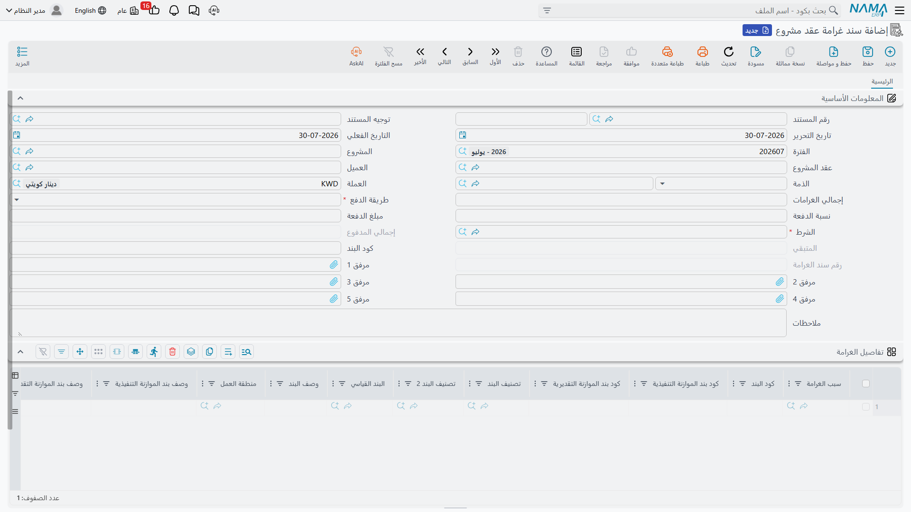

# غرامات عقد المشروع

للعقود أسنان. تفوّت الموعد فتُوقَّع عليك غرامة يومية؛ تصبّ خرسانة تسقط في اختبار المكعبات فيوجّه الاستشاري باستقطاع؛ تترك الموقع بلا سياج فيحمّلك المالك تكلفة تسييجه بنفسه. و**سند غرامة عقد المشروع** هو المكان الذي تُسجَّل فيه هذه الأعباء على عقد المالك.

والسلوك الأحق بالمعرفة قبل كل شيء هو: **الغرامة تفعل شيئين لا شيئاً واحداً.** فهي تسجل قيداً محاسبياً خاصاً بها لحظة اعتمادها، *وكذلك* تصطف لتُخصم من [المستخلص](/ar/modules/contracting/project-contracting/contracting-project-extracts.md) التالي. وليس هذان بديلين، ولا أحدهما عوضاً عن الآخر.

## أين تجده

| | |
|---|---|
| القائمة | المقاولات > مقاولة مشروع > سند غرامة عقد مشروع |
| النوع | مستند |
| توجيه المستند | إجباري — وهو الذي يوفّر الحسابات وقاعدة الاسترداد الافتراضية |
| الترخيص | `contracting` |

## الشاشة

**البيانات الأساسية** تحدد العقد وقاعدة الاسترداد: **عقد المشروع**، ومعه **المشروع** و**العميل**. و**الذمة** التي يقف هذا العبء في مقابلها. و**العملة**. و**إجمالي الغرامات** وهو حقل نظامي يجمع الجدول لا أكثر. ثم مجموعة الاسترداد نفسها الموجودة في [الدفعة المقدمة](/ar/modules/contracting/project-contracting/contracting-project-advances.md): **طريقة الدفع** إجبارية مع **نسبة الدفعة** أو **مبلغ الدفعة**، و**الشرط** إجبارياً — وهو [الشرط التعاقدي](/ar/modules/contracting/setup/contracting-conditions.md) الذي سيظهر الاستقطاع به على المستخلص، وهو الذي يحمل الحسابات التي يُسجَّل عليها ذلك الاستقطاع — و**إجمالي المدفوع** و**المتبقي** ورقم الغرامة في تسلسل غرامات العقد، وكلها من صنع النظام.

**وجدول تفاصيل الغرامة** هو موضع الغرامات نفسها، سطراً لكل واحدة:

| العمود | ما هو |
|---|---|
| **سبب الغرامة** | التصنيف — تأخر الإنجاز، عمل معيب، سلامة الموقع. انظر أدناه |
| **كود البند** | بند جدول الكميات المحمَّل بالغرامة. وهو إجباري عادةً |
| **قيمة الغرامة** | المبلغ |
| **البند القياسي** و**وصف البند** و**منطقة العمل** | وصفية، تُحمَل للتقارير |
| **كود بند الموازنة التنفيذية** و**التقديرية** ووصفاهما | يربطان الغرامة بسطر [موازنة](/ar/modules/contracting/budgets/contracting-executive-budget.md)، فتظهر في تقارير التكلفة أمام بند الموازنة الصحيح |
| **تصنيف البند** و**تصنيف البند 2** | تصنيفات البند نفسه |
| **الذمة** | تتجاوز حساب البيانات الأساسية لهذا السطر |
| **مرفق 1** و**2** و**ملاحظات** | توجيه الاستشاري، والصورة، والملاحظة |

وهنا سلوك يفاجئ الناس: **إذا ملأت كود البند في البيانات الأساسية فإنه يطمس كود البند في كل سطر.** فاستخدم أحد النهجين: إما أن تضع كود البند في البيانات الأساسية فيقود السطور كلها، وإما أن تتركه فارغاً وتضبط كود البند سطراً سطراً. أما ملء الاثنين وتوقُّع أن تغلب السطور فلا يعمل.

::: tip أسباب الغرامة تصنيف خالص
**سبب الغرامة** ملف رئيسي صغير ليس فيه إلا كود واسم ومجموعة — وهو موجود لتُجمَّع الغرامات ويُقرَّر عنها ("خسرنا 180,000 في تأخر الإنجاز العام الماضي"). ولا شيء في الوحدة يتصرف على نحو مختلف بسبب السبب، فعرّف منها ما تحتاجه تقاريرك. وهي تسكن مع بقية الملفات الرئيسية الصغيرة في [صفحة الملفات المساعدة](/ar/modules/contracting/setup/contracting-lookups.md).
:::

## ما تفعله الغرامة عند الاعتماد

تحدث ثلاثة أمور، ويُحسن الفصل بينها.

### أولاً: تسجل قيدها الخاص

تُسجَّل قيمة الغرامة، لكل سطر، على حسابَي المدين والدائن في توجيه المستند. وكما في كل موضع من هذه الوحدة يُنشأ القيد عبر **طلب أعمال** تجري معالجته في الخلفية: فيُحفظ المستند فوراً ويتبعه القيد، وتُعاد معالجة الفاشل من شاشة قائمة **طلبات الأعمال** بـ**المزيد ← إعادة معالجة** أو **إعادة اعتماد**.

ولا بد من ضبط جانبَي الزوج معاً وإلا لم يُسجَّل شيء إطلاقاً. وهناك خيار في التوجيه — احتساب التأثيرات المحاسبية من شرط المقاولة — يغيّر من أين تأتي الحسابات: فبتفعيله تُستخدم الحسابات الموجودة على **شرط** الغرامة أولاً ولا يكون التوجيه إلا بديلاً احتياطياً. وهذا هو الضبط الذي تستخدمه حين تتشارك أنواع غرامات عدة توجيهاً واحداً وتحتاج حسابات مختلفة.

### ثانياً: تصير تكلفة على بند جدول الكميات

الغرامة تُسجَّل كذلك كمصدر تكلفة، فتظهر في [تجميعة التكلفة](/ar/modules/contracting/costs/contracting-cost-model.md) في الوحدة أمام كود البند المكتوب في السطر. فالغرامة مال خسرتَه في تلك القطعة من العمل، وهذا هو طريقها إلى التكلفة الفعلية لتلك القطعة — ولهذا كان كود البند في سطر الغرامة أهم مما يبدو.

### ثالثاً: تنتظر أن تُخصم من المستخلص التالي

كالدفعة المقدمة تماماً، تبقى الغرامة على العقد برصيد **متبقي**، فيجمعها المستخلص التالي سطر **استقطاع** في *الإضافات والإستقطاعات*. و**طريقة الدفع** تحدد كم:

| طريقة الدفع | ما يُخصَم في المستخلص العادي |
|---|---|
| **أول مستخلص تالي** | الرصيد كله في المستخلص التالي مباشرة |
| **قيمة ثابتة مع كل مستخلص تالي** | المبلغ الثابت، أو الرصيد إن كان أصغر |
| **نسبة مع كل مستخلص** | تلك النسبة من إجمالي الغرامة نفسها |
| **نسبة من المستحق مع كل مستخلص** | تلك النسبة من قيمة أعمال المستخلص |
| **المستخلص الختامي** | لا شيء حتى المستخلص الختامي، فيأخذ الرصيد |

وفي المستخلص الختامي يُؤخذ الرصيد المتبقي كله على أي حال، ويرفض المستخلص الاعتماد ما دامت غرامة تحمل رصيداً.

وعلى خلاف الدفعة المقدمة، **لا** تُستَرد الغرامة بأكثر من قيمتها أبداً — فلا خيار في أي موضع يسمح بمتبقٍّ سالب على غرامة.

::: info لماذا الاثنان لا أحدهما
الاستقطاع في المستخلص ليس مصروفاً ثانياً. فقيد الغرامة نفسه هو ما يعترف بالعبء، والاستقطاع في المستخلص هو ما يمنع أن تُدفع لك قيمتُه، فيخفض الذمة مقابل ما أنشأه قيد الغرامة. ولهذا وجب أن يُضبط زوج حسابات الغرامة وزوج حسابات الشرط ضبطاً متقابلاً — الأول يسجل الغرامة والثاني يحصّلها.
:::

## القيد الذي لا يتوقعه أحد

**متى خصم مستخلصٌ غرامةً لم يمكن تعديل تلك الغرامة ولا حذفها بعد ذلك.** وتُرفض المحاولة برسالة تسمي المستخلص الذي طالب بها.

وهذا مقصود وهو السلوك الصحيح: فالشهادة صدرت أصلاً وعليها ذلك الاستقطاع، وتغيير الغرامة بعدها بصمت يترك المستندين متناقضين. ولتصحيح غرامة سبق خصمها: ألغِ المستخلص، وصحّح الغرامة، ثم أعد اعتماد المستخلص.

وفي صفحة **الإحصائيات** من كل مستخلص قائمة *سندات الغرامة* تُظهر بالضبط أي غرامات استوعبها ذلك المستخلص. وهي القائمة التي تنظر فيها حين يسأل أحد: لماذا الشهادة ناقصة؟

## بقية ما يمنع الاعتماد

- **كود البند إجباري في كل سطر غرامة**، إلا إذا جعله خيار في التوجيه اختيارياً في مستندات التكاليف.
- **أكواد البنود الرئيسية (الأب) مرفوضة** — حمّل الغرامة على بند فرعي.
- **مبلغ الدفعة لا يتجاوز القيمة المستحقة لكود بنده.**
- **حقل طريقة الدفع الخاص بها يجب أن يُملأ** — فطريقة النسبة تحتاج نسبة، وطريقة القيمة الثابتة تحتاج قيمة.
- **العقد يجب ألا يكون له مستخلص ختامي أصلاً.**

## مثال عملي

استكمالاً للعقد من [صفحة المستخلصات](/ar/modules/contracting/project-contracting/contracting-project-extracts.md): **PC-2026-001** لـ*Al-Fanar Development* على مشروع *Tower A*، وقد اعتُمدت عليه EXT-001 (صافيه المستحق 52,550) و EXT-002 (صافيه المستحق 59,270) لشهرَي فبراير ومارس.

وفي منتصف أبريل يوجّه الاستشاري بغرامة تأخير. فيُحرَّر **PCF-001** بتاريخ فعلي 15 أبريل:

| حقل البيانات الأساسية | القيمة |
|---|---|
| عقد المشروع | PC-2026-001 |
| طريقة الدفع | **أول مستخلص تالي** |
| الشرط | *FINE-DED*، وحساباته تُدائن جانب الذمة |
| إجمالي الغرامات *(نظامي)* | **5,000** |
| المتبقي *(نظامي)* | 5,000 |

| سبب الغرامة | كود البند | قيمة الغرامة |
|---|---|---|
| تأخر إنجاز الأعمال الخرسانية | `2.01` | 5,000 |

وعند الاعتماد تصح ثلاث جمل في وقت واحد: رُفِع قيد بـ 5,000 على حسابات التوجيه؛ وأُضيفت 5,000 إلى التكلفة الفعلية المسجلة على البند `2.01`؛ والغرامة قائمة على العقد بمتبقٍّ 5,000 في الانتظار.

وحين تُحضَّر شهادة أبريل — EXT-003 — تظهر الغرامة في جدول استقطاعاتها من تلقاء نفسها بلا أن يكتبها أحد. ولأن طريقة الدفع *أول مستخلص تالي* تُخصم الـ 5,000 كلها دفعة واحدة:

| EXT-003 | |
|---|---|
| قيمة الأعمال قبل الضريبة | *محاسبة هذا الشهر* |
| محتجزات 10% | (كالمعتاد) |
| الدفعة المستردة | (كالمعتاد — 11,500 من 23,000 الباقية) |
| **الغرامة PCF-001** | **(5,000)** |
| الصافي المستحق | الأعمال ناقصاً الثلاثة |

فينزل متبقي الغرامة إلى صفر، ويصير PCF-001 للقراءة فقط، وتُظهره قائمة *سندات الغرامة* في المستخلص. ولاحظ أن الشهادتين الأقدم لم تُمسّا — فالغرامة بتاريخ 15 أبريل لا تصل إلى مستخلص فبراير أو مارس، لأن المجمَّع هو الغرامات المؤرخة في أو قبل التاريخ الفعلي للمستخلص وحدها.

## إلى أين بعد ذلك

- [مستخلص المشروع](/ar/modules/contracting/project-contracting/contracting-project-extracts.md) — حيث يقع الاستقطاع.
- [الدفعات المقدمة من العميل](/ar/modules/contracting/project-contracting/contracting-project-advances.md) — آلية الاسترداد نفسها، لمال أنت مدين به لا مال حُمِّلته.
- [الشروط التعاقدية](/ar/modules/contracting/setup/contracting-conditions.md) — الشرط الذي يحمل الاستقطاع.
