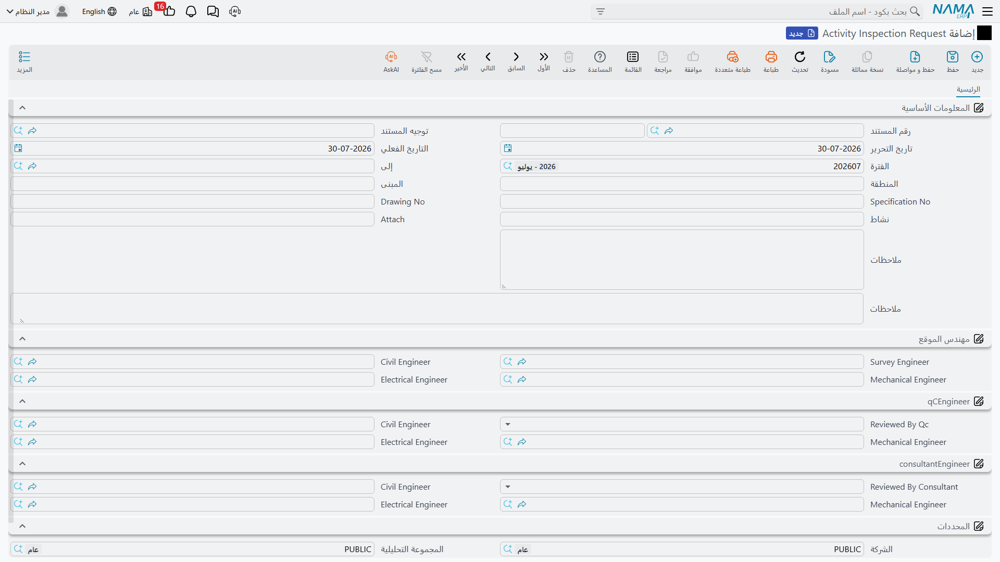

# طلب فحص نشاط

حديد التسليح تغطّيه الخرسانة. والمواسير يغطّيها اللياسة. والدكتات تختفي وراء الأسقف المستعارة. فهناك نافذة — قد تكون ساعات قليلة — يمكن فيها معاينة العمل قبل أن يُغطّى، وإذا أُغلقت فإعادة فتحها تكلّف مالاً. لذلك يرسل مهندس الموقع الذي أنهى مثل هذا العمل طلباً: *تعالوا افحصوا هذا الآن، قبل أن نغطّيه.*

و**Activity Inspection Request** هو ذلك الطلب. وهو في معظم العقود يُسمّى «طلب فحص» أو IR أو RFI. يسجّل ما هو جاهز، وأين، ومقابل أي رسم ومواصفة نُفِّذ، وأي مهندسين من الأطراف الثلاثة معنيّون، والأحكام التي تعود.

## أين تجده

| | |
|---|---|
| القائمة | المقاولات > الجودة > Activity Inspection Request |
| النوع | مستند |
| توجيه المستند | إجباري — وليس عليه شيء خاص بالفحص يُضبَط |
| الترخيص | `contracting-qc` |

## ماذا يُطلَب فحصه

الرأس يجيب سؤالي *ماذا* و*أين*، فوق دفتر المستند وكوده وتوجيهه وتواريخه القياسية.

| الحقل | ماذا يُكتب فيه |
|---|---|
| **To** (إلى) | الطرف الذي يُوجَّه إليه الطلب — وهو عملياً الاستشاري |
| **Area** (المنطقة) | نطاق الموقع |
| **Building** (المبنى) | أي مبنى أو بلوك |
| **Specification No** | بند المواصفات الذي نُفِّذ العمل عليه |
| **Drawing No** | الرسم، ومعه رقم مراجعته |
| **Activity** (نشاط) | ما هو جاهز للفحص — وهي أهم خانة على المستند بلا منافس |
| **Attach** | **إشارة مكتوبة** إلى مستند مساند، لا رفع ملف. اكتب هنا رقم المستند نفسه — «جدول ثني الحديد BBS-104» — وأرفق الملف الفعلي بوسيلة المرفقات العادية في المستند |
| **الوصف** | كل ما يحتاج الفاحص معرفته قبل أن ينزل إلى الموقع |

::: info أنشئ للاستشاري ملف عميل كذلك
حقل **To** مرجعٌ إلى ملف عميل. وعملياً يكون المُرسَل إليه في طلب الفحص هو الاستشاري، فإذا أردت أن تختاره هنا — بدلاً من كتابة اسمه في الوصف — فأنت تحتاج ملف عميل له إلى جانب [ملف الاستشاري](/ar/modules/contracting/setup/contracting-contractors-and-consultants.md) الذي تستخدمه بقية الوحدة. ويستحق ذلك أن يُعمَل مرة واحدة في بداية المشروع؛ أما تركيبه لاحقاً على ثلاثمئة طلب فهو عمل ممل.
:::

واكتب **Activity** كأن قارئه لن يرى الرسم: لا «بلاطة» بل «تركيب حديد التسليح — بلاطة منسوب +12.00، محاور C–F». فالفاحص يقرأ هذا السطر على هاتفه في المصعد.

## مَن يوقّع — ثلاث لوحات في كل واحدة ثلاثة

تحت الرأس تنقسم الشاشة ثلاث لوحات، لوحة لكل طرف. وهذا أكمل نموذج توقيع في [مجموعة الجودة](/ar/modules/contracting/quality/contracting-quality-overview.md) كلها، وهو موجود لأن طلب الفحص محاورة ثلاثية بالفعل.

**اللوحة الأولى هي فريق الموقع.** فيها **Survey Engineer** (مهندس المساحة) — الذي رفع المناسيب وتحقّق منها — ثم **Civil Engineer** و**Mechanical Engineer** و**Electrical Engineer** من فريق الموقع.

**اللوحة الثانية هي ضبط الجودة.** فيها حكم — **Reviewed By Qc** — ثم خانات التخصصات الثلاثة نفسها، فيوقّع مهندس الجودة في التخصص المعني مقابل تخصصه هو.

**واللوحة الثالثة هي الاستشاري.** حكم مرة أخرى، وخانات التخصصات الثلاثة مرة أخرى.

وكل لوحة تعرض التخصصات الثلاثة لأن المستند نفسه يُستخدم لكل الأعمال. ففحص بلاطة يعبّئ الخانة المدنية في اللوحات الثلاث ويترك الست الأخرى فارغة. وخط مياه مثلجة يعبّئ الميكانيكية. ولا أحد يعبّئ التسعة.

### الحكمان

حكم الجودة وحكم الاستشاري يعرض كل منهما الإجابات الثلاث نفسها:

| الحكم | ماذا يعني في الموقع |
|---|---|
| **مقبول** | امضِ |
| **مقبول بملاحظات** | امضِ، وأصلح النقاط المذكورة أثناء العمل |
| **غير مقبول** | لا تمضِ؛ أعِد العمل ثم أعِد الطلب |

والقائمة تعرضها بأسمائها الداخلية القصيرة بدلاً من تسمية مترجمة، فاقرأها بترتيبها: مقبول أولاً، ثم مقبول بملاحظات، ثم غير مقبول.

ولأن الخيارات لا تحمل خانة ملاحظة خاصة بها فإن سبب أي حكم غير «مقبول» الصريح لا بد أن يُكتب في وصف المستند. فاجعل ذلك قاعدة على فريق الجودة — فـ«غير مقبول» بلا سبب مكتوب خلافٌ ينتظر أن يقع.

## ماذا يُطلِق الاعتماد — وماذا لا يُطلِق

**لا شيء بعده يتوقف عليه.** ويستحق هذا أن يُقال صراحة، لأن شكل الشاشة يوحي بالعكس: فهي تبدو دورة عمل، فيها طلب ومراجعتان وحكمان.

- حكم **غير مقبول** لا يمنع أحداً من الصب. الذي يمنع الصب هو مهندس الموقع الذي يقرأ الحكم.
- وحكم **مقبول** لا يُطلِق الكمية للاعتماد. فمستند [حصر كميات المشروع](/ar/modules/contracting/project-contracting/contracting-project-execution.md) و[حصر كميات مقاول الباطن](/ar/modules/contracting/contractor-contracting/contracting-contractor-execution.md) لا يبحثان عن طلب فحص، ولا يبحث عنه [المستخلص](/ar/modules/contracting/project-contracting/contracting-project-extracts.md) بشقّيه.
- واعتماد المستند لا ينشئ قيداً محاسبياً ولا مستنداً آخر ولا يغيّر شيئاً في المشروع أو العقد أو [خطة الفحص](/ar/modules/contracting/quality/contracting-inspection-plans.md) المتصلة به.

فإذا كانت إجراءاتك تشترط ألا تُعتمد كمية بلا فحص مقبول، فنفّذ ذلك بالناس وبدورة اعتماد عامة على طلب الفحص نفسه، وراجِعه بقراءة الطلبات. ولا تنتظر من المستخلص أن يرفض.

## مثال محلول: قبل الصبّة في برج A

**برج A**، البرج السكني الخاص بـ**الفنار للتطوير**، وصل منسوب +12.00. حديد البلاطة مركَّب، والشدة مغلقة، والصبّة محدّدة السادسة من صباح الغد. وقبل وصول الخرسانة لا بد أن يُعايَن الحديد.

**الخطوة 1 — مهندس الموقع يحرّر الطلب** في 03/03/2026، برقم `AIR-2026-0142`:

> **To** دار الهندسة — استشاري المشروع، مُنشأ كملف عميل ليصح اختياره هنا
> **Area** `Zone B` · **Building** `Tower A`
> **Specification No** `SPEC-03-201` · **Drawing No** `ST-A-104 Rev.C`
> **Activity** `تركيب حديد التسليح — بلاطة منسوب +12.00، محاور C–F`
> **Attach** `جدول ثني الحديد BBS-104`
> **الوصف** `الصبّة محدّدة 04/03 الساعة 06:00. الغطاء الخرساني 25 مم، والفواصل كل 100 سم.`

وفي اللوحة الأولى يسمّي مهندس المساحة *أ. منصور*، ونفسه مهندساً مدنياً *م. فتحي*. وتبقى خانتا الميكانيكا والكهرباء فارغتين — فليس في بلاطة حديد شيء ميكانيكي.

ولاحظ أن رقم المواصفة يطابق السطر الأول من `ITP-CW-01`، [خطة الفحص والاختبار](/ar/modules/contracting/quality/contracting-inspection-plans.md) التي اعتمدها الاستشاري في فبراير. ولا شيء في النظام يتحقق من ذلك. إنما طابقه لأن المهندس جعله يطابق، وهذا بالضبط سبب استحقاق عمود **Report Reference No** في الخطة أن يُعبَّأ.

**الخطوة 2 — الجودة تفحص.** يمشي مهندس جودة الشركة *ه. سالم* على البلاطة في عصر اليوم نفسه. الغطاء سليم، والتراكبات سليمة، لكن فاصلين ناقصان في زاوية C4. فيسجّل حكمه **مقبول بملاحظات** في اللوحة الثانية، ويوقّع الخانة المدنية، ويضيف إلى الوصف: «الجودة 03/03 الساعة 16:20 — تركيب فاصلين بمحور C4 قبل الصب».

**الخطوة 3 — الاستشاري يفحص.** يحضر *ر. عزيز* من دار الهندسة الساعة 18:00، فيرى الفاصلين في موضعهما، ويسجّل **مقبول** في اللوحة الثالثة باسمه في الخانة المدنية.

**الخطوة 4 — يُعتمَد المستند**، ولا يتحرّك شيء آخر في النظام. وتمضي الصبّة في السادسة لأن مهندسين اثنين قالا إنها تمضي. وفي صباح اليوم التالي يحرّر أحدهم [Pre-Concrete Inspection](/ar/modules/contracting/quality/contracting-site-checklists.md) لفحص جهوزية الشدة، ثم [Post-Concrete Inspection](/ar/modules/contracting/quality/contracting-site-checklists.md) بعد فكّ الجوانب — سجلان منفصلان، كل واحد قائم بذاته.

وبعد ذلك، حين يُحصَر [تنفيذ](/ar/modules/contracting/project-contracting/contracting-project-execution.md) الشهر وتذهب 200 م³ من الخرسانة إلى [المستخلص](/ar/modules/contracting/project-contracting/contracting-project-extracts.md)، يكون `AIR-2026-0142` هو الورقة التي تقول إن الحديد تحت تلك الخرسانة عاينه ثلاثة أشخاص قبل أن يختفي. وهذه هي وظيفة المستند كلها، وهو يؤديها جيداً.
