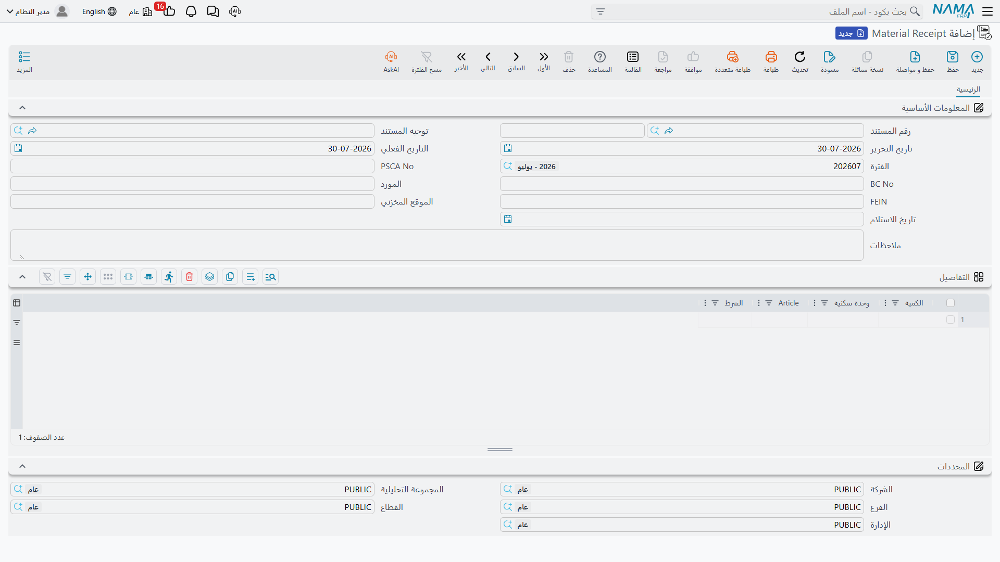

# فحص الخامات عند التوريد

تصل سيارة إلى بوابة الموقع. ولا بد أن يدور أحدهم حولها، ويحصر ما عليها، ويقرأ شهادة المصنع، ويبحث عن تلف، ويوقّع بأن الذي وصل هو الذي طُلب. ولذلك التوقيع اسم في الإنشاءات — **تقرير استلام خامات** أو **MRR** — وسيطلبه الاستشاري قبل أن يعتمد الخامة للاستخدام.

ويعطيك البرنامج شاشتين لذلك:

- **Material Receipt** هو التقرير الفردي: توريدة واحدة، مستند واحد.
- **MRR Register** هو سجل تلك التقارير وهي تخرج إلى الاستشاري وتعود معتمدة.

## اقرأ هذا أولاً: هو نموذج قائم بذاته

هذا أول ما يسأل عنه القارئ، فليكن في الصدر لا في الحاشية.

**Material Receipt لا يرتبط بأمر شراء ولا بإذن استلام ولا بصنف ولا بملف مورد.** إنه نموذج يُطبَع ويُحفَظ ويُبحَث فيه، ويقف عند ذلك. وبالتحديد:

- حقل **Vendor** (المورد) اسم **تكتبه**. وليس مرجعاً إلى ملف المورد، فلا يمكن سرد تقارير الاستلام «حسب المورد» ولا مطابقتها بفاتورة المورد.
- ورقمَا أمر الشراء والإرسالية في الرأس **نص مكتوب** كذلك. وليسا مرجعاً إلى [أمر شراء المقاولات](/ar/modules/contracting/costs/contracting-purchasing.md) ولا إلى أي مستند شراء، فلا شيء يطابق الكمية الواردة بالكمية المطلوبة.
- والسطور تحمل كمية ووحدة و**وصفاً مكتوباً** للخامة. وليس فيها مرجع صنف، فلا يستطيع المستند أن يخبرك *أي* صنف مخزني وصل.
- واعتماده **لا يحرّك مخزوناً ولا يسجّل قيداً محاسبياً**. لا شيء يدخل مخزناً ولا يخرج منه.

ولا شيء من ذلك يجعل المستند بلا قيمة — ففحص استلام موقّع ومؤرَّخ ومرقَّم، بحكمٍ على حالة كل سطر، هو تماماً ما يريد الاستشاري أن يراه، ووجوده في النظام بدلاً من حافظة ورقية مكسب في نفسه. لكنه يعني أن تكون واضحاً في أي عمل تعمل:

| إذا أردت أن… | فاستخدم |
|---|---|
| تسجّل فحص الجودة لتوريدة، لملف جودة المشروع | **Material Receipt** |
| تُدخِل الخامة مخزنياً ليصح صرفها للمشروع | مستندات الاستلام في سلسلة التوريد، ثم [صرف الخامات للمشروع](/ar/modules/contracting/costs/contracting-project-materials.md) |
| تطابق التوريدة بما طُلب وبما فُوتِر | [طلبات وأوامر شراء المقاولات](/ar/modules/contracting/costs/contracting-purchasing.md) وفاتورة الشراء العادية |

وكثير من المقاولين يفعل الأمرين: أمين المخزن يستلم مخزنياً بمستندات سلسلة التوريد، والجودة تحرّر Material Receipt لملف الجودة. والاثنان لا صلة بينهما، وهذا كل ما في الأمر.

## أين تجدهما

| | Material Receipt | MRR Register |
|---|---|---|
| القائمة | المقاولات > الجودة > Material Receipt | المقاولات > الجودة > MRR Register |
| النوع | مستند | مستند |
| توجيه المستند | إجباري — وليس عليه شيء خاص بالاستلام يُضبَط | إجباري — والحال نفسه |
| الترخيص | `contracting-qc` | `contracting-qc` |

## تقرير الاستلام

فوق دفتر المستند وكوده وتوجيهه وتواريخه القياسية، يحدّد الرأس التوريدة:

| الحقل | ماذا يُكتب فيه |
|---|---|
| **PSCA No** | رقم الشراء أو عقد التوريد الذي جاءت التوريدة عليه — مكتوب |
| **BC No** | رقم الإرسالية أو إذن التسليم — مكتوب |
| **Vendor** | اسم المورد — مكتوب |
| **FEIN** | الرقم الضريبي أو التسجيلي للمورد |
| **Location** | أين على الموقع استُلمت الخامة — البوابة، المخزن، الساحة. ورغم التسمية المستعارة من شاشات المخازن، فهذا موقع في المشروع لا مخزن |
| **Receiving Date** | يوم وصول السيارة، وهو غالباً غير يوم كتابة المستند |
| **الوصف** | ما يحتاجه القارئ — الجو، اسم السائق، سبب التحفّظ على سطر |

ثم جدول **Details**، سطر لكل نوع خامة على السيارة:

| العمود | ماذا يُكتب فيه |
|---|---|
| **Quantity** | الكمية الواردة منها |
| عمود الوحدة | **وحدة القياس** — طن، م³، شيكارة، عدد. وتسمية هذا العمود مستعارة من وحدة أخرى وتُقرأ «وحدة سكنية»؛ وهي هنا وحدة القياس |
| **Article** | الخامة نفسها، موصوفة بالكلمات: الرتبة والمقاس والدفعة ورقم الشهادة. وهي خانة نص طويل، فاستخدمها كما ينبغي |
| عمود الحالة | **الحالة المادية** لما وصل — «مقبول»، «مقبول بملاحظات»، «مرفوض»، والسبب. والتسمية تُقرأ «الشرط» بالمعنى التعاقدي؛ وهي هنا حال البضاعة |

ولأن ليس هناك مرجع صنف فإن **Article** هو ما يؤدي الدور الذي يؤديه كود الصنف عادةً. فاكتبه كأن قارئه لم يرَ التوريدة: «أسمنت بورتلاندي عادي CEM I 42.5 N، شكاير 50 كجم، دفعة 4,471، شهادة المصنع مرفقة» بدلاً من «أسمنت». فبعد سنة تكون تلك الجملة هي الوصف الوحيد لما قُبِل.

## السجل

السجل يتابع التقارير نفسها — صادرةً إلى الاستشاري، عائدةً بنتيجة. وهو مثل [ITP Register](/ar/modules/contracting/quality/contracting-inspection-plans.md) لا حقول رأس خاصة به؛ فالمستند جدول واحد.

| العمود | ماذا يُكتب فيه |
|---|---|
| **Outcome Of Activity** | ما عاد به التقرير — «معتمد»، «معتمد بملاحظات»، «مرفوض» |
| **Sent Date** | يوم خروج التقرير. وهو تاريخ حقيقي |
| **Description** | أي تقرير يخصّه هذا السطر |
| **Quantity** | الكمية المشمولة، فيجمع السجل كما يسرد |
| **Receive Date** | يوم عودة النتيجة. وهي **خانة نص حر لا حقل تاريخ**، فاكتبها بصيغة واحدة ثابتة — فالسجل لا يحسب منها مدة الدورة |
| **Remarks** | كود الاستشاري أو ملاحظاته أو غير ذلك |

والسجل يعرّف التقرير الذي يتابعه بحقل **Description**، فاكتب هناك رقم مستند التقرير نفسه — «MRR-2026-0031 توريدة أسمنت» — والتزم هذه العادة. فهي الخيط الوحيد بين سطر السجل والتقرير الذي يشير إليه.

## مثال محلول: توريدة أسمنت لبرج A

**برج A** برج سكني يُنفَّذ لصالح **الفنار للتطوير**، وصبّة اللبشة تحتاج أسمنتاً على الموقع بحلول التاسع من مارس.

**الخطوة 1 — التوريدة.** في 08/03/2026 تصل سيارتان على أمر الشراء `PO-4411`. فيقابلهما فاحص الجودة عند البوابة، ويطابق إذن التسليم بالشكاير، ويقرأ شهادة المصنع، ويدور على الحمل.

**الخطوة 2 — التقرير.** يحرّر Material Receipt رقم `MRR-2026-0031`:

> **PSCA No** `PO-4411` · **BC No** `BC-2026-778`
> **Vendor** `أسمنت الراجحي` *(مكتوب)* · **FEIN** `FEIN-99201`
> **Location** `مخزن الموقع — بوابة 3` · **Receiving Date** `08/03/2026`
> **الوصف** `سيارتان، 48 طناً إجمالاً. شهادة المصنع 4,471 محفوظة مع هذا التقرير.`

بسطرين:

| Quantity | الوحدة | Article | الحالة |
|---|---|---|---|
| 40 | طن | أسمنت بورتلاندي عادي CEM I 42.5 N، شكاير 50 كجم، دفعة 4,471، شهادة المصنع مرفقة | مقبول |
| 8 | طن | الدفعة نفسها، السيارة الثانية — ثلاث شكاير ممزقة أثناء النقل وفُقد محتواها | مقبول بملاحظات — نقص 3 شكاير، مطلوب إشعار خصم |

ويعتمده. ولا يحدث شيء آخر في النظام: لا حركة مخزنية، ولا قيد محاسبي، ولا أثر على `PO-4411`. وبمعزل عن ذلك يستلم أمين المخزن الـ48 طناً في مخزن الموقع بمستندات الاستلام في سلسلة التوريد، ويتابع فريق المشتريات إشعار خصم النقص على فاتورة المورد. ثلاثة أعمال غير متصلة على توريدة واحدة، ومعرفة ذلك هي الفرق بين استخدام هذا المستند استخداماً حسناً وبين الحيرة أمامه.

**الخطوة 3 — السجل.** يخرج التقرير إلى الاستشاري في صباح اليوم التالي، ويُضاف سطر إلى MRR Register رقم `MRRR-2026-Q1`:

> **Outcome Of Activity** `معتمد` · **Sent Date** `09/03/2026`
> **Description** `MRR-2026-0031 توريدة أسمنت` · **Quantity** `48`
> **Receive Date** `12/03/2026` *(مكتوب نصاً)* · **Remarks** `كود الاستشاري A. النقص مُثبَت ولا مانع من الاستخدام.`

فيصير الأسمنت مُصرَّحاً باستخدامه في نظر ملف جودة المشروع، ويُظهر السجل دورةً مدتها ثلاثة أيام — تُقرأ بالعين، لأن تاريخ العودة نص.

**الخطوة 4 — وماذا يغذّي؟** لا شيء، بمنطق النظام. أما الذي يغذّيه في الواقع فهو الحافظة التي يراجعها الاستشاري، وجوابُ السؤال «مَن قبل هذا الأسمنت، ومتى؟» — وهو السؤال الذي وُجد المستند من أجله.
