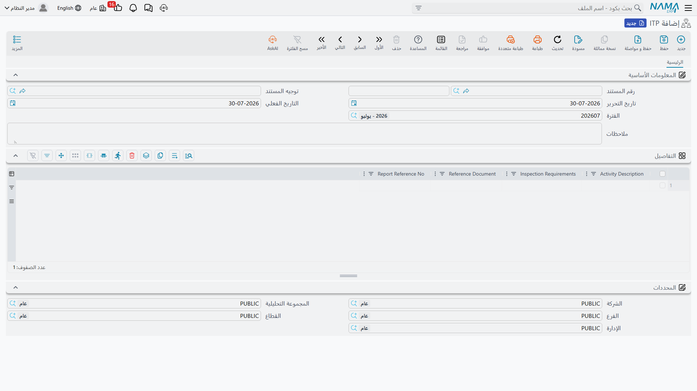

# ضبط الجودة بالموقع

كل موقع إنشاءات يعمل على الورق. قبل صبّ البلاطة يوقّع أحدهم بأن الحديد سليم؛ وعند وصول سيارة الأسمنت يوقّع أحدهم بأن الوارد هو ما طُلب؛ وعند اختبار حلقة الحريق بالضغط يسجّل أحدهم ما قرأه المقياس. وتلك الأوراق الموقّعة تسكن حافظة في مكتب الموقع، فإذا سأل الاستشاري «مَن فحص هذا؟» كانت الحافظة هي الجواب.

مجموعة **الجودة** في وحدة المقاولات هي تلك الحافظة، مكتوبةً بدلاً من مصوّرة. ثلاث عشرة شاشة، كل واحدة منها هي النسخة الإلكترونية من نموذج موقع بعينه، وكل واحدة محفوظة على المشروع الذي تنتمي إليه وقابلة للبحث بعد شهور.

هذه الصفحة هي النمط المشترك. اقرأها مرة واحدة تَقصر عليك الصفحات الأربع التي تليها، لأن الشاشات الثلاث عشرة كلها مبنية بالطريقة نفسها — الرأس نفسه، ونموذج التوقيعات نفسه، والحفنة نفسها من خيارات الإجابة. والذي يتغيّر من شاشة إلى أخرى هو مفردات الأسئلة فقط.

::: info شاشات هذه المجموعة تظهر بعناوين إنجليزية
واجهة هذه المجموعة إنجليزية في النسخة العربية من البرنامج: أسماء الشاشات وعناوين المجموعات ومعظم مسميات الحقول. ولذلك تُذكر في هذه الصفحات التسمية الإنجليزية كما تراها على الشاشة تماماً، ويُشرح معناها بالعربية في السياق، حتى تجد ما تقرأه هنا مطابقاً لما تقرأه أمامك.
:::

## سجلات لا بوابات

ابدأ من هنا، فهذا هو الفهم الذي يحتاج التصحيح أكثر من غيره.

**لا شيء في هذه المجموعة يمنع أو يُطلق شيئاً آخر في الوحدة.** سجل الجودة سجل، وهذا كل ما هو عليه. وبالتحديد:

- اعتماد **Pre-Concrete Inspection** (فحص ما قبل الصب) لا يأذن بالصب. الذي يأذن بالصب هو المهندس الذي يقرر في الموقع أن يأذن به.
- اعتماد **Activity Inspection Request** (طلب فحص نشاط) لا يُطلِق الكميات المقابلة للاعتماد. فمستند [حصر كميات المشروع](/ar/modules/contracting/project-contracting/contracting-project-execution.md) و[المستخلص](/ar/modules/contracting/project-contracting/contracting-project-extracts.md) لا يبحثان عن فحص ولن يبحثا عنه.
- الفحص الراسب لا يوقف دفعة. [المستخلص](/ar/modules/contracting/project-contracting/contracting-project-extracts.md) لا يقرأ مستندات الجودة، فحكم «غير مقبول» لا يكلّف مقاول الباطن شيئاً إلى أن يحرّر أحدهم [غرامة](/ar/modules/contracting/contractor-contracting/contracting-contractor-fines.md) أو يحجب كمية يدوياً.
- ولا ينشئ أي مستند جودة مستنداً آخر، ولا يغيّر حالة مستند آخر، ولا يسجّل قيداً محاسبياً، ولا يحرّك مخزوناً. ليس في الثلاثة عشر واحدٌ له أثر محاسبي أو مخزني.

وهذا ليس نقصاً يُتحايل عليه في صمت — بل يستحق أن تخبر به فريق الموقع، لأن التوقّع الطبيعي هو العكس.

::: tip إذا احتجت بوابة حقيقية
استخدم دورة الاعتماد العامة في البرنامج. فأي من هذه المستندات يمكن أن يُوضع خلف تعريف اعتماد، بحيث يلزم — مثلاً — أن يعتمده مدير الجودة قبل ترحيله. وذلك يحكم ترحيل مستند الجودة نفسه، ويبقى الالتزام بقاعدة «لا صبّ بدون فحص مُرحَّل» في إجراءات الموقع لديك، ينفّذها الناس لا النظام.
:::

## أين تجدها، وما هي كل واحدة

الثلاثة عشر كلها في مجموعة قائمة واحدة، **المقاولات > الجودة**، وكل واحدة منها مستند.

| الشاشة | ما تسجّله | الترخيص | تشرحها صفحة |
|---|---|---|---|
| **ITP** | خطة الفحص والاختبار نفسها — سطر لكل نشاط قابل للفحص | `contracting-qc` | [خطط الفحص والاختبار](/ar/modules/contracting/quality/contracting-inspection-plans.md) |
| **ITP Register** | سجل تقديم تلك الخطط ومراجعاتها | `contracting-qc` | [خطط الفحص والاختبار](/ar/modules/contracting/quality/contracting-inspection-plans.md) |
| **Activity Inspection Request** | «تعالَ افحص هذا قبل أن نغطّيه» — بأحكام الأطراف الثلاثة | `contracting-qc` | [طلب فحص نشاط](/ar/modules/contracting/quality/contracting-activity-inspections.md) |
| **Material Receipt** | فحص استلام توريدة على الموقع | `contracting-qc` | [فحص الخامات عند التوريد](/ar/modules/contracting/quality/contracting-material-inspection.md) |
| **MRR Register** | سجل تقارير الاستلام الصادرة والعائدة | `contracting-qc` | [فحص الخامات عند التوريد](/ar/modules/contracting/quality/contracting-material-inspection.md) |
| **Pre-Concrete Inspection** | جهوزية الشدة والحديد قبل الصب | `contracting-qc` | [قوائم فحص الموقع](/ar/modules/contracting/quality/contracting-site-checklists.md) |
| **Post-Concrete Inspection** | حال الخرسانة بعد فكّ الشدة | `contracting-qc` | [قوائم فحص الموقع](/ar/modules/contracting/quality/contracting-site-checklists.md) |
| **Underground Piping Check List** | فحوص خط مواسير مدفون قبل الردم | `contracting-qc` | [قوائم فحص الموقع](/ar/modules/contracting/quality/contracting-site-checklists.md) |
| **Cleaning And Flushing** | نفخ المواسير وغسلها قبل التشغيل | `contracting-qc` | [قوائم فحص الموقع](/ar/modules/contracting/quality/contracting-site-checklists.md) |
| **HydroStatic Test Report For Fire Protection System** | اختبار الضغط والتسريب لحلقة الحريق | `contracting-qc` | [قوائم فحص الموقع](/ar/modules/contracting/quality/contracting-site-checklists.md) |
| **Finishing Works CheckList** | قائمة أنشطة حرة لأعمال المباني والتشطيبات | `contracting` | [قوائم فحص الموقع](/ar/modules/contracting/quality/contracting-site-checklists.md) |
| **Digging And BackFiling CheckList** | مثلها، لأعمال الحفر والردم | `contracting` | [قوائم فحص الموقع](/ar/modules/contracting/quality/contracting-site-checklists.md) |
| **Test Report** | شهادة اختبار ضغط أو تسريب، مع جدول معايرة أجهزة القياس | `contracting` | [قوائم فحص الموقع](/ar/modules/contracting/quality/contracting-site-checklists.md) |

### الترخيص، والاستثناء داخل المجموعة

عشر من الثلاث عشرة تحتاج ترخيص الوحدة الفرعية **`contracting-qc`** فوق ترخيص **`contracting`** الأساسي. أما الثلاث في أسفل الجدول — **Finishing Works CheckList** و**Digging And BackFiling CheckList** و**Test Report** — فتحتاج ترخيص **`contracting`** وحده، مع أنها في مجموعة القائمة نفسها وتسلك سلوك البقية حرفياً.

وهذا أهم عملياً مما يبدو. فالعميل الذي اشترى وحدة المقاولات ولم يشترِ وحدة الجودة الفرعية تبقى معه قائمتا الأنشطة العامتان وتقرير الاختبار — وهي بالمصادفة أوسع ثلاث شاشات نفعاً في المجموعة. وإذا غابت شاشة من شاشات `contracting-qc` عن القائمة فالمسألة مسألة ترخيص لا مسألة صلاحيات: الترخيص الناقص يُخرج الشاشة وتوجيه مستندها من القائمة أصلاً، ولا يُظهرهما باهتين.

## شكل واحد، ثلاث عشرة مفردة

كل شاشة في هذه المجموعة صفحة واحدة اسمها **Main** (الرئيسية)، مرتّبة على النحو ذاته:

1. **Basic Information** (المعلومات الأساسية) — دفتر المستند وكوده، وتوجيه المستند، وتاريخ التحرير، والتاريخ الفعلي، والفترة. ثم حقول رأس المستند الخاصة به: عادةً مَن فحص، وأين على الموقع، ومقابل أي رسم ومواصفة. ثم خانة الوصف.
2. **صفر أو أكثر من المجموعات المُوضوعية** للأسئلة — *Curing* و*Hydrants* و*Surface Appearance* وما شابه، بحسب المستند.
3. **جدول تفاصيل واحد على الأكثر**، عنوانه *Details*، حين يكون المستند يسرد أشياء بدلاً من أن يجيب أسئلة ثابتة.
4. **المحددات** — الشركة والمجموعة التحليلية والفرع والقطاع والإدارة، كما في كل مستند آخر في البرنامج.

استوعب ذلك مرة واحدة تستطيع أن تفتح أي واحدة من الثلاث عشرة وتعرف أين تنظر. وليس في العائلة كلها إلا فرقان بنيويان:

- **الاستبيانات** — طقم ثابت من أسئلة العلامات في مجموعات مُوضوعية، لكل سؤال خانة ملاحظة بجانبه، وبلا جدول أصلاً. وهما اثنان: **Post-Concrete Inspection** واختبار الضغط لنظام الحريق.
- **قوائم السطور** — جدول تكتبه بحرّية، سطراً سطراً، برأس صغير فوقه. وهذا حال الباقي.

### توجيه المستند

كل واحد من هذه المستندات يشترط **توجيه المستند**، فإنشاء توجيه لكل نوع مستند خطوة تجهيز حقيقية لا يمكن تجاوزها — وبلا توجيه لن يُحفظ أول سجل.

وليس على التوجيه شيء خاص بالجودة. فليس لأي من الثلاثة عشر خيارات توجيه خاصة بوحدة المقاولات، ولذلك تعرض شاشة التوجيه التبويبات القياسية في البرنامج وحدها: دفتر المستند وترقيمه، والمحددات الافتراضية، ودورة الاعتماد، والطباعة، والصلاحيات. أنشئ توجيهاً بسيطاً لكل نوع مستند، ووجّهه إلى الدفتر الصحيح، وامضِ. راجع [أساسيات توجيه المستندات](/ar/modules/contracting/document-terms/contracting-terms-basics.md).

## مَن يوقّع، وماذا يعني ذلك

في العائلة شكلان للتوقيع، وكلاهما **حقول بيانات محضة**. لا شيء يُلزم بتعبئتها، ولا شيء يحدث حين تُعبَّأ.

**الشكل المعتاد — توقيعان.** تسع من الثلاث عشرة تحمل حقلَي موظف:

- **Site Engineer** (مهندس الموقع) — مهندس الشركة الذي نفّذ العمل أو عايَنه
- **Quality Control Engineer** (مهندس ضبط الجودة) — مهندس الجودة الذي فحصه

وحيث يوقّع جانب العميل كذلك، هناك حقل ثالث للاستشاري. ونوعه يختلف من مستند إلى آخر: فهو في معظم الشاشات اسم تكتبه نصاً، وفي **Post-Concrete Inspection** موظف، وفي **Finishing Works CheckList** مرجعٌ حقيقي إلى [ملف الاستشاري](/ar/modules/contracting/setup/contracting-contractors-and-consultants.md). وعلى أي حال فهو يسجّل مَن وقّع، لا أكثر.

**الشكل الثلاثي — تسعة أسماء على مستند واحد.** لا يستخدمه إلا **Activity Inspection Request**، وهو أكثر تصميم في المجموعة إحكاماً: ثلاث لوحات — فريق الموقع، وفريق الجودة، والاستشاري — تحمل كل واحدة **Civil Engineer** (مهندس مدني) و**Mechanical Engineer** (ميكانيكا) و**Electrical Engineer** (كهرباء). ففحص بلاطة يعبّئ الخانة المدنية في اللوحات الثلاث ويترك الست الأخرى فارغة؛ وفحص دكت يعبّئ الميكانيكية. راجع [طلب فحص نشاط](/ar/modules/contracting/quality/contracting-activity-inspections.md).

و**ليست هناك تواريخ توقيع** في أي مكان من العائلة إلا في **Test Report**، الذي يضع خانة تاريخ بجانب كل من توقيعَيه. فإذا احتجت أن تعرف *متى* وُقّع سجلٌ ما فأنت تقرأ تاريخ تحرير المستند نفسه، لا تاريخ توقيع.

::: info قائمتا الفحص تحملان علامةً لكل سطر بدلاً من ذلك
تعمل **Finishing Works CheckList** و**Digging And BackFiling CheckList** بطريقة مختلفة، وأنسب لغرضهما: فبدلاً من توقيع واحد للمستند كله، لكل سطر من قائمة الأنشطة خانة علامة خاصة به لمهندس الموقع وأخرى لمهندس الجودة — وفي قائمة الحفر والردم ثالثة لمندوب العميل. فتُعتمد ثلاثون نشاطاً كل واحد على حِدة كلما اكتمل.
:::

## خيارات الإجابة

حيث يطرح المستند سؤالاً ثابتاً بدلاً من أن يفتح المجال لنص حر، تأتي الإجابة من واحدة من ثلاث قوائم خيارات صغيرة. وهي تغطي بينها كل خانات العلامات في المجموعة.

| الخيارات | معناها | أين تلقاها |
|---|---|---|
| **نعم / لا** | السؤال المباشر — هل جرت المعالجة، هل تعمل الحنفيات | **Post-Concrete Inspection** واختبار الضغط لنظام الحريق |
| **مقبول / مقبول بملاحظات / غير مقبول** | حكم على عمل مُقدَّم للفحص | حكمَا الجودة والاستشاري في **Activity Inspection Request** |
| **لا شيء مطلوب / يحتاج معالجة** | حكم على عيب — إما أن التشطيب سليم كما هو، أو أن هناك عملاً تصحيحياً مطلوباً | أسئلة مظهر السطح في **Post-Concrete Inspection** |

والأخيرة تأتي بصورتين، والفرق بينهما في صيغة إجابة «لا مشكلة» فقط. فأسئلة جودة الصناعة — وصلات الشدة، وصلات الصب، الشطف — إجابتها السليمة تقرأ *OK*. وأسئلة العيوب التي إما أن تكون موجودة أو غائبة — فتحات الرباط، الشقوق، آثار الشدة، مجاري الرمل — إجابتها السليمة تقرأ *none* (بدون). وفي الحالتين الخيار الثاني هو *treatment*، ومعناه واحد: على أحدهم أن يعود ويعالج.

وقائمتان من هذه القوائم تعرضان خياراتهما بأسمائها الداخلية القصيرة بدلاً من تسمية مترجمة، فاقرأهما بترتيبهما ومعناهما لا بصيغة كلماتهما.

وكل سؤال يمكن أن تكون إجابته «يحتاج معالجة» مقرونٌ بخانة ملاحظة نصّية خاصة به، وهذا الاقتران هو مغزى المستند كله. فالعلامة تخبرك أن ثمّة مشكلة؛ والملاحظة تخبر المُلاحظ أين هي وما حجمها. فـ«تعشيش — نعم» إحصاء؛ أما «تعشيش — نعم؛ رقعتان بجوار العمود C4 بمقاس 150 × 200 مم» فتعليمات عمل.

## وإلى أين بعد ذلك

الصفحات الأربع التالية تأخذ الشاشات الثلاث عشرة بالترتيب الذي يُرجَّح أن تلقاها به على مشروع: الخطة أولاً، ثم فحص العمل، ثم فحص ما يصل من خامات، ثم النماذج الخاصة بكل تخصص.

- [خطط الفحص والاختبار](/ar/modules/contracting/quality/contracting-inspection-plans.md) — الخطة التي تقول ما سيُفحَص، والسجل الذي يتابع اعتمادها.
- [طلب فحص نشاط](/ar/modules/contracting/quality/contracting-activity-inspections.md) — دعوة الجودة والاستشاري إلى المعاينة.
- [فحص الخامات عند التوريد](/ar/modules/contracting/quality/contracting-material-inspection.md) — تقرير الاستلام، وبيان صريح بما هو مرتبط به وما ليس مرتبطاً به.
- [قوائم فحص الموقع وتقارير الاختبار](/ar/modules/contracting/quality/contracting-site-checklists.md) — النماذج الثمانية، مجموعةً بحسب ما تفحصه.
