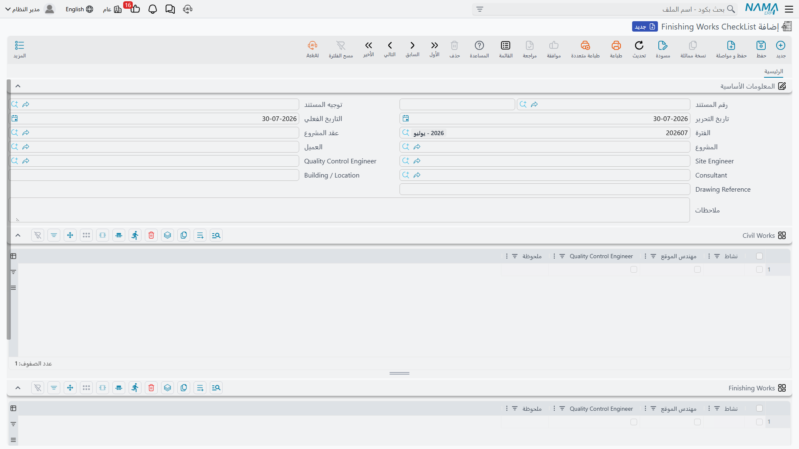
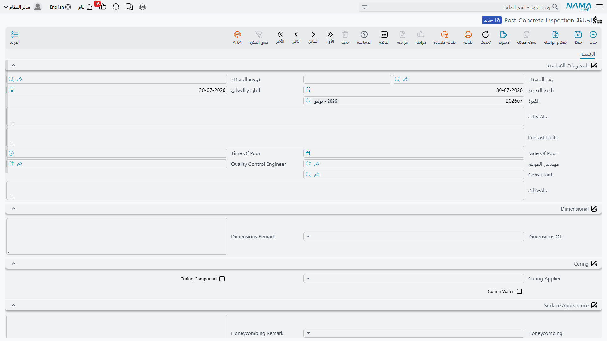

# قوائم فحص الموقع وتقارير الاختبار

ثمانٍ من الشاشات الثلاث عشرة في مجموعة [الجودة](/ar/modules/contracting/quality/contracting-quality-overview.md) نماذج موقع بعينها — الورقة التي تُعبَّأ قبل الصب، والتي تُعبَّأ بعده، وواحدة لخط مواسير مدفون، وأخرى لاختبار ضغط. وإذا فُتحت جنباً إلى جنب بدت ثماني خصائص مختلفة. وليست كذلك. إنها **مستند واحد مطبوع عليه ثمانية أطقم مختلفة من الأسئلة**.

ولذلك لا تسرد هذه الصفحة كل حقل في كل نموذج. بل تشرح الشكلين الذين تأتي بهما، ثم تمشي على العائلات الأربع بحسب التخصص، فتقول لكل واحدة لماذا هي، وماذا تسأل، وإلى أي حدّ هي عامة. ومتى استخدمت واحدة منها استطعت استخدام الثمانية.

## شكلان

كل واحد من الثمانية يبدأ البداية نفسها — الدفتر والكود، وتوجيه المستند، وتاريخ التحرير، والتاريخ الفعلي، والفترة؛ ثم **مَن فحص** (مهندس موقع، ومهندس ضبط جودة، وعادةً استشاري)؛ ثم **أين** (طقم من المنطقة والمبنى ورقم الرسم ورقم المواصفة وموقع العمل والمنسوب)؛ ثم وصف ومجموعة المحددات القياسية. وهذا القدر هو [الشكل المشترك](/ar/modules/contracting/quality/contracting-quality-overview.md)، ولا يتغيّر أبداً.

والذي يتغيّر هو الوسط:

| الشكل | كيف تعبّئه | أي النماذج |
|---|---|---|
| **قائمة سطور** | جدول تعبّئه بحرّية، سطراً سطراً، بأي طول شئت | قائمتا الأنشطة، وفحص ما قبل الصب، وقائمة المواسير المدفونة، والتنظيف والغسل، وتقرير الاختبار |
| **استبيان** | طقم ثابت من أسئلة العلامات في مجموعات مُوضوعية، لكل سؤال خانة ملاحظته، وبلا جدول أصلاً | فحص ما بعد الصب، واختبار الضغط لنظام الحريق |

قائمة السطور تتكيّف مع أي عمل لأنك تكتب الأسئلة أثناء العمل. والاستبيان لا يمكن تغييره، لكنه يضمن أن الأشياء الاثني عشر نفسها تُعايَن في كل مرة. وكلاهما نافع؛ إنما يناسب كل واحد عملاً مختلفاً.

وليس لأي من الثمانية سلوك: اعتماد أي منها لا يُحاسِب شيئاً ولا يحرّك شيئاً ولا يحكم شيئاً. وهذا مشروح مرة واحدة في [صفحة النظرة العامة](/ar/modules/contracting/quality/contracting-quality-overview.md) وينطبق هنا بلا استثناء.

## قائمتا الأنشطة العامتان

إذا كنت لن تستخدم من هذه المجموعة إلا شاشتين فاستخدم هاتين. فهما أوسع مستندَين نفعاً في العائلة — وبحسن حظٍّ هما الاثنتان اللتان تحتاجان ترخيص **`contracting`** وحده لا `contracting-qc`.

| | Finishing Works CheckList | Digging And BackFiling CheckList |
|---|---|---|
| القائمة | المقاولات > الجودة > Finishing Works CheckList | المقاولات > الجودة > Digging And BackFiling CheckList |
| الترخيص | `contracting` | `contracting` |

والذي يجعلهما عامتين هو الجدول. فبدلاً من أسئلة ثابتة، كل سطر **نشاطٌ تكتبه أنت**، وبجانبه خانة علامة لكل طرف يلزم أن يعتمده، وخانة ملاحظة. فثلاثون نشاطاً على مستند واحد، كل واحد يُعتمَد على حِدة كلما اكتمل.

وهما كذلك، بخلاف معظم هذه العائلة، **مرتبطتان بالعمل**: فرأسهما يحمل **عقد المشروع** و**المشروع**، فتنتمي قائمة الفحص إلى شيء. راجع [عقد المشروع](/ar/modules/contracting/project-contracting/contracting-project-contract.md).

**Finishing Works CheckList** تأخذ العميل، ومهندسي الموقع والجودة، ومرجعاً حقيقياً إلى [ملف الاستشاري](/ar/modules/contracting/setup/contracting-contractors-and-consultants.md) — وهي الشاشة الوحيدة في المجموعة التي تعرّف الاستشاري تعريفاً صحيحاً — ومبنى أو موقعاً، ومرجع رسم. وتحت ذلك **جدولان بالأعمدة الثلاثة نفسها**. والشاشة لا تسمّيهما، فاعرف هذا من الترتيب: **الجدول الأول لأعمال المباني، والثاني لأعمال التشطيبات**. والفصل بينهما نافع بالفعل — فأعمال المباني والبياض يعتمدها فريق، والدهانات والنجارة يعتمدها فريق آخر — لكن عليك أن تحفظ أيّهما أيّ.

و**Digging And BackFiling CheckList** تأخذ مهندسي الموقع والجودة، و**مندوب** العميل باسمه، و**الغرض** الذي حُرِّرت القائمة له، ورقماً مسلسلاً، والمبنى، ونشاطاً، ورقم الرسم ورقم المستند. وسطورها تحمل **ثلاث علامات لا اثنتين** — مهندس الموقع، ومندوب العميل، ومهندس الجودة — وهذا يناسب أعمال الحفر، حيث يلزم عادةً أن يرى رجل العميل الحفرة قبل ردمها. واكتب نشاط كل سطر في عمود **الوصف** بالسطر؛ فحقل النشاط في الرأس يصف المستند في مجموعه.

**مثال محلول.** حفر لبشة برج A، على مشروع **برج A** الخاص بـ**الفنار للتطوير**، عقد `PC-2026-001`. المندوب *م. س. محمود*، والغرض `أعمال ما تحت الأرض`، والمسلسل `14`، والمبنى `Tower A`، والنشاط `حفر وردم`، والرسم `104`، ورقم المستند `2026014`. بثلاثة سطور:

| الوصف | الموقع | المندوب | الجودة | الملاحظة |
|---|---|---|---|---|
| حفر حتى منسوب −4.50 وتحقّقت منه المساحة | ☑ | ☑ | ☑ | تقرير مساحة SR-22 |
| القاع خالٍ من المياه والمواد السائبة | ☑ | ☑ | ☑ | |
| ردم على طبقات 250 مم، ودمك ≥ 95٪ | ☑ | ☐ | ☑ | بانتظار توقيع المندوب |

فإذا قرأت عمود المندوب من أعلى إلى أسفل رأيت بالضبط ما هو معلَّق. وهذه هي قيمة المستند كلها.

## الخرسانة: قبل الصبّة وبعدها

نموذجان يحيطان بالصبّة، وطقم الأسئلة في كل منهما ممارسة قياسية في الخرسانة المسلحة لا شيئاً خاصاً بعميل. وكلاهما يحتاج `contracting-qc`.

**Pre-Concrete Inspection** — *الشدة والحديد جاهزان؛ هل نصبّ؟* رأسه بيان جهوزية: مهندس الموقع، ومهندس الجودة، والاستشاري بالاسم، و**موقع العمل** في المشروع (والتسمية مستعارة من شاشات المخازن؛ والمقصود موضع في الموقع)، و**المنسوب**، و**العنصر** المصبوب، و**رتبة الخرسانة**، وتاريخ الصبّة المخطَّط لها والحجم المتوقع. وهذان الأخيران مكتوبان نصاً، فهما يسجّلان النيّة لا أن يكونا رقمين يستطيع النظام ترتيبهما أو جمعهما.

وجدوله ليس قائمة فحص — بل هو **الأوراق التي يُفحَص الصب مقابلها**، سطر لكل رسم: رقم رسم العقد ورقم مراجعته، ثم رقم جدول ثني الحديد ورقم مراجعته. وعمودا المراجعة يحملان التسمية نفسها على الشاشة؛ فالأول يخصّ **الرسم** والثاني يخصّ **جدول الثني**، وتفرّق بينهما بموضعهما.

**Post-Concrete Inspection** — *فُكّت الشدة؛ فما حال الخرسانة؟* وهذا استبيان محض بلا جدول أصلاً، وهو أفضل نموذج تصميماً في المجموعة.

يسجّل رأسه العناصر مسبقة الصب المعنية، و**تاريخ الصب ووقته**، والتوقيعات الثلاثة. ثم ثلاث مجموعات مُوضوعية:

- **Dimensional** (الأبعاد) — هل العنصر بالمقاس المطلوب، نعم أو لا، مع ملاحظة.
- **Curing** (المعالجة) — هل جرت المعالجة، وبأي طريقة: مركّب معالجة أم ماء أم كلاهما.
- **Surface Appearance** (مظهر السطح) — عشرة أسئلة، لكل واحد خانة ملاحظته. التعشيش والفراغات الأخرى إجابتهما نعم أو لا. ووصلات الشدة ووصلات الصب والشطف إجابتها *OK* أو «يحتاج معالجة». وفتحات الرباط والشقوق وآثار الشدة ومجاري الرمل إجابتها *none* (بدون) أو «يحتاج معالجة».

وخانات الملاحظات هي التي تجعل هذا المستند يستحق التعبئة. فـ«تعشيش — نعم» تخبر مديراً أن ثمّة مشكلة في مكان ما؛ أما «تعشيش — نعم؛ رقعتان بجوار العمود C4 بمقاس 150 × 200 مم» فتخبر المُلاحظ بما يعمله يوم السبت.

**مثال محلول.** بلاطة منسوب +12.00 في برج A، صُبَّت 05/03/2026 الساعة 06:30 — وهي الصبّة التي أجاز [`AIR-2026-0142`](/ar/modules/contracting/quality/contracting-activity-inspections.md) حديدها. فُكّت الشدة في التاسع، فسجّل الفحص: الأبعاد **نعم**؛ المعالجة **نعم**، بالماء وحده؛ التعشيش **نعم** — «رقعتان بجوار العمود C4 بمقاس 150 × 200 مم»؛ وصلات الشدة **يحتاج معالجة**؛ فتحات الرباط **يحتاج معالجة** — «حشو 12 فتحة، الوجه B»؛ وصلات الصب **OK**؛ الشقوق **بدون**؛ آثار الشدة **بدون**؛ مجاري الرمل **بدون**.

أربعة بنود تصحيحية، كل واحد مكتوب بموضعه. ولا شيء في النظام يتابعها — لكن الورقة لا لبس فيها، وهذا أكثر مما يبلغه معظم ورق المواقع.

## المواسير والغسل واختبار الضغط

ثلاثة نماذج تغطّي أعمال الميكانيكا ومكافحة الحريق. ولا تناسب إلا مقاولاً يعمل في ذلك، وهي متداخلة: فخط مواسير واحد قد ينتهي على الثلاثة. وكلها تحتاج `contracting-qc`.

**Underground Piping Check List** أبسط مستند في الوحدة. رأسه يسمّي المبنى والرسم و**رقم خط المواسير** و**نوعه** والمساح ومهندسي الموقع والجودة. وجدوله عمود **واحد** — وصف — فتكتب فحصاً في كل سطر ولا تضع علامة على شيء. ويبدو ذلك هزيلاً، وهو كذلك، لكنه يكفي لمشيةٍ عشر دقائق على طول خندق قبل إغلاقه، ويعني أن النموذج لا يعاند العمل أبداً.

**Cleaning And Flushing** يشهد بأن المواسير نُفخت وغُسلت قبل التشغيل. ورأسه يضيف المنطقة والمبنى والمواصفة والرسم، والتوقيعات الثلاثة، و**نوع السائل المستخدم**. وجدوله خمسة أعمدة نصّية: **رقم خط المواسير**، و**رقم P/ID**، وعند أي ضغط جرى **النفخ**، وتفصيل **الغسل**، وعمود احتياطي لأي شيء آخر. سطر لكل خط مغسول.

**HydroStatic Test Report For Fire Protection System** أوسع استبيان في الوحدة، وأظهرها كتابةً حول عمل واحد بعينه: فهو تقرير اختبار ضغط لحلقة حريق، بنداً بنداً، ولن يتكيّف مع غيره. ست مجموعات وبلا جدول:

| المجموعة | ماذا ترصد |
|---|---|
| Basic Information | المنطقة والمبنى والمواصفة والرسم والتوقيعات الثلاثة |
| **UnderGround Pipes And Joints** | نوع الماسورة ودرجتها، ونوع الوصلة، وثلاثة أسئلة مطابقة بنعم أو لا — هل تطابق المواسير، وهل تطابق التجهيزات، وهل الوصلات كما هو مطلوب — لكل سؤال خانة نص، ولاثنين منها خانة إضافية لتفسير الإجابة بـ«لا» |
| **Hydrostatic Test** | ضغط الاختبار ومدته، وهل كانت الوصلات مغطاة |
| **LeakAge Test** | التسريب المقيس وعلى مدى كم، مقابل التسريب المسموح وعلى مدى كم |
| **Hydrants** | كم حنفية رُكِّبت، ونوعها وصنعها، وهل تعمل |
| **Control Valves** | هل تُركت مفتوحة، مع خانة لتفسير الإجابة بـ«لا» |

وكل قيمة مقيسة على هذا النموذج — الضغوط والمدد واللترات وأعداد الحنفيات — **خانة مكتوبة**، فالمستند سجل مكتوب للقراءات لا آلة حاسبة. يرصد أن التسريب كان 1٫5 لتر مقابل مسموح 3٫0؛ أما المقارنة فيعملها المهندس الذي يقرأه.

**مثال محلول.** حلقة الحريق `FP-LOOP-02` في برج A، المنطقة Zone B، المواصفة `SPEC-15-400`، الرسم `FP-A-011 Rev.A`. نوع الماسورة ودرجتها `DI K9`، ونوع الوصلة `Tyton push-on`؛ المواسير تطابق **نعم**؛ التجهيزات تطابق **نعم**؛ الوصلات كما هو مطلوب **نعم**؛ اختبار الضغط `12` بار لمدة `2` ساعة؛ الوصلات مغطاة **لا**؛ التسريب `1٫5` لتر على `2` ساعة مقابل مسموح `3٫0` لتر على `2` ساعة؛ `4` حنفيات مركّبة من نوع `Pillar type, Angus`، وهي تعمل **نعم**؛ محابس التحكم مفتوحة **نعم**. اجتياز نظيف، مسجّل بالمصطلحات التي ستطلبها جهة الحريق.

## تقارير الاختبار

**Test Report** هو شهادة اختبار الضغط أو التسريب العامة — التي تُصدرها لنظام مُختبَر لا لتخصص — وميزته المميّزة أنه يحمل **جدول أجهزة القياس** المستخدمة بتواريخ معايرتها. وهو يحتاج ترخيص **`contracting`** وحده.

| | |
|---|---|
| القائمة | المقاولات > الجودة > Test Report |
| النوع | مستند |
| الترخيص | `contracting` |

وهو مثل قائمتَي الأنشطة، وبخلاف بقية هذه العائلة، **مرتبط بالعمل**: فرأسه يحمل **عقد المشروع** و**المشروع**.

ومجموعاته تجري بترتيب الاختبار نفسه:

- **Test Information** — النظام المُختبَر، وحدود الاختبار، ودرجة الماسورة، وضغط التصميم وضغط التشغيل، والسائل المستخدم، والكود المرجعي الذي يُجرى الاختبار عليه.
- **طريقة الاختبار** — خانات علامة للاختبار الهيدروستاتيكي والتسريب والهوائي وغير ذلك، مع خانة لبيان ما هو «غير ذلك».
- **اشتراطات الاختبار** — الضغط المطلوب بالبار أو الـpsi، ومدة الاختبار ومدته الدنيا، والضغط الفعلي عند المعاينة، ومدة التثبيت مقابل مدتها الدنيا. وهذه هي المجموعة التي تقول ما هو الاجتياز.
- **صف التوقيع** — مهندس الموقع ومهندس ضبط الجودة، ولكل منهما تاريخ بجانبه. وهذان هما التوقيعان المؤرَّخان الوحيدان في عائلة الجودة كلها.
- **Test Results** — وقت البدء والفترة ووقت الانتهاء وتاريخ الاختبار. ومحدّد ص/م واحد ينطبق على الوقتين، فسجّل اختباراً يعبر الظهر بملاحظة في الوصف.
- **جدول الأجهزة** — سطر لكل مقياس أو جهاز مستخدم: **نوعه**، و**مداه**، وتاريخ معايرته، وتاريخ استحقاق المعايرة التالية. وهذا أول ما يراجعه الاستشاري، لأن قراءة من مقياس منتهي المعايرة ليست قراءة.

**مثال محلول.** حلقة حريق برج A مرة أخرى، مُختبَرة 12/03/2026 لصالح **الفنار للتطوير** على العقد `PC-2026-001`. النظام `مكافحة حريق — الحلقة المدفونة`، والحدود `مخرج غرفة المضخات إلى الحنفية H4`، ودرجة الماسورة `DI K9`، وضغط التصميم `16 بار`، وضغط التشغيل `12 بار`، والسائل `مياه شرب`، والكود المرجعي `NFPA 24`. الطريقة: **هيدروستاتيكي**. والاشتراطات: `12 بار`، ومدة `2 س` مقابل حدّ أدنى `2 س`، وضغط فعلي عند المعاينة `12 بار`، ومدة تثبيت `2 س` مقابل حدّ أدنى `2 س`. والنتائج: البدء `09:00`، والانتهاء `11:00`، ص، وتاريخ الاختبار `12/03/2026`. وقّعه مهندس الموقع في 12/03 ومهندس الجودة في 13/03. والأجهزة: سطر واحد — النوع `مقياس ضغط 0–25 بار`، والمدى `0–25 بار`، معاير في `04/01/2026`، ويستحق المعايرة في `04/07/2026`.

## إلى أي حدّ كل واحد منها عام؟

يستحق أن تعرفه قبل أن تبني إجراءً على أي منها، فبعض هذه النماذج كُتب لعقد بعينه ويحمل مفرداته.

| النموذج | كيف يُقرأ |
|---|---|
| **Finishing Works CheckList** و**Digging And BackFiling CheckList** | عامان تماماً. سطور أنشطة حرة بعلامة لكل طرف؛ يستخدمهما أي مقاول لأي شيء. ابدأ من هنا |
| **Pre-Concrete Inspection** و**Post-Concrete Inspection** | عامان داخل تخصصهما. وطقم الأسئلة ممارسة قياسية في الخرسانة المسلحة |
| **Underground Piping Check List** و**Cleaning And Flushing** | خاصان بتخصص لكنهما قابلان لإعادة الاستخدام. لا ينفعان إلا مقاول الكهروميكانيكا، لكنهما غير مربوطين بعمل واحد |
| **HydroStatic Test Report For Fire Protection System** | مكتوب حول اختبار نظام حريق بعينه. ممتاز إن كان ذلك اختبارك، غير صالح لغيره |
| **Test Report** | صالح على نطاق واسع لاختبارات الضغط والتسريب، وإن كانت بعض خاناته تُقرأ كأنها كُتبت لأوراق عميل واحد بعينه |

فإذا لم يناسب أيٌّ من الثمانية الفحص الذي تريد تسجيله، فقائمتا الأنشطة العامتان تستوعبانه — فهذا مغزى السطور الحرة — وإن احتجت بوابة حقيقية لا سجلاً فضع دورة اعتماد عامة على المستند وأنفِذ الالتزام بإجراءات موقعك. وصفحة [النظرة العامة](/ar/modules/contracting/quality/contracting-quality-overview.md) تشرح السبب.
