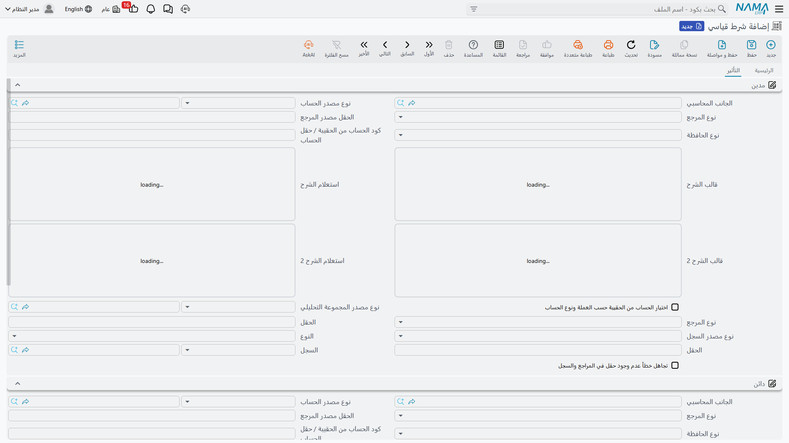
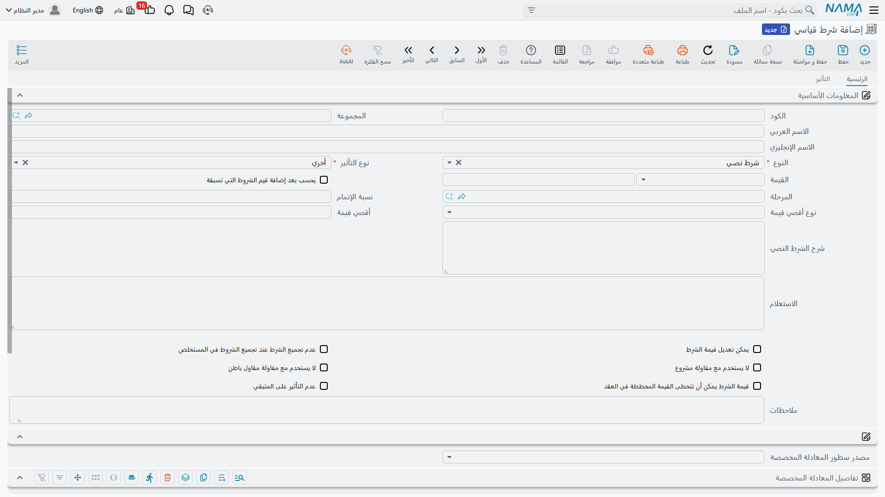
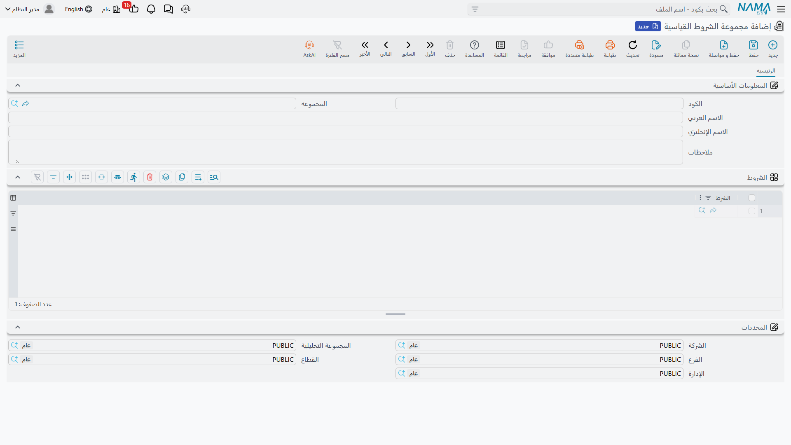

# الشروط التعاقدية

كل عقد مقاولات يحمل شروطاً تحرّك المال دون أن تكون عملاً: *احتجاز 5% من كل دفعة حتى التسليم النهائي*،
و*استرداد الدفعة المقدمة بنسبة 20% من كل مستخلص*، و*خصم 1,000 لكل يوم تأخير*، و*مكافأة 2% للإنجاز
المبكر*، و*احتجاز قسط التأمين*.

وهذه الشروط في نما تُسمّى **الشروط**، والشرط أكبر بكثير من نسبة مكتوبة على ورقة. فسجل الشرط يقول: *ما نوع
هذا الشرط*، و*متى يُطبَّق*، و*كيف تُحسَب قيمته*، و*ما الحد الأقصى الذي لا يتجاوزه*، و — وهذا ما يفوت
الناس — **على أي حسابات يُسجَّل**. ولهذا تهم هذه الصفحة: فالشروط هي الطريق الذي يصل به الاحتجاز واسترداد
الدفعة المقدمة والغرامات والمكافآت إلى دفتر الأستاذ العام.

- **المسار:** المقاولات > الملفات > شرط قياسي
- **الترخيص:** `contracting`
- هو **ملف رئيسي**. والشرط الجديد يبدأ شرطاً نصياً بلا تأثير مالي، وهذا وضع افتراضي حكيم: فأنت تقرر عن
  قصد متى يصير الشرط مالياً.

## الشرط قيد محاسبي، لا رقم

اربط شرطاً بعقد فسيظهر على كل مستخلص يُصدره العقد، مضيفاً إلى المستحق أو مستقطعاً منه. لكن المستخلص لا
يكتفي بخصم القيمة من إجمالي — بل يسجّلها.

تحمل صفحة *التأثير* جانب **مدين**، وجانب **دائن**، وزوجاً منفصلاً هو **الضريبة - مدين** و**الضريبة -
دائن**. وسلوكها على المستخلص يستحق التفصيل، لأن البديل الاحتياطي هو ما يلبس على الناس:

- **حين يكون للشرط حساباه المدين والدائن، فهما الفائزان.** والاحتجاز عادةً يجعل الطرف المدين حساب احتجاز
  مستحق لنا والطرف الدائن حساب محتجزات دائنة، فيقيم المال المحتجز ظاهراً في الميزانية حتى يُفرَج عنه. وهذا
  قيد محاسبي كامل، مُعرَّف مرة واحدة، على الشرط.
- **وحين لا يكون للشرط حسابات خاصة، تنزل القيمة على جانبي المستخلص نفسه — ويُسجَّل الاستقطاع هناك
  بالسالب.** فلا يُفقَد شيء ولا يفشل شيء؛ وإنما يخفض الاستقطاع الحسابين نفسيهما اللذين نزلت عليهما قيمة
  المستخلص، بدلاً من إيداعه في حساب مخصص له. فإن أردت أن يظهر الاحتجاز كرصيد، فأعطِ الشرط حساباته.
- **ضريبة الشرط تُسجَّل منفصلة.** إذا حمل سطر الشرط نسبة ضريبة، سُجِّلت قيمة الضريبة على حسابي الضريبة
  المدين والدائن في الشرط بدلاً من دمجها في الزوج الرئيسي.
- **والقيمة المسجَّلة** هي أيّ من قيمة الإضافة أو الاستقطاع أو «الأخرى» أنتجها الشرط.

فكتالوج الشروط الجيد هو في حقيقته مجموعة صغيرة من القيود المحاسبية الجاهزة، والحسابات فيه جزء من الشرط
كنسبته تماماً.

## متى يُطبَّق الشرط — أنواع الشروط

حقل **النوع** يحدد *المناسبة* التي يُطبَّق فيها الشرط، وهناك سبعة أنواع متاحة:

| النوع | يُطبَّق حين |
|---|---|
| شرط نصي | أبداً — فهو شرط تريد طباعته ومتابعته لا حسابه. لا تأثير مالي له مطلقاً، والنظام يشترط أن يبقى نوع تأثيره «أخري» |
| مرتبط بنسبة إتمام | تبلغ نسبة تنفيذ البند نسبة الإتمام التي حددتها على الشرط. وهكذا يُمثَّل «الإفراج عن نصف الاحتجاز عند إتمام 80%» |
| إنتهاء عقد | يُعلَّم العقد كمنتهٍ **و** يحتوي المستخلص مرحلة الشرط |
| مع المستخلص المبدئي | على المستخلص من نوع «مبدئي» فقط |
| مع كل مستخلص | على كل مستخلص يحتوي مرحلة الشرط. واترك المرحلة فارغة فيعني ذلك كل مستخلص بلا استثناء. وهذا هو النوع الذي يستخدمه الاحتجاز واسترداد الدفعة المقدمة عادةً |
| مع المستخلص الختامي | على المستخلص من نوع «ختامي» فقط — للإفراج عن الاحتجاز أو لتسوية نهائية |
| أخري | دائماً. وهو الشرط الذي لا مناسبة طبيعية له |

وباقي حقول صفحة الرئيسية تضبط الشرط:

| الحقل | ما يفعله |
|---|---|
| نوع التأثير | إضافة أو إستقطاع أو أخري — انظر أدناه |
| نوع القيمة والقيمة | كيف تُحسَب القيمة، والرقم الذي يقودها. مشروحان في القسم التالي |
| يحسب بعد إضافة قيم الشروط التي تسبقه | يُدخِل صافي أثر الشروط المجمَّعة قبله في أساس حسابه، فتتراكب سلسلة الاستقطاعات بدلاً من أن يأخذ كل منها نصيبه من الإجمالي |
| المرحلة | قصر الشرط على مرحلة واحدة |
| نسبة الإتمام | مطلوبة للشرط المرتبط بنسبة إتمام |
| نوع أقصى قيمة وأقصى قيمة | الحد الأقصى. انظر أدناه |
| شرح الشرط النصي | نص الشرط القابل للطباعة، ويُنسَخ لك على سطور البنود والعقود |
| يمكن تعديل قيمة الشرط | هل يجوز للمستخدم تجاوز القيمة المحسوبة على المستخلص |
| عدم تجميع الشرط عند تجميع الشروط في المستخلص | استبعاد الشرط من التجميع الآلي كلياً — للشروط التي تُدخلها بيدك دائماً |
| لا يستخدم مع مقاولة مشروع / لا يستخدم مع مقاولة مقاول باطن | استبعاد الشرط من البحث على أحد الجانبين، فلا يظهر شرط مقاولي الباطن على عقد مع العميل |
| قيمة الشرط يمكن أن تتخطى القيمة المخططة في العقد | السماح للشرط بتجاوز ما خطط له العقد |
| عدم التأثير على المتبقي | لا تخفض القيمة المتبقي من العقد. استخدمه للشروط التي هي حركة نقدية لا استهلاك للعقد |

## كم القيمة — أنواع القيمة

**نوع القيمة** يحدد المعادلة، و**القيمة** التي بجواره هي الرقم الذي تستخدمه المعادلة.

| نوع القيمة | ما يحسبه |
|---|---|
| قيمة | مبلغ ثابت. وهو أبسط شرط ممكن |
| نسبة من المستحق | نسبة من قيمة سطور *هذا المستخلص*. وإن سمّى الشرط مرحلةً استُخدمت قيمة تلك المرحلة وحدها. ومع خيار *يحسب بعد الشروط السابقة* يُضاف صافي الشروط المجمَّعة قبله إلى الأساس أولاً |
| نسبة من الإجمالي | نسبة من إجمالي **العقد** — أو من إجمالي سعر البند وحده حين يكون الشرط مرتبطاً بكود بند |
| نسبة من اجمالى القيمة المستحقة | نسبة من إجمالي القيمة المستحقة في المستخلص |
| نسبة من الإجمالي على مستوى البند | نسبة من صافي قيمة سطر المستخلص المطابق |
| نسبة من المستحق على مستوى البند | نسبة من القيمة المستحقة في سطر المستخلص المطابق |
| نسبة من معادلة مخصصة | نسبة من أساس تعرّفه أنت بنفسك، مكوِّناً مكوِّناً. انظر قسم المعادلة المخصصة أدناه |
| استعلام | إجمالي استعلام تكتبه أنت ويُنفَّذ على المستخلص. وهو مخرج الضرورة الأخير للشروط التي لا تغطيها معادلة |

::: tip من أين تُقرأ النسبة
في معظم أنواع القيمة تُؤخَذ النسبة من **سطر الشرط على العقد**، فتتفق على 5% مع عميل و10% مع آخر باستخدام
شرط الكتالوج نفسه.

وثلاثة أنواع تسلك سلوكاً مختلفاً: **نسبة من اجمالى القيمة المستحقة**، و**نسبة من الإجمالي على مستوى
البند**، و**نسبة من المستحق على مستوى البند** تأخذ نسبتها من **سجل الشرط القياسي** نفسه. فلهذه الثلاثة
اضبط النسبة هنا على الملف الرئيسي — فتعديلها على سطر العقد لا أثر له، وخيار *يمكن تعديل قيمة الشرط* لا
يجد ما يعمل عليه.
:::

**إضافة أم استقطاع أم أخري.** بعد حساب القيمة يحدد **نوع التأثير** موضع نزولها على المستخلص:

- **إضافة** — تُضاف القيمة إلى المستحق. المكافآت وفروق الأسعار والمبالغ المرتجعة.
- **إستقطاع** — تُحتجَز القيمة. الاحتجاز واسترداد الدفعة المقدمة والغرامات والتأمين.
- **أخري** — تُسجَّل القيمة في وعاء ثالث، للشروط التي ليست هذا ولا ذاك.

**والحد الأقصى.** حقلان إضافيان يحميانك من شرط يجري بلا كابح: **نوع أقصى قيمة** إما مبلغ ثابت وإما نسبة
من الإجمالي، ثم **أقصى قيمة** نفسها. وللشرط من نوع *مع كل مستخلص* تكون المراجعة على **الإجمالي المتراكم
عبر كل المستخلصات** — وهو تماماً ما تريده للاحتجاز، الذي يجب أن يتوقف عند النسبة المتفق عليها من العقد لا
من كل مستخلص. أما بقية الأنواع فالمراجعة على المستخلص الحالي وحده. وتجاوز الحد يرفض الحفظ برسالة قيمة شرط
غير صحيحة، ولا تُكتَب القيمة.

## الشروط التي يستوفيها مستند منفصل

بعض الشروط لا تُحسَب من المستخلص إطلاقاً — فقيمتها تأتي من مستند حرّره شخص في مكان آخر. وعمود **الارتباط
بالمستندات** على سطر الشرط هو من يقول ذلك:

| الارتباط | من أين تأتي القيمة |
|---|---|
| يستلزم سند دفعات مقدمة | من مستند دفعة مقدمة، على أي من الجانبين |
| يستلزم سند دفعات أخرى | من مستند دفعات أخرى لمقاول الباطن |
| يستلزم سند غرامة | من مستند غرامة |
| بدون | تُحسَب بالمعادلات أعلاه |

والشرط الذي ارتباطه غير *بدون* يُتجاوَز عند تجميع المستخلص لشروطه، ثم يُلتقَط من مستند الدفعة أو الغرامة
بدلاً من ذلك: فالقيمة هي ما يقول ذلك المستند إنه يجب استرداده على هذا المستخلص، أو — على المستخلص الختامي —
كل ما بقي. وأما وصولها إضافةً أو استقطاعاً فقرارٌ لمستند الدفعة.

وهذه هي الآلية التي تقف خلف
[الدفعات المقدمة من العميل](/ar/modules/contracting/project-contracting/contracting-project-advances) و
[غرامات عقد المشروع](/ar/modules/contracting/project-contracting/contracting-project-fines): الشرط على
العقد هو الخُطّاف، والمستند هو القيمة.

## المعادلة المخصصة

عاجلاً أو آجلاً يكتب عميل شرطاً لا يستوفيه أي إجمالي واحد: *«الاحتجاز 5% من قيمة البند بعد الخصم التجاري
وقبل ضريبة القيمة المضافة»*. فلا إجمالي المستخلص ولا صافي قيمة البند هو ذلك الرقم. ونوع القيمة **نسبة من
معادلة مخصصة** موجود لهذا بعينه.

تصف الأساس الذي تريده كقائمة خطوات مرتَّبة، وكل خطوة تسمّي ثلاثة أشياء:

1. **أي مكوِّن** من مكونات السطر يُنظَر إليه — السعر الرئيسي، أو أحد الخصومات، أو خصم الرأس، أو إحدى
   الضرائب، أو سعر مخصص، أو الإجمالي الجاري حتى الآن.
2. **أي رقم** يُؤخَذ من ذلك المكوِّن — قيمته المالية، أو نسبته، أو المبلغ الجاري بعد تطبيقه.
3. **كيف يُدمَج** مع الإجمالي الجاري — جمع، أو طرح، أو ضرب، أو قسمة، أو أخذ نسبة من الإجمالي الجاري، أو
   استخلاص نسبة مضمَّنة داخله.

وتُطبَّق الخطوات **بالترتيب**، ابتداءً من صفر، والناتج هو الأساس. وهناك حقل منفصل يقول **أي سطور مستخلص**
تُغذّي المعادلة:

| مصدر السطور | أي السطور |
|---|---|
| سطور المستخلص الحالي | سطور المستخلص الذي يُحرَّر الآن |
| سطور المستخلصات السابقة | سطور كل المستخلصات المعتمدة الأقدم على العقد نفسه |
| سطور المستخلص الحالي والمستخلصات السابقة | الاثنان معاً |
| من سطور المستخلص الحالي أو من سطور المستخلصات السابقة إذا لم يوجد كمية في الحالي | السطور الحالية إذا كان لأي سطر مطابق كمية محاسَب عليها، وإلا فالسابقة |

وأياً كان المصدر، تُضيَّق السطور إلى **السطور الفرعية** فقط، وإلى كود البند وحده حين يكون الشرط مرتبطاً
بكود بند. ثم تُقيَّم المعادلة **لكل سطر على حدة**، وتُجمَع نتائج السطور، وتُطبَّق نسبة الشرط على المجموع
أخيراً. والنسبة صفراً تُقرأ 100%، وهكذا تستخدم المعادلة قيمةً بنفسها لا أساساً.

::: tip بناء معادلة تعمل
عادتان توفّران متاعب كثيرة:

- **لا تترك جدول المعادلة فارغاً أبداً.** فالشرط من نوع نسبة من معادلة مخصصة بلا خطوات يحسب صفراً على كل
  مستخلص، بهدوء وإلى الأبد.
- **لا تُشِر إلا إلى مكونات تحملها سطورك فعلاً.** فإن كانت سطور مستخلصك تستخدم السعر الرئيسي وخصماً واحداً
  وضريبة واحدة، فابنِ المعادلة من هذه الثلاثة. والإشارة إلى ضريبة رابعة أو خصم ثامن لا يظهر على السطر
  ستوقف تجميع شروط المستخلص في منتصف الطريق.

وأعمدة جدول المعادلة الثلاثة تظهر عناوينها بالإنجليزية على الشاشة العربية والإنجليزية معاً.
:::

## الاحتجاز (Retention)

الاحتجاز هو الشرط الذي يحتاجه كل تطبيق مقاولات في يومه الأول، فهذا هو من أوله إلى آخره. والقاعدة:
**احتجاز 5% من كل مستخلص، محسوباً على قيمة البند بعد الخصم التجاري وقبل ضريبة القيمة المضافة، وبما لا
يتجاوز 5% من العقد.**

**مدخل الكتالوج.** شرط قياسي واحد، `RET-05` — *محتجز ضمان*:

| الحقل | القيمة |
|---|---|
| النوع | مع كل مستخلص |
| نوع التأثير | إستقطاع |
| نوع القيمة | نسبة من معادلة مخصصة |
| مصدر سطور المعادلة المخصصة | سطور المستخلص الحالي |
| نوع أقصى قيمة / أقصى قيمة | نسبة من الإجمالي / 5 |
| مدين | احتجاز مستحق لنا |
| دائن | محتجزات دائنة |

**والمعادلة** خطوتان:

| # | المكوِّن | أي رقم | العملية | الإجمالي الجاري |
|---|---|---|---|---|
| 1 | السعر الرئيسي | القيمة | جمع | 0 + 100,000 = **100,000** |
| 2 | الخصم 1 | القيمة | طرح | 100,000 − 5,000 = **95,000** |

ولم تُذكَر ضريبة القيمة المضافة قط، فاستُبعدت آلياً. وهذه هي الحيلة كلها: المعادلة تعرّف الأساس *بما
تذكره*.

**وعلى العقد** يحمل سطر الشرط للبند `1.2` القيمة 5 — وهي النسبة.

**وعلى المستخلص.** المستخلص رقم 3 يحمل البند `1.2` بقيمة سطر 100,000 وخصم تجاري 5,000، إضافة إلى ضريبة
قيمة مضافة 15% تتجاهلها المعادلة:

1. تُختار السطور: السطور الفرعية للمستخلص الحالي، مضيَّقةً على كود البند `1.2`.
2. تُقيَّم المعادلة على ذلك السطر: 100,000 − 5,000 = **95,000**.
3. طابق سطر واحد، فالأساس **95,000**.
4. النسبة 5، مأخوذةً من سطر الشرط على العقد.
5. القيمة = 95,000 × 5% = **4,750**.
6. ونوع التأثير استقطاع، فتُكتَب 4,750 في عمود الاستقطاع وتخفض الصافي المستحق للدفع.
7. ويُراجَع الحد الأقصى على الاحتجاز *المتراكم* عبر كل المستخلصات؛ فعلى عقد إجماليه 2,000,000 يكون الحد
   5% × 2,000,000 = **100,000**. وإذا كان هذا المستخلص سيدفع الإجمالي المحتجز فوق ذلك الرقم، رُفض الحفظ.
8. والقيد المحاسبي: **4,750 مديناً على الاحتجاز المستحق لنا، و4,750 دائناً على المحتجزات الدائنة.**

والإفراج عند التسليم هو الصورة المعاكسة: شرط ثانٍ نوعه *مع المستخلص الختامي* ونوع تأثيره *إضافة*، بحسابين
مدين ودائن معكوسين.

::: details الاحتجاز على قيمة شاملة الضريبة
إذا كانت سطور مستخلصك محفوظة شاملةً الضريبة واحتجت الأساس بلا ضريبة، فاستخدم *(السعر الرئيسي، القيمة،
جمع)* ثم *(الضريبة 1، القيمة، طرح)* — فتُطرَح قيمة الضريبة ويبقى الصافي.

وهناك أيضاً عملية *تستخلص* نسبةً مضمَّنة بدلاً من إزالتها: فعلى مبلغ شامل الضريبة 115,000 بنسبة 15% تنتج
115,000 − 115,000 ÷ 1.15 = 15,000، أي **حصة الضريبة**، و*تستبدل* الإجمالي الجاري بتلك الحصة بدلاً من
خصمها. فهي الأداة الصحيحة لشرط يُحسَب على الضريبة نفسها، والخاطئة لشرط يُحسَب على الصافي.
:::

## مجموعات الشروط

لا أحد يريد إدخال الشروط الخمسة نفسها على أربعين بنداً قياسياً. و**مجموعة الشروط القياسية** حزمة مسمّاة:
كود واسم وقائمة شروط.

- **المسار:** المقاولات > الملفات > مجموعة الشروط القياسية
- وتُستخدَم في موضعين بعينهما، وكلاهما على البند القياسي: اختيار مجموعة على البند يستبدل جدول شروطه بشروط
  المجموعة، وإجراء من شاشة القائمة يعيد تطبيق مجموعة كل بند مختار على جدوله على دفعة واحدة.

وأمران يجب معرفتهما قبل الاعتماد عليها: الصفوف **تُستبدَل ولا تُدمَج** — فكل ما كان في جدول شروط البند
يُطمَس. والمجموعة نفسها بلا مراجعات، فالمجموعة الفارغة أو التي تُدرِج الشرط نفسه مرتين ستُحفَظ؛ والشروط
لا تُراجَع إلا عند نزولها على بند.

## أين تسكن الشروط

يسلك الشرط طريقاً ثابتاً من الكتالوج إلى المال:

1. **البند القياسي** يحمل الشروط التي تصحب ذلك النوع من العمل دائماً.
2. **كراسة الشروط أو نموذج العقد** يحمل شروط قائمة كميات كاملة. وعلى الكراسة تكون نائمة؛ فهي هناك لتُنقَل
   إلى الأمام.
3. **عرض السعر أو المقايسة** يحملها كذلك، وتُنقَل إلى الأمام عند التحويل — ولا تؤثر في شيء على العرض أو
   المقايسة نفسها.
4. **العقد** — [عقد المشروع](/ar/modules/contracting/project-contracting/contracting-project-contract) أو
   [عقد مقاول الباطن](/ar/modules/contracting/contractor-contracting/contracting-contractor-contract) — هو
   الموضع الذي يصير فيه الشرط حقيقياً. وهذه هي القائمة التي يقرؤها المستخلص.
5. **المستخلص** يجمّع الشروط المنطبقة، ويحسب كل شرط، ويسجّله. ويعمل ذلك التجميع عند الاعتماد، ويمكن كذلك
   إطلاقه من زر على شاشة المستخلص فترى الاستقطاعات قبل الحفظ. انظر
   [مستخلص المشروع](/ar/modules/contracting/project-contracting/contracting-project-extracts) و
   [مستخلص مقاول الباطن](/ar/modules/contracting/contractor-contracting/contracting-contractor-extracts).

وعند التجميع لا يبقى الشرط إلا إذا لم يكن مستبعَداً من التجميع الآلي، ولم تكن قيمته آتية من مستند منفصل،
وكان بلا كود بند أو كان كود بنده على المستخلص. وكل ما عدا ذلك يُفلتَر في صمت — ولهذا بالضبط تستحق خيارات
*عدم التجميع* و*لا يستخدم مع…* أن تُضبَط عن قصد.

## ما يمنع الحفظ

- القيمة لا تكون سالبة، ونسبة من المستحق أو نسبة من الإجمالي فوق 100 مرفوضة.
- الشرط النصي يجب أن يبقى نوع تأثيره «أخري».
- الشرط المرتبط بنسبة إتمام يحتاج نسبة إتمامه.
- نوع أقصى قيمة يحتاج أقصى قيمة، والعكس. والحد الأقصى بالنسبة فوق 100 مرفوض، والحد الأقصى الثابت الأقل من
  قيمة الشرط الثابتة مرفوض.
- الشرط من نوع نسبة من معادلة مخصصة يحتاج مصدر سطوره.
