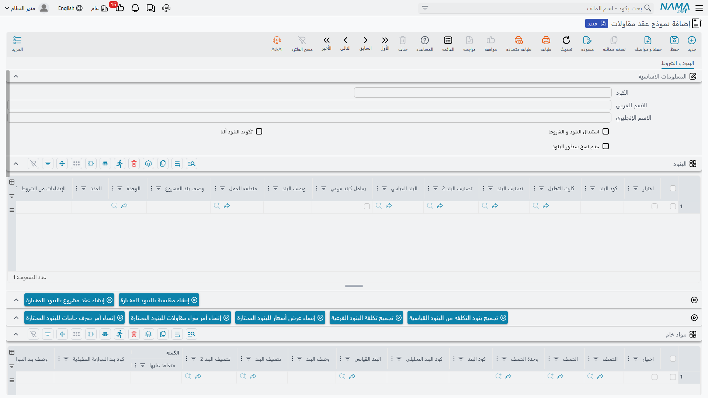

# نماذج العقود

شركات المقاولات تكرّر نفسها. فمطوِّر يبني النوع نفسه من الفلل أربعين مرة، وشركة تشطيبات تسلّم المخطط نفسه،
ومقاول محوّلات يوصّل الطاقم نفسه — وكلهم ينتجون قائمة كميات متطابقة بنسبة 90% في كل مرة. وإعادة كتابتها
بطيئة، والأسوأ أن النسخة الأربعين لا تخرج مطابقة للأولى تماماً أبداً.

و**نموذج العقد** (نموذج عقد مقاولات) هو قائمة الكميات هذه محفوظة مرة واحدة: شجرة البنود المسعَّرة، والشروط
التي تصحبها، وتكوين التكلفة الذي يقف خلف الأسعار. ابدأ عقداً من النموذج فيصل الهيكل كله مسعَّراً.

وهناك سبب ثانٍ لأهمية هذه الصفحة، وهو السبب العملي: **النموذج هو الطريقة التي تصل بها البنود والشروط إلى
العقد.** فلا يوجد زر «نسخ البنود» في أي مكان في الوحدة. وتصل البنود إلى العقد بطريقتين فقط: من
[مقايسة](/ar/modules/contracting/project-contracting/contracting-assays.md)، أو باختيار نموذج على العقد —
واختيار النموذج هو الفعل الذي يُطلق النسخ.

- **المسار:** المقاولات > الملفات > نموذج عقد مقاولات
- **الترخيص:** `contracting`
- هو **ملف رئيسي** وإن حمل جداول تشبه جداول المستندات: بلا دفتر، وبلا تاريخ فعلي، وبلا توجيه.

## ما يحمله النموذج

كل شيء على صفحة واحدة عنوانها *البنود والشروط*، وتحمل ستة جداول:

| الجدول | ما يوضع فيه |
|---|---|
| **البنود** | قائمة الكميات — بأعمدة سطر البند نفسها التي تجدها على عقد حقيقي: البند القياسي، والكود المنقوط، والكمية، والوحدة، وتكلفة الوحدة، وسعر الوحدة، والخصومات، والضرائب، ومنطقة العمل، وتصنيفا البند |
| **الشروط** | الشروط التي تصحب هذا المنتج دائماً: الضمان المحتجز، وقاعدة استرداد الدفعة المقدمة، وغرامة التأخير |
| **مواد خام** | الخامات المستهلكة، لكل بند |
| **عمالة** | العمالة المستهلكة، لكل بند |
| **مقاول باطن** | الحِزَم التي تُسندها، لكل بند |
| **مصروفات أخري** | ما بقي — إيجار المعدات، والتصاريح، والأعمال المؤقتة |

وجداول التكلفة الأربعة هي تحليل التكلفة الخاص بالنموذج، وتعمل تماماً كالعائلات الأربع على
[كارت تحليل البند](/ar/modules/contracting/setup/contracting-term-analysis-cards.md): كل صف يسمّي عنصر
تكلفة من كتالوج بنود التكلفة، مصنّفاً كمادة خام أو عامل أو مقاول باطن أو أخرى.

وثلاثة خيارات في الرأس تحكم ما يحدث عند استخدام النموذج:

| الخيار | ما يفعله |
|---|---|
| **إحلال البنود والشروط** | عند اختيار النموذج تُفرَّغ بنود المستند الهدف وشروطه أولاً، ثم توضع بنود النموذج وشروطه. اتركه مغلقاً فتُضاف سطور النموذج **إلى** ما هو موجود بالفعل |
| **تكويد البنود تلقائياً** | يعيد النموذج ترقيم أكواد بنوده المنقوطة في كل مرة يُحفَظ فيها |
| **عدم نسخ البنود** | اختيار النموذج لا ينسخ شيئاً على الإطلاق. استخدمه لإخراج نموذج من الخدمة دون حذفه، أو لنموذج محفوظ لأجل جداول تكلفته فقط |

::: warning إحلال البنود والشروط يمسح الجدول الذي تنظر إليه
على عقد فيه قائمة كميات بالفعل، فإن اختيار نموذج مفعَّل عليه خيار *إحلال البنود والشروط* يُفرِّغ جدولي
البنود والشروط قبل النسخ، وكل ما كُتب بيدك ولم يُحفَظ يزول. فعلى عقد نصف مبني، إما أن تُبقي الخيار مغلقاً
وتُرتِّب بعدها، أو أن تختار النموذج أولاً وتُعدِّل ثانياً.
:::

وليس على النموذج أي تحقق خاص به. فشجرة بنود غير متسقة، أو بند فرعي بلا سعر، أو شرط بلا قيمة — كلها تُحفَظ.
والشكاوى تأتي عند نسخ النموذج إلى عقد حقيقي وتطبيق قواعد ذلك المستند. ويستحق الأمر أن تختبر نموذجاً جديداً
بدفعه على عقد للتجربة مرة واحدة.

## بناء تكلفة النموذج ثم إعادتها إلى البنود

زرّان يجعلان النموذج محرّك تكلفة صغيراً، والمقصود استخدامهما معاً.

**تجميع بنود التكلفة من البنود القياسية** يفكّك كل سطر بند إلى مكوّناته. فهو يقرأ البند القياسي لكل سطر،
ويأخذ خلطة التكلفة المحفوظة على ذلك البند، ويكبّرها إلى كمية السطر، ويوجّه كل صف ناتج إلى مواد خام أو
عمالة أو مقاول باطن أو مصروفات أخرى بحسب تصنيف عنصر التكلفة. والتكبير يراعي ثلاثة أمور تحملها الخلطة:
الكمية التي كُتبت الخلطة **لأجلها** (فخلطة مكتوبة لـ100 م³ تُضاعف لسطر بكمية 1,200 م³)، ونسبة الهالك التي
تزيد الاحتياج، ومعامل الإنتاجية.

**تجميع تكلفة البنود الفرعية** يفعل العكس؛ فهو يجمع جداول التكلفة الأربعة بحسب كود البند ويكتب الناتج على
كل سطر بند كإجمالي تكلفته وتكلفة وحدته.

فإيقاع العمل هو: اكتب الكميات ← *تجميع بنود التكلفة من البنود القياسية* ← صحّح الأسعار والكميات في جداول
التكلفة الأربعة حيث يختلف الواقع عن الخلطة ← *تجميع تكلفة البنود الفرعية* ← فتحمل سطور البنود الآن تكلفة
للوحدة قابلة للدفاع عنها، ويصبح الربح الذي تضيفه فوقها قراراً لا تخميناً.

والزرّان يستبدلان ما في الجداول التي يملآنها، فشغّلهما قبل التعديل اليدوي لا بعده.

وهناك خمسة أزرار أخرى، وكلها تنشئ مستنداً جديداً غير محفوظ في نافذة منبثقة من الصفوف التي تؤشّرها:

| من صفوف | الزر | ما يُفتَح |
|---|---|---|
| البنود | إنشاء مقايسة بالبنود المختارة | [مقايسة](/ar/modules/contracting/project-contracting/contracting-assays.md) جديدة |
| البنود | إنشاء عقد مشروع بالبنود المختارة | [عقد مشروع](/ar/modules/contracting/project-contracting/contracting-project-contract.md) جديد |
| جداول التكلفة | إنشاء عرض أسعار للبنود المختارة | [عرض سعر مقاولات](/ar/modules/contracting/project-contracting/contracting-offers.md) جديد |
| جداول التكلفة | إنشاء أمر شراء مقاولات للبنود المختارة | أمر مقاولات متنوعة — انظر [مصروفات المقاولات المتنوعة](/ar/modules/contracting/costs/contracting-misc-spend.md) |
| جداول التكلفة | إنشاء أمر صرف خامات للبنود المختارة | [صرف خامات للمشروع](/ar/modules/contracting/costs/contracting-project-materials.md) |

فالأولان طريق «ابدأ الشيء الحقيقي من النموذج»، والثلاثة الباقية هي كيف يصير النموذج قائمة توريد لعمل
أُسنِد إليك.

## اختيار النموذج هو ما ينسخ البنود

حقل **نموذج العقد** يظهر على ست شاشات، واختياره فيها هو الآلية:

- [عقد المشروع](/ar/modules/contracting/project-contracting/contracting-project-contract.md)
- [عقد مقاول الباطن](/ar/modules/contracting/contractor-contracting/contracting-contractor-contract.md)
- [عرض سعر المقاولات](/ar/modules/contracting/project-contracting/contracting-offers.md)
- [مقايسة المقاولات](/ar/modules/contracting/project-contracting/contracting-assays.md)
- [الموازنة التقديرية](/ar/modules/contracting/budgets/contracting-estimated-budget.md)
- [الموازنة التنفيذية](/ar/modules/contracting/budgets/contracting-executive-budget.md)

والذي يسافر هو **سطور البنود وسطور الشروط**، ويُعطى كل سطر هوية جديدة على المستند الهدف، فيصبح السجلان
مستقلين من بعدها. عدّل العقد فلا يتأثر النموذج، وغيّر النموذج لاحقاً فلا تتحرك العقود المنشأة منه.

والذي **لا** يسافر هو جداول التكلفة الأربعة؛ فهي تبقى على النموذج — لكن أثرها يسافر على أي حال، لأن *تجميع
تكلفة البنود الفرعية* قد خبَز التكلفة المحلَّلة بالفعل في تكلفة الوحدة وإجمالي التكلفة على سطور البنود. وهذا
هو سبب تشغيل الزرّين معاً قبل دخول النموذج للخدمة: فالأرقام التي يرثها العقد ليست أدقّ من آخر عملية تجميع أُجريَت عليه.

والأمر الآخر الجدير بالمعرفة هو ما يفعله النموذج لك على **المقايسة**؛ فاكتب على سطر مقايسة كود بند موجوداً
كذلك على النموذج المختار فيُسحَب السطر كله — البند القياسي، وإشارة كارت التحليل، وتصنيفا البند، والحالة،
وكود البند الأعلى، والملاحظات، وتكلفة الوحدة، والكمية، ووحدتا القياس، والإجماليات. فيتحول النموذج إلى ملف
تبحث فيه بالمفتاح لا إلى نسخ بالجملة.

## نموذج برج قياسي مطبَّق على عقد جديد

برج الفنار الثاني هو المنتج نفسه الذي كان عليه الأول، فحُفظت قائمة كميات برج A كنموذج.

**النموذج `TWR-STD` — برج سكني قياسي**

| كود البند | البند | النوع | الوحدة | الكمية | سعر الوحدة | إجمالي السعر |
|---|---|---|---|---|---|---|
| `1` | أعمال الحفر | رئيسي | — | — | — | 50,000 |
| `1.01` | حفر | فرعي | م³ | 1,000 | 50.00 | 50,000 |
| `2` | الهيكل | رئيسي | — | — | — | 54,000 |
| `2.01` | خرسانة مسلحة | فرعي | م³ | 60 | 900.00 | 54,000 |
| `3` | المباني والتشطيبات | رئيسي | — | — | — | 126,000 |
| `3.01` | مباني | فرعي | م² | 2,000 | 46.00 | 92,000 |
| `3.02` | بياض | فرعي | م² | 1,000 | 34.00 | 34,000 |

وجدول الشروط: سطر واحد — ضمان محتجز 10% على كل مستخلص. والرأس: *تكويد البنود تلقائياً* مفتوح، و*إحلال
البنود والشروط* مفتوح، و*عدم نسخ البنود* مغلق.

وقبل دخول النموذج الخدمة حُسبت تكلفته: فـ*تجميع بنود التكلفة من البنود القياسية* فكّك السطور المسعَّرة
إلى خرسانة جاهزة وحديد تسليح ونجارة مسلحة وطاقم عمالة وعقدي الحفر والمباني بالباطن؛ وصُحِّحت الأسعار مقابل
فواتير آخر ثلاثة أشهر؛ ثم كتب *تجميع تكلفة البنود الفرعية* تكلفةً على كل سطر مسعَّر — 42,000 على البند
`1.01` و44,400 على `2.01`. فتكلفة المتر المكعب من الخرسانة: 740.

والآن أُسنِد برج B. أنشئ عقد المشروع `PC-2026-002` للفنار للتطوير، واختر المشروع *برج B*، ثم اختر **نموذج
العقد = `TWR-STD`**. وعند الاختيار:

1. يُفرَّغ الجدولان، لأن *إحلال البنود والشروط* مفعَّل.
2. تصل سبعة سطور بنود بأكواد `1` و`1.01` و`2` و`2.01` و`3` و`3.01` و`3.02`، وكل منها بوحدته وكميته
   وسعر وحدته وتكلفة وحدته وإجمالياته — فقيمة العقد 230,000 قبل أن يكتب أحد رقماً.
3. يصل شرط الضمان المحتجز على جدول الشروط، فينطبق الاحتجاز 10% على كل مستخلص في العقد الجديد بلا إعادة
   كتابة.

والباقي هو ما يختلف فعلاً: تاريخ التعاقد وتاريخ الانتهاء، والكميات التي لا يتطابق فيها برج B، والأسعار التي
أعدت التفاوض عليها، ومجموعة المراحل. خمس دقائق بدلاً من صباح كامل، وجانب التكلفة في كل سطر موروث لا مُختَرع.

## إلى أين بعد ذلك

- [البنود القياسية](/ar/modules/contracting/setup/contracting-standard-terms.md) — خلطة التكلفة على البند
  هي ما يقرأه *تجميع بنود التكلفة من البنود القياسية*.
- [كارت تحليل البند](/ar/modules/contracting/setup/contracting-term-analysis-cards.md) — النسخة الكاملة من
  عائلات التكلفة الأربع، وكيف تصير التكلفة المحلَّلة سعر بيع.
- [كراسة الشروط](/ar/modules/contracting/setup/contracting-term-sheets.md) — قائمة الكميات القابلة لإعادة
  الاستخدام الأخرى، وفيم تختلف عن النموذج.
- [الشروط التعاقدية](/ar/modules/contracting/setup/contracting-conditions.md) — ما تحسبه فعلاً شروط جدول
  الشروط.
- [عقد المشروع](/ar/modules/contracting/project-contracting/contracting-project-contract.md) — المستند
  الذي يوجد النموذج لأجل ملئه.
