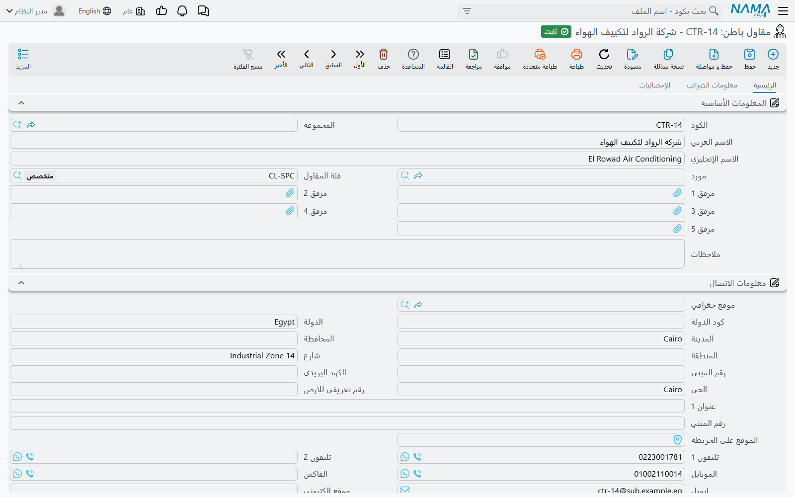
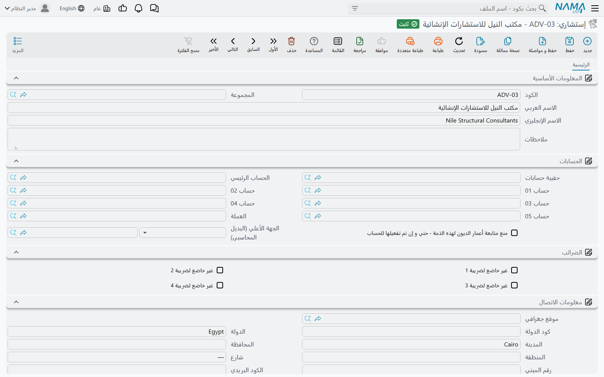

# المقاولون والاستشاريون

يقف طرفان إلى جانب صاحب المشروع في كل عمل إنشائي، وللوحدة ملف رئيسي لكل منهما.

**مقاول الباطن** (مقاول باطن) هو من تُسند إليه العمل: طاقم المباني، وشركة الكهرباء، وشركة تأجير المعدات.
وهو الطرف الذي **تدفع** له، ويحتاج هوية مالية كاملة لأن رصيده وضمانه المحتجز ودفعاته المقدمة وخصوماته كلها
يجب تتبعها.

و**الإستشاري** (إستشاري) هو من يشرف: المكتب الهندسي الذي يفحص ويعتمد ويوقّع نيابة عن المالك. وهو اسم
تسجّله على المشروع لتستطيع التقارير وقوائم الفحص والخطابات أن تقول من يشرف. وهو ليس طرفاً حاملاً للمال في
هذه الوحدة.

وكلاهما تحت **المقاولات > الملفات**، ويكفي كلاً منهما ترخيص `contracting`.

## ملف مقاول الباطن

- **المسار:** المقاولات > الملفات > مقاول باطن
- **الترخيص:** `contracting`
- **ملف رئيسي**: كود، ومجموعة، وأسماء، بلا دفتر وبلا توجيه.

### ملف قائم بذاته، ويحتاج ذمّته الخاصة

مقاول الباطن **ليس** نوعاً من الموردين في هذه الوحدة، بل ملف رئيسي قائم بذاته له **ذمة محاسبية إجبارية**
خاصة به — وهي مجموعة *الحسابات* على الصفحة الرئيسية، بحقيبة حساباتها وحسابها الرئيسي وحساباتها الخمسة
المرقّمة وعملتها. والسجل لا يُحفَظ بدونها، وهذا مقصود: فبلا ذمة لا يوجد مكان يستقر فيه مستخلصه ودفعته
المقدمة وضمانه المحتجز.

و**يمكن** له كذلك أن يشير إلى **مورد**، وملء هذا الحقل هو القرار الحقيقي الوحيد على هذه الشاشة:

- **اربطه بمورد** إذا كانت الشركة نفسها تصدر لك فواتير خارج المقاولات — كأن يبيعك خامات إلى جانب العمالة.
  فيعمل المورد وقتها كالجهة الأعلى محاسبياً للمقاول، فتستطيع القيود أن تستقر على حسابات المورد ويبقى رصيده
  الشرائي ورصيده المقاولاتي في مكان واحد. وعندما يحتاج المستخلص الجانب الدائن فهو يستخدم حسابات المقاول
  نفسه إن كانت مهيّأة، ويرجع إلى حسابات المورد المربوط عدا ذلك.
- **اتركه فارغاً** لمقاول باطن خالص، فتُستخدم حساباته الخاصة ويبقى رصيده داخل المقاولات بالكامل.

::: tip اختيار المورد يملأ لك بيانات الاتصال
اختر مورداً فتُنسَخ مجموعة الاتصال كلها — الهواتف والموبايل والفاكس والموقع الإلكتروني والبريد وكل أجزاء
العنوان. أما بيانات البنك والتسجيل الضريبي والحسابات فهي **لا** تُنسَخ، فتبقى مطلوبة بالملء المتعمَّد. وهذا
هو التقسيم الصحيح: بيانات الاتصال هي بيانات الشركة نفسها، أما الحساب البنكي الذي تسدّد إليه والرقم الضريبي
الذي تُبلِّغ به فهما قرارٌ قائم بذاته.
:::

### ما تحمله الشاشة

**الصفحة الرئيسية**

| المجموعة | ما فيها |
|---|---|
| المعلومات الأساسية | الكود، والمجموعة، والاسم العربي، والاسم الإنجليزي، والمورد، و**فئة المقاول**، ومرفق 1 … 5، والملاحظات |
| معلومات الاتصال | مجموعة العنوان الكاملة — الموقع الجغرافي، وكود الدولة، والدولة، والمدينة، والمحافظة، والمنطقة، والشارع، ورقم المبنى، والكود البريدي، والحي، والرقم التعريفي للأرض، وسطرا العنوان، والموقع على الخريطة — ومعها هاتفان وموبايل وفاكس وبريد إلكتروني وموقع إلكتروني |
| بيانات البنك | البنك، والفرع، وعنوان البنك، والبلد، وكود السويفت، ورقم الـ IBAN، والبنك الوسيط. وهذا ما تحتاجه دورة السداد |
| الحسابات | مجموعة الذمة الإجبارية الموصوفة أعلاه |
| الضرائب | علامات «غير خاضع لضريبة» الأربع، لمقاول باطن معفى أو بنسبة صفرية |
| المحددات | الشركة، والمجموعة التحليلية، والفرع، والقطاع، والإدارة |

**صفحة معلومات الضرائب** — بيانات التسجيل التي تحتاجها الفاتورة الإلكترونية: الرقم الوطني الموحد، ورقم
السجل التجاري، ورقم التسجيل الضريبي، والرقم المميز، والكيان القانوني للشركة، ورقم الملف، ورقم البطاقة
الشخصية، ونوع هوية المشتري لدى الهيئة، ومجموعتا المأمورية المختصة وطبيعة التعامل. فمقاول الباطن يصلح أن
يكون الطرف المقابل على فاتورة إلكترونية، وهذه الصفحة هي مصدر ذلك.

و**فئة مقاول الباطن** (فئة مقاول باطن) ملف رئيسي صغير خاص بها تحت المسار نفسه — كود واسم ولا شيء غيرهما.
وتستخدمه الشركات لتصنيف مقاولي الباطن (فئة أ / فئة ب) أو لتجميعهم بحسب التخصص. وهو مسمّى للتقارير والبحث:
فلا شيء في الوحدة يقيّد أو يسعّر أو يعتمد أو يمنع بناءً على الفئة.

::: info لا يوجد على كارت المقاول حقل لانتهاء الرخصة ولا للتأمين
من يأتي من نظام تأهيل مقاولين يبحث عن تاريخ انتهاء رخصة مقاول الباطن، وتغطيته التأمينية، وسجله في السلامة.
وهذه الحقول غير موجودة هنا. والمتاح هو المرفقات الخمسة العامة — ضَع فيها الرخصة وشهادة التأمين — أو معدِّل
شاشة إن احتاجت الشركة حقولاً منظّمة بتواريخ. فالوحدة نفسها لا تقوم بأي تأهيل مسبق.
:::

ولا شيء على سجل المقاول يُتحقَّق منه فيما عدا الذمة الإجبارية. فلا قاعدة تفرّد على السجل التجاري، ولا حساب
بنكي إجباري، ولا خطوة اعتماد.

### ما يقوده سجل مقاول الباطن بعد ذلك

السجل هو بوابة سلسلة التكلفة كلها. فاسمه يُختار على عرض سعر مقاول الباطن، وعلى العقد، وعلى كل مستند يصدر
عليه، والجوانب المحاسبية على تلك المستندات تستخرج ذمّتها منه — أو من المورد المربوط به:

- [عرض سعر مقاول الباطن](/ar/modules/contracting/contractor-contracting/contracting-contractor-offers.md)
  — العطاء الذي يقدّمه.
- [عقد مقاول الباطن](/ar/modules/contracting/contractor-contracting/contracting-contractor-contract.md) —
  الاتفاق، وهو كعقد المالك لا يُنتج قيداً عند التوقيع.
- [مستخلص مقاول الباطن](/ar/modules/contracting/contractor-contracting/contracting-contractor-extracts.md)
  — مطالبته بالدفع، والمستند الوحيد في تلك السلسلة الذي يُحدث أثراً محاسبياً.
- [دفعات مقاول الباطن](/ar/modules/contracting/contractor-contracting/contracting-contractor-advances-and-payments.md)
  و[غرامات مقاول الباطن](/ar/modules/contracting/contractor-contracting/contracting-contractor-fines.md) —
  الخصومات والمدفوعات المسبقة التي تصل إلى مستخلصه.
- [صرف الخامات لمقاول الباطن](/ar/modules/contracting/costs/contracting-contractor-materials.md) — خامات
  من مخزنك تُحمَّل عليه.

## الإستشاري

- **المسار:** المقاولات > الملفات > إستشاري
- **الترخيص:** `contracting`
- **ملف رئيسي**.

المسمّى الإنجليزي في القائمة هو *Advisory*، وهو ما يجعله يبدو مستنداً تُصدره، وليس كذلك. فهو **المكتب
الهندسي الاستشاري** (إستشاري) كسجل طرف، والملف كله ثلاثة أشياء: تعريف الملف الرئيسي (كود، واسم عربي، واسم
إنجليزي، ومجموعة، وملاحظات، ومحددات)، و**ذمة محاسبية إجبارية** حتى يصلح الإستشاري أن يكون صاحب حساب إن
سدّدت له مباشرة يوماً، و**مجموعة اتصال** — عنوان وهواتف وبريد إلكتروني.

وهذا كل شيء حقاً. فلا تحقق، ولا حساب، ولا أثر محاسبي خاص به، ولا حالة، ولا دورة عمل. واشرحه لمستخدم جديد
بأنه قائمة قصيرة بالمكاتب الاستشارية التي تعمل معها، محفوظة حتى تستطيع المستندات تسمية المكتب الصحيح.

وأين يُستخدَم الاسم بعد ذلك:

| الموضع | الحقل |
|---|---|
| مشروع المقاولات | الإستشاري |
| عقد المشروع | الإستشاري |
| عقد مقاول الباطن وعرض سعره | الإستشاري |
| الموازنة التقديرية والتنفيذية | الإستشاري |
| خطاب تسليم المشروع | الإستشاري |
| قوائم فحص الجودة بالموقع | الإستشاري — السجل نفسه بمسمّى مختلف |

واثنان من هذه المواضع أكثر من مجرد مسمّى، وهما الملآن التلقائيان الجديران بالمعرفة:

1. اختر **مشروعاً** على عقد فيُنسَخ استشاري المشروع على العقد. املأ الإستشاري على
   [المشروع](/ar/modules/contracting/setup/contracting-projects.md) مرة واحدة فيرثه كل عقد على ذلك الموقع.
2. حوِّل **عرض سعر مقاول باطن** إلى عقد فيُحمَل الإستشاري معه.

وفي كل ما عدا ذلك لا يقرأ الإستشاري إلا الناس والتقارير: فهو يسمّي من يعتمد
[سجلات الجودة](/ar/modules/contracting/quality/contracting-quality-overview.md)، ومن تُوجَّه إليه
الاعتمادات في
[طلبات الرفع والاعتمادات والتسليم](/ar/modules/contracting/project-contracting/contracting-measurements-and-approvals.md)،
ومن يوقّع خطاب التسليم. وهو لا يؤثر في مبلغ أبداً، ولا يحكم اعتماداً، ولا يمنع حفظاً.

## برج A — مقاول مباني بالباطن وإستشاري

**الإستشاري، مسجَّل مرة واحدة.**

| الحقل | القيمة |
|---|---|
| الكود | `ADV-002` |
| الاسم العربي / الإنجليزي | مكتب الميزان الهندسي / Al-Mizan Engineering Consultants |
| الحسابات | ذمته الخاصة، وحسابها الرئيسي تحت أتعاب مهنية |
| الاتصال | عنوان المكتب، وموبايل المهندس المشرف، والبريد الذي تُرسَل إليه الاعتمادات |

وسُمّي على المشروع `PRJ-TWR-A`، فالتقط العقد `PC-2026-001` الاسم تلقائياً عند اختيار المشروع، وكل فحص
خرسانة وكل اعتماد صنف على البرج يُظهر الآن الميزان الهندسي كإستشاري.

**مقاول الباطن، مسجَّل قبل إسناد حزمته.**

| الحقل | القيمة |
|---|---|
| الكود | `CTR-0007` |
| الاسم العربي / الإنجليزي | مقاولات البنيان للمباني / Al-Bunyan Blockwork Contracting |
| المورد | متروك فارغاً — فهو لا ينفّذ لنا شيئاً غير المباني |
| فئة المقاول | فئة ب — أعمال مباني |
| الحسابات | ذمته الخاصة، وحسابها الرئيسي تحت مقاولي الباطن الدائنين |
| بيانات البنك | الحساب الذي ستستخدمه دورة السداد، مع رقم الـ IBAN |
| معلومات الضرائب | رقم السجل التجاري ورقم التسجيل الضريبي، لأجل الفاتورة الإلكترونية |
| المرفقات | رخصته المهنية وشهادة تأمينه، ممسوحتان |

ولأن حقل المورد فارغ فذمّته هي التي تستقر عليها قيود الوحدة. ومن هنا تسير حزمته كما يسير جانب المالك تماماً
لكن في الاتجاه المعاكس: فعقد المباني `CC-0042` بقيمة 80,000 لا يُنتج قيداً عند التوقيع؛ ومستخلصه الأول
يُسجّل التكلفة والالتزام؛ ويُحتجَز الضمان وتُسترد دفعته المقدمة 16,000 من خلال جدول الشروط؛ وعندما نبيع له
أسمنتاً من مخزننا تعود القيمة كخصم على مستخلصه التالي.

## إلى أين بعد ذلك

- [دورة مقاول الباطن](/ar/modules/contracting/contractor-contracting/contracting-contractor-cycle.md) —
  سلسلة جانب التكلفة كلها، وكل موضع تتوقف فيه عن كونها مرآة لجانب المالك.
- [مشروع المقاولات](/ar/modules/contracting/setup/contracting-projects.md) — حيث يُسمّى الإستشاري لترثه
  العقود.
- [وحدات القياس والمهام والملفات المساعدة](/ar/modules/contracting/setup/contracting-lookups.md) — أسباب
  الغرامات، وهي الملف الذي يقف خلف كل خصم يُقيَّد على مقاول باطن.
