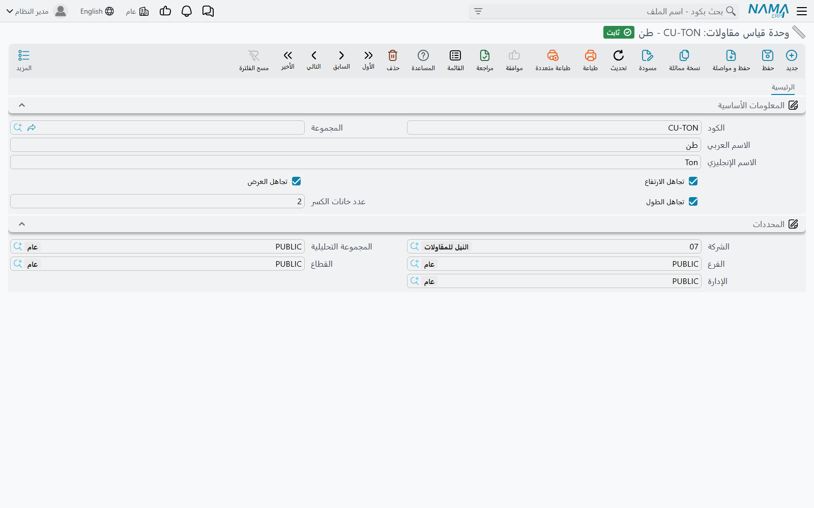

# وحدات القياس والمهام والملفات المساعدة

ستة ملفات رئيسية صغيرة تقع تحت **المقاولات > الملفات** ولا يستحق كل منها صفحة. وهي المفردات التي تُبنى منها
الشاشات الأكبر: تملؤها مرة واحدة عند التأسيس، وتضيف إليها من حين لآخر، وتنساها فيما عدا ذلك. وكلها يكفيها
ترخيص `contracting`، ولا يُنتج أي منها قيداً.

وهذه الصفحة مرجع؛ فكل قسم يقول ما هو الملف، وما عليه، ومن يقرؤه.

## وحدات قياس المقاولات

**المسار:** المقاولات > الملفات > وحدة قياس مقاولات

الوحدة التي يُقاس بها البند — م، م²، م³، طن، عدد، مقطوعية. والوحدة تحفظ وحداتها الخاصة بدلاً من إعادة
استخدام وحدات سلاسل الإمداد، لأن وحدة قياس المقاولات **قاعدة قياس** لا معامل تحويل تعبئة.

| الحقل | ما يفعله |
|---|---|
| الكود، المجموعة، الاسم العربي، الاسم الإنجليزي | التعريف المعتاد |
| تجاهل الطول، تجاهل العرض، تجاهل الارتفاع | استثناء هذا البعد من حساب الكمية |
| عدد خانات الكسر | عدد الكسور التي تُحفَظ وتُعرَض بها كميات البنود في هذه الوحدة |

ومفاتيح التجاهل الثلاثة هي بيت القصيد؛ فسطر البند يمكن قياسه بكتابة أبعاده الفعلية — الطول والعرض والارتفاع
والعدد — فتكون الكمية حاصل ضربها، **مع تخطّي كل بعد تقول الوحدة بتجاهله**:

| الوحدة | تتجاهل | 4.0 × 2.5 × 0.2 بعدد 6 تعطي |
|---|---|---|
| `M` متر | العرض والارتفاع | 24 |
| `M2` متر مربع | الارتفاع | 60 |
| `M3` متر مكعب | لا شيء | 12 |
| `NO` عدد | الطول والعرض والارتفاع | 6 |

فتعريف واحد للوحدة يحوّل مجموعة قياسات من الموقع إلى الكمية الصحيحة بلا حساب على الورق. والمفاتيح الثلاثة
تظهر فقط عند ترخيص خاصية **المقاسات** في سلاسل الإمداد؛ وبدونها تُكتَب الكمية مباشرة.

و*عدد خانات الكسر* يحكم دقة أعمدة الكمية على كل سطر بند — الكمية المتعاقد عليها، والكمية من الحصر، وكمية
المستخلص، والكمية من حصر التكاليف. اضبطه على 2 للخرسانة وعلى 0 لوحدة تُعدّ بالأعداد الصحيحة، فتتوقف الجداول
عن إظهار كميات مثل `5.999999`.

**يقرؤها:** كل سطر بند في الوحدة (العقد والمقايسة وعرض السعر والموازنة والنموذج والحصر والمستخلص)، من خلال
وحدة البند. ولاحظ أن **الخامة داخل** البند تُقاس بوحدة سلاسل إمداد عادية — فالاثنتان تتعايشان عن قصد،
واحدة للعمل وأخرى للمخزون.

## مهام المقاولات

**المسار:** المقاولات > الملفات > مهمة مقاولات

التزام مسمّى مرتبط بعقد: «تسليم اللوحات التنفيذية»، «استخراج تصريح البلدية»، «تسليم مخططات ما نُفِّذ».
والسجل كود ومجموعة واسمان وملاحظات، وحقل واحد يحمل المعنى: **الطرف**، ويحدد ما إذا كان الالتزام على شركة
التنفيذ أم على العميل.

**يقرؤه:** جدول المهام على [عقد المشروع](/ar/modules/contracting/project-contracting/contracting-project-contract.md)،
و[المقايسة](/ar/modules/contracting/project-contracting/contracting-assays.md)، و
[عرض سعر المقاولات](/ar/modules/contracting/project-contracting/contracting-offers.md).

وكن صريحاً مع المستخدمين في ماهية هذا الجدول: هو **قائمة مراجعة غير مُلزِمة**. فلا مستند يشترط وجود مهمة،
ولا تحقق يراجع إتمام مهمة، ولا شيء لاحق يتوقف على مهمة معلّقة. وهو موضع مفيد جداً لتسجيل من عليه ماذا —
قائمة مدير العقد بالمستحقات على الطرفين — وهو قائم بالكامل على الالتزام الأخلاقي.

## تصنيف بند المقاولة، وتصنيف بند المقاولة 2

**المسارات:** المقاولات > الملفات > تصنيف بند مقاولة، والمقاولات > الملفات > تصنيف بند مقاولة 2

ملفان متطابقان — كود ومجموعة واسمان وملاحظات ومحددات — يعطيان محورَي تصنيف **مستقلين** على البند. ولا شيء في
الوحدة يفرض معنى أي من المحورين. والعُرف الذي تستقر عليه معظم الشركات هو: التصنيف 1 = التخصص (مدني، كهرباء،
ميكانيكا)، والتصنيف 2 = طبيعة التكلفة (مباشرة، غير مباشرة، مبلغ احتياطي).

وخلافاً لمعظم الملفات المساعدة، يؤدي هذان عملاً حقيقياً في ثلاثة مواضع:

1. **البحث عن السعر.** سطر [قائمة الأسعار](/ar/modules/contracting/setup/contracting-price-lists.md) يمكن
   أن يُبنى على تصنيف أو على تصنيف 2 *بدلاً من* تسمية بند قياسي بعينه — وبهذا تنشر «كل أعمال الكهرباء بهذه
   الأسعار» دون سرد كل بند. وسطر قائمة الأسعار يجب أن يسمّي واحداً من الثلاثة على الأقل.
2. **إعادة التسعير.** تغيير التصنيف على سطر بند يعيد تشغيل البحث عن السعر لذلك السطر، فتصحيح سطر مصنَّف خطأً
   يصحّح سعره كذلك.
3. **تقارير التكلفة.** [كارت تحليل البند](/ar/modules/contracting/setup/contracting-term-analysis-cards.md)
   يطبع تصنيفَي رأسه على كل سطر تكلفة يُنتجه، وهو ما يجعل تقرير التكلفة بحسب التخصص أو بحسب طبيعة التكلفة
   ممكناً أصلاً.

**يقرؤهما:** سطور البنود في كل مكان بعنوان *تصنيف بند مقاولة* و*تصنيف بند مقاولة 2*، وسطور تكلفة كروت
التحليل، وسطور قوائم الأسعار بعنوان *التصنيف* و*التصنيف 2*.

## أسباب غرامات المقاولات

**المسار:** المقاولات > الملفات > سبب غرامة مقاولات

السبب خلف الخصم: تأخر التسليم، أو رسوب مكعب الخرسانة، أو مخالفة السلامة، أو إعادة العمل. وهو ملف كود واسم
فقط لا شيء غيرهما عليه.

**يقرؤه:** سطر كل مستند غرامة — [غرامات عقد المشروع](/ar/modules/contracting/project-contracting/contracting-project-fines.md)
و[غرامات مقاول الباطن](/ar/modules/contracting/contractor-contracting/contracting-contractor-fines.md) —
وسطور خصومات [مستند السركى](/ar/modules/contracting/costs/contracting-daily-labour.md). وعند معالجة الغرامة
يُحمَل السبب على قيد الغرامة المحفوظ، فتبقى الخصومات قابلة للتحليل بحسب السبب على مدى عمر المشروع.

وهو تصنيف خالص: فالسبب لا يختار حساباً ولا نسبة ولا شرطاً. ابنِ قائمة قصيرة منظّمة — عشرة أسباب أو نحوها
ستُعِد الإدارة تقاريرها عليها فعلاً — بدلاً من أن يخترع فريق الموقع سبباً لكل واقعة.

## بنود تكلفة المقاولات

**المسار:** المقاولات > الملفات > بند تكلفة مقاولات

على خلاف ما يوحي به الاسم، هذا **كتالوج** لا مستند، وهو لا يُنتج قيداً بذاته. فهو قائمة عناصر التكلفة
القابلة للتحميل التي تستهلكها شركة المقاولات ولا تحفظها في المخزن: «يومية عامل بناء»، و«ساعة حفار»، و«كهرباء
الموقع»، و«خرسانة جاهزة C30». اعتبره ملف الأصناف لما ليس صنفاً.

| الحقل | ما يفعله |
|---|---|
| الكود، المجموعة، الاسم العربي، الاسم الإنجليزي | التعريف المعتاد |
| **النوع** | **إجباري** — مواد خام أو عمالة أو مقاول باطن أو أخرى. وهو ما يوجّه العنصر إلى إحدى عائلات التكلفة الأربع |
| الصنف | ربط اختياري بصنف مخزني، لعنصر تكلفة هو فعلاً خامة تحفظها كذلك |
| الحساب | حساب المصروف أو التكلفة الذي يُحمَّل عليه العنصر |
| سعر الشراء الافتراضي | السعر الذي ينزل على السطر عند اختيار العنصر |
| سياسة الضريبة | سياسة الضريبة للسطور المبنية عليه |
| الجانب الدائن | إلى أين يذهب الطرف الدائن: حساب المورد، أو حساب محدد، أو ذمة محددة، أو ذمة المستخدم الحالي، أو التوصيف الخاص ببند الشراء المتنوع |
| نوع الحافظة، الذمة | الطرف المقابل، حيث يتطلبه الجانب الدائن |
| بند الشراء | الربط ببنية بنود الشراء |
| الوحدة، وحدة بند التكلفة | الوحدة التي يُشترى بها العنصر ويُستهلك |

وحقل **النوع** هو المهم، لأن قيمه الأربع هي بالضبط عائلات التكلفة الأربع التي تظهر على كل شاشة تكلفة في
الوحدة — مواد خام، وعمالة، ومقاول باطن، ومصروفات أخرى. فعنصر مصنَّف *عمالة* يستقر في جدول العمالة على كارت
التحليل، والمصنَّف *مواد خام* يستقر في جدول الخامات ويمكن أن يشير إلى صنف مخزني حقيقي.

**يقرؤه:**

- جداول التكلفة الأربعة على [كارت تحليل البند](/ar/modules/contracting/setup/contracting-term-analysis-cards.md)،
  و[عرض سعر المقاولات](/ar/modules/contracting/project-contracting/contracting-offers.md)، و
  [نموذج العقد](/ar/modules/contracting/setup/contracting-contract-templates.md) — حيث تُبنى التكلفة
  المخططة للبند؛
- سطور [مستندات المقاولات المتنوعة](/ar/modules/contracting/costs/contracting-misc-spend.md): الطلب والأمر
  والفاتورة؛
- سطور فاتورة صرف العمالة والمعدات، في
  [تسكين الموظفين والمعدات وتكاليفهم](/ar/modules/contracting/costs/contracting-equipment-and-allocations.md).

وكتالوج مصغَّر من ثلاثة صفوف:

| الكود | الاسم | النوع | الوحدة | سعر الشراء الافتراضي | الحساب | الجانب الدائن |
|---|---|---|---|---|---|---|
| `CDC-LAB-01` | يومية عامل بناء | عمالة | يوم | 120 | عمالة مباشرة | حساب المورد |
| `CDC-EQP-07` | ساعة حفار | أخرى | ساعة | 300 | إيجار معدات | حساب المورد |
| `CDC-MAT-22` | خرسانة جاهزة C30 | مواد خام | م³ | 260 | خامات | حساب المورد |

واختر `CDC-EQP-07` على سطر فاتورة مقاولات متنوعة بـ40 ساعة بسعر 300، فيُحمَّل 12,000 من إيجار المعدات على
كود بند المشروع — لأن تلك الفاتورة، على خلاف الكتالوج الذي خلفها، مستند تكلفة حقيقي.

## بنود المستخلص الضريبي

**المسار:** المقاولات > الملفات > بند مستخلص ضريبي

مصلحة الضرائب لا تقبل فاتورة تسرد أربعمئة بند حرّ من قائمة الكميات، بل تريد عدداً قليلاً من المنتجات
المعروفة. و**بند المستخلص الضريبي** هو أحد هذه المنتجات، ومطابقة بنودك عليها هي ما يجعل المستخلص قابلاً
للإبلاغ إلكترونياً.

| الحقل | ما يفعله |
|---|---|
| الكود، المجموعة، الاسم العربي، الاسم الإنجليزي | التعريف المعتاد |
| كود مصلحة الضرائب | الكود الذي تعرف المصلحة هذا المنتج به |
| حقل نوع الوحدة | وحدة القياس التي تتوقعها المصلحة له. وعنوان هذا الحقل يظهر بالإنجليزية على نسختَي الشاشة |
| سياسة الضريبة | سياسة الضريبة المطبَّقة عند تسعير المجموع المرحَّل |
| عدم الإرسال إلى مصلحة الضرائب | إخراج البند من الإرسال الإلكتروني كلياً |

وسطر المستخلص يجد بنده الضريبي بالبحث في ثلاثة مواضع بالترتيب: البند الضريبي المسمّى على سطر المستخلص نفسه،
ثم الذي على البند القياسي للسطر، ثم الذي على سطر بند العقد. وإن لم يكن في أي منها بند، فما يحدث بعدها يقرره
خيار على توجيه المستخلص — وذلك الخيار هو عملياً المفتاح الرئيسي للفاتورة الإلكترونية على المستخلصات.

والآلية كاملة، ومعها الجدول المرحَّل الذي يُرسَل فعلاً، في
[الضرائب على المستخلصات](/ar/modules/contracting/project-contracting/contracting-extract-taxes.md). واضبط
البند الضريبي الافتراضي على بنودك القياسية أثناء بناء الكتالوج فلا تحتاج التفكير في المطابقة مرة أخرى.

**يقرؤه:** جدول التفاصيل الضريبية على
[مستخلص المشروع](/ar/modules/contracting/project-contracting/contracting-project-extracts.md)، وحقل *بند
مستخلص ضريبي* على [البنود القياسية](/ar/modules/contracting/setup/contracting-standard-terms.md) وعلى سطور
بنود العقد.
