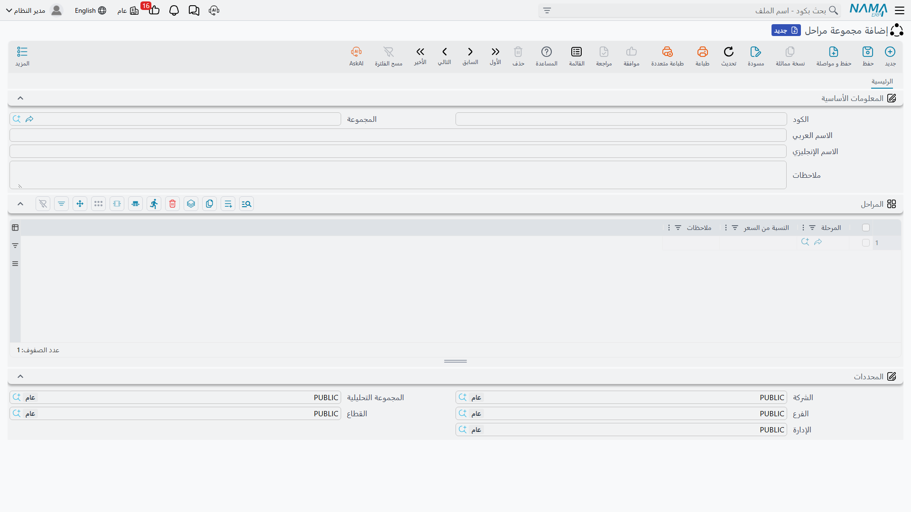
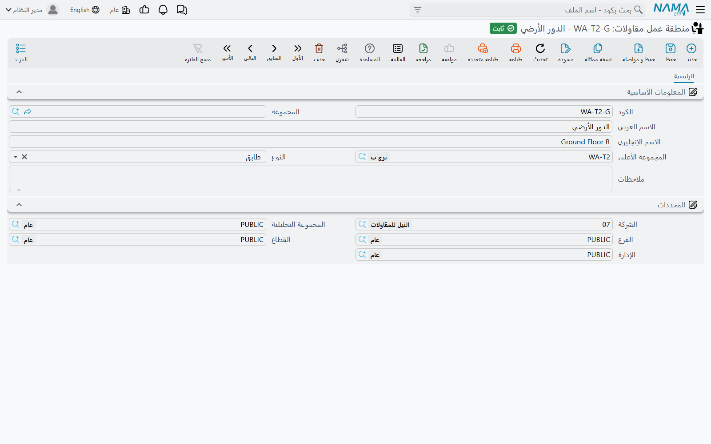

# المراحل ومناطق العمل

قائمة الكميات تجيب عن سؤال **ماذا** يُنفَّذ من عمل. وهناك سؤالان آخران يُطرحان في الموقع كل يوم ولا تجيب
عنهما شجرة البنود: **متى** يقع هذا البند في تسلسل العمل، و**أين** يقع من الموقع؟ وهذان هما المحوران اللذان
تشرحهما هذه الصفحة: المراحل ومناطق العمل.

وهما مستقلان تماماً عن بعضهما وعن شجرة البنود، ويفيد أن تكون الصورة حاضرة في ذهنك قبل المتابعة:

```
العقد
├── شجرة البنود   (البنود)      — بنود رئيسية وفرعية، بأكواد منقوطة 1، 1.1، 1.1.1 …
│     ├── منطقة العمل            — إشارة إلى شجرة مستقلة من المواقع الفعلية
│     └── المراحل                — خمس خانات مراحل مسطّحة على السطر
└── الشروط                       — قواعد مالية، كل منها يمكن ربطه بكود بند وبمرحلة
```

فلا شيء منها متداخل في الآخر. سطر البند يشير إلى منطقة عمل **واحدة** ويحمل **حتى خمس** مراحل، وشجرة مناطق
العمل لها آباء وأبناء لا تعرف عنهم شجرة البنود شيئاً.

## المراحل — محطات على بند العمل

قليل من البنود ينتقل من الصفر إلى التمام في خطوة واحدة. فبند «مباني، 2,000 م²» يمرّ بالتخطيط ثم البناء ثم
المعالجة، والمالك يتوقع أن يدفع عن كل مرحلة عند اكتمالها لا أن يدفع صفراً حتى يتم البند كله.
و**المرحلة** (مرحلة مقاولة) هي إحدى هذه المحطات.

- **المسار:** المقاولات > الملفات > مرحلة مقاولة
- **الترخيص:** `contracting`

الشاشة أصغر شاشات الوحدة: كود، ومجموعة، واسم عربي، واسم إنجليزي، وملاحظات، والمحددات المعتادة. هذا هو
السجل كله — فالمرحلة اسم ولا شيء غيره. لا تاريخ بداية، ولا مدة، ولا ارتباط بمرحلة أخرى، ولا حالة. وكل
السلوك يقع في **طريقة استخدام** المراحل لا في المرحلة نفسها.

### خمس خانات بالضبط — السقف الذي يجب التخطيط حوله

هذه أهم حقيقة تأخذها من هذه الصفحة.

::: warning سطر البند له خمس خانات مراحل، لا قائمة مراحل
الخمسة حدّ هيكلي صلب لا افتراضي يمكن رفعه. فكل سطر بند في العقد والمقايسة وعرض السعر والموازنة والنموذج
يحمل خمس خانات ثابتة، ومجموعة المراحل التي تحتوي ستّاً أو أكثر تملأ الخمس الأولى فقط، والباقي لا يصل إلى
السطر أبداً. ولأن نسب أسعار المراحل على السطر تُراجَع بعد ذلك مقابل 100%، فإن النقص يظهر لاحقاً كخطأ تحقق
على **العقد**، فيبحث الناس في المكان الخطأ. صمّم كل مجموعة مراحل بخمس مراحل أو أقل.
:::

وتحمل كل خانة:

| على الخانة | لماذا |
|---|---|
| المرحلة | أي محطة تمثّلها هذه الخانة |
| الكمية | كمية السطر المنسوبة إلى هذه المحطة |
| النسبة من السعر | حصة سعر السطر التي تُطالَب عند اكتمال هذه المحطة |
| نسبة الدفع | حصة المال المستحقة عند هذه المحطة |
| الكمية المنفذة / كمية المستخلص / الكمية المنفذة للتكاليف | عدّادات نظامية تملأها الحصور والمستخلصات وحصر التكاليف |

ويحمل السطر كذلك **المرحلة الحالية**، وهي مؤشر التقدم. ولا تكتبها بيدك: فالمستخلصات تدفعها إلى الأمام كلما
عبر العمل محطة، وإلغاء المستخلص يعيدها.

## مجموعات المراحل — نموذج المطالبة على التقدم

لا أحد يكتب خمس مراحل على أربعمئة سطر بند. و**مجموعة المراحل** (مجموعة مراحل) هي طاقم مراحل مسمّى وموزون
— «البناء القياسي = أساسات 20%، هيكل 40%، مباني 20%، تشطيبات 20%» — يبذر كل سطور البنود مرة واحدة.

- **المسار:** المقاولات > الملفات > مجموعة مراحل
- **الترخيص:** `contracting`



الشاشة مجموعة تعريف أساسية وجدول واحد باسم **المراحل**. وكل صف يسمّي مرحلة — وهي إجبارية — و**النسبة من
السعر** المُطالَب بها عندها، وملاحظات.

وقاعدتان تمنعان الحفظ: لا يجوز أن يكون الجدول فارغاً، ولا يجوز تكرار المرحلة نفسها. والمجموعة نفسها
**لا** تتحقق من أن النسب تجمع 100. فهذا التحقق يقع لاحقاً على **العقد**، حيث تُجمع الخانات الخمس لكل سطر
مسعَّر ويُرفض إن لم تبلغ 100%، وهناك مفتاح في الإعدادات يخفّف هذه القاعدة، موصوف في
[إعدادات المقاولات](/ar/modules/contracting/contracting-configuration.md). فمجموعة موزونة 20/40/20/10
تُحفظ بلا شكوى ولا تعضّ إلا عند حفظ عقد يستخدمها. اضبط الحساب في المجموعة ولن تقع في المشكلة أصلاً.

### كيف تصل المجموعة إلى سطر البند

تُختار المجموعة في موضعين: على **رأس العقد** فتنطبق على كل سطر، أو على **سطر بند بعينه** فيغلب السطر على
الرأس. وبهذا يمكن لعقد واحد أن يطالب بخرسانته على ثلاث مراحل وبتشطيباته على خمس.

::: tip اختر المجموعة من الشاشة لا بالاستيراد
اختيار مجموعة المراحل تفاعلياً على العقد يملأ في كل خانة المرحلة والكمية **والنسبة من السعر**. أما العقد
الذي يأتي بالتحويل أو الاستيراد أو خدمات الويب فيحصل على المراحل والكميات دون النسب، فيفشل بعدها تحقق
الـ 100% عند الحفظ. فإن كنت تبني عقودك بهذه الطريقة، فأعد اختيار المجموعة من الشاشة مرة واحدة، أو اكتب
النسب بيدك.
:::

وتظهر المراحل في ثلاثة مواضع أخرى تستحق المعرفة:

- **البنود القياسية** يمكن أن تحمل مجموعة مراحل افتراضية، فتصل المحطات الصحيحة مع العمل نفسه.
- **سطور الشروط** يمكن أن تسمّي مرحلة، فتسجّل المحطة التي يتعلق بها الشرط. وما يحسبه الشرط فعلاً موصوف في
  [الشروط التعاقدية](/ar/modules/contracting/setup/contracting-conditions.md).
- **المستخلصات** يمكن تهيئتها لعرض تفصيل لكل مرحلة من كل سطر مُطالَب به، وهذه الصفحة تظهر فقط عند تشغيل
  الإعداد المقابل لها.

## مناطق العمل — أين من الموقع

إن كان محور المراحل عن الزمن، فمحور **منطقة العمل** (منطقة عمل مقاولات) عن المكان. وهو شجرة من المواقع
الفعلية: القطعة، والبلوك، والمبنى، والوحدة. ومقاول يبني مجمّعاً سكنياً يستخدمه ليقول إن 120 م³ من الخرسانة
الجاهزة تخص *بلوك ب / مبنى 3*، فتصبح الحصور والمستخلصات والغرامات قابلة للتقرير بحسب الموقع لا بحسب بند
العمل وحده.

- **المسار:** المقاولات > الملفات > منطقة عمل مقاولات
- **الترخيص:** `contracting`



الشاشة ملف رئيسي بسيط: الكود، والمجموعة، والاسم العربي، والاسم الإنجليزي، و**المجموعة الأعلي**، و**النوع**،
والملاحظات، والمحددات. و**المجموعة الأعلي** هي ما يبني الشجرة — والوحدة تحفظ المسار الكامل خلف الكواليس،
وهو ما يجعل استعلام «كل ما تحت بلوك ب» ممكناً. ومنطقة العمل بلا أعلى صحيحة تماماً، فللشجرة أن يكون لها من
الجذور بعدد مواقعك.

و**النوع** موجود ليحفظ انتظام الشجرة، والقواعد التي يفرضها محدّدة:

| النوع | يجب أن يقع تحت |
|---|---|
| مربع | أي شيء، أو لا شيء — فهو الجذر الطبيعي |
| بلوك | مربع |
| قطعة أرض | مربع |
| مبني | بلوك |
| الجراج | مبني |
| وحدة | **مبني** |
| محتوي الوحدة | وحدة |
| المكونات الفرعية الوحدات | محتوي الوحدة |
| طابق | أي شيء — لا تُطبَّق عليه قاعدة |

اقرأ هذا الجدول قبل تصميم أول شجرة، فمدخلان فيه يفاجئان الناس. فـ**الوحدة** يجب أن تتبع **المبنى** مباشرة،
ومن ثم فسلسلة مبنى ← طابق ← وحدة البديهية لن تُحفظ؛ ضع الوحدات تحت المبنى مباشرة. و**الطابق** بلا قيد، وهذا
يجعله مفيداً كمسمّى حرّ تُدخله في أي موضع تحتاجه لغة الموقع عندك. وكل قاعدة تُتخطّى إذا كان الأعلى فارغاً
أو كان الأعلى بلا نوع.

::: info منطقة العمل بُعد للتقارير، وهذا كل شيء
منطقة العمل التي تضعها على سطر بند العقد تُنسخ إلى سطر الحصر، ثم إلى سطر المستخلص، ثم إلى سطر الغرامة، فهي
تسافر مع العمل وتبقى متاحة دائماً لتقرير أو لفلتر في شاشة عرض. لكن لا شيء في الوحدة يقارن أو يفلتر أو يجمع
أو يسعّر بناءً عليها: فهي لا تغيّر مبلغاً، ولا تمنع حفظاً، ولا دور لها في البحث عن السعر. استخدمها بحرية
للتحليل، ولا تتوقع منها أن تفرض شيئاً.
:::

## برج A — أربع مراحل والموقع تحتها

يُطالَب بالبرج على أربع مراحل، فتكون مجموعة المراحل:

| المرحلة | النسبة من السعر |
|---|---|
| الأساسات | 20 |
| الهيكل | 40 |
| المباني | 20 |
| التشطيبات | 20 |

أربعة سطور تجمع 100، وتبقى خانة واحدة فارغة — وكان يمكن أن تكون ثلاثة سطور أو خمسة. اربط المجموعة
`PG-TOWER` برأس العقد `PC-2026-001` فيُبذَر كل سطر مسعَّر بهذه المحطات الأربع. ومن ثم يحمل البند `3.01`
*المباني*، بكمية 2,000 م² بسعر 46.00 = 92,000، ما يلي:

| الخانة | المرحلة | الكمية | النسبة من السعر | القيمة المُطالَب بها عند المحطة |
|---|---|---|---|---|
| 1 | الأساسات | 2,000 | 20 | 18,400 |
| 2 | الهيكل | 2,000 | 40 | 36,800 |
| 3 | المباني | 2,000 | 20 | 18,400 |
| 4 | التشطيبات | 2,000 | 20 | 18,400 |
| 5 | — | — | — | — |

وكلما ارتفع البرج دفعت المستخلصات المرحلة الحالية للسطر من الأساسات إلى الهيكل فما بعده، وامتلأت عدّادات
المنفَّذ والمستخلَص على كل خانة خلفها.

أما الموقع نفسه فيُوصف على المحور الآخر، ولا صلة بين الاثنين:

```
TWR-PLOT      مربع            قطعة برج A
└── BLK-A     بلوك            بلوك أ
    └── BLD-1 مبني            برج A
        ├── U-101  وحدة       شقة 101
        ├── U-102  وحدة       شقة 102
        └── GRG-1  الجراج     جراج البدروم
```

ولاحظ أن الشقق تتبع المبنى مباشرة لا تتبع طابقاً — وتلك قاعدة الوحدة أعلاه. وحيث تهمّ الطوابق فريق الموقع،
أضِفها كمناطق عمل من نوع طابق تحت المبنى جانب الوحدات واستخدمها كمسمّيات.

والآن يستطيع سطر البند أن يقول الأمرين معاً: البند `3.01` *المباني*، منطقة العمل `BLD-1`، وأربع مراحل. ويرث
المستخلص الذي يطالب بجزء منه الأمرين، فيصبح الإيراد الناتج قابلاً للتقرير بحسب بند العمل وبحسب المحطة
وبحسب الموقع.

## إلى أين بعد ذلك

- [البنود القياسية](/ar/modules/contracting/setup/contracting-standard-terms.md) — شجرة البنود، وهي
  المحور الثالث والأهم، ومجموعة المراحل الافتراضية التي تصحب البند.
- [عقد المشروع](/ar/modules/contracting/project-contracting/contracting-project-contract.md) — حيث تلتقي
  المحاور الثلاثة على شاشة واحدة.
- [الشروط التعاقدية](/ar/modules/contracting/setup/contracting-conditions.md) — الشروط، وبعضها مربوط
  بمرحلة.
- [وحدات القياس والمهام والملفات المساعدة](/ar/modules/contracting/setup/contracting-lookups.md) — بقية
  الملفات الرئيسية الصغيرة، ومنها محورا تصنيف البنود.
