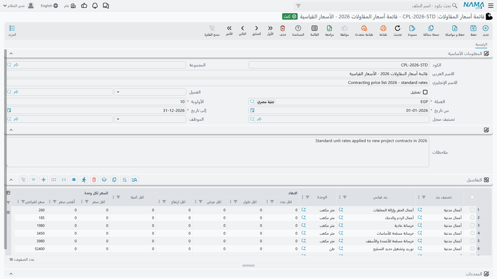

# قوائم أسعار المقاولات

إدخال سعر الوحدة يدوياً على كل سطر من كل قائمة كميات هو الطريق الذي تحدث به أخطاء التقديرات. و**قائمة
أسعار المقاولات** هي البديل: قائمة أسعار مؤرَّخة تقول ماذا تتقاضى شركتك عن كل نوع من العمل، ولأي عملاء،
وبأي عملة — فيصل السعر إلى السطر من تلقاء نفسه.

والسؤال المثير ليس كيف تبني قائمة، بل *أيّ* قائمة تفوز حين تنطبق أكثر من واحدة، والجواب قصير: **الأولوية،
ولا شيء غيرها.**

- **المسار:** المقاولات > الملفات > قائمة أسعار المقاولات
- **الترخيص:** `contracting`
- هي **ملف رئيسي**.

## قائمة الأسعار

**الرأس** يحدد نطاق القائمة كلها:

| الحقل | ما يفعله |
|---|---|
| الكود، المجموعة، الاسم العربي، الاسم الإنجليزي | التعريف المعتاد |
| العميل | لمن القائمة. يقبل عميلاً واحداً أو تصنيف عملاء كاملاً، فتستطيع نشر قائمة أسعار حكومية وأخرى للقطاع الخاص |
| العملة | مطلوبة. القائمة تسعّر بعملة واحدة |
| **الأولوية** | مطلوبة. وهي الفاصل حين تنطبق أكثر من قائمة. **الرقم الأصغر يفوز** |
| من تاريخ، إلى تاريخ | مطلوبان معاً. وخارج هذا النطاق لا وجود للقائمة بالنسبة للبحث |
| تصنيف سجل | نطاق إضافي اختياري، يُطابَق مع تصنيف سجل المستند نفسه |
| الموظف | تقييد اختياري بمندوب أو إدارة أو وظيفة أو مجموعة — فتنطبق أسعار فريق بعينه على مستنداته وحدها |
| تعطيل | إخراج القائمة من الخدمة. انظر أدناه |

**وسطور الأسعار** هي القائمة نفسها. كل سطر يجيب على سؤال «كم نتقاضى عن هذا؟»، ويمكن تكويده بثلاث طرق: على
بند قياسي بعينه، أو على تصنيف بند، أو على تصنيف البند الثاني. وهذا عن قصد: فالتسعير بالتصنيف يتيح نشر «كل
الأعمال المدنية بهذه الأسعار» دون إدراج كل بند. ولا بد من ملء واحد من الثلاثة على الأقل، ويخبرك الحفظ برقم
السطر إن تركت الثلاثة فارغة.

وبقراءة الأعمدة بالغرض لا بالعناوين، يحمل سطر السعر ما يلي:

| الغرض | الأعمدة |
|---|---|
| ما يُسعَّر | البند القياسي، تصنيف البند، تصنيف البند 2، الوحدة |
| من أي مقاس صعوداً | أقل عدد، وأقل طول، وأقل عرض، وأقل ارتفاع، وأقل كمية — وهي حدود دنيا لا فلاتر: السطر ينطبق من ذلك المقاس **صعوداً** |
| السعر | أقل سعر، وأقصى سعر، و**سعر افتراضي** |
| مفاتيح إضافية | خمسة مفاتيح نصية حرة، وحتى خمسة مصنِّفات سعر بيع حيث تكون مفتوحة |

و**السعر الافتراضي** هو الذي ينزل على سطر البند. أما أقل سعر وأقصى سعر فيُسجَّلان على القائمة كأرقام
مرجعية لفريقك التجاري، والبحث لا يراقب السعر مقابلهما.

وتحمل صفحة **الإحصائيات** في كل بند قياسي الصورة المقابلة لهذه الشاشة: قائمة للقراءة فقط بكل سطر قائمة
أسعار يذكر ذلك البند، مع تواريخه وأقل كمية وأسعاره والعميل. وهي أسرع طريقة للإجابة على سؤال «بكم نبيع
الحفر هذا العام؟».

## نشر القائمة وسحبها

تُحرَّر قائمة الأسعار كأي ملف رئيسي، لكن البحث لا يقرأ الشاشة التي تحررها. فعند الحفظ يُسقِط النظام سطور
الأسعار في جدول مطابقة مفلطح ومفهرس بكثافة، وهذا هو ما يُستعلَم عنه وقت البحث. وقبل ذلك يدفع تواريخ الرأس
وتصنيف سجله ومصنِّفات أسعاره إلى كل سطر، فيحمل السطر دائماً نسخته من النطاق الذي نُشِر تحته.

ويتبع ذلك أمران:

- **القائمة تسري عند حفظها**، لا عند كتابتها.
- **وتعليم *تعطيل* يسحب القائمة بإزالة صفوف مطابقتها.** فهو ليس علامة يستشيرها البحث — الصفوف تُحذَف
  فعلاً، فلا يمكن للقائمة المعطَّلة أن تطابق شيئاً. وأزل التعليم واحفظ فتُبنى الصفوف من جديد. وحذف القائمة
  يفعل الشيء نفسه نهائياً.

::: tip نسخة مماثلة لقائمة العام القادم
استخدم إجراء «نسخة مماثلة»، وغيّر النطاق الزمني والأولوية، وعدّل الأسعار، واحفظ. فتعيد النسخة توجيه سطورها
إلى نفسها، ويبقى الأصل سليماً.
:::

## كيف يُعثَر على السعر

حين يحتاج سطر بند سعراً، يسأل النظام خدمة الأسعار عنه. ويجري البحث على ثلاث مراحل.

**1. تجميع الصفوف المرشَّحة.** لا بد أن يستوفي الصف المطابق كل ما يلي، و«أو فارغ» تعني حقاً أن الصفوف
الفارغة أعمّ من غيرها:

- بنده القياسي هو بند السطر، **أو فارغ**؛
- تصنيف بنده هو تصنيف السطر، **أو فارغ** — وكذلك تصنيف البند 2؛
- التاريخ الفعلي للمستند يقع داخل نطاقه الزمني؛
- نطاق عميله فارغ، **أو** يسمّي عميل المستند أو تصنيفه أو أي من تصنيفات العميل المصنِّفة أو مجموعته أو
  العميل الدافع؛
- تصنيف سجله يطابق تصنيف المستند، إن قُدِّم؛
- كل محدد من المحددات الخمسة يطابق تماماً، أو يكون قيمة «بلا محدد»؛
- كل مصنِّف سعر يطابق، أو يكون فارغاً.

**2. الترتيب بالأولوية.** ترجع الصفوف المرشَّحة مرتَّبةً بالأولوية التي أعطيتها للقائمة، الرقم الأصغر
أولاً.

**3. التضييق في الذاكرة، ثم أخذ أول الباقين.** يُستبعَد المرشَّح حين:

- كان أقل عدد أو طول أو عرض أو ارتفاع أو كمية فيه **أكبر من** قيمة السطر — فالحدود دنيا، فيُستبعَد صف
  مكوَّد «من 500 م³ صعوداً» لسطر بكمية 300 م³؛
- كانت وحدته تختلف عن وحدة السطر؛
- كان أحد مفاتيحه النصية الخمسة مملوءاً ويختلف عن مفتاح السطر؛
- لم يكن منطبقاً على الموظف المذكور على المستند.

**وأول صف يبقى واقفاً هو الفائز.** فيصير سعره الافتراضي سعر وحدة السطر، ويرجع أقل سعره وأقصى سعره معه
للاستئناس — إضافة إلى أي مبلغ يحمله مصنِّف سعر بيع، حيث يفوز مصنِّف السطر على مصنِّف المستند.

وإن لم يطابق شيء أصلاً، لم يُكتَب شيء وبقي السطر على ما كان عليه.

::: info سلسلة البدائل لسعر الوحدة
حين تختار بنداً قياسياً على سطر، يُستخرَج السعر بهذا الترتيب:

1. السعر الراجع من بحث قوائم الأسعار؛
2. وإلا فسعر الوحدة **الافتراضي** في البند القياسي؛
3. وإلا فما هو موجود على السطر أصلاً.

ثم يُحسَب السعر قبل الخصم من الكمية، وتُحوَّل أي نسبة خصم على السطر إلى قيمة خصم.
:::

## الأولوية هي الفاصل — قائمتان متداخلتان

هذا هو المثال الذي يجب أن تحفظه، لأن الجواب البديهي هو الجواب الخاطئ.

**القائمة `PL-2026-A`** — قائمة الأسعار الحكومية العامة:

- العميل: تصنيف العملاء *حكومي*؛ العملة: العملة المحلية
- الأولوية: **10**؛ سارية من 1 يناير إلى 31 ديسمبر 2026
- سطر سعر واحد: البند القياسي `EXC-01` (حفر)، الوحدة م³، أقل كمية 500، أقل سعر 78، أقصى سعر 95، **السعر
  الافتراضي 85**

**والقائمة `PL-2026-B`** — قائمة أسعار متفاوض عليها مع جهة واحدة:

- العميل: العميل بعينه *هيئة تطوير الرياض* (وهو عضو في تصنيف *حكومي*)
- الأولوية: **20**؛ سارية من 1 يناير إلى 31 ديسمبر 2026
- سطر سعر واحد: البند القياسي `EXC-01`، الوحدة م³، أقل كمية 0، **السعر الافتراضي 92**

والآن أدخل `EXC-01` بكمية 1,200 م³ على عقد مشروع لهيئة تطوير الرياض بتاريخ مارس 2026.

1. الصفّان مرشَّحان: `PL-2026-A` يطابق من خلال تصنيف العميل، و`PL-2026-B` من خلال العميل نفسه؛ والنطاقان
   الزمنيان يغطيان مارس؛ والبند والوحدة يطابقان في الاثنين.
2. ويرجعان مرتَّبين بالأولوية: `PL-2026-A` (10) أولاً، ثم `PL-2026-B` (20).
3. ويجتاز الصفّان فلتر الحدود الدنيا — 500 ≤ 1,200 و0 ≤ 1,200 — ولا يُستبعَد أحدهما بسبب وحدة أو مفتاح
   نصي.
4. **فيفوز أول الباقين: 85**، من القائمة العامة.

فالقائمة الخاصة بالعميل *خسرت*، مع أنها تسمّي العميل صراحةً والعامة لا تسمّي إلا تصنيفه. فليس هناك مفهوم
«الأكثر تخصيصاً»، ولا تفضيل للحد الأضيق. **القوائم المتداخلة تُحسَم بالأولوية وحدها.**

ولتفوز الأسعار المتفاوض عليها، أعطِ `PL-2026-B` أولوية **5** وأعد حفظها. فتصير الأولى في الترتيب ويُسعَّر
السطر بـ 92. والقاعدة العملية لبناء هيكل قوائم الأسعار هي إذن:

::: tip رقّم أولوياتك بحسب مدى تخصيص القائمة
احفظ الأرقام الصغيرة للقوائم الضيّقة والأرقام الكبيرة للبدائل الاحتياطية — مثلاً قوائم العميل بعينه عند
10، وقوائم تصنيف العملاء عند 50، وقائمة الشركة الافتراضية عند 100. واترك فراغات لتُدخِل طبقة جديدة لاحقاً
بلا إعادة ترقيم.
:::

ولاحظ ما تفعله الحدود الدنيا بعد أن تحسم الأولوية. غيّر الكمية على ذلك السطر من 1,200 إلى **300** فيُستبعَد
صف `PL-2026-A` — لأن أقل كمية فيه 500 وهي أكبر من 300 — فيصير `PL-2026-B` أول الباقين ويكون السعر 92.
فنطاقات الكميات تعمل، لكنها تعمل *داخل* ترتيب الأولوية لا بدلاً منه.

## أين يعمل البحث، وأين لا يعمل

يعمل البحث على المستندات التي يُحدَّد فيها سعر للعميل:

- [عقود المشروع](/ar/modules/contracting/project-contracting/contracting-project-contract) و
  [تعديلاتها](/ar/modules/contracting/project-contracting/contracting-project-contract-updates)
- [عقود مقاولي الباطن](/ar/modules/contracting/contractor-contracting/contracting-contractor-contract)
  وتعديلاتها
- [عروض أسعار مقاولي الباطن](/ar/modules/contracting/contractor-contracting/contracting-contractor-offers)
- [مقايسات المقاولات](/ar/modules/contracting/project-contracting/contracting-assays)
- [عروض الأسعار للعملاء](/ar/modules/contracting/project-contracting/contracting-offers)
- [الموازنة التقديرية](/ar/modules/contracting/budgets/contracting-estimated-budget) و
  [الموازنة التنفيذية](/ar/modules/contracting/budgets/contracting-executive-budget)

وعلى تلك الشاشات يعمل عند تغيير البند القياسي أو تصنيف البند أو أحد مصنِّفات السعر أو الكمية المخصومة أو
أحد المحددات. وشرطان يجب توافرهما وإلا لم يسأل أصلاً: أن يحمل السطر **واحداً على الأقل** من بند قياسي أو
تصنيف بند أو تصنيف بند 2، وأن تكون له **كمية غير صفرية**. والشرط الثاني يفسّر معظم أسئلة «لماذا لم يظهر
سعر؟» — فأدخل الكمية أولاً، أو أعد اختيار البند بعدها.

::: warning كراسة الشروط مستبعدة
بحث قوائم الأسعار **لا** يعمل على [كراسة الشروط](/ar/modules/contracting/setup/contracting-term-sheets).
فسعر السطر على كراسة الشروط يأتي من سعر الوحدة الافتراضي في البند القياسي، أو من كل ما يدخله مهندس
التقديرات أو يستنتجه من الهامش.

فإن كان لا بد أن تقود الأسعار المنشورة تسعيرك، فسعّر العمل على مقايسة أو عرض سعر لا على كراسة.
:::
