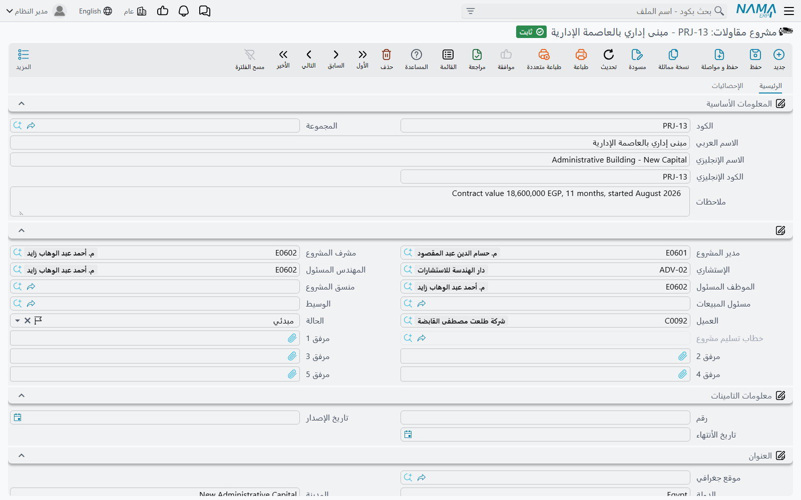

# مشروع المقاولات

اسأل مدير الموقع عمّا يعمل عليه فلن يجيبك «العقد PC-2026-001»، بل سيقول «برج A». و**المشروع**
(مشروع مقاولات) هو تدوين هذه الإجابة: الموقع، والمنشأة، والعمل الذي يسميه كل من فيه بهذا الاسم. وكل ما
عدا ذلك في الوحدة — عرض السعر الذي كسب العمل، والعقد الذي ينظّمه، والخامات التي تُصرف للموقع، والعمالة
التي تبني، وسجلات الفحص، والمستخلصات التي تُحصِّل بها مالك — يحمل إشارة إلى مشروع واحد، حتى يمكن تجميع
كل ما يخص موقعاً واحداً في صورة واحدة.

وهو سجل نحيل عن قصد؛ فالمشروع يحمل المسؤولين، والعميل، والمشرف، وموقع الأرض، ووثيقة التأمين التي تغطيه.
ولا يحمل كميات ولا أسعاراً ولا أي مال.

- **المسار:** المقاولات > الملفات > مشروع مقاولات
- **الترخيص:** `contracting`
- هو **ملف رئيسي** لا مستند: بلا دفتر، وبلا تاريخ فعلي، وبلا توجيه.

## المشروع بلا حياة محاسبية خاصة به

إنشاء المشروع لا يُنتج أي قيد. وكذلك إنشاء عقد عليه — وهي
[القاعدة التي تحكم الوحدة بأكملها](/ar/modules/contracting/contracting-overview.md): الإيراد لا يصل إلى
الأستاذ العام إلا عبر المستخلص. فسجل المشروع حاوية ومفتاح للتقارير، لا حدثاً محاسبياً.

ومع ذلك **يمكن** للمشروع أن يكون صاحب حساب، وهذا شيء آخر يخلطه الناس بالأول. فالشاشة تحمل مجموعة
**الحسابات** المعتادة، ومن ثم يصلح المشروع أن يكون **ذمة** محاسبية بذاته: امنحه حساباً رئيسياً وحقيبة
حسابات، وكل قيد يستخرج ذمّته «من المشروع» يستقر على رصيد هذا المشروع. والمواقع التي تُدار كمراكز تكلفة
وإيراد مستقلة تُهيَّأ عادةً بهذه الطريقة، أما المواقع التي يكفيها التبويب في التقارير فلا.

## ما يحمله السجل

**التعريف** — الكود، والمجموعة، والاسم العربي، والاسم الإنجليزي، والكود الإنجليزي، والملاحظات. ويستحق
استخدام شجرة المجموعات من البداية: فمشروعات التطوير وأعمال الصيانة والأعمال الداخلية تُفلتَر بصور مختلفة
تماماً في كل شاشة عرض في الوحدة.

**الأشخاص** — وهم معظم الشاشة، وكلهم حقول مرجع:

| الحقل | من يسميه |
|---|---|
| مدير المشروع، مشرف المشروع، المهندس المسئول، الموظف المسئول، منسق المشروع | فريقك على العمل |
| مسئول المبيعات | من يملك العلاقة التجارية |
| الإستشاري | المكتب الاستشاري المشرف — انظر [المقاولون والاستشاريون](/ar/modules/contracting/setup/contracting-contractors-and-consultants.md) |
| العميل | صاحب المشروع الذي تُطالبه |
| الوسيط | الوسيط أو السمسار حيث يوجد |
| الحالة | وصف تحفظه بيدك |
| مرفق 1 … 5 | مخططات الموقع، وخطاب الإسناد، والتصريح |

::: info حقل الإستشاري يؤدي عملاً حقيقياً على العقد
ملء **الإستشاري** هنا ليس تسمية فقط؛ فعندما تنشئ عقد مشروع لاحقاً وتختار هذا المشروع عليه، يُنسَخ استشاري
المشروع على العقد نيابة عنك. وهذا أحد موضعين فقط يُقرأ فيهما الإستشاري أصلاً، وهو يوفّر عليك أكثر حقل
يُنسى على شاشة العقد.
:::

**الحالة** وصف حرّ — قيد التنفيذ، أو معلق، أو منتهي، وما إلى ذلك. ولا يقرأها شيء في الوحدة: فهي لا تُغلق
المشروع، ولا تمنع إصدار مستندات عليه، ولا تحرّك منطق أي تقرير بذاتها. عامِلها كملاحظة قابلة للفلترة يحفظ
فريقك صدقها، وإن أردت منعاً حقيقياً فاستخدم إجراء *منع الاستخدام* في المنصة.

**معلومات التأمينات** — رقم الوثيقة وتاريخا إصدارها وانتهائها. وثيقة واحدة لكل مشروع، وهو الحال الطبيعي
لوثيقة أخطار المقاولين أو الغير التي تُصدَر لكل موقع.

**العنوان** — الموقع الجغرافي، والدولة، والمدينة، والمحافظة، والمنطقة، وسطرا العنوان، ورقم المبنى، والموقع
على الخريطة. وهذا عنوان **الموقع** لا عنوان العميل، وهو ما يحتاجه السائق أو المفتش.

**الحسابات والضرائب** — مجموعة الذمة الموصوفة أعلاه، ومعها أربع علامات «غير خاضع لضريبة» لخانات الضريبة
الأربع، وهي مهمة على المشروعات المعفاة أو ذات النسبة الصفرية.

**المحددات** — الشركة، والمجموعة التحليلية، والفرع، والقطاع، والإدارة، كما في كل ملف رئيسي.

**إنشاء سند أصل ثابت** هو الزر الوحيد على الشاشة. فإذا كان المشروع الذي بنيته سيبقى في دفاترك — مبنى
الإدارة، أو برج طوَّرته لنفسك — فاضغطه ليُفتح سند إنشاء أصل ثابت جديد غير محفوظ بسطر واحد يشير بالفعل إلى
هذا المشروع كمشروع وكذمة معاً. واحفظ المشروع أولاً، فالزر يحتاج سجلاً محفوظاً. والمستند نفسه موصوف في
[تسكين الموظفين والمعدات وتكاليفهم](/ar/modules/contracting/costs/contracting-equipment-and-allocations.md).

::: tip لا شيء على هذه الشاشة إجباري
لا يوجد أي تحقق على المشروع إطلاقاً: لا عميل إجباري، ولا قواعد تواريخ، ولا انتقالات حالة، ولا شيء يجب ملؤه
قبل الحفظ. وهذا مريح في اليوم الأول ومكلف في الشهر السادس، حين يكون نصف المشروعات بلا عميل ويتحول تقرير
الإيراد بحسب العميل إلى تخمين. اتفقوا على الحقول القليلة التي تُصر عليها شركتك — العميل، ومدير المشروع،
والمجموعة — وافرضوها بالانتظام أو بمعدِّل شاشة، فالنظام لن يفرضها.
:::

## مشروع واحد وعقود عديدة

المشروع ليس هو العقد، والوحدة تُبقي العلاقة بينهما واحداً إلى متعدد عن قصد. فالمشروع حاوية، وعقد المشروع
— الاتفاق المسعَّر مع المالك — يشير إليه، ويمكن أن تشير عدة عقود إلى المشروع نفسه. وهذا ما يمثّل:

- منشأة تُسند على حِزَم: أعمال التمكين بعقد، والهيكل الخرساني بعقد آخر؛
- مشروعاً له عقد مالك **و** عقود مقاولي الباطن التي تنفّذ أجزاء منه، وكلها تتشارك مشروعاً واحداً؛
- الملاحق، حيث يُربط عقد ثانٍ بالأول باعتباره عقده الرئيسي، فتنشأ طبقة تجميع ثانية.

وصفحة المشروع الثانية **الإحصائيات** هي حيث يظهر ذلك: قائمة للعرض فقط بكل عقد مشروع صادر على هذا المشروع،
مع عميله وتاريخ تعاقده وتاريخ انتهائه وإجمالي قيمته. وهي أسرع جواب لسؤال «ماذا تعاقدنا عليه في هذا
الموقع؟».

وتفصيل العقد نفسه في [عقد المشروع](/ar/modules/contracting/project-contracting/contracting-project-contract.md).

## برج A

هذا هو سجل المشروع الذي تستخدمه بقية صفحات هذا التوثيق.

| الحقل | القيمة |
|---|---|
| الكود | `PRJ-TWR-A` |
| الاسم العربي / الإنجليزي | برج A / Tower A |
| المجموعة | مشروعات سكنية |
| العميل | الفنار للتطوير |
| مدير المشروع | مدير موقع البرج |
| الإستشاري | مكتب الميزان الهندسي |
| الحالة | قيد التنفيذ |
| التأمين | الوثيقة `CAR-2026-118`، صادرة 1 يناير 2026 وتنتهي 31 ديسمبر 2027 |
| العنوان | عنوان القطعة، والموقع على الخريطة مثبَّت على بوابة الموقع |

وبعد الحفظ لم يُنتج أي قيد ولا أي حركة مخزنية على الإطلاق. ما أنتجه هو **مفتاح**؛ فمن هذه اللحظة:

1. يُنشأ **عقد المشروع** `PC-2026-001` بقيمة 230,000 على `PRJ-TWR-A`، واختيار المشروع ينسخ عليه الفنار
   للتطوير والميزان الهندسي.
2. يسمّي **عقد مقاول الباطن** `CC-0042` الخاص بأعمال المباني المشروع نفسه، فتستقر تكلفة المباني وإيرادها
   على موقع واحد.
3. كل **صرف خامات**، و**مستند سركى**، و**تسكين معدات**، و**فاتورة متنوعة** للبرج تسمّي `PRJ-TWR-A` وكود
   بند، وهو ما يجعل معرفة التكلفة الفعلية لكل بند عمل ممكنة أصلاً.
4. كل **مستخلص** — على جانب المالك وجانب مقاول الباطن — يحمل المشروع، فيصبح الداخل والخارج من النقد قابلاً
   للتقرير عليه.
5. وعند تسليم البرج يسجّل **خطاب تسليم المشروع** تاريخ التسليم ويطبع نفسه على سجل المشروع هذا. انظر
   [طلبات الرفع والاعتمادات والتسليم](/ar/modules/contracting/project-contracting/contracting-measurements-and-approvals.md).

## إلى أين بعد ذلك

- [البنود القياسية](/ar/modules/contracting/setup/contracting-standard-terms.md) — كتالوج الأعمال الذي
  يُبنى منه العقد، وهو التالي في الترتيب وأهم ما يجب ضبطه.
- [المراحل ومناطق العمل](/ar/modules/contracting/setup/contracting-phases-and-work-areas.md) — الطريقتان
  الأخريان لتقسيم أعمال المشروع: المراحل، والمواقع الفعلية على الأرض.
- [المقاولون والاستشاريون](/ar/modules/contracting/setup/contracting-contractors-and-consultants.md) —
  مقاولو الباطن الذين ستُسند إليهم الحِزَم، والإستشاري الذي سمّيته هنا.
- [دورة مقاولة المشروع](/ar/modules/contracting/project-contracting/contracting-owner-cycle.md) — عرض
  السعر، فالعقد، فالحصر، فالمستخلص، فالتحصيل.
- [كيف تتكوّن تكلفة المشروع](/ar/modules/contracting/costs/contracting-cost-model.md) — من أين تأتي
  التكلفة الفعلية التي تظهر على هذا المشروع.
