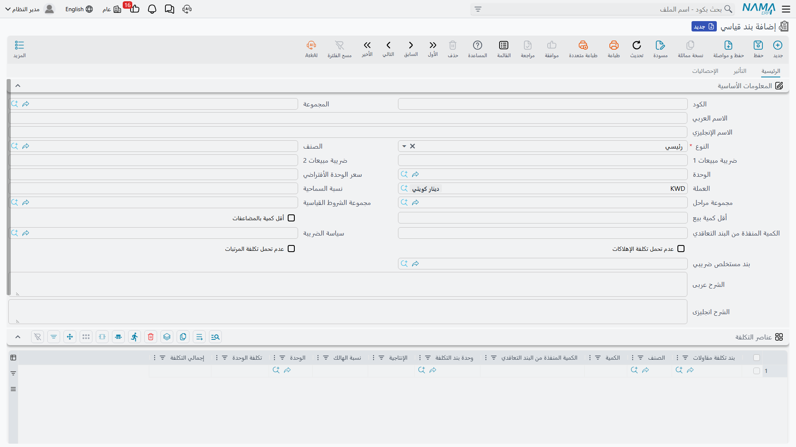
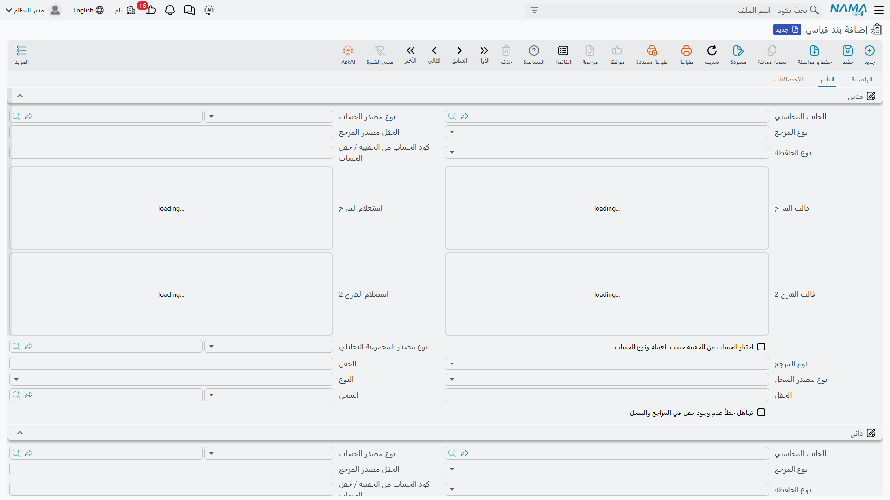
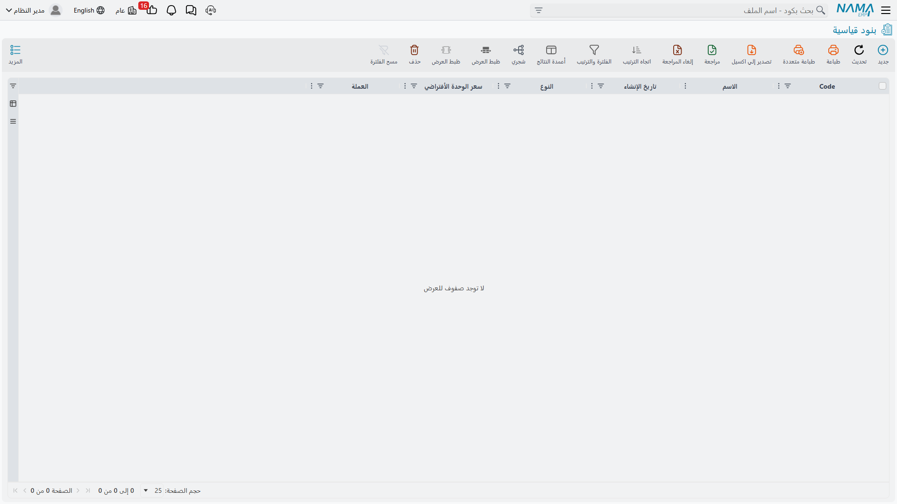

# البنود القياسية

شركة المقاولات لا تبيع أشياء، بل تبيع **عملاً**: كذا متراً مكعباً من الحفر، وكذا متراً مربعاً من
البياض، وكذا متراً طولياً من الأرصفة. كل سطر من هذه السطور له وحدة قياس، وكمية، وسعر للوحدة، ونسبة
تنفيذ تكبر شهراً بعد شهر حتى يكتمل السطر. هذا السطر يسمى **بنداً**، ووحدة المقاولات في نما مبنية كلها
حوله.

قبل أن تُدخل عقداً واحداً، تبني كتالوجاً لأنواع الأعمال التي تنفذها شركتك، وكل مدخل في هذا الكتالوج
هو **بند قياسي**. يُعرِّف مهندس الحصر «حفر في تربة عادية» مرة واحدة — وحدته م³، وسعره المعتاد 85،
وعليه ضريبة قيمة مضافة، وتكلفته للوحدة تقارب كذا، ويصحبه دائماً شرط احتجاز — ومن بعدها تشير إليه
كل كراسة شروط وكل عقد وكل مستخلص وكل تقرير تكلفة في النظام.

هذه الصفحة هي الأساس؛ فكراسات الشروط وكروت التحليل وقوائم الأسعار والعقود والمستخلصات كلها تتكئ على ما
تقرره هنا.

- **المسار:** المقاولات > الملفات > بند قياسي
- **الترخيص:** `contracting`
- هو **ملف رئيسي** لا مستند: بلا دفتر، وبلا تاريخ فعلي، وبلا توجيه.

## ما هو البند، ولماذا لا يصلح الصنف بديلاً عنه

من يأتي إلى المقاولات من وحدة سلاسل الإمداد يحاول عادةً تمثيل الأعمال المتعاقد عليها كأصناف، ولا يستقيم
الأمر أبداً. الاثنان مختلفان في طبيعتهما، والوحدة تفصل بينهما عن قصد:

| | البند | الصنف |
|---|---|---|
| ما هو | عمل تتعاقد على تنفيذه | خامة تشتريها وتخزّنها وتستهلكها |
| يُقاس بـ | وحدة قياس مقاولات (م، م²، م³، طن، عدد، مقطوعية) | وحدة مخزنية لها معاملات تحويل |
| يحرك المخزون؟ | أبداً | دائماً |
| يُسعَّر لـ | صاحب المشروع، من خلال المستخلص | لا أحد مباشرة، فهو تكلفة |
| له نسبة تنفيذ؟ | نعم، تنمو على مدى عمر العقد | لا |
| كيف تُحسب تكلفته | بكل ما يُحمَّل على كود البند | بتقييم المخزون |

لا يتحرك شيء في المخزن عند التعاقد على بند، ولا يُطالَب عميل بشيء عند صرف صنف للموقع. ويلتقي الاثنان في
مكان واحد: **كتالوج عناصر التكلفة** (المقاولات > الملفات > بند تكلفة مقاولات)، حيث يُسجَّل كل مكوِّن من
مكونات البند ويُصنَّف كـ *مادة خام* أو *عامل* أو *مقاول باطن* أو *أخرى*. عنصر التكلفة من نوع مادة خام
يمكن أن يشير إلى صنف مخزني حقيقي، أما عنصر من نوع عامل فلا، لأنه لا يوجد في المخزن شيء اسمه «عامل». وهذا
الكتالوج هو ما يستخدمه [كارت تحليل البند](/ar/modules/contracting/setup/contracting-term-analysis-cards)
لتفكيك البند إلى ما ينفّذه.

::: info ثلاثة أشياء تُسمّى «بند»
من المفيد جداً التمييز بينها من اليوم الأول:

1. **البند القياسي** — مدخل الكتالوج الذي تشرحه هذه الصفحة. قابل للاستخدام المتكرر، له كود مثل
   `EXC-01`، ويُعرِّف *نوعاً* من العمل.
2. **كراسة الشروط** — قائمة كميات مسعَّرة كاملة محفوظة كمستند قابل للاستخدام المتكرر، وتشرحها صفحة
   [كراسة الشروط](/ar/modules/contracting/setup/contracting-term-sheets).
3. **سطر البند** — صف واحد داخل عقد أو مقايسة أو موازنة أو مستخلص. يشير إلى بند قياسي، ويحمل الكود
   الهرمي المنقوط (`1`، `1.1`، `2.3`) الذي يُسدَّد عليه في المستخلص.

فـ `EXC-01` كود كتالوج، و`1.2` هو موضع مدخل الكتالوج ذاك داخل قائمة كميات بعينها. الاثنان يُسمَّيان
كوداً، وهما ليسا الشيء نفسه.
:::

## كتالوج البنود القياسية



تحمل صفحة *الرئيسية* كل ما يحتاجه البند ليُختار في قائمة كميات.

**التعريف والقياس**

| الحقل | ما يفعله |
|---|---|
| الكود، المجموعة، الاسم العربي، الاسم الإنجليزي | تعريف الملف الرئيسي المعتاد |
| النوع | رئيسي أو فرعي — انظر قسم البنود الرئيسية والفرعية أدناه. البند الجديد يبدأ رئيسياً |
| الوحدة | وحدة قياس المقاولات التي يُقاس بها العمل |
| سعر الوحدة الافتراضي | السعر الذي ينزل على سطر البند حين لا تُطابق أي قائمة أسعار |
| العملة | تأخذ افتراضياً عملة الشركة التي تعمل عليها |
| الصنف | ربط اختياري بصنف مخزني، للبند النادر الذي يقابل صنفاً قابلاً للبيع مقابلة واحدة بواحد |

**الافتراضيات التجارية**

| الحقل | ما يفعله |
|---|---|
| ضريبة مبيعات 1، ضريبة مبيعات 2 | نسب ضريبة المبيعات التي تُنسخ على كل سطر بند. لا تكون سالبة ولا تتجاوز 100 |
| سياسة الضريبة | سياسة الضريبة المطبَّقة على السطور المبنية على هذا البند |
| بند مستخلص ضريبي | المنتج الذي يُبلَّغ به هذا البند لمصلحة الضرائب. انظر [الضرائب على المستخلصات](/ar/modules/contracting/project-contracting/contracting-extract-taxes) |
| نسبة السماحية | مقدار ما يُسمح للموقع بتنفيذه فوق الكمية المتعاقد عليها. لا معنى لها إلا على بند فرعي، وتُعطَّل على الرئيسي |
| أقل كمية بيع، أقل كمية بالمضاعفات | قيود بيعية على الكمية |
| مجموعة مراحل | مجموعة المراحل الافتراضية للسطور المبنية على هذا البند. تُفرَّغ وتُعطَّل على البند الرئيسي |
| مجموعة الشروط القياسية | اختر مجموعة فيُملأ جدول الشروط من محتواها |

**مفاتيح تحميل التكلفة**

خياران يحددان ما إذا كان هذا النوع من العمل يتحمل نصيبه من التكاليف الموزَّعة على المشروع: *عدم تحمل
تكلفة الإهلاكات* و*عدم تحمل تكلفة المرتبات*. علّمهما على البنود التي يجب أن تحمل تكلفتها المباشرة فقط —
فبند التوريد وحده، مثلاً، لا شأن له بنصيب من إهلاك ونش الموقع.

**وصفة التكلفة — جدول عناصر التكلفة**

هذا الجدول هو جواب البند القياسي على سؤال «كم تكلفنا الوحدة الواحدة؟». كل صف يسمّي عنصر تكلفة، والكمية
المستهلكة منه، ووحدته، وتكلفة الوحدة وإجمالي التكلفة. اختيار عنصر التكلفة يملأ الوحدة والتكلفة من سعر
الشراء الافتراضي للعنصر، وتبقى الكمية وتكلفة الوحدة وإجمالي التكلفة متوافقة أثناء الإدخال.

والكميات ليست «لكل وحدة» إلا إذا قلت ذلك؛ فحقل **الكمية المنفذة من البند التعاقدي** في الرأس يعلن كمية
البند التي كُتبت الوصفة *لها*، ويُطبَع على كل صف من صفوف الوصفة عند الحفظ. اكتب الوصفة لـ 100 م³ واضبط
هذا الحقل على 100، وسيضاعف كارت التحليل الوصفة اثنتي عشرة مرة عند تفكيك سطر عقد بكمية 1,200 م³.

::: warning البند الفرعي لا يُحفظ بدون وصفة تكلفة
هذه هي القاعدة التي تفاجئ الجميع في أول يوم. إذا حفظت بنداً نوعه **فرعي** وجدول عناصر التكلفة فارغ،
رُفض الحفظ. والبنود الرئيسية مستثناة لأنها لا تحمل تكلفة أبداً. وإن كنت لا تعرف الوصفة بعد، فأدخل صفاً
واحداً لعنصر التكلفة الغالب وصحّحه لاحقاً.
:::

**جدول الشروط**

الشروط التي تصحب هذا النوع من العمل دائماً — احتجاز، أو استقطاع تأمين، أو مكافأة أداء — تُدرَج هنا،
فترثها كل قائمة كميات تُبنى على البند. كل صف يسمّي شرطاً قياسياً ويعيد قيمته ونوع قيمته لتتمكن من
تعديلهما لهذا البند بعينه. واختيار الشرط ينسخ لك تلك الأرقام؛ أما الشرط النصي فتُعطَّل معه أعمدة القيمة
ويُنسَخ شرحه النصي بدلاً منها، ونسبة الإتمام لا تُتاح إلا للشرط المرتبط بنسبة إتمام. أما الشروط نفسها
فتُعرَّف في صفحة [الشروط التعاقدية](/ar/modules/contracting/setup/contracting-conditions).

وبدلاً من إدخال الشروط الخمسة نفسها على أربعين بنداً، عرِّف **مجموعة شروط** مرة واحدة واخترها في الرأس.
وهناك أيضاً إجراء من شاشة القائمة يعيد تطبيق مجموعة الشروط الخاصة بكل بند مختار على جدول شروطه — وهو ما
تحتاجه بعد تغيير مجموعة وأردت أن يصل التغيير إلى البنود التي تستخدمها. والبنود التي لا مجموعة لها
تُتجاوز، والصفوف تُستبدل ولا تُدمَج.

## البنود الرئيسية والفرعية (Parent and Leaf Terms)

قائمة الكميات شجرة: «أعمال الحفر» عنوان، و«حفر في تربة عادية» سطر مسعَّر تحته. وحقل **النوع** على البند
القياسي هو ما يحدد أيّهما يصير السطر:

- **البند الفرعي** يحمل المال. الكمية والوحدة وتكلفة الوحدة وإجمالي التكلفة وسعر الوحدة وإجمالي السعر
  والخصم والضرائب والسماحية كلها قابلة للتعديل عليه.
- **البند الرئيسي** لا يحمل شيئاً من عنده. كل تلك الأعمدة مغلقة عليه، ويملأ النظام تكلفته وسعره
  بجمع أبنائه. والكمية **لا** تُجمَّع صعوداً عن قصد — فالبند الرئيسي الذي يجمع أمتاراً مربعة وأمتاراً
  مكعبة لا كمية ذات معنى له، فيبقى العمود فارغاً.

ولأن النوع يقيم على البند القياسي لا على السطر، فمدخل الكتالوج يكون دائماً عنواناً أو دائماً سطراً
مسعَّراً. والمخرج من ذلك هو خيار **يعامل كبند فرعي** على السطر نفسه: علّمه فيتصرف البند الذي نوعه رئيسي
كبند فرعي هذه المرة فقط.

**الأكواد الهرمية المنقوطة.** أكواد البنود أكواد هرمية — `1`، `1.1`، `1.1.1`، `1.2`، `2` — والنظام
يولّدها لك في كل مرة يُحفَظ مستند فيه بنود. وفوق جداول البنود زران: أحدهما يعيد ترقيم كل شيء، والآخر
يملأ الأكواد الفارغة فقط، وهو ما تريده بعد إدراج صفوف في كراسة مرقَّمة بالفعل.

وهناك حقلان على مستوى السطر يتيحان تجاوز الترقيم بلا سحب للصفوف: **المستوى اليدوي** يفرض على السطر
مستوى بعينه، و**كود البند الأعلى يدوياً** هو الأنفع منهما: اكتب `2.3` على سطر فيُنقَل السطر فعلياً
ليجاور آخر أبناء البند `2.3`، ويُفرَّغ الحقل، ويُعاد ترقيم الكراسة كلها. إنها حركة «ضع هذا السطر تحت ذاك
العنوان».

::: info المفتاح الذي يغيّر طريقة استنتاج البند الأعلى
كيف يستنتج النظام البند الأعلى الذي يتبعه سطرٌ ما يتوقف على خيار واحد في
[إعدادات المقاولات](/ar/modules/contracting/contracting-configuration): *احتساب البند الأعلى بناءً على
أكواد البنود*:

- **مغلق** (الوضع الافتراضي) — **ترتيب الصفوف هو الهرم.** يمشي النظام في الجدول من أعلى إلى أسفل: البند
  الفرعي بعد عنوان ينزل مستوى، والعنوان بعد بند فرعي يُغلق المجموعة السابقة. فتحريك صف يعني إعادة
  إسناده.
- **مفتوح** — **الكود المنقوط هو الهرم.** السطر المكوَّد `2.3.1` يُسنَد إلى أقرب عنوان فوقه كودُه بادئة
  لكوده. ولم يعد ترتيب الصفوف مهماً، بل الكود.

اختر أحدهما والتزمه. الفرق التي تكوّد قوائم كمياتها يدوياً تريده مفتوحاً، والفرق التي تبني الكراسات
بإدراج الصفوف تريده مغلقاً. والترقيم الآلي نفسه يمكن إيقافه على مستوى الوحدة كلها، أو لأنواع مستندات
بعينها، من شاشة الإعدادات ذاتها.
:::

**المثال المستخدم في هذه الصفحات.** كتالوج صغير، خمسة بنود فرعية تحت ثلاثة عناوين:

| كود الكتالوج | الاسم | النوع | الوحدة | سعر الوحدة الافتراضي |
|---|---|---|---|---|
| `ERT-00` | أعمال الحفر | رئيسي | — | — |
| `CLR-01` | تطهير الموقع | فرعي | م² | 12 |
| `EXC-01` | حفر في تربة عادية | فرعي | م³ | 85 |
| `STR-00` | الأعمال الإنشائية | رئيسي | — | — |
| `PC-01` | خرسانة عادية | فرعي | م³ | 420 |
| `BLK-20` | مباني بلوك 20 سم | فرعي | م² | 78 |
| `FIN-00` | التشطيبات | رئيسي | — | — |
| `PLS-01` | بياض داخلي | فرعي | م² | 28 |

وحين تُوضع هذه المدخلات الثمانية في قائمة كميات تُنتج هذا الهرم:

```
1        أعمال الحفر            (عنوان — إجماليات فقط)
1.1      تطهير الموقع     م²   2,000 × 12  =  24,000
1.2      حفر              م³   1,200 × 85  = 102,000
2        الأعمال الإنشائية      (عنوان — إجماليات فقط)
2.1      خرسانة عادية     م³     300 × 420 = 126,000
2.2      مباني بلوك 20 سم م²   3,400 × 78  = 265,200
3        التشطيبات              (عنوان — إجماليات فقط)
3.1      بياض داخلي       م²   6,000 × 28  = 168,000
```

فيُظهر السطر `1` مبلغ 126,000، والسطر `2` مبلغ 391,200، والسطر `3` مبلغ 168,000، وكلها مجموعة من
أبنائها. وهذه الأكواد المنقوطة هي المعرِّفات التي ستذكرها حصور الكميات والمستخلصات وكروت التحليل وصرف
الخامات ومستندات التكلفة طوال عمر المشروع.

## الحسابات على البند (Accounts on a Term)

هنا الرابط بين هذا الملف الرئيسي الهادئ ودفتر الأستاذ العام، وهو أهم ما في الشاشة.

**توقيع العقد لا يُسجّل شيئاً.** ولا سطراً واحداً. لا يصل الإيراد إلى دفتر الأستاذ إلا عند إصدار
**مستخلص** على العقد — والحسابات التي يُسجَّل عليها ذلك المستخلص هي إعدادات **المدين** و**الدائن** في
صفحة *التأثير* من البند القياسي الذي يقف خلف كل سطر مُطالَب به.



يُضبَط كل جانب من الجانبين كما يُضبَط أي جانب محاسبي في نما: تسمّي المصدر الذي يُؤخذ منه الحساب — حساب
ثابت، أو حساب مديونية العميل، أو ذمة المشروع، وهكذا — ويستخرجه المستخلص وقت المعالجة. والجانبان
مطلوبان، فالبند الذي مُلئ فيه جانب واحد حادثة تنتظر وقوعها. والمصادر التي لها معنى هنا هي التي يستطيع
المستخلص استخراجها فعلاً، لأن المستخلص هو من يقوم بالاستخراج.

ومن ذلك تلزم نتائج تستحق التصريح:

- **بند واحد، معالجة إيرادية واحدة.** إذا كان لا بد أن تنزل أعمال الموقع وأعمال التوريد على حسابات
  إيراد مختلفة، فلا بد أن يكونا بندين قياسيين مختلفين؛ فليس في السلسلة موضع آخر لهذا التمييز.
- **توجيه المستخلص يوفّر الحسابات المحيطة.** الضرائب والخصومات والاحتجاز والتكلفة الفعلية وفرق التكلفة
  كلها تُضبَط على توجيه المستخلص، لا هنا. انظر
  [توجيه المستخلصات](/ar/modules/contracting/document-terms/contracting-terms-extracts).
- **الشروط قد تتجاوزها.** الاحتجاز أو الغرامة يحمل زوج حسابات خاصاً به على سجل الشرط، وحين يحمله فهو
  الفائز لتلك القيمة. وحين لا يحمله تنزل القيمة على جانبي المستخلص نفسه — بالسالب إن كانت استقطاعاً.
  وتشرح هذه الآلية صفحة [الشروط التعاقدية](/ar/modules/contracting/setup/contracting-conditions).
- **الحساب الخاطئ أو غير القابل للاستخراج يظهر متأخراً.** المستخلص يُحفَظ بلا مشكلة، وإنما يفشل طلب
  الأعمال الذي يعالجه في الخلفية. ويجده مستخدمو النظام المتمرسون في شاشة قائمة طلبات الأعمال، فيصحّحون
  البند ثم يستخدمون قائمة *المزيد* > *إعادة المعالجة*. ولا يُفقَد شيء.

## إلى أين يمضي البند بعد ذلك

كل سطر بند في أي مكان في الوحدة ملزَم بأن يشير إلى بند قياسي، وهذا ما يجعل هذا الكتالوج عمود الوحدة
الفقري. واختيار البند القياسي على سطر ينسخ إليه الوحدة ونسبتي الضريبة ونسبة السماحية وسعر الوحدة
الافتراضي، ويحدد سلوكه رئيسياً أو فرعياً.

ومن هنا يكون ترتيب القراءة الطبيعي:

- [كراسة الشروط](/ar/modules/contracting/setup/contracting-term-sheets) — تجميع الكتالوج في قائمة
  كميات مسعَّرة.
- [كارت تحليل البند](/ar/modules/contracting/setup/contracting-term-analysis-cards) — حساب تكلفة البند
  حساباً صحيحاً، وجعل تلك التكلفة تقود سعر البيع.
- [الشروط التعاقدية](/ar/modules/contracting/setup/contracting-conditions) — الاحتجاز واسترداد الدفعة
  المقدمة والغرامات والمكافآت.
- [قوائم أسعار المقاولات](/ar/modules/contracting/setup/contracting-price-lists) — نشر الأسعار بدلاً من
  إدخالها.
- [نماذج العقود](/ar/modules/contracting/setup/contracting-contract-templates) — الطريق العملي لوصول
  قائمة كميات كاملة إلى العقد.



وشاشة القائمة هي موضع الصيانة اليومية للكتالوج: فلترة بالمجموعة أو الوحدة، ثم اختيار دفعة من البنود،
ثم إعادة تطبيق مجموعات شروطها من قائمة *المزيد*.
