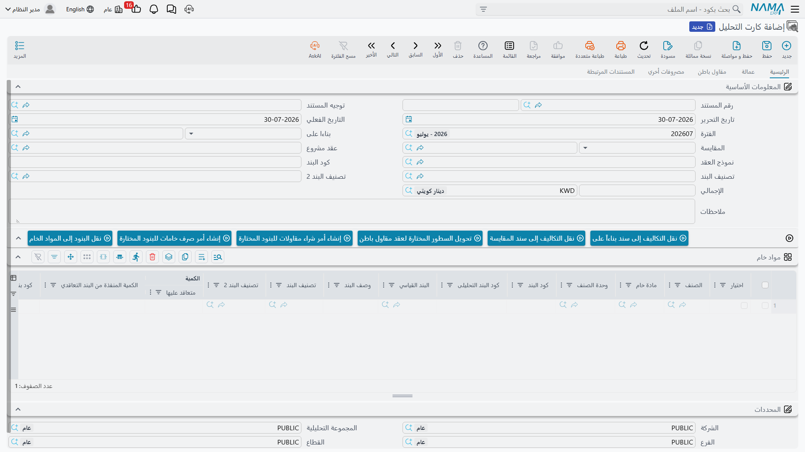
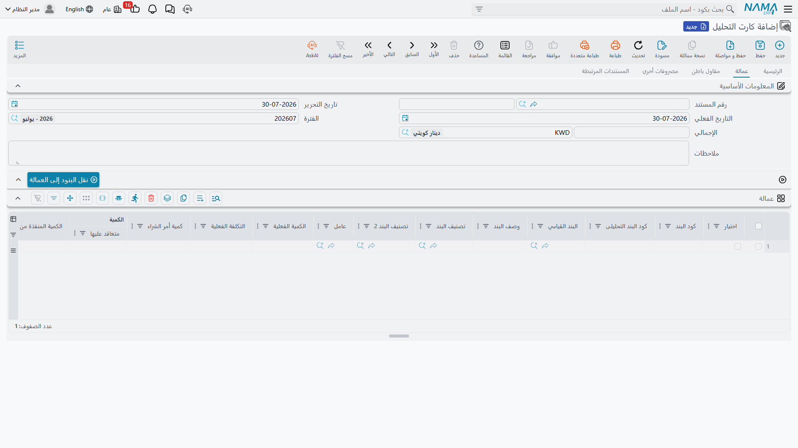

# كارت تحليل البند

سطر البند يقول: *«خرسانة عادية، 300 م³، بسعر 420 للمتر»*. وكارت التحليل يجيب على السؤال الذي يحدد ما إذا
كان العمل يستحق قبوله: **وكم سيكلفنا؟**

يأخذ الكارت بنداً واحداً ويفكّكه إلى عائلات التكلفة الأربع التي تنفّذه — مواد خام، وعمالة الشركة، وأعمال
مسندة إلى مقاولي الباطن، ومصروفات أخرى. اجمعها فتحصل على تكلفة البند؛ واقسمها على الكمية فتحصل على تكلفة
الوحدة؛ وأعلن الهامش فتحصل على سعر البيع. ولهذا يقف هذا المستند في قلب التقديرات لا على هامشها: **كارت
التحليل هو في النهاية ما يقود السعر الذي تعرضه.**

وهو يستحق مكانه مرتين، فالكارت نفسه هو الموضع الذي تُجمَّع فيه التكلفة *الفعلية* المنفَقة في الموقع سطراً
بسطر مقابل التقدير — فيصير الكارت الذي بنيته لتفوز بالعمل هو الكارت الذي تديره به.

- **المسار:** المقاولات > مقاولة مشروع > كارت التحليل
- **الترخيص:** `contracting`
- هو مستند له دفتر وكود وتوجيه، لكن **لا تأثير محاسبي له** — الكارت لا يسجّل شيئاً بنفسه، وإنما يُبلّغ
  التكاليف إلى مستندات أخرى.

## كارت واحد، بند واحد



يقول الرأس أي بند يُحلَّل وفي سياق أي مستند:

| الحقل | ما يفعله |
|---|---|
| رقم المستند، توجيه المستند، تاريخ التحرير، التاريخ الفعلي، الفترة | رأس المستند المعتاد |
| **بناءً على** | قائمة الكميات المصدر — كراسة شروط أو مقايسة أو عقد مشروع أو عرض سعر. تُمِدّ الكارت بقائمة أكواد البنود المسموح تحليلها، وتستطيع أن تملأ له جداول التكلفة |
| **المقايسة** | المستند المسعَّر الذي يتبعه الكارت. يُملأ من حقل *بناءً على* إذا تركته فارغاً |
| عقد مشروع | يُستنتج لك: المقايسة نفسها إن كانت عقداً، وإلا فالعقد الذي أُنشئ منها |
| نموذج العقد | اختياره ينسخ جداول التكلفة الأربعة من النموذج إلى الكارت |
| **كود البند** | البند الذي يحلّله هذا الكارت. كارت واحد، بند واحد |
| تصنيف البند، تصنيف البند 2 | محورا التصنيف، ويُطبَعان على كل سطر تكلفة حتى تصير تقارير التكلفة بالتخصص أو بطبيعة التكلفة ممكنة |
| الإجمالي | مجموع الجداول الأربعة، محسوباً لك |

فالبند ذو التركيب الجدي يستحق كارتاً خاصاً به، والبند البسيط لا يحتاجه — إذ يمكنك إدخال تكلفة الوحدة
مباشرة على قائمة الكميات.

## عائلات التكلفة الأربع

للكارت صفحة لكل عائلة، وكلها بالشكل نفسه:

| الصفحة | ما ينتمي إليها |
|---|---|
| الرئيسية | **مواد خام** — الأسمنت والبلوك والحديد وكل ما تشتريه وتستهلكه |
| عمالة | **عمالة الشركة** نفسها — الطاقم، بالساعات أو بالأيام |
| مقاول باطن | الأعمال التي **تسندها** إلى الغير، مع تسمية مقاول الباطن على السطر |
| مصروفات أخري | كل ما بقي — إيجار معدات، وتصاريح، ومياه معالجة، ومستهلكات |



وأيّ صفحة ينتمي إليها عنصر التكلفة ليس قراراً تتخذه وقت الإدخال، بل يحدده نوع العنصر نفسه في كتالوج
التكلفة. فعنصر من نوع *مادة خام* لا يمكن اختياره إلا في جدول مواد الخام، وعنصر من نوع *عامل* لا يُختار
إلا في العمالة، وهكذا. سجّل عناصر تكلفتك مرة واحدة بالنوع الصحيح، ويرتّب الكارت نفسه بعدها. انظر
[وحدات القياس والمهام والملفات المساعدة](/ar/modules/contracting/setup/contracting-lookups).

والأعمدة متطابقة في الجداول الأربعة: خيار اختيار، وكود البند وكود البند التحليلي، والبند القياسي ووصفه،
والتصنيفان، وعنصر التكلفة، والكمية، والإنتاجية، ونسبة الهالك، وتكلفة الوحدة وإجمالي التكلفة، ووصف حر —
إضافة إلى الكمية الفعلية والتكلفة الفعلية وكمية أمر الشراء، وهي أعمدة للقراءة فقط تُملأ لاحقاً. ويضيف
جدول مواد الخام الصنف المخزني ووحدته، ولون الصنف ومقاسه وإصداره حيث تُستخدم.

والحساب أبسط ما في الوحدة: **إجمالي التكلفة = الكمية × تكلفة الوحدة** على كل سطر، وإجمالي الرأس هو مجموع
الجداول الأربعة.

::: info جدول واحد أم أربعة؟
هناك خيار في الإعدادات يستبدل الصفحات الأربع بجدول واحد، لمن يفضّل الإدخال في موضع واحد. فإن كان مفتوحاً
على قاعدة بياناتك رأيت جدولاً مدمجاً بدلاً من أربع صفحات؛ وعند الحفظ تُوزَّع الصفوف على العائلات الأربع
بحسب نوع كل عنصر تكلفة. والعائلات الأربع تبقى هي السجل المعتمد في الحالتين.
:::

## أكواد البنود التحليلية

كل سطر تكلفة يأخذ كوداً خاصاً به يُولَّد آلياً: **حرف للعائلة**، ثم **كود البند**، ثم **تسلسل من رقمين**.

| العائلة | البادئة | مثال على البند `2.1` |
|---|---|---|
| مواد خام | `M` | `M2.101`، `M2.102`، `M2.103` |
| عمالة | `W` | `W2.101` |
| مقاول باطن | `C` | `C2.101` |
| مصروفات أخري | `O` | `O2.101` |

وأربعة أمور تستحق المعرفة عنها:

- لا تُولَّد إلا بعد أن يعرف الكارت عقده أو مقايسته؛ فالكارت الطليق من أي مستند مسعَّر لا أكواد له.
- التسلسل يستمر **على مستوى كل كروت العقد الواحد**، فالأكواد فريدة على مستوى العقد لا على مستوى الكارت،
  ولا يتصادم كارتان على العقد نفسه أبداً.
- الكود الذي أدخلته بنفسك لا يُستبدَل أبداً.
- «النسخة المماثلة» من الكارت تُفرّغ الأكواد لتحصل النسخة على مجموعة جديدة.
- ويمكن إيقاف الترقيم الآلي من [إعدادات المقاولات](/ar/modules/contracting/contracting-configuration) إن
  كانت مؤسستك تكوّد سطور التكلفة بنظامها الخاص.

**ولماذا يهم هذا أبعد من الكارت؟** لأن كود البند التحليلي هو المفتاح الذي *تُجمَّع عليه التكلفة الفعلية*.
فحين يُحمِّل صرف خامات أو مستخلص مقاول باطن أو مستند سركي أو فاتورة شراء مالاً على المشروع، يذكر السطر
كود بند تحليلي، وبذلك يجد الرقم طريقه إلى صف التقدير الذي يخصّه. اضبط الأكواد فتحصل على مقارنة بين
التقدير والفعلي سطراً بسطر بلا مجهود إضافي؛ واتركها فارغة فتصل التكلفة إلى المشروع — لكن على مستوى البند
فقط لا على مستوى عنصر التكلفة.

## ملء الكارت آلياً

الإدخال اليدوي للكارت هو الاستثناء لا القاعدة، وثلاث آليات تملؤه عنك.

**1. اختيار *بناءً على* يفكّك وصفة التكلفة القياسية.** وهذه الآلية الكبرى. كل بند فرعي على المستند المصدر
يشير إلى بند قياسي، وكل بند قياسي يحمل وصفة تكلفة (انظر
[البنود القياسية](/ar/modules/contracting/setup/contracting-standard-terms)). اختر *بناءً على* فيمشي
النظام على تلك الوصفات ويُنشئ سطر تكلفة لكل صف من صفوفها، في العائلة الصحيحة، بكمية مُقاسة على الكمية
المتعاقد عليها:

```
كمية السطر = كمية البند ÷ الكمية المنفذة من البند التعاقدي في الوصفة
             × (1 + نسبة الهالك ÷ 100)
             × الإنتاجية
```

::: tip القياس عملياً
البند القياسي `EXC-01`، وحدته م³، وصفته مكتوبة لكل 100 م³ وفيها صف واحد: *ساعات حفَّار، الكمية 8*، بلا
هالك، وإنتاجية 1. فسطر عقد بكمية 1,200 م³ يتفكّك إلى 1,200 ÷ 100 × 8 = **96 ساعة حفَّار**. وبتكلفة وحدة
300 تكون تكلفة الصف 28,800.
:::

وإذا كان العقد المصدر قد أُنشئ من عرض سعر، نُسِخت جداول تكلفة العرض أولاً، فلا يُفقَد شيء أنجزه مهندس
التقديرات. ويمكن إيقاف التفكيك من توجيه الكارت للمؤسسات التي تحسب التكلفة يدوياً دائماً — انظر
[توجيه مستندات المقاولات الأخرى](/ar/modules/contracting/document-terms/contracting-terms-other).

**2. أزرار التمهيد الأربعة.** *نقل البنود إلى المواد الخام* و*إلى العمالة* و*إلى المقاول الباطن* و*إلى
المصروفات الأخرى*، وكل منها يمهّد جدوله بـ**صف واحد لكل بند فرعي** من المستند المصدر، ناقلاً كود البند
والتصنيف والبند القياسي والوصف. فتعطيك الهيكل لتحسب تكلفته، بلا وصفة. وهي تعمل حين يكون المصدر كراسة شروط
أو مقايسة أو عقد مشروع.

**3. نموذج عقد.** اختيار نموذج عقد على الكارت ينسخ جداول تكلفته الأربعة جملةً — وهو أسرع طريق حين تبني
المنتج نفسه مراراً.

## من التكلفة المحلَّلة إلى سعر البيع

هذا هو المردود، ويعمل بدفع التكلفة إلى المستند الذي حلّلته.

هناك إجراءان يقومان بذلك: أحدهما يدفع التكاليف إلى مستند **بناءً على**، والآخر إلى مستند **المقايسة**.
وهناك مدخل ثالث على المقايسة نفسها. وأياً استخدمت، فالآلية واحدة:

1. تُجمَّع كل كروت التحليل **المعتمدة** التي تشير إلى المستند الهدف — لا الكارت الذي تقف عليه وحده.
2. تُوضَع كل سطور تكلفتها من العائلات الأربع في وعاء واحد و**تُجمَّع بكود البند**.
3. لكل كود بند يُحدَّث سطر البند في المستند الهدف: **إجمالي التكلفة** يصير التكلفة المجموعة، و**تكلفة
   الوحدة** تصير ذلك الإجمالي مقسوماً على كمية السطر.
4. يُحفَظ المستند الهدف ويُعتمَد لك.

وإذا حمل كارتٌ كود بند لا وجود له في المستند الهدف، أُبلِغت بالكود الذي لم تُعثَر عليه مطابقة، فلا يضيع
شيء في صمت.

ثم يعمل الهامش عمله؛ فلأن كراسة الشروط أو المقايسة تستنتج سعر الوحدة من تكلفة الوحدة ونسبة الربح، يصير
الرقم الذي أنتجه تحليلك هو الرقم الذي يراه عميلك.

::: tip متر مكعب واحد من الخرسانة العادية: تكلفةً ثم سعراً
البند `2.1` على كراسة الفيلا: خرسانة عادية، 300 م³. محلَّلاً للمتر المكعب:

| العائلة | عنصر التكلفة | الكمية | تكلفة الوحدة | التكلفة |
|---|---|---|---|---|
| مواد خام | أسمنت | 0.35 طن | 600 | 210 |
| مواد خام | رمل | 0.50 م³ | 40 | 20 |
| مواد خام | سن (زلط) | 0.80 م³ | 50 | 40 |
| عمالة | طاقم صب | 1.20 ساعة | 25 | 30 |
| مقاول باطن | ضخ وصب | 1.00 م³ | 35 | 35 |
| مصروفات أخري | معالجة ومستهلكات | 1.00 | 15 | 15 |
| | | | **الإجمالي للمتر المكعب** | **350** |

وعلى الكارت الحقيقي تكون الكميات للبند كله، أي هذه الأرقام مضروبة في 300 — 105 أطنان أسمنت، و150 م³ رمل،
و240 م³ سن، و360 ساعة طاقم، و300 م³ ضخ — فيصير إجمالي رأس الكارت **105,000**. ودفع ذلك إلى البند `2.1`
يضبط إجمالي التكلفة على 105,000 وتكلفة الوحدة على 105,000 ÷ 300 = **350**.

ثم الهامش: نسبة ربح 20% على الكراسة تحوّل تكلفة وحدة 350 إلى سعر وحدة **420** — وهو بالضبط السعر الذي
تعرضه كراسة الفيلا. فالتحليل هو من أنتج السعر، ولم يدخله أحد بيده.
:::

## التكلفة الفعلية مقابل التقدير

بعد أن يبدأ العمل تبدأ مستندات التكلفة في تحميل المال على المشروع، وكل سطر منها يذكر كود بند تحليلي.
وتُطابَق تلك التحميلات على سطور الكارت وتُجمَّع في ثلاثة أعمدة للقراءة فقط:

| العمود | ما يحمله |
|---|---|
| الكمية الفعلية | ما استُهلك فعلاً من عنصر التكلفة هذا |
| التكلفة الفعلية | ما كلَّف فعلاً |
| كمية أمر الشراء | ما طُلب شراؤه ولم يُستهلَك بعد |

ويحفظ الكارت كذلك كمية متاحة — الكمية المقدَّرة ناقص الفعلية — وهي ما بقي لك من موازنة عنصر التكلفة ذاك.
وتحمل صفحة **المستندات المرتبطة** قائمة للقراءة فقط بكل مدخل تكلفة فعلية سُجِّل على الكارت، مبيّنةً كود
البند التحليلي وكود البند والعقد والمستند المصدر والكمية والتكلفة التي أسهم بها. إنها أثر التدقيق من صف
تقديري إلى صرف الخامات أو مستخلص مقاول الباطن الذي استهلكه.

وأي المستندات تُسهم في التكلفة وأيها لا يُسهم — وهو ما يفاجئ الناس — مشروح في
[كيف تتكوّن تكلفة المشروع](/ar/modules/contracting/costs/contracting-cost-model). والمستند الذي يحوّل
وعاء التكلفة إلى تكلفة وحدة فعلية لكل بند هو
[حصر تكاليف المقاولات](/ar/modules/contracting/costs/contracting-cost-execution) — وهناك تقارن الرقم 350
الذي قدّرته بما حققه الموقع فعلاً.

## تحويل سطور التحليل إلى مستندات حقيقية

سطر التكلفة المحلَّلة أمر شراء ينتظر أن يحدث، والكارت يعلم ذلك. علّم عمود **الاختيار** على صفوف من أي من
الجداول الأربعة فتصير ثلاثة إجراءات مفيدة:

- **تحويل السطور المختارة إلى عقد مقاول باطن** — الخطوة الطبيعية لصفوف جدول مقاول الباطن.
- **إنشاء أمر شراء مقاولات للسطور المختارة** — لصفوف المواد والمصروفات.
- **إنشاء أمر صرف خامات للسطور المختارة** — للمواد الموجودة في المخزن بالفعل.

وكل منها يفتح لك المستند الجديد لتراجعه قبل الحفظ. وإن لم تعلّم شيئاً طُلب منك اختيار صفوف.

## ما يمنع الحفظ

- **الجداول الأربعة فارغة.** لا بد أن يحلّل الكارت شيئاً.
- **كل سطر يحتاج كود بند**، ولا بد أن يكون من بنود مستند *بناءً على* — إلا إذا كان خيار السماح بإنشاء
  كارت بلا مقايسة أو عقد مفتوحاً في الإعدادات.
- **أكواد البنود التحليلية فريدة داخل الكارت.**
- **اللون أو المقاس أو الإصدار المدخل على سطر مادة خام يجب أن يكون موجوداً فعلاً على الصنف**، والرسالة
  تسمّي السطر.

اضبط هذه، فيصير الكارت الموضع الوحيد الذي يجتمع فيه التقدير والواقع طوال عمر البند.
