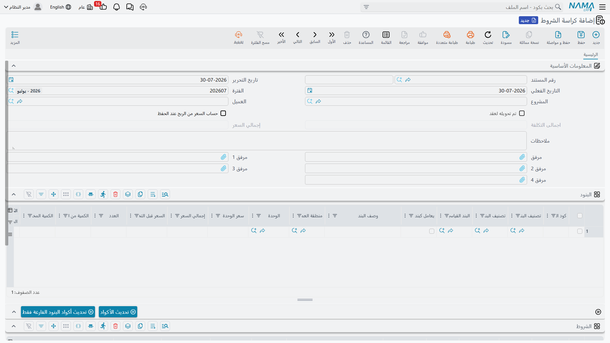

# كراسة الشروط

كراسة الشروط هي **قائمة كميات محفوظة كمستند**. ليست عقداً ولا عرض سعر، بل كراسة عمل يقيس فيها قسم
التقديرات الكميات، ويبني التكلفة، ويضيف هامش ربح، ويصل إلى سعر بيع — قبل أن يوقّع أحد شيئاً بأسابيع.
ابنِ واحدة لـ«فيلا نموذج أ» وستستخدمها في العشرين فيلا التالية.

وهي الخطوة الطبيعية بعد [البنود القياسية](/ar/modules/contracting/setup/contracting-standard-terms):
الكتالوج يعطيك المفردات، والكراسة أول موضع تكتب فيه جملة بها.

- **المسار:** المقاولات > مقاولة مشروع > كراسة الشروط
- **الترخيص:** `contracting`
- هي مستند — لها دفتر وكود وتاريخ تحرير وتاريخ فعلي وفترة — لكن **ليس لها توجيه ولا أي تأثير محاسبي على
  الإطلاق**. اعتماد كراسة الشروط لا يحرّك مالاً ولا يمسّ مخزوناً.

## تشريح الكراسة



كل شيء على صفحة واحدة.

**الرأس** يحمل الدفتر والكود، وتاريخ التحرير، والتاريخ الفعلي، والفترة؛ و**المشروع** و**العميل** اللذين
سُعِّرت لهما الكراسة؛ وخيار *حساب السعر من الربح عند الحفظ*؛ والإجماليين المحسوبين: إجمالي التكلفة
وإجمالي السعر. وفيه كذلك مؤشر يوضح ما إذا كانت الكراسة قد حُوِّلت إلى عقد، يحفظه النظام، إضافة إلى
الملاحظات وحتى أربعة مرفقات للرسومات التي أُخذت منها الكميات.

**جدول البنود** هو الكراسة نفسها، وأعمدته تنقسم إلى خمس عائلات:

| العائلة | الأعمدة |
|---|---|
| التعريف | كود البند، تصنيف البند، تصنيف البند 2، البند القياسي، يعامل كبند فرعي، وصف البند، منطقة العمل |
| القياس | الوحدة، العدد، الطول، العرض، الارتفاع، الكمية من الأبعاد، الكمية المخصومة، الكمية |
| التكلفة | تكلفة الوحدة، التكاليف قبل الإضافية، تكاليف إضافية، إجمالي التكلفة |
| السعر والهامش | سعر الوحدة، السعر قبل الخصم، الخصم، نسبة هامش الربح، الربح، إجمالي السعر |
| متفرقات | المرفق، وإشارة إلى المستند الذي نُسِخ منه الصف |

أعمدة الطول والعرض والارتفاع لا تظهر إلا إذا كانت الوحدة مُعدَّة لإظهار أعمدة المحددات على العقود
والمستخلصات وحصور الكميات.

**جدول الشروط** يُدرِج الشروط المرتبطة بالكراسة — احتجاز، أو جدول استرداد دفعة مقدمة، أو غرامة — وكل
منها مرتبط اختياراً بكود بند واحد ومرحلة واحدة، مع قيمته ونوع قيمته ونسبة الإتمام. وهي لا تفعل شيئاً على
الكراسة نفسها؛ إنما تُنقَل إلى الأمام عندما تلتقطها مقايسة ثم عقد، وهناك تبدأ في تحريك المال. انظر
[الشروط التعاقدية](/ar/modules/contracting/setup/contracting-conditions).

**وفوق جدول البنود زران**: أحدهما يعيد توليد كل أكواد البنود في الكراسة، والآخر يملأ الأكواد الفارغة
فقط، وهو ما تريده بعد إدراج صفوف في كراسة مرقَّمة سابقاً.

## قياس الكمية من الأبعاد

أكثر عمل الحصر ليس إدخال رقم، بل ضرب مجموعة أبعاد ثم خصم الفتحات. والكراسة تفعل ذلك عنك.

املأ **العدد** و**الطول** و**العرض** و**الارتفاع** على السطر، وبمجرد أن تتركها يقوم النظام بما يلي:

1. يستنتج العدد من الكمية والأبعاد التي أدخلتها بالفعل، إلا إذا كانت الوحدة مُعدَّة على غير ذلك؛
2. يضرب العدد في الطول في العرض في الارتفاع — معتبراً كل عامل تركته فارغاً واحداً — ويضع الناتج في
   **الكمية من الأبعاد**؛
3. يخصم منه **الكمية المخصومة** ويضع الناتج في **الكمية**؛
4. يعيد حساب تكلفة السطر وسعره من الكمية الجديدة.

وأي الأبعاد تشارك في الحساب خاصيةٌ لـ**الوحدة** لا للسطر؛ فوحدة قياس المقاولات تحمل ثلاثة خيارات
*تجاهل*، فوحدة م² تتجاهل الارتفاع، وم³ لا تتجاهل شيئاً، ووحدة «عدد» تتجاهل الثلاثة فتصير الكمية هي العدد
وحده. انظر [وحدات القياس والمهام والملفات المساعدة](/ar/modules/contracting/setup/contracting-lookups).

::: tip حائط، مقيساً
بند حائط يُقاس بالمتر المربع، على وحدة مُعلَّم فيها *تجاهل الارتفاع*. الطول 6، العرض 3، العدد 4:

- الكمية من الأبعاد = 4 × 6 × 3 = **72**
- الكمية المخصومة = 2 (فتحة باب) → الكمية = **70**
- تكلفة الوحدة 55 → التكاليف قبل الإضافية = 3,850؛ تكاليف إضافية 150 → إجمالي التكلفة = **4,000**
- نسبة هامش ربح 20% مع *حساب السعر من الربح عند الحفظ* → سعر الوحدة ≈ **68.57**، وإجمالي السعر =
  **4,800**

وعمود الكمية المخصومة هو موضع الفتحات والخصومات والكميات «المقيسة غير المحاسَب عليها». يُخصَم دائماً
ولا يُضاف أبداً.
:::

## من التكلفة إلى السعر

حساب سطر البند صغير ويستحق أن يُحفَظ، لأن المعادلات الأربع نفسها تظهر على المقايسة والعقد والمستخلص:

```
التكاليف قبل الإضافية  = الكمية × تكلفة الوحدة
إجمالي التكلفة        = التكاليف قبل الإضافية + التكاليف الإضافية
السعر قبل الخصم        = الكمية × سعر الوحدة
إجمالي السعر          = السعر قبل الخصم − قيمة الخصم
```

والعلاقات تعمل في الاتجاهين، وهذا ما يجعل الجدول مريحاً في الاستخدام: أدخل إجمالي التكلفة فتُستنتج
تكلفة الوحدة من الكمية؛ وأدخل سعر الوحدة على سطر بلا كمية فتُستنتج الكمية من السعر؛ وأدخل نسبة خصم
فتُحسَب قيمة الخصم من السعر قبل الخصم.

**الهامش.** أدخل **نسبة هامش الربح** على السطر وعلّم *حساب السعر من الربح عند الحفظ* في الرأس، فتستنتج
الكراسة سعر الوحدة من تكلفة الوحدة عند الحفظ، لا العكس. وهذه طريقة عمل مهندس التقديرات الطبيعية: اضبط
التكلفة، وأعلن الهامش، ودع السعر ينتج عنهما. وهي أيضاً الآلية التي تجعل
[كارت تحليل البند](/ar/modules/contracting/setup/contracting-term-analysis-cards) بهذه الأهمية — فالكارت
يدفع تكلفة محلَّلة إلى البند، والهامش يحوّلها إلى السعر الذي تعرضه.

وعند الاعتماد ترتّب الكراسة نفسها بترتيب ثابت: تُعاد أكواد البنود وبناء الهرم الرئيسي/الفرعي، وتُستنتج
الكميات من الأبعاد من جديد، ويُعاد حساب السعر من الهامش إذا طلبت ذلك، وتُطبَّق نسب الضريبة على كل سطر،
وأخيراً تُجمَع إجماليات الرأس — **من السطور الفرعية فقط**، فلا تُحتسَب العناوين مرتين.

**كراسة فيلا من اثني عشر سطراً.** سطران منها قيسا من الأبعاد لا بالإدخال المباشر: المباني (العدد 20،
الطول 6.0، العرض 4.0 → 480، ناقص 10 للفتحات = 470) والبياض الداخلي (العدد 44، الطول 5.0، العرض 4.0 →
880، ناقص 20 = 860).

| الكود | الوصف | الوحدة | الكمية | سعر الوحدة | إجمالي السعر |
|---|---|---|---|---|---|
| `1` | أعمال الحفر | | | | **20,100** |
| `1.1` | تطهير الموقع | م² | 400 | 12 | 4,800 |
| `1.2` | حفر | م³ | 180 | 85 | 15,300 |
| `2` | الأعمال الإنشائية | | | | **161,030** |
| `2.1` | خرسانة عادية | م³ | 36 | 420 | 15,120 |
| `2.2` | خرسانة مسلحة | م³ | 95 | 1,150 | 109,250 |
| `2.3` | مباني بلوك 20 سم | م² | 470 | 78 | 36,660 |
| `3` | التشطيبات | | | | **91,000** |
| `3.1` | بياض داخلي | م² | 860 | 28 | 24,080 |
| `3.2` | تبليط سيراميك أرضيات | م² | 240 | 95 | 22,800 |
| `3.3` | دهانات | م² | 860 | 22 | 18,920 |
| `3.4` | شبابيك ألومنيوم | عدد | 18 | 1,400 | 25,200 |

إجمالي الكراسة: **272,130**. والسطور العنوانية الثلاثة لا تحمل كمية ولا سعراً من عندها، وإنما إجمالياتها
هي مجموع البنود الفرعية تحتها.

## كراسة الشروط لا تستخدم قوائم الأسعار

قل هذا لمهندسي التقديرات قبل أن يبحثوا عن سبب عدم ظهور أسعارهم المنشورة: **بحث قوائم الأسعار لا يعمل على
كراسة الشروط**. تعمل قوائم الأسعار على العقود وتعديلاتها، وعلى عقود مقاولي الباطن وعروضهم، وعلى المقايسات
وعروض الأسعار للعملاء، وعلى الموازنتين — لكن ليس هنا.

على كراسة الشروط يأتي سعر الوحدة على السطر الجديد من سعر الوحدة الافتراضي في البند القياسي، ثم من كل ما
تدخله أو تستنتجه معادلة الهامش. فإن كنت تريد أن تقود الأسعار المنشورة تسعيرك، فابنِ المستند المسعَّر
كـ[مقايسة مقاولات](/ar/modules/contracting/project-contracting/contracting-assays) أو
[عرض سعر](/ar/modules/contracting/project-contracting/contracting-offers) لا كراسة، أو اقبل أن الكراسة
هي موضع التسعير اليدوي. وانظر
[قوائم أسعار المقاولات](/ar/modules/contracting/setup/contracting-price-lists) للقائمة الكاملة بالشاشات
التي يعمل عليها البحث.

## إلى أين تمضي الكراسة بعد ذلك

كراسة الشروط لا تدفع نفسها إلى أي مكان، بل المستند المستقبِل هو من يسحبها، وهناك ساحب واحد بعينه:
**المقايسة**.

على [مقايسة المقاولات](/ar/modules/contracting/project-contracting/contracting-assays) يوجد حقل *كراسة
الشروط*. اختر كراستك فتنسخ المقايسة مشروع الكراسة وعميلها، ثم تستنسخ **كل** سطور البنود و**كل** سطور
الشروط إلى داخلها. والبحث على ذلك الحقل مفلتَر بعميل المقايسة ومشروعها، فلا يضطر مهندس التقديرات إلى
التنقيب في كراسات سُعِّرت لغيره.

ومن المقايسة تسافر البنود إلى عقد مشروع أو عقد مقاول باطن بالتحويل. ويستحق هذا صراحة:

::: warning لا يوجد زر «نسخ البنود من كراسة» على العقد
تصل البنود إلى العقد بواحدة من ثلاث طرق، وليس منها زر على جدول بنود العقد:

1. من خلال **مقايسة** مُلئت من الكراسة ثم حُوِّلت؛
2. باختيار **نموذج عقد** على العقد — فاختيار النموذج هو ما يُشعل النسخ. انظر
   [نماذج العقود](/ar/modules/contracting/setup/contracting-contract-templates)؛
3. من إجراءات القائمة على النموذج نفسه، التي تُنشئ عقداً أو مقايسة من الصفوف التي تعلّمها.

وهناك إجراء على المقايسة اسمه *تجميع التحليلات* يفعل شيئاً آخر تماماً: فهو يسحب **تكاليف كروت التحليل**
إلى بنود المقايسة القائمة. ولن يجلب لك قائمة كميات.
:::

## ما يمنع الحفظ

أربع مراجعات، وكلها يسيرة:

- **لا كود بند مكرر.** سطران بالكود نفسه مرفوضان، لأن كل مستند تالٍ يعرّف السطر بكوده.
- **كل سطر فرعي يحتاج كمية.** والعناوين لا تحتاج.
- **لا يحمل كود البند الشرط نفسه مرتين.**
- **كود البند في كل شرط يجب أن يكون موجوداً بين أكواد بنود الكراسة.** فإذا حذفت بنداً وجب أن تذهب شروطه
  معه.

ومتى نظفت الكراسة، سلّمها إلى مقايسة ودع قائمة الكميات المسعَّرة تبدأ طريقها نحو عقد موقَّع.
