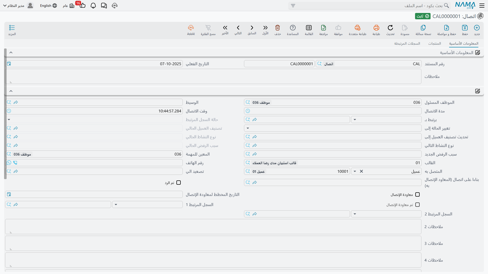

# الاتصالات (CRM Call)

::: info الترخيص المطلوب
`crm`. وشاشة الاتصال في **خدمة العملاء > الدعم > اتصال**.
:::

معظم شاشات وحدة خدمة العملاء تسجّل الأحداث فحسب. أما شاشة **الاتصال** فهي واحدة من شاشتين اثنتين في
الوحدة كلها *تُغيّر* شيئاً: فحين يُرحَّل اتصال مرتبط بخيط بيع أو فرصة، يمتد أثره إلى ذلك الخيط فيعيد
كتابة حالته وتصنيفه ونشاطه التالي وسبب رفضه. والشاشة الأخرى التي تفعل ذلك هي
[الزيارة](/ar/modules/crm/activities/crm-visits). وما عدا هاتين، كل ما في مجموعة الأنشطة سجلّات.

ولهذا يستحق الاتصال قراءة متأنية. فهالة (`EMP-1042`) لا تنقل خيط البيع `LD-00417` — فنادق مارينا
بلازا — من *مبدئي* إلى *تم الأتصال* إلى *مؤهل* بتحرير الخيط نفسه، بل بتسجيل المكالمات التي أجرتها،
والخيط يتبعها.

والاتصال **لا يحتاج توجيهاً**؛ يكفيه دفتر وكود. وليس له أثر محاسبي ولا مخزني، ولا يرسل شيئاً على
الإطلاق: لا بريداً ولا رسالة نصية ولا تذكيراً.

## على ماذا يُسجَّل الاتصال؟

هناك حقل واحد اسمه **يرتبط بـ** (Related To)، ويوضع فيه موضوع واحد لا أكثر. ويقبل خيط بيع أو فرصة أو
مشروع أو حملة أو بلاغ عطل أو شكوى أو عميلاً أو مهمة خدمة عملاء أو طلب تطوير.

والأولان فقط — خيط البيع والفرصة — هما اللذان يشغّلان الكتابة العكسية الموصوفة أدناه. أما اتصال
مسجَّل على بلاغ عطل أو على عميل فهو سجل محادثة لا أكثر.

وبجواره حقل **المتصل به** (Connected Person)، وهو الشخص الذي تحدثت إليه فعلاً: جهة اتصال أو عميل أو
الخيط نفسه. ففي `CALL-0342` الموضوع هو الخيط `LD-00417` والمتصل به هو `CNT-0905`، أ. منى شعبان من
المشتريات. وهناك حقلان آخران، **السجل المرتبط 1** و**السجل المرتبط 2**، يقبلان مرجعاً لأي نوع سجل
كان؛ ولا يقرأهما شيء في المنتج، فعاملهما على أنهما تخزين حر، وضيّق نطاقهما بمُعدِّل الحقول المرجعية
العامة إن كنت تستخدمهما.

ويُختم **الموظف المسئول** و**المسند إليه** بموظف المستخدم الحالي في كل اتصال جديد، دائماً. وخيار
إعدادات خدمة العملاء *ملء الموظف المسئول بالموظف الحالي* لا يوقف ذلك — فهو مطبَّق على شاشة خيط البيع
وحدها. انظر [إعدادات خدمة العملاء](/ar/modules/crm/crm-configuration).

## آلة الحالات

اختر خيط بيع أو فرصة في **يرتبط بـ**، فتمتلئ من تلقاء نفسها أربعة حقول للقراءة فقط: **حالة السجل
المرتبط** و**تصنيف العميل المرتقب الحالي** و**نوع النشاط الحالي** و**سبب الرفض الحالي**. وهي لقطة
لموضع الخيط لحظة بدء المكالمة، ولا تُملأ إلا ما دامت فارغة — فتظل تعرض صورة "ما قبل" حتى بعد أن يغيّر
الاتصال الخيط.

وتحت كل لقطة يقع ذراعها: حقل تكتب فيه أنت، ويُكتب في الخيط عند ترحيل الاتصال:

| الذراع في الاتصال | ما الذي يستبدله في خيط البيع أو الفرصة |
|---|---|
| **تغيير الحالة إلي** (Change Status To) | الحالة |
| **تحديث تصنيف العميل المرتقب إلي** (Update Lead Classification To) | تصنيف العميل المرتقب |
| **نوع النشاط التالي** (Next Activity Type) | نوع النشاط |
| **سبب الرفض الجديد** (New Rejection Reason) | سبب الرفض |
| **التاريخ المخطط لمعاودة الإتصال** (Planned Re Call Date) | تاريخ معاودة الاتصال المخطط — **في الاتصال وحده** |

ولا يُطبَّق أي منها إلا إذا ملأته، وإلا إذا كانت قيمته مختلفة فعلاً عما في الخيط. اترك الذراع فارغاً
يبقَ ذلك الجزء من الخيط كما هو. وإعادة ترحيل اتصال بعد تعديله تعيد تطبيق الأذرع.

ولهذا فإن مسار البيع المُدار جيداً في نما يُقاد من شاشات الأنشطة لا من شاشة الخيط. فحالة الخيط ليست
شيئاً يصونه مندوب المبيعات بيده، بل هي أثر آخر اتصال أو زيارة مسّاه.

::: warning إلغاء الاتصال لا يتراجع عما فعله
الكتابة العكسية باتجاه واحد. فإذا رُحِّل اتصال بـ*تغيير الحالة إلي = بارد* ثم أُلغي لأنه سُجِّل على
الخيط الخطأ، **يظل الخيط بارداً**. لا شيء يحتفظ بالحالة السابقة، ولا شيء يعيدها. افتح الخيط وصحّحه
بيدك.
:::

### المثال العملي

`CALL-0342` — ١٤ يناير ٢٠٢٦، الساعة ٠٩:٠٠، مدته عشرون دقيقة، هالة (`EMP-1042`)، والمتصل به
`CNT-0905`:

| الحقل في الاتصال | القيمة | الأثر على `LD-00417` |
|---|---|---|
| تغيير الحالة إلي | تم الأتصال | تصبح الحالة "تم الأتصال" |
| تحديث تصنيف العميل المرتقب إلي | `LC-B` عميل متوسط | يصبح التصنيف "عميل متوسط" |
| نوع النشاط التالي | `AT-02` زيارة موقع | يصبح نوع النشاط "زيارة موقع" |
| التاريخ المخطط لمعاودة الإتصال | ٢٢ يناير ٢٠٢٦ | يُضبط تاريخ معاودة الاتصال |
| سجل معاودة الاتصال | ✔ | *(انظر القسم التالي)* |

ولم يتغير شيء آخر. فقد بقيت **مرحلة البيع** عند *تأهيل* و**الإحتمالية** عند ٤٠ — وهما بيانان وصفيان
لا يمسّهما زر ولا حساب؛ يحرّكهما المندوب بيده على الخيط حين يرى أن الوقت حان.

## معاودة الاتصال

وضع علامة على **سجل معاودة الاتصال** وضبط **التاريخ المخطط لمعاودة الإتصال** يضع المكالمة في قائمة
انتظار. وفي اتصال لاحق يعرض الحقل **اتصال** — الذي يحمل التسمية *بناءا على اتصال (المعاود الإتصال
به)* — المكالمات المنتظِرة تحديداً: تلك المعلَّمة كسجل معاودة اتصال والتي لم تُعاوَد بعد، مع إمكان
حصرها على الموضوع نفسه.

اختر واحدة يحدث أمران: تُختم المكالمة الأقدم بعلامة **تم معاودة الاتصال** فتخرج من قائمة الانتظار،
وينسخ الاتصال الجديد من الأقدم مدة المكالمة ووقتها ورقم الهاتف والموضوع والوسيط والمسند إليه والمتصل
به، فلا تعيد كتابتها.

وهذا هو `CALL-0357` في ٢٢ يناير: يشير إلى `CALL-0342` الذي صار معلَّماً بأنه تمت معاودته، ويكمل
بالخيط بقية الطريق — *تغيير الحالة إلي = مؤهل*، و*تحديث تصنيف العميل المرتقب إلي = `LC-A` عميل كبير*.

::: warning قائمة الانتظار تنتظرك أنت
لا شيء في الوحدة يذكّر أحداً بأن معاودة اتصال قد حان موعدها. فليس في خدمة العملاء جدولة ولا منبّه ولا
إشعار ولا صندوق وارد. وتاريخ معاودة الاتصال المخطط يُنسخ على الخيط ويُخزَّن، وهذا كل شيء؛ ولا يُظهر
معاودةً متأخرة إلا أن يفتح أحدهم قائمة الاختيار أو يفلتر شاشة الاتصالات. فتعامل مع سلسلة المعاودة
بوصفها آلية **سحب**، واجعل متابعتها اليومية مسؤولية شخص بعينه.
:::

وإلغاء اتصال المعاودة يعيد المكالمة الأقدم إلى قائمة الانتظار، وتغيير الحقل ليشير إلى مكالمة أخرى
يُلغي العلامة عن الهدف السابق — فتبقى السلسلة صادقة حتى مع التعديل.

## تبويب المنتجات

يسجّل تبويب المنتجات ما دار الحديث حوله: **المنتج**، وعلامة **المنتج المختار**، و**الآلة**، و**الشركة
المنافسة**، و**صنف الشركة المنافسة**، ووصفاً لكل سطر.

وثمة مساعدتان تختصران الوقت: اختيار الآلة يملأ منتج السطر من صنف تلك الآلة. واختيار صنف منافس يحصر
قائمة البحث عن المنتج في الأصناف التي ربطها موقعك بصنف ذلك المنافس — فإذا قال العميل "ونحن ننظر أيضاً
في تشيلر أفق ٣٠٠ طن" (`CITM-011`)، أظهر البحث وحدات التبريد التي تنافس بها وحدها.

ولا يتحرك مخزون ولا يُحسب سعر. فهذه السطور سجل للمحادثة، وعلامة **المنتج المختار** لها أثر في موضع
واحد فقط: اختصار العقارات الموصوف أدناه.

## جدول الاجابات

الجدول أسفل التبويب الأول يحمل سطوراً من سؤال وإجابة: السؤال، وإجابة نصية، وإجابة رقمية، وإجابة
بتاريخ، ووصفاً.

::: warning اكتب الأسئلة بنفسك
في الاتصال حقل **القالب** (Template) يعرض قوالب الاستبيانات. واختيار قالب منه **لا يفعل شيئاً**: لا
تظهر سطور أسئلة ولا يُنسخ شيء. فجدول الاجابات جدول يدوي، سطراً سطراً. وإن أردت استبياناً حقيقياً وراءه
قالب، فاستخدم [شاشات الاستبيانات](/ar/modules/crm/questionnaires/crm-questionnaire-templates).

كذلك يُقرأ عنوان العمود بالإنجليزية **Criteria** بينما المقصود *السؤال* — والتسمية العربية (السؤال) هي
الصحيحة. فلا تبحث عن خاصية معايير هنا؛ لا وجود لها.
:::

## الأزرار

| الزر | ماذا يفعل |
|---|---|
| **تصعيد الي** | يطلب موظفاً، ويكتبه في حقل التصعيد، ثم يحفظ الاتصال ويرحّله ويحدّث الشاشة. **ولا يُخطَر أحد** — فالتصعيد هنا حقل لا رسالة. |
| **إنشاء مهمة خدمة العملاء** | يفتح [مهمة خدمة عملاء](/ar/modules/crm/activities/crm-tasks-and-follow-ups) جديدة في نافذة منبثقة وموضوعها هذا الاتصال. والمهمة لا تُحفظ نيابة عنك. |
| **حجز مؤقت مباشر** | اختصار إلى وحدة العقارات. يحتاج خيط بيع أو فرصة في "يرتبط بـ" وسطر منتجات واحداً معلَّماً بـ**المنتج المختار**. فإن كان الخيط قد حُوِّل إلى عميل استخدم ذلك العميل، وإلا أنشأ ورحّل مالك عقار جديداً من بيانات الخيط، ثم فتح سند حجز جديداً مملوءاً بالمشتري والوسيط والعقار المباع والمندوب. وهذا الموضع الوحيد في مجموعة الأنشطة الذي ينشئ سجلاً في وحدة أخرى، ويحتاج ترخيص وحدة العقارات. |

والإجراءات العامة المعتادة — التصدير وسجل التدقيق والملاحظات والاعتمادات والمفضلة و**إضافة إلى
الاجندة** — متاحة على هذه الشاشة كأي مستند. و"إضافة إلى الاجندة" هي أقرب شيء إلى التقويم في خدمة
العملاء كلها، وهي إجراء عام في المنصة كلها، وعلى المستخدم أن يضغطه بنفسه.

## ما ليس على شاشة الاتصال

غيابان يفاجئان الناس، فيستحقان التسمية:

- **لا يوجد مؤشر وارد/صادر.** فالبيانات وراء الشاشة تعرف مفهوم اتجاه المكالمة وهو مترجم بالكامل، لكنه
  ليس موضوعاً على الشاشة، فلا سبيل مدعوماً لتسجيل ما إذا كانت المكالمة واردة أم صادرة. استخدم الوصف
  إن احتجت إلى ذلك.
- **لا يوجد حقل "بناءا على".** فحين تُنتَج المكالمة من [خطة عمل](/ar/modules/crm/activities/crm-work-plans)
  يُسجَّل الرابط، لكن لا يظهر منه إلا طرف الخطة: يعرض سطر الخطة **المستند المنشأ**، بينما لا يعطي
  الاتصال أي إشارة على الشاشة إلى مصدره. أما شاشة الزيارة — على غرابة الأمر — فتعرضه.

## ما لن يمنعك النظام منه

لا شيء. فليس في هذه المجموعة أي تحقق أعمال على الإطلاق. والحقول الإلزامية في الاتصال هي الدفتر والكود
والمحددات فقط؛ واتصال بلا موضوع ولا رقم هاتف ولا موظف يُرحَّل بلا اعتراض. والمواقع التي تحتاج قاعدة
هنا — موضوعاً إلزامياً أو نتيجة إلزامية — تضيفها بمسار كيان أو بتعريف اعتماد.

**التقارير: لا يوجد.** لا تحتوي الوحدة على أي تقرير نظام، وهذه الشاشة ليس لها نموذج طباعة. ولمراجعة
نشاط الاتصالات استخدم شاشة قائمة الاتصالات بفلاترها وتصديرها إلى إكسل، أو ابنِ لوحة في وحدة ذكاء
الأعمال.
