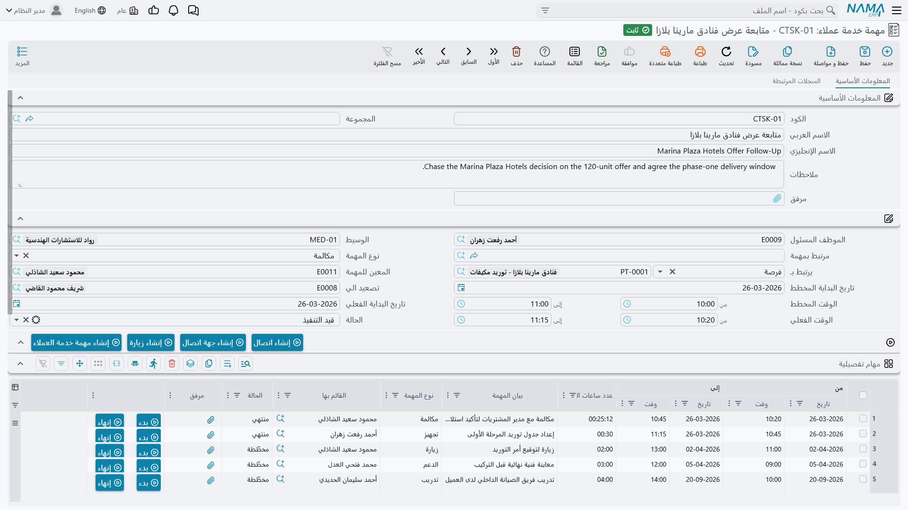

# المهام وسندات المتابعة

::: info الترخيص المطلوب
`crm`. ومهمة خدمة العملاء في **خدمة العملاء > الدعم > مهمة خدمة عملاء**. أما سند المتابعة فهو في
**خدمة العملاء > استبيانات > سند متابعة** — نعم، في مجموعة الاستبيانات لا مع بقية مستندات الدعم.
:::

اجتمعت شاشتان صغيرتان في صفحة واحدة لأن شكلهما واحد: كلتاهما مكان لتدوين شيء، ولا واحدة منهما تُحدث
أثراً في مكان آخر. فمهمة خدمة العملاء بطاقة "ما ينبغي عمله" مفيدة فعلاً وعليها ورقة وقت. أما سند
المتابعة فسجل مجرّد؛ ووصفه الصادق قصير، وهذه الصفحة تقوله صراحة بدل أن تزيّنه.

## مهمة خدمة العملاء

مهمة خدمة العملاء **ملف رئيسي** لا مستند. ولهذا نتائج عملية تستحق أن تُقال مرة واحدة: لا دفتر لها،
ولا توجيه مستند، ولا تاريخ قيمة، ولا رقم مستند، ولا دورة اعتماد مستندات. لها كود واسم عربي واسم
إنجليزي ومجموعة، كأي ملف رئيسي آخر، وهي تُحفظ لا تُرحَّل.

### ماذا تحمل

الكتلة الأولى هي هوية الملف الرئيسي: **الكود** و**المجموعة** والاسم العربي والاسم الإنجليزي والوصف
ومرفق.

ثم كتلة العمل:

| الحقل | ملاحظات |
|---|---|
| **الموظف المسئول**، **المسند إليه**، **الوسيط**، **تصعيد الي** | يُختم الموظف المسئول والمسند إليه بموظف المستخدم الحالي في كل مهمة جديدة، دائماً |
| **يرتبط بـ** | الموضوع: خيط بيع أو فرصة أو مشروع أو حملة أو بلاغ عطل أو شكوى أو عميل أو طلب تطوير أو مهمة أخرى أو زيارة |
| **المهمة المرتبطة** | وجّهها إلى مهمة أعلى فتُنسخ منها بيانات المهمة والموضوع والمسند إليه |
| **نوع المهمة** | زيارة أو مكالمة أو دعم أو تدريب أو تجهيز — تسمية فحسب |
| **تاريخ البدء المخطط**، **الوقت المخطط** (من/إلى) | ما تنويه |
| **تاريخ البدء الفعلي**، **الوقت الفعلي** (من/إلى) | ما حدث — يُكتب باليد، انظر التحذير أدناه |
| **الحالة** | مخطّطة أو قيد التنفيذ أو منتهي — تسمية فحسب |

وتحتها كتلة اتصال كاملة اسمها **موقع المهمة**: عنوان بموقع على الخريطة، وهواتف، ومحمول، وفاكس، وبريد
إلكتروني، وموقع إلكتروني. وهي هناك للمهام التي تتعلق بالذهاب إلى مكان أو الاتصال بشخص ليس له سجل جهة
اتصال بعد.

ويعرض تبويب **السجلات المرتبطة** جهات الاتصال والمهام والاتصالات والزيارات التي تشير إلى هذه المهمة.

### ورقة الوقت

جدول **مهام تفصيلية** هو الجزء الذي يستخدمه الناس فعلاً: سطر لكل فترة عمل، بتاريخ ووقت من، وتاريخ ووقت
إلى، و**عدد ساعات العمل** محسوباً، ووصف، ونوع مهمة، والقائم بها، وحالة، ومرفق. وفي كل سطر زرّا **بدء**
و**إنهاء** يختمان اللحظة الحالية في عمودي "من" و"إلى".

و`TSK-0219` في المثال العملي هي *إعداد العرض الفني*، مسندة إلى هالة (`EMP-1042`)، مرتبطة بالخيط
`LD-00417`، ومخططة من ٢٠ إلى ٢٦ يناير ٢٠٢٦:

| من | إلى | الصافي |
|---|---|---|
| 2026-01-20 09:00 | 2026-01-20 12:00 | 3:00 |
| 2026-01-21 10:00 | 2026-01-21 13:30 | 3:30 |
| 2026-01-23 09:30 | 2026-01-23 11:00 | 1:30 |
| | **الإجمالي** | **8:00** |

::: warning ورقة الوقت لا تُجمَّع في الرأس، والحالة لا تتقدم
**تاريخ البدء الفعلي** و**الوقت الفعلي** في الرأس **لا** يُشتقّان من الجدول. املأ كل سطور ورقة الوقت
ويبقى الرأس كما كتبته تماماً — أو فارغاً. وكذلك ضبط كل السطور على *منتهي* يترك **حالة** المهمة نفسها
حيث وضعها المستخدم آخر مرة؛ لا شيء يقدّمها.

فإن كان موقعك يقيس مجهود المهام، فاقرأ سطور الجدول لا الرأس.
:::

ولرقم عدد ساعات العمل الظاهرة الصغيرة نفسها التي في خطة العمل: القيمة المعروضة أثناء الكتابة تُحسب في
المتصفح، والقيمة المخزَّنة عند الحفظ تُحسب في الخادم، وبينهما اختلاف طفيف في القاعدة. فسطور اليوم
الواحد تتفق في حدود ثوانٍ، والسطر الذي يعبر منتصف الليل يبدو خاطئاً حتى تحفظه فيصحّح نفسه.

### الأزرار

**إنشاء اتصال** و**إنشاء زيارة** و**إنشاء جهة اتصال** و**إنشاء مهمة خدمة العملاء** تفتح كل منها السجل
الجديد المناسب في نافذة منبثقة وموضوعه هذه المهمة. ولا يُحفظ شيء نيابة عنك — تراجع النافذة وتحفظها
بنفسك.

و**تصعيد الي** يطلب موظفاً، ويكتبه في حقل التصعيد، ويحفظ السجل ويرحّله ويحدّث الشاشة. **ولا يُخطَر
أحد.** فالتصعيد هنا يعني أن حقلاً صار يحمل اسماً.

::: info ظاهرة صغيرة حين تُنشأ المهمة من شاشة أخرى
حين تُفتح مهمة من خيط بيع أو فرصة أو مهمة أخرى بزر إنشاء مهمة، يصل حقل **تصعيد الي** في النافذة
المنبثقة إما فارغاً وإما حاملاً شيئاً ليس موظفاً أصلاً. أفرغه واختر الموظف الذي تقصده.
:::

### ما ليست هي مهمة خدمة العملاء

::: warning لا جدولة ولا تذكير ولا إشعار
مهمة خدمة العملاء **لا صلة لها البتة** بجدولة المهام في المنصة، ولا بمحرك الإشعارات، ولا بأي صندوق
اعتمادات. لا شيء يراقب تاريخ البدء المخطط. ولا شيء يغيّر الحالة حين يمر تاريخ. ولا شيء يرسل بريداً إلى
المسند إليه عند إنشاء المهمة ولا حين تتأخر.

وهذا يصدق على وحدة خدمة العملاء كلها لا على هذه الشاشة وحدها — فليس فيها جدولة على الإطلاق. وكل ما
يبدو مجدولاً إنما يحدث لأن أحداً ضغط زراً.

والخاصية الوحيدة القريبة من التقويم هي إجراء **إضافة إلى الاجندة** العام، وهو إجراء في المنصة على كل
مستند وعلى المستخدم أن يضغطه بنفسه.
:::

والمهام **تُعدّ** في موضع واحد: [خطط الأهداف](/ar/modules/crm/marketing/crm-target-plans) تعدّ
الاتصالات والزيارات وخيوط البيع والمهام لكل موظف في كل شهر حين يطلب أحدهم ذلك. وهذا مستند آخر، وعند
الطلب، ويحسب على **المسند إليه** في المهمة.

## سند المتابعة

سند المتابعة شاشة من كتلة واحدة: كود المستند وتاريخ القيمة ووصف، ثم **تاريخ المتابعة** و**وقت
المتابعة** و**سجل مرتبط** و**نوع المتابعة** و**الحالة** و**الحالة الفرعية**. ويقبل السجل المرتبط خيط
بيع أو فرصة — لا غير.

- **نوع المتابعة** يعرض: رسالة نصية، مكالمة، اجتماع، بريد إلكتروني، واتساب.
- **الحالة** تعرض: بدء الإجراء، جارٍ التنفيذ، مهتم.
- **الحالة الفرعية** تعرض: متابعة، لا يوجد رد، زيارة متوقعة، تعليق، تفاوض، إلغاء، لم يتم الوصول.

وهذه الشاشة — كالزيارة — تعرض حقل الوصف مرتين؛ وكلاهما الحقل نفسه.

::: danger لا شيء في النظام يقرأ أياً من هذا
سند المتابعة خامل، ومن المهم ألا يُبنى عليه تخطيط:

- **اختيار نوع المتابعة لا يرسل شيئاً.** فاختيار *رسالة نصية* أو *بريد إلكتروني* أو *واتساب* لا يرسل
  رسالة نصية ولا بريداً ولا رسالة. والحقل تسمية تصف شيئاً فعله المستخدم خارج النظام.
- **الحالة والحالة الفرعية لا تقودان شيئاً.** فضبط سند على *جارٍ التنفيذ / زيارة متوقعة* لا يغيّر أي
  سجل آخر. وعلى وجه الخصوص، خيط البيع أو الفرصة في "سجل مرتبط" **لا يُمَس** — لا حالة ولا تصنيف ولا
  نوع نشاط. فـ[الاتصالات](/ar/modules/crm/activities/crm-calls) و[الزيارات](/ar/modules/crm/activities/crm-visits)
  وحدها تفعل ذلك.
- **ولا يتسلسل.** فلا يستطيع السند أن يشير إلى السند السابق، فلا تسلسل ولا "المتابعة القادمة مستحقة"
  في أي مكان.
- **لا شيء ينشئه ولا شيء يستهلكه.** ولا تعرضه أي شاشة إلا شاشة قائمة سندات المتابعة نفسها.

فوثّقه لمستخدميك على حقيقته: سجل يدوي لمحاولة تواصل. وإن احتجت متابعة تحرّك مسار البيع فعلاً، فسجّل
اتصالاً أو زيارة — فهذان يغيّران الخيط.
:::

::: warning زر "عمل متابعة" في بلاغ العطل يفتح شاشة أخرى
في بلاغ العطل زر تسميته *عمل متابعة / Create CRM Follow Up*. وهو **لا** ينشئ سند متابعة، بل يفتح
[متابعة بلاغ عطل](/ar/modules/crm/support/crm-ticket-follow-ups) — شاشة أخرى بحقول أخرى، تنتمي إلى
جانب الدعم في الوحدة.

أما سند المتابعة الموصوف هنا فلا يُوصل إليه إلا من بند قائمته، ولا شيء غير ذلك.
:::

**التقارير: لا يوجد.** لا تحتوي الوحدة على أي تقرير نظام، وليس لأي من الشاشتين نموذج طباعة. استخدم
شاشات القوائم أو التصدير إلى إكسل أو ذكاء الأعمال.
