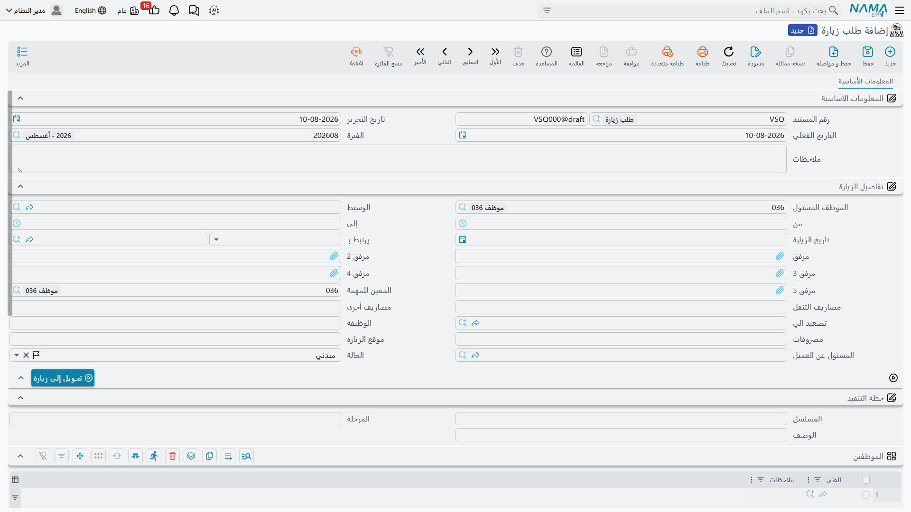

# طلبات الزيارة (CRM Visit Request)

::: info الترخيص المطلوب
`crm`. والشاشة في **خدمة العملاء > الدعم > طلب زيارة**.
:::

طلب الزيارة ورقة تقول: *ينبغي أن يذهب أحدهم ويرى هذا العميل*. تحمل من ومتى وأين وأي فنيين وكم يُتوقع
أن تكلّف — ثم تنتظر إنساناً يتصرف بناءً عليها.

ويجدر أن نكون صريحين في ما ليست هي، لأن الاسم يوحي بغير الحقيقة. فهذا **ليس** مستند طلب واعتماد. لا
شيء يراجعه، ولا شيء يعتمده، ولا شيء يعلّمه بأنه عولج، ولا يتحول إلى زيارة من تلقاء نفسه. اعتبره
**قالب تعبئة مسبقة**: مكاناً مرتباً تُدوَّن فيه زيارة مخططة حتى لا يضطر من ينشئ الزيارة الحقيقية إلى
جمع التفاصيل من جديد.

وهو كالزيارة لا يحتاج توجيهاً — دفتر وكود يكفيان — وليس له أثر محاسبي ولا مخزني.

## ما الذي فيه

الشاشة تبويب واحد، وهي كتلة *تفاصيل الزيارة* من شاشة [الزيارة](/ar/modules/crm/activities/crm-visits)
بعد نزع الأجزاء التي لا معنى لها إلا بعد وقوع الزيارة. فتجد الموظف المسئول والوسيط والمسند إليه وحقل
التصعيد والوظيفة ووقتي البدء والانتهاء وتاريخ الزيارة ومكانها والعنوان وممثل العميل والحالة والحقول
المالية الثلاثة وكتلة **خطة التنفيذ** وجدول **الموظفين** وجدول ملاحظات.

وما هو غائب عمداً بالمقارنة مع الزيارة: تكلفة الزيارة، وحالة السداد، والإحداثيات، والتوقيعات، والأذرع
الأربعة التي تكتب في خيط البيع. فطلب الزيارة لا يستطيع تغيير حالة خيط بيع — الاتصالات والزيارات وحدها
تفعل ذلك.

::: info حقول موجودة لكنها لا تعمل هنا
حقول خطة عمل خيط البيع (تغيير الحالة إلي، وتحديث التصنيف إلي، ونوع النشاط التالي، وسبب الرفض الجديد)
ما زالت موجودة خلف الكواليس لأن الطلب يتشارك بنيته مع الزيارة، وهي محذوفة من الشاشة عن صواب. فإن
أعادها موقعٌ بمُعدِّل شاشة، أو ملأها عبر استيراد، فلن يحدث شيء — فهذا المستند بلا سلوك كتابة عكسية.
:::

## زر التحويل إلى زيارة

زر واحد: **تحويل إلى زيارة**. ضغطه يفتح **زيارة جديدة غير محفوظة** في نافذة منبثقة، مملوءة من الطلب
بـ: الموضوع (يرتبط بـ)، وحقل التصعيد، وتاريخ الزيارة، ووقتي البدء والانتهاء، ومكان الزيارة، والوظيفة،
والحقول المالية الثلاثة، والموظف المسئول، والوسيط، وممثل العميل، والحالة، إضافة إلى سطور الملاحظات
وسطور الموظفين منسوخة سطراً بسطر.

ثم يصبح الأمر إليك: راجعها وأكملها واحفظها.

::: warning لا توجد خطوة اعتماد، والطلب لا يُستهلك أبداً
الزر يفتح نافذة منبثقة ولا يفعل غير ذلك. لا يحفظ الزيارة، ولا يكتب رابطاً من الزيارة إلى الطلب، ولا
يعلّم الطلب ولا يغلقه ولا يضع عليه أي إشارة — فليس في طلب الزيارة حالة "تم التحويل" تُضبط أصلاً.

ومعنى ذلك:

- **اضغطه مرتين تحصل على زيارتين لا صلة بينهما** من طلب واحد. واضغطه خمساً تحصل على خمس. ولا شيء
  يعترض.
- **الطلب المستخدَم يبدو تماماً كالطلب غير المستخدَم.** فليس هناك عمود ولا علامة ولا حالة تفلتر بها
  شاشة القائمة.
- **ومن الزيارة لا سبيل للرجوع** إلا أن يضبط أحدهم حقل **بناءا على** في الزيارة بيده.

فإن كان موقعك يعتمد على طلبات الزيارة، فاتفقوا على عرف يدوي — ملاحظة، أو قيمة حالة يصونها موظفوكم
بأنفسهم، أو مسار كيان — والتزموا به. فالمنتج لن يحصي ذلك نيابة عنكم.
:::

وثمة حقول لا تنجو من الرحلة أيضاً: تكلفة الزيارة والعنوان وحالة السداد والمرفقات وكتلة خطة التنفيذ لا
تُنقل. وضبط حقل **بناءا على** في الزيارة وتوجيهه إلى الطلب ينسخ مجموعة مختلفة اختلافاً طفيفاً — فقد
بُني المساران على حدة — ولهذا يُستحسن اعتماد طريق واحد باستمرار بدل الخلط بينهما.

وفي المثال العملي حُرِّر `VREQ-0044` في ٢٤ مارس ٢٠٢٦ لزيارة تشغيل تجريبي يوم ٢٦ مارس. وضُغط زر التحويل
إلى زيارة مرة واحدة فأنتج `VISIT-0131` التي حفظتها هالة بيدها. أما `VREQ-0044` نفسه فما زال جالساً
اليوم كما كان تماماً قبل ضغط الزر.

## من أين تأتي طلبات الزيارة

من هذه الشاشة وحدها. **لا شيء في المنتج ينشئ طلب زيارة** — لا خطة عمل، ولا خيط بيع، ولا بلاغ عطل، ولا
مستند صيانة. بل يكتبه أحدهم.

ولا تفترض أن التطبيق المحمول يستطيع تحرير طلب زيارة؛ فهذا المسار غير مؤكد، وشاشة الزيارات في التطبيق
مبنية حول مستند الزيارة. حرّر طلبات الزيارة من شاشة الويب.

## ما لن يمنعك النظام منه

لا شيء. فالحقول الإلزامية هي الدفتر والكود والمحددات، والموظف في السطر إن أضفت سطراً إلى جدول
الموظفين. وطلب بلا موضوع ولا تاريخ ولا مكان يُرحَّل بلا اعتراض.

**التقارير: لا يوجد.** لا تحتوي الوحدة على أي تقرير نظام، وهذه الشاشة ليس لها نموذج طباعة. استخدم شاشة
قائمة طلبات الزيارة بفلاترها وتصديرها إلى إكسل.
