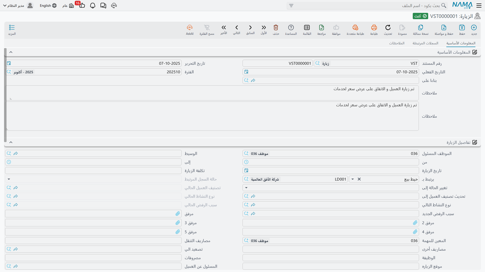

# الزيارات (CRM Visit)

::: info الترخيص المطلوب
`crm`. وشاشة الزيارة في **خدمة العملاء > الدعم > الزيارة**.
:::

الزيارة توأم الاتصال. تسجّل أن أحدهم ذهب إلى مكان ما — وهي، تماماً مثل
[الاتصال](/ar/modules/crm/activities/crm-calls)، تدفع حالة جديدة وتصنيفاً جديداً ونوع نشاط تالياً
وسبب رفض إلى خيط البيع أو الفرصة المسجَّلة عليه. وهاتان الشاشتان هما الموضعان الوحيدان في خدمة العملاء
اللذان يغيّر فيهما ترحيل مستند حالة سجل آخر.

وتضيف الزيارة ثلاثة أشياء لا يملكها الاتصال: جدول **الموظفين**، فتحمل زيارة الموقع الفني الذي رافق
المندوب؛ و**تسجيل حضور وانصراف من التطبيق المحمول** بإحداثيات وتوقيعات؛ ونموذج الطباعة الوحيد في
الوحدة.

وهي كالاتصال **لا تحتاج توجيهاً** — دفتر وكود فقط — وليس لها أثر محاسبي ولا مخزني من أي نوع.

## الشاشة

يفتح التبويب الأول بكتلة المستند المعتادة: كود المستند وتاريخ الإصدار وتاريخ القيمة والفترة المالية
وحقل **بناءا على** (From Document) والوصف.

::: info حقلا وصف اثنان
يظهر الوصف مرتين على هذه الشاشة، وكلاهما مرتبط بالحقل نفسه. اكتب في أيهما شئت؛ فهما صندوق واحد معروض
مرتين.
:::

ثم تأتي كتلة **تفاصيل الزيارة**، وفيها العمل الحقيقي:

| مجموعة الحقول | ماذا يوضع فيها |
|---|---|
| الموظف المسئول، المسند إليه، الوسيط، تصعيد الي، الوظيفة | من يملك الزيارة |
| من، إلى، تاريخ الزيارة | متى |
| مكان الزيارة، العنوان، ممثل العميل | أين، ومن استقبلك |
| يرتبط بـ، وحقول خيط البيع الستة | الموضوع وآلة الحالات — انظر أدناه |
| المصروف، مصروف آخر، مصروف الانتقالات، تكلفة الزيارة، حالة السداد | حقول مالية — انظر التحذير أدناه |
| الحالة | تسمية حرة؛ لا شيء يفرض أي انتقال |
| الموقع على الخريطة (مرتين)، رقم المبني (مرتين)، توقيع العميل، توقيع الموظف، المرفقات ١…٥ | يملؤها التطبيق المحمول — انظر أدناه |

و**الحالة** تستخدم قائمة القيم نفسها التي يستخدمها بلاغ العطل (مبدئي، مسند، قيد التنفيذ، ملغي، مغلقة،
منتهي، تم التنفيذ، مؤجل، معاد فتحه، طلب تطوير، بانتظار رد العميل، خارج الضمان). وتبدأ عند *مبدئي* ثم
هي حرة تماماً — لا قواعد انتقال ولا قارئ لها. وأحد بنود تلك القائمة بلا ترجمة في أي من اللغتين فيظهر
بمفتاحه الخام؛ تجاهله.

وكتلة **خطة التنفيذ** — المسلسل، والمرحلة أو الدورة، والوصف — لا معنى لها إلا حين يكون الموضوع مشروع
خدمة عملاء. فهناك يقترح حقل المسلسل سطور التجهيز والتدريب في المشروع، واختيار أحدها يملأ المرحلة
والوصف. أما مع أي موضوع آخر فالكتلة لا تفعل شيئاً.

وتحتها جدول **الموظفين** (فني وملاحظة في كل سطر — والموظف هو الحقل الإلزامي الوحيد حقاً في الشاشة
كلها)، وجدول ملاحظات ثانٍ بعمود واحد عنوانه بلا ترجمة فيظهر بمفتاحه الخام. أما تبويب **الملاحظات**
فيحمل ثلاثة جداول نصية حرة: ملاحظات العميل، وملاحظات الفني، وملاحظات المشرف. وهي ثلاثة سجلات تعليقات
متوازية لا يقرأ أياً منها شيء.

::: warning الحقول المالية في الزيارة لا تصل إلى شيء
**المصروف** و**مصروف آخر** و**مصروف الانتقالات** و**تكلفة الزيارة** و**حالة السداد** حقول حرة. لا
تُجمع أبداً، ولا تُقارَن ببعضها، ولا تصل إلى المحاسبة ولا إلى الرواتب ولا إلى أي إجراء صرف. فإن كنت
تحتاج صرف مصروفات الزيارات فاصرفها من مسارها المعتاد — فهذه الشاشة لن تفعلها لك.
:::

## ماذا تكتب الزيارة على خيط البيع

اختر خيط بيع أو فرصة في **يرتبط بـ** فتمتلئ الحقول الأربعة "الحالية" من ذلك السجل بوصفها صورة ما قبل.
ثم تكتب أربعة أذرع في الخيط عند ترحيل الزيارة:

| الذراع في الزيارة | ما الذي يستبدله في خيط البيع أو الفرصة |
|---|---|
| **تغيير الحالة إلي** (Change Status To) | الحالة |
| **تحديث تصنيف العميل المرتقب إلي** (Update Lead Classification To) | تصنيف العميل المرتقب |
| **نوع النشاط التالي** (Next Activity Type) | نوع النشاط |
| **سبب الرفض الجديد** (New Rejection Reason) | سبب الرفض |

والذراع الوحيد الذي في الاتصال وليس في الزيارة هو تاريخ معاودة الاتصال المخطط؛ فسلسلة المعاودة تخص
شاشة الاتصال وحدها.

و`VISIT-0118` هو المثال: ١٩ يناير ٢٠٢٦، من ١١:٠٠ إلى ١٣:٠٠، هالة (`EMP-1042`) ومعها الفني محمود
(`EMP-2011`) في جدول الموظفين، ومكان الزيارة *فندق مارينا بلازا – الإسكندرية*. وعند الترحيل تضبط الخيط
`LD-00417` على **دافئ** ونوع نشاطه التالي على `AT-03` عرض فني. ولم يحرّر أحد الخيط.

::: warning إلغاء الزيارة لا يتراجع عما فعلته
كما في الاتصال، الكتابة العكسية باتجاه واحد. ألغِ زيارة جعلت خيطاً دافئاً يبقَ الخيط دافئاً. لا قيمة
سابقة محفوظة ولا تراجع. صحّح الخيط بيدك.
:::

وقد يكون الموضوع بلاغ عطل أو شكوى أو عميلاً أو حملة أو مشروعاً أو طلب تطوير — وعندئذ تكون الزيارة
سجلاً بسيطاً ولا تفعل الأذرع شيئاً.

## الزيارات من الهاتف

حيث يُستخدم تطبيق نما المحمول لا يفتح الفنيون هذه الشاشة أصلاً — التطبيق يفتحها. فيسجّل الفني حضوره
عند الوصول وانصرافه عند المغادرة، ويستقبل النظام:

- **إحداثيات الوصول** وعنواناً مستخرجاً منها، تُكتب في أول زوج من "الموقع على الخريطة" و"رقم المبني"؛
- **إحداثيات المغادرة** وعنوانها، تُكتب في الزوج الثاني؛
- **وقت البدء** عند الحضور و**وقت الانتهاء** عند الانصراف؛
- **توقيع العميل** و**توقيع الموظف**، محفوظين كمرفقات صور؛
- **حالة** الزيارة كما ضبطها التطبيق آخر مرة.

وهذا سجل مفيد فعلاً: أين كان الفني، ومتى، وتوقيعان يثبتان أن العميل قبل العمل.

::: danger تسجيل الحضور لا يكشف موقعاً مزيَّفاً
يرسل التطبيق إشارات تقول ما إذا كان يعتقد أن الجهاز يبلّغ بموقع وهمي، ويرسل دقة تحديد الموقع لكل قراءة.
**ولا يحتفظ الخادم بأي منها.** فهي تُستقبَل ثم تُطرح، وليس في الزيارة موضع لتخزينها.

والنتيجة العملية: زيارة سُجِّلت بتطبيق يزيّف الموقع لا تُميَّز عن زيارة حقيقية، وليس هناك حقل يستطيع
المشرف مراجعته. فلا تقدّم تسجيل الحضور على أنه إثبات تواجد، ولا تبنِ عليه سياسة. وإن كانت سلامة الموقع
مهمة عندك فمعالجتها تكون خارج هذا المستند.
:::

وبضعة أمور أخرى تستحق المعرفة قبل الاعتماد على أرقام التطبيق:

- **تاريخ الزيارة ووقت البدء يُعاد كتابتهما مع كل مزامنة** حتى يُسجَّل الانصراف. فالزيارة التي تُزامَن
  صباح اليوم التالي تُختم بتاريخ المزامنة، ويظل وقت الوصول ينزلق إلى الأمام حتى يُغلقه الانصراف.
- **حين يعجز الهاتف عن تحديد الموقع** يُخزَّن حقل الموقع على الخريطة كنص حرفي `null,null` بدل أن يبقى
  فارغاً.
- **حقلا "الموقع على الخريطة" يحملان التسمية نفسها**، وكذلك حقلا "رقم المبني" — فلا إشارة على الشاشة
  إلى أيهما للوصول وأيهما للمغادرة. الأول من كل زوج للوصول والثاني للمغادرة. و"رقم المبني" تسمية
  مضلِّلة: فما يضعه التطبيق فيها هو العنوان الكامل المستخرج من الإحداثيات.
- **خيار "لا تسمح بزيارة جديدة إذا كان هناك زيارة مفتوحة"** في إعدادات التطبيق المحمول يُطبَّق
  **بالهاتف وحده**. ولا يفحصه الخادم أبداً، فالزيارة المنشأة من شاشة الويب أو من استيراد أو من خدمة
  ويب أو من نسخة أقدم من التطبيق لا تتأثر به. فعامله على أنه تسهيل في التطبيق لا ضابط.
- لا تفترض أن التطبيق يستطيع إنشاء **طلب زيارة** — فهذا المسار غير مؤكد. حرّر طلبات الزيارة من شاشة
  الويب.

## نموذج الطباعة

الزيارة هي المستند الوحيد في قائمة خدمة العملاء كلها الذي له نموذج طباعة جاهز: **`SYSF-CRM001`**،
المحفوظ تحت *18. Customer Relationship Management*. يطبع كود الزيارة وتواريخها ووقتي بدايتها ونهايتها
وتفاصيلها، وهو ما يتركه الفني عند العميل أو يحفظه المشرف.

**التقارير: لا يوجد.** لا تحتوي الوحدة على أي تقرير نظام ولا أي لوحة معلومات؛ ونموذج الطباعة هذا هو
القصة كلها. انظر [التقارير والنماذج المطبوعة](/ar/modules/crm/crm-reports-and-forms) لما تستخدمه بدلاً
من ذلك — شاشات القوائم والتصدير إلى إكسل وذكاء الأعمال.

## من أين تأتي الزيارات

يمكن كتابة الزيارة من الصفر، لكنها تصل عادةً بإحدى ثلاث طرق:

1. **مُنشأة بالجملة من [خطة عمل](/ar/modules/crm/activities/crm-work-plans).** علّم سطور الزيارات في
   الخطة واضغط زر الإنشاء، فتظهر زيارة مرحَّلة واحدة لكل سطر، مرتبطة في الاتجاهين. وهكذا جاءت
   `VISIT-0118` من `WPLAN-0026`.
2. **محوَّلة من [طلب زيارة](/ar/modules/crm/activities/crm-visit-requests).** يفتح الطلب زيارة مملوءة
   مسبقاً لكن غير محفوظة، تحفظها أنت. وهكذا جاءت `VISIT-0131` من `VREQ-0044` في ٢٦ مارس ٢٠٢٦.
3. **من شاشة خيط البيع أو الفرصة**، بزر إنشاء زيارة، فتفتح نافذة منبثقة والموضوع مضبوط فيها.

وإذا وجّهت حقل **بناءا على** في الزيارة إلى طلب زيارة أو إلى زيارة أقدم بيدك، نُسخت المجموعة نفسها من
الحقول: الموضوع والتواريخ والأوقات والمكان والوظيفة والحقول المالية والموظف المسئول والوسيط وممثل
العميل والحالة، إضافة إلى سطور الملاحظات وسطور الموظفين.

## ما لن يمنعك النظام منه

لا شيء على الإطلاق. فزيارة بلا موضوع ولا تاريخ ولا سطور موظفين تُرحَّل بلا اعتراض؛ والحقول الإلزامية
هي الدفتر والكود والمحددات، والموظف في كل سطر تضيفه إلى جدول الموظفين. وإن كان موقعك يشترط ملء تقرير
الزيارة قبل الترحيل فذلك مسار كيان أو تعريف اعتماد، لا قاعدة جاهزة.
