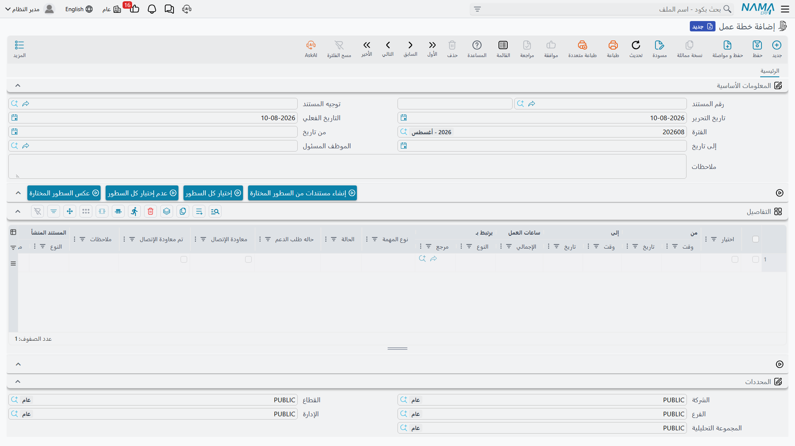

# خطط العمل (CRM Work Plan)

::: info الترخيص المطلوب
`crm`. والشاشة في **خدمة العملاء > الدعم > خطة عمل**.
:::

كل ما عدا هذه الشاشة في مجموعة الأنشطة يسجّل عملاً وقع بالفعل. أما خطة العمل فهي المستند الوحيد الذي
**يُنشئ** العمل: يُدرج المشرف اتصالات الأسبوعين القادمين في جدول، ويعلّم ما يريد إطلاقه، ويضغط زراً
واحداً، فيظهر [اتصال](/ar/modules/crm/activities/crm-calls) أو [زيارة](/ar/modules/crm/activities/crm-visits)
مرحَّل لكل سطر معلَّم — مرتبط بالسطر الذي أنتجه.

وهذا مفيد فعلاً، وهو أقرب شيء إلى الجدولة في خدمة العملاء. ويستحق أيضاً أن نعرف من البداية أين تنتهي
الفائدة: خطة العمل **قائمة إطلاق**، لا تقرير مقارنة بين المخطط والفعلي. وتفصيل ذلك أدناه.

## اضبط التوجيه أولاً

خطة العمل هي المستند الوحيد في هذه المجموعة الذي **يحتاج توجيه مستند**، والتوجيه ليس زينة — بل هو ما
يخبر آلية الإنشاء بالدفتر الذي تُقيَّد فيه الاتصالات والزيارات الجديدة. وللتوجيه تبويب إعدادات واحد
بأربعة حقول:

| الحقل | ماذا يحدد |
|---|---|
| **دفتر سند إتصال** (Call Document Book) | الدفتر الذي يُقيَّد فيه كل اتصال مُنشأ |
| **توجيه سند إتصال** (Call Document Term) | التوجيه الذي يُختم به كل اتصال مُنشأ |
| **دفتر سند زيارة** (visit Document Book) | الدفتر الذي تُقيَّد فيه كل زيارة مُنشأة |
| **توجيه سند زيارة** (visit Document Term) | التوجيه الذي تُختم به كل زيارة مُنشأة |

وفي المثال العملي تُقيَّد الخطة في الدفتر `WPLAN` بالتوجيه `T-WPLAN-STD`، الذي يسمّي الدفتر `CALL`
للاتصالات والدفتر `VISIT` للزيارات.

::: warning غياب الدفتر يوقف نصف عملية الإنشاء
إذا كان أحد السطور المعلَّمة سطر اتصال ولم يكن في التوجيه دفتر سند إتصال، فشلت العملية برسالة تطلب منك
اختيار الدفتر في التوجيه. والأمر نفسه في سطور الزيارات ودفتر الزيارة. وهذا فشل ظاهر لا صامت — لكنه سهل
الوقوع يوم التشغيل، فاضبط الدفترين قبل أن يحرر أحد خطة. انظر
[كيف تعمل توجيهات مستندات خدمة العملاء](/ar/modules/crm/document-terms/crm-terms-basics).
:::

## الشاشة

الرأس قصير: كود المستند و**التوجيه** وتاريخ الإصدار وتاريخ القيمة والفترة المالية و**من تاريخ**
و**إلى تاريخ** و**الموظف المسئول** والوصف. ويصف التاريخان الفترة التي تغطيها الخطة؛ ولا شيء يفحصهما
أحدهما مقابل الآخر ولا مقابل تواريخ السطور.

وما عدا ذلك هو جدول **التفاصيل**، سطر لكل اتصال مخطط:

| العمود | لماذا هو |
|---|---|
| **اختيار** | علّم السطور التي تريد إطلاقها الآن |
| **من تاريخ / من وقت**، **إلى تاريخ / إلى وقت** | موعد الاتصال المخطط |
| **عدد ساعات العمل \| الصافي** | يُحسب من الأعمدة الأربعة أعلاه |
| **يرتبط بـ** | مع من: خيط بيع أو فرصة أو مشروع أو حملة أو بلاغ عطل أو شكوى أو عميل أو طلب تطوير |
| **نوع المهمة** | **مكالمة** أو **زيارة** — وهذا ما يحدد أي مستند يُنتجه السطر |
| **حالة البلاغ**، **سجل معاودة الاتصال**، **تم معاودة الاتصال** | قيم تُدفع إلى المستند المُنشأ |
| **الحالة** | انظر الملاحظة أدناه |
| **الوصف** | يُنسخ إلى المستند المُنشأ |
| **المستند المنشأ** | يملؤه النظام بعد أن يُنتج السطر مستنده |

وثلاثة أزرار مساعدة فوق الجدول — **إختيار كل السطور** و**عدم إختيار كل السطور** و**عكس السطور
المختارة** — تضع علامة الاختيار أو ترفعها أو تعكسها، وهو ما يوفّر نقرات كثيرة في خطة من خمسين سطراً.

::: info عمود "الحالة" في السطر لا يفعل شيئاً
ضبط سطر على *منتهي* لا يغيّر شيئاً في أي مكان، ولا يُقرأ أبداً من المستند المُنشأ. فإن أردت أن تعرف
هل تم الاتصال المخطط، فانظر عمود **المستند المنشأ** في السطر وافتحه.
:::

## إنشاء المستندات

1. ابنِ الخطة: الفترة، والموظف المسئول، وسطر لكل اتصال مخطط بموضوعه ونافذته الزمنية ونوع مهمته
   (مكالمة أو زيارة).
2. علّم السطور التي أنت مستعد لإطلاقها. ولست مضطراً لإطلاق الخطة كلها دفعة واحدة — فيمكن الإنشاء من
   الخطة مراراً مع تقدم الأسبوعين.
3. اضغط **إنشاء مستندات من السطور المختارة**.
4. ولكل سطر معلَّم يُنشئ النظام اتصالاً أو زيارة، ويقيّده في الدفتر والتوجيه المسمَّيين في توجيه
   الخطة، وينسخ الموظف المسئول من الخطة، وينسخ من السطر موضوعه ووصفه وحالة البلاغ وعلامات المعاودة
   والأعمدة الإضافية، ثم **يرحّله**، ويكتبه في عمود **المستند المنشأ** في السطر.
5. وإذا كان للسطر مستند مُنشأ من قبل، أُعيد فتحه وتحديثه بدل تكراره — فالضغط على الزر مرتين لا يُنتج
   اتصالين للسطر نفسه.

وفي المثال العملي تحمل `WPLAN-0026` — *خطة اتصالات يناير – مارينا بلازا*، من ١٢ إلى ٣١ يناير ٢٠٢٦،
والموظف المسئول هالة (`EMP-1042`) — سطرين على الخيط `LD-00417`:

| السطر | نوع المهمة | من | إلى | الصافي | المُنشأ |
|---|---|---|---|---|---|
| ١ | مكالمة | 2026-01-14 09:00 | 2026-01-14 09:20 | 0:20 | `CALL-0342` |
| ٢ | زيارة | 2026-01-19 11:00 | 2026-01-19 13:00 | 2:00 | `VISIT-0118` |

عُلِّم السطران وضُغط الزر مرة واحدة، فوصل المستندان مرحَّلين ومرتبطين في الاتجاهين. ثم فتحت هالة كلاً
منهما وسجّلت ما جرى فعلاً — بما في ذلك الأذرع التي حرّكت حالة الخيط.

::: warning الإنشاء بلا سطور معلَّمة يُبلغ بالنجاح
إن ضغطت الزر دون أن تعلّم سطراً واحداً، ظهرت لك رسالة نجاح ولم يُنشأ أي مستند. ولا شيء ينبّهك. فراجع
عمود "المستند المنشأ" قبل أن تنصرف.
:::

::: warning عمودان يسقطان بحسب نوع السطر
**سجل معاودة الاتصال** و**تم معاودة الاتصال** المكتوبان في سطر **زيارة** يضيعان — فليس في الزيارة هذا
المفهوم. و**حالة البلاغ** المكتوبة في سطر **مكالمة** تضيع أيضاً. فاملأ علامتي المعاودة في سطور
المكالمات وحدها، وحالة البلاغ في سطور الزيارات وحدها.
:::

## الرابط العكسي وكيف يبقى محدَّثاً

الرابط يسير في الاتجاهين. فسطر الخطة يشير إلى **المستند المنشأ**، والزيارة تعرض الخطة في حقل **بناءا
على**. (أما شاشة الاتصال فتسجّل الرابط نفسه ولا تعرضه — فمن اتصال مُنشأ لا سبيل على الشاشة لمعرفة أي
خطة أنتجته.)

وتعديل اتصال أو زيارة مُنشأة وإعادة ترحيلها يحدّث سطر الخطة المقابل: فيُنسخ إليه الموضوع والوصف
وعلامات المعاودة وحالة البلاغ والأعمدة الإضافية. وإلغاء المستند المُنشأ يفرّغ عمود "المستند المنشأ" في
السطر، فيتحرر السطر ليُنشأ منه مرة أخرى — وهي طريقة نظيفة لإعادة إطلاق اتصال سُجِّل بالخطأ.

::: info الاتصال المُنشأ حديثاً يحدّث سطره متأخراً ترحيلاً واحداً
الاتصال الذي أُنشئ للتو لا يدفع شيئاً إلى سطر خطته حتى يُعدَّل ويُرحَّل مرة ثانية. وهذا نادراً ما يهم
عملياً — فالسطر هو مصدر البيانات أصلاً — لكن إن بدا سطر الخطة قديماً بعد الإنشاء مباشرة فهذا سببه.
والزيارات لا تعاني هذه الظاهرة.
:::

## زرّا البدء والإنهاء، ولماذا لا توجد مقارنة بين المخطط والفعلي

في كل سطر زرّا **بدء** و**إنهاء**. فالبدء يختم السطر بتاريخ اللحظة ووقتها، والإنهاء يختم لحظة الانتهاء.

::: warning البدء والإنهاء يمحوان الخطة
فهما يكتبان في **الأعمدة الأربعة نفسها التي تحمل الخطة** — من تاريخ، من وقت، إلى تاريخ، إلى وقت. وليس
في سطر خطة العمل أعمدة "فعلية" منفصلة. فما إن يضغط المندوب "بدء" حتى يضيع وقت البدء المجدول ولا سبيل
لاستعادته.

ولهذا فإن خطة العمل **لا تستطيع** بنيوياً أن تعرض المخطط مقابل الفعلي. استخدمها بوصفها قائمة إطلاق: ما
ننوي فعله، وأي مستند أنتجته كل نية. وإن احتجت أرقام المخطط مقابل الفعلي فهي في
[خطط الأهداف](/ar/modules/crm/marketing/crm-target-plans)، التي تعدّ النشاط لكل موظف في كل شهر.
:::

وأمر صغير أخير عن الأوقات. فرقم **عدد ساعات العمل | الصافي** الذي تراه أثناء الكتابة يُحسب في المتصفح،
والرقم المخزَّن عند الحفظ يُحسب في الخادم بقاعدة مختلفة قليلاً: المتصفح يتجاهل "إلى تاريخ"، والخادم
يقرّب إلى نحو نصف دقيقة. وفي السطر العادي داخل اليوم الواحد يتفق الرقمان في حدود ثوانٍ. أما السطر الذي
يعبر منتصف الليل فيعرض في الجدول رقماً غير معقول حتى تحفظ، ثم يصحّح نفسه. فلا تطارد الفرق — احفظ واقرأ
القيمة المخزَّنة.

## ما لن يمنعك النظام منه

لا شيء غير دفاتر التوجيه. فتاريخا "من" و"إلى" لا يُفحصان أحدهما مقابل الآخر ولا مقابل تواريخ السطور؛
وخطة بلا سطور تُرحَّل بلا اعتراض؛ وسطر بلا موضوع يُرحَّل بلا اعتراض وسيُنتج مستنداً بلا موضوع.

**التقارير: لا يوجد.** لا تحتوي الوحدة على أي تقرير نظام، وهذه الشاشة ليس لها نموذج طباعة. غير أن شاشة
قائمة خطط العمل تتيح الفلترة بالموظف المسئول، وهي الطريقة المعتادة ليجد المشرف خططه؛ وما عدا ذلك
فالتصدير إلى إكسل أو ذكاء الأعمال.
